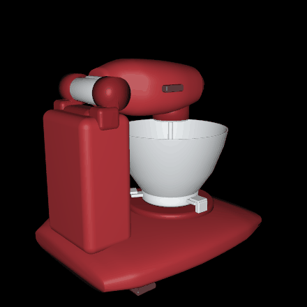
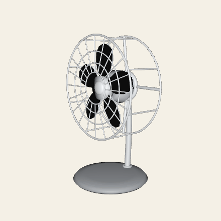

<h1 align="center">mini-articraft</h1>

mini-articraft is a small agent that turns a prompt into an articulated 3D object.

<p align="center">
  
  
</p>

The agent writes a Python model. It compiles and checks the geometry. It exports a posable USDZ
file. To make objects directly, read about the [mesh authoring SDK](docs/sdk.md). To understand
the generation loop, read the [agent design](docs/agent.md).

---

## Quickstart

### Install and run mini-articraft

Install the package and the development tools:

```shell
uv sync --group dev
```

Add your OpenAI API key to `.env`:

```shell
OPENAI_API_KEY=your_key_here
```

Generate an object:

```shell
uv run mini-articraft "a jet engine"
```

Each run is in the `runs/` directory. Open a completed run in the browser viewer:

```shell
uv run mini-articraft view runs/<run-id>
```

Use the viewer to examine each generated version and move its joints.

### Run the checks

```shell
uv run pytest -q
uv run ruff check .
```

## Docs

- [**Mesh authoring SDK**](docs/sdk.md)
- [**Agent design**](docs/agent.md)
- [**Examples**](examples)
- [**Repository guide**](AGENTS.md)

This repository has an [Apache 2.0 License](LICENSE).

<sub>This project is based on the [Articraft paper](https://arxiv.org/abs/2605.15187).</sub>
