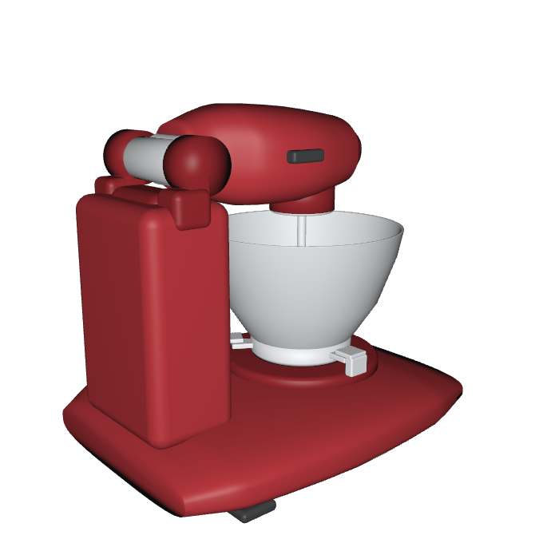
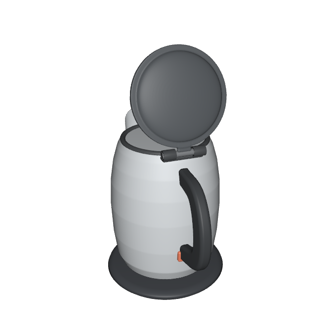
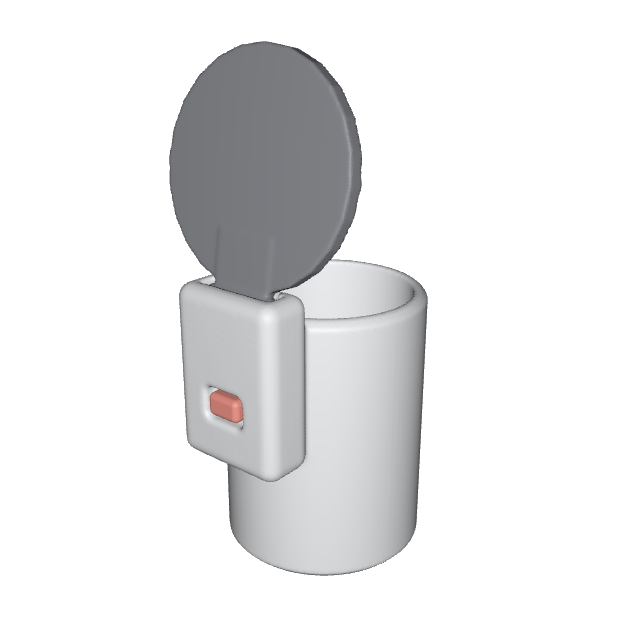

# mini-articraft

A small, readable agent that turns a sentence into an articulated 3D object.

```bash
uv run mini-articraft generate "a stand mixer with a tilting head and a bowl that twist-locks onto the base"
```

The agent researches the SDK docs, writes a Python build script, compiles it under a
battery of geometry checks, repairs what the compiler flags, and ships a posable USDZ —
real joints with limits, not a frozen mesh.

<p align="center">
  
  
  
</p>
<p align="center"><em>Single-prompt outputs (gpt-5.6, ~$1–3 each). Every joint you see actually articulates.</em></p>

## Why mini

This is the small sibling of articraft: one agent loop, plain tools (`read`, `edit`,
`write`, `exec`, `compile`), one settings file, and a codebase you can read in an
afternoon. There is no orchestration framework to learn — the whole generation story is
`agent/harness.py`, and everything the agent knows lives in a docs tree you can open.

## A mesh SDK where good attachment is one call

The historical failure mode of generated 3D is the *tacked-on* part: a handle grazing a
body at a tangent point, a hinge assembled from floating blocks. The SDK is built so the
easy path is the fused path:

```python
# Overlap the pieces, then weld: the bead fills the mismatch like filler
# metal, so parts never need to conform to the surface they join.
mug.add(weld(body, handle, radius=0.006), name="body_with_molded_handle")
```

- **`weld(*parts, radius, profile, max_gap, trim=)`** — exact boolean union with a
  generated blend at every seam; `trim=` keeps hollow interiors clean.
- **`smooth_difference`** — cuts with blended edges: spout mouths, slots, recesses.
- **Smooth lofts, variable sweeps, rounded caps** — curved forms without facet seams.
- **Product-form primitives** — `RoundedBoxGeometry`, `SuperellipsoidGeometry`, lathes,
  pipes: the shapes consumer products are actually made of.
- **Fast** — the weld pipeline is optimized and mesh data is cached; a fully welded
  multi-part example builds in seconds.

## The compiler is a design critic

`compile` does far more than build. Every run must pass connectivity (no floating
parts), overlap discipline, scale sanity, and **articulation-in-motion** checks — a
hinge that separates its child mid-swing fails the build. Each object also authors its
own `run_tests()` with pose-based assertions ("at an open pose the lid rises above the
rim"). Failures come back as structured signals the agent treats as design evidence,
and the repair loop runs until the object holds up.

## See it immediately

```bash
uv run mini-articraft view <run-id-or-path>
```

One command opens a browser viewer with joint sliders for every articulation, part
isolation, per-part coloring, and every numbered USDZ version from the run. Drag
`lid_hinge` and watch the lid swing.

## Agents learn from worked examples

The SDK docs ship *executable* examples (`docs/sdk/examples/`) — a molded mug handle, a
hollow shell, a mixed assembly — and the agent is pointed at the one closest to its
task. This is a deliberate design position backed by experience in this repo: a worked
example an agent can clone changes its output where prose instructions do not.

## Every run is inspectable and replayable

Runs land in a directory with the full conversation log, per-run cost and token
accounting, every compiled USDZ version, and `mini-articraft replay <run>` to re-render
the session. End-to-end agent tests run against recorded tapes, so CI exercises the
real loop offline and deterministically.

## Setup

Install the package and development tools:

```bash
uv sync --group dev
```

Add your OpenAI API key to `.env`:

```bash
OPENAI_API_KEY=your_key_here
```

Run the checks:

```bash
uv run pytest -q
uv run ruff check .
```

Run the SDK speed and mesh quality benchmark:

```bash
uv run python benchmarks/sdk_benchmark.py --suite extended
```

See [benchmarks/README.md](benchmarks/README.md) for saved comparisons and smaller suites.

## Run

Generate a model:

```bash
uv run mini-articraft generate "make a folding chair"
```

Inspect every numbered USDZ version from a run:

```bash
uv run mini-articraft view 20260713-175925-make-a-realistic-articulated-desk-lamp
```

Pass a run ID from the default output directory or a path to a run. The viewer opens in
your browser with version switching, part selection, and joint controls. It needs an
internet connection to load Three.js.
