<!-- BEGIN introduction.md -->

---
title: "Introduction"
source_html: "https://build123d.readthedocs.io/en/latest/introduction.html"
extracted_from: "official ReadTheDocs PDF"
pdf_release: "0.11.1.dev21+gbbce3cdd6"
pdf_pages: "7-13"
generated_on: "2026-07-01"
---

# Introduction

> Converted to Markdown from the official build123d ReadTheDocs PDF. PDF page markers and local extracted-image links are included for traceability. Some line wrapping reflects the PDF layout.
<!-- PDF page 7 -->

1.1 Introduction

1.1.1 Key Aspects

The following sections describe some of the key aspects of build123d and illustrate why one might choose this open
source system over proprietary options like SolidWorks, OnShape, Fusion 360, or even other open source systems like
Blender, or OpenSCAD.

Boundary Representation (BREP) Modelling

Boundary representation (BREP) and mesh-based CAD systems are both used to create and manipulate 3D models,
but they differ in the way they represent and store the models.

Advantages of BREP-based CAD systems (e.g. build123d & SolidWorks):

• Precision: BREP-based CAD systems use mathematical representations to define the shape of an object, which
allows for more precise and accurate modeling of complex shapes.

• Topology: BREP-based CAD systems maintain topological information of the 3D model, such as edges, faces
and vertices. This allows for more robust and stable modeling, such as Boolean operations.

• Analytical modeling: BREP-based CAD systems can take advantage of the topological information to perform
analytical operations such as collision detection, mass properties calculations, and finite element analysis.

• Features-based modeling: BREP-based CAD systems are often feature-based, which means that the model is built
by creating and modifying individual features, such as holes, fillets, and chamfers. This allows for parametric
design and easy modification of the model.

• Efficient storage: BREP-based CAD systems use a compact representation to store the 3D model, which is more
efficient than storing a large number of triangles used in mesh-based systems.

Advantages of Mesh-based CAD systems (e.g. Blender, OpenSCAD):

• Simplicity: Mesh-based CAD systems use a large number of triangles to represent the surface of an object, which
makes them easy to use and understand.

• Real-time rendering: Mesh-based CAD systems can be rendered in real-time, which is useful for applications
such as video games and virtual reality.

• Flexibility: Mesh-based CAD systems can be easily exported to other 3D modeling and animation software,
which makes them a good choice for use in the entertainment industry.

• Handling of freeform surfaces: Mesh-based systems are better equipped to handle freeform surfaces, such as
those found in organic shapes, as they do not rely on mathematical representation.

• Handling of large datasets: Mesh-based systems are more suitable for handling large datasets such as point
clouds, as they can be easily converted into a mesh representation.

<!-- PDF page 8 -->

Parameterized Models

Parametrized CAD systems are more effective than non-parametric CAD systems in several ways:

• Reusability: Parametrized CAD models can be easily modified by changing a set of parameters, such as the length
or width of an object, rather than having to manually edit the geometry. This makes it easy to create variations
of a design without having to start from scratch.

• Design exploration: Parametrized CAD systems allow for easy exploration of different design options by chang-
ing the parameters and quickly visualizing the results. This can save a lot of time and effort during the design
process.

• Constraints and relationships: Parametrized CAD systems allow for the definition of constraints and relationships
between different parameters. This ensures that the model remains valid and functional even when parameters
are changed.

• Automation: Parametrized CAD systems can be automated to perform repetitive tasks, such as generating de-
tailed drawings or creating parts lists. This can save a lot of time and effort and reduce the risk of errors.

• Collaboration: Parametrized CAD systems allow different team members to work on different aspects of a design
simultaneously and ensure that the model remains consistent across different stages of the development process.

• Document management: Parametrized CAD systems can generate engineering drawings, BOMs, and other doc-
uments automatically, which makes it easier to manage and track the design history.

In summary, parametrized CAD systems are more effective than non-parametric CAD systems because they provide a
more efficient and flexible way to create and modify designs, and can be easily integrated into the design, manufacturing,
and documentation process.

Python Programming Language

Python is a popular, high-level programming language that has several advantages over other programming languages:

• Readability: Python code is easy to read and understand, with a clear and consistent syntax. This makes it a great
language for beginners and for teams of developers who need to collaborate on a project.

• Versatility: Python is a general-purpose language that can be used for a wide range of tasks, including web
development, scientific computing, data analysis, artificial intelligence, and more. This makes it a great choice
for developers who need to work on multiple types of projects.

• Large community: Python has a large and active community of developers who contribute to the language and
its ecosystem. This means that there are many libraries and frameworks available for developers to use, which
can save a lot of time and effort.

• Good for data science, machine learning, and CAD: Python has a number of libraries such as numpy, pandas,
scikit-learn, tensorflow, and cadquery which are popularly used in data science and machine learning and CAD.

• High-level language: Python is a high-level language, which means it abstracts away many of the low-level details
of the computer. This makes it easy to write code quickly and focus on solving the problem at hand.

• Cross-platform: Python code runs on many different platforms, including Windows, Mac, and Linux, making it
a great choice for developers who need to write code that runs on multiple operating systems.

• Open-source: Python is an open-source programming language, which means it is free to use and distribute.
This makes it accessible to developers of all levels and budgets.

• Large number of libraries and modules: Python has a vast collection of libraries and modules that make it easy
to accomplish complex tasks such as connecting to web servers, reading and modifying files, and connecting to
databases.

<!-- PDF page 9 -->

Open Source Software

Open source and proprietary software systems are different in several ways: B Licensing: Open source software is
licensed in a way that allows users to view, modify, and distribute the source code, while proprietary software is closed
source and the source code is not available to the public.

• Ownership: Open source software is usually developed and maintained by a community of developers, while
proprietary software is owned by a company or individual.

• Cost: Open source software is typically free to use, while proprietary software may require payment for a license
or subscription. Customization: Open source software can be modified and customized by users and developers,
while proprietary software is typically not modifiable by users.

• Support: Open source software may have a larger community of users who can provide support, while proprietary
software may have a smaller community and relies on the company for support. Security: Open source software
can be audited by a large community of developers, which can make it more secure, while proprietary software
may have fewer eyes on the code and may be more vulnerable to security issues.

• Interoperability: Open source software may have better interoperability with other software and platforms, while
proprietary software may have more limited compatibility.

• Reliability: Open source software can be considered as reliable as proprietary software. It is usually used by
large companies, governments, and organizations and has been tested by a large number of users.

In summary, open source and proprietary software systems are different in terms of licensing, ownership, cost, cus-
tomization, support, security, interoperability, and reliability. Open source software is typically free to use and can be
modified by users and developers, while proprietary software is closed-source and may require payment for a license or
subscription. Open source software may have a larger community of users who can provide support, while proprietary
software may have a smaller community and relies on the company for support.

Source Code Control Systems

Most GUI based CAD systems provide version control systems which represent the CAD design and its history. They
allows developers to see changes made to the design over time, in a format that is easy to understand.

On the other hand, a source code control system like Git, is a command-line tool and it provides more granular control
over the code. This makes it suitable for more advanced users and developers who are comfortable working with
command-line interfaces. A source code control system like Git is more flexible and allows developers to perform
tasks like branching and merging, which are not easily done with a GUI version control system. Systems like Git have
several advantages, including:

• Version control: Git allows developers to keep track of changes made to the code over time, making it easy to
revert to a previous version if necessary.

• Collaboration: Git makes it easy for multiple developers to work on the same codebase simultaneously, with the
ability to merge changes from different branches of development.

• Backup: Git provides a way to backup and store the codebase in a remote repository, like GitHub. This can serve
as a disaster recovery mechanism, in case of data loss.

• Branching: Git allows developers to create multiple branches of a project for different features or bug fixes, which
can be easily merged into the main codebase once they are complete.

• Auditing: Git allows you to see who made changes to the code, when and what changes were made, which is
useful for auditing and debugging.

• Open-source development: Git makes it easy for open-source developers to contribute to a project and share their
work with the community.

• Flexibility: Git is a distributed version control system, which means that developers can work independently and
offline. They can then push their changes to a remote repository when they are ready to share them with others.

<!-- PDF page 10 -->

In summary, GUI version control systems are generally more user-friendly and easier to use, while source code control
systems like Git offer more flexibility and control over the code. Both can be used to achieve the same goal, but they
cater to different types of users and use cases.

Automated Testing

Users of source based CAD systems can benefit from automated testing which improves their source code by:

• Finding bugs: Automated tests can detect bugs in the code, which can then be fixed before the code is released.
This helps to ensure that the code is of higher quality and less likely to cause issues when used.

• Regression testing: Automated tests can be used to detect regressions, which are bugs that are introduced by
changes to the codebase. This helps to ensure that changes to the code do not break existing functionality.

• Documenting code behavior: Automated tests can serve as documentation for how the code is supposed to behave.
This makes it easier for developers to understand the code and make changes without breaking it.

• Improving code design: Writing automated tests often requires a good understanding of the code and how it is
supposed to behave. This can lead to a better design of the code, as developers will have a better understanding
of the requirements and constraints.

• Saving time and cost: Automated testing can save time and cost by reducing the need for manual testing. Auto-
mated tests can be run quickly and often, which means that bugs can be found and fixed early in the development
process, which is less expensive than finding them later.

• Continuous integration and delivery: Automated testing can be integrated into a continuous integration and
delivery (CI/CD) pipeline. This means that tests are run automatically every time code is committed and can be
integrated with other tools such as code coverage, static analysis and more.

• Improving maintainability: Automated tests can improve the maintainability of the code by making it easier to
refactor and change the codebase. This is because automated tests provide a safety net that ensures that changes
to the code do not introduce new bugs.

Overall, automated testing is an essential part of the software development process, it helps to improve the quality of
the code by detecting bugs early, documenting code behavior, and reducing the cost of maintaining and updating the
code.

Automated Documentation

The Sphinx automated documentation system was used to create the page you are reading now and can be used for user
design documentation as well. Such systems are used for several reasons:

• Consistency: Sphinx and other automated documentation systems can generate documentation in a consistent
format and style, which makes it easier to understand and use.

• Automation: Sphinx can automatically generate documentation from source code and comments, which saves
time and effort compared to manually writing documentation.

• Up-to-date documentation: Automated documentation systems like Sphinx can update the documentation auto-
matically when the code changes, ensuring that the documentation stays up-to-date with the code.

• Searchability: Sphinx and other automated documentation systems can include search functionality, which makes
it easy to find the information you need.

• Cross-referencing: Sphinx can automatically create links between different parts of the documentation, making
it easy to navigate and understand the relationships between different parts of the code.

• Customizable: Sphinx and other automated documentation systems can be customized to match the look and
feel of your company’s documentation.

• Multiple output formats: Sphinx can generate documentation in multiple formats such as HTML, PDF, ePub,
and more.

<!-- PDF page 11 -->

• Support for multiple languages: Sphinx can generate documentation in multiple languages, which can make it
easier to support international users.

• Integration with code management: Sphinx can be integrated with code management tools like Git, which allows
documentation to be versioned along with the code.

In summary, automated documentation systems like Sphinx are used to generate consistent, up-to-date, and searchable
documentation from source code and comments. They save time and effort compared to manual documentation, and
can be customized to match the look and feel of your company’s documentation. They also provide multiple output
formats, support for multiple languages and can be integrated with code management tools.

1.1.2 Advantages Over CadQuery

As mentioned previously, the most significant advantage is that build123d is more pythonic. Specifically:

Standard Python Context Manager

The creation of standard instance variables, looping and other normal python operations is enabled by the replacement
of method chaining (fluent programming) with a standard python context manager.

```python
# CadQuery Fluent API
pillow_block = (cq.Workplane("XY")
```

```python
    .box(height, width, thickness)
    .edges("|Z")
    .fillet(fillet)
    .faces(">Z")
    .workplane()
    ...
)
```

```python
# build123d API
with BuildPart() as pillow_block:
```

```python
    with BuildSketch() as plan:
```

```python
        Rectangle(width, height)
        fillet(plan.vertices(), radius=fillet)
    extrude(thickness)
    ...
```

The use of the standard with block allows standard python instructions to be inserted anyway in the code flow. One can
insert a CQ-editor debug or standard print statement anywhere in the code without impacting functionality. Simple
python for loops can be used to repetitively create objects instead of forcing users into using more complex lambda
and iter operations.

Instantiated Objects

Each object and operation is now a class instantiation that interacts with the active context implicitly for the user. These
instantiations can be assigned to an instance variable as with standard python programming for direct use.

```python
with BuildSketch() as plan:
    r = Rectangle(width, height)
    print(r.area)
    ...
```

<!-- PDF page 12 -->

Operators

New operators have been created to extract information from objects created previously in the code. The @ operator
extracts the position along an Edge or Wire while the % operator extracts the tangent along an Edge or Wire. The
position parameter are float values between 0.0 and 1.0 which represent the beginning and end of the line. In the
following example, a spline is created from the end of l5 (l5 @ 1) to the beginning of l6 (l6 @ 0) with tangents equal
to the tangents of l5 and l6 at their end and beginning respectively. Being able to extract information from existing
features allows the user to “snap” new features to these points without knowing their numeric values.

```python
with BuildLine() as outline:
```

```python
    ...
    l5 = Polyline(...)
    l6 = Polyline(...)
    Spline(l5 @ 1, l6 @ 0, tangents=(l5 % 1, l6 % 0))
```

Last Operation Objects

All of the vertices(), edges(), faces(), and solids() methods of the builders can either return all of the objects requested
or just the objects changed during the last operation. This allows the user to easily access features for further refinement,
as shown in the following code where the final line selects the edges that were added by the last operation and fillets
them. Such a selection would be quite difficult otherwise.

```python
from build123d import *
```

```python
with BuildPart() as pipes:
    box = Box(10, 10, 10, rotation=(10, 20, 30))
    with BuildSketch(*box.faces()) as pipe:
```

```python
        Circle(4)
    extrude(amount=-5, mode=Mode.SUBTRACT)
    with BuildSketch(*box.faces()) as pipe:
```

```python
        Circle(4.5)
        Circle(4, mode=Mode.SUBTRACT)
    extrude(amount=10)
    fillet(pipes.edges(Select.LAST), 0.2)
```

Extensions

Extending build123d is relatively simple in that custom objects or operations can be created as new classes without the
need to monkey patch any of the core functionality. These new classes will be seen in IDEs which is not possible with
monkey patching the core CadQuery classes.

Enums

All Literal strings have been replaced with Enum which allows IDEs to prompt users for valid options without having
to refer to documentation.

Selectors replaced by Lists

String based selectors have been replaced with standard python filters and sorting which opens up the full functionality
of python lists. To aid the user, common operations have been optimized as shown here along with a fully custom
selection:

```python
top = rail.faces().filter_by(Axis.Z)[-1]
...
```

<!-- PDF page 13 -->

```python
                                                                      (continued from previous page)
outside_vertices = filter(
```

```python
    lambda v: (v.Y == 0.0 or v.Y == height) and -width / 2 < v.X < width / 2,
    din.vertices(),
)
```


<!-- END introduction.md -->


<!-- BEGIN installation.md -->

---
title: "Installation"
source_html: "https://build123d.readthedocs.io/en/latest/installation.html"
extracted_from: "official ReadTheDocs PDF"
pdf_release: "0.11.1.dev21+gbbce3cdd6"
pdf_pages: "13-14"
generated_on: "2026-07-01"
---

# Installation

> Converted to Markdown from the official build123d ReadTheDocs PDF. PDF page markers and local extracted-image links are included for traceability. Some line wrapping reflects the PDF layout.
<!-- PDF page 13 -->

1.2 Installation

The recommended method for most users to install build123d is:

```python
>>> pip install build123d
```

Note

The ocp-vscode viewer has the ability to install build123d.

1.2.1 Install build123d from GitHub:

To get the latest non-released version of build123d one can install from GitHub using one of the following two com-
mands:

In Linux/MacOS, use the following command:

```python
>>> python3 -m pip install git+https://github.com/gumyr/build123d
```

In Windows, use the following command:

```python
>>> python -m pip install git+https://github.com/gumyr/build123d
```

If you receive errors about conflicting dependencies, you can retry the installation after having upgraded pip to the
latest version with the following command:

```python
>>> python3 -m pip install --upgrade pip
```

If you use poetry to install build123d, you can simply use:

```python
>>> poetry add build123d
```

However, if you want the latest commit from GitHub you might need to specify the branch that is used for git-based
installs; until quite recently, poetry used to checkout the master branch when none was specified, and this fails on
build123d that uses a dev branch.

Pip does not suffer from this issue because it correctly fetches the repository default branch.

If you are a poetry user, you can work around this issue by installing build123d in the following way:

```python
>>> poetry add git+https://github.com/gumyr/build123d.git@dev
```

Please note that always suffixing the URL with @dev is safe and will work with both older and recent versions of poetry.

<!-- PDF page 14 -->

1.2.2 Development install of build123d:

Warning: it is highly recommended to upgrade pip to the latest version before installing build123d, especially in
development mode. This can be done with the following command:

```python
>>> python3 -m pip install --upgrade pip
```

Once pip is up-to-date, you can install build123d in development mode with the following commands:

```python
>>> git clone https://github.com/gumyr/build123d.git
>>> cd build123d
>>> python3 -m pip install -e .
```

Please substitute python3 with python in the lines above if you are using Windows.

If you’re working directly with the OpenCascade OCP layer you will likely want to install the OCP stubs as follows:

```python
>>> python3 -m pip install git+https://github.com/CadQuery/OCP-stubs@7.7.0
```

1.2.3 Test your build123d installation:

If all has gone well, you can open a command line/prompt, and type:

```python
>>> python
>>> from build123d import *
>>> print(Solid.make_box(1,2,3).show_topology(limit_class="Face"))
```

Which should return something similar to:

```python
Solid        at 0x165e75379f0, Center(0.5, 1.0, 1.5)
    Shell    at 0x165eab056f0, Center(0.5, 1.0, 1.5)
            Face at 0x165b35a3570, Center(0.0, 1.0, 1.5)
            Face at 0x165e77957f0, Center(1.0, 1.0, 1.5)
            Face at 0x165b3e730f0, Center(0.5, 0.0, 1.5)
            Face at 0x165e8821570, Center(0.5, 2.0, 1.5)
            Face at 0x165e88218f0, Center(0.5, 1.0, 0.0)
            Face at 0x165eb21ee70, Center(0.5, 1.0, 3.0)
```

1.2.4 Adding a nicer GUI

If you prefer to have a GUI available, your best option is to choose one from here: External Tools and Libraries


<!-- END installation.md -->


<!-- BEGIN key_concepts.md -->

---
title: "Key Concepts"
source_html: "https://build123d.readthedocs.io/en/latest/key_concepts.html"
extracted_from: "official ReadTheDocs PDF"
pdf_release: "0.11.1.dev21+gbbce3cdd6"
pdf_pages: "14-19"
generated_on: "2026-07-01"
---

# Key Concepts

> Converted to Markdown from the official build123d ReadTheDocs PDF. PDF page markers and local extracted-image links are included for traceability. Some line wrapping reflects the PDF layout.
<!-- PDF page 14 -->

1.3 Key Concepts

The following key concepts will help new users understand build123d quickly.

1.3.1 Topology

Topology, in the context of 3D modeling and computational geometry, is the branch of mathematics that deals with
the properties and relationships of geometric objects that are preserved under continuous deformations. In the context
of CAD and modeling software like build123d, topology refers to the hierarchical structure of geometric elements
(vertices, edges, faces, etc.) and their relationships in a 3D model. This structure defines how the components of a
model are connected, enabling operations like Boolean operations, transformations, and analysis of complex shapes.
Topology provides a formal framework for understanding and manipulating geometric data in a consistent and reliable
manner.

<!-- PDF page 15 -->

The following are the topological objects that compose build123d objects:

```python
Vertex
```

A Vertex is a data structure representing a 0D topological element. It defines a precise point in 3D space, often
at the endpoints or intersections of edges in a 3D model. These vertices are part of the topological structure used
to represent complex shapes in build123d.

```python
Edge
```

An Edge in build123d is a fundamental geometric entity representing a 1D element in a 3D model. It defines the
shape and position of a 1D curve within the model. Edges play a crucial role in defining the boundaries of faces
and in constructing complex 3D shapes.

```python
Wire
```

A Wire in build123d is a topological construct that represents a connected sequence of Edges, forming a 1D
closed or open loop within a 3D model. Wires define the boundaries of faces and can be used to create complex
shapes, making them essential for modeling in build123d.

```python
Face
```

A Face in build123d represents a 2D surface in a 3D model. It defines the boundary of a region and can have
associated geometric and topological data. Faces are vital for shaping solids, providing surfaces where other
elements like edges and wires are connected to form complex structures.

```python
Shell
```

A Shell in build123d represents a collection of Faces, defining a closed, connected volume in 3D space. It acts
as a container for organizing and grouping faces into a single shell, essential for defining complex 3D shapes like
solids or assemblies within the build123d modeling framework.

```python
Solid
```

A Solid in build123d is a 3D geometric entity that represents a bounded volume with well-defined interior and
exterior surfaces. It encapsulates a closed and watertight shape, making it suitable for modeling solid objects
and enabling various Boolean operations such as union, intersection, and subtraction.

```python
Compound
```

A Compound in build123d is a container for grouping multiple geometric shapes. It can hold various types of
entities, such as vertices, edges, wires, faces, shells, or solids, into a single structure. This makes it a versatile
tool for managing and organizing complex assemblies or collections of shapes within a single container.

```python
Shape
```

A Shape in build123d represents a fundamental building block in 3D modeling. It encompasses various topo-
logical elements like vertices, edges, wires, faces, shells, solids, and compounds. The Shape class is the base
class for all of the above topological classes.

One can use the show_topology() method to display the topology of a shape as shown here for a unit cube:

```python
Solid                      at 0x7f94c55430f0, Center(0.5, 0.5, 0.5)
    Shell                  at 0x7f94b95835f0, Center(0.5, 0.5, 0.5)
        Face               at 0x7f94b95836b0, Center(0.0, 0.5, 0.5)
            Wire           at 0x7f94b9583730, Center(0.0, 0.5, 0.5)
                Edge       at 0x7f94b95838b0, Center(0.0, 0.0, 0.5)
                    Vertex at 0x7f94b9583470, Center(0.0, 0.0, 1.0)
                    Vertex at 0x7f94b9583bb0, Center(0.0, 0.0, 0.0)
                Edge       at 0x7f94b9583a30, Center(0.0, 0.5, 1.0)
                    Vertex at 0x7f94b9583030, Center(0.0, 1.0, 1.0)
                    Vertex at 0x7f94b9583e70, Center(0.0, 0.0, 1.0)
                Edge       at 0x7f94b9583770, Center(0.0, 1.0, 0.5)
                    Vertex at 0x7f94b9583bb0, Center(0.0, 1.0, 1.0)
                    Vertex at 0x7f94b9583e70, Center(0.0, 1.0, 0.0)
                Edge       at 0x7f94b9583db0, Center(0.0, 0.5, 0.0)
```

<!-- PDF page 16 -->

```python
                                                                      (continued from previous page)
                    Vertex at 0x7f94b9583e70, Center(0.0, 1.0, 0.0)
                    Vertex at 0x7f94b95862f0, Center(0.0, 0.0, 0.0)
...
```

```python
        Face               at 0x7f94b958d3b0, Center(0.5, 0.5, 1.0)
            Wire           at 0x7f94b958d670, Center(0.5, 0.5, 1.0)
                Edge       at 0x7f94b958e130, Center(0.0, 0.5, 1.0)
                    Vertex at 0x7f94b958e330, Center(0.0, 1.0, 1.0)
                    Vertex at 0x7f94b958e770, Center(0.0, 0.0, 1.0)
                Edge       at 0x7f94b958e630, Center(0.5, 1.0, 1.0)
                    Vertex at 0x7f94b958e8b0, Center(1.0, 1.0, 1.0)
                    Vertex at 0x7f94b958ea70, Center(0.0, 1.0, 1.0)
                Edge       at 0x7f94b958e7b0, Center(1.0, 0.5, 1.0)
                    Vertex at 0x7f94b958ebb0, Center(1.0, 1.0, 1.0)
                    Vertex at 0x7f94b958ed70, Center(1.0, 0.0, 1.0)
                Edge       at 0x7f94b958eab0, Center(0.5, 0.0, 1.0)
                    Vertex at 0x7f94b958eeb0, Center(1.0, 0.0, 1.0)
                    Vertex at 0x7f94b9592170, Center(0.0, 0.0, 1.0)
```

Users of build123d will often reference topological objects as part of the process of creating the object as described
below.

1.3.2 Location

A Location represents a combination of translation and rotation applied to a topological or geometric object. It
encapsulates information about the spatial orientation and position of a shape within its reference coordinate system.
This allows for efficient manipulation of shapes within complex assemblies or transformations. The location is typically
used to position shapes accurately within a 3D scene, enabling operations like assembly, and boolean operations. It’s an
essential component in build123d for managing the spatial relationships of geometric entities, providing a foundation
for precise 3D modeling and engineering applications.

The topological classes (sub-classes of Shape) and the geometric classes Axis and Plane all have a location prop-
erty. The Location class itself has position and orientation properties that have setters and getters as shown
below:

```python
>>> from build123d import *
>>> # Create an object and extract its location
>>> b = Box(1, 1, 1)
>>> box_location = b.location
>>> box_location
(p=(0.00, 0.00, 0.00), o=(-0.00, 0.00, -0.00))
>>> # Set position and orientation independently
>>> box_location.position = (1, 2, 3)
>>> box_location.orientation = (30, 40, 50)
>>> box_location.position
Vector: (1.0, 2.0, 3.0)
>>> box_location.orientation
Vector: (29.999999999999993, 40.00000000000002, 50.000000000000036)
```

Combining the getter and setter enables relative changes as follows:

```python
>>> # Relative change
>>> box_location.position += (3, 2, 1)
>>> box_location.position
```

<!-- PDF page 17 -->

Vector: (4.0, 4.0, 4.0)

There are also four methods that are used to change the location of objects:

• locate() - absolute change of this object

• located() - absolute change of copy of this object

• move() - relative change of this object

• moved() - relative change of copy of this object

Locations can be combined with the * operator and have their direction flipped with the - operator.

1.3.3 Selectors

When using a GUI based CAD system the user will often click on a feature to select it for some operation. How does a
user “click” when CAD is done entirely in code? Selectors are recipes for how to isolate a feature from a design using
python filter and sorting methods typically implemented as a set of custom python operations.

Quick Reference

The following tables describes the build123d selectors:

Selector Applicability                Description    Example

vertices() BuildLine, BuildSketch, BuildPart Vertex extraction part.vertices()
edges()  BuildLine, BuildSketch, BuildPart Edge extraction part.edges()
wires()  BuildLine, BuildSketch, BuildPart Wire extraction part.wires()
faces()  BuildSketch, BuildPart       Face extraction part.faces()
solids() BuildPart                    Solid extraction part.solids()

Operand      Method    Description               Example

Op-
era-
tor

part.faces() < Axis.Z

>      SortBy, Axis sort_by  Sort ShapeList by operand  part.vertices() > Axis.Z
<      SortBy, Axis sort_by  Reverse sort ShapeList by
operand

part.solids() >> Axis.X

>>     SortBy, Axis group_by Group ShapeList by operand and
return last value

part.faces() << Axis.Y

<<     SortBy, Axis group_by Group ShapeList by operand and
return first value

part.faces() | Axis.Z

|      Axis, Plane,
GeomType

filter_by Filter and sort ShapeList by
Axis, Plane, or GeomType

part.faces()[-2:]

[]                           Standard python list indexing
and slicing

Axis         fil-
ter_by_position

Filter ShapeList by Axis & mix /
max values

part.faces()..filter_by_position(Axis.Z,
1, 2, inclusive=(False, True))

The operand types are: Axis, Plane, SortBy, and GeomType. An Axis is a base object with an origin and a direction
with several predefined values such as Axis.X, Axis.Y, and Axis.Z; however, any Axis could be used as an operand
(e.g. Axis((1,2,3),(0.5,0,-0.5)) is valid) - see Axis for a complete description. A Plane is a coordinate system
defined by an origin, x_dir (X direction), y_dir (Y direction), and z_dir (Z direction). See Plane for a complete

<!-- PDF page 18 -->

description. Filtering by a Plane will return faces/edges parallel to it. SortBy and GeomType are python Enum class
described here:

```python
GeomType
```

BEZIER, BSPLINE, CIRCLE, CONE, CYLINDER, ELLIPSE, EXTRUSION, HYPERBOLA, LINE, OFFSET,
OTHER, PARABOLA, PLANE, REVOLUTION, SPHERE, TORUS

```python
SortBy
```

LENGTH, RADIUS, AREA, VOLUME, DISTANCE

ShapeList Class

The builders include methods to extract Edges, Faces, Solids, Vertices, or Wires from the objects they are building.
All of these methods return objects of a subclass of list, a ShapeList with custom filtering and sorting methods and
operations as follows.

Custom Sorting and Filtering

It is important to note that standard list methods such as sorted or filtered can be used to easily build complex selectors
beyond what is available with the predefined sorts and filters. Here is an example of a custom filters:

```python
with BuildSketch() as din:
```

```python
    ...
    outside_vertices = filter(
```

```python
        lambda v: (v.Y == 0.0 or v.Y == height)
        and -overall_width / 2 < v.X < overall_width / 2,
        din.vertices(),
    )
```

The filter_by() method can take lambda expressions as part of a fluent chain of operations which enables integration
of custom filters into a larger change of selectors as shown in this example:

```python
obj = Box(1, 1, 1) - Cylinder(0.2, 1)
faces_with_holes = obj.faces().filter_by(lambda f: f.inner_wires())
```

<!-- PDF page 19 -->

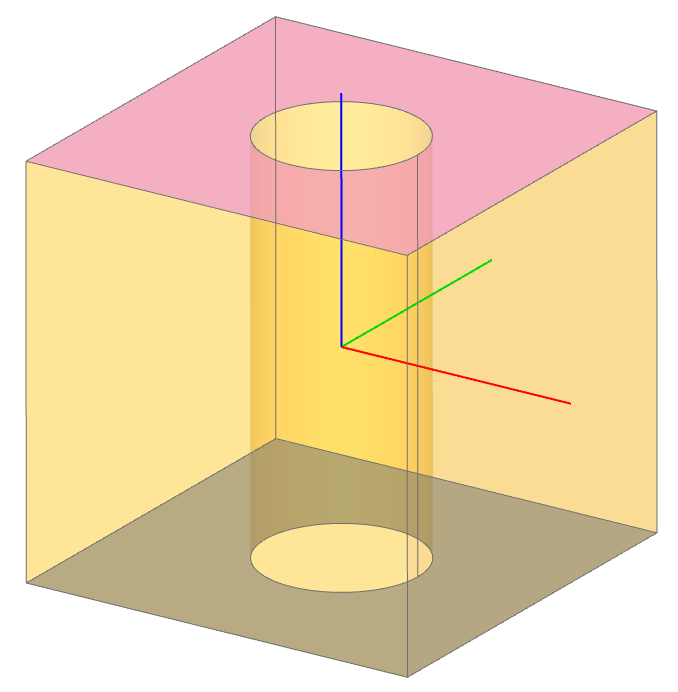

Here the two faces with “inner_wires” (i.e. holes) have been selected independent of orientation.


<!-- END key_concepts.md -->


<!-- BEGIN key_concepts_builder.md -->

---
title: "Key Concepts (builder mode)"
source_html: "https://build123d.readthedocs.io/en/latest/key_concepts_builder.html"
extracted_from: "official ReadTheDocs PDF"
pdf_release: "0.11.1.dev21+gbbce3cdd6"
pdf_pages: "19-26"
generated_on: "2026-07-01"
---

# Key Concepts (builder mode)

> Converted to Markdown from the official build123d ReadTheDocs PDF. PDF page markers and local extracted-image links are included for traceability. Some line wrapping reflects the PDF layout.
<!-- PDF page 19 -->

1.4 Key Concepts (builder mode)

There are two primary APIs provided by build123d: builder and algebra. The builder API may be easier for new users
as it provides some assistance and shortcuts; however, if you know what a Quaternion is you might prefer the algebra
API which allows CAD objects to be created in the style of mathematical equations. Both API can be mixed in the
same model with the exception that the algebra API can’t be used from within a builder context. As with music, there
is no “best” genre or API, use the one you prefer or both if you like.

The following key concepts will help new users understand build123d quickly.

<!-- PDF page 20 -->

1.4.1 Understanding the Builder Paradigm

The Builder paradigm in build123d provides a powerful and intuitive way to construct complex geometric models.
At its core, the Builder works like adding a column of numbers on a piece of paper: a running “total” is maintained
internally as each new object is added or modified. This approach simplifies the process of constructing models by
breaking it into smaller, incremental steps.

How the Builder Works

When using a Builder (such as BuildLine, BuildSketch, or BuildPart), the following principles apply:

1. Running Total: - The Builder maintains an internal “total,” which represents the current state of the object being
built. - Each operation updates this total by combining the new object with the existing one.

2. Combination Modes: - Just as numbers in a column may have a + or - sign to indicate addition or subtraction,
Builders use modes to control how each object is combined with the current total. - Common modes include:

• ADD: Adds the new object to the current total.

• SUBTRACT: Removes the new object from the current total.

• INTERSECT: Keeps only the overlapping regions of the new object and the current total.

• REPLACE: Entirely replace the running total.

• PRIVATE: Don’t change the running total at all.

• The mode can be set dynamically for each operation, allowing for flexible and precise modeling.

3. Extracting the Result: - At the end of the building process, the final object is accessed through the Builder’s
attributes, such as .line, .sketch, or .part, depending on the Builder type. - For example:

• BuildLine: Use .line to retrieve the final wireframe geometry.

• BuildSketch: Use .sketch to extract the completed 2D profile.

• BuildPart: Use .part to obtain the 3D solid.

Example Workflow

Here is an example of using a Builder to create a simple part:

```python
from build123d import *
```

```python
# Using BuildPart to create a 3D model
with BuildPart() as example_part:
```

```python
    with BuildSketch() as base_sketch:
```

```python
        Rectangle(20, 20)
    extrude(amount=10)  # Create a base block
    with BuildSketch(Plane(example_part.faces().sort_by(Axis.Z).last)) as cut_sketch:
```

```python
        Circle(5)
    extrude(amount=-5, mode=Mode.SUBTRACT)  # Subtract a cylinder
```

```python
# Access the final part
result_part = example_part.part
```

<!-- PDF page 21 -->

Key Concepts

• Incremental Construction: Builders allow you to build objects step-by-step, maintaining clarity and modularity.

• Dynamic Mode Switching: The mode parameter gives you precise control over how each operation modifies
the current total.

• Seamless Extraction: The Builder paradigm simplifies the retrieval of the final object, ensuring that you always
have access to the most up-to-date result.

Analogy: Adding Numbers on Paper

Think of the Builder as a running tally when adding numbers on a piece of paper:

• Each number represents an operation or object.

• The + or - sign corresponds to the ADD or SUBTRACT mode.

• At the end, the total is the sum of all operations, which you can retrieve by referencing the Builder’s output.

By adopting this approach, build123d ensures a natural, intuitive workflow for constructing 2D and 3D models.

Note

Why modifying objects directly doesn’t work in Builder mode

A common mistake in Builder mode is attempting to modify an object after it is created:

```python
 with BuildPart() as invalid:
```

```python
     Cylinder(1, 2).moved(Location((1, 2, 3)))
```

Builder mode works by having objects add themselves to the active builder immediately when they are created. In
the example above:

Cylinder(1, 2) creates the cylinder.

The cylinder immediately adds itself to the BuildPart builder.

.moved(...) is then applied to the temporary Python object returned by Cylinder.

Because the cylinder was already added to the builder, the move operation has no effect on the model being built.

Placement must therefore be specified before the object is created, which is why Builder mode provides the
Locations context (see below):

```python
 with BuildPart() as valid:
```

```python
     with Locations((1, 2, 3)):
```

```python
         Cylinder(1, 2)
```

Here the builder knows the location before the cylinder is created, so the part is placed correctly.

A similar situation in normal Python

```python
 with open("test.txt", "w") as f:
     f.write("text").to_bytes(1, "big")
```

f.write("text") writes “text” to the file and returns 4. .to_bytes(1, "big") is then called on that integer,
producing b”x04”.

The file still contains only “text” because the additional operation happens after the write and its result is discarded.

Builder mode behaves similarly: once an object has been added to the builder, modifying the returned Python object
does not change what was already added.

<!-- PDF page 22 -->

1.4.2 Builders

The three builders, BuildLine, BuildSketch, and BuildPart are tools to create new objects - not the objects them-
selves. Each of the objects and operations applicable to these builders create objects of the standard CadQuery Direct
API, most commonly Compound objects. This is opposed to CadQuery’s Fluent API which creates objects of the
Workplane class which frequently needed to be converted back to base class for further processing.

One can access the objects created by these builders by referencing the appropriate instance variable. For example:

```python
with BuildPart() as my_part:
```

```python
    ...
```

```python
show_object(my_part.part)
```

```python
with BuildSketch() as my_sketch:
```

```python
    ...
```

```python
show_object(my_sketch.sketch)
```

```python
with BuildLine() as my_line:
```

```python
    ...
```

```python
show_object(my_line.line)
```

1.4.3 Implicit Builder Instance Variables

One might expect to have to reference a builder’s instance variable when using objects or operations that impact that
builder like this:

```python
with BuildPart() as part_builder:
```

```python
    Box(part_builder, 10,10,10)
```

Instead, build123d determines from the scope of the object or operation which builder it applies to thus eliminating the
need for the user to provide this information - as follows:

```python
with BuildPart() as part_builder:
```

```python
    Box(10,10,10)
    with BuildSketch() as sketch_builder:
```

```python
        Circle(2)
```

In this example, Box is in the scope of part_builder while Circle is in the scope of sketch_builder.

1.4.4 Workplanes

As build123d is a 3D CAD package one must be able to position objects anywhere. As one frequently will work in the
same plane for a sequence of operations, the first parameter(s) of the builders is a (sequence of) workplane(s) which
is (are) used to aid in the location of features. The default workplane in most cases is the Plane.XY where a tuple of
numbers represent positions on the x and y axes. However workplanes can be generated on any plane which allows
users to put a workplane where they are working and then work in local 2D coordinate space.

```python
with BuildPart(Plane.XY) as example:
```

```python
    ... # a 3D-part
    with BuildSketch(example.faces().sort_by(sort_by=Axis.Z)[0]) as bottom:
```

```python
        ...
```

<!-- PDF page 23 -->

```python
                                                                      (continued from previous page)
    with BuildSketch(Plane.XZ) as vertical:
```

```python
        ...
    with BuildSketch(example.faces().sort_by(sort_by=Axis.Z)[-1]) as top:
```

```python
        ...
```

When BuildPart is invoked it creates the workplane provided as a parameter (which has a default of the Plane.XY).
The bottom sketch is therefore created on the Plane.XY but with the normal reversed to point down. Subsequently
the user has created the vertical (Plane.XZ) sketch. All objects or operations within the scope of a workplane will
automatically be orientated with respect to this plane so the user only has to work with local coordinates.

As shown above, workplanes can be created from faces as well. The top sketch is positioned on top of example by
selecting its faces and finding the one with the greatest z value.

One is not limited to a single workplane at a time. In the following example all six faces of the first box are used to
define workplanes which are then used to position rotated boxes.

```python
import build123d as bd
```

```python
with bd.BuildPart() as bp:
    bd.Box(3, 3, 3)
    with bd.BuildSketch(*bp.faces()):
        bd.Rectangle(1, 2, rotation=45)
    bd.extrude(amount=0.1)
```

This is the result:

1.4.5 Locations Context

When positioning objects or operations within a builder, Location Contexts are used. These function in a very similar
way to the builders in that they create a context where one or more locations are active within a scope. For example:

```python
with BuildPart():
```

```python
    with Locations((0,10),(0,-10)):
```

```python
        Box(1,1,1)
        with GridLocations(x_spacing=5, y_spacing=5, x_count=2, y_count=2):
```

```python
            Sphere(1)
        Cylinder(1,1)
```

In this example Locations creates two positions on the current workplane at (0,10) and (0,-10). Since Box is within
the scope of Locations, two boxes are created at these locations. The GridLocations context creates four positions
which apply to the Sphere. The Cylinder is out of the scope of GridLocations but in the scope of Locations so
two cylinders are created.

Note that these contexts are creating Location objects not just simple points. The difference isn’t obvious until the
PolarLocations context is used which can also rotate objects within its scope - much as the hour and minute indicator
on an analogue clock.

Also note that the locations are local to the current location(s) - i.e. Locations can be nested. It’s easy for a user to
retrieve the global locations:

```python
with Locations(Plane.XY, Plane.XZ):
    locs = GridLocations(1, 1, 2, 2)
    for l in locs:
```

```python
        print(l)
```

<!-- PDF page 24 -->

```python
Location(p=(-0.50,-0.50,0.00), o=(0.00,-0.00,0.00))
Location(p=(-0.50,0.50,0.00), o=(0.00,-0.00,0.00))
Location(p=(0.50,-0.50,0.00), o=(0.00,-0.00,0.00))
Location(p=(0.50,0.50,0.00), o=(0.00,-0.00,0.00))
Location(p=(-0.50,-0.00,-0.50), o=(90.00,-0.00,0.00))
Location(p=(-0.50,0.00,0.50), o=(90.00,-0.00,0.00))
Location(p=(0.50,0.00,-0.50), o=(90.00,-0.00,0.00))
Location(p=(0.50,0.00,0.50), o=(90.00,-0.00,0.00))
```

1.4.6 Operation Inputs

When one is operating on an existing object, e.g. adding a fillet to a part, an iterable of objects is often required (often
a ShapeList).

Here is the definition of fillet() to help illustrate:

```python
def fillet(
    objects: Union[Union[Edge, Vertex], Iterable[Union[Edge, Vertex]]],
    radius: float,
):
```

To use this fillet operation, an edge or vertex or iterable of edges or vertices must be provided followed by a fillet radius
with or without the keyword as follows:

```python
with BuildPart() as pipes:
```

```python
    Box(10, 10, 10, rotation=(10, 20, 30))
    ...
    fillet(pipes.edges(Select.LAST), radius=0.2)
```

Here the fillet accepts the iterable ShapeList of edges from the last operation of the pipes builder and a radius is
provided as a keyword argument.

1.4.7 Combination Modes

Almost all objects or operations have a mode parameter which is defined by the Mode Enum class as follows:

```python
class Mode(Enum):
    ADD = auto()
    SUBTRACT = auto()
    INTERSECT = auto()
    REPLACE = auto()
    PRIVATE = auto()
```

The mode parameter describes how the user would like the object or operation to interact with the object within the
builder. For example, Mode.ADD will integrate a new object(s) in with an existing part. Note that a part doesn’t
necessarily have to be a single object so multiple distinct objects could be added resulting is multiple objects stored as
a Compound object. As one might expect Mode.SUBTRACT, Mode.INTERSECT, and Mode.REPLACE subtract, intersect,
or replace (from) the builder’s object. Mode.PRIVATE instructs the builder that this object should not be combined
with the builder’s object in any way.

Most commonly, the default mode is Mode.ADD but this isn’t always true. For example, the Hole classes use a default
Mode.SUBTRACT as they remove a volume from the part under normal circumstances. However, the mode used in the
Hole classes can be specified as Mode.ADD or Mode.INTERSECT to help in inspection or debugging.

<!-- PDF page 25 -->

1.4.8 Using Locations & Rotating Objects

build123d stores points (to be specific Location (s)) internally to be used as positions for the placement of new objects.
By default, a single location will be created at the origin of the given workplane such that:

```python
with BuildPart() as pipes:
```

```python
    Box(10, 10, 10, rotation=(10, 20, 30))
```

will create a single 10x10x10 box centered at (0,0,0) - by default objects are centered. One can create multiple objects
by pushing points prior to creating objects as follows:

```python
with BuildPart() as pipes:
```

```python
    with Locations((-10, -10, -10), (10, 10, 10)):
```

```python
        Box(10, 10, 10, rotation=(10, 20, 30))
```

which will create two boxes.

To orient a part, a rotation parameter is available on BuildSketch` and BuildPart APIs. When working in a
sketch, the rotation is a single angle in degrees so the parameter is a float. When working on a part, the rotation is
a three dimensional Rotation object of the form Rotation(<about x>, <about y>, <about z>) although a
simple three tuple of floats can be used as input. As 3D rotations are not cumulative, one can combine rotations with
the * operator like this: Rotation(10, 20, 30) * Rotation(0, 90, 0) to generate any desired rotation.

 Hint

Experts Only

Locations will accept Location objects for input which allows one to specify both the position and orientation.
However, the orientation is often determined by the Plane that an object was created on. Rotation is a subclass
of Location and therefore will also accept a position component.

1.4.9 Builder’s Pending Objects

When a builder exits, it will push the object created back to its parent if there was one. Here is an example:

```python
height, width, thickness, f_rad = 60, 80, 20, 10
```

```python
with BuildPart() as pillow_block:
```

```python
    with BuildSketch() as plan:
```

```python
        Rectangle(width, height)
        fillet(plan.vertices(), radius=f_rad)
    extrude(amount=thickness)
```

BuildSketch exits after the fillet operation and when doing so it transfers the sketch to the pillow_block instance
of BuildPart as the internal instance variable pending_faces. This allows the extrude operation to be immediately
invoked as it extrudes these pending faces into Solid objects. Likewise, loft would take all of the pending_faces
and attempt to create a single Solid object from them.

Normally the user will not need to interact directly with pending objects; however, one can see pending Edges and
Faces with <builder_instance>.pending_edges and <builder_instance>.pending_faces attributes. In the
above example, by adding a print(pillow_block.pending_faces) prior to the extrude(amount=thickness)
the pending Face from the BuildSketch will be displayed.


<!-- END key_concepts_builder.md -->


<!-- BEGIN key_concepts_algebra.md -->

---
title: "Key Concepts (algebra mode)"
source_html: "https://build123d.readthedocs.io/en/latest/key_concepts_algebra.html"
extracted_from: "official ReadTheDocs PDF"
pdf_release: "0.11.1.dev21+gbbce3cdd6"
pdf_pages: "26-27"
generated_on: "2026-07-01"
---

# Key Concepts (algebra mode)

> Converted to Markdown from the official build123d ReadTheDocs PDF. PDF page markers and local extracted-image links are included for traceability. Some line wrapping reflects the PDF layout.
<!-- PDF page 26 -->

1.5 Key Concepts (algebra mode)

Build123d’s algebra mode works on objects of the classes Shape, Part, Sketch and Curve and is based on two
concepts:

1. Object arithmetic

2. Placement arithmetic

1.5.1 Object arithmetic

• Creating a box and a cylinder centered at (0, 0, 0)

```python
     b = Box(1, 2, 3)
     c = Cylinder(0.2, 5)
```

• Fusing a box and a cylinder

```python
     r = Box(1, 2, 3) + Cylinder(0.2, 5)
```

• Cutting a cylinder from a box

```python
     r = Box(1, 2, 3) - Cylinder(0.2, 5)
```

• Intersecting a box and a cylinder

```python
     r = Box(1, 2, 3) & Cylinder(0.2, 5)
```

Notes:

• b, c and r are instances of class Compound and can be viewed with every viewer that can show build123d.
Compound objects.

• A discussion around performance can be found in Performance considerations in algebra mode.

• A mathematically formal definition of the algebra can be found in Algebraic definition.

1.5.2 Placement arithmetic

A Part, Sketch or Curve does not have any location or rotation parameter. The rationale is that an object defines its
topology (shape, sizes and its center), but does not know where in space it will be located. Instead, it will be relocated
with the * operator onto a plane and to location relative to the plane (similar moved).

The generic forms of object placement are:

1. Placement on plane or at location relative to XY plane:

```python
         plane * alg_compound
         location * alg_compound
```

2. Placement on the plane and then moved relative to the plane by location (the location is relative to the local
coordinate system of the plane).

```python
     plane * location * alg_compound
```

Details can be found in Location arithmetic for algebra mode.

Examples:

• Box on the XY plane, centered at (0, 0, 0) (both forms are equivalent):

<!-- PDF page 27 -->

```python
     Plane.XY * Box(1, 2, 3)
```

```python
     Box(1, 2, 3)
```

Note: On the XY plane no placement is needed (mathematically Plane.XY * will not change the location of an
object).

• Box on the XY plane centered at (0, 1, 0) (all three are equivalent):

```python
     Plane.XY * Pos(0, 1, 0) * Box(1, 2, 3)
```

```python
     Pos(0, 1, 0) * Box(1, 2, 3)
```

```python
     Pos(Y=1) * Box(1, 2, 3)
```

Note: Again, Plane.XY can be omitted.

• Box on plane Plane.XZ:

```python
     Plane.XZ * Box(1, 2, 3)
```

• Box on plane Plane.XZ with a location (X=1, Y=2, Z=3) relative to the XZ plane, i.e., using the x-, y- and
z-axis of the XZ plane:

```python
     Plane.XZ * Pos(1, 2, 3) * Box(1, 2, 3)
```

• Box on plane Plane.XZ moved to (X=1, Y=2, Z=3) relative to this plane and rotated there by the angles (X=0,
Y=100, Z=45) around Plane.XZ axes:

```python
     Plane.XZ * Pos(1, 2, 3) * Rot(0, 100, 45) * Box(1, 2, 3)
```

```python
     Location((1, 2, 3), (0, 100, 45)) * Box(1, 2, 3)
```

Note: Pos * Rot is the same as using Location directly

• Box on plane Plane.XZ rotated on this plane by the angles (X=0, Y=100, Z=45) (using the x-, y- and z-axis
of the XZ plane) and then moved to (X=1, Y=2, Z=3) relative to the XZ plane:

```python
     Plane.XZ * Rot(0, 100, 45) * Pos(0,1,2) * Box(1, 2, 3)
```

1.5.3 Combing both concepts

Object arithmetic and Placement at locations can be combined:

```python
     b = Plane.XZ * Rot(X=30) * Box(1, 2, 3) + Plane.YZ * Pos(X=-1) * Cylinder(0.2,␣
```

˓→5)

Note: In Python * binds stronger then +, -, &, hence brackets are not needed.


<!-- END key_concepts_algebra.md -->


<!-- BEGIN moving_objects.md -->

---
title: "Moving Objects"
source_html: "https://build123d.readthedocs.io/en/latest/moving_objects.html"
extracted_from: "official ReadTheDocs PDF"
pdf_release: "0.11.1.dev21+gbbce3cdd6"
pdf_pages: "27-29"
generated_on: "2026-07-01"
---

# Moving Objects

> Converted to Markdown from the official build123d ReadTheDocs PDF. PDF page markers and local extracted-image links are included for traceability. Some line wrapping reflects the PDF layout.
<!-- PDF page 27 -->

1.6 Moving Objects

In build123d, there are several methods to move objects. These methods vary based on the mode of operation and
provide flexibility for object placement and orientation. Below, we outline the three main approaches to moving objects:
builder mode, algebra mode, and direct manipulation methods.

<!-- PDF page 28 -->

1.6.1 Builder Mode

In builder mode, object locations are defined before the objects themselves are created. This approach ensures that
objects are positioned correctly during the construction process. The following tools are commonly used to specify
locations:

1. Locations Use this to define a specific location for the objects within the with block.

2. GridLocations Arrange objects in a grid pattern.

3. PolarLocations Position objects in a circular pattern.

4. HexLocations Arrange objects in a hexagonal grid.

Note

The location(s) of an object must be defined prior to its creation when using builder mode.

Example:

```python
with Locations((10, 20, 30)):
```

```python
    Box(5, 5, 5)
```

1.6.2 Algebra Mode

In algebra mode, object movement is expressed using algebraic operations. The Pos function, short for Position,
represents a location, which can be combined with objects or planes to define placement.

1. Pos() * shape: Applies a position to a shape.

2. Plane() * Pos() * shape: Combines a plane with a position and applies it to a shape.

Rotation is an important concept in this mode. A Rotation represents a location with orientation values set, which
can be used to define a new location or modify an existing one.

Example:

```python
rotated_box = Rotation(45, 0, 0) * box
```

1.6.3 Direct Manipulation Methods

The following methods allow for direct manipulation of a shape’s location and orientation after it has been created.
These methods offer a mix of absolute and relative transformations.

Position

• Absolute Position: Set the position directly.

```python
shape.position = (x, y, z)
```

• Relative Position: Adjust the position incrementally.

```python
shape.position += (x, y, z)
shape.position -= (x, y, z)
```

<!-- PDF page 29 -->

Orientation

• Absolute Orientation: Set the orientation directly.

```python
shape.orientation = (X, Y, Z)
```

• Relative Orientation: Adjust the orientation incrementally.

```python
shape.orientation += (X, Y, Z)
shape.orientation -= (X, Y, Z)
```

Movement Methods

• Relative Move:

```python
shape.move(Location)
```

• Relative Move of Copy:

```python
relocated_shape = shape.moved(Location)
```

• Absolute Move:

```python
shape.locate(Location)
```

• Absolute Move of Copy:

```python
relocated_shape = shape.located(Location)
```

Transformation a.k.a. Translation and Rotation

Note

These methods have an optional transform parameter which allows the user to transform the base object itself
which is quite slow and potentially problematic as opposed to just changing the object’s internal Location.

• Translation: Move a shape relative to its current position.

```python
relocated_shape = shape.translate((x, y, z))
```

• Rotation: Rotate a shape around a specified axis by a given angle.

```python
rotated_shape = shape.rotate(Axis, angle_in_degrees)
```


<!-- END moving_objects.md -->


<!-- BEGIN OpenSCAD.md -->

---
title: "Transitioning from OpenSCAD"
source_html: "https://build123d.readthedocs.io/en/latest/OpenSCAD.html"
extracted_from: "official ReadTheDocs PDF"
pdf_release: "0.11.1.dev21+gbbce3cdd6"
pdf_pages: "29-33"
generated_on: "2026-07-01"
---

# Transitioning from OpenSCAD

> Converted to Markdown from the official build123d ReadTheDocs PDF. PDF page markers and local extracted-image links are included for traceability. Some line wrapping reflects the PDF layout.
<!-- PDF page 29 -->

1.7 Transitioning from OpenSCAD

Welcome to build123d! If you’re familiar with OpenSCAD, you’ll notice key differences in how models are con-
structed. This guide is designed to help you adapt your design approach and understand the fundamental differences
in modeling philosophies. While OpenSCAD relies heavily on Constructive Solid Geometry (CSG) to combine prim-
itive 3D shapes like cubes and spheres, build123d encourages a more flexible and efficient workflow based on building
lower-dimensional objects.

<!-- PDF page 30 -->

1.7.1 Why Transition to build123d?

Transitioning to build123d allows you to harness a modern and efficient approach to 3D modeling. By starting with
lower-dimensional objects and leveraging powerful transformation tools, you can create precise, complex designs with
ease. This workflow emphasizes modularity and maintainability, enabling quick modifications and reducing computa-
tional complexity.

1.7.2 Moving Beyond Constructive Solid Geometry (CSG)

OpenSCAD’s modeling paradigm heavily relies on Constructive Solid Geometry (CSG) to build models by combining
and subtracting 3D solids. While build123d supports similar operations, its design philosophy encourages a funda-
mentally different, often more efficient approach: starting with lower-dimensional entities like faces and edges and
then transforming them into solids.

Why Transition Away from CSG?

CSG is a powerful method for creating 3D models, but it has limitations when dealing with complex designs.
build123d’s approach offers several advantages:

• Simplified Complexity Management: Working with 2D profiles and faces instead of directly manipulating 3D
solids simplifies your workflow. In large models, the number of operations on solids can grow exponentially,
making it difficult to manage and debug. Building with 2D profiles helps keep designs modular and organized.

• Improved Robustness: Operations on 2D profiles are inherently less computationally intensive and less error-
prone than equivalent operations on 3D solids. This robustness ensures smoother workflows and reduces the
likelihood of failing operations in complex models.

• Enhanced Efficiency: Constructing models from 2D profiles using operations like extruding, lofting, sweeping,
or revolving is computationally faster. These methods also provide greater design flexibility, enabling you to
create intricate forms with ease.

• Better Precision and Control: Starting with 2D profiles allows for more precise geometric control. Constraints,
dimensions, and relationships between entities can be established more effectively in 2D, ensuring a solid foun-
dation for your 3D design.

1.7.3 Using a More Traditional CAD Design Workflow

Most industry-standard CAD packages recommend starting with a sketch (a 2D object) and transforming it into a 3D
model—a design philosophy that is central to build123d.

In build123d, the design process typically begins with defining the outline of an object. This might involve creating
a complex 1D object using BuildLine, which provides tools for constructing intricate wireframe geometries. The
next step involves converting these 1D objects into 2D sketches using BuildSketch, which offers a wide range of 2D
primitives and advanced capabilities, such as:

• make_face: Converts a 1D BuildLine object into a planar 2D face.

• make_hull: Generates a convex hull from a 1D BuildLine object.

Once a 2D profile is created, it can be transformed into 3D objects in a BuildPart context using operations such as:

• Extrusion: Extends a 2D profile along a straight path to create a 3D shape.

• Revolution: Rotates a 2D profile around an axis to form a symmetrical 3D object.

• Lofting: Connects multiple 2D profiles along a path to create smooth transitions between shapes.

• Sweeping: Moves a 2D profile along a defined path to create a 3D form.

<!-- PDF page 31 -->

Refining the Model

After creating the initial 3D shape, you can refine the model by adding details or making modifications using
build123d’s advanced features, such as:

• Fillets and Chamfers: Smooth or bevel edges to enhance the design.

• Boolean Operations: Combine, subtract, or intersect 3D shapes to achieve the desired geometry.

Example Comparison

To illustrate the advantages of this approach, compare a simple model in OpenSCAD and build123d of a piece of angle
iron:

OpenSCAD Approach

```python
$fn = 100; // Increase the resolution for smooth fillets
```

```python
// Dimensions
length = 100;  // 10 cm long
width = 30;    // 3 cm wide
thickness = 4; // 4 mm thick
fillet = 5;    // 5 mm fillet radius
delta = 0.001; // a small number
```

```python
// Create the angle iron
difference() {
```

```python
    // Outer shape
    cube([width, length, width], center = false);
    // Inner shape
    union() {
```

```python
        translate([thickness+fillet,-delta,thickness+fillet])
```

```python
            rotate([-90,0,0])
```

```python
                cylinder(length+2*delta, fillet,fillet);
        translate([thickness,-delta,thickness+fillet])
```

```python
            cube([width-thickness,length+2*delta,width-fillet],center=false);
        translate([thickness+fillet,-delta,thickness])
```

```python
            cube([width-fillet,length+2*delta,width-thickness],center=false);
```

```python
    }
}
```

build123d Approach

```python
# Builder mode
with BuildPart() as angle_iron:
```

```python
    with BuildSketch() as profile:
```

```python
        Rectangle(3 * CM, 4 * MM, align=Align.MIN)
        Rectangle(4 * MM, 3 * CM, align=Align.MIN)
    extrude(amount=10 * CM)
    fillet(angle_iron.edges().filter_by(lambda e: e.is_interior), 5 * MM)
```

```python
# Algebra mode
profile = Rectangle(3 * CM, 4 * MM, align=Align.MIN)
profile += Rectangle(4 * MM, 3 * CM, align=Align.MIN)
```

<!-- PDF page 32 -->

```python
                                                                      (continued from previous page)
angle_iron = extrude(profile, 10 * CM)
angle_iron = fillet(angle_iron.edges().filter_by(lambda e: e.is_interior), 5 * MM)
```

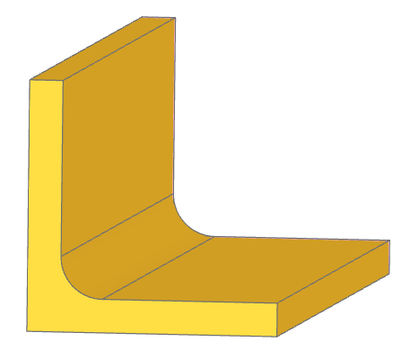

OpenSCAD and build123d offer distinct paradigms for creating 3D models, as demonstrated by the angle iron example.
OpenSCAD relies on Constructive Solid Geometry (CSG) operations, combining and subtracting 3D shapes like cubes
and cylinders. Fillets are approximated by manually adding high-resolution cylinders, making adjustments cumbersome
and less precise. This static approach can handle simple models but becomes challenging for complex or iterative
designs.

In contrast, build123d emphasizes a profile-driven workflow. It starts with a 2D sketch, defining the geometry’s outline,
which is then extruded or otherwise transformed into a 3D model. Features like fillets are applied dynamically by
querying topological elements, such as edges, using intuitive filtering methods. This approach ensures precision and
flexibility, making changes straightforward without the need for manual repositioning or realignment.

The build123d methodology is computationally efficient, leveraging mathematical precision for features like fillets.
By separating the design into manageable steps—sketching, extruding, and refining—it aligns with traditional CAD
practices and enhances readability, modularity, and maintainability. Unlike OpenSCAD, build123d’s dynamic querying
of topological features allows for easy updates and adjustments, making it better suited for modern, complex, and
iterative design workflows.

In summary, build123d’s sketch-based paradigm and topological querying capabilities provide superior precision, flex-
ibility, and efficiency compared to OpenSCAD’s static, CSG-centric approach, making it a better choice for robust and
adaptable CAD modeling.

<!-- PDF page 33 -->

1.7.4 Tips for Transitioning

• Think in Lower Dimensions: Begin with 1D curves or 2D sketches as the foundation and progressively build
upwards into 3D shapes.

• Leverage Topological References: Use build123d’s powerful selector system to reference features of existing
objects for creating new ones. For example, apply inside or outside fillets and chamfers to vertices and edges of
an existing part with precision.

• Operational Equivalency and Beyond: Build123d provides equivalents to almost all features available in Open-
SCAD, with the exception of the 3D minkowski operation. However, a 2D equivalent, make_hull, is available
in build123d. Beyond operational equivalency, build123d offers a wealth of additional functionality, including
advanced features like topological queries, dynamic filtering, and robust tools for creating complex geometries.
By exploring build123d’s extensive operations, you can unlock new possibilities and take your designs far beyond
the capabilities of OpenSCAD.

• Explore the Documentation: Dive into build123d’s comprehensive API documentation to unlock its full po-
tential and discover advanced features.

By shifting your design mindset from solid-based CSG to a profile-driven approach, you can fully harness build123d’s
capabilities to create precise, efficient, and complex models. Welcome aboard, and happy designing!

1.7.5 Conclusion

While OpenSCAD and build123d share the goal of empowering users to create parametric 3D models, their approaches
differ significantly. Embracing build123d’s workflow of building with lower-dimensional objects and applying extru-
sion, lofting, sweeping, or revolution will unlock its full potential and lead to better design outcomes.


<!-- END OpenSCAD.md -->


<!-- BEGIN introductory_examples.md -->

---
title: "Introductory Examples"
source_html: "https://build123d.readthedocs.io/en/latest/introductory_examples.html"
extracted_from: "official ReadTheDocs PDF"
pdf_release: "0.11.1.dev21+gbbce3cdd6"
pdf_pages: "33-59"
generated_on: "2026-07-01"
---

# Introductory Examples

> Converted to Markdown from the official build123d ReadTheDocs PDF. PDF page markers and local extracted-image links are included for traceability. Some line wrapping reflects the PDF layout.
<!-- PDF page 33 -->

1.8 Introductory Examples

The examples on this page can help you learn how to build objects with build123d, and are intended as a general
overview of build123d.

They are organized from simple to complex, so working through them in order is the best way to absorb them.

Note

Some important lines are omitted below to save space, so you will most likely need to add 1 & 2 to the provided
code below for them to work:

1. from build123d import *

2. If you are using build123d builder mode or algebra mode,

• in ocp_vscode simply use e.g. show(ex15) to the end of your design to view parts, sketches and curves.
show_all() can be used to automatically show all objects with their variable names as labels.

• in CQ-editor add e.g.    show_object(ex15.part), show_object(ex15.sketch)  or
show_object(ex15.line) to the end of your design to view parts, sketches or lines.

3. If you want to save your resulting object as an STL from builder mode, you can use e.g. export_stl(ex15.
part, "file.stl").

4. If you want to save your resulting object as an STL from algebra mode, you can use e.g. export_stl(ex15,
"file.stl")

5. build123d also supports exporting to multiple other file formats including STEP, see here for further infor-
mation: Import/Export Formats

<!-- PDF page 34 -->

List of Examples

• Introductory Examples

– 1. Simple Rectangular Plate

– 2. Plate with Hole

– 3. An extruded prismatic solid

– 4. Building Profiles using lines and arcs

– 5. Moving the current working point

– 6. Using Point Lists

– 7. Polygons

– 8. Polylines

– 9. Selectors, Fillets, and Chamfers

– 10. Select Last and Hole

– 11. Use a face as a plane for BuildSketch and introduce GridLocations

– 12. Defining an Edge with a Spline

– 13. CounterBoreHoles, CounterSinkHoles, and PolarLocations

– 14. Position on a line with ‘@’, ‘%’ and introduce Sweep

– 15. Mirroring Symmetric Geometry

– 16. Mirroring 3D Objects

– 17. Mirroring From Faces

– 18. Creating Workplanes on Faces

– 19. Locating a workplane on a vertex

– 20. Offset Sketch Workplane

– 21. Create a Workplanes in the center of another shape

– 22. Rotated Workplanes

– 23. Revolve

– 24. Loft

– 25. Offset Sketch

– 26. Offset Part To Create Thin features

– 27. Splitting an Object

– 28. Locating features based on Faces

– 29. The Classic OCC Bottle

– 30. Bezier Curve

– 31. Nesting Locations

– 32. Python For-Loop

<!-- PDF page 35 -->

– 33. Python Function and For-Loop

– 34. Embossed and Debossed Text

– 35. Slots

– 36. Extrude Until

1.8.1 1. Simple Rectangular Plate

Just about the simplest possible example, a rectangular Box.

• Builder mode

```python
         length, width, thickness = 80.0, 60.0, 10.0
```

```python
         with BuildPart() as ex1:
```

```python
             Box(length, width, thickness)
```

• Algebra mode

```python
         length, width, thickness = 80.0, 60.0, 10.0
```

```python
         ex1 = Box(length, width, thickness)
```

1.8.2 2. Plate with Hole

A rectangular box, but with a hole added.

• Builder mode

In this case we are using Mode .SUBTRACT to cut the Cylinder from the Box.

```python
         length, width, thickness = 80.0, 60.0, 10.0
         center_hole_dia = 22.0
```

```python
         with BuildPart() as ex2:
```

```python
             Box(length, width, thickness)
             Cylinder(radius=center_hole_dia / 2, height=thickness, mode=Mode.
```

˓→SUBTRACT)

• Algebra mode

In this case we are using the subtract operator - to cut the Cylinder from the Box.

```python
         length, width, thickness = 80.0, 60.0, 10.0
         center_hole_dia = 22.0
```

```python
         ex2 = Box(length, width, thickness)
         ex2 -= Cylinder(center_hole_dia / 2, height=thickness)
```

<!-- PDF page 36 -->

1.8.3 3. An extruded prismatic solid

Build a prismatic solid using extrusion.

• Builder mode

This time we can first create a 2D BuildSketch adding a Circle and a subtracted Rectangle and
then use BuildPart’s extrude() feature.

```python
         length, width, thickness = 80.0, 60.0, 10.0
```

```python
         with BuildPart() as ex3:
```

```python
             with BuildSketch() as ex3_sk:
```

```python
                 Circle(width)
                 Rectangle(length / 2, width / 2, mode=Mode.SUBTRACT)
             extrude(amount=2 * thickness)
```

• Algebra mode

This time we can first create a 2D Circle with a subtracted Rectangle` and then use the extrude()
operation for parts.

```python
         length, width, thickness = 80.0, 60.0, 10.0
```

```python
         sk3 = Circle(width) - Rectangle(length / 2, width / 2)
         ex3 = extrude(sk3, amount=2 * thickness)
```

1.8.4 4. Building Profiles using lines and arcs

Sometimes you need to build complex profiles using lines and arcs. This example builds a prismatic solid from 2D
operations. It is not necessary to create variables for the line segments, but it will be useful in a later example.

• Builder mode

BuildSketch operates on closed Faces, and the operation make_face() is used to convert the pend-
ing line segments from BuildLine into a closed Face.

```python
         length, width, thickness = 80.0, 60.0, 10.0
```

```python
         with BuildPart() as ex4:
```

```python
             with BuildSketch() as ex4_sk:
```

```python
                 with BuildLine() as ex4_ln:
                     l1 = Line((0, 0), (length, 0))
                     l2 = Line((length, 0), (length, width))
                     l3 = ThreePointArc((length, width), (width, width * 1.5), (0.0,␣
```

```python
         ˓→width))
                     l4 = Line((0.0, width), (0, 0))
                 make_face()
             extrude(amount=thickness)
```

• Algebra mode

We start with an empty Curve and add lines to it (note that Curve() + [line1, line2, line3]
is much more efficient than line1 + line2 + line3, see Performance considerations in algebra
mode). The operation make_face() is used to convert the line segments into a Face.

<!-- PDF page 37 -->

```python
         length, width, thickness = 80.0, 60.0, 10.0
```

```python
         lines = Curve() + [
```

```python
             Line((0, 0), (length, 0)),
             Line((length, 0), (length, width)),
             ThreePointArc((length, width), (width, width * 1.5), (0.0, width)),
             Line((0.0, width), (0, 0)),
         ]
         sk4 = make_face(lines)
         ex4 = extrude(sk4, thickness)
```

Note that to build a closed face it requires line segments that form a closed shape.

1.8.5 5. Moving the current working point

• Builder mode

Using Locations we can place one (or multiple) objects at one (or multiple) places.

```python
         a, b, c, d = 90, 45, 15, 7.5
```

```python
         with BuildPart() as ex5:
```

```python
             with BuildSketch() as ex5_sk:
```

```python
                 Circle(a)
                 with Locations((b, 0.0)):
```

```python
                     Rectangle(c, c, mode=Mode.SUBTRACT)
                 with Locations((0, b)):
```

```python
                     Circle(d, mode=Mode.SUBTRACT)
             extrude(amount=c)
```

• Algebra mode

Using the pattern Pos(x, y, z=0) * obj (with geometry.Pos) we can move an object to the pro-
vided position. Using Rot(x_angle, y_angle, z_angle) * obj (with geometry.Rot) would
rotate the object.

```python
         a, b, c, d = 90, 45, 15, 7.5
```

```python
         sk5 = Circle(a) - Pos(b, 0.0) * Rectangle(c, c) - Pos(0.0, b) * Circle(d)
         ex5 = extrude(sk5, c)
```

1.8.6 6. Using Point Lists

Sometimes you need to create a number of features at various Locations.

• Builder mode

You can use a list of points to construct multiple objects at once.

```python
         a, b, c = 80, 60, 10
```

```python
         with BuildPart() as ex6:
```

<!-- PDF page 38 -->

```python
                                                                  (continued from previous page)
             with BuildSketch() as ex6_sk:
```

```python
                 Circle(a)
                 with Locations((b, 0), (0, b), (-b, 0), (0, -b)):
```

```python
                     Circle(c, mode=Mode.SUBTRACT)
             extrude(amount=c)
```

• Algebra mode

You can use loops to iterate over these Locations or list comprehensions as in the example.

The algebra operations are vectorized, which means obj - [obj1, obj2, obj3] is short for obj
- obj1 - obj2 - ob3 (and more efficient, see Performance considerations in algebra mode).

```python
         a, b, c = 80, 60, 10
```

```python
         sk6 = [loc * Circle(c) for loc in Locations((b, 0), (0, b), (-b, 0), (0, -
```

```python
         ˓→b))]
         ex6 = extrude(Circle(a) - sk6, c)
```

1.8.7 7. Polygons

• Builder mode

You can create RegularPolygon for each stack point if you would like.

```python
         a, b, c = 60, 80, 5
```

```python
         with BuildPart() as ex7:
```

```python
             with BuildSketch() as ex7_sk:
```

```python
                 Rectangle(a, b)
                 with Locations((0, 3 * c), (0, -3 * c)):
```

```python
                     RegularPolygon(radius=2 * c, side_count=6, mode=Mode.SUBTRACT)
             extrude(amount=c)
```

• Algebra mode

You can apply locations to RegularPolygon instances for each location via loops or list comprehen-
sions.

```python
         a, b, c = 60, 80, 5
```

```python
         polygons = [
             loc * RegularPolygon(radius=2 * c, side_count=6)
             for loc in Locations((0, 3 * c), (0, -3 * c))
         ]
         sk7 = Rectangle(a, b) - polygons
         ex7 = extrude(sk7, amount=c)
```

1.8.8 8. Polylines

Polyline allows creating a shape from a large number of chained points connected by lines. This example uses a
polyline to create one half of an i-beam shape, which is mirror() ed to create the final profile.

<!-- PDF page 39 -->

• Builder mode

```python
         (L, H, W, t) = (100.0, 20.0, 20.0, 1.0)
         pts = [
             (0, H / 2.0),
             (W / 2.0, H / 2.0),
             (W / 2.0, (H / 2.0 - t)),
             (t / 2.0, (H / 2.0 - t)),
             (t / 2.0, (t - H / 2.0)),
             (W / 2.0, (t - H / 2.0)),
             (W / 2.0, H / -2.0),
             (0, H / -2.0),
         ]
```

```python
         with BuildPart() as ex8:
```

```python
             with BuildSketch(Plane.YZ) as ex8_sk:
```

```python
                 with BuildLine() as ex8_ln:
```

```python
                     Polyline(pts)
                     mirror(ex8_ln.line, about=Plane.YZ)
                 make_face()
             extrude(amount=L)
```

• Algebra mode

```python
         (L, H, W, t) = (100.0, 20.0, 20.0, 1.0)
         pts = [
             (0, H / 2.0),
             (W / 2.0, H / 2.0),
             (W / 2.0, (H / 2.0 - t)),
             (t / 2.0, (H / 2.0 - t)),
             (t / 2.0, (t - H / 2.0)),
             (W / 2.0, (t - H / 2.0)),
             (W / 2.0, H / -2.0),
             (0, H / -2.0),
         ]
```

```python
         ln = Polyline(pts)
         ln += mirror(ln, Plane.YZ)
```

```python
         sk8 = make_face(Plane.YZ * ln)
         ex8 = extrude(sk8, -L).clean()
```

1.8.9 9. Selectors, Fillets, and Chamfers

This example introduces multiple useful and important concepts. Firstly chamfer() and fillet() can be used to
“bevel” and “round” edges respectively. Secondly, these two methods require an edge or a list of edges to operate on.
To select all edges, you could simply pass in ex9.edges().

• Builder mode

```python
         length, width, thickness = 80.0, 60.0, 10.0
```

<!-- PDF page 40 -->

```python
                                                                  (continued from previous page)
         with BuildPart() as ex9:
```

```python
             Box(length, width, thickness)
             chamfer(ex9.edges().group_by(Axis.Z)[-1], length=4)
             fillet(ex9.edges().filter_by(Axis.Z), radius=5)
```

• Algebra mode

```python
         length, width, thickness = 80.0, 60.0, 10.0
```

```python
         ex9 = Part() + Box(length, width, thickness)
         ex9 = chamfer(ex9.edges().group_by(Axis.Z)[-1], length=4)
         ex9 = fillet(ex9.edges().filter_by(Axis.Z), radius=5)
```

Note that group_by() (Axis.Z) returns a list of lists of edges that is grouped by their z-position. In this case we want
to use the [-1] group which, by convention, will be the highest z-dimension group.

1.8.10 10. Select Last and Hole

• Builder mode

Using Select .LAST you can select the most recently modified edges. It is used to perform a
fillet() in this example. This example also makes use of Hole which automatically cuts through
the entire part.

```python
         length, width, thickness = 80.0, 60.0, 10.0
```

```python
         with BuildPart() as ex10:
```

```python
             Box(length, width, thickness)
             Hole(radius=width / 4)
             fillet(ex10.edges(Select.LAST).group_by(Axis.Z)[-1], radius=2)
```

• Algebra mode

Using the pattern snapshot = obj.edges() before and last_edges = obj.edges() -
snapshot after an operation allows to select the most recently modified edges (same for faces,
vertices, ...). It is used to perform a fillet() in this example. This example also makes use of
Hole. Different to the context mode, you have to add the depth of the whole.

```python
         ex10 = Part() + Box(length, width, thickness)
```

```python
         snapshot = ex10.edges()
         ex10 -= Hole(radius=width / 4, depth=thickness)
         last_edges = ex10.edges() - snapshot
         ex10 = fillet(last_edges.group_by(Axis.Z)[-1], 2)
```

1.8.11 11. Use a face as a plane for BuildSketch and introduce GridLocations

• Builder mode

BuildSketch accepts a Plane or a Face, so in this case we locate the Sketch on the top of the part.
Note that the face used as input to BuildSketch needs to be Planar or unpredictable behavior can result.

<!-- PDF page 41 -->

Additionally GridLocations can be used to create a grid of points that are simultaneously used to
place 4 pentagons.

Lastly, extrude() can be used with a negative amount and Mode.SUBTRACT to cut these from the
parent.

```python
         length, width, thickness = 80.0, 60.0, 10.0
```

```python
         with BuildPart() as ex11:
```

```python
             Box(length, width, thickness)
             chamfer(ex11.edges().group_by(Axis.Z)[-1], length=4)
             fillet(ex11.edges().filter_by(Axis.Z), radius=5)
             Hole(radius=width / 4)
             fillet(ex11.edges(Select.LAST).sort_by(Axis.Z)[-1], radius=2)
             with BuildSketch(ex11.faces().sort_by(Axis.Z)[-1]) as ex11_sk:
```

```python
                 with GridLocations(length / 2, width / 2, 2, 2):
```

```python
                     RegularPolygon(radius=5, side_count=5)
             extrude(amount=-thickness, mode=Mode.SUBTRACT)
```

• Algebra mode

The pattern plane * obj can be used to locate an object on a plane. Furthermore, the pattern plane
* location * obj first places the object on a plane and then moves it relative to plane according
to location.

GridLocations creates a grid of points that can be used in loops or list comprehensions as described
earlier.

Lastly, extrude() can be used with a negative amount and cut (-) from the parent.

```python
         length, width, thickness = 80.0, 60.0, 10.0
```

```python
         ex11 = Part() + Box(length, width, thickness)
         ex11 = chamfer(ex11.edges().group_by()[-1], 4)
         ex11 = fillet(ex11.edges().filter_by(Axis.Z), 5)
         last = ex11.edges()
         ex11 -= Hole(radius=width / 4, depth=thickness)
         ex11 = fillet((ex11.edges() - last).sort_by().last, 2)
```

```python
         plane = Plane(ex11.faces().sort_by().last)
         polygons = Sketch() + [
             plane * loc * RegularPolygon(radius=5, side_count=5)
             for loc in GridLocations(length / 2, width / 2, 2, 2)
         ]
         ex11 -= extrude(polygons, -thickness)
```

Note that the direction implied by positive or negative inputs to amount is relative to the normal direction of the face
or plane. As a result of this, unexpected behavior can occur if the extrude direction and mode/operation (ADD / + or
SUBTRACT / -) are not correctly set.

1.8.12 12. Defining an Edge with a Spline

This example defines a side using a spline curve through a collection of points. Useful when you have an edge that
needs a complex profile.

• Builder mode

<!-- PDF page 42 -->

```python
         pts = [
             (55, 30),
             (50, 35),
             (40, 30),
             (30, 20),
             (20, 25),
             (10, 20),
             (0, 20),
         ]
```

```python
         with BuildPart() as ex12:
```

```python
             with BuildSketch() as ex12_sk:
```

```python
                 with BuildLine() as ex12_ln:
                     l1 = Spline(pts)
                     l2 = Line((55, 30), (60, 0))
                     l3 = Line((60, 0), (0, 0))
                     l4 = Line((0, 0), (0, 20))
                 make_face()
             extrude(amount=10)
```

• Algebra mode

```python
         pts = [
             (55, 30),
             (50, 35),
             (40, 30),
             (30, 20),
             (20, 25),
             (10, 20),
             (0, 20),
         ]
```

```python
         l1 = Spline(pts)
         l2 = Line(l1 @ 0, (60, 0))
         l3 = Line(l2 @ 1, (0, 0))
         l4 = Line(l3 @ 1, l1 @ 1)
```

```python
         sk12 = make_face([l1, l2, l3, l4])
         ex12 = extrude(sk12, 10)
```

1.8.13 13. CounterBoreHoles, CounterSinkHoles, and PolarLocations

Counter-sink and counter-bore holes are useful for creating recessed areas for fasteners.

• Builder mode

We use a face to establish a location for Locations.

```python
         a, b = 40, 4
         with BuildPart() as ex13:
```

```python
             Cylinder(radius=50, height=10)
             with Locations(ex13.faces().sort_by(Axis.Z)[-1]):
```

<!-- PDF page 43 -->

```python
                                                                  (continued from previous page)
                 with PolarLocations(radius=a, count=4):
```

```python
                     CounterSinkHole(radius=b, counter_sink_radius=2 * b)
                 with PolarLocations(radius=a, count=4, start_angle=45, angular_
```

```python
         ˓→range=360):
```

```python
                     CounterBoreHole(radius=b, counter_bore_radius=2 * b, counter_
```

```python
         ˓→bore_depth=b)
```

• Algebra mode

We use a face to establish a plane that is used later in the code for locating objects onto this plane.

```python
         a, b = 40, 4
```

```python
         ex13 = Cylinder(radius=50, height=10)
         plane = Plane(ex13.faces().sort_by().last)
```

```python
         ex13 -= (
             plane
             * PolarLocations(radius=a, count=4)
             * CounterSinkHole(radius=b, counter_sink_radius=2 * b, depth=10)
         )
         ex13 -= (
             plane
             * PolarLocations(radius=a, count=4, start_angle=45, angular_range=360)
             * CounterBoreHole(
                 radius=b, counter_bore_radius=2 * b, depth=10, counter_bore_depth=b
             )
         )
```

PolarLocations creates a list of points that are radially distributed.

1.8.14 14. Position on a line with ‘@’, ‘%’ and introduce Sweep

build123d includes a feature for finding the position along a line segment. This is normalized between 0 and 1 and
can be accessed using the position_at() (@) operator. Similarly the tangent_at() (%) operator returns the line
direction at a given point.

These two features are very powerful for chaining line segments together without having to repeat dimensions again
and again, which is error prone, time consuming, and more difficult to maintain. The pending faces must lie on the
path, please see example 37 for a way to make this placement easier.

• Builder mode

The sweep() method takes any pending faces and sweeps them through the provided path (in this case
the path is taken from the pending edges from ex14_ln). revolve() requires a single connected
wire.

```python
         a, b = 40, 20
```

```python
         with BuildPart() as ex14:
```

```python
             with BuildLine() as ex14_ln:
                 l1 = JernArc(start=(0, 0), tangent=(0, 1), radius=a, arc_size=180)
                 l2 = JernArc(start=l1 @ 1, tangent=l1 % 1, radius=a, arc_size=-90)
```

<!-- PDF page 44 -->

```python
                                                                  (continued from previous page)
                 l3 = Line(l2 @ 1, l2 @ 1 + (-a, a))
             with BuildSketch(Plane.XZ) as ex14_sk:
```

```python
                 Rectangle(b, b)
             sweep()
```

• Algebra mode

The sweep() method takes any faces and sweeps them through the provided path (in this case the
path is taken from ex14_ln).

```python
         a, b = 40, 20
```

```python
         l1 = JernArc(start=(0, 0), tangent=(0, 1), radius=a, arc_size=180)
         l2 = JernArc(start=l1 @ 1, tangent=l1 % 1, radius=a, arc_size=-90)
         l3 = Line(l2 @ 1, l2 @ 1 + (-a, a))
         ex14_ln = l1 + l2 + l3
```

```python
         sk14 = Plane.XZ * Rectangle(b, b)
         ex14 = sweep(sk14, path=ex14_ln)
```

It is also possible to use tuple or Vector addition (and other vector math operations) as seen in the l3 variable.

1.8.15 15. Mirroring Symmetric Geometry

Here mirror is used on the BuildLine to create a symmetric shape with fewer line segment commands. Additionally
the ‘@’ operator is used to simplify the line segment commands.

(l4 @ 1).Y is used to extract the y-component of the l4 @ 1 vector.

• Builder mode

```python
         a, b, c = 80, 40, 20
```

```python
         with BuildPart() as ex15:
```

```python
             with BuildSketch() as ex15_sk:
```

```python
                 with BuildLine() as ex15_ln:
                     l1 = Line((0, 0), (a, 0))
                     l2 = Line(l1 @ 1, l1 @ 1 + (0, b))
                     l3 = Line(l2 @ 1, l2 @ 1 + (-c, 0))
                     l4 = Line(l3 @ 1, l3 @ 1 + (0, -c))
                     l5 = Line(l4 @ 1, (0, (l4 @ 1).Y))
                     mirror(ex15_ln.line, about=Plane.YZ)
                 make_face()
             extrude(amount=c)
```

• Algebra mode

Combine lines via the pattern Curve() + [l1, l2, l3, l4, l5]

```python
         a, b, c = 80, 40, 20
```

```python
         l1 = Line((0, 0), (a, 0))
         l2 = Line(l1 @ 1, l1 @ 1 + (0, b))
```

<!-- PDF page 45 -->

```python
                                                                  (continued from previous page)
         l3 = Line(l2 @ 1, l2 @ 1 + (-c, 0))
         l4 = Line(l3 @ 1, l3 @ 1 + (0, -c))
         l5 = Line(l4 @ 1, (0, (l4 @ 1).Y))
         ln = Curve() + [l1, l2, l3, l4, l5]
         ln += mirror(ln, Plane.YZ)
```

```python
         sk15 = make_face(ln)
         ex15 = extrude(sk15, c)
```

1.8.16 16. Mirroring 3D Objects

Mirror can also be used with BuildPart (and BuildSketch) to mirror 3D objects. The Plane.offset() method shifts
the plane in the normal direction (positive or negative).

• Builder mode

```python
         length, width, thickness = 80.0, 60.0, 10.0
```

```python
         with BuildPart() as ex16_single:
```

```python
             with BuildSketch(Plane.XZ) as ex16_sk:
```

```python
                 Rectangle(length, width)
                 fillet(ex16_sk.vertices(), radius=length / 10)
                 with GridLocations(x_spacing=length / 4, y_spacing=0, x_count=3, y_
```

```python
         ˓→count=1):
```

```python
                     Circle(length / 12, mode=Mode.SUBTRACT)
                 Rectangle(length, width, align=(Align.MIN, Align.MIN), mode=Mode.
```

˓→SUBTRACT)

```python
             extrude(amount=length)
```

```python
         with BuildPart() as ex16:
```

```python
             add(ex16_single.part)
             mirror(ex16_single.part, about=Plane.XY.offset(width))
             mirror(ex16_single.part, about=Plane.YX.offset(width))
             mirror(ex16_single.part, about=Plane.YZ.offset(width))
             mirror(ex16_single.part, about=Plane.YZ.offset(-width))
```

• Algebra mode

```python
         length, width, thickness = 80.0, 60.0, 10.0
```

```python
         sk16 = Rectangle(length, width)
         sk16 = fillet(sk16.vertices(), length / 10)
```

```python
         circles = [loc * Circle(length / 12) for loc in GridLocations(length / 4, 0,
```

```python
         ˓→3, 1)]
```

```python
         sk16 = sk16 - circles - Rectangle(length, width, align=(Align.MIN, Align.
```

```python
         ˓→MIN))
         ex16_single = extrude(Plane.XZ * sk16, length)
```

```python
         planes = [
```

<!-- PDF page 46 -->

```python
                                                                  (continued from previous page)
             Plane.XY.offset(width),
             Plane.YX.offset(width),
             Plane.YZ.offset(width),
             Plane.YZ.offset(-width),
         ]
         objs = [mirror(ex16_single, plane) for plane in planes]
         ex16 = ex16_single + objs
```

1.8.17 17. Mirroring From Faces

Here we select the farthest face in the Y-direction and turn it into a Plane using the Plane() class.

• Builder mode

```python
         a, b = 30, 20
```

```python
         with BuildPart() as ex17:
```

```python
             with BuildSketch() as ex17_sk:
```

```python
                 RegularPolygon(radius=a, side_count=5)
             extrude(amount=b)
             mirror(ex17.part, about=Plane(ex17.faces().group_by(Axis.Y)[0][0]))
```

• Algebra mode

```python
         a, b = 30, 20
```

```python
         sk17 = RegularPolygon(radius=a, side_count=5)
         ex17 = extrude(sk17, amount=b)
         ex17 += mirror(ex17, Plane(ex17.faces().sort_by(Axis.Y).first))
```

1.8.18 18. Creating Workplanes on Faces

Here we start with an earlier example, select the top face, draw a rectangle and then use Extrude with a negative distance.

• Builder mode

We then use Mode.SUBTRACT to cut it out from the main body.

```python
         length, width, thickness = 80.0, 60.0, 10.0
         a, b = 4, 5
```

```python
         with BuildPart() as ex18:
```

```python
             Box(length, width, thickness)
             chamfer(ex18.edges().group_by(Axis.Z)[-1], length=a)
             fillet(ex18.edges().filter_by(Axis.Z), radius=b)
             with BuildSketch(ex18.faces().sort_by(Axis.Z)[-1]):
```

```python
                 Rectangle(2 * b, 2 * b)
             extrude(amount=-thickness, mode=Mode.SUBTRACT)
```

• Algebra mode

We then use -= to cut it out from the main body.

<!-- PDF page 47 -->

```python
         length, width, thickness = 80.0, 60.0, 10.0
         a, b = 4, 5
```

```python
         ex18 = Part() + Box(length, width, thickness)
         ex18 = chamfer(ex18.edges().group_by()[-1], a)
         ex18 = fillet(ex18.edges().filter_by(Axis.Z), b)
```

```python
         sk18 = Plane(ex18.faces().sort_by().first) * Rectangle(2 * b, 2 * b)
         ex18 -= extrude(sk18, -thickness)
```

1.8.19 19. Locating a workplane on a vertex

Here a face is selected and two different strategies are used to select vertices. Firstly vtx uses group_by() and Axis.X
to select a particular vertex. The second strategy uses a custom defined Axis vtx2Axis that is pointing roughly in the
direction of a vertex to select, and then sort_by() this custom Axis.

• Builder mode

Then the X and Y positions of these vertices are selected and passed to Locations as center points
for two circles that cut through the main part. Note that if you passed the variable vtx directly to
Locations then the part would be offset from the workplane by the vertex z-position.

```python
         length, thickness = 80.0, 10.0
```

```python
         with BuildPart() as ex19:
```

```python
             with BuildSketch() as ex19_sk:
```

```python
                 RegularPolygon(radius=length / 2, side_count=7)
             extrude(amount=thickness)
             topf = ex19.faces().sort_by(Axis.Z)[-1]
             vtx = topf.vertices().group_by(Axis.X)[-1][0]
             vtx2Axis = Axis((0, 0, 0), (-1, -0.5, 0))
             vtx2 = topf.vertices().sort_by(vtx2Axis)[-1]
             with BuildSketch(topf) as ex19_sk2:
```

```python
                 with Locations((vtx.X, vtx.Y), (vtx2.X, vtx2.Y)):
```

```python
                     Circle(radius=length / 8)
             extrude(amount=-thickness, mode=Mode.SUBTRACT)
```

• Algebra mode

Then the X and Y positions of these vertices are selected and used to move two circles that cut through
the main part. Note that if you passed the variable vtx directly to Pos then the part would be offset
from the workplane by the vertex z-position.

```python
         length, thickness = 80.0, 10.0
```

```python
         ex19_sk = RegularPolygon(radius=length / 2, side_count=7)
         ex19 = extrude(ex19_sk, thickness)
```

```python
         topf = ex19.faces().sort_by().last
```

```python
         vtx = topf.vertices().group_by(Axis.X)[-1][0]
```

```python
         vtx2Axis = Axis((0, 0, 0), (-1, -0.5, 0))
```

<!-- PDF page 48 -->

```python
                                                                  (continued from previous page)
         vtx2 = topf.vertices().sort_by(vtx2Axis)[-1]
```

```python
         ex19_sk2 = Circle(radius=length / 8)
         ex19_sk2 = Pos(vtx.X, vtx.Y) * ex19_sk2 + Pos(vtx2.X, vtx2.Y) * ex19_sk2
```

```python
         ex19 -= extrude(ex19_sk2, thickness)
```

1.8.20 20. Offset Sketch Workplane

The plane variable is set to be coincident with the farthest face in the negative x-direction. The resulting Plane is offset
from the original position.

• Builder mode

```python
         length, width, thickness = 80.0, 60.0, 10.0
```

```python
         with BuildPart() as ex20:
```

```python
             Box(length, width, thickness)
             plane = Plane(ex20.faces().group_by(Axis.X)[0][0])
             with BuildSketch(plane.offset(2 * thickness)):
```

```python
                 Circle(width / 3)
             extrude(amount=width)
```

• Algebra mode

```python
         length, width, thickness = 80.0, 60.0, 10.0
```

```python
         ex20 = Box(length, width, thickness)
         plane = Plane(ex20.faces().sort_by(Axis.X).first).offset(2 * thickness)
```

```python
         sk20 = plane * Circle(width / 3)
         ex20 += extrude(sk20, width)
```

1.8.21 21. Create a Workplanes in the center of another shape

One cylinder is created, and then the origin and z_dir of that part are used to create a new Plane for positioning another
cylinder perpendicular and halfway along the first.

• Builder mode

```python
         width, length = 10.0, 60.0
```

```python
         with BuildPart() as ex21:
```

```python
             with BuildSketch() as ex21_sk:
```

```python
                 Circle(width / 2)
             extrude(amount=length)
             with BuildSketch(Plane(origin=ex21.part.center(), z_dir=(-1, 0, 0))):
```

```python
                 Circle(width / 2)
             extrude(amount=length)
```

• Algebra mode

<!-- PDF page 49 -->

```python
         width, length = 10.0, 60.0
```

```python
         ex21 = extrude(Circle(width / 2), length)
         plane = Plane(origin=ex21.center(), z_dir=(-1, 0, 0))
         ex21 += plane * extrude(Circle(width / 2), length)
```

1.8.22 22. Rotated Workplanes

It is also possible to create a rotated workplane, building upon some of the concepts in an earlier example.

• Builder mode

Use the rotated() method to rotate the workplane.

```python
         length, width, thickness = 80.0, 60.0, 10.0
```

```python
         with BuildPart() as ex22:
```

```python
             Box(length, width, thickness)
             pln = Plane(ex22.faces().group_by(Axis.Z)[0][0]).rotated((0, -50, 0))
             with BuildSketch(pln) as ex22_sk:
```

```python
                 with GridLocations(length / 4, width / 4, 2, 2):
```

```python
                     Circle(thickness / 4)
             extrude(amount=-100, both=True, mode=Mode.SUBTRACT)
```

• Algebra mode

Use the operator * to relocate the plane (post-multiplication!).

```python
         length, width, thickness = 80.0, 60.0, 10.0
```

```python
         ex22 = Box(length, width, thickness)
         plane = Plane((ex22.faces().group_by(Axis.Z)[0])[0]) * Rot(0, 50, 0)
```

```python
         holes = Sketch() + [
             plane * loc * Circle(thickness / 4)
             for loc in GridLocations(length / 4, width / 4, 2, 2)
         ]
         ex22 -= extrude(holes, -100, both=True)
```

GridLocations places 4 Circles on 4 points on this rotated workplane, and then the Circles are extruded in the “both”
(positive and negative) normal direction.

1.8.23 23. Revolve

Here we build a sketch with a Polyline, Line, and a Circle. It is absolutely critical that the sketch is only on one
side of the axis of rotation before Revolve is called. To that end, split is used with Plane.ZY to keep only one side
of the Sketch.

It is highly recommended to view your sketch before you attempt to call revolve.

• Builder mode

<!-- PDF page 50 -->

```python
         pts = [
             (-25, 35),
             (-25, 0),
             (-20, 0),
             (-20, 5),
             (-15, 10),
             (-15, 35),
         ]
```

```python
         with BuildPart() as ex23:
```

```python
             with BuildSketch(Plane.XZ) as ex23_sk:
```

```python
                 with BuildLine() as ex23_ln:
                     l1 = Polyline(pts)
                     l2 = Line(l1 @ 1, l1 @ 0)
                 make_face()
                 with Locations((0, 35)):
```

```python
                     Circle(25)
                 split(bisect_by=Plane.ZY)
             revolve(axis=Axis.Z)
```

• Algebra mode

```python
         pts = [
             (-25, 35),
             (-25, 0),
             (-20, 0),
             (-20, 5),
             (-15, 10),
             (-15, 35),
         ]
```

```python
         l1 = Polyline(pts)
         l2 = Line(l1 @ 1, l1 @ 0)
         sk23 = make_face([l1, l2])
```

```python
         sk23 += Pos(0, 35) * Circle(25)
         sk23 = Plane.XZ * split(sk23, bisect_by=Plane.ZY)
```

```python
         ex23 = revolve(sk23, Axis.Z)
```

1.8.24 24. Loft

Loft is a very powerful tool that can be used to join dissimilar shapes. In this case we make a conical-like shape from
a circle and a rectangle that is offset vertically. In this case loft() automatically takes the pending faces that were
added by the two BuildSketches. Loft can behave unexpectedly when the input faces are not parallel to each other.

• Builder mode

```python
         length, width, thickness = 80.0, 60.0, 10.0
```

```python
         with BuildPart() as ex24:
```

```python
             Box(length, length, thickness)
```

<!-- PDF page 51 -->

```python
                                                                  (continued from previous page)
             with BuildSketch(ex24.faces().group_by(Axis.Z)[0][0]) as ex24_sk:
```

```python
                 Circle(length / 3)
             with BuildSketch(ex24_sk.faces()[0].offset(length / 2)) as ex24_sk2:
```

```python
                 Rectangle(length / 6, width / 6)
             loft()
```

• Algebra mode

```python
         length, width, thickness = 80.0, 60.0, 10.0
```

```python
         ex24 = Box(length, length, thickness)
         plane = Plane(ex24.faces().sort_by().last)
```

```python
         faces = Sketch() + [
             plane * Circle(length / 3),
             plane.offset(length / 2) * Rectangle(length / 6, width / 6),
         ]
```

```python
         ex24 += loft(faces)
```

1.8.25 25. Offset Sketch

• Builder mode

BuildSketch faces can be transformed with a 2D offset().

```python
         rad, offs = 50, 10
```

```python
         with BuildPart() as ex25:
```

```python
             with BuildSketch() as ex25_sk1:
```

```python
                 RegularPolygon(radius=rad, side_count=5)
             with BuildSketch(Plane.XY.offset(15)) as ex25_sk2:
```

```python
                 RegularPolygon(radius=rad, side_count=5)
                 offset(amount=offs)
             with BuildSketch(Plane.XY.offset(30)) as ex25_sk3:
```

```python
                 RegularPolygon(radius=rad, side_count=5)
                 offset(amount=offs, kind=Kind.INTERSECTION)
             extrude(amount=1)
```

• Algebra mode

Sketch faces can be transformed with a 2D offset().

```python
         rad, offs = 50, 10
```

```python
         sk25_1 = RegularPolygon(radius=rad, side_count=5)
         sk25_2 = Plane.XY.offset(15) * RegularPolygon(radius=rad, side_count=5)
         sk25_2 = offset(sk25_2, offs)
         sk25_3 = Plane.XY.offset(30) * RegularPolygon(radius=rad, side_count=5)
         sk25_3 = offset(sk25_3, offs, kind=Kind.INTERSECTION)
```

<!-- PDF page 52 -->

```python
                                                                  (continued from previous page)
         sk25 = Sketch() + [sk25_1, sk25_2, sk25_3]
         ex25 = extrude(sk25, 1)
```

They can be offset inwards or outwards, and with different techniques for extending the corners (see Kind in the Offset
docs).

1.8.26 26. Offset Part To Create Thin features

Parts can also be transformed using an offset, but in this case with a 3D offset(). Also commonly known as a shell,
this allows creating thin walls using very few operations. This can also be offset inwards or outwards. Faces can be
selected to be “deleted” using the openings parameter of offset().

Note that self intersecting edges and/or faces can break both 2D and 3D offsets.

• Builder mode

```python
         length, width, thickness, wall = 80.0, 60.0, 10.0, 2.0
```

```python
         with BuildPart() as ex26:
```

```python
             Box(length, width, thickness)
             topf = ex26.faces().sort_by(Axis.Z)[-1]
             offset(amount=-wall, openings=topf)
```

• Algebra mode

```python
         length, width, thickness, wall = 80.0, 60.0, 10.0, 2.0
```

```python
         ex26 = Box(length, width, thickness)
         topf = ex26.faces().sort_by().last
         ex26 = offset(ex26, amount=-wall, openings=topf)
```

1.8.27 27. Splitting an Object

You can split an object using a plane, and retain either or both halves. In this case we select a face and offset half the
width of the box.

• Builder mode

```python
         length, width, thickness = 80.0, 60.0, 10.0
```

```python
         with BuildPart() as ex27:
```

```python
             Box(length, width, thickness)
             with BuildSketch(ex27.faces().sort_by(Axis.Z)[0]) as ex27_sk:
```

```python
                 Circle(width / 4)
             extrude(amount=-thickness, mode=Mode.SUBTRACT)
             split(bisect_by=Plane(ex27.faces().sort_by(Axis.Y)[-1]).offset(-width /␣
```

˓→2))

• Algebra mode

<!-- PDF page 53 -->

```python
         length, width, thickness = 80.0, 60.0, 10.0
```

```python
         ex27 = Box(length, width, thickness)
         sk27 = Plane(ex27.faces().sort_by().first) * Circle(width / 4)
         ex27 -= extrude(sk27, -thickness)
         ex27 = split(ex27, Plane(ex27.faces().sort_by(Axis.Y).last).offset(-width /␣
```

˓→2))

1.8.28 28. Locating features based on Faces

• Builder mode

We create a triangular prism with Mode .PRIVATE and then later use the faces of this object to cut
holes in a sphere.

```python
         width, thickness = 80.0, 10.0
```

```python
         with BuildPart() as ex28:
```

```python
             with BuildSketch() as ex28_sk:
```

```python
                 RegularPolygon(radius=width / 4, side_count=3)
             ex28_ex = extrude(amount=thickness, mode=Mode.PRIVATE)
             midfaces = ex28_ex.faces().group_by(Axis.Z)[1]
             Sphere(radius=width / 2)
             for face in midfaces:
```

```python
                 with Locations(face):
```

```python
                     Hole(thickness / 2)
```

• Algebra mode

We create a triangular prism and then later use the faces of this object to cut holes in a sphere.

```python
         width, thickness = 80.0, 10.0
```

```python
         sk28 = RegularPolygon(radius=width / 4, side_count=3)
         tmp28 = extrude(sk28, thickness)
         ex28 = Sphere(radius=width / 2)
         for p in [Plane(face) for face in tmp28.faces().group_by(Axis.Z)[1]]:
             ex28 -= p * Hole(thickness / 2, depth=width)
```

We are able to create multiple workplanes by looping over the list of faces.

1.8.29 29. The Classic OCC Bottle

build123d is based on the OpenCascade.org (OCC) modeling Kernel. Those who are familiar with OCC know about
the famous ‘bottle’ example. We use a 3D Offset and the openings parameter to create the bottle opening.

• Builder mode

```python
         L, w, t, b, h, n = 60.0, 18.0, 9.0, 0.9, 90.0, 6.0
```

```python
         with BuildPart() as ex29:
```

<!-- PDF page 54 -->

```python
                                                                  (continued from previous page)
             with BuildSketch(Plane.XY.offset(-b)) as ex29_ow_sk:
```

```python
                 with BuildLine() as ex29_ow_ln:
                     l1 = Line((0, 0), (0, w / 2))
                     l2 = ThreePointArc(l1 @ 1, (L / 2.0, w / 2.0 + t), (L, w / 2.0))
                     l3 = Line(l2 @ 1, ((l2 @ 1).X, 0, 0))
                     mirror(ex29_ow_ln.line)
                 make_face()
             extrude(amount=h + b)
             fillet(ex29.edges(), radius=w / 6)
             with BuildSketch(ex29.faces().sort_by(Axis.Z)[-1]):
```

```python
                 Circle(t)
             extrude(amount=n)
             necktopf = ex29.faces().sort_by(Axis.Z)[-1]
             offset(ex29.solids()[0], amount=-b, openings=necktopf)
```

• Algebra mode

```python
         L, w, t, b, h, n = 60.0, 18.0, 9.0, 0.9, 90.0, 8.0
```

```python
         l1 = Line((0, 0), (0, w / 2))
         l2 = ThreePointArc(l1 @ 1, (L / 2.0, w / 2.0 + t), (L, w / 2.0))
         l3 = Line(l2 @ 1, ((l2 @ 1).X, 0, 0))
         ln29 = l1 + l2 + l3
         ln29 += mirror(ln29)
         sk29 = make_face(ln29)
         ex29 = extrude(sk29, -(h + b))
         ex29 = fillet(ex29.edges(), radius=w / 6)
```

```python
         neck = Plane(ex29.faces().sort_by().last) * Circle(t)
         ex29 += extrude(neck, n)
         necktopf = ex29.faces().sort_by().last
         ex29 = offset(ex29, -b, openings=necktopf)
```

1.8.30 30. Bezier Curve

Here pts is used as an input to both Polyline and Bezier and wts to Bezier alone. These two together create a
closed line that is made into a face and extruded.

• Builder mode

```python
         pts = [
             (0, 0),
             (20, 20),
             (40, 0),
             (0, -40),
             (-60, 0),
             (0, 100),
             (100, 0),
         ]
```

```python
         wts = [
```

<!-- PDF page 55 -->

```python
                                                                  (continued from previous page)
             1.0,
             1.0,
             2.0,
             3.0,
             4.0,
             2.0,
             1.0,
         ]
```

```python
         with BuildPart() as ex30:
```

```python
             with BuildSketch() as ex30_sk:
```

```python
                 with BuildLine() as ex30_ln:
                     l0 = Polyline(pts)
                     l1 = Bezier(pts, weights=wts)
                 make_face()
             extrude(amount=10)
```

• Algebra mode

```python
         pts = [
             (0, 0),
             (20, 20),
             (40, 0),
             (0, -40),
             (-60, 0),
             (0, 100),
             (100, 0),
         ]
```

```python
         wts = [
```

```python
             1.0,
             1.0,
             2.0,
             3.0,
             4.0,
             2.0,
             1.0,
         ]
```

```python
         ex30_ln = Polyline(pts) + Bezier(pts, weights=wts)
         ex30_sk = make_face(ex30_ln)
         ex30 = extrude(ex30_sk, -10)
```

1.8.31 31. Nesting Locations

Locations contexts can be nested to create groups of shapes. Here 24 triangles, 6 squares, and 1 hexagon are created
and then extruded. Notably PolarLocations rotates any “children” groups by default.

• Builder mode

<!-- PDF page 56 -->

```python
         a, b, c = 80.0, 5.0, 3.0
```

```python
         with BuildPart() as ex31:
```

```python
             with BuildSketch() as ex31_sk:
```

```python
                 with PolarLocations(a / 2, 6):
```

```python
                     with GridLocations(3 * b, 3 * b, 2, 2):
```

```python
                         RegularPolygon(b, 3)
                     RegularPolygon(b, 4)
                 RegularPolygon(3 * b, 6, rotation=30)
             extrude(amount=c)
```

• Algebra mode

```python
         a, b, c = 80.0, 5.0, 3.0
```

```python
         ex31 = Rot(Z=30) * RegularPolygon(3 * b, 6)
         ex31 += PolarLocations(a / 2, 6) * (
```

```python
             RegularPolygon(b, 4) + GridLocations(3 * b, 3 * b, 2, 2) *␣
```

```python
         ˓→RegularPolygon(b, 3)
         )
         ex31 = extrude(ex31, 3)
```

1.8.32 32. Python For-Loop

In this example, a standard python for-loop is used along with a list of faces extracted from a sketch to progressively
modify the extrusion amount. There are 7 faces in the sketch, so this results in 7 separate calls to extrude().

• Builder mode

```python
         Mode .PRIVATE is used in BuildSketch to avoid adding these faces until the for-loop.
```

```python
         a, b, c = 80.0, 10.0, 1.0
```

```python
         with BuildPart() as ex32:
```

```python
             with BuildSketch(mode=Mode.PRIVATE) as ex32_sk:
```

```python
                 RegularPolygon(2 * b, 6, rotation=30)
                 with PolarLocations(a / 2, 6):
```

```python
                     RegularPolygon(b, 4)
             for idx, obj in enumerate(ex32_sk.sketch.faces()):
```

```python
                 add(obj)
                 extrude(amount=c + 3 * idx)
```

• Algebra mode

```python
         a, b, c = 80.0, 10.0, 1.0
```

```python
         ex32_sk = RegularPolygon(2 * b, 6, rotation=30)
         ex32_sk += PolarLocations(a / 2, 6) * RegularPolygon(b, 4)
         ex32 = Part() + [extrude(obj, c + 3 * idx) for idx, obj in enumerate(ex32_
```

```python
         ˓→sk.faces())]
```

<!-- PDF page 57 -->

1.8.33 33. Python Function and For-Loop

Building on the previous example, a standard python function is used to return a sketch as a function of several inputs
to progressively modify the size of each square.

• Builder mode

The function returns a BuildSketch.

```python
         a, b, c = 80.0, 5.0, 1.0
```

```python
         def square(rad, loc):
```

```python
             with BuildSketch() as sk:
```

```python
                 with Locations(loc):
```

```python
                     RegularPolygon(rad, 4)
             return sk.sketch
```

```python
         with BuildPart() as ex33:
```

```python
             with BuildSketch(mode=Mode.PRIVATE) as ex33_sk:
                 locs = PolarLocations(a / 2, 6)
                 for i, j in enumerate(locs):
```

```python
                     add(square(b + 2 * i, j))
             for idx, obj in enumerate(ex33_sk.sketch.faces()):
```

```python
                 add(obj)
                 extrude(amount=c + 2 * idx)
```

• Algebra mode

The function returns a Sketch object.

```python
         a, b, c = 80.0, 5.0, 1.0
```

```python
         def square(rad, loc):
```

```python
             return loc * RegularPolygon(rad, 4)
```

```python
         ex33 = Part() + [
```

```python
             extrude(square(b + 2 * i, loc), c + 2 * i)
             for i, loc in enumerate(PolarLocations(a / 2, 6))
         ]
```

1.8.34 34. Embossed and Debossed Text

• Builder mode

The text “Hello” is placed on top of a rectangle and embossed (raised) by placing a BuildSketch on
the top face (topf). Note that Align is used to control the text placement. We re-use the topf
variable to select the same face and deboss (indented) the text “World”. Note that if we simply ran
BuildSketch(ex34.faces().sort_by(Axis.Z)[-1]) for both ex34_sk1 & 2 it would incor-
rectly locate the 2nd “World” text on the top of the “Hello” text.

<!-- PDF page 58 -->

```python
         length, width, thickness, fontsz, fontht = 80.0, 60.0, 10.0, 25.0, 4.0
```

```python
         with BuildPart() as ex34:
```

```python
             Box(length, width, thickness)
             topf = ex34.faces().sort_by(Axis.Z)[-1]
             with BuildSketch(topf) as ex34_sk:
```

```python
                 Text("Hello", font_size=fontsz, align=(Align.CENTER, Align.MIN))
             extrude(amount=fontht)
             with BuildSketch(topf) as ex34_sk2:
```

```python
                 Text("World", font_size=fontsz, align=(Align.CENTER, Align.MAX))
             extrude(amount=-fontht, mode=Mode.SUBTRACT)
```

• Algebra mode

The text “Hello” is placed on top of a rectangle and embossed (raised) by placing a sketch on the top
face (topf). Note that Align is used to control the text placement. We re-use the topf variable to
select the same face and deboss (indented) the text “World”.

```python
         length, width, thickness, fontsz, fontht = 80.0, 60.0, 10.0, 25.0, 4.0
```

```python
         ex34 = Box(length, width, thickness)
         plane = Plane(ex34.faces().sort_by().last)
         ex34_sk = plane * Text("Hello", font_size=fontsz, align=(Align.CENTER,␣
```

```python
         ˓→Align.MIN))
         ex34 += extrude(ex34_sk, amount=fontht)
         ex34_sk2 = plane * Text("World", font_size=fontsz, align=(Align.CENTER,␣
```

```python
         ˓→Align.MAX))
         ex34 -= extrude(ex34_sk2, amount=-fontht)
```

1.8.35 35. Slots

• Builder mode

Here we create a SlotCenterToCenter and then use a BuildLine and RadiusArc to create an arc
for two instances of SlotArc.

```python
         length, width, thickness = 80.0, 60.0, 10.0
```

```python
         with BuildPart() as ex35:
```

```python
             Box(length, length, thickness)
             topf = ex35.faces().sort_by(Axis.Z)[-1]
             with BuildSketch(topf) as ex35_sk:
```

```python
                 SlotCenterToCenter(width / 2, 10)
                 with BuildLine(mode=Mode.PRIVATE) as ex35_ln:
```

```python
                     RadiusArc((-width / 2, 0), (0, width / 2), radius=width / 2)
                 SlotArc(arc=ex35_ln.edges()[0], height=thickness, rotation=0)
                 with BuildLine(mode=Mode.PRIVATE) as ex35_ln2:
```

```python
                     RadiusArc((0, -width / 2), (width / 2, 0), radius=-width / 2)
                 SlotArc(arc=ex35_ln2.edges()[0], height=thickness, rotation=0)
             extrude(amount=-thickness, mode=Mode.SUBTRACT)
```

• Algebra mode

<!-- PDF page 59 -->

Here we create a SlotCenterToCenter and then use a RadiusArc to create an arc for two instances
of SlotArc.

```python
         length, width, thickness = 80.0, 60.0, 10.0
```

```python
         ex35 = Box(length, length, thickness)
         plane = Plane(ex35.faces().sort_by().last)
         ex35_sk = SlotCenterToCenter(width / 2, 10)
         ex35_ln = RadiusArc((-width / 2, 0), (0, width / 2), radius=width / 2)
         ex35_sk += SlotArc(arc=ex35_ln.edges()[0], height=thickness)
         ex35_ln2 = RadiusArc((0, -width / 2), (width / 2, 0), radius=-width / 2)
         ex35_sk += SlotArc(arc=ex35_ln2.edges()[0], height=thickness)
         ex35 -= extrude(plane * ex35_sk, -thickness)
```

1.8.36 36. Extrude Until

Sometimes you will want to extrude until a given face that could be non planar or where you might not know easily the
distance you have to extrude to. In such cases you can use extrude() Until with Until.NEXT or Until.LAST.

• Builder mode

```python
         rad, rev = 6, 50
```

```python
         with BuildPart() as ex36:
```

```python
             with BuildSketch() as ex36_sk:
```

```python
                 with Locations((0, rev)):
```

```python
                     Circle(rad)
             revolve(axis=Axis.X, revolution_arc=180)
             with BuildSketch() as ex36_sk2:
```

```python
                 Rectangle(rad, rev)
             extrude(until=Until.NEXT)
```

• Algebra mode

```python
         rad, rev = 6, 50
```

```python
         ex36_sk = Pos(0, rev) * Circle(rad)
         ex36 = revolve(axis=Axis.X, profiles=ex36_sk, revolution_arc=180)
         ex36_sk2 = Rectangle(rad, rev)
         ex36 += extrude(ex36_sk2, until=Until.NEXT, target=ex36)
```


<!-- END introductory_examples.md -->


<!-- BEGIN tutorials.md -->

---
title: "Tutorials"
source_html: "https://build123d.readthedocs.io/en/latest/tutorials.html"
extracted_from: "official ReadTheDocs PDF"
pdf_release: "0.11.1.dev21+gbbce3cdd6"
pdf_pages: "59"
generated_on: "2026-07-01"
---

# Tutorials

> Converted to Markdown from the official build123d ReadTheDocs PDF. PDF page markers and local extracted-image links are included for traceability. Some line wrapping reflects the PDF layout.
<!-- PDF page 59 -->

1.9 Tutorials

There are several tutorials to help guide uses through the concepts of build123d in a step by step way. Working through
these tutorials in order is recommended as later tutorials build on the concepts introduced in earlier ones.


<!-- END tutorials.md -->


<!-- BEGIN tutorial_design.md -->

---
title: "Designing a Part in build123d"
source_html: "https://build123d.readthedocs.io/en/latest/tutorial_design.html"
extracted_from: "official ReadTheDocs PDF"
pdf_release: "0.11.1.dev21+gbbce3cdd6"
pdf_pages: "59-67"
generated_on: "2026-07-01"
---

# Designing a Part in build123d

> Converted to Markdown from the official build123d ReadTheDocs PDF. PDF page markers and local extracted-image links are included for traceability. Some line wrapping reflects the PDF layout.
<!-- PDF page 59 -->

1.9.1 Designing a Part in build123d

Designing a part with build123d involves a systematic approach that leverages the power of 2D profiles, extrusions,
and revolutions. Where possible, always work in the lowest possible dimension, 1D lines before 2D sketches before
3D parts. The following guide will get you started:

As an example, we’ll go through the design process for this bracket:

<!-- PDF page 60 -->

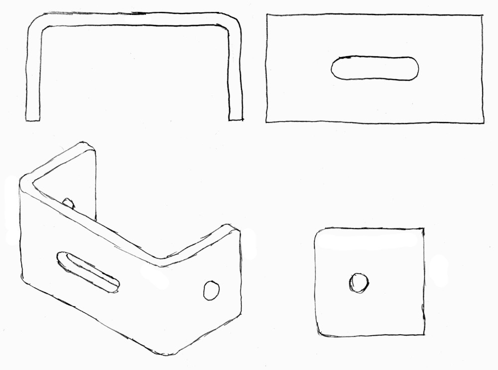

Step 1. Examine the Part in All Three Orientations

Start by visualizing the part from the front, top, and side views. Identify any symmetries in these orientations, as
symmetries can simplify the design by reducing the number of unique features you need to model.

In the following view of the bracket one can see two planes of symmetry so we’ll only need to design one quarter of it.

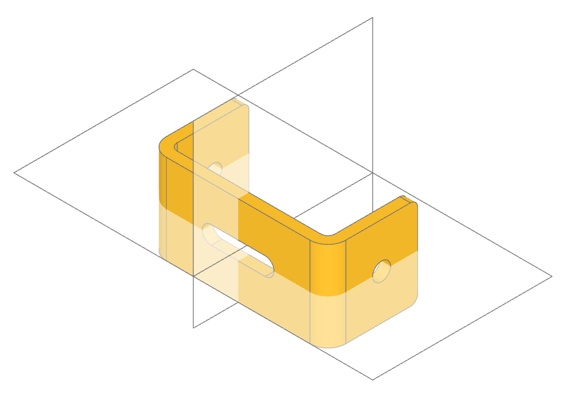

Step 2. Identify Rotational Symmetries

Look for structures that could be created through the rotation of a 2D shape. For instance, cylindrical or spherical
features are often the result of revolving a profile around an axis. Identify the axis of rotation and make a note of it.

There are no rotational structures in the example bracket.

Step 3. Select a Convenient Origin

Choose an origin point that minimizes the need to move or transform components later in the design process. Ideally,
the origin should be placed at a natural center of symmetry or a critical reference point on the part.

The planes of symmetry for the bracket was identified in step 1, making it logical to place the origin at the intersection of
these planes on the bracket’s front face. Additionally, we’ll define the coordinate system we’ll be working in: Plane.XY

<!-- PDF page 61 -->

(the default), where the origin is set at the global (0,0,0) position. In this system, the x-axis aligns with the front of the
bracket, and the z-axis corresponds to its width. It’s important to note that all coordinate systems/planes in build123d
adhere to the right-hand rule meaning the y-axis is automatically determined by this convention.

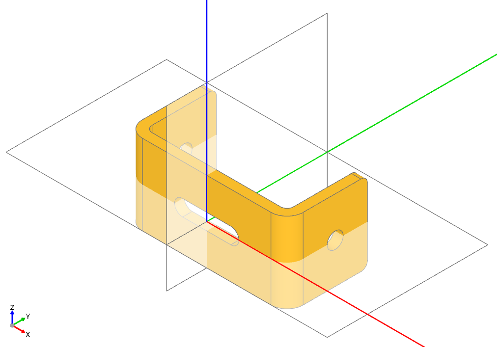

Step 4. Create 2D Profiles

Design the 2D profiles of your part in the appropriate orientation(s). These profiles are the foundation of the part’s
geometry and can often represent cross-sections of the part. Mirror parts of profiles across any axes of symmetry
identified earlier.

The 2D profile of the bracket is as follows:

<!-- PDF page 62 -->

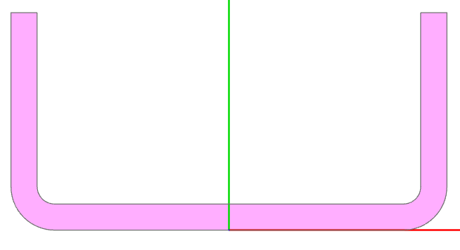

The build123d code to generate this profile is as follows:

```python
with BuildSketch() as sketch:
```

```python
    with BuildLine() as profile:
```

```python
        FilletPolyline(
            (0, 0), (length / 2, 0), (length / 2, height), radius=bend_radius
        )
        offset(amount=thickness, side=Side.LEFT)
    make_face()
    mirror(about=Plane.YZ)
```

This code creates a 2D sketch of a mirrored profile in the build123d CAD system. Here’s a step-by-step explanation of
what it does:

with BuildSketch() as sketch:

This starts a context for creating a 2D sketch, which defines the overall boundary and geometric
features. The sketch will be stored in the variable sketch.

with BuildLine() as profile:

This starts another context, this time for drawing lines (or profiles) within the sketch. The profile
consists of connected line segments, arcs, or polylines.

FilletPolyline((0, 0), (length / 2, 0), (length / 2, height), radius=bend_radius)

This object draws a polyline with three points: (0,0), (length/2, 0), and (length/2, height). A fillet
(curved corner) with a radius of bend_radius is added where applicable between the segments of the
polyline.

offset(amount=thickness, side=Side.LEFT)

This applies an offset to the polyline created earlier. The offset creates a parallel line at a distance
of thickness to the left side of the original polyline. This operation essentially thickens the profile by
a given amount.

make_face()

This command creates a 2D face from the closed profile. The offset operation ensures that the profile
is closed, allowing the creation of a solid face from the boundary defined.

<!-- PDF page 63 -->

mirror(about=Plane.YZ)

This mirrors the entire face about the YZ plane (which runs along the center of the sketch), creating
a symmetrical counterpart of the face. The mirrored geometry will complete the final shape.

Step 5. Use Extrusion for Prismatic Features

For solid or prismatic shapes, extrude the 2D profiles along the necessary axis. You can also combine multiple extru-
sions by intersecting or unionizing them to form complex shapes. Use the resulting geometry as sub-parts if needed.

The next step in implementing our design in build123d is to convert the above sketch into a part by extruding it as
shown in this code:

```python
with BuildPart() as bracket:
```

```python
    with BuildSketch() as sketch:
```

```python
        with BuildLine() as profile:
```

```python
            FilletPolyline(
                (0, 0), (length / 2, 0), (length / 2, height), radius=bend_radius
            )
            offset(amount=thickness, side=Side.LEFT)
        make_face()
        mirror(about=Plane.YZ)
    extrude(amount=width / 2)
    mirror(about=Plane.XY)
```

In this example, we’ve wrapped the sketch within a BuildPart context, which is used for creating 3D parts. We utilized
the extrude function to extend the 2D sketch into a solid object, turning it into a 3D part. Additionally, we applied the
mirror function to replicate the partial part across a plane of symmetry, ensuring a symmetrical design.

Step 6. Generate Revolved Features

If any part of the geometry can be created by revolving a 2D profile around an axis, use the revolve operation. This is
particularly useful for parts that include cylindrical, conical, or spherical features. Combine these revolved sub-parts
with existing features using additive, subtractive, or intersecting operations.

Our example has no revolved features.

Step 7. Combine Sub-parts Intelligently

When combining multiple sub-parts, keep in mind whether they need to be added, subtracted, or intersected. Subtract-
ing or intersecting can create more refined details, while addition is useful for creating complex assemblies.

Out example only has one sub-part but further sub-parts could be created in the BuildPart context by defining more
sketches and extruding or revolving them.

Step 8. Apply Chamfers and Fillets

Identify critical edges or vertices that need chamfering or filleting. Use build123d’s selectors to apply these operations
accurately. Always visually inspect the results to ensure the correct edges have been modified.

The back corners of the bracket need to be rounded off or filleted so the edges that define these corners need to be
isolated. The following code, placed to follow the previous code block, captures just these edges:

```python
corners = bracket.edges().filter_by(Axis.X).group_by(Axis.Y)[-1]
fillet(corners, fillet_radius)
```

These lines isolates specific corner edges that are then filleted.

<!-- PDF page 64 -->

corners = bracket.edges().filter_by(Axis.X).group_by(Axis.Y)[-1]

This line is used to select specific edges from the 3D part (bracket) that was created by the extrusion.

• bracket.edges() retrieves all the edges of the bracket part.

• filter_by(Axis.X) filters the edges to only those that are aligned along the X-axis.

• group_by(Axis.Y) groups the edges by their positions along the Y-axis. This operation essen-
tially organizes the filtered X-axis edges into groups based on their Y-coordinate positions.

• [-1] selects the last group of edges along the Y-axis, which corresponds to the back of the part -
the edges we are looking for.

fillet(corners, fillet_radius)

This function applies a fillet (a rounded edge) to the selected corners, with a specified radius (fil-
let_radius). The fillet smooths the sharp edges at the corners, giving the part a more refined shape.

Step 9. Design for Assembly

If the part is intended to connect with others, add features like joints, holes, or other attachment points. Ensure that
these features are precisely located to ensure proper fitment and functionality in the final assembly.

Our example has two circular holes and a slot that need to be created. First we’ll create the two circular holes:

```python
with Locations(bracket.faces().sort_by(Axis.X)[-1]):
```

```python
    Hole(hole_diameter / 2)
```

This code creates a hole in a specific face of the bracket part.

with Locations(bracket.faces().sort_by(Axis.X)[-1]):

This context sets a location(s) for subsequent operations.

• bracket.faces() retrieves all the faces of the bracket part.

• sort_by(Axis.X) sorts these faces based on their position along the X-axis (from one side of the
bracket to the other).

• [-1] selects the last face in this sorted list, which would be the face farthest along the X-axis, the
extreme right side of the part.

• Locations() creates a new local context or coordinate system at the selected face, effectively
setting this face as the working location for any subsequent operations inside the with block.

Hole(hole_diameter / 2)

This creates a hole in the selected face. The radius of the hole is specified as hole_diameter / 2.
The hole is placed at the origin of the selected face, based on the local coordinate system created by
Locations(). As the depth of the hole is not provided it is assumed to go entirely through the part.

Next the slot needs to be created in the bracket with will be done by sketching a slot on the front of the bracket and
extruding the sketch through the part.

```python
with BuildSketch(bracket.faces().sort_by(Axis.Y)[0]):
```

```python
    SlotOverall(20 * MM, hole_diameter)
extrude(amount=-thickness, mode=Mode.SUBTRACT)
```

Here’s a detailed explanation of what each part does:

with BuildSketch(bracket.faces().sort_by(Axis.Y)[0]):

This line sets up a sketching context.

• bracket.faces() retrieves all the faces of the bracket part.

<!-- PDF page 65 -->

• sort_by(Axis.Y) sorts the faces along the Y-axis, arranging them from the lowest Y-coordinate
to the highest.

• [0] selects the first face in this sorted list, which is the one located at the lowest Y-coordinate,
the nearest face of the part.

• BuildSketch() creates a new sketching context on this selected face, where 2D geometry will be
drawn.

SlotOverall(20, hole_diameter)

This command draws a slot (a rounded rectangle or elongated hole) on the selected face. The slot
has a total length of 20 mm and a width equal to hole_diameter. The slot is defined within the 2D
sketch on the selected face of the bracket.

extrude(amount=-thickness, mode=Mode.SUBTRACT)

extrude() takes the 2D sketch (the slot) and extends it into the 3D space by a distance equal to -
thickness, creating a cut into the part. The negative value (-thickness) indicates that the extrusion
is directed inward into the part (a cut). mode=Mode.SUBTRACT specifies that the extrusion is
a subtractive operation, meaning it removes material from the bracket, effectively cutting the slot
through the face of the part.

Although beyond the scope of this tutorial, joints could be defined for each of the holes to allow programmatic connec-
tion to other parts.

Step 10. Plan for Parametric Flexibility

Wherever possible, make your design parametric, allowing dimensions and features to be easily adjusted later. This
flexibility can be crucial if the design needs modifications or if variations of the part are needed.

The dimensions of the bracket are defined as follows:

```python
thickness = 3 * MM
width = 25 * MM
length = 50 * MM
height = 25 * MM
hole_diameter = 5 * MM
bend_radius = 5 * MM
fillet_radius = 2 * MM
```

Step 11. Test Fit and Tolerances

Visualize the fit of the part within its intended assembly. Consider tolerances for manufacturing, such as clearance
between moving parts or shrinkage for 3D-printed parts. Adjust the design as needed to ensure real-world functionality.

Summary

These steps should guide you through a logical and efficient workflow in build123d (or any CAD tool), helping you to
design parts with accuracy and ease.

The entire code block for the bracket example is shown here:

```python
from build123d import *
from ocp_vscode import show_all
```

```python
thickness = 3 * MM
width = 25 * MM
length = 50 * MM
```

<!-- PDF page 66 -->

```python
                                                                      (continued from previous page)
height = 25 * MM
hole_diameter = 5 * MM
bend_radius = 5 * MM
fillet_radius = 2 * MM
```

```python
with BuildPart() as bracket:
```

```python
    with BuildSketch() as sketch:
```

```python
        with BuildLine() as profile:
```

```python
            FilletPolyline(
                (0, 0), (length / 2, 0), (length / 2, height), radius=bend_radius
            )
            offset(amount=thickness, side=Side.LEFT)
        make_face()
        mirror(about=Plane.YZ)
    extrude(amount=width / 2)
    mirror(about=Plane.XY)
    corners = bracket.edges().filter_by(Axis.X).group_by(Axis.Y)[-1]
    fillet(corners, fillet_radius)
    with Locations(bracket.faces().sort_by(Axis.X)[-1]):
```

```python
        Hole(hole_diameter / 2)
    with BuildSketch(bracket.faces().sort_by(Axis.Y)[0]):
```

```python
        SlotOverall(20 * MM, hole_diameter)
    extrude(amount=-thickness, mode=Mode.SUBTRACT)
```

```python
show_all()
```

<!-- PDF page 67 -->

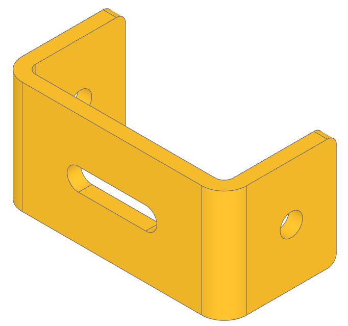


<!-- END tutorial_design.md -->


<!-- BEGIN tutorial_selectors.md -->

---
title: "Selector Tutorial"
source_html: "https://build123d.readthedocs.io/en/latest/tutorial_selectors.html"
extracted_from: "official ReadTheDocs PDF"
pdf_release: "0.11.1.dev21+gbbce3cdd6"
pdf_pages: "67-70"
generated_on: "2026-07-01"
---

# Selector Tutorial

> Converted to Markdown from the official build123d ReadTheDocs PDF. PDF page markers and local extracted-image links are included for traceability. Some line wrapping reflects the PDF layout.
<!-- PDF page 67 -->

1.9.2 Selector Tutorial

This tutorial provides a step by step guide in using selectors as we create this part:

Note

One can see any object in the following tutorial by using the ocp_vscode (or any other supported viewer) by using
the show(object_to_be_viewed) command. Alternatively, the show_all() command will display all objects
that have been assigned an identifier.

<!-- PDF page 68 -->

Step 1: Setup

Before getting to the CAD operations, this selector script needs to import the build123d environment.

```python
from build123d import *
from ocp_vscode import *
```

Step 2: Create Base with BuildPart

To start off, the part will be based on a cylinder so we’ll use the Cylinder object of BuildPart:

```python
from build123d import *
from ocp_vscode import *
```

```python
with BuildPart() as example:
```

```python
    Cylinder(radius=10, height=3)
```

Step 3: Place Sketch on top of base

The next set of features in this design will be created on the top of the cylinder and be described by a planar sketch
(BuildSketch is the tool for drawing on planar surfaces) , so we’ll create a sketch centered on the top of the cylinder.
To locate this sketch we’ll use the cylinder’s top Face as shown here:

```python
from build123d import *
from ocp_vscode import *
```

```python
with BuildPart() as example:
```

```python
    Cylinder(radius=10, height=3)
    with BuildSketch(example.faces().sort_by(Axis.Z)[-1]):
```

Here we’re using selectors to find that top Face - let’s break down example.faces().sort_by(Axis.Z)[-1]:

Step 3a: Extract Faces from a part

The first sub-step is the extraction of all of the Faces from the part that we’re building. The BuildPart instance was
assigned the identifier example so example.faces() will extract all of the Faces from that part into a custom python
list - a ShapeList.

Step 3b: Get top Face

The next sub-step is to sort the ShapeList of Faces by their position with respect to the Z Axis. The sort_by method
will sort the list by relative position of the object’s center to the Axis.Z and [-1] selects the last item on that list - or
return the top Face of the example part.

Step 4: Create hole shape

The object has a hexagonal hole in the top with a central cylinder which we’ll describe in the sketch.

```python
from build123d import *
from ocp_vscode import *
```

```python
with BuildPart() as example:
```

```python
    Cylinder(radius=10, height=3)
    with BuildSketch(example.faces().sort_by(Axis.Z)[-1]):
```

<!-- PDF page 69 -->

```python
                                                                      (continued from previous page)
        RegularPolygon(radius=7, side_count=6)
        Circle(radius=4, mode=Mode.SUBTRACT)
```

Step 4a: Draw a hexagon

We’ll create a hexagon with the use of RegularPolygon object with six sides.

Step 4b: Create a hole in the hexagon

To create the hole we’ll subtract a Circle from the sketch by using mode=Mode.SUBTRACT. The sketch now described
the hexagonal hole that we want to make in the Cylinder.

Step 5: Create the hole

To create the hole we’ll extrude() the sketch we just created into the Cylinder and subtract it.

```python
from build123d import *
from ocp_vscode import *
```

```python
with BuildPart() as example:
```

```python
    Cylinder(radius=10, height=3)
    with BuildSketch(example.faces().sort_by(Axis.Z)[-1]):
```

```python
        RegularPolygon(radius=7, side_count=6)
        Circle(radius=4, mode=Mode.SUBTRACT)
    extrude(amount=-2, mode=Mode.SUBTRACT)
```

Note that amount=-2 indicates extruding into the part and - just like with the sketch - mode=Mode.SUBTRACT instructs
the builder to subtract this hexagonal shape from the part under construction.

At this point the part looks like:

Step 6: Fillet the top perimeter Edge

The final step is to apply a fillet to the top perimeter.

```python
from build123d import *
from ocp_vscode import *
```

```python
with BuildPart() as example:
```

```python
    Cylinder(radius=10, height=3)
    with BuildSketch(example.faces().sort_by(Axis.Z)[-1]):
```

```python
        RegularPolygon(radius=7, side_count=6)
        Circle(radius=4, mode=Mode.SUBTRACT)
    extrude(amount=-2, mode=Mode.SUBTRACT)
    fillet(
```

```python
        example.edges()
        .filter_by(GeomType.CIRCLE)
        .sort_by(SortBy.RADIUS)[-2:]
        .sort_by(Axis.Z)[-1],
        radius=1,
    )
```

<!-- PDF page 70 -->

```python
show(example)
```

Here we’re using the fillet() operation which needs two things: the edge(s) to fillet and the radius of the fillet. To
provide the edge, we’ll use more selectors as described in the following sub-steps.

Step 6a: Extract all the Edges

Much like selecting Faces in Step 3a, we’ll select all of the example part’s edges with example.edges().

Step 6b: Filter the Edges for circles

Since we know that the edge we’re looking for is a circle, we can filter the edges selected in Step 6a for just those that
are of geometric type CIRCLE with example.edges().filter_by(GeomType.CIRCLE). This step removes all of
the Edges of the hexagon hole.

Step 6c: Sort the circles by radius

The perimeter are the largest circles - the central cylinder must be excluded - so we’ll sort all of the circles by their
radius with: example.edges().filter_by(GeomType.CIRCLE).sort_by(SortBy.RADIUS).

Step 6d: Slice the list to get the two largest

We know that the example part has two perimeter circles so we’ll select just the top two edges from the sorted circle
list with: example.edges().filter_by(GeomType.CIRCLE).sort_by(SortBy.RADIUS)[-2:]. The syntax of
this slicing operation is standard python list slicing.

Step 6e: Select the top Edge

The last sub-step is to select the top perimeter edge, the one with the greatest Z value which we’ll do with the
sort_by(Axis.Z)[-1] method just like Step 3b - note that these methods work on all Shape objects (Edges, Wires,
Faces, Solids, and Compounds) - with: example.edges().filter_by(GeomType.CIRCLE).sort_by(SortBy.
RADIUS)[-2:].sort_by(Axis.Z)[-1].

Conclusion

By using selectors as we have in this example we’ve used methods of identifying features that are robust to features
changing within the part. We’ve also avoided the classic CAD “Topological naming problem” by never referring to
features with names or tags that could become obsolete as the part changes.

When possible, avoid using static list indices to refer to features extracted from methods like edges() as the order
within the list is not guaranteed to remain the same.


<!-- END tutorial_selectors.md -->


<!-- BEGIN tutorial_constraints.md -->

---
title: "Drawing with Constraints"
source_html: "https://build123d.readthedocs.io/en/latest/tutorial_constraints.html"
extracted_from: "official ReadTheDocs PDF"
pdf_release: "0.11.1.dev21+gbbce3cdd6"
pdf_pages: "70-83"
generated_on: "2026-07-01"
---

# Drawing with Constraints

> Converted to Markdown from the official build123d ReadTheDocs PDF. PDF page markers and local extracted-image links are included for traceability. Some line wrapping reflects the PDF layout.
<!-- PDF page 70 -->

1.9.3 Drawing with Constraints

Introduction

CAD constraints are geometric and dimensional rules that define how sketch or assembly entities relate to one another.
They control degrees of freedom (for example, parallel, perpendicular, tangent, coincident, distance, or angle), so
edits preserve design intent instead of introducing unintended shape changes. This is the foundation of parametric
modeling: behavior is driven by explicit relationships, not fixed manually drawn geometry. This section only addresses
sketch constraints.

In graphical CAD systems, sketching is usually a two-step workflow: first draw approximate geometry, then add di-
mensions and constraints so a global solver can infer exact positions. That model works well for interactive drawing,

<!-- PDF page 71 -->

but it also encourages tightly coupled constraint networks that can become difficult to predict and maintain as a design
evolves. It is also typically strongest for lines and circular arcs, with more limited and less robust behavior for ellipses,
splines, and other higher-order curves.

In build123d, the primary workflow is different. Geometry is defined precisely at creation time using coordinates,
parameters, and explicit geometric relationships in code. Instead of building a large interdependent constraint graph
and asking a global solver to resolve it, you express intent directly: mirror about a plane, construct tangent features,
derive points and frames from existing topology, and compose operations deterministically.

This does not eliminate constrained construction; it scopes it. build123d provides targeted geometric local solvers for
common high-value problems, including objects such as BlendCurve, ConstrainedLines, ConstrainedArcs, and
Triangle. It also provides a growing family of constructors whose extent can be determined by other geometry, includ-
ing PolarLine, CenterArc, EllipticalCenterArc, EllipticalStartArc, JernArc, ParabolicCenterArc,
and HyperbolicCenterArc. Together with operations such as make_hull, mirror, and offset, these tools solve
specific constraint patterns while keeping model behavior explicit, deterministic, and readable in code.

The result is a practical hybrid approach: precise programmatic modeling by default, with specialized constrained
constructors when they provide clear leverage. For most production parts, this yields robust, maintainable sketches
without the overhead and fragility of a general-purpose sketch solver.

Constraint Types

build123d supports several practical forms of constrained construction. Rather than relying on a single global sketch
solver, it provides targeted tools that enforce specific geometric relationships directly and predictably.

Analytical Constraints

```python
Triangle
```

Constructs a triangle from any three parameters (side lengths and/or interior angles) and solves for the others.
Angle naming follows standard convention: side a is opposite angle A, side b is opposite angle B, and side c is
opposite angle C.

Continuity Constraints

```python
BlendCurve
```

Creates a smooth Bézier transition between two existing edges.

In this context, continuity describes how smoothly the new blend joins the input edges at each endpoint:

• C0 (positional continuity): endpoints meet, but direction may kink.

• C1 (tangent continuity): endpoints and tangent directions match, giving a visually smooth join with no
corner.

• C2 (curvature continuity): endpoints, tangents, and curvature trend match, reducing curvature jumps and
producing a smoother fairing.

BlendCurve builds a Bézier curve that satisfies these endpoint constraints:

• cubic Bézier for C1 blending (position + first derivative),

• quintic Bézier for C2 blending (position + first and second derivatives).

The derivatives are sampled from the two source edges at the selected connection points, then converted into
Bézier control points that enforce the requested continuity. Optional tangent scaling factors let you tune how
strongly the blend departs from each source edge, which adjusts perceived tension and transition shape without
changing the endpoint constraints.

<!-- PDF page 72 -->

Geometric Relationship Constraints

@ and % operators

Use @ (position-at) and % (tangent-at) to construct geometry relative to existing geometry. Typical uses include
starting a new edge at an exact point on another edge, or aligning a new edge direction to a sampled tangent.

```python
mirror
```

Enforces symmetry by reflecting geometry about a plane, producing mirrored entities with exact geometric cor-
respondence to the source.

Extent / Termination Constraints

PolarLine, CenterArc, EllipticalCenterArc, EllipticalStartArc, JernArc, ParabolicCenterArc, and
HyperbolicCenterArc

Construct curves from natural geometric parameters, then let another object determine where the result ends.

In these constructors, the size argument can often be either:

• a numeric angular or linear extent, or

• a limiting object such as a Shape, Axis, Location, Plane, or point-like object.

When a limit object is provided, the constructor creates the candidate geometry from the supplied start conditions,
trims it at the first valid intersection with the limit, and returns the shortest valid result from the start. If no valid
intersection exists, a ValueError is raised.

This pattern is especially useful when design intent is “go in this direction until you meet that object”, because it
removes helper construction lines and separate trim calls while keeping the relationship local to the constructor
call.

Offset / Equidistance Constraints

```python
offset
```

Creates geometry at a constant normal distance from a source edge or wire.

This enforces an equidistance relationship commonly used for wall thickness, clearances, toolpaths, and parallel
profile construction. Join behavior (for example at corners) can be controlled to match the design intent.

Tangency Constraints

```python
ConstrainedArcs and ConstrainedLines
```

Provide local constrained solving for 2D line-and-circle constructions. These APIs solve common geometric
construction problems from explicit numeric and geometric constraints relative to existing curves.

Supported constraint patterns include:

• circle with specified radius,

• line at a specified angle to another line,

• tangency of a line or circle to a reference curve,

• line or circle passing through a point,

• circle center constrained to a point or to lie on a curve.

For example, you can construct a circle with a given radius whose center lies on a specified line and which is
tangent to another circle. This style of targeted solving covers high-value sketch workflows while keeping branch
selection explicit and deterministic in code.

<!-- PDF page 73 -->

Multiple Solutions and Qualification

Tangency construction is typically multi-solution. A single problem statement can produce several valid geometric
branches depending on where the solution lies relative to the reference entities.

For example, a circle of fixed radius tangent to two secant circles can produce up to eight valid solutions as shown
below. This is expected behavior, not an error.

To reduce ambiguity, tangency constraints support qualification of relative position:

• Tangency.ENCLOSING: the solution must enclose the argument.

• Tangency.ENCLOSED: the solution must be enclosed by the argument.

• Tangency.OUTSIDE: the solution and argument must be external to each other.

• Tangency.UNQUALIFIED: no positional filtering; all valid branches are returned.

These qualifiers are intuitive for circles (inside/outside). For general oriented curves, interior is defined as the left-hand
side of the curve with respect to its orientation.

Even with qualification, more than one solution may remain. In that case, use a selector to choose deterministic
outputs.

Selecting results

In Algebra mode, select from returned edges after construction:

```python
arcs = ConstrainedArcs(..., sagitta=Sagitta.BOTH)
chosen = arcs.edges().sort_by(Edge.length)[0]
```

In Builder mode, prefer the constructor selector argument so only desired branches are added to the active context:

```python
with BuildLine():
```

```python
   ConstrainedArcs(
```

```python
         ...,
         selector=lambda edges: edges.sort_by_distance((0, 0))[0],
   )
```

This combination of qualification + selection gives robust, explicit control over tangency branch choice.

Practical Examples

The following examples show how each constraint type is used in production-style sketching. Each example is inten-
tionally small, with construction geometry kept visible in code so the relationship logic is explicit and reusable.

Analytical Constraints

build123d includes a built-in Triangle object that has an internal solver such that one can specify any three parameters
of a triangle and solve for the others. For example:

```python
>>> isosceles = Triangle(a=30, b=30, C=60)
>>> isosceles.c
29.999999999999996
>>> isosceles.A
60.00000000000001
>>> isosceles.B
```

<!-- PDF page 74 -->

```python
                                                                      (continued from previous page)
60.00000000000001
>>> isosceles.vertex_A
Vertex(-1.7763568394002505e-15, 17.32050807568877, 0.0)
```

In this example, side lengths a and b with included angle C are provided. The object then computes the remaining
side, angles, and vertices. This is useful when a design intent is naturally expressed as triangle dimensions instead of
explicit coordinates.

One can easily use external solvers, say the symbolic solver sympy, within your build123d code as follows:

```python
from math import sin, cos, tan, radians
from build123d import *
from ocp_vscode import *
import sympy
```

```python
# This problem uses the sympy symbolic math solver
```

```python
# Define the symbols for the unknowns
# - the center of the radius 30 arc (x30, y30)
# - the center of the radius 66 arc (x66, y66)
# - end of the 8° line (l8x, l8y)
# - the point with the radius 30 and 66 arc meet i30_66
# - the start of the horizontal line lh
y30, x66, xl8, yl8 = sympy.symbols("y30 x66 xl8 yl8")
x30 = 77 - 55 / 2
y66 = 66 + 32
```

```python
# There are 4 unknowns so we need 4 equations
equations = [
   (x66 - x30) ** 2 + (y66 - y30) ** 2 - (66 + 30) ** 2,  # distance between centers
   xl8 - (x30 + 30 * sin(radians(8))),  # 8 degree slope
   yl8 - (y30 + 30 * cos(radians(8))),  # 8 degree slope
   (yl8 - 50) / (55 / 2 - xl8) - tan(radians(8)),  # 8 degree slope
]
# There are two solutions but we want the 2nd one
solution = {k: float(v) for k,v in sympy.solve(equations, dict=True)[1].items()}
```

```python
# Create the critical points
c30 = Vector(x30, solution[y30])
c66 = Vector(solution[x66], y66)
l8 = Vector(solution[xl8], solution[yl8])
```

```python
...
```

This pattern is useful when the governing relationships are algebraic but awkward to construct directly with primitives.
Solve unknown parameters first, then feed the solved values into standard build123d geometry construction.

Continuity Constraints

One may want to join two curves with a third curve such that the connector satisfies a given continuity where they meet
as shown here where a semi-circle (on the left) is joined to a spline (on the right).

<!-- PDF page 75 -->

```python
m1 = CenterArc((-2, 0.6), 1, -10, 200).reversed()
m2 = Spline((0.4, -0.6), (1, -1.6), (2, 0))
connector = BlendCurve(m1, m2, tangent_scalars=(2, 1), continuity=ContinuityLevel.C2)
comb = Curve(Wire([m1, connector, m2]).curvature_comb(200))
```

The key call is BlendCurve(..., continuity=ContinuityLevel.C2). C2 continuity matches endpoint curvature
trend in addition to position and tangent, which reduces visible fairness breaks at joins. tangent_scalars controls
how strongly the connector departs from each source curve.

curvature_comb is used here as a diagnostic. The normal “comb” lines represent local curvature magnitude; smoother
transitions produce gradual comb variation rather than abrupt spikes.

Geometric Relationship Constraints

Coincident

```python
with BuildLine() as coincident_ex:
   l1 = Line((0, 0), (1, 2))
   l2 = Line(l1 @ 1, l1 @ 1 + (1, 0))
```

The second line starts at l1 @ 1 (the end of l1), creating an exact coincident relationship without a separate constraint
object.

Tangent

```python
with BuildLine() as tangent_ex:
   l1 = Line((0, 0), (1, 1))
   l2 = JernArc(start=l1 @ 1, tangent=l1 % 1, radius=1, arc_size=70)
```

The arc starts at the line endpoint and uses l1 % 1 as its initial tangent direction. This is a direct tangent construction:
continuity is encoded in the creation call.

Perpendicular

```python
with BuildLine() as perpendicular_ex:
   l1 = CenterArc((0, 0), 1.5, 0, 45)
   l2 = PolarLine(
      start=l1 @ 1, length=1, direction=l1.tangent_at(1).rotate(Axis.Z, -90)
   )
```

The direction vector is built from l1.tangent_at(1) rotated by 90 degrees, giving an explicit perpendicular rela-
tionship relative to curve orientation.

Extent / Termination Constraints

```python
with BuildLine() as intersect_ex:
   c1 = EllipticalCenterArc((0, 0), 1.2, 1.8, 0, arc_size=120, mode=Mode.PRIVATE)
   l1 = PolarLine(start=(-0.2, 0.1), length=c1, angle=10)
```

<!-- PDF page 76 -->

```python
                                                                      (continued from previous page)
   l2 = PolarLine(start=(-0.2, 0.1), length=c1, angle=70)
   l3 = add(c1.trim(l1 @ 1, l2 @ 1))
```

PolarLine creates each line from a start point and direction, then limits it by intersection with the ellipse. This is
often cleaner than creating long helper lines and manually trimming afterward, and the same pattern applies to a wide
range of arcs and conics.

The same extent-by-object pattern works with several curved constructors:

• CenterArc

• EllipticalCenterArc

• EllipticalStartArc

• JernArc

• ParabolicCenterArc

• HyperbolicCenterArc

For example, a parabola or hyperbola can be grown from a start condition and terminated by a line or axis in the same
way:

```python
p1 = ParabolicCenterArc((0, 0), 0.5, 0, arc_size=Line((0, 1), (5, 1)))
h1 = HyperbolicCenterArc((0, 0), 2, 1, 0, arc_size=Axis((0, 1), (1, 0)))
```

This is particularly useful when sketches are not symmetric and multiple local constructions must terminate against
different surrounding geometry.

Offset / Equidistance Constraints

```python
inside = FilletPolyline((1.5, 0), (1.5, 1), (-1.5, 1), (-1.5, 0), radius=0.2)
perimeter = offset(inside, amount=0.2, side=Side.RIGHT)
```

offset preserves the source profile shape while enforcing constant wall thickness. This is a common pattern for
clearances, shells, and manufacturing margins.

Tangency Constraints

Both ConstrainedArcs and ConstrainedLines return a Curve containing one or more Edge objects.

These constructors solve tangent/contact problems from mixed numeric and geometric inputs. Because tangency is
often ambiguous, multiple valid branches are expected.

Multiple solutions

Constraint systems often yield multiple valid results. The selector callback is the main tool for choosing the subset
to keep.

<!-- PDF page 77 -->

```python
# Keep all solutions
ConstrainedArcs(..., selector=lambda arcs: arcs)
```

```python
# Keep first
ConstrainedArcs(..., selector=lambda arcs: arcs[0])
```

```python
# Keep shortest
ConstrainedArcs(..., selector=lambda arcs: arcs.sort_by(Edge.length)[0])
```

In Builder mode, omitting selector can add all solutions to context, which is often not what you want for production
sketches.

Tangency qualifiers

Tangency qualifiers come from OCCT and are exposed as Tangency:

• Tangency.UNQUALIFIED: no side preference (OCCT Unqualified).

• Tangency.OUTSIDE: tangent on the exterior side of the target (OCCT Outside).

• Tangency.ENCLOSING: solution encloses/includes the target (OCCT Enclosing).

• Tangency.ENCLOSED: solution is enclosed/included by the target (OCCT Enclosed).

These semantics are most visible for curve-vs-curve constraints (for example circle to circle, line to circle). In many
practical cases, UNQUALIFIED is a good default followed by filtering via selector.

```python
with BuildLine() as egg_plant:
```

```python
   # Construction Geometry
   c1 = CenterArc((-2, 0), 0.75, 80, 240, mode=Mode.PRIVATE)
   c2 = CenterArc((2, 0), 1, 220, 250, mode=Mode.PRIVATE)
```

```python
   # egg_plant perimeter
   l1 = ConstrainedArcs((c2, Tangency.OUTSIDE), (c1, Tangency.OUTSIDE), radius=6)
   l2 = ConstrainedArcs(
      (c2, Tangency.ENCLOSING),
      (c1, Tangency.ENCLOSING),
      radius=8,
      selector=lambda a: a.sort_by(Axis.Y)[-1],
   )
   l3 = add(c1.trim(l1 @ 1, l2 @ 1))
   l4 = add(c2.trim(l1 @ 0, l2 @ 0))
```

In the “egg-plant” example, Tangency.OUTSIDE and Tangency.ENCLOSING reduce the candidate branches to the
intended outer profile. The selector on l2 then resolves the remaining ambiguity deterministically by choosing the
highest branch in Y.

OCCT defines exterior/interior using orientation:

• Circle: exterior is on the right side when traversing by its orientation (interior/material is on the left side).

• Line/open curve: interior is the left side with respect to traversal direction, exterior is the opposite side.

Because of this, changing an input edge direction can change which branches satisfy OUTSIDE/ENCLOSING/ENCLOSED.

If qualifier behavior appears inverted, inspect input edge orientation first.

<!-- PDF page 78 -->

ConstrainedArcs

Overview

ConstrainedArcs supports several signature families for planar circular arcs:

1. Two tangency/contact objects + fixed radius

2. Two tangency/contact objects + center constrained on a locus

3. Three tangency/contact objects

4. One tangency/contact object + fixed center

5. One tangency/contact object + fixed radius + center constrained on a locus

sagitta selects short/long/both arc branches:

• Sagitta.SHORT

• Sagitta.LONG

• Sagitta.BOTH

In practice, use qualifiers and sagitta to reduce branch count, then finalize with selector for deterministic output.

Signature A: Two constraints + radius

```python
ConstrainedArcs(
    tangency_one,
    tangency_two,
    radius=...,
    sagitta=Sagitta.SHORT,
    selector=lambda arcs: arcs,
)
```

Use when radius is known and arc must satisfy two contact/tangency conditions.

Signature B: Two constraints + center_on

```python
ConstrainedArcs(
    tangency_one,
    tangency_two,
    center_on=Axis(...),  # or Edge
    sagitta=Sagitta.SHORT,
    selector=lambda arcs: arcs,
)
```

Use when center must lie on a specific line/curve rather than radius being fixed.

Signature C: Three constraints

```python
ConstrainedArcs(
    tangency_one,
    tangency_two,
```

<!-- PDF page 79 -->

```python
                                                                      (continued from previous page)
    tangency_three,
    sagitta=Sagitta.BOTH,
    selector=lambda arcs: arcs,
)
```

Use for “arc tangent/contact to three entities”. This can produce several branches; always consider using selector.

Signature D: One constraint + fixed center

```python
ConstrainedArcs(
    tangency_one,
    center=(x, y),
    selector=lambda arcs: arcs[0],
)
```

Useful for “center-known” constructions.

Signature E: One constraint + radius + center_on

```python
ConstrainedArcs(
    tangency_one,
    radius=...,
    center_on=some_edge,
    selector=lambda arcs: arcs,
)
```

Useful for guided-center constructions with fixed radius.

Allowed constraint objects

For arc constraints, accepted objects include:

• Edge

• Axis

• Vertex / VectorLike point

• optional qualifier wrapper: (object, Tangency.XXX)

ConstrainedLines

Overview

ConstrainedLines supports these signature families:

1. Tangent/contact to two objects

2. Tangent/contact to one object and passing through a fixed point

3. Tangent/contact to one object with fixed orientation (angle or direction)

<!-- PDF page 80 -->

Signature A: Two constraints

```python
ConstrainedLines(
    tangency_one,
    tangency_two,
    selector=lambda lines: lines,
)
```

Signature B: One constraint + through point

```python
ConstrainedLines(
    tangency_one,
    (x, y),  # through point
    selector=lambda lines: lines,
)
```

Signature C: One constraint + fixed orientation

```python
ConstrainedLines(
    tangency_one,
    Axis.Y,
    angle=30,              # OR direction=(dx, dy)
    selector=lambda lines: lines,
)
```

Exactly one of angle or direction should be provided.

For all signatures, qualifiers can be attached to tangency inputs when side selection must be controlled.

Builder vs Algebra mode

Algebra mode

Use direct assignment and post-selection:

```python
arcs = ConstrainedArcs(..., sagitta=Sagitta.BOTH)
chosen = arcs.edges().sort_by(Edge.length)[0]
```

Builder mode

Prefer selecting inside the call to avoid adding unwanted candidates to context:

```python
with BuildLine() as bl:
```

```python
    ConstrainedArcs(
```

```python
        ...,
        sagitta=Sagitta.BOTH,
        selector=lambda arcs: arcs.sort_by(Edge.length)[0],
    )
```

<!-- PDF page 81 -->

Selection recipes

```python
# Nearest to point
selector=lambda edges: edges.sort_by_distance((0, 0))[0]
```

```python
# Longest
selector=lambda edges: edges.sort_by(Edge.length)[-1]
```

```python
# Right most
selector=lambda edges: edges.sort_by(Axis.X)[-1]
```

```python
# Keep two branches
selector=lambda edges: edges[:2]
```

Prefer geometric selection criteria (distance, axis ordering, length) over positional indexing when upstream geometry
may change.

Complex Drawing Example

This example pulls many of the techniques described above into a single example where the following full constrained,
complex sketch is converted into build123d code.

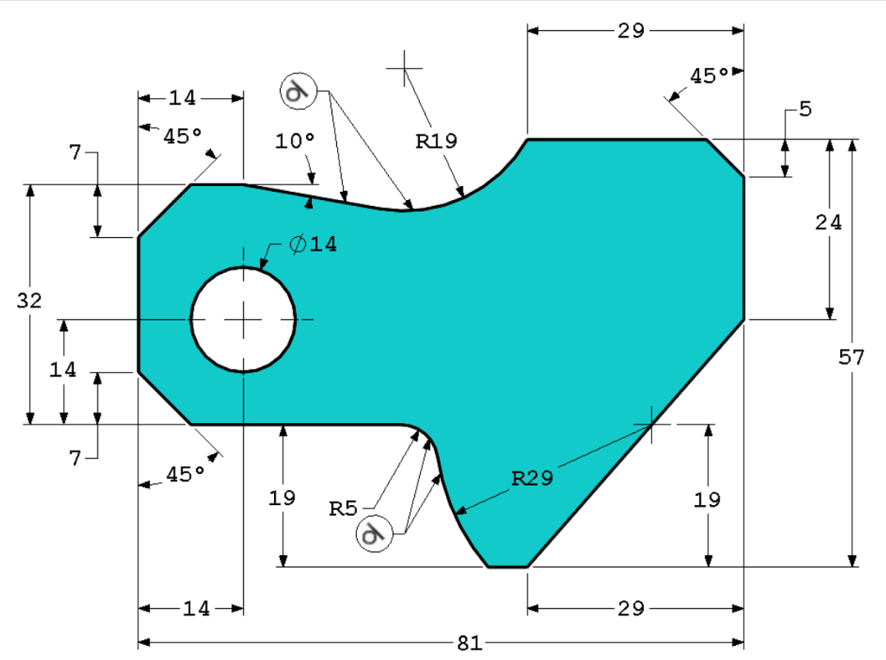

When working with a drawing such as this one, the ImageFace functionality of the ocp-vscode viewer is very handy
as it allows the image to be used as a visual guide when creating the sketch.

<!-- PDF page 82 -->

Within the following code the following conventions are used:

• construction geometry is labeled with a c_...

• arcs are labeled with a a<radius>

• lines and polylines are labeled with a l...

The code starts immediately above the origin (arbitrarily set to the origin of the circle) where a straight line 10° off the
x-axis originates. The code then walks around the diagram clockwise creating the perimeter of the object.

```python
image = ImageFace(
```

```python
   "complex_sketch.png",
   scale=29 / 264,
   origin_pixels=(297, 390),
   location=Location((0, 0, -0.1)),
)
```

```python
with BuildSketch() as sketch:
```

```python
   with BuildLine() as perimeter:
      c_l1 = PolarLine((0, 32 - 14), 50, -10, mode=Mode.PRIVATE)
      a19 = ConstrainedArcs(c_l1, (-14 + 81 - 29, -14 - 19 + 57), radius=19)
      l2 = Polyline(a19 @ 1, a19 @ 1 + (29 - 5, 0), a19 @ 1 + (29, -5), (-14 + 81, 0))
      l3 = Line(l2 @ 1, (-14 + 81 - 29, (-14 - 19)))
      c_l4 = Line((-14, -14), (-14 + 81, -14), mode=Mode.PRIVATE)
      c_a29_arc_center = l3.intersect(c_l4)[0]
      c_a29 = CenterArc(c_a29_arc_center, 29, 180, 50, mode=Mode.PRIVATE)
      l5 = PolarLine(l3 @ 1, length=c_a29, direction=(-1, 0))
      a5 = ConstrainedArcs(
            c_a29, c_l4, radius=5, selector=lambda a: a.sort_by(Axis.X)[0]
      )
      a29 = add(c_a29.trim(l5 @ 1, a5 @ 0))
      l6 = Polyline(
            a5 @ 1,
            (-14 + 7, -14),
            (-14, -14 + 7),
            (-14, -14 + 32 - 7),
            (-14 + 7, -14 + 32),
            (0, -14 + 32),
            a19 @ 0,
      )
   make_face()
   a14 = Circle(14 / 2, mode=Mode.SUBTRACT)
```

Implementation notes:

1. Build in traversal order around the perimeter. This keeps references local and makes later edits easier because
each segment depends on nearby geometry.

2. Keep helper entities private (mode=Mode.PRIVATE) so only final profile edges contribute to the resulting face.

3. Use named construction geometry (c_...) for intersections and arc centers; this improves readability and de-
bugability.

4. Use constrained constructors only where they add value (for example ConstrainedArcs), and use direct prim-
itives elsewhere.

<!-- PDF page 83 -->

5. Create a Face (make_face then center-hole subtraction) only after the perimeter is fully defined.

Troubleshooting

• Too many results: add qualifiers and a stricter selector.

• No results: relax qualifier (start with UNQUALIFIED) and verify geometry is coplanar.

• Unstable branch selection: avoid index-only selection when topology changes; prefer geometric sorting.

• Builder mode unexpectedly adds many edges: provide selector explicitly in the constructor call.


<!-- END tutorial_constraints.md -->


<!-- BEGIN tutorial_lego.md -->

---
title: "Lego Tutorial"
source_html: "https://build123d.readthedocs.io/en/latest/tutorial_lego.html"
extracted_from: "official ReadTheDocs PDF"
pdf_release: "0.11.1.dev21+gbbce3cdd6"
pdf_pages: "83-90"
generated_on: "2026-07-01"
---

# Lego Tutorial

> Converted to Markdown from the official build123d ReadTheDocs PDF. PDF page markers and local extracted-image links are included for traceability. Some line wrapping reflects the PDF layout.
<!-- PDF page 83 -->

1.9.4 Lego Tutorial

This tutorial provides a step by step guide to creating a script to build a parametric Lego block as shown here:

Step 1: Setup

Before getting to the CAD operations, this Lego script needs to import the build123d environment. There are over
100 python classes in build123d so we’ll just import them all with a from build123d import * but there are other
options that we won’t explore here.

The dimensions of the Lego block follow. A key parameter is pip_count, the length of the Lego blocks in pips. This
parameter must be at least 2.

```python
from build123d import *
from ocp_vscode import show_object
pip_count = 6
```

```python
lego_unit_size = 8
pip_height = 1.8
pip_diameter = 4.8
block_length = lego_unit_size * pip_count
block_width = 16
base_height = 9.6
block_height = base_height + pip_height
support_outer_diameter = 6.5
support_inner_diameter = 4.8
ridge_width = 0.6
ridge_depth = 0.3
wall_thickness = 1.2
```

Step 2: Part Builder

The Lego block will be created by the BuildPart builder as it’s a discrete three dimensional part; therefore, we’ll
instantiate a BuildPart with the name lego.

```python
with BuildPart() as lego:
```

Step 3: Sketch Builder

Lego blocks have quite a bit of internal structure. To create this structure we’ll draw a two dimensional sketch that
will later be extruded into a three dimensional object. As this sketch will be part of the lego part, we’ll create a sketch
builder in the context of the part builder as follows:

<!-- PDF page 84 -->

```python
with BuildPart() as lego:
```

```python
    # Draw the bottom of the block
    with BuildSketch() as plan:
```

Note that builder instance names are optional - we’ll use plan to reference the sketch. Also note that all sketch objects
are filled or 2D faces not just perimeter lines.

Step 4: Perimeter Rectangle

The first object in the sketch is going to be a rectangle with the dimensions of the outside of the Lego block. The
following step is going to refer to this rectangle, so it will be assigned the identifier perimeter.

```python
with BuildPart() as lego:
```

```python
    # Draw the bottom of the block
    with BuildSketch() as plan:
```

```python
        # Start with a Rectangle the size of the block
        perimeter = Rectangle(width=block_length, height=block_width)
```

Once the Rectangle object is created the sketch appears as follows:

Step 5: Offset to Create Walls

To create the walls of the block the rectangle that we’ve created needs to be hollowed out. This will be done with the
Offset operation which is going to create a new object from perimeter.

```python
with BuildPart() as lego:
```

```python
    # Draw the bottom of the block
    with BuildSketch() as plan:
```

```python
        # Start with a Rectangle the size of the block
        perimeter = Rectangle(width=block_length, height=block_width)
        # Subtract an offset to create the block walls
        offset(
```

```python
            perimeter,
            -wall_thickness,
            kind=Kind.INTERSECTION,
            mode=Mode.SUBTRACT,
        )
```

The first parameter to Offset is the reference object. The amount is a negative value to indicate that the offset should
be internal. The kind parameter controls the shape of the corners - Kind.INTERSECTION will create square corners.
Finally, the mode parameter controls how this object will be placed in the sketch - in this case subtracted from the
existing sketch. The result is shown here:

Now the sketch consists of a hollow rectangle.

Step 6: Create Internal Grid

The interior of the Lego block has small ridges on all four internal walls. These ridges will be created as a grid of thin
rectangles so the positions of the centers of these rectangles need to be defined. A pair of GridLocations location
contexts will define these positions, one for the horizontal bars and one for the vertical bars. As the Rectangle objects
are in the scope of a location context (GridLocations in this case) that defined multiple points, multiple rectangles
are created.

<!-- PDF page 85 -->

```python
with BuildPart() as lego:
```

```python
    # Draw the bottom of the block
    with BuildSketch() as plan:
```

```python
        # Start with a Rectangle the size of the block
        perimeter = Rectangle(width=block_length, height=block_width)
        # Subtract an offset to create the block walls
        offset(
            perimeter,
            -wall_thickness,
            kind=Kind.INTERSECTION,
            mode=Mode.SUBTRACT,
        )
        # Add a grid of lengthwise and widthwise bars
        with GridLocations(x_spacing=0, y_spacing=lego_unit_size, x_count=1, y_count=2):
```

```python
            Rectangle(width=block_length, height=ridge_width)
        with GridLocations(lego_unit_size, 0, pip_count, 1):
```

```python
            Rectangle(width=ridge_width, height=block_width)
```

Here we can see that the first GridLocations creates two positions which causes two horizontal rectangles to be cre-
ated. The second GridLocations works in the same way but creates pip_count positions and therefore pip_count
rectangles. Note that keyword parameter are optional in this case.

The result looks like this:

Step 7: Create Ridges

To convert the internal grid to ridges, the center needs to be removed. This will be done with another Rectangle.

```python
with BuildPart() as lego:
```

```python
    # Draw the bottom of the block
    with BuildSketch() as plan:
```

```python
        # Start with a Rectangle the size of the block
        perimeter = Rectangle(width=block_length, height=block_width)
        # Subtract an offset to create the block walls
        offset(
            perimeter,
            -wall_thickness,
            kind=Kind.INTERSECTION,
            mode=Mode.SUBTRACT,
        )
        # Add a grid of lengthwise and widthwise bars
        with GridLocations(x_spacing=0, y_spacing=lego_unit_size, x_count=1, y_count=2):
```

```python
            Rectangle(width=block_length, height=ridge_width)
        with GridLocations(lego_unit_size, 0, pip_count, 1):
```

```python
            Rectangle(width=ridge_width, height=block_width)
        # Subtract a rectangle leaving ribs on the block walls
        Rectangle(
```

```python
            block_length - 2 * (wall_thickness + ridge_depth),
            block_width - 2 * (wall_thickness + ridge_depth),
            mode=Mode.SUBTRACT,
        )
```

The Rectangle is subtracted from the sketch to leave the ridges as follows:

<!-- PDF page 86 -->

Step 8: Hollow Circles

Lego blocks use a set of internal hollow cylinders that the pips push against to hold two blocks together. These will be
created with Circle.

```python
with BuildPart() as lego:
```

```python
    # Draw the bottom of the block
    with BuildSketch() as plan:
```

```python
        # Start with a Rectangle the size of the block
        perimeter = Rectangle(width=block_length, height=block_width)
        # Subtract an offset to create the block walls
        offset(
            perimeter,
            -wall_thickness,
            kind=Kind.INTERSECTION,
            mode=Mode.SUBTRACT,
        )
        # Add a grid of lengthwise and widthwise bars
        with GridLocations(x_spacing=0, y_spacing=lego_unit_size, x_count=1, y_count=2):
```

```python
            Rectangle(width=block_length, height=ridge_width)
        with GridLocations(lego_unit_size, 0, pip_count, 1):
```

```python
            Rectangle(width=ridge_width, height=block_width)
        # Subtract a rectangle leaving ribs on the block walls
        Rectangle(
            block_length - 2 * (wall_thickness + ridge_depth),
            block_width - 2 * (wall_thickness + ridge_depth),
            mode=Mode.SUBTRACT,
        )
        # Add a row of hollow circles to the center
        with GridLocations(
```

```python
            x_spacing=lego_unit_size, y_spacing=0, x_count=pip_count - 1, y_count=1
        ):
```

```python
            Circle(radius=support_outer_diameter / 2)
            Circle(radius=support_inner_diameter / 2, mode=Mode.SUBTRACT)
```

Here another GridLocations is used to position the centers of the circles. Note that since both Circle objects are in
the scope of the location context, both Circles will be positioned at these locations.

Once the Circles are added, the sketch is complete and looks as follows:

Step 9: Extruding Sketch into Walls

Now that the sketch is complete it needs to be extruded into the three dimensional wall object.

```python
with BuildPart() as lego:
```

```python
    # Draw the bottom of the block
    with BuildSketch() as plan:
```

```python
        # Start with a Rectangle the size of the block
        perimeter = Rectangle(width=block_length, height=block_width)
        # Subtract an offset to create the block walls
        offset(
```

<!-- PDF page 87 -->

```python
                                                                      (continued from previous page)
            perimeter,
            -wall_thickness,
            kind=Kind.INTERSECTION,
            mode=Mode.SUBTRACT,
        )
        # Add a grid of lengthwise and widthwise bars
        with GridLocations(x_spacing=0, y_spacing=lego_unit_size, x_count=1, y_count=2):
```

```python
            Rectangle(width=block_length, height=ridge_width)
        with GridLocations(lego_unit_size, 0, pip_count, 1):
```

```python
            Rectangle(width=ridge_width, height=block_width)
        # Subtract a rectangle leaving ribs on the block walls
        Rectangle(
            block_length - 2 * (wall_thickness + ridge_depth),
            block_width - 2 * (wall_thickness + ridge_depth),
            mode=Mode.SUBTRACT,
        )
        # Add a row of hollow circles to the center
        with GridLocations(
            x_spacing=lego_unit_size, y_spacing=0, x_count=pip_count - 1, y_count=1
        ):
```

```python
            Circle(radius=support_outer_diameter / 2)
            Circle(radius=support_inner_diameter / 2, mode=Mode.SUBTRACT)
    # Extrude this base sketch to the height of the walls
    extrude(amount=base_height - wall_thickness)
```

Note how the Extrude operation is no longer in the BuildSketch scope and has returned back into the BuildPart
scope. This causes BuildSketch to exit and transfer the sketch that we’ve created to BuildPart for further processing
by Extrude.

The result is:

Step 10: Adding a Top

Now that the walls are complete, the top of the block needs to be added. Although this could be done with another
sketch, we’ll add a box to the top of the walls.

```python
with BuildPart() as lego:
```

```python
    # Draw the bottom of the block
    with BuildSketch() as plan:
```

```python
        # Start with a Rectangle the size of the block
        perimeter = Rectangle(width=block_length, height=block_width)
        # Subtract an offset to create the block walls
        offset(
            perimeter,
            -wall_thickness,
            kind=Kind.INTERSECTION,
            mode=Mode.SUBTRACT,
        )
        # Add a grid of lengthwise and widthwise bars
        with GridLocations(x_spacing=0, y_spacing=lego_unit_size, x_count=1, y_count=2):
```

```python
            Rectangle(width=block_length, height=ridge_width)
```

<!-- PDF page 88 -->

```python
                                                                      (continued from previous page)
        with GridLocations(lego_unit_size, 0, pip_count, 1):
```

```python
            Rectangle(width=ridge_width, height=block_width)
        # Subtract a rectangle leaving ribs on the block walls
        Rectangle(
            block_length - 2 * (wall_thickness + ridge_depth),
            block_width - 2 * (wall_thickness + ridge_depth),
            mode=Mode.SUBTRACT,
        )
        # Add a row of hollow circles to the center
        with GridLocations(
            x_spacing=lego_unit_size, y_spacing=0, x_count=pip_count - 1, y_count=1
        ):
```

```python
            Circle(radius=support_outer_diameter / 2)
            Circle(radius=support_inner_diameter / 2, mode=Mode.SUBTRACT)
    # Extrude this base sketch to the height of the walls
    extrude(amount=base_height - wall_thickness)
    # Create a box on the top of the walls
    with Locations((0, 0, lego.vertices().sort_by(Axis.Z)[-1].Z)):
```

```python
        # Create the top of the block
        Box(
```

```python
            length=block_length,
            width=block_width,
            height=wall_thickness,
            align=(Align.CENTER, Align.CENTER, Align.MIN),
        )
```

To position the top, we’ll describe the top center of the lego walls with a Locations context. To determine the height
we’ll extract that from the lego.part by using the vertices() method which returns a list of the positions of all of
the vertices of the Lego block so far. Since we’re interested in the top, we’ll sort by the vertical (Z) axis and take the
top of the list sort_by(Axis.Z)[-1]. Finally, the Z property of this vertex will return just the height of the top. Note
that the X and Y values are not used from the selected vertex as there are no vertices in the center of the block.

Within the scope of this Locations context, a Box is created, centered at the intersection of the x and y axis but not
in the z thus aligning with the top of the walls.

The base is closed now as shown here:

Step 11: Adding Pips

The final step is to add the pips to the top of the Lego block. To do this we’ll create a new workplane on top of the
block where we can position the pips.

```python
with BuildPart() as lego:
```

```python
    # Draw the bottom of the block
    with BuildSketch() as plan:
```

```python
        # Start with a Rectangle the size of the block
        perimeter = Rectangle(width=block_length, height=block_width)
        # Subtract an offset to create the block walls
        offset(
            perimeter,
            -wall_thickness,
            kind=Kind.INTERSECTION,
```

<!-- PDF page 89 -->

```python
                                                                      (continued from previous page)
            mode=Mode.SUBTRACT,
        )
        # Add a grid of lengthwise and widthwise bars
        with GridLocations(x_spacing=0, y_spacing=lego_unit_size, x_count=1, y_count=2):
```

```python
            Rectangle(width=block_length, height=ridge_width)
        with GridLocations(lego_unit_size, 0, pip_count, 1):
```

```python
            Rectangle(width=ridge_width, height=block_width)
        # Subtract a rectangle leaving ribs on the block walls
        Rectangle(
            block_length - 2 * (wall_thickness + ridge_depth),
            block_width - 2 * (wall_thickness + ridge_depth),
            mode=Mode.SUBTRACT,
        )
        # Add a row of hollow circles to the center
        with GridLocations(
            x_spacing=lego_unit_size, y_spacing=0, x_count=pip_count - 1, y_count=1
        ):
```

```python
            Circle(radius=support_outer_diameter / 2)
            Circle(radius=support_inner_diameter / 2, mode=Mode.SUBTRACT)
    # Extrude this base sketch to the height of the walls
    extrude(amount=base_height - wall_thickness)
    # Create a box on the top of the walls
    with Locations((0, 0, lego.vertices().sort_by(Axis.Z)[-1].Z)):
```

```python
        # Create the top of the block
        Box(
            length=block_length,
            width=block_width,
            height=wall_thickness,
            align=(Align.CENTER, Align.CENTER, Align.MIN),
        )
    # Create a workplane on the top of the block
    with BuildPart(lego.faces().sort_by(Axis.Z)[-1]):
```

```python
        # Create a grid of pips
        with GridLocations(lego_unit_size, lego_unit_size, pip_count, 2):
```

```python
            Cylinder(
```

```python
                radius=pip_diameter / 2,
                height=pip_height,
                align=(Align.CENTER, Align.CENTER, Align.MIN),
            )
```

In this case, the workplane is created from the top Face of the Lego block by using the faces method and then sorted
vertically and taking the top one sort_by(Axis.Z)[-1].

On the new workplane, a grid of locations is created and a number of Cylinder’s are positioned at each location.

This completes the Lego block. To access the finished product, refer to the builder’s internal object as shown here:

Builder    Object

BuildLine  line
BuildSketch sketch
BuildPart  part

<!-- PDF page 90 -->

so in this case the Lego block is lego.part. To display the part use show_object(lego.part) or show(lego.
part) depending on the viewer. The part could also be exported to a STL or STEP file by referencing lego.part.

Note

Viewers that don’t directly support build123d my require a raw OpenCascade object. In this case, append .wrapped
to the object (e.g.) show_object(lego.part.wrapped).


<!-- END tutorial_lego.md -->


<!-- BEGIN tutorial_joints.md -->

---
title: "Joint Tutorial"
source_html: "https://build123d.readthedocs.io/en/latest/tutorial_joints.html"
extracted_from: "official ReadTheDocs PDF"
pdf_release: "0.11.1.dev21+gbbce3cdd6"
pdf_pages: "90-97"
generated_on: "2026-07-01"
---

# Joint Tutorial

> Converted to Markdown from the official build123d ReadTheDocs PDF. PDF page markers and local extracted-image links are included for traceability. Some line wrapping reflects the PDF layout.
<!-- PDF page 90 -->

1.9.5 Joint Tutorial

This tutorial provides a step by step guide in using Joint’s as we create a box with a hinged lid to illustrate the use of
three different Joint types.

Step 1: Setup

Before getting to the CAD operations, this selector script needs to import the build123d environment.

```python
from build123d import *
from ocp_vscode import *
```

Step 2: Create Hinge

This example uses a common Butt Hinge to connect the lid to the box base so a Hinge class is used to create that can
create either of the two hinge leaves. As the focus of this tutorial is the joints and not the CAD operations to create
objects, this code is not described in detail.

```python
class Hinge(Compound):
```

```python
    """Hinge
```

```python
    Half a simple hinge with several joints. The joints are:
    - "leaf": RigidJoint where hinge attaches to object
    - "hinge_axis": RigidJoint (inner) or RevoluteJoint (outer)
    - "hole0", "hole1", "hole2": CylindricalJoints for attachment screws
```

```python
    Args:
```

```python
        width (float): width of one leaf
        length (float): hinge length
        barrel_diameter (float): size of hinge pin barrel
        thickness (float): hinge leaf thickness
        pin_diameter (float): hinge pin diameter
        inner (bool, optional): inner or outer half of hinge . Defaults to True.
    """
```

```python
    def __init__(
```

```python
        self,
        width: float,
        length: float,
        barrel_diameter: float,
        thickness: float,
        pin_diameter: float,
        inner: bool = True,
```

<!-- PDF page 91 -->

):

```python
        # The profile of the hinge used to create the tabs
        with BuildPart() as hinge_profile:
```

```python
            with BuildSketch():
```

```python
                for i, loc in enumerate(
```

```python
                    GridLocations(0, length / 5, 1, 5, align=(Align.MIN, Align.MIN))
                ):
```

```python
                    if i % 2 == inner:
```

```python
                        with Locations(loc):
```

```python
                            Rectangle(width, length / 5, align=(Align.MIN, Align.MIN))
                Rectangle(
                    width - barrel_diameter,
                    length,
                    align=(Align.MIN, Align.MIN),
                )
            extrude(amount=-barrel_diameter)
```

```python
        # The hinge pin
        with BuildPart() as pin:
```

```python
            Cylinder(
                radius=pin_diameter / 2,
                height=length,
                align=(Align.CENTER, Align.CENTER, Align.MIN),
            )
            with BuildPart(pin.part.faces().sort_by(Axis.Z)[-1]) as pin_head:
```

```python
                Cylinder(
                    radius=barrel_diameter / 2,
                    height=pin_diameter,
                    align=(Align.CENTER, Align.CENTER, Align.MIN),
                )
            fillet(
                pin_head.edges(Select.LAST).filter_by(GeomType.CIRCLE),
                radius=pin_diameter / 3,
            )
```

```python
        # Either the external and internal leaf with joints
        with BuildPart() as leaf_builder:
```

```python
            with BuildSketch():
```

```python
                with BuildLine():
                    l1 = Line((0, 0), (width - barrel_diameter / 2, 0))
                    l2 = RadiusArc(
                        l1 @ 1,
                        l1 @ 1 + Vector(0, barrel_diameter),
                        -barrel_diameter / 2,
                    )
                    l3 = RadiusArc(
                        l2 @ 1,
                        (
                            width - barrel_diameter,
                            barrel_diameter / 2,
                        ),
                        -barrel_diameter / 2,
```

<!-- PDF page 92 -->

```python
                                                                      (continued from previous page)
                    )
                    l4 = Line(l3 @ 1, (width - barrel_diameter, thickness))
                    l5 = Line(l4 @ 1, (0, thickness))
                    Line(l5 @ 1, l1 @ 0)
                make_face()
                with Locations(
                    (width - barrel_diameter / 2, barrel_diameter / 2)
                ) as pin_center:
```

```python
                    Circle(pin_diameter / 2 + 0.1 * MM, mode=Mode.SUBTRACT)
            extrude(amount=length)
            add(hinge_profile.part, rotation=(90, 0, 0), mode=Mode.INTERSECT)
```

```python
            # Create holes for fasteners
            with Locations(leaf_builder.part.faces().filter_by(Axis.Y)[-1]):
```

```python
                with GridLocations(0, length / 3, 1, 3):
                    holes = CounterSinkHole(3 * MM, 5 * MM)
            # Add the hinge pin to the external leaf
            if not inner:
```

```python
                with Locations(pin_center.locations[0]):
```

```python
                    add(pin.part)
```

Once the two leaves have been created they will look as follows:

Note that the XYZ indicators and a circle around the hinge pin indicate joints that are discussed below.

Step 3: Add Joints to the Hinge Leaf

The hinge includes five joints:

• A RigidJoint to attach the leaf

• A RigidJoint or RevoluteJoint as the hinge Axis

• Three CylindricalJoint’s for the countersunk screws

Step 3a: Leaf Joint

The first joint to add is a RigidJoint that is used to fix the hinge leaf to the box or lid.

```python
            #
            # Leaf attachment
            RigidJoint(
                label="leaf",
                joint_location=Location(
                    (width - barrel_diameter, 0, length / 2), (90, 0, 0)
                ),
            )
```

Each joint has a label which identifies it - here the string “leaf” is used, the to_part binds the joint to leaf_builder.
part (i.e. the part being built), and joint_location is specified as middle of the leaf along the edge of the pin. Note
that Location objects describe both a position and orientation which is why there are two tuples (the orientation listed
is rotate about the X axis 90 degrees).

<!-- PDF page 93 -->

Step 3b: Hinge Joint

The second joint to add is either a RigidJoint (on the inner leaf) or a RevoluteJoint (on the outer leaf) that describes
the hinge axis.

```python
            #
            # Leaf attachment
            RigidJoint(
                label="leaf",
                joint_location=Location(
                    (width - barrel_diameter, 0, length / 2), (90, 0, 0)
                ),
            )
            # [Hinge Axis] (fixed with inner)
            if inner:
```

```python
                RigidJoint(
```

```python
                    "hinge_axis",
                    joint_location=Location(
```

```python
                        (width - barrel_diameter / 2, barrel_diameter / 2, 0)
                    ),
                )
            else:
```

```python
                RevoluteJoint(
```

```python
                    "hinge_axis",
                    axis=Axis(
```

```python
                        (width - barrel_diameter / 2, barrel_diameter / 2, 0), (0, 0, 1)
                    ),
                    angular_range=(90, 270),
                )
```

The inner leaf just pivots around the outer leaf and therefore the simple RigidJoint is used to define the Location of
this pivot. The outer leaf contains the more complex RevoluteJoint which defines an axis of rotation and angular
limits to that rotation (90 and 270 in this example as the two leaves will interfere with each other outside of this range).
Note that the maximum angle must be greater than the minimum angle and therefore may be greater than 360°. Other
types of joints have linear ranges as well as angular ranges.

Step 3c: Fastener Joints

The third set of joints to add are CylindricalJoint’s that describe how the countersunk screws used to attach the
leaves move.

```python
            hole_locations = [hole.location for hole in holes]
            for hole, hole_location in enumerate(hole_locations):
```

```python
                CylindricalJoint(
                    label="hole" + str(hole),
                    axis=Axis(hole_location),
                    linear_range=(-2 * CM, 2 * CM),
                    angular_range=(0, 360),
                )
```

Much like the RevoluteJoint, a CylindricalJoint has an Axis of motion but this type of joint allows both move-
ment around and along this axis - exactly as a screw would move. Here is the Axis is setup such that a position of
0 aligns with the screw being fully set in the hole and positive numbers indicate the distance the head of the screw
is above the leaf surface. One could have reversed the direction of the Axis such that negative position values would
correspond to a screw now fully in the hole - whatever makes sense to the situation. The angular range of this joint is

<!-- PDF page 94 -->

set to (0°, 360°) as there is no limit to the angular rotation of the screw (one could choose to model thread pitch and
calculate position from angle or vice-versa).

Step 3d: Call Super

To finish off, the base class for the Hinge class is initialized:

```python
        super().__init__(leaf_builder.part.wrapped, joints=leaf_builder.part.joints)
```

Step 3e: Instantiate Hinge Leaves

Now that the Hinge class is complete it can be used to instantiate the two hinge leaves required to attach the box and
lid together.

```python
hinge_inner = Hinge(
    width=5 * CM,
    length=12 * CM,
    barrel_diameter=1 * CM,
    thickness=2 * MM,
    pin_diameter=4 * MM,
)
hinge_outer = Hinge(
    width=5 * CM,
    length=12 * CM,
    barrel_diameter=1 * CM,
    thickness=2 * MM,
    pin_diameter=4 * MM,
    inner=False,
)
```

Step 4: Create the Box

The box is created with BuildPart as a simple object - as shown below - let’s focus on the joint used to attach the
outer hinge leaf.

```python
with BuildPart() as box_builder:
    box = Box(30 * CM, 30 * CM, 10 * CM)
    offset(amount=-1 * CM, openings=box_builder.faces().sort_by(Axis.Z)[-1])
    # Create a notch for the hinge
    with Locations((-15 * CM, 0, 5 * CM)):
```

```python
        Box(2 * CM, 12 * CM, 4 * MM, mode=Mode.SUBTRACT)
    bbox = box.bounding_box()
    with Locations(
```

```python
        Plane(origin=(bbox.min.X, 0, bbox.max.Z - 30 * MM), z_dir=(-1, 0, 0))
    ):
```

```python
        with GridLocations(0, 40 * MM, 1, 3):
```

```python
            Hole(3 * MM, 1 * CM)
    RigidJoint(
```

```python
        "hinge_attachment",
        joint_location=Location((-15 * CM, 0, 4 * CM), (180, 90, 0)),
    )
```

<!-- PDF page 95 -->

Since the hinge will be fixed to the box another RigidJoint is used mark where the hinge will go. Note that the
orientation of this Joint will control how the hinge leaf is attached and is independent of the orientation of the hinge
as it was constructed.

Step 4a: Relocate Box

Note that the position and orientation of the box’s joints are given as a global Location when created but will be
translated to a relative Location internally to allow the Joint to “move” with the parent object. This allows users the
freedom to relocate objects without having to recreate or modify Joint’s. Here is the box is moved upwards to show
this property.

```python
box = box_builder.part.moved(Location((0, 0, 5 * CM)))
```

Step 5: Create the Lid

Much like the box, the lid is created in a BuildPart context and is assigned a RigidJoint.

```python
with BuildPart() as lid_builder:
```

```python
    Box(30 * CM, 30 * CM, 1 * CM, align=(Align.MIN, Align.CENTER, Align.MIN))
    with Locations((2 * CM, 0, 0)):
```

```python
        with GridLocations(0, 40 * MM, 1, 3):
```

```python
            Hole(3 * MM, 1 * CM)
    RigidJoint(
```

```python
        "hinge_attachment",
        joint_location=Location((0, 0, 0), (0, 0, 180)),
    )
lid = lid_builder.part
```

Again, the original orientation of the lid and hinge inner leaf are not important, when the joints are connected together
the parts will move into the correct position.

Step 6: Import a Screw and bind a Joint to it

Joint’s can be bound to simple objects the a Compound imported - in this case a screw.

• screw STEP model: M6-1x12-countersunk-screw.step

```python
m6_screw = import_step("M6-1x12-countersunk-screw.step")
m6_joint = RigidJoint("head", m6_screw, Location((0, 0, 0), (0, 0, 0)))
```

Here a simple RigidJoint is bound to the top of the screw head such that it can be connected to the hinge’s
CylindricalJoint.

Step 7: Connect the Joints together

This last step is the most interesting. Now that all of the joints have been defined and bound to their parent objects,
they can be connected together.

<!-- PDF page 96 -->

Step 7a: Hinge to Box

To start, the outer hinge leaf will be connected to the box, as follows:

```python
box.joints["hinge_attachment"].connect_to(hinge_outer.joints["leaf"])
```

Here the hinge_attachment joint of the box is connected to the leaf joint of hinge_outer. Note that the hinge
leaf is the object to move. Once this line is executed, we get the following:

Step 7b: Hinge to Hinge

Next, the hinge inner leaf is connected to the hinge outer leaf which is attached to the box.

```python
hinge_outer.joints["hinge_axis"].connect_to(hinge_inner.joints["hinge_axis"], angle=120)
```

As hinge_outer.joints["hinge_axis"] is a RevoluteJoint there is an angle parameter that can be set (angles
default to the minimum range value) - here to 120°. This is what that looks like:

Step 7c: Lid to Hinge

Now the lid is connected to the hinge_inner:

```python
hinge_inner.joints["leaf"].connect_to(lid.joints["hinge_attachment"])
```

which results in:

Note how the lid is now in an open position. To close the lid just change the above angle parameter from 120° to 90°.

Step 7d: Screw to Hinge

The last step in this example is to place a screw in one of the hinges:

```python
hinge_outer.joints["hole2"].connect_to(m6_joint, position=5 * MM, angle=30)
```

As the position is a positive number the screw is still proud of the hinge face as shown here:

Try changing these position and angle values to “tighten” the screw.

Conclusion

Use a Joint to locate two objects relative to each other with some degree of motion. Keep in mind that when using
the connect_to method, self is always fixed and other will move to the appropriate Location.

Note

The joint symbols can be displayed as follows (your viewer may use show instead of show_object):

```python
 show_object(box.joints["hinge_attachment"].symbol, name="box attachment point")
```

or

<!-- PDF page 97 -->

```python
 show_object(m6_joint.symbol, name="m6 screw symbol")
```

or, with the ocp_vscode viewer

```python
 show(box, render_joints=True)
```


<!-- END tutorial_joints.md -->


<!-- BEGIN examples_1.md -->

---
title: "The build123d Examples"
source_html: "https://build123d.readthedocs.io/en/latest/examples_1.html"
extracted_from: "official ReadTheDocs PDF"
pdf_release: "0.11.1.dev21+gbbce3cdd6"
pdf_pages: "97-181"
generated_on: "2026-07-01"
---

# The build123d Examples

> Converted to Markdown from the official build123d ReadTheDocs PDF. PDF page markers and local extracted-image links are included for traceability. Some line wrapping reflects the PDF layout.
<!-- PDF page 97 -->

1.9.6 The build123d Examples

Overview

In the GitHub repository you will find an examples folder.

Most of the examples show the builder and algebra modes.

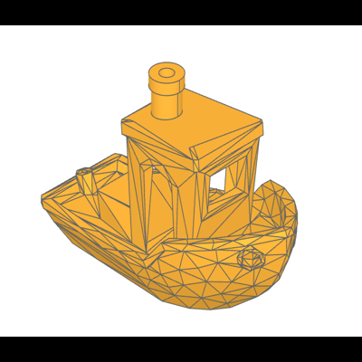

<!-- PDF page 98 -->

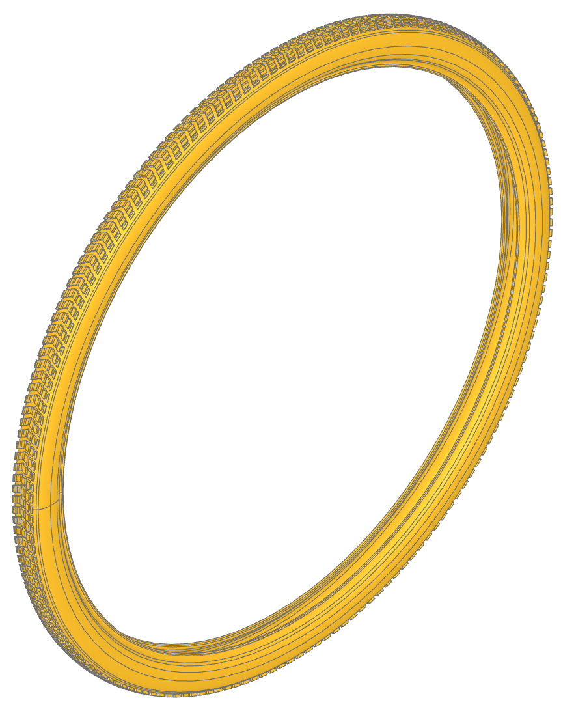

Benchy  Benchy

Bicycle Tire Bicycle Tire

<!-- PDF page 99 -->

Bracelet Bracelet

Canadian  Flag Blowing  in  The   Wind            Canadian  Flag  Blowing  in  The  Wind

<!-- PDF page 100 -->

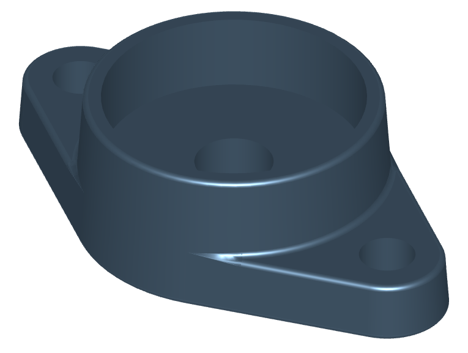

<!-- PDF page 101 -->

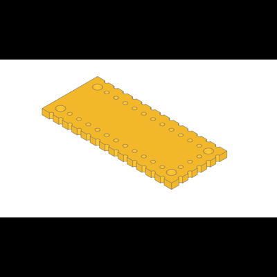

Cast Bearing Unit Cast Bearing Unit

<!-- PDF page 102 -->

Circuit Board With Holes Circuit Board With Holes

<!-- PDF page 103 -->

Clock Face Clock Face

<!-- PDF page 104 -->

Fast Grid Holes Fast Grid Holes

<!-- PDF page 105 -->


Handle  Handle

<!-- PDF page 106 -->

Heat Exchanger Heat Exchanger

<!-- PDF page 107 -->

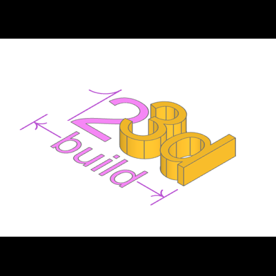

Key Cap  Key Cap

<!-- PDF page 108 -->

(former) build123d Logo Former build123d Logo

<!-- PDF page 109 -->

Maker Coin Maker Coin

<!-- PDF page 110 -->

Multi-Sketch Loft Multi-Sketch Loft

<!-- PDF page 111 -->

Peg Board J Hook Peg Board Hook

<!-- PDF page 112 -->

Platonic Solids Platonic Solids

<!-- PDF page 113 -->

Playing Cards Playing Cards

<!-- PDF page 114 -->

Stud Wall Stud Wall

<!-- PDF page 115 -->

Tea Cup Tea Cup

<!-- PDF page 116 -->

Toy Truck Toy Truck

Vase  Vase

<!-- PDF page 117 -->

Benchy

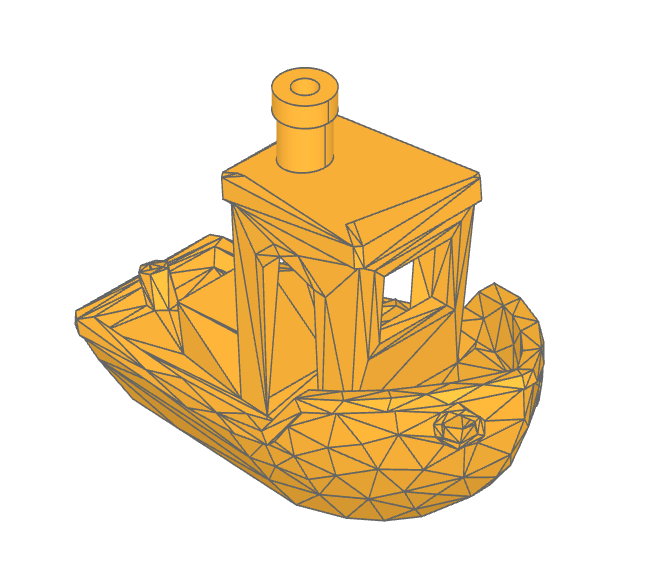

The Benchy examples shows how to import a STL model as a Solid object with the class Mesher and modify it by
replacing chimney with a BREP version.

• Benchy STL model: low_poly_benchy.stl

<!-- PDF page 118 -->

Gallery

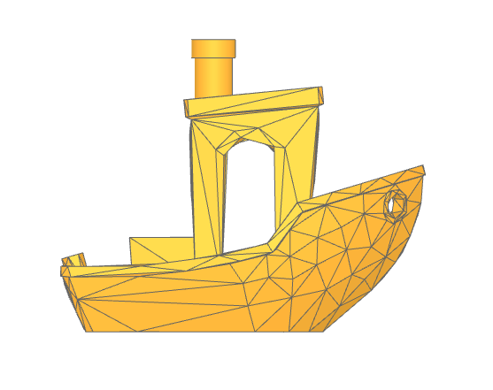

<!-- PDF page 119 -->

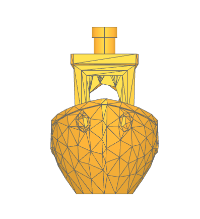

Reference Implementation (Builder Mode)

```python
# Import the benchy as a Solid model
importer = Mesher()
benchy_stl = importer.read("low_poly_benchy.stl")[0]
```

```python
with BuildPart() as benchy:
```

```python
    add(benchy_stl)
```

```python
    # Determine the plane that defines the top of the roof
    vertices = benchy.vertices()
    roof_vertices = vertices.filter_by_position(Axis.Z, 38, 42)
    roof_plane_vertices = [
        roof_vertices.group_by(Axis.Y, tol_digits=2)[-1].sort_by(Axis.X)[0],
        roof_vertices.sort_by(Axis.Z)[0],
        roof_vertices.group_by(Axis.Y, tol_digits=2)[0].sort_by(Axis.X)[0],
    ]
    roof_plane = Plane(
```

```python
        Face(Wire.make_polygon([v.to_tuple() for v in roof_plane_vertices]))
    )
    # Remove the faceted smoke stack
    split(bisect_by=roof_plane, keep=Keep.BOTTOM)
```

```python
    # Determine the position and size of the smoke stack
    smoke_stack_vertices = vertices.group_by(Axis.Z, tol_digits=0)[-1]
```

<!-- PDF page 120 -->

```python
                                                                      (continued from previous page)
    smoke_stack_center = sum(
        [Vector(v.X, v.Y, v.Z) for v in smoke_stack_vertices], Vector()
    ) * (1 / len(smoke_stack_vertices))
    smoke_stack_radius = max(
        [
            (Vector(*v.to_tuple()) - smoke_stack_center).length
            for v in smoke_stack_vertices
        ]
    )
```

```python
    # Create the new smoke stack
    with BuildSketch(Plane(smoke_stack_center)):
```

```python
        Circle(smoke_stack_radius)
        Circle(smoke_stack_radius - 2 * MM, mode=Mode.SUBTRACT)
    extrude(amount=-3 * MM)
    with BuildSketch(Plane(smoke_stack_center)):
```

```python
        Circle(smoke_stack_radius - 0.5 * MM)
        Circle(smoke_stack_radius - 2 * MM, mode=Mode.SUBTRACT)
    extrude(amount=roof_plane_vertices[1].Z - smoke_stack_center.Z)
```

```python
show(benchy)
```

Bicycle Tire


This example demonstrates how to model a realistic bicycle tire with a patterned tread using build123d. The key concept
showcased here is the use of wrap_faces to project 2D planar geometry onto a curved 3D surface.

<!-- PDF page 121 -->

Reference Implementation (Builder Mode)

```python
import copy
from build123d import *
from ocp_vscode import show
```

```python
wheel_diameter = 740 * MM
```

```python
with BuildSketch() as tire_profile:
```

```python
    with BuildLine() as build_profile:
        l00 = Bezier((0.0, 0.0), (7.05, 0.0), (12.18, 1.54), (15.13, 4.54))
        l01 = Bezier(l00 @ 1, (15.81, 5.22), (15.98, 5.44), (16.5, 6.23))
        l02 = Bezier(l01 @ 1, (18.45, 9.19), (19.61, 13.84), (19.94, 20.06))
        l03 = Bezier(l02 @ 1, (20.1, 23.24), (19.93, 27.48), (19.56, 29.45))
        l04 = Bezier(l03 @ 1, (19.13, 31.69), (18.23, 33.67), (16.91, 35.32))
        l05 = Bezier(l04 @ 1, (16.26, 36.12), (15.57, 36.77), (14.48, 37.58))
        l06 = Bezier(l05 @ 1, (12.77, 38.85), (11.51, 40.28), (10.76, 41.78))
        l07 = Bezier(l06 @ 1, (10.07, 43.16), (10.15, 43.81), (11.03, 43.98))
        l08 = Bezier(l07 @ 1, (11.82, 44.13), (12.15, 44.55), (12.08, 45.33))
        l09 = Bezier(l08 @ 1, (12.01, 46.07), (11.84, 46.43), (11.43, 46.69))
        l10 = Bezier(l09 @ 1, (10.98, 46.97), (10.07, 46.7), (9.47, 46.1))
        l11 = Bezier(l10 @ 1, (9.03, 45.65), (8.88, 45.31), (8.84, 44.65))
        l12 = Bezier(l11 @ 1, (8.78, 43.6), (9.11, 42.26), (9.72, 41.0))
        l13 = Bezier(l12 @ 1, (10.43, 39.54), (11.52, 38.2), (12.78, 37.22))
        l14 = Bezier(l13 @ 1, (15.36, 35.23), (16.58, 33.76), (17.45, 31.62))
        l15 = Bezier(l14 @ 1, (17.91, 30.49), (18.22, 29.27), (18.4, 27.8))
        l16 = Bezier(l15 @ 1, (18.53, 26.78), (18.52, 23.69), (18.37, 22.61))
        l17 = Bezier(l16 @ 1, (17.8, 18.23), (16.15, 14.7), (13.39, 11.94))
        l18 = Bezier(l17 @ 1, (11.89, 10.45), (10.19, 9.31), (8.09, 8.41))
        l19 = Bezier(l18 @ 1, (3.32, 6.35), (0.0, 6.64))
        mirror(about=Plane.YZ)
    make_face()
```

```python
tire = revolve(Pos(Y=-wheel_diameter / 2) * tire_profile.face(), Axis.X)
```

```python
with BuildSketch() as tread_pattern:
```

```python
    with Locations((1, 1)):
```

```python
        Trapezoid(15, 12, 60, 120, align=Align.MIN)
    with Locations((1, 8)):
```

```python
        with GridLocations(0, 5, 1, 2):
```

```python
            Rectangle(50, 2, mode=Mode.SUBTRACT)
```

```python
# Define the surface and path that the tread pattern will be wrapped onto
half_road_surface = Face.revolve(Pos(Y=-wheel_diameter / 2) * l00, 360, Axis.X)
tread_path = half_road_surface.edges().sort_by(Axis.X)[0]
```

```python
# Wrap the planar tread pattern onto the tire's outside surface
tread_faces = half_road_surface.wrap_faces(tread_pattern.faces(), tread_path)
```

```python
# Mirror the faces to the other half of the tire
tread_faces.extend([mirror(t, Plane.YZ) for t in tread_faces])
```

```python
# Thicken the tread to become solid nubs
```

<!-- PDF page 122 -->

```python
                                                                      (continued from previous page)
# tread_prime = [Solid.thicken(f, 3 * MM) for f in tread_faces]
tread_prime = [thicken(f, 3 * MM) for f in tread_faces]
```

```python
# Copy the nubs around the whole tire
tread = [Rot(X=r) * copy.copy(t) for t in tread_prime for r in range(0, 360, 2)]
```

```python
show(tire, tread)
```

Bracelet

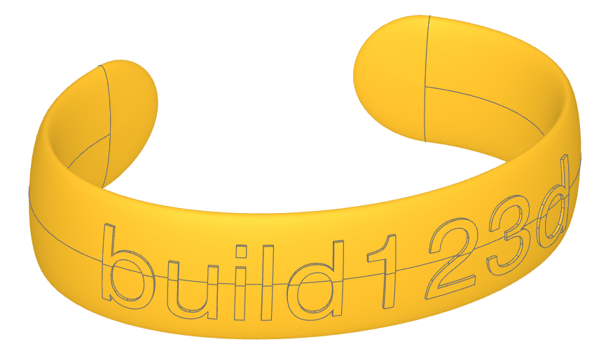

Doubly-curved bracelet with an embossed label

This model is a good “stress test” for OCCT because most of the final boundary surfaces are freeform (not analytic
planes/cylinders/spheres). The geometry is assembled from:

• a swept center section (using a curved solid end-face as the sweep profile)

• two freeform “tip caps” built as Gordon surfaces (network of curves)

• an optional embossed text label projected onto a curved solid

• alignment holes for splitting/printing/assembly

Key techniques demonstrated:

• using location_at/position_at/tangent (%) to extract local frames & tangents

• projecting curves onto a non-planar surface to create “true” 3D guide curves

• Gordon surfaces to build high-quality doubly-curved skins

• projecting faces (text) onto a complex solid and thickening them

<!-- PDF page 123 -->

Reference Implementation (Algebra Mode)

```python
from build123d import *
from ocp_vscode import show
```

```python
# Define input parameters
# - radii: ellipse radii (X, Y) controlling the bracelet centerline shape
# - width: bracelet width (along Z for the center sweep)
# - thickness: bracelet thickness (radial thickness of the cross section)
# - opening_angle: the missing angle that creates the wrist opening
# - label_str: optional text to emboss on the outside surface
# - Define input parameters
# radii, width, thickness, opening_angle, label_str = (45, 30), 25, 5, 80, "build123d"
radii, width, thickness, opening_angle, label_str = (45, 30), 25, 5, 80, ""
```

```python
# Step 1: Create an elliptical arc defining the *centerline* of the bracelet.
# The arc is truncated to leave an opening (the "gap" where the bracelet goes on).
# Angles are in degrees; 270° points downward, which keeps the opening centered at the␣
```

```python
˓→bottom.
center_arc = EllipticalCenterArc(
    (0, 0), *radii, 270 + opening_angle / 2, arc_size=360 - opening_angle
)
```

```python
# Step 2: Create HALF of the end cross-section, positioned at the end of the arc.
# We build only half so we can later mirror it to enforce symmetry and reduce
# curve-network complexity when building the freeform tip.
#
# location_at(1) returns a local coordinate frame at the arc end (tangent-aware).
# x_dir is chosen so the section’s local "X" is well-defined and stable.
end_center_arc = center_arc.location_at(1, x_dir=(0, 0, 1))
half_x_section = EllipticalCenterArc(
    (0, 0), width / 2, thickness / 2, 90, arc_size=180
).locate(end_center_arc)
```

```python
# Step 3: Create a doubly-curved "tip edge" curve.
# The tip edge must live in 3D and conform to the outside of the bracelet.
# To do that, we:
#   1) create a surface by extruding the center_arc into a sheet (a ribbon surface)
#   2) build a planar arc in a local frame at the end of that surface
#   3) project the planar arc onto the curved surface to get a true 3D curve
#
# The resulting tip_arc is a 3D edge that naturally matches the bracelet curvature.
center_surface = -Face.extrude(center_arc, (0, 0, 2 * width)).moved(
```

```python
    Location((0, 0, -width), (0, 0, 180))
)
tip_center_loc = -center_surface.location_at(center_arc @ 1, x_dir=(1, 0, 0))
normal_at_tip_center = tip_center_loc.z_axis.direction
```

```python
# A planar arc that would represent the outer boundary of the tip *if* the surface
# were flat. We immediately project it to make it truly conformal in 3D.
planar_tip_arc = CenterArc((0, 0), width / 2, 270, 180).locate(tip_center_loc).edge()
tip_arc = planar_tip_arc.project_to_shape(center_surface, -normal_at_tip_center)[0]
```

<!-- PDF page 124 -->

```python
                                                                      (continued from previous page)
# Step 4: Build the tip as a Gordon surface (a surface fit through a curve network).
# Gordon surfaces are ideal when:
#   - you don’t have an obvious analytic surface
#   - curvature changes in two directions (doubly-curved "cap")
#   - you can define a consistent set of profile curves + guide curves
#
# Here:
#   - profiles define "across the tip" shape (section -> bulged spline -> mirrored␣
```

```python
˓→section)
#   - guides define "along the tip" rails (start point -> projected 3D arc -> end point)
#
# Tangents are used to encourage smoothness where the tip joins the swept center section.
profile = Spline(
    half_x_section @ 0,
    tip_arc @ 0.5,
    half_x_section @ 1,
    tangents=(center_arc % 1, -(center_arc % 1)),
)
tip_surface = Face.make_gordon_surface(
    profiles=[half_x_section, profile, half_x_section.mirror(Plane.XY)],
    guides=[half_x_section @ 0, tip_arc, half_x_section @ 1],
)
```

```python
# Step 5: Close the tip surface into a watertight Solid.
# tip_surface is the outer "skin"; we create a side face from its boundary wire
# and make a shell, then a solid.
tip_side = Face(tip_surface.wire())
tip = Solid(Shell([tip_side, tip_surface]))
```

```python
# Step 6: Sweep the *flat end face* of the tip around the center arc.
# This is the trick that makes the center section compatible with the freeform tip:
# the sweep profile is the same face that bounds the tip, so the join is naturally␣
```

```python
˓→aligned.
center_section = sweep(tip_side, center_arc).solid()
```

```python
# Step 7: Assemble the bracelet from the center and two mirrored tips.
# Mirror across YZ to create the opposite end cap.
bracelet = Solid() + [tip, center_section, tip.mirror(Plane.YZ)]
```

```python
# Step 8: Add an embossed label.
# This is often the hardest operation for OCCT in this model:
# projecting text onto a doubly-curved surface can create many small faces/edges,
# and thickening them adds even more boolean complexity.
if label_str:
    label = Text(label_str, font_size=width * 0.8, align=Align.CENTER)
```

```python
    # Project the text onto the bracelet using a path-based placement along center_arc.
    # The parameter offsets the label so it sits centered along arc-length.
    p_labels = bracelet.project_faces(
        label, center_arc, 0.5 - 0.5 * (label.bounding_box().size.X) / center_arc.length
    )
    # Turn the projected faces into solids via thickening (embossing).
```

<!-- PDF page 125 -->

```python
                                                                      (continued from previous page)
    embossed_label = [Solid.thicken(f, 0.5) for f in p_labels.faces()]
    bracelet += embossed_label
```

```python
# Step 9: Add alignment holes to aid assembly after 3D printing in two halves.
# These are placed at evenly spaced locations along the arc (including both ends).
# A small clearance (+0.15) is included for typical FDM tolerances.
alignment_holes = [
```

```python
    Pos(p) * Cylinder(1.75 / 2 + 0.15, 8)
    for p in [center_arc.position_at(i / 4) for i in range(5)]
]
bracelet -= alignment_holes
```

```python
show(bracelet)
```

Former build123d Logo

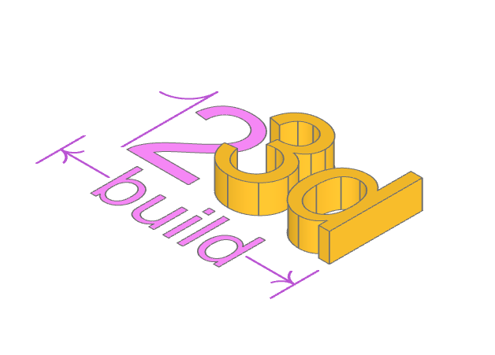

This example creates the former build123d logo (new logo was created in the end of 2023).

Using text and lines to create the first build123d logo. The builder mode example also generates the SVG file logo.svg.

<!-- PDF page 126 -->

Reference Implementation (Builder Mode)

```python
with BuildSketch() as logo_text:
```

```python
    Text("123d", font_size=10, align=(Align.MIN, Align.MIN))
    font_height = logo_text.vertices().sort_by(Axis.Y)[-1].Y
```

```python
with BuildSketch() as build_text:
```

```python
    Text("build", font_size=5, align=(Align.CENTER, Align.CENTER))
    build_bb = bounding_box(build_text.sketch, mode=Mode.PRIVATE)
    build_vertices = build_bb.vertices().sort_by(Axis.X)
    build_width = build_vertices[-1].X - build_vertices[0].X
```

```python
with BuildLine() as one:
    l1 = Line((font_height * 0.3, 0), (font_height * 0.3, font_height))
    TangentArc(l1 @ 1, (0, font_height * 0.7), tangent=(l1 % 1) * -1)
```

```python
with BuildSketch() as two:
```

```python
    with Locations((font_height * 0.35, 0)):
```

```python
        Text("2", font_size=10, align=(Align.MIN, Align.MIN))
```

```python
with BuildPart() as three_d:
```

```python
    with BuildSketch(Plane((font_height * 1.1, 0))):
```

```python
        Text("3d", font_size=10, align=(Align.MIN, Align.MIN))
    extrude(amount=font_height * 0.3)
    logo_width = three_d.vertices().sort_by(Axis.X)[-1].X
```

```python
with BuildLine() as arrow_left:
    t1 = TangentArc((0, 0), (1, 0.75), tangent=(1, 0))
    mirror(t1, Plane.XZ)
```

```python
ext_line_length = font_height * 0.5
dim_line_length = (logo_width - build_width - 2 * font_height * 0.05) / 2
with BuildLine() as extension_lines:
    l1 = Line((0, -font_height * 0.1), (0, -ext_line_length - font_height * 0.1))
    l2 = Line(
        (logo_width, -font_height * 0.1),
        (logo_width, -ext_line_length - font_height * 0.1),
    )
    with Locations(l1 @ 0.5):
```

```python
        add(arrow_left.line)
    with Locations(l2 @ 0.5):
```

```python
        add(arrow_left.line, rotation=180.0)
    Line(l1 @ 0.5, l1 @ 0.5 + Vector(dim_line_length, 0))
    Line(l2 @ 0.5, l2 @ 0.5 - Vector(dim_line_length, 0))
```

```python
# Precisely center the build Faces
with BuildSketch() as build:
```

```python
    with Locations(
        (l1 @ 0.5 + l2 @ 0.5) / 2
        - Vector((build_vertices[-1].X + build_vertices[0].X) / 2, 0)
    ):
```

```python
        add(build_text.sketch)
```

<!-- PDF page 127 -->

```python
if True:
    logo = Compound(
        children=[
            one.line,
            two.sketch,
            three_d.part,
            extension_lines.line,
            build.sketch,
        ]
    )
```

```python
    # logo.export_step("logo.step")
    def add_svg_shape(svg: ExportSVG, shape: Shape, color: tuple[float, float, float]):
```

```python
        global counter
        try:
            counter += 1
        except:
            counter = 1
```

```python
        visible, _hidden = shape.project_to_viewport(
            (-5, 1, 10), viewport_up=(0, 1, 0), look_at=(0, 0, 0)
        )
        if color is not None:
            svg.add_layer(str(counter), fill_color=color, line_weight=1)
        else:
            svg.add_layer(str(counter), line_weight=1)
        svg.add_shape(visible, layer=str(counter))
```

```python
    svg = ExportSVG(scale=20)
    add_svg_shape(svg, logo, None)
    # add_svg_shape(svg, Compound(children=[one.line, extension_lines.line]), None)
    # add_svg_shape(svg, Compound(children=[two.sketch, build.sketch]), (170, 204, 255))
    # add_svg_shape(svg, three_d.part, (85, 153, 255))
    svg.write("logo.svg")
```

```python
show_object(one, name="one")
show_object(two, name="two")
show_object(three_d, name="three_d")
show_object(extension_lines, name="extension_lines")
show_object(build, name="build")
```

Reference Implementation (Algebra Mode)

```python
logo_text = Text("123d", font_size=10, align=Align.MIN)
font_height = logo_text.vertices().sort_by(Axis.Y).last.Y
```

```python
build_text = Text("build", font_size=5, align=Align.CENTER)
build_bb = build_text.bounding_box()
build_width = build_bb.max.X - build_bb.min.X
```

<!-- PDF page 128 -->

```python
                                                                      (continued from previous page)
l1 = Line((font_height * 0.3, 0), (font_height * 0.3, font_height))
one = l1 + TangentArc(l1 @ 1, (0, font_height * 0.7), tangent=(l1 % 1) * -1)
```

```python
two = Pos(font_height * 0.35, 0) * Text("2", font_size=10, align=Align.MIN)
```

```python
three_d = Text("3d", font_size=10, align=Align.MIN)
three_d = Pos(font_height * 1.1, 0) * extrude(three_d, amount=font_height * 0.3)
logo_width = three_d.vertices().sort_by(Axis.X).last.X
```

```python
t1 = TangentArc((0, 0), (1, 0.75), tangent=(1, 0))
arrow_left = t1 + mirror(t1, Plane.XZ)
```

```python
ext_line_length = font_height * 0.5
dim_line_length = (logo_width - build_width - 2 * font_height * 0.05) / 2
```

```python
l1 = Line((0, -font_height * 0.1), (0, -ext_line_length - font_height * 0.1))
l2 = Line(
    (logo_width, -font_height * 0.1),
    (logo_width, -ext_line_length - font_height * 0.1),
)
extension_lines = Curve() + (l1 + l2)
extension_lines += Pos(*(l1 @ 0.5)) * arrow_left
extension_lines += (Pos(*(l2 @ 0.5)) * Rot(Z=180)) * arrow_left
extension_lines += Line(l1 @ 0.5, l1 @ 0.5 + Vector(dim_line_length, 0))
extension_lines += Line(l2 @ 0.5, l2 @ 0.5 - Vector(dim_line_length, 0))
```

```python
# Precisely center the build Faces
p1 = Pos((l1 @ 0.5 + l2 @ 0.5) / 2 - Vector((build_bb.max.X + build_bb.min.X) / 2, 0))
build = p1 * build_text
```

```python
cmpd = Compound([three_d, two, one, build, extension_lines])
```

```python
show_object(cmpd, name="compound")
```

<!-- PDF page 129 -->

Cast Bearing Unit


This example demonstrates the creation of a castable flanged bearing housing using the draft operation to add appro-
priate draft angles for mold release.

Reference Implementation (Builder Mode)

```python
from build123d import *
from ocp_vscode import show
```

```python
A, A1, Db2, H, J = 26, 11, 57, 98.5, 76.5
with BuildPart() as oval_flanged_bearing_unit:
```

```python
    with BuildSketch() as plan:
        housing = Circle(Db2 / 2)
        with GridLocations(J, 0, 2, 1) as bolt_centers:
```

```python
            Circle((H - J) / 2)
        make_hull()
    extrude(amount=A1)
    extrude(housing, amount=A)
    drafted_faces = oval_flanged_bearing_unit.faces().filter_by(Axis.Z, reverse=True)
    draft(drafted_faces, Plane.XY, 4)
    fillet(oval_flanged_bearing_unit.edges(), 1)
    with Locations(oval_flanged_bearing_unit.faces().sort_by(Axis.Z)[-1]):
```

<!-- PDF page 130 -->

```python
                                                                      (continued from previous page)
        CounterBoreHole(14 / 2, 47 / 2, 14)
    with Locations(*bolt_centers):
```

```python
        Hole(5)
```

```python
oval_flanged_bearing_unit.part.color = Color(0x4C6377)
```

```python
show(oval_flanged_bearing_unit)
```

Canadian Flag Blowing in The Wind


A Canadian Flag blowing in the wind created by projecting planar faces onto a non-planar face (the_wind).

This example also demonstrates building complex lines that snap to existing features.

<!-- PDF page 131 -->

More Images

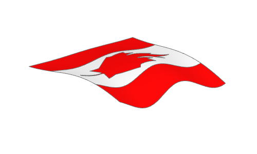

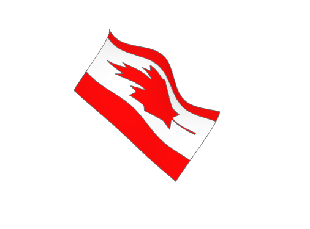

Reference Implementation (Builder Mode)

```python
def surface(amplitude, u, v):
```

```python
    """Calculate the surface displacement of the flag at a given position"""
    return v * amplitude / 20 * cos(3.5 * pi * u) + amplitude / 10 * v * sin(
```

```python
        1.1 * pi * v
    )
```

<!-- PDF page 132 -->

```python
# Note that the surface to project on must be a little larger than the faces
# being projected onto it to create valid projected faces
the_wind = Face.make_surface_from_array_of_points(
    [
        [
```

```python
            Vector(
                width * (v * 1.1 / 40 - 0.05),
                height * (u * 1.2 / 40 - 0.1),
                height * surface(wave_amplitude, u / 40, v / 40) / 2,
            )
            for u in range(41)
        ]
        for v in range(41)
    ]
)
with BuildSketch(Plane.XY.offset(10)) as west_field_builder:
```

```python
    Rectangle(width / 4, height, align=(Align.MIN, Align.MIN))
west_field_planar = west_field_builder.sketch.faces()[0]
east_field_planar = west_field_planar.mirror(Plane.YZ.offset(width / 2))
```

```python
with BuildSketch(Plane((width / 2, 0, 10))) as center_field_builder:
```

```python
    Rectangle(width / 2, height, align=(Align.CENTER, Align.MIN))
    with BuildSketch(
```

```python
        Plane((width / 2, 0, 10)), mode=Mode.SUBTRACT
    ) as maple_leaf_builder:
```

```python
        with BuildLine() as outline:
            l1 = Polyline((0.0000, 0.0771), (0.0187, 0.0771), (0.0094, 0.2569))
            l2 = Polyline((0.0325, 0.2773), (0.2115, 0.2458), (0.1873, 0.3125))
            RadiusArc(l1 @ 1, l2 @ 0, 0.0271)
            l3 = Polyline((0.1915, 0.3277), (0.3875, 0.4865), (0.3433, 0.5071))
            TangentArc(l2 @ 1, l3 @ 0, tangent=l2 % 1)
            l4 = Polyline((0.3362, 0.5235), (0.375, 0.6427), (0.2621, 0.6188))
            SagittaArc(l3 @ 1, l4 @ 0, 0.003)
            l5 = Polyline((0.2469, 0.6267), (0.225, 0.6781), (0.1369, 0.5835))
            ThreePointArc(
                l4 @ 1, (l4 @ 1 + l5 @ 0) * 0.5 + Vector(-0.002, -0.002), l5 @ 0
            )
            l6 = Polyline((0.1138, 0.5954), (0.1562, 0.8146), (0.0881, 0.7752))
            Spline(
                l5 @ 1,
                l6 @ 0,
                tangents=(l5 % 1, l6 % 0),
                tangent_scalars=(2, 2),
            )
            l7 = Line((0.0692, 0.7808), (0.0000, 0.9167))
            TangentArc(l6 @ 1, l7 @ 0, tangent=l6 % 1)
            mirror(outline.edges(), Plane.YZ)
        make_face()
        scale(by=height)
maple_leaf_planar = maple_leaf_builder.sketch.faces()[0]
```

<!-- PDF page 133 -->

```python
                                                                      (continued from previous page)
center_field_planar = center_field_builder.sketch.faces()[0]
```

```python
west_field = west_field_planar.project_to_shape(the_wind, (0, 0, -1))[0]
west_field.color = Color("red")
east_field = east_field_planar.project_to_shape(the_wind, (0, 0, -1))[0]
east_field.color = Color("red")
center_field = center_field_planar.project_to_shape(the_wind, (0, 0, -1))[0]
center_field.color = Color("white")
maple_leaf = maple_leaf_planar.project_to_shape(the_wind, (0, 0, -1))[0]
maple_leaf.color = Color("red")
```

```python
canadian_flag = Compound(children=[west_field, east_field, center_field, maple_leaf])
show(Rot(90, 0, 0) * canadian_flag)
```

Reference Implementation (Algebra Mode)

```python
def surface(amplitude, u, v):
```

```python
    """Calculate the surface displacement of the flag at a given position"""
    return v * amplitude / 20 * cos(3.5 * pi * u) + amplitude / 10 * v * sin(
```

```python
        1.1 * pi * v
    )
```

```python
# Note that the surface to project on must be a little larger than the faces
# being projected onto it to create valid projected faces
the_wind = Face.make_surface_from_array_of_points(
    [
        [
```

```python
            Vector(
                width * (v * 1.1 / 40 - 0.05),
                height * (u * 1.2 / 40 - 0.1),
                height * surface(wave_amplitude, u / 40, v / 40) / 2,
            )
            for u in range(41)
        ]
        for v in range(41)
    ]
)
```

```python
field_planar = Plane.XY.offset(10) * Rectangle(width / 4, height, align=Align.MIN)
west_field_planar = field_planar.faces()[0]
east_field_planar = mirror(west_field_planar, Plane.YZ.offset(width / 2))
```

```python
l1 = Polyline((0.0000, 0.0771), (0.0187, 0.0771), (0.0094, 0.2569))
l2 = Polyline((0.0325, 0.2773), (0.2115, 0.2458), (0.1873, 0.3125))
r1 = RadiusArc(l1 @ 1, l2 @ 0, 0.0271)
l3 = Polyline((0.1915, 0.3277), (0.3875, 0.4865), (0.3433, 0.5071))
r2 = TangentArc(l2 @ 1, l3 @ 0, tangent=l2 % 1)
l4 = Polyline((0.3362, 0.5235), (0.375, 0.6427), (0.2621, 0.6188))
r3 = SagittaArc(l3 @ 1, l4 @ 0, 0.003)
l5 = Polyline((0.2469, 0.6267), (0.225, 0.6781), (0.1369, 0.5835))
```

<!-- PDF page 134 -->

```python
                                                                      (continued from previous page)
r4 = ThreePointArc(l4 @ 1, (l4 @ 1 + l5 @ 0) * 0.5 + Vector(-0.002, -0.002), l5 @ 0)
l6 = Polyline((0.1138, 0.5954), (0.1562, 0.8146), (0.0881, 0.7752))
s = Spline(
    l5 @ 1,
    l6 @ 0,
    tangents=(l5 % 1, l6 % 0),
    tangent_scalars=(2, 2),
)
l7 = Line((0.0692, 0.7808), (0.0000, 0.9167))
r5 = TangentArc(l6 @ 1, l7 @ 0, tangent=l6 % 1)
```

```python
outline = l1 + [l2, r1, l3, r2, l4, r3, l5, r4, l6, s, l7, r5]
outline += mirror(outline, Plane.YZ)
```

```python
maple_leaf_planar = make_face(outline)
```

```python
center_field_planar = (
```

```python
    Rectangle(1, 1, align=(Align.CENTER, Align.MIN)) - maple_leaf_planar
)
```

```python
def scale_move(obj):
```

```python
    return Plane((width / 2, 0, 10)) * scale(obj, height)
```

```python
def project(obj):
```

```python
    return obj.faces()[0].project_to_shape(the_wind, (0, 0, -1))[0]
```

```python
maple_leaf_planar = scale_move(maple_leaf_planar)
center_field_planar = scale_move(center_field_planar)
```

```python
west_field = project(west_field_planar)
west_field.color = Color("red")
east_field = project(east_field_planar)
east_field.color = Color("red")
center_field = project(center_field_planar)
center_field.color = Color("white")
maple_leaf = project(maple_leaf_planar)
maple_leaf.color = Color("red")
```

```python
canadian_flag = Compound(children=[west_field, east_field, center_field, maple_leaf])
show(Rot(90, 0, 0) * canadian_flag)
```

<!-- PDF page 135 -->

Circuit Board With Holes

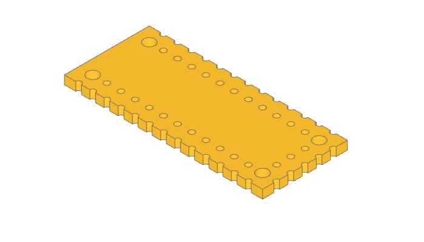

This example demonstrates placing holes around a part.

• Builder mode uses Locations context to place the positions.

• Algebra mode uses product and range to calculate the positions.

<!-- PDF page 136 -->

More Images

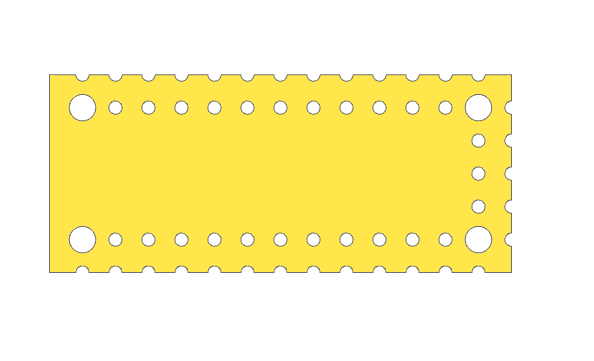

Reference Implementation (Builder Mode)

```python
with BuildPart() as pcb:
```

```python
    with BuildSketch():
```

```python
        Rectangle(pcb_length, pcb_width)
```

```python
        for i in range(65 // 5):
            x = i * 5 - 30
            with Locations((x, -15), (x, -10), (x, 10), (x, 15)):
```

```python
                Circle(1, mode=Mode.SUBTRACT)
        for i in range(30 // 5 - 1):
            y = i * 5 - 10
            with Locations((30, y), (35, y)):
```

```python
                Circle(1, mode=Mode.SUBTRACT)
        with GridLocations(60, 20, 2, 2):
```

```python
            Circle(2, mode=Mode.SUBTRACT)
    extrude(amount=pcb_height)
```

```python
show_object(pcb.part.wrapped)
```

Reference Implementation (Algebra Mode)

```python
x_coords = product(range(65 // 5), (-15, -10, 10, 15))
y_coords = product((30, 35), range(30 // 5 - 1))
```

```python
pcb = Rectangle(pcb_length, pcb_width)
pcb -= [Pos(i * 5 - 30, y) * Circle(1) for i, y in x_coords]
```

<!-- PDF page 137 -->

```python
                                                                      (continued from previous page)
pcb -= [Pos(x, i * 5 - 10) * Circle(1) for x, i in y_coords]
pcb -= [loc * Circle(2) for loc in GridLocations(60, 20, 2, 2)]
```

```python
pcb = extrude(pcb, pcb_height)
```

```python
show(pcb)
```

Clock Face

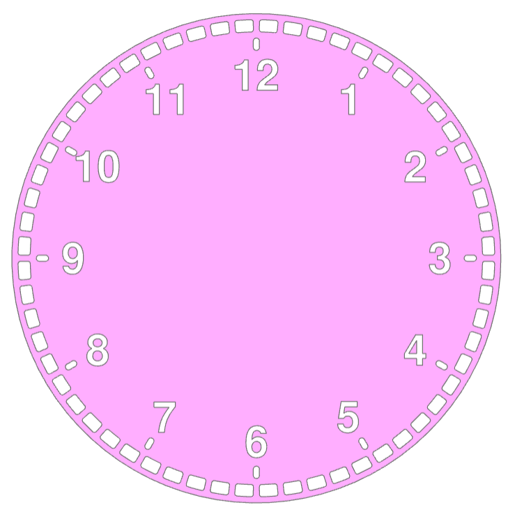

<!-- PDF page 138 -->

Reference Implementation (Builder Mode)

```python
from build123d import *
from ocp_vscode import show
```

```python
clock_radius = 10
with BuildSketch() as minute_indicator:
```

```python
    with BuildLine() as outline:
        l1 = CenterArc((0, 0), clock_radius * 0.975, 0.75, 4.5)
        l2 = CenterArc((0, 0), clock_radius * 0.925, 0.75, 4.5)
        Line(l1 @ 0, l2 @ 0)
        Line(l1 @ 1, l2 @ 1)
    make_face()
    fillet(minute_indicator.vertices(), radius=clock_radius * 0.01)
```

```python
with BuildSketch() as clock_face:
```

```python
    Circle(clock_radius)
    with PolarLocations(0, 60):
```

```python
        add(minute_indicator.sketch, mode=Mode.SUBTRACT)
    with PolarLocations(clock_radius * 0.875, 12):
```

```python
        SlotOverall(clock_radius * 0.05, clock_radius * 0.025, mode=Mode.SUBTRACT)
    for hour in range(1, 13):
```

```python
        with PolarLocations(clock_radius * 0.75, 1, -hour * 30 + 90, 360, rotate=False):
```

```python
            Text(
```

```python
                str(hour),
                font_size=clock_radius * 0.175,
                font_style=FontStyle.BOLD,
                mode=Mode.SUBTRACT,
            )
```

```python
show(clock_face)
```

Reference Implementation (Algebra Mode)

```python
from build123d import *
from ocp_vscode import show
```

```python
clock_radius = 10
```

```python
l1 = CenterArc((0, 0), clock_radius * 0.975, 0.75, 4.5)
l2 = CenterArc((0, 0), clock_radius * 0.925, 0.75, 4.5)
l3 = Line(l1 @ 0, l2 @ 0)
l4 = Line(l1 @ 1, l2 @ 1)
minute_indicator = make_face([l1, l3, l2, l4])
minute_indicator = fillet(minute_indicator.vertices(), radius=clock_radius * 0.01)
```

```python
clock_face = Circle(clock_radius)
clock_face -= PolarLocations(0, 60) * minute_indicator
clock_face -= PolarLocations(clock_radius * 0.875, 12) * SlotOverall(
    clock_radius * 0.05, clock_radius * 0.025
)
```

```python
clock_face -= [
```

<!-- PDF page 139 -->

```python
                                                                      (continued from previous page)
    loc
    * Text(
```

```python
        str(hour + 1),
        font_size=clock_radius * 0.175,
        font_style=FontStyle.BOLD,
        align=Align.CENTER,
    )
    for hour, loc in enumerate(
```

```python
        PolarLocations(clock_radius * 0.75, 12, 60, -360, rotate=False)
    )
]
```

```python
show(clock_face)
```

The Python code utilizes the build123d library to create a 3D model of a clock face. It defines a minute indicator with
arcs and lines, applying fillets, and then integrates it into the clock face sketch. The clock face includes a circular outline,
hour labels, and slots at specified positions. The resulting 3D model represents a detailed and visually appealing clock
design.

PolarLocations are used to position features on the clock face.

Fast Grid Holes

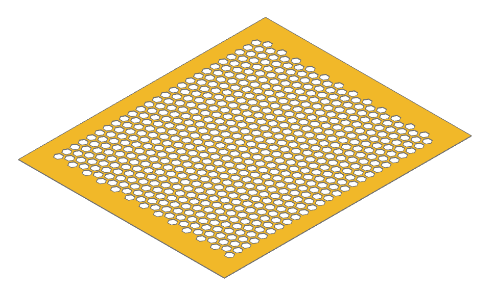

Reference Implementation (Algebra Mode)

```python
import timeit
from build123d import *
from ocp_vscode import show
```

<!-- PDF page 140 -->

```python
start_time = timeit.default_timer()
```

```python
# Calculate the locations of 625 holes
major_r = 10
hole_locs = HexLocations(major_r, 25, 25)
```

```python
# Create wires for both the perimeter and all the holes
face_perimeter = Rectangle(500, 600).wire()
hex_hole = RegularPolygon(major_r - 1, 6, major_radius=True).wire()
holes = hole_locs * hex_hole
```

```python
# Create a new Face from the perimeter and hole wires
grid_pattern = Face(face_perimeter, holes)
```

```python
# Extrude to a 3D part
grid = extrude(grid_pattern, 1)
```

```python
print(f"Time: {timeit.default_timer() - start_time:0.3f}s")
show(grid)
```

This example demonstrates an efficient approach to creating a large number of holes (625 in this case) in a planar part
using build123d.

Instead of modeling and subtracting 3D solids for each hole—which is computationally expensive—this method con-
structs a 2D Face from an outer perimeter wire and a list of hole wires. The entire face is then extruded in a single
operation to form the final 3D object. This approach significantly reduces modeling time and complexity.

The hexagonal hole pattern is generated using HexLocations, and each location is populated with a hexagonal wire.
These wires are passed directly to the Face constructor as holes. On a typical Linux laptop, this script completes in
approximately 1.02 seconds, compared to substantially longer runtimes for boolean subtraction of individual holes in
3D.

<!-- PDF page 141 -->

Handle

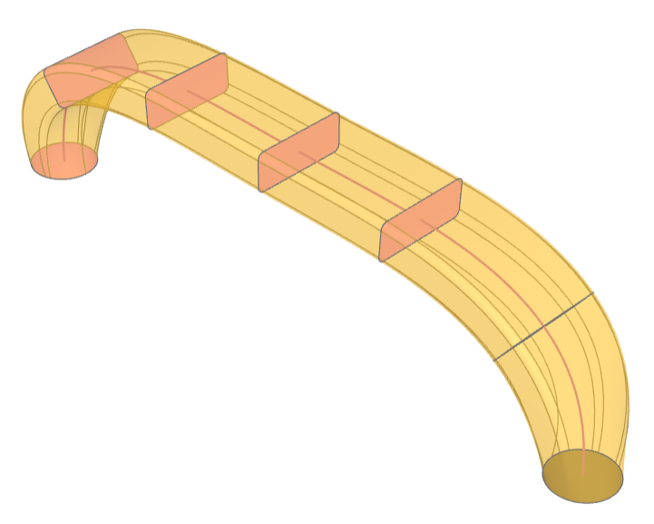

Reference Implementation (Builder Mode)

```python
from build123d import *
from ocp_vscode import show_object
```

```python
segment_count = 6
```

```python
with BuildPart() as handle:
```

```python
    # Create a path for the sweep along the handle - added to pending_edges
    with BuildLine() as handle_center_line:
```

```python
        Spline(
            (-10, 0, 0),
            (0, 0, 5),
            (10, 0, 0),
            tangents=((0, 0, 1), (0, 0, -1)),
            tangent_scalars=(1.5, 1.5),
        )
```

```python
    # Create the cross sections - added to pending_faces
```

<!-- PDF page 142 -->

```python
                                                                      (continued from previous page)
    for i in range(segment_count + 1):
```

```python
        with BuildSketch(handle_center_line.line ^ (i / segment_count)) as section:
```

```python
            if i % segment_count == 0:
```

```python
                Circle(1)
            else:
```

```python
                Rectangle(1.25, 3)
                fillet(section.vertices(), radius=0.2)
    # Record the sections for display
    sections = handle.pending_faces
```

```python
    # Create the handle by sweeping along the path
    sweep(multisection=True)
```

```python
assert abs(handle.part.volume - 94.77361455046953) < 1e-3
```

```python
show_object(handle_center_line.line, name="handle_center_line")
for i, section in enumerate(sections):
    show_object(section, name="section" + str(i))
show_object(handle.part, name="handle", options=dict(alpha=0.6))
```

Reference Implementation (Algebra Mode)

```python
from build123d import *
from ocp_vscode import show_object
```

```python
segment_count = 6
```

```python
# Create a path for the sweep along the handle - added to pending_edges
handle_center_line = Spline(
    (-10, 0, 0),
    (0, 0, 5),
    (10, 0, 0),
    tangents=((0, 0, 1), (0, 0, -1)),
    tangent_scalars=(1.5, 1.5),
)
```

```python
# Create the cross sections - added to pending_faces
sections = Sketch()
for i in range(segment_count + 1):
    location = handle_center_line ^ (i / segment_count)
    if i % segment_count == 0:
        circle = location * Circle(1)
    else:
        circle = location * Rectangle(1.25, 3)
        circle = fillet(circle.vertices(), radius=0.2)
    sections += circle
```

```python
# Create the handle by sweeping along the path
handle = sweep(sections, path=handle_center_line, multisection=True)
```

```python
show_object(handle_center_line, name="handle_path")
```

<!-- PDF page 143 -->

```python
                                                                      (continued from previous page)
for i, circle in enumerate(sections):
    show_object(circle, name="section" + str(i))
show_object(handle, name="handle", options=dict(alpha=0.6))
```

This example demonstrates multisection sweep creating a drawer handle.

<!-- PDF page 144 -->

Heat Exchanger

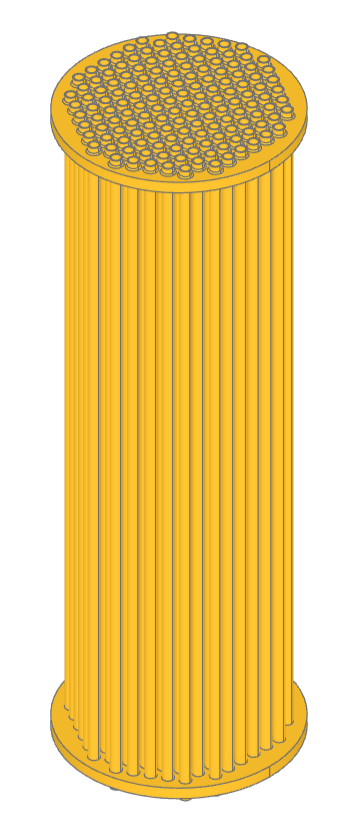

<!-- PDF page 145 -->

Reference Implementation (Builder Mode)

```python
from build123d import *
from ocp_vscode import show
```

```python
exchanger_diameter = 10 * CM
exchanger_length = 30 * CM
plate_thickness = 5 * MM
# 149 tubes
tube_diameter = 5 * MM
tube_spacing = 2 * MM
tube_wall_thickness = 0.5 * MM
tube_extension = 3 * MM
bundle_diameter = exchanger_diameter - 2 * tube_diameter
fillet_radius = tube_spacing / 3
assert tube_extension > fillet_radius
```

```python
# Build the heat exchanger
with BuildPart() as heat_exchanger:
```

```python
    # Generate list of tube locations
    tube_locations = [
        l
        for l in HexLocations(
            radius=(tube_diameter + tube_spacing) / 2,
            x_count=exchanger_diameter // tube_diameter,
            y_count=exchanger_diameter // tube_diameter,
        )
        if l.position.length < bundle_diameter / 2
    ]
    tube_count = len(tube_locations)
    with BuildSketch() as tube_plan:
```

```python
        with Locations(*tube_locations):
```

```python
            Circle(radius=tube_diameter / 2)
            Circle(radius=tube_diameter / 2 - tube_wall_thickness, mode=Mode.SUBTRACT)
    extrude(amount=exchanger_length / 2)
    with BuildSketch(
```

```python
        Plane(
            origin=(0, 0, exchanger_length / 2 - tube_extension - plate_thickness),
            z_dir=(0, 0, 1),
        )
    ) as plate_plan:
```

```python
        Circle(radius=exchanger_diameter / 2)
        with Locations(*tube_locations):
```

```python
            Circle(radius=tube_diameter / 2 - tube_wall_thickness, mode=Mode.SUBTRACT)
    extrude(amount=plate_thickness)
    half_volume_before_fillet = heat_exchanger.part.volume
    # Simulate welded tubes by adding a fillet to the outside radius of the tubes
    fillet(
        heat_exchanger.edges()
        .filter_by(GeomType.CIRCLE)
        .sort_by(SortBy.RADIUS)
        .sort_by(Axis.Z, reverse=True)[2 * tube_count : 3 * tube_count],
        radius=fillet_radius,
```

<!-- PDF page 146 -->

```python
                                                                      (continued from previous page)
    )
    half_volume_after_fillet = heat_exchanger.part.volume
    mirror(about=Plane.XY)
```

```python
fillet_volume = 2 * (half_volume_after_fillet - half_volume_before_fillet)
assert abs(fillet_volume - 469.88331045553787) < 1e-3
```

```python
show(heat_exchanger)
```

Reference Implementation (Algebra Mode)

```python
from build123d import *
from ocp_vscode import show
```

```python
exchanger_diameter = 10 * CM
exchanger_length = 30 * CM
plate_thickness = 5 * MM
# 149 tubes
tube_diameter = 5 * MM
tube_spacing = 2 * MM
tube_wall_thickness = 0.5 * MM
tube_extension = 3 * MM
bundle_diameter = exchanger_diameter - 2 * tube_diameter
fillet_radius = tube_spacing / 3
assert tube_extension > fillet_radius
```

```python
# Build the heat exchanger
tube_locations = [
    l
    for l in HexLocations(
        radius=(tube_diameter + tube_spacing) / 2,
        x_count=exchanger_diameter // tube_diameter,
        y_count=exchanger_diameter // tube_diameter,
    )
    if l.position.length < bundle_diameter / 2
]
```

```python
ring = Circle(tube_diameter / 2) - Circle(tube_diameter / 2 - tube_wall_thickness)
tube_plan = Sketch() + tube_locations * ring
```

```python
heat_exchanger = extrude(tube_plan, exchanger_length / 2)
```

```python
plate_plane = Plane(
    origin=(0, 0, exchanger_length / 2 - tube_extension - plate_thickness),
    z_dir=(0, 0, 1),
)
plate = Circle(radius=exchanger_diameter / 2) - tube_locations * Circle(
    radius=tube_diameter / 2 - tube_wall_thickness
)
```

```python
heat_exchanger += extrude(plate_plane * plate, plate_thickness)
```

<!-- PDF page 147 -->

```python
                                                                      (continued from previous page)
edges = (
    heat_exchanger.edges()
    .filter_by(GeomType.CIRCLE)
    .group_by(SortBy.RADIUS)[1]
    .group_by()[2]
)
half_volume_before_fillet = heat_exchanger.volume
heat_exchanger = fillet(edges, radius=fillet_radius)
half_volume_after_fillet = heat_exchanger.volume
heat_exchanger += mirror(heat_exchanger, Plane.XY)
```

```python
fillet_volume = 2 * (half_volume_after_fillet - half_volume_before_fillet)
assert abs(fillet_volume - 469.88331045553787) < 1e-3
```

```python
show(heat_exchanger)
```

This example creates a model of a parametric heat exchanger core. The positions of the tubes are defined with
HexLocations and further limited to fit within the circular end caps. The ends of the tubes are filleted to the end
plates to simulate welding.

Key Cap

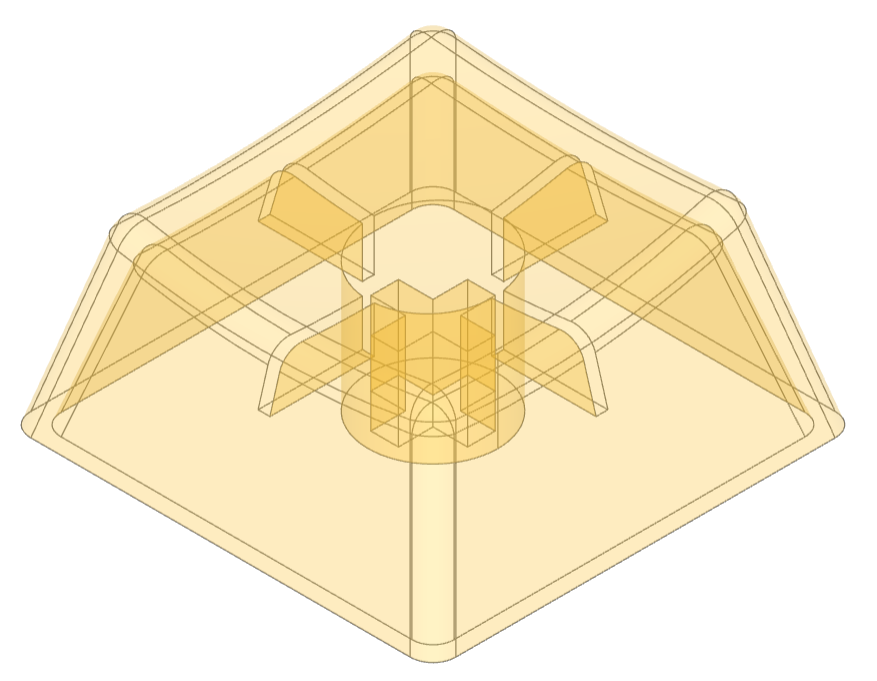

<!-- PDF page 148 -->

Reference Implementation (Builder Mode)

```python
from build123d import *
from ocp_vscode import *
```

```python
with BuildPart() as key_cap:
```

```python
    # Start with the plan of the key cap and extrude it
    with BuildSketch() as plan:
```

```python
        Rectangle(18 * MM, 18 * MM)
    extrude(amount=10 * MM, taper=15)
    # Create a dished top
    with Locations((0, -3 * MM, 47 * MM)):
```

```python
        Sphere(40 * MM, mode=Mode.SUBTRACT, rotation=(90, 0, 0))
    # Fillet all the edges except the bottom
    fillet(
        key_cap.edges().filter_by_position(Axis.Z, 0, 30 * MM, inclusive=(False, True)),
        radius=1 * MM,
    )
    # Hollow out the key by subtracting a scaled version
    scale(by=(0.925, 0.925, 0.85), mode=Mode.SUBTRACT)
```

```python
    # Add supporting ribs while leaving room for switch activation
    with BuildSketch(Plane(origin=(0, 0, 4 * MM))):
```

```python
        Rectangle(15 * MM, 0.5 * MM)
        Rectangle(0.5 * MM, 15 * MM)
        Circle(radius=5.5 * MM / 2)
    # Extrude the mount and ribs to the key cap underside
    extrude(until=Until.NEXT)
    # Find the face on the bottom of the ribs to build onto
    rib_bottom = key_cap.faces().filter_by_position(Axis.Z, 4 * MM, 4 * MM)[0]
    # Add the switch socket
    with BuildSketch(rib_bottom) as cruciform:
```

```python
        Circle(radius=5.5 * MM / 2)
        Rectangle(4.1 * MM, 1.17 * MM, mode=Mode.SUBTRACT)
        Rectangle(1.17 * MM, 4.1 * MM, mode=Mode.SUBTRACT)
    extrude(amount=3.5 * MM, mode=Mode.ADD)
```

```python
assert abs(key_cap.part.volume - 644.8900473617498) < 1e-3
```

```python
show(key_cap, alphas=[0.3])
```

Reference Implementation (Algebra Mode)

```python
from build123d import *
from ocp_vscode import *
```

```python
# Taper Extrude and Extrude to "next" while creating a Cherry MX key cap
# See: https://www.cherrymx.de/en/dev.html
```

```python
plan = Rectangle(18 * MM, 18 * MM)
key_cap = extrude(plan, amount=10 * MM, taper=15)
```

```python
# Create a dished top
```

<!-- PDF page 149 -->

```python
                                                                      (continued from previous page)
key_cap -= Location((0, -3 * MM, 47 * MM), (90, 0, 0)) * Sphere(40 * MM)
```

```python
# Fillet all the edges except the bottom
key_cap = fillet(
    key_cap.edges().filter_by_position(Axis.Z, 0, 30 * MM, inclusive=(False, True)),
    radius=1 * MM,
)
```

```python
# Hollow out the key by subtracting a scaled version
key_cap -= scale(key_cap, (0.925, 0.925, 0.85))
```

```python
# Add supporting ribs while leaving room for switch activation
ribs = Rectangle(17.5 * MM, 0.5 * MM)
ribs += Rectangle(0.5 * MM, 17.5 * MM)
ribs += Circle(radius=5.51 * MM / 2)
```

```python
# Extrude the mount and ribs to the key cap underside
key_cap += extrude(Pos(0, 0, 4 * MM) * ribs, until=Until.NEXT, target=key_cap)
```

```python
# Find the face on the bottom of the ribs to build onto
rib_bottom = key_cap.faces().filter_by_position(Axis.Z, 4 * MM, 4 * MM)[0]
```

```python
# Add the switch socket
socket = Circle(radius=5.5 * MM / 2)
socket -= Rectangle(4.1 * MM, 1.17 * MM)
socket -= Rectangle(1.17 * MM, 4.1 * MM)
key_cap += extrude(Plane(rib_bottom) * socket, amount=3.5 * MM)
```

```python
show(key_cap, alphas=[0.3])
```

This example demonstrates the design of a Cherry MX key cap by using extrude with a taper and extrude until next.

<!-- PDF page 150 -->

Maker Coin

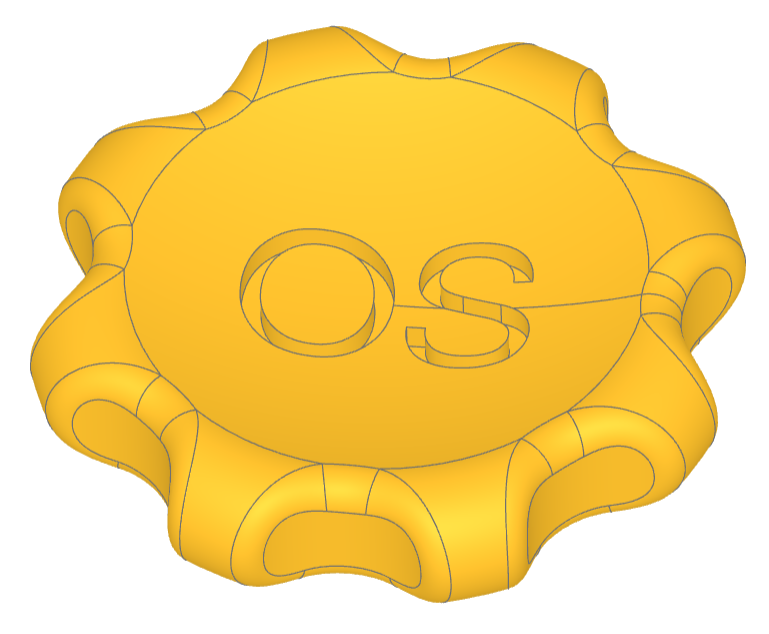

This example creates the maker coin as defined by Angus on the Maker’s Muse YouTube channel. There are two key
features:

1. the use of DoubleTangentArc to create a smooth transition from the central dish to the outside arc, and

2. embossing the text into the top of the coin not just as a simple extrude but from a projection which results in text
with even depth.

Reference Implementation (Builder Mode)

```python
# Coin Parameters
diameter, thickness = 50 * MM, 10 * MM
```

```python
with BuildPart() as maker_coin:
```

```python
    # On XZ plane draw the profile of half the coin
    with BuildSketch(Plane.XZ) as profile:
```

```python
        with BuildLine() as outline:
            l1 = Polyline((0, thickness * 0.6), (0, 0), ((diameter - thickness) / 2, 0))
            l2 = JernArc(
                start=l1 @ 1, tangent=l1 % 1, radius=thickness / 2, arc_size=300
```

<!-- PDF page 151 -->

```python
                                                                      (continued from previous page)
            )  # extend the arc beyond the intersection but not closed
            l3 = DoubleTangentArc(l1 @ 0, tangent=(1, 0), other=l2)
        make_face()  # make it a 2D shape
    revolve()  # revolve 360°
```

```python
    # Pattern the detents around the coin
    with BuildSketch() as detents:
```

```python
        with PolarLocations(radius=(diameter + 5) / 2, count=8):
```

```python
            Circle(thickness * 1.4 / 2)
    extrude(amount=thickness, mode=Mode.SUBTRACT)  # cut away the detents
```

```python
    fillet(maker_coin.edges(Select.NEW), 2)  # fillet the cut edges
```

```python
    # Add an embossed label
    with BuildSketch(Plane.XY.offset(thickness)) as label:  # above coin
        Text("OS", font_size=15)
    project()  # label on top of coin
    extrude(amount=-thickness / 5, mode=Mode.SUBTRACT)  # emboss label
```

```python
show(maker_coin)
```

<!-- PDF page 152 -->

Multi-Sketch Loft

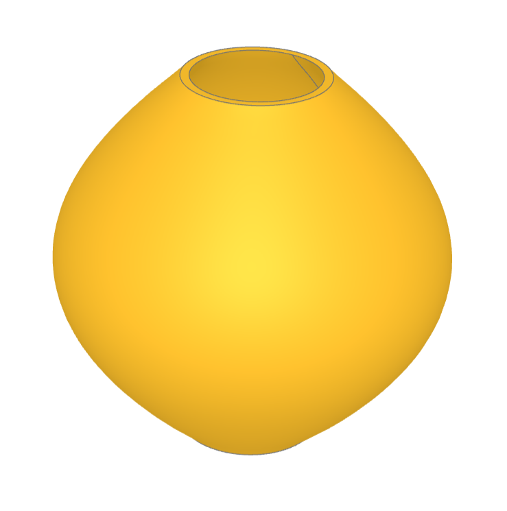

This example demonstrates lofting a set of sketches, selecting the top and bottom by type, and shelling.

Reference Implementation (Builder Mode)

```python
from math import pi, sin
from build123d import *
from ocp_vscode import show
```

```python
with BuildPart() as art:
    slice_count = 10
    for i in range(slice_count + 1):
```

<!-- PDF page 153 -->

```python
                                                                      (continued from previous page)
        with BuildSketch(Plane(origin=(0, 0, i * 3), z_dir=(0, 0, 1))) as slice:
```

```python
            Circle(10 * sin(i * pi / slice_count) + 5)
    loft()
    top_bottom = art.faces().filter_by(GeomType.PLANE)
    offset(openings=top_bottom, amount=0.5)
```

```python
want = 1306.3405290344635
got = art.part.volume
delta = abs(got - want)
tolerance = want * 1e-5
assert delta < tolerance, f"{delta=} is greater than {tolerance=}; {got=}, {want=}"
```

```python
show(art, names=["art"])
```

Reference Implementation (Algebra Mode)

```python
from math import pi, sin
from build123d import *
from ocp_vscode import show
```

```python
slice_count = 10
```

```python
art = Sketch()
for i in range(slice_count + 1):
    plane = Plane(origin=(0, 0, i * 3), z_dir=(0, 0, 1))
    art += plane * Circle(10 * sin(i * pi / slice_count) + 5)
```

```python
art = loft(art)
top_bottom = art.faces().filter_by(GeomType.PLANE)
art = offset(art, openings=top_bottom, amount=0.5)
```

```python
show(art, names=["art"])
```

<!-- PDF page 154 -->

Peg Board Hook

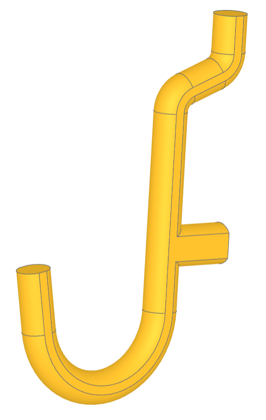

<!-- PDF page 155 -->

This script creates a a J-shaped pegboard hook. These hooks are commonly used for organizing tools in garages,
workshops, or other spaces where tools and equipment need to be stored neatly and accessibly. The hook is created by
defining a complex path and then sweeping it to define the hook. The sides of the hook are flattened to aid 3D printing.

Reference Implementation (Builder Mode)

```python
from build123d import *
from ocp_vscode import show
```

```python
pegd = 6.35 + 0.1  # mm ~0.25inch
c2c = 25.4  # mm 1.0inch
arcd = 7.2
both = 10
topx = 6
midx = 8
maind = 0.82 * pegd
midd = 1.0 * pegd
hookd = 23
hookx = 10
splitz = maind / 2 - 0.1
topangs = 70
```

```python
with BuildPart() as mainp:
```

```python
    with BuildLine(mode=Mode.PRIVATE) as sprof:
        l1 = Line((-both, 0), (c2c - arcd / 2 - 0.5, 0))
        l2 = JernArc(start=l1 @ 1, tangent=l1 % 1, radius=arcd / 2, arc_size=topangs)
        l3 = PolarLine(
            start=l2 @ 1,
            length=topx,
            direction=l2 % 1,
        )
        l4 = JernArc(start=l3 @ 1, tangent=l3 % 1, radius=arcd / 2, arc_size=-topangs)
        l5 = PolarLine(
            start=l4 @ 1,
            length=topx,
            direction=l4 % 1,
        )
        l6 = JernArc(
            start=l1 @ 0, tangent=(l1 % 0).reverse(), radius=hookd / 2, arc_size=170
        )
        l7 = PolarLine(
            start=l6 @ 1,
            length=hookx,
            direction=l6 % 1,
        )
    with BuildSketch(Plane.YZ):
```

```python
        Circle(radius=maind / 2)
    sweep(path=sprof.wires()[0])
    with BuildLine(mode=Mode.PRIVATE) as stub:
        l7 = Line((0, 0), (0, midx + maind / 2))
    with BuildSketch(Plane.XZ):
```

```python
        Circle(radius=midd / 2)
    sweep(path=stub.wires()[0])
```

<!-- PDF page 156 -->

```python
                                                                      (continued from previous page)
    # splits help keep the object 3d printable by reducing overhang
    split(bisect_by=Plane(origin=(0, 0, -splitz)))
    split(bisect_by=Plane(origin=(0, 0, splitz)), keep=Keep.BOTTOM)
```

```python
show(mainp)
```

Reference Implementation (Algebra Mode)

```python
from build123d import *
from ocp_vscode import show
```

```python
pegd = 6.35 + 0.1  # mm ~0.25inch
c2c = 25.4  # mm 1.0inch
arcd = 7.2
both = 10
topx = 6
midx = 8
maind = 0.82 * pegd
midd = 1.0 * pegd
hookd = 23
hookx = 10
splitz = maind / 2 - 0.1
topangs = 70
```

```python
l1 = Line((-both, 0), (c2c - arcd / 2 - 0.5, 0))
l2 = JernArc(start=l1 @ 1, tangent=l1 % 1, radius=arcd / 2, arc_size=topangs)
l3 = PolarLine(
    start=l2 @ 1,
    length=topx,
    direction=l2 % 1,
)
l4 = JernArc(start=l3 @ 1, tangent=l3 % 1, radius=arcd / 2, arc_size=-topangs)
l5 = PolarLine(
    start=l4 @ 1,
    length=topx,
    direction=l4 % 1,
)
l6 = JernArc(start=l1 @ 0, tangent=(l1 % 0).reverse(), radius=hookd / 2, arc_size=170)
l7 = PolarLine(
    start=l6 @ 1,
    length=hookx,
    direction=l6 % 1,
)
sprof = Curve() + (l1, l2, l3, l4, l5, l6, l7)
wire = Wire(sprof.edges())  #  TODO sprof.wires() fails
mainp = sweep(Plane.YZ * Circle(radius=maind / 2), path=wire)
```

```python
stub = Line((0, 0), (0, midx + maind / 2))
mainp += sweep(Plane.XZ * Circle(radius=midd / 2), path=stub)
```

<!-- PDF page 157 -->

```python
                                                                      (continued from previous page)
# splits help keep the object 3d printable by reducing overhang
mainp = split(mainp, Plane(origin=(0, 0, -splitz)))
mainp = split(mainp, Plane(origin=(0, 0, splitz)), keep=Keep.BOTTOM)
```

```python
show(mainp)
```

Platonic Solids

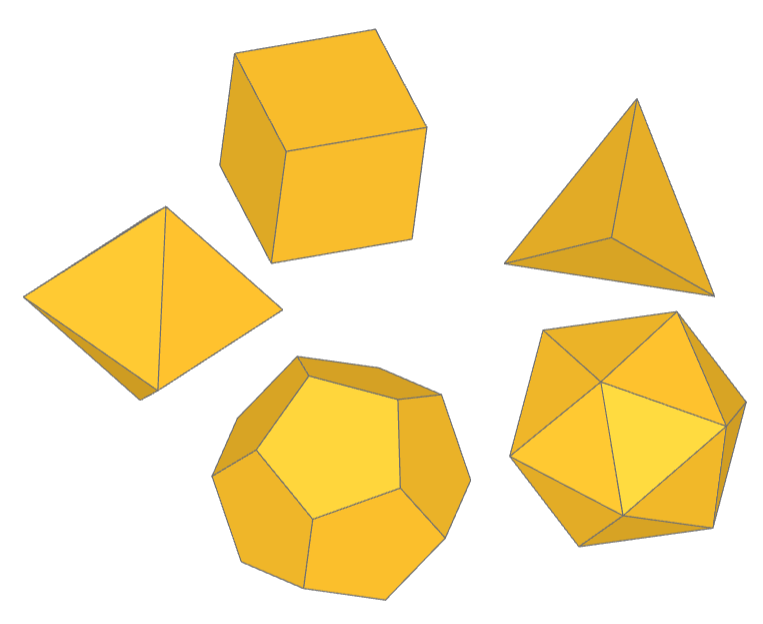

This example creates a custom Part object PlatonicSolid.

Platonic solids are five three-dimensional shapes that are highly symmetrical, known since antiquity and named after
the ancient Greek philosopher Plato. These solids are unique because their faces are congruent regular polygons, with
the same number of faces meeting at each vertex. The five Platonic solids are the tetrahedron (4 triangular faces), cube
(6 square faces), octahedron (8 triangular faces), dodecahedron (12 pentagonal faces), and icosahedron (20 triangular
faces). Each solid represents a unique way in which identical polygons can be arranged in three dimensions to form a
convex polyhedron, embodying ideals of symmetry and balance.

<!-- PDF page 158 -->

Reference Implementation (Algebra Mode)

```python
from build123d import *
from math import sqrt
from typing import Union, Literal
from scipy.spatial import ConvexHull
```

```python
from ocp_vscode import show
```

```python
PHI = (1 + sqrt(5)) / 2  # The Golden Ratio
```

```python
class PlatonicSolid(BasePartObject):
```

```python
    """Part Object: Platonic Solid
```

```python
    Create one of the five convex Platonic solids.
```

```python
    Args:
```

```python
        face_count (Literal[4,6,8,12,20]): number of faces
        diameter (float): double distance to vertices, i.e. maximum size
        rotation (RotationLike, optional): angles to rotate about axes. Defaults to (0, 0, 0).
        align (Union[None, Align, tuple[Align, Align, Align]], optional): align min, center,
```

```python
            or max of object. Defaults to None.
        mode (Mode, optional): combine mode. Defaults to Mode.ADD.
    """
```

```python
    tetrahedron_vertices = [(1, 1, 1), (1, -1, -1), (-1, 1, -1), (-1, -1, 1)]
```

```python
    cube_vertices = [(i, j, k) for i in [-1, 1] for j in [-1, 1] for k in [-1, 1]]
```

```python
    octahedron_vertices = (
        [(i, 0, 0) for i in [-1, 1]]
        + [(0, i, 0) for i in [-1, 1]]
        + [(0, 0, i) for i in [-1, 1]]
    )
```

```python
    dodecahedron_vertices = (
        [(i, j, k) for i in [-1, 1] for j in [-1, 1] for k in [-1, 1]]
        + [(0, i / PHI, j * PHI) for i in [-1, 1] for j in [-1, 1]]
        + [(i / PHI, j * PHI, 0) for i in [-1, 1] for j in [-1, 1]]
        + [(i * PHI, 0, j / PHI) for i in [-1, 1] for j in [-1, 1]]
    )
```

```python
    icosahedron_vertices = (
        [(0, i, j * PHI) for i in [-1, 1] for j in [-1, 1]]
        + [(i, j * PHI, 0) for i in [-1, 1] for j in [-1, 1]]
        + [(i * PHI, 0, j) for i in [-1, 1] for j in [-1, 1]]
    )
```

```python
    vertices_lookup = {
```

```python
        4: tetrahedron_vertices,
        6: cube_vertices,
        8: octahedron_vertices,
```

<!-- PDF page 159 -->

```python
                                                                      (continued from previous page)
        12: dodecahedron_vertices,
        20: icosahedron_vertices,
    }
    _applies_to = [BuildPart._tag]
```

```python
    def __init__(
```

```python
        self,
        face_count: Literal[4, 6, 8, 12, 20],
        diameter: float = 1.0,
        rotation: RotationLike = (0, 0, 0),
        align: Union[None, Align, tuple[Align, Align, Align]] = None,
        mode: Mode = Mode.ADD,
    ):
```

```python
        try:
            platonic_vertices = PlatonicSolid.vertices_lookup[face_count]
        except KeyError:
```

```python
            raise ValueError(
```

```python
                f"face_count must be one of 4, 6, 8, 12, or 20 not {face_count}"
            )
```

```python
        # Create a convex hull from the vertices
        hull = ConvexHull(platonic_vertices).simplices.tolist()
```

```python
        # Create faces from the vertex indices
        platonic_faces = []
        for face_vertex_indices in hull:
            corner_vertices = [platonic_vertices[i] for i in face_vertex_indices]
            platonic_faces.append(Face(Wire.make_polygon(corner_vertices)))
```

```python
        # Create the solid from the Faces
        platonic_solid = Solid(Shell(platonic_faces)).clean()
```

```python
        # By definition, all vertices are the same distance from the origin so
        # scale proportionally to this distance
        platonic_solid = platonic_solid.scale(
            (diameter / 2) / Vector(platonic_solid.vertices()[0]).length
        )
```

```python
        super().__init__(part=platonic_solid, rotation=rotation, align=align, mode=mode)
```

```python
solids = [
```

```python
    Rot(0, 0, 72 * i) * Pos(1, 0, 0) * PlatonicSolid(faces)
    for i, faces in enumerate([4, 6, 8, 12, 20])
]
show(solids)
```

<!-- PDF page 160 -->

Playing Cards

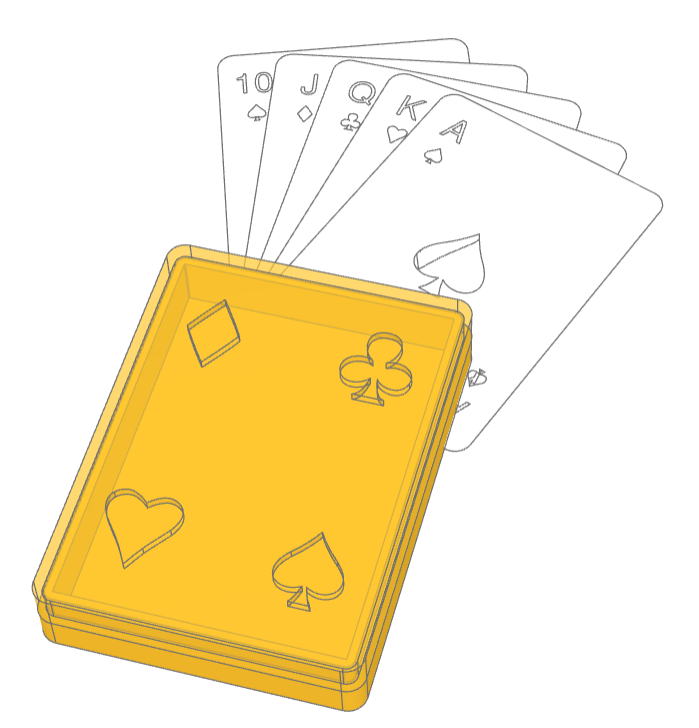

This example creates a customs Sketch objects: Club, Spade, Heart, Diamond, and PlayingCard in addition to a two
part playing card box which has suit cutouts in the lid. The four suits are created with Bézier curves that were imported
as code from an SVG file and modified to the code found here.

Reference Implementation (Builder Mode)

```python
from typing import Literal
from build123d import *
from ocp_vscode import show_object
```

<!-- PDF page 161 -->

```python
# [Club]
class Club(BaseSketchObject):
```

```python
    def __init__(
```

```python
        self,
        height: float,
        rotation: float = 0,
        align: tuple[Align, Align] = (Align.CENTER, Align.CENTER),
        mode: Mode = Mode.ADD,
    ):
```

```python
        with BuildSketch() as club:
```

```python
            with BuildLine():
                l0 = Line((0, -188), (76, -188))
                b0 = Bezier(l0 @ 1, (61, -185), (33, -173), (17, -81))
                b1 = Bezier(b0 @ 1, (49, -128), (146, -145), (167, -67))
                b2 = Bezier(b1 @ 1, (187, 9), (94, 52), (32, 18))
                b3 = Bezier(b2 @ 1, (92, 57), (113, 188), (0, 188))
                mirror(about=Plane.YZ)
            make_face()
            scale(by=height / club.sketch.bounding_box().size.Y)
        super().__init__(obj=club.sketch, rotation=rotation, align=align, mode=mode)
```

```python
# [Club]
```

```python
class Spade(BaseSketchObject):
```

```python
    def __init__(
```

```python
        self,
        height: float,
        rotation: float = 0,
        align: tuple[Align, Align] = (Align.CENTER, Align.CENTER),
        mode: Mode = Mode.ADD,
    ):
```

```python
        with BuildSketch() as spade:
```

```python
            with BuildLine():
                b0 = Bezier((0, 198), (6, 190), (41, 127), (112, 61))
                b1 = Bezier(b0 @ 1, (242, -72), (114, -168), (11, -105))
                b2 = Bezier(b1 @ 1, (31, -174), (42, -179), (53, -198))
                l0 = Line(b2 @ 1, (0, -198))
                mirror(about=Plane.YZ)
            make_face()
            scale(by=height / spade.sketch.bounding_box().size.Y)
        super().__init__(obj=spade.sketch, rotation=rotation, align=align, mode=mode)
```

```python
class Heart(BaseSketchObject):
```

```python
    def __init__(
```

```python
        self,
        height: float,
        rotation: float = 0,
        align: tuple[Align, Align] = (Align.CENTER, Align.CENTER),
```

<!-- PDF page 162 -->

```python
                                                                      (continued from previous page)
        mode: Mode = Mode.ADD,
    ):
```

```python
        with BuildSketch() as heart:
```

```python
            with BuildLine():
                b1 = Bezier((0, 146), (20, 169), (67, 198), (97, 198))
                b2 = Bezier(b1 @ 1, (125, 198), (151, 186), (168, 167))
                b3 = Bezier(b2 @ 1, (197, 133), (194, 88), (158, 31))
                b4 = Bezier(b3 @ 1, (126, -13), (94, -48), (62, -95))
                b5 = Bezier(b4 @ 1, (40, -128), (0, -198))
                mirror(about=Plane.YZ)
            make_face()
            scale(by=height / heart.sketch.bounding_box().size.Y)
        super().__init__(obj=heart.sketch, rotation=rotation, align=align, mode=mode)
```

```python
class Diamond(BaseSketchObject):
```

```python
    def __init__(
```

```python
        self,
        height: float,
        rotation: float = 0,
        align: tuple[Align, Align] = (Align.CENTER, Align.CENTER),
        mode: Mode = Mode.ADD,
    ):
```

```python
        with BuildSketch() as diamond:
```

```python
            with BuildLine():
```

```python
                Bezier((135, 0), (94, 69), (47, 134), (0, 198))
                mirror(about=Plane.XZ)
                mirror(about=Plane.YZ)
            make_face()
            scale(by=height / diamond.sketch.bounding_box().size.Y)
        super().__init__(obj=diamond.sketch, rotation=rotation, align=align, mode=mode)
```

```python
card_width = 2.5 * IN
card_length = 3.5 * IN
deck = 0.5 * IN
wall = 4 * MM
gap = 0.5 * MM
```

```python
with BuildPart() as box_builder:
```

```python
    with BuildSketch() as plan:
```

```python
        Rectangle(card_width + 2 * wall, card_length + 2 * wall)
        fillet(plan.vertices(), radius=card_width / 15)
    extrude(amount=wall / 2)
    with BuildSketch(box_builder.faces().sort_by(Axis.Z)[-1]) as walls:
```

```python
        add(plan.sketch)
        offset(plan.sketch, amount=-wall, mode=Mode.SUBTRACT)
    extrude(amount=deck / 2)
    with BuildSketch(box_builder.faces().sort_by(Axis.Z)[-1]) as inset_walls:
```

```python
        offset(plan.sketch, amount=-(wall + gap) / 2, mode=Mode.ADD)
        offset(plan.sketch, amount=-wall, mode=Mode.SUBTRACT)
    extrude(amount=deck / 2)
```

<!-- PDF page 163 -->

```python
with BuildPart() as lid_builder:
```

```python
    with BuildSketch() as outset_walls:
```

```python
        add(plan.sketch)
        offset(plan.sketch, amount=-(wall - gap) / 2, mode=Mode.SUBTRACT)
    extrude(amount=deck / 2)
    with BuildSketch(lid_builder.faces().sort_by(Axis.Z)[-1]) as top:
```

```python
        add(plan.sketch)
    extrude(amount=wall / 2)
    with BuildSketch(lid_builder.faces().sort_by(Axis.Z)[-1]):
        holes = GridLocations(
```

```python
            3 * card_width / 5, 3 * card_length / 5, 2, 2
        ).local_locations
        for i, hole in enumerate(holes):
```

```python
            with Locations(hole) as hole_loc:
```

```python
                if i == 0:
                    Heart(card_length / 5)
                elif i == 1:
                    Diamond(card_length / 5)
                elif i == 2:
                    Spade(card_length / 5)
                elif i == 3:
                    Club(card_length / 5)
    extrude(amount=-wall, mode=Mode.SUBTRACT)
```

```python
box = Compound(
    [box_builder.part, lid_builder.part.moved(Location((0, 0, (wall + deck) / 2)))]
)
visible, hidden = box.project_to_viewport((70, -50, 120))
max_dimension = max(*Compound(children=visible + hidden).bounding_box().size)
exporter = ExportSVG(scale=100 / max_dimension)
exporter.add_layer("Visible")
exporter.add_layer("Hidden", line_color=(99, 99, 99), line_type=LineType.ISO_DOT)
exporter.add_shape(visible, layer="Visible")
exporter.add_shape(hidden, layer="Hidden")
# exporter.write(f"assets/card_box.svg")
```

```python
class PlayingCard(BaseSketchObject):
```

```python
    """PlayingCard
```

```python
    A standard playing card modelled as a Face.
```

```python
    Args:
```

```python
        rank (Literal['A', '2' .. '10', 'J', 'Q', 'K']): card rank
        suit (Literal['Clubs', 'Spades', 'Hearts', 'Diamonds']): card suit
    """
```

```python
    width = 2.5 * IN
    height = 3.5 * IN
    suits = {"Clubs": Club, "Spades": Spade, "Hearts": Heart, "Diamonds": Diamond}
    ranks = ["A", "2", "3", "4", "5", "6", "7", "8", "9", "10", "J", "Q", "K"]
```

<!-- PDF page 164 -->

```python
    def __init__(
```

```python
        self,
        rank: Literal["A", "2", "3", "4", "5", "6", "7", "8", "9", "10", "J", "Q", "K"],
        suit: Literal["Clubs", "Spades", "Hearts", "Diamonds"],
        rotation: float = 0,
        align: tuple[Align, Align] = (Align.CENTER, Align.CENTER),
        mode: Mode = Mode.ADD,
    ):
```

```python
        with BuildSketch() as playing_card:
```

```python
            Rectangle(
                PlayingCard.width, PlayingCard.height, align=(Align.MIN, Align.MIN)
            )
            fillet(playing_card.vertices(), radius=PlayingCard.width / 15)
            with Locations(
                (
                    PlayingCard.width / 7,
                    8 * PlayingCard.height / 9,
                )
            ):
```

```python
                Text(
                    txt=rank,
                    font_size=PlayingCard.width / 7,
                    mode=Mode.SUBTRACT,
                )
            with Locations(
                (
                    PlayingCard.width / 7,
                    7 * PlayingCard.height / 9,
                )
            ):
                PlayingCard.suits[suit](
                    height=PlayingCard.width / 12, mode=Mode.SUBTRACT
                )
            with Locations(
                (
```

```python
                    6 * PlayingCard.width / 7,
                    1 * PlayingCard.height / 9,
                )
            ):
```

```python
                Text(
                    txt=rank,
                    font_size=PlayingCard.width / 7,
                    rotation=180,
                    mode=Mode.SUBTRACT,
                )
            with Locations(
                (
```

```python
                    6 * PlayingCard.width / 7,
                    2 * PlayingCard.height / 9,
                )
            ):
```

<!-- PDF page 165 -->

```python
                                                                      (continued from previous page)
                PlayingCard.suits[suit](
                    height=PlayingCard.width / 12, rotation=180, mode=Mode.SUBTRACT
                )
            rank_int = PlayingCard.ranks.index(rank) + 1
            rank_int = rank_int if rank_int < 10 else 1
            with Locations((PlayingCard.width / 2, PlayingCard.height / 2)):
                center_radius = 0 if rank_int == 1 else PlayingCard.width / 3.5
                suit_rotation = 0 if rank_int == 1 else -90
                suit_height = (
```

```python
                    0.00159 * rank_int**2 - 0.0380 * rank_int + 0.37
                ) * PlayingCard.width
                with PolarLocations(
                    radius=center_radius,
                    count=rank_int,
                    start_angle=90 if rank_int > 1 else 0,
                ):
                    PlayingCard.suits[suit](
                        height=suit_height,
                        rotation=suit_rotation,
                        mode=Mode.SUBTRACT,
                    )
        super().__init__(
            obj=playing_card.sketch, rotation=rotation, align=align, mode=mode
        )
```

```python
ace_spades = PlayingCard(rank="A", suit="Spades", align=Align.MIN)
ace_spades.color = Color("white")
king_hearts = PlayingCard(rank="K", suit="Hearts", align=Align.MIN)
king_hearts.color = Color("white")
queen_clubs = PlayingCard(rank="Q", suit="Clubs", align=Align.MIN)
queen_clubs.color = Color("white")
jack_diamonds = PlayingCard(rank="J", suit="Diamonds", align=Align.MIN)
jack_diamonds.color = Color("white")
ten_spades = PlayingCard(rank="10", suit="Spades", align=Align.MIN)
ten_spades.color = Color("white")
```

```python
hand = Compound(
    children=[
```

```python
        Rot(0, 0, -20) * Pos(0, 0, 0) * ace_spades,
        Rot(0, 0, -10) * Pos(0, 0, -1) * king_hearts,
        Rot(0, 0, 0) * Pos(0, 0, -2) * queen_clubs,
        Rot(0, 0, 10) * Pos(0, 0, -3) * jack_diamonds,
        Rot(0, 0, 20) * Pos(0, 0, -4) * ten_spades,
    ]
)
```

```python
show_object(Pos(-20, 40) * hand)
show_object(box_builder.part, "box_builder")
show_object(
```

```python
    Pos(0, 0, (wall + deck) / 2) * lid_builder.part,
    "lid_builder",
```

<!-- PDF page 166 -->

```python
                                                                      (continued from previous page)
    options={"alpha": 0.7},
)
```

Stud Wall

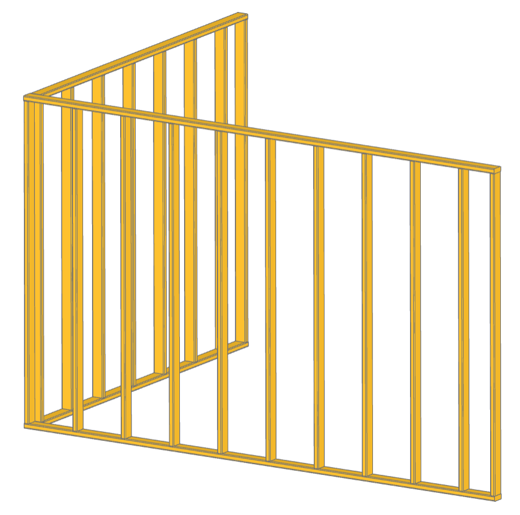

This example demonstrates creating custom Part objects and putting them into assemblies. The custom object is a Stud
used in the building industry while the assembly is a StudWall created from copies of Stud objects for efficiency. Both
the Stud and StudWall objects use RigidJoints to define snap points which are used to position all of objects.

<!-- PDF page 167 -->

Reference Implementation (Algebra Mode)

```python
class Stud(BasePartObject):
```

```python
    """Part Object: Stud
```

```python
    Create a dimensional framing stud.
```

```python
    Args:
```

```python
        length (float): stud size
        width (float): stud size
        thickness (float): stud size
        rotation (RotationLike, optional): angles to rotate about axes. Defaults to (0, 0, 0).
        align (Union[Align, tuple[Align, Align, Align]], optional): align min, center,
```

```python
            or max of object. Defaults to (Align.CENTER, Align.CENTER, Align.MIN).
        mode (Mode, optional): combine mode. Defaults to Mode.ADD.
    """
```

```python
    _applies_to = [BuildPart._tag]
```

```python
    def __init__(
```

```python
        self,
        length: float = 8 * FT,
        width: float = 3.5 * IN,
        thickness: float = 1.5 * IN,
        rotation: RotationLike = (0, 0, 0),
        align: Union[None, Align, tuple[Align, Align, Align]] = (
```

```python
            Align.CENTER,
            Align.CENTER,
            Align.MIN,
        ),
        mode: Mode = Mode.ADD,
    ):
```

```python
        self.length = length
        self.width = width
        self.thickness = thickness
```

```python
        # Create the basic shape
        with BuildPart() as stud:
```

```python
            with BuildSketch():
```

```python
                RectangleRounded(thickness, width, 0.25 * IN)
            extrude(amount=length)
```

```python
        # Create a Part object with appropriate alignment and rotation
        super().__init__(part=stud.part, rotation=rotation, align=align, mode=mode)
```

```python
        # Add joints to the ends of the stud
        RigidJoint("end0", self, Location())
        RigidJoint("end1", self, Location((0, 0, length), (1, 0, 0), 180))
```

```python
class StudWall(Compound):
```

```python
    """StudWall
```

<!-- PDF page 168 -->

A simple stud wall assembly with top and sole plates.

```python
    Args:
```

```python
        length (float): wall length
        depth (float, optional): stud width. Defaults to 3.5*IN.
        height (float, optional): wall height. Defaults to 8*FT.
        stud_spacing (float, optional): center-to-center. Defaults to 16*IN.
        stud_thickness (float, optional): Defaults to 1.5*IN.
    """
```

```python
    def __init__(
```

```python
        self,
        length: float,
        depth: float = 3.5 * IN,
        height: float = 8 * FT,
        stud_spacing: float = 16 * IN,
        stud_thickness: float = 1.5 * IN,
    ):
```

```python
        # Create the object that will be used for top and sole plates
        plate = Stud(
            length,
            depth,
            rotation=(0, -90, 0),
            align=(Align.MIN, Align.CENTER, Align.MAX),
        )
        # Define where studs will go on the plates
        stud_locations = Pos(stud_thickness / 2, 0, stud_thickness) * GridLocations(
            stud_spacing, 0, int(length / stud_spacing) + 1, 1, align=Align.MIN
        )
        stud_locations.append(Pos(length - stud_thickness / 2, 0, stud_thickness))
```

```python
        # Create a single stud that will be copied for efficiency
        stud = Stud(height - 2 * stud_thickness, depth, stud_thickness)
```

```python
        # For efficiency studs in the walls are copies with their own position
        studs = []
        for i, loc in enumerate(stud_locations):
            stud_joint = RigidJoint(f"stud{i}", plate, loc)
            stud_copy = copy.copy(stud)
            stud_joint.connect_to(stud_copy.joints["end0"])
            studs.append(stud_copy)
        top_plate = copy.copy(plate)
        sole_plate = copy.copy(plate)
```

```python
        # Position the top plate relative to the top of the first stud
        studs[0].joints["end1"].connect_to(top_plate.joints["stud0"])
```

```python
        # Build the assembly of parts
        super().__init__(children=[top_plate, sole_plate] + studs)
```

```python
        # Add joints to the wall
        RigidJoint("inside0", self, Location((depth / 2, depth / 2, 0), (0, 0, 1), 90))
```

<!-- PDF page 169 -->

```python
                                                                      (continued from previous page)
        RigidJoint("end0", self, Location())
```

```python
x_wall = StudWall(13 * FT)
y_wall = StudWall(9 * FT)
x_wall.joints["inside0"].connect_to(y_wall.joints["end0"])
```

```python
show(x_wall, y_wall, render_joints=False)
```

Tea Cup

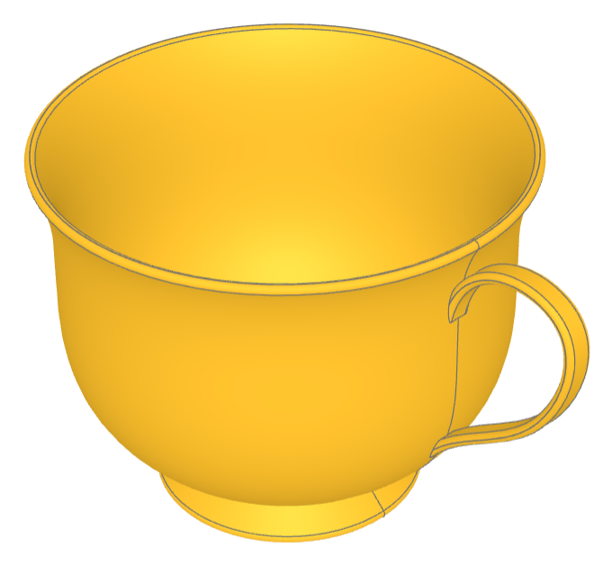

<!-- PDF page 170 -->

Reference Implementation (Builder Mode)

```python
from build123d import *
from ocp_vscode import show
```

```python
wall_thickness = 3 * MM
fillet_radius = wall_thickness * 0.49
```

```python
with BuildPart() as tea_cup:
```

```python
    # Create the bowl of the cup as a revolved cross section
    with BuildSketch(Plane.XZ) as bowl_section:
```

```python
        with BuildLine():
```

```python
            # Start & end points with control tangents
            s = Spline(
                (30 * MM, 10 * MM),
                (69 * MM, 105 * MM),
                tangents=((1, 0.5), (0.7, 1)),
                tangent_scalars=(1.75, 1),
            )
            # Lines to finish creating ½ the bowl shape
            Polyline(s @ 0, s @ 0 + (10 * MM, -10 * MM), (0, 0), (0, (s @ 1).Y), s @ 1)
        make_face()  # Create a filled 2D shape
    revolve(axis=Axis.Z)
    # Hollow out the bowl with openings on the top and bottom
    offset(amount=-wall_thickness, openings=tea_cup.faces().filter_by(GeomType.PLANE))
    # Add a bottom to the bowl
    with Locations((0, 0, (s @ 0).Y)):
```

```python
        Cylinder(radius=(s @ 0).X, height=wall_thickness)
    # Smooth out all the edges
    fillet(tea_cup.edges(), radius=fillet_radius)
```

```python
    # Determine where the handle contacts the bowl
    handle_intersections = [
        tea_cup.part.find_intersection_points(
```

```python
            Axis(origin=(0, 0, vertical_offset), direction=(1, 0, 0))
        )[-1][0]
        for vertical_offset in [35 * MM, 80 * MM]
    ]
    # Create a path for handle creation
    with BuildLine(Plane.XZ) as handle_path:
```

```python
        Spline(
            handle_intersections[0] - (wall_thickness / 2, 0),
            handle_intersections[0] + (35 * MM, 30 * MM),
            handle_intersections[0] + (40 * MM, 60 * MM),
            handle_intersections[1] - (wall_thickness / 2, 0),
            tangents=((1, 1.25), (-0.2, -1)),
        )
    # Align the cross section to the beginning of the path
    with BuildSketch(handle_path.line ^ 0) as handle_cross_section:
```

```python
        RectangleRounded(wall_thickness, 8 * MM, fillet_radius)
    sweep()  # Sweep handle cross section along path
```

```python
assert abs(tea_cup.part.volume - 130326) < 1
```

<!-- PDF page 171 -->

```python
show(tea_cup, names=["tea cup"])
```

Reference Implementation (Algebra Mode)

```python
from build123d import *
from ocp_vscode import show
```

```python
wall_thickness = 3 * MM
fillet_radius = wall_thickness * 0.49
```

```python
# Create the bowl of the cup as a revolved cross section
```

```python
# Start & end points with control tangents
s = Spline(
    (30 * MM, 10 * MM),
    (69 * MM, 105 * MM),
    tangents=((1, 0.5), (0.7, 1)),
    tangent_scalars=(1.75, 1),
)
# Lines to finish creating ½ the bowl shape
s += Polyline(s @ 0, s @ 0 + (10 * MM, -10 * MM), (0, 0), (0, (s @ 1).Y), s @ 1)
bowl_section = Plane.XZ * make_face(s)  # Create a filled 2D shape
tea_cup = revolve(bowl_section, axis=Axis.Z)
```

```python
# Hollow out the bowl with openings on the top and bottom
tea_cup = offset(
    tea_cup, -wall_thickness, openings=tea_cup.faces().filter_by(GeomType.PLANE)
)
```

```python
# Add a bottom to the bowl
tea_cup += Pos(0, 0, (s @ 0).Y) * Cylinder(radius=(s @ 0).X, height=wall_thickness)
```

```python
# Smooth out all the edges
tea_cup = fillet(tea_cup.edges(), radius=fillet_radius)
```

```python
# Determine where the handle contacts the bowl
handle_intersections = [
    tea_cup.find_intersection_points(
```

```python
        Axis(origin=(0, 0, vertical_offset), direction=(1, 0, 0))
    )[-1][0]
    for vertical_offset in [35 * MM, 80 * MM]
]
```

```python
# Create a path for handle creation
path_spline = Spline(
    handle_intersections[0] - (wall_thickness / 2, 0, 0),
    handle_intersections[0] + (35 * MM, 0, 30 * MM),
    handle_intersections[0] + (40 * MM, 0, 60 * MM),
    handle_intersections[1] - (wall_thickness / 2, 0, 0),
    tangents=((1, 0, 1.25), (-0.2, 0, -1)),
```

<!-- PDF page 172 -->

)

```python
# Align the cross section to the beginning of the path
location = path_spline ^ 0
handle_cross_section = location * RectangleRounded(wall_thickness, 8 * MM, fillet_radius)
```

```python
# Sweep handle cross section along path
tea_cup += sweep(handle_cross_section, path=path_spline)
```

```python
# assert abs(tea_cup.part.volume - 130326.77052487945) < 1e-3
```

```python
show(tea_cup, names=["tea cup"])
```

This example demonstrates the creation a tea cup, which serves as an example of constructing complex, non-flat geo-
metrical shapes programmatically.

The tea cup model involves several CAD techniques, such as:

• Revolve Operations: There is 1 occurrence of a revolve operation. This is used to create the main body of the tea
cup by revolving a profile around an axis, a common technique for generating symmetrical objects like cups.

• Sweep Operations: There are 2 occurrences of sweep operations. The handle are created by sweeping a profile
along a path to generate non-planar surfaces.

• Offset/Shell Operations: the bowl of the cup is hollowed out with the offset operation leaving the top open.

• Fillet Operations: There is 1 occurrence of a fillet operation which is used to round the edges for aesthetic
improvement and to mimic real-world objects more closely.

<!-- PDF page 173 -->

Toy Truck

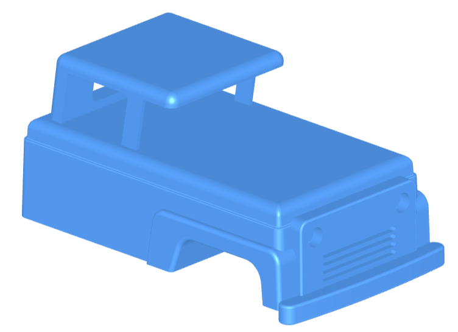

<!-- PDF page 174 -->

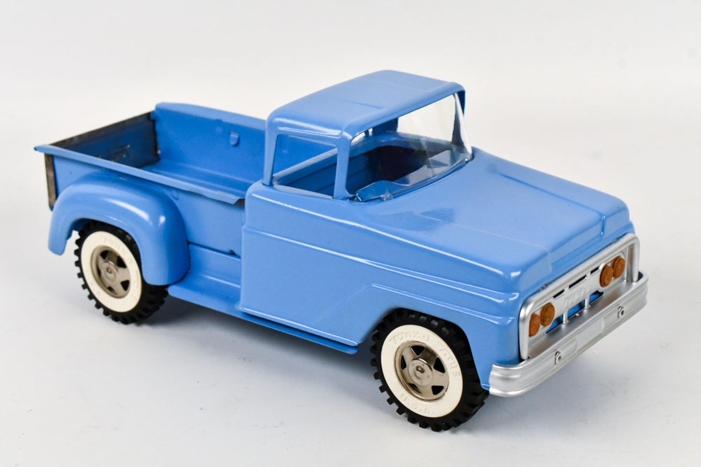

Reference Implementation (Builder Mode)

```python
from build123d import *
from ocp_vscode import show
```

```python
# Toy Truck Blue
truck_color = Color(0x4683CE)
```

```python
# Create the main truck body — from bumper to bed, excluding the cab
with BuildPart() as body:
```

```python
    # The body has two axes of symmetry, so we start with a centered sketch.
    # The default workplane is Plane.XY.
    with BuildSketch() as body_skt:
```

```python
        Rectangle(20, 35)
        # Fillet all the corners of the sketch.
        # Alternatively, you could use RectangleRounded.
        fillet(body_skt.vertices(), 1)
```

```python
    # Extrude the body shape upward
    extrude(amount=10, taper=4)
    # Reuse the sketch by accessing it explicitly
    extrude(body_skt.sketch, amount=8, taper=2)
```

```python
    # Create symmetric fenders on Plane.YZ
    with BuildSketch(Plane.YZ) as fender:
```

```python
        # The trapezoid has asymmetric angles (80°, 88°)
```

<!-- PDF page 175 -->

```python
                                                                      (continued from previous page)
        Trapezoid(18, 6, 80, 88, align=Align.MIN)
        # Fillet top edge vertices (Y-direction highest group)
        fillet(fender.vertices().group_by(Axis.Y)[-1], 1.5)
```

```python
    # Extrude the fender in both directions
    extrude(amount=10.5, both=True)
```

```python
    # Create wheel wells with a shifted sketch on Plane.YZ
    with BuildSketch(Plane.YZ.shift_origin((0, 3.5, 0))) as wheel_well:
```

```python
        Trapezoid(12, 4, 70, 85, align=Align.MIN)
        fillet(wheel_well.vertices().group_by(Axis.Y)[-1], 2)
```

```python
    # Subtract the wheel well geometry
    extrude(amount=10.5, both=True, mode=Mode.SUBTRACT)
```

```python
    # Fillet the top edges of the body
    fillet(body.edges().group_by(Axis.Z)[-1], 1)
```

```python
    # Isolate a set of body edges and preview before filleting
    body_edges = body.edges().group_by(Axis.Z)[-6]
    fillet(body_edges, 0.1)
```

```python
    # Combine edge groups from both sides of the fender and fillet them
    fender_edges = body.edges().group_by(Axis.X)[0] + body.edges().group_by(Axis.X)[-1]
    fender_edges = fender_edges.group_by(Axis.Z)[1:]
    fillet(fender_edges, 0.4)
```

```python
    # Create a sketch on the front of the truck for the grill
    with BuildSketch(
```

```python
        Plane.XZ.offset(-body.vertices().sort_by(Axis.Y)[-1].Y - 0.5)
    ) as grill:
```

```python
        Rectangle(16, 8.5, align=(Align.CENTER, Align.MIN))
        fillet(grill.vertices().group_by(Axis.Y)[-1], 1)
```

```python
        # Add headlights (subtractive circles)
        with Locations((0, 6.5)):
```

```python
            with GridLocations(12, 0, 2, 1):
```

```python
                Circle(1, mode=Mode.SUBTRACT)
```

```python
        # Add air vents (subtractive slots)
        with Locations((0, 3)):
```

```python
            with GridLocations(0, 0.8, 1, 4):
```

```python
                SlotOverall(10, 0.5, mode=Mode.SUBTRACT)
```

```python
    # Extrude the grill forward
    extrude(amount=2)
```

```python
    # Fillet only the outer grill edges (exclude headlight/vent cuts)
    grill_perimeter = body.faces().sort_by(Axis.Y)[-1].outer_wire()
    fillet(grill_perimeter.edges(), 0.2)
```

```python
    # Create the bumper as a separate part inside the body
```

<!-- PDF page 176 -->

```python
                                                                      (continued from previous page)
    with BuildPart() as bumper:
```

```python
        # Find the midpoint of a front edge and shift slightly to position the bumper
        front_cnt = body.edges().group_by(Axis.Z)[0].sort_by(Axis.Y)[-1] @ 0.5 - (0, 3)
```

```python
        with BuildSketch() as bumper_plan:
```

```python
            # Use BuildLine to draw an elliptical arc and offset
            with BuildLine():
```

```python
                EllipticalCenterArc(front_cnt, 20, 4, start_angle=60, arc_size=60)
                offset(amount=1)
            make_face()
```

```python
        # Extrude the bumper symmetrically
        extrude(amount=1, both=True)
        fillet(bumper.edges(), 0.25)
```

```python
    # Define a joint on top of the body to connect the cab later
    RigidJoint("body_top", joint_location=Location((0, -7.5, 10)))
    body.part.color = truck_color
```

```python
# Create the cab as an independent part to mount on the body
with BuildPart() as cab:
```

```python
    with BuildSketch() as cab_plan:
```

```python
        RectangleRounded(16, 16, 1)
        # Split the sketch to work on one symmetric half
        split(bisect_by=Plane.YZ)
```

```python
    # Extrude the cab forward and upward at an angle
    extrude(amount=7, dir=(0, 0.15, 1))
    fillet(cab.edges().group_by(Axis.Z)[-1].group_by(Axis.X)[1:], 1)
```

```python
    # Rear window
    with BuildSketch(Plane.XZ.shift_origin((0, 0, 3))) as rear_window:
```

```python
        RectangleRounded(8, 4, 0.75)
    extrude(amount=10, mode=Mode.SUBTRACT)
```

```python
    # Front window
    with BuildSketch(Plane.XZ) as front_window:
```

```python
        RectangleRounded(15.2, 11, 0.75)
    extrude(amount=-10, mode=Mode.SUBTRACT)
```

```python
    # Side windows
    with BuildSketch(Plane.YZ) as side_window:
```

```python
        with Locations((3.5, 0)):
```

```python
            with GridLocations(10, 0, 2, 1):
```

```python
                Trapezoid(9, 5.5, 80, 100, align=(Align.CENTER, Align.MIN))
                fillet(side_window.vertices().group_by(Axis.Y)[-1], 0.5)
    extrude(amount=12, both=True, mode=Mode.SUBTRACT)
```

```python
    # Mirror to complete the cab
    mirror(about=Plane.YZ)
```

```python
    # Define joint on cab base
```

<!-- PDF page 177 -->

```python
                                                                      (continued from previous page)
    RigidJoint("cab_base", joint_location=Location((0, 0, 0)))
    cab.part.color = truck_color
```

```python
# Attach the cab to the truck body using joints
body.joints["body_top"].connect_to(cab.joints["cab_base"])
```

```python
# Show the result
show(body.part, cab.part)
```

This example demonstrates how to design a toy truck using BuildPart and BuildSketch in Builder mode. The model
includes a detailed body, cab, grill, and bumper, showcasing techniques like sketch reuse, symmetry, tapered extrusions,
selective filleting, and the use of joints for part assembly. Ideal for learning complex part construction and hierarchical
modeling in build123d.

<!-- PDF page 178 -->

Vase

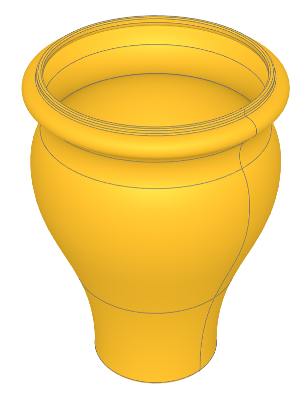

<!-- PDF page 179 -->

Reference Implementation (Builder Mode)

```python
from build123d import *
from ocp_vscode import show_object
```

```python
with BuildPart() as vase:
```

```python
    with BuildSketch() as profile:
```

```python
        with BuildLine() as outline:
            l1 = Line((0, 0), (12, 0))
            l2 = RadiusArc(l1 @ 1, (15, 20), 50)
            l3 = Spline(l2 @ 1, (22, 40), (20, 50), tangents=(l2 % 1, (-0.75, 1)))
            l4 = RadiusArc(l3 @ 1, l3 @ 1 + Vector(0, 5), 5)
            l5 = Spline(
                l4 @ 1,
                l4 @ 1 + Vector(2.5, 2.5),
                l4 @ 1 + Vector(0, 5),
                tangents=(l4 % 1, (-1, 0)),
            )
            Polyline(
                l5 @ 1,
                l5 @ 1 + Vector(0, 1),
                (0, (l5 @ 1).Y + 1),
                l1 @ 0,
            )
        make_face()
    revolve(axis=Axis.Y)
    offset(openings=vase.faces().filter_by(Axis.Y)[-1], amount=-1)
    top_edges = (
        vase.edges().filter_by_position(Axis.Y, 60, 62).filter_by(GeomType.CIRCLE)
    )
    fillet(top_edges, radius=0.25)
    fillet(vase.edges().sort_by(Axis.Y)[0], radius=0.5)
```

```python
show_object(Rot(90, 0, 0) * vase.part, name="vase")
```

Reference Implementation (Algebra Mode)

```python
from build123d import *
from ocp_vscode import show_object
```

```python
l1 = Line((0, 0), (12, 0))
l2 = RadiusArc(l1 @ 1, (15, 20), 50)
l3 = Spline(l2 @ 1, (22, 40), (20, 50), tangents=(l2 % 1, (-0.75, 1)))
l4 = RadiusArc(l3 @ 1, l3 @ 1 + Vector(0, 5), 5)
l5 = Spline(
    l4 @ 1,
    l4 @ 1 + Vector(2.5, 2.5),
    l4 @ 1 + Vector(0, 5),
    tangents=(l4 % 1, (-1, 0)),
)
outline = l1 + l2 + l3 + l4 + l5
outline += Polyline(
```

<!-- PDF page 180 -->

```python
                                                                      (continued from previous page)
    l5 @ 1,
    l5 @ 1 + Vector(0, 1),
    (0, (l5 @ 1).Y + 1),
    l1 @ 0,
)
profile = make_face(outline.edges())
vase = revolve(profile, Axis.Y)
vase = offset(vase, openings=vase.faces().sort_by(Axis.Y).last, amount=-1)
```

```python
top_edges = vase.edges().filter_by(GeomType.CIRCLE).filter_by_position(Axis.Y, 60, 62)
vase = fillet(top_edges, radius=0.25)
```

```python
vase = fillet(vase.edges().sort_by(Axis.Y).first, radius=0.5)
```

```python
show_object(Rot(90, 0, 0) * vase, name="vase")
```

This example demonstrates the build123d techniques involving the creation of a vase. Specifically, it showcases the
processes of revolving a sketch, shelling (creating a hollow object by removing material from its interior), and selecting
edges by position range and type for the application of fillets (rounding off the edges).

• Sketching: Drawing a 2D profile or outline that represents the side view of the vase.

• Revolving: Rotating the sketch around an axis to create a 3D object. This step transforms the 2D profile into a
3D vase shape.

• Offset/Shelling: Removing material from the interior of the solid vase to create a hollow space, making it resem-
ble a real vase more closely.

• Edge Filleting: Selecting specific edges of the vase for filleting, which involves rounding those edges. The edges
are selected based on their position and type.


<!-- END examples_1.md -->


<!-- BEGIN tttt.md -->

---
title: "Too Tall Toby (TTT) Tutorials"
source_html: "https://build123d.readthedocs.io/en/latest/tttt.html"
extracted_from: "official ReadTheDocs PDF"
pdf_release: "0.11.1.dev21+gbbce3cdd6"
pdf_pages: "181-219"
generated_on: "2026-07-01"
---

# Too Tall Toby (TTT) Tutorials

> Converted to Markdown from the official build123d ReadTheDocs PDF. PDF page markers and local extracted-image links are included for traceability. Some line wrapping reflects the PDF layout.
<!-- PDF page 181 -->

1.9.7 Too Tall Toby (TTT) Tutorials

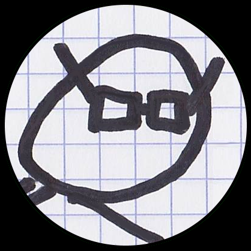

To enhance users’ proficiency with Build123D, this section offers a series of challenges. In these challenges, users are
presented with a CAD drawing and tasked with designing the part. Their goal is to match the part’s mass to a specified
target.

These drawings were skillfully crafted and generously provided to Build123D by Too Tall Toby, a renowned figure in
the realm of 3D CAD. Too Tall Toby is the host of the World Championship of 3D CAD Speedmodeling. For additional
3D CAD challenges and content, be sure to visit Toby’s youtube channel.

Feel free to click on the parts below to embark on these engaging challenges.

<!-- PDF page 182 -->

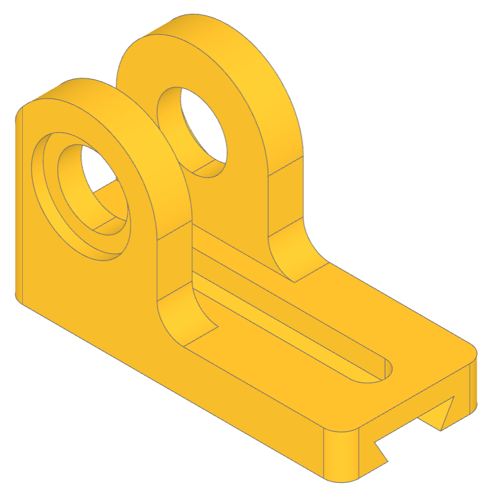

Party   Pack   01-01   Bearing   Bracket          Party  Pack    01-01   Bearing   Bracket

<!-- PDF page 183 -->

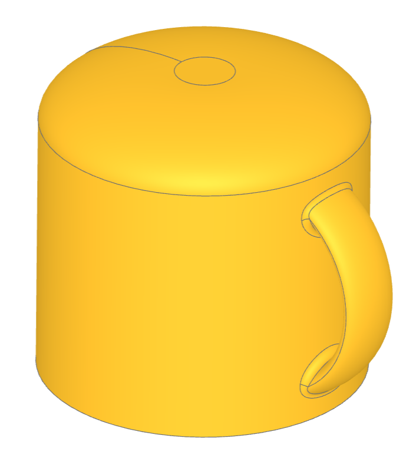

<!-- PDF page 184 -->

Party Pack 01-02 Post Cap Party Pack 01-02 Post Cap

<!-- PDF page 185 -->

Party Pack 01-03 C Clamp Base Party Pack 01-03 C Clamp Base

<!-- PDF page 186 -->

Party Pack 01-04 Angle Bracket Party Pack 01-04 Angle Bracket

<!-- PDF page 187 -->

Party Pack 01-05 Paste Sleeve Party Pack 01-05 Paste Sleeve

<!-- PDF page 188 -->

Party Pack 01-06 Bearing Jig Party Pack 01-06 Bearing Jig

<!-- PDF page 189 -->

Party Pack 01-07 Flanged Hub Party Pack 01-07 Flanged Hub

<!-- PDF page 190 -->

Party Pack 01-08 Tie Plate Party Pack 01-08 Tie Plate

<!-- PDF page 191 -->

Party Pack 01-09 Corner Tie Party Pack 01-09 Corner Tie

<!-- PDF page 192 -->

Party Pack 01-10 Light Cap Party Pack 01-10 Light Cap

<!-- PDF page 193 -->

23-02-02 SM Hanger 23-02-02 SM Hanger

<!-- PDF page 194 -->

23-T-24 Curved Support 23-T-24 Curved Support

24-SPO-06 Buffer Stand 24-SPO-06 Buffer Stand

<!-- PDF page 195 -->

Party Pack 01-01 Bearing Bracket

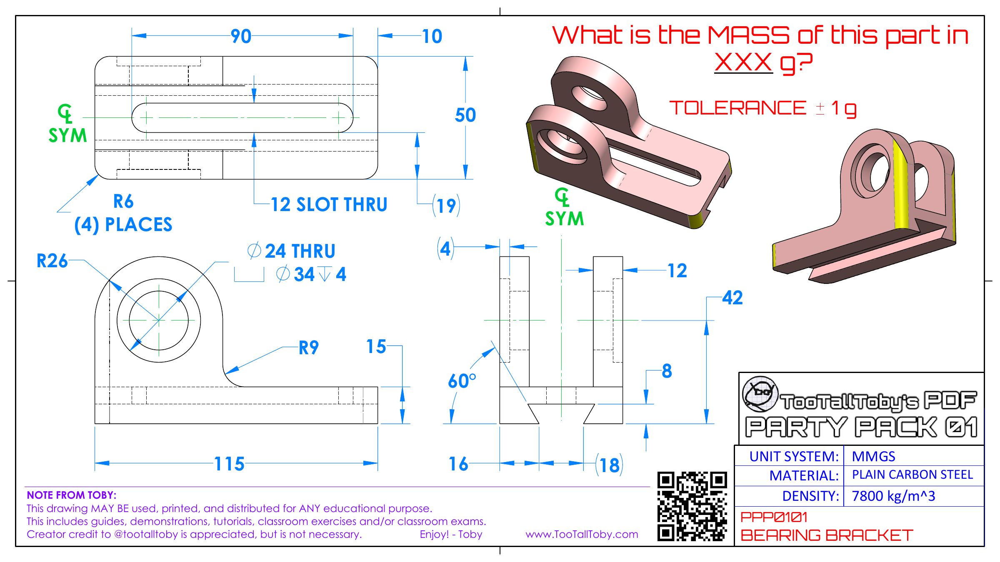

Object Mass

797.15 g

Reference Implementation

```python
"""
Too Tall Toby Party Pack 01-01 Bearing Bracket
"""
```

```python
from build123d import *
from ocp_vscode import *
```

```python
densa = 7800 / 1e6  # carbon steel density g/mm^3
densb = 2700 / 1e6  # aluminum alloy
densc = 1020 / 1e6  # ABS
```

```python
with BuildPart() as p:
```

```python
    with BuildSketch() as s:
```

```python
        Rectangle(115, 50)
        with Locations((5 / 2, 0)):
```

```python
            SlotOverall(90, 12, mode=Mode.SUBTRACT)
    extrude(amount=15)
```

```python
    with BuildSketch(Plane.XZ.offset(50 / 2)) as s3:
```

```python
        with Locations((-115 / 2 + 26, 15)):
```

```python
            SlotOverall(42 + 2 * 26 + 12, 2 * 26, rotation=90)
    zz = extrude(amount=-12)
    split(bisect_by=Plane.XY)
```

<!-- PDF page 196 -->

```python
                                                                      (continued from previous page)
    edgs = p.part.edges().filter_by(Axis.Y).group_by(Axis.X)[-2]
    fillet(edgs, 9)
```

```python
    with Locations(zz.faces().sort_by(Axis.Y)[0]):
```

```python
        with Locations((42 / 2 + 6, 0)):
```

```python
            CounterBoreHole(24 / 2, 34 / 2, 4)
    mirror(about=Plane.XZ)
```

```python
    with BuildSketch() as s4:
```

```python
        RectangleRounded(115, 50, 6)
    extrude(amount=80, mode=Mode.INTERSECT)
    # fillet does not work right, mode intersect is safer
```

```python
    with BuildSketch(Plane.YZ) as s4:
```

```python
        with BuildLine() as bl:
            l1 = Line((0, 0), (18 / 2, 0))
            l2 = PolarLine(l1 @ 1, 8, 60, length_mode=LengthMode.VERTICAL)
            l3 = Line(l2 @ 1, (0, 8))
            mirror(about=Plane.YZ)
        make_face()
    extrude(amount=115/2, both=True, mode=Mode.SUBTRACT)
```

```python
show_object(p)
```

```python
got_mass = p.part.volume*densa
want_mass = 797.15
tolerance = 1
delta = abs(got_mass - want_mass)
print(f"Mass: {got_mass:0.2f} g")
assert delta < tolerance, f'{got_mass=}, {want_mass=}, {delta=}, {tolerance=}'
```

<!-- PDF page 197 -->

Party Pack 01-02 Post Cap

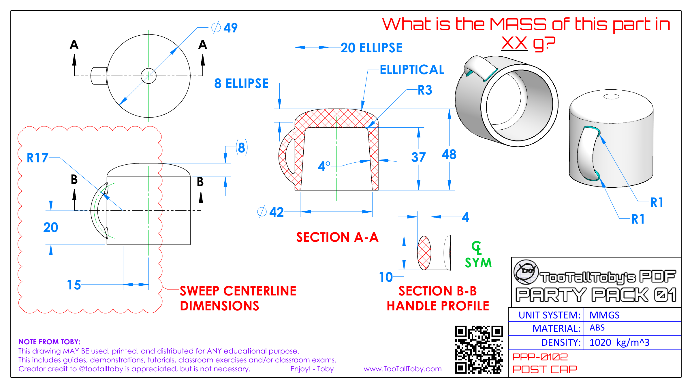

Object Mass

43.09 g

Reference Implementation

```python
"""
Too Tall Toby Party Pack 01-02 Post Cap
"""
```

```python
from build123d import *
from ocp_vscode import *
```

```python
densa = 7800 / 1e6  # carbon steel density g/mm^3
densb = 2700 / 1e6  # aluminum alloy
densc = 1020 / 1e6  # ABS
```

```python
# TTT Party Pack 01: PPP0102, mass(abs) = 43.09g
with BuildPart() as p:
```

```python
    with BuildSketch(Plane.XZ) as sk1:
```

```python
        Rectangle(49, 48 - 8, align=(Align.CENTER, Align.MIN))
        Rectangle(9, 48, align=(Align.CENTER, Align.MIN))
        with Locations((9 / 2, 40)):
```

```python
            Ellipse(20, 8)
        split(bisect_by=Plane.YZ)
    revolve(axis=Axis.Z)
```

```python
    with BuildSketch(Plane.YZ.offset(-15)) as xc1:
```

<!-- PDF page 198 -->

```python
                                                                      (continued from previous page)
        with Locations((0, 40 / 2 - 17)):
```

```python
            Ellipse(10 / 2, 4 / 2)
        with BuildLine(Plane.XZ) as l1:
```

```python
            CenterArc((-15, 40 / 2), 17, 90, 180)
    sweep(path=l1)
```

```python
    fillet(p.edges().filter_by(GeomType.CIRCLE, reverse=True).group_by(Axis.X)[0], 1)
```

```python
    with BuildLine(mode=Mode.PRIVATE) as lc1:
```

```python
        PolarLine(
            (42 / 2, 0), 37, 94, length_mode=LengthMode.VERTICAL
        )  # construction line
```

```python
    pts = [
        (0, 0),
        (42 / 2, 0),
        ((lc1.line @ 1).X, (lc1.line @ 1).Y),
        (0, (lc1.line @ 1).Y),
    ]
    with BuildSketch(Plane.XZ) as sk2:
```

```python
        Polygon(*pts, align=None)
        fillet(sk2.vertices().group_by(Axis.X)[1], 3)
    revolve(axis=Axis.Z, mode=Mode.SUBTRACT)
```

```python
show(p)
```

```python
got_mass = p.part.volume*densc
want_mass = 43.09
tolerance = 1
delta = abs(got_mass - want_mass)
print(f"Mass: {got_mass:0.2f} g")
assert delta < tolerance, f'{got_mass=}, {want_mass=}, {delta=}, {tolerance=}'
```

<!-- PDF page 199 -->

Party Pack 01-03 C Clamp Base

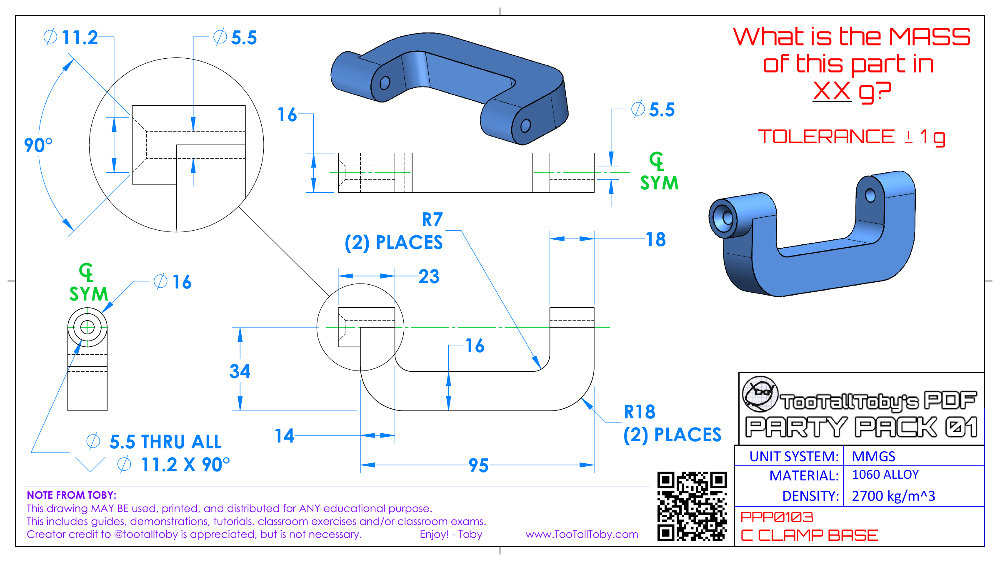

Object Mass

96.13 g

Reference Implementation

```python
"""
Too Tall Toby Party Pack 01-03 C Clamp Base
"""
```

```python
from build123d import *
from ocp_vscode import *
```

```python
densa = 7800 / 1e6  # carbon steel density g/mm^3
densb = 2700 / 1e6  # aluminum alloy
densc = 1020 / 1e6  # ABS
```

```python
with BuildPart() as ppp0103:
```

```python
    with BuildSketch() as sk1:
```

```python
        RectangleRounded(34 * 2, 95, 18)
        with Locations((0, -2)):
```

```python
            RectangleRounded((34 - 16) * 2, 95 - 18 - 14, 7, mode=Mode.SUBTRACT)
        with Locations((-34 / 2, 0)):
```

```python
            Rectangle(34, 95, 0, mode=Mode.SUBTRACT)
    extrude(amount=16)
    with BuildSketch(Plane.XZ.offset(-95 / 2)) as cyl1:
```

```python
        with Locations((0, 16 / 2)):
```

```python
            Circle(16 / 2)
```

<!-- PDF page 200 -->

```python
                                                                      (continued from previous page)
    extrude(amount=18)
    with BuildSketch(Plane.XZ.offset(95 / 2 - 14)) as cyl2:
```

```python
        with Locations((0, 16 / 2)):
```

```python
            Circle(16 / 2)
    extrude(amount=23)
    with Locations(Plane.XZ.offset(95 / 2 + 9)):
```

```python
        with Locations((0, 16 / 2)):
```

```python
            CounterSinkHole(5.5 / 2, 11.2 / 2, None, 90)
```

```python
show(ppp0103)
```

```python
got_mass = ppp0103.part.volume*densb
want_mass = 96.13
tolerance = 1
delta = abs(got_mass - want_mass)
print(f"Mass: {got_mass:0.2f} g")
assert delta < tolerance, f'{got_mass=}, {want_mass=}, {delta=}, {tolerance=}'
```

Party Pack 01-04 Angle Bracket

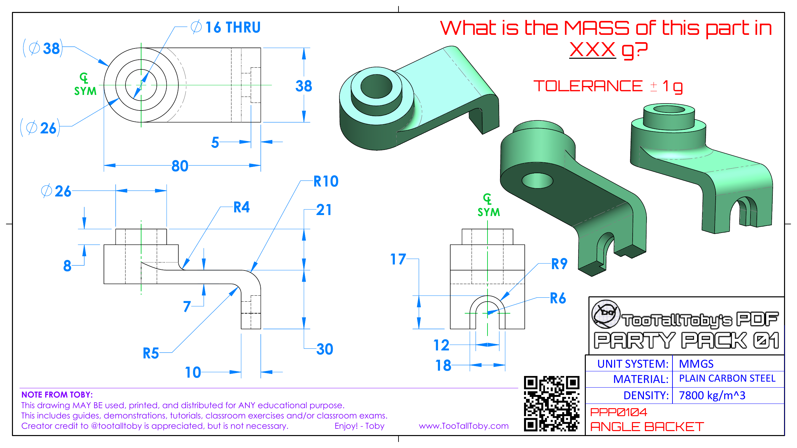

Object Mass

310.00 g

Reference Implementation

```python
"""
Too Tall Toby Party Pack 01-04 Angle Bracket
"""
```

<!-- PDF page 201 -->

```python
from build123d import *
from ocp_vscode import *
```

```python
densa = 7800 / 1e6  # carbon steel density g/mm^3
densb = 2700 / 1e6  # aluminum alloy
densc = 1020 / 1e6  # ABS
```

```python
d1, d2, d3 = 38, 26, 16
h1, h2, h3, h4 = 20, 8, 7, 23
w1, w2, w3 = 80, 10, 5
f1, f2, f3 = 4, 10, 5
sloth1, sloth2 = 18, 12
slotw1, slotw2 = 17, 14
```

```python
with BuildPart() as p:
```

```python
    with BuildSketch() as s:
```

```python
        Circle(d1 / 2)
    extrude(amount=h1)
    with BuildSketch(Plane.XY.offset(h1)) as s2:
```

```python
        Circle(d2 / 2)
    extrude(amount=h2)
    with BuildSketch(Plane.YZ) as s3:
```

```python
        Rectangle(d1 + 15, h3, align=(Align.CENTER, Align.MIN))
    extrude(amount=w1 - d1 / 2)
    # fillet workaround \/
    ped = p.part.edges().group_by(Axis.Z)[2].filter_by(GeomType.CIRCLE)
    fillet(ped, f1)
    with BuildSketch(Plane.YZ) as s3a:
```

```python
        Rectangle(d1 + 15, 15, align=(Align.CENTER, Align.MIN))
        Rectangle(d1, 15, mode=Mode.SUBTRACT, align=(Align.CENTER, Align.MIN))
    extrude(amount=w1 - d1 / 2, mode=Mode.SUBTRACT)
    # end fillet workaround /\
    with BuildSketch() as s4:
```

```python
        Circle(d3 / 2)
    extrude(amount=h1 + h2, mode=Mode.SUBTRACT)
    with BuildSketch() as s5:
```

```python
        with Locations((w1 - d1 / 2 - w2 / 2, 0)):
```

```python
            Rectangle(w2, d1)
    extrude(amount=-h4)
    fillet(p.part.edges().group_by(Axis.X)[-1].sort_by(Axis.Z)[-1], f2)
    fillet(p.part.edges().group_by(Axis.X)[-4].sort_by(Axis.Z)[-2], f3)
    pln = Plane.YZ.offset(w1 - d1 / 2)
    with BuildSketch(pln) as s6:
```

```python
        with Locations((0, -h4)):
```

```python
            SlotOverall(slotw1 * 2, sloth1, 90)
    extrude(amount=-w3, mode=Mode.SUBTRACT)
    with BuildSketch(pln) as s6b:
```

```python
        with Locations((0, -h4)):
```

```python
            SlotOverall(slotw2 * 2, sloth2, 90)
    extrude(amount=-w2, mode=Mode.SUBTRACT)
```

<!-- PDF page 202 -->

show(p)

```python
got_mass = p.part.volume*densa
want_mass = 310
tolerance = 1
delta = abs(got_mass - want_mass)
print(f"Mass: {got_mass:0.2f} g")
assert delta < tolerance, f'{got_mass=}, {want_mass=}, {delta=}, {tolerance=}'
```

Party Pack 01-05 Paste Sleeve

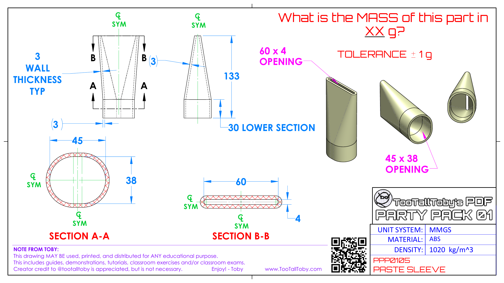

Object Mass

57.08 g

Reference Implementation

```python
"""
Too Tall Toby Party Pack 01-05 Paste Sleeve
"""
```

```python
from build123d import *
from ocp_vscode import *
```

```python
densa = 7800 / 1e6  # carbon steel density g/mm^3
densb = 2700 / 1e6  # aluminum alloy
densc = 1020 / 1e6  # ABS
```

<!-- PDF page 203 -->

```python
                                                                      (continued from previous page)
with BuildPart() as p:
```

```python
    with BuildSketch() as s:
```

```python
        SlotOverall(45, 38)
        offset(amount=3)
    with BuildSketch(Plane.XY.offset(133 - 30)) as s2:
```

```python
        SlotOverall(60, 4)
        offset(amount=3)
    loft()
```

```python
    with BuildSketch() as s3:
```

```python
        SlotOverall(45, 38)
    with BuildSketch(Plane.XY.offset(133 - 30)) as s4:
```

```python
        SlotOverall(60, 4)
    loft(mode=Mode.SUBTRACT)
```

```python
    extrude(p.part.faces().sort_by(Axis.Z)[0], amount=30)
```

```python
show(p)
```

```python
got_mass = p.part.volume*densc
want_mass = 57.08
tolerance = 1
delta = abs(got_mass - want_mass)
print(f"Mass: {got_mass:0.2f} g")
assert delta < tolerance, f'{got_mass=}, {want_mass=}, {delta=}, {tolerance=}'
```

Party Pack 01-06 Bearing Jig

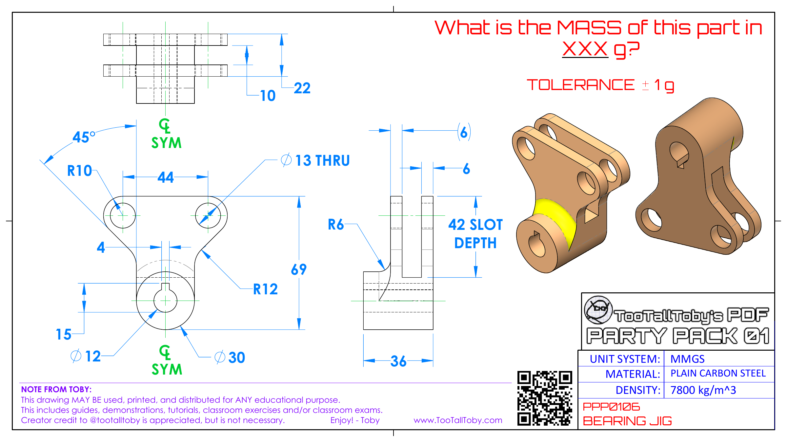

<!-- PDF page 204 -->

Object Mass

328.02 g

Reference Implementation

```python
"""
Too Tall Toby Party Pack 01-06 Bearing Jig
"""
```

```python
from build123d import *
from ocp_vscode import *
```

```python
densa = 7800 / 1e6  # carbon steel density g/mm^3
densb = 2700 / 1e6  # aluminum alloy
densc = 1020 / 1e6  # ABS
```

```python
r1, r2, r3, r4, r5 = 30 / 2, 13 / 2, 12 / 2, 10, 6  # radii used
x1 = 44  # lengths used
y1, y2, y3, y4, y_tot = 36, 36 - 22 / 2, 22 / 2, 42, 69  # widths used
```

```python
with BuildSketch(Location((0, -r1, y3))) as sk_body:
```

```python
    with BuildLine() as l:
        c1 = Line((r1, 0), (r1, y_tot), mode=Mode.PRIVATE)  # construction line
        m1 = Line((0, y_tot), (x1 / 2, y_tot))
        m2 = JernArc(m1 @ 1, m1 % 1, r4, -90 - 45)
        m3 = IntersectingLine(m2 @ 1, m2 % 1, c1)
        m4 = Line(m3 @ 1, (r1, r1))
        m5 = JernArc(m4 @ 1, m4 % 1, r1, -90)
        mirror(about=Plane.YZ)
    make_face()
    fillet(sk_body.vertices().group_by(Axis.Y)[1], 12)
    with Locations((x1 / 2, y_tot - 10), (-x1 / 2, y_tot - 10)):
```

```python
        Circle(r2, mode=Mode.SUBTRACT)
    # Keyway
    with Locations((0, r1)):
```

```python
        Circle(r3, mode=Mode.SUBTRACT)
        Rectangle(4, 3 + 6, align=(Align.CENTER, Align.MIN), mode=Mode.SUBTRACT)
```

```python
with BuildPart() as p:
```

```python
    Box(200, 200, 22)  # Oversized plate
    # Cylinder underneath
    Cylinder(r1, y2, align=(Align.CENTER, Align.CENTER, Align.MAX))
    fillet(p.edges(Select.NEW), r5)  # Weld together
    extrude(sk_body.sketch, amount=-y1, mode=Mode.INTERSECT)  # Cut to shape
    # Remove slot
    with Locations((0, y_tot - r1 - y4, 0)):
```

```python
        Box(
            y_tot,
            y_tot,
            10,
            align=(Align.CENTER, Align.MIN, Align.CENTER),
            mode=Mode.SUBTRACT,
        )
```

<!-- PDF page 205 -->

```python
show(p)
```

```python
got_mass = p.part.volume*densa
want_mass = 328.02
tolerance = 1
delta = abs(got_mass - want_mass)
print(f"Mass: {got_mass:0.2f} g")
assert delta < tolerance, f'{got_mass=}, {want_mass=}, {delta=}, {tolerance=}'
```

Party Pack 01-07 Flanged Hub

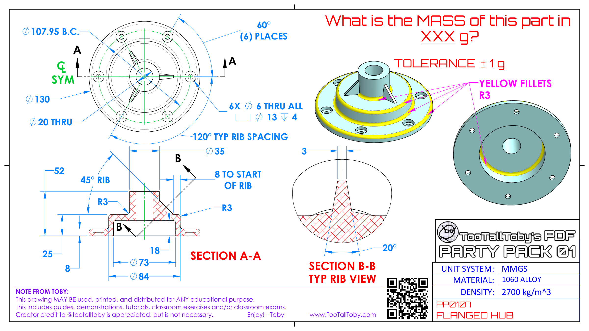

Object Mass

372.99 g

Reference Implementation

```python
"""
Too Tall Toby Party Pack 01-07 Flanged Hub
"""
```

```python
from build123d import *
from ocp_vscode import *
```

```python
densa = 7800 / 1e6  # carbon steel density g/mm^3
densb = 2700 / 1e6  # aluminum alloy
densc = 1020 / 1e6  # ABS
```

<!-- PDF page 206 -->

```python
with BuildPart() as p:
```

```python
    with BuildSketch() as s:
```

```python
        Circle(130 / 2)
    extrude(amount=8)
    with BuildSketch(Plane.XY.offset(8)) as s2:
```

```python
        Circle(84 / 2)
    extrude(amount=25 - 8)
    with BuildSketch(Plane.XY.offset(25)) as s3:
```

```python
        Circle(35 / 2)
    extrude(amount=52 - 25)
    with BuildSketch() as s4:
```

```python
        Circle(73 / 2)
    extrude(amount=18, mode=Mode.SUBTRACT)
    pln2 = p.part.faces().sort_by(Axis.Z)[5]
    with BuildSketch(Plane.XY.offset(52)) as s5:
```

```python
        Circle(20 / 2)
    extrude(amount=-52, mode=Mode.SUBTRACT)
    fillet(
        p.part.edges()
        .filter_by(GeomType.CIRCLE)
        .sort_by(Axis.Z)[2:-2]
        .sort_by(SortBy.RADIUS)[1:],
        3,
    )
    pln = Plane(pln2)
    pln.origin = pln.origin + Vector(20 / 2, 0, 0)
    pln = pln.rotated((0, 45, 0))
    pln = pln.offset(-25 + 3 + 0.10)
    with BuildSketch(pln) as s6:
```

```python
        Rectangle((73 - 35) / 2 * 1.414 + 5, 3)
    zz = extrude(amount=15, taper=-20 / 2, mode=Mode.PRIVATE)
    zz2 = split(zz, bisect_by=Plane.XY.offset(25), mode=Mode.PRIVATE)
    zz3 = split(zz2, bisect_by=Plane.YZ.offset(35 / 2 - 1), mode=Mode.PRIVATE)
    with PolarLocations(0, 3):
```

```python
        add(zz3)
    with Locations(Plane.XY.offset(8)):
```

```python
        with PolarLocations(107.95 / 2, 6):
```

```python
            CounterBoreHole(6 / 2, 13 / 2, 4)
```

```python
show(p)
```

```python
got_mass = p.part.volume*densb
want_mass = 372.99
tolerance = 1
delta = abs(got_mass - want_mass)
print(f"Mass: {got_mass:0.2f} g")
assert delta < tolerance, f'{got_mass=}, {want_mass=}, {delta=}, {tolerance=}'
```

<!-- PDF page 207 -->

Party Pack 01-08 Tie Plate

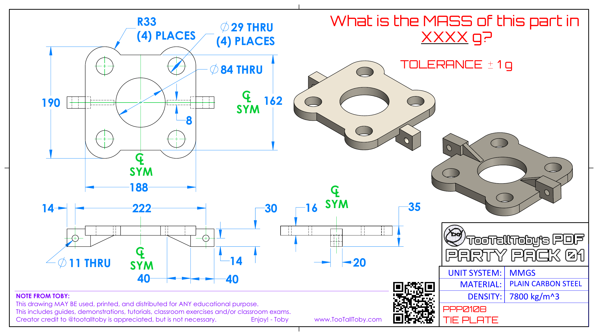

Object Mass

3387.06 g

Reference Implementation

```python
"""
Too Tall Toby Party Pack 01-08 Tie Plate
"""
```

```python
from build123d import *
from ocp_vscode import *
```

```python
densa = 7800 / 1e6  # carbon steel density g/mm^3
densb = 2700 / 1e6  # aluminum alloy
densc = 1020 / 1e6  # ABS
```

```python
with BuildPart() as p:
```

```python
    with BuildSketch() as s1:
```

```python
        Rectangle(188 / 2 - 33, 162, align=(Align.MIN, Align.CENTER))
        with Locations((188 / 2 - 33, 0)):
```

```python
            SlotOverall(190, 33 * 2, rotation=90)
        mirror(about=Plane.YZ)
        with GridLocations(188 - 2 * 33, 190 - 2 * 33, 2, 2):
```

```python
            Circle(29 / 2, mode=Mode.SUBTRACT)
        Circle(84 / 2, mode=Mode.SUBTRACT)
    extrude(amount=16)
```

```python
    with BuildPart() as p2:
```

<!-- PDF page 208 -->

```python
                                                                      (continued from previous page)
        with BuildSketch(Plane.XZ) as s2:
```

```python
            with BuildLine() as l1:
                l1 = Polyline(
                    (222 / 2 + 14 - 40 - 40, 0),
                    (222 / 2 + 14 - 40, -35 + 16),
                    (222 / 2 + 14, -35 + 16),
                    (222 / 2 + 14, -35 + 16 + 30),
                    (222 / 2 + 14 - 40 - 40, -35 + 16 + 30),
                    close=True,
                )
            make_face()
            with Locations((222 / 2, -35 + 16 + 14)):
```

```python
                Circle(11 / 2, mode=Mode.SUBTRACT)
        extrude(amount=20 / 2, both=True)
        with BuildSketch() as s3:
```

```python
            with Locations(l1 @ 0):
```

```python
                Rectangle(40 + 40, 8, align=(Align.MIN, Align.CENTER))
                with Locations((40, 0)):
```

```python
                    Rectangle(40, 20, align=(Align.MIN, Align.CENTER))
        extrude(amount=30, both=True, mode=Mode.INTERSECT)
        mirror(about=Plane.YZ)
```

```python
show(p)
```

```python
got_mass = p.part.volume*densa
want_mass = 3387.06
tolerance = 1
delta = abs(got_mass - want_mass)
print(f"Mass: {got_mass:0.2f} g")
assert delta < tolerance, f'{got_mass=}, {want_mass=}, {delta=}, {tolerance=}'
```

<!-- PDF page 209 -->

Party Pack 01-09 Corner Tie

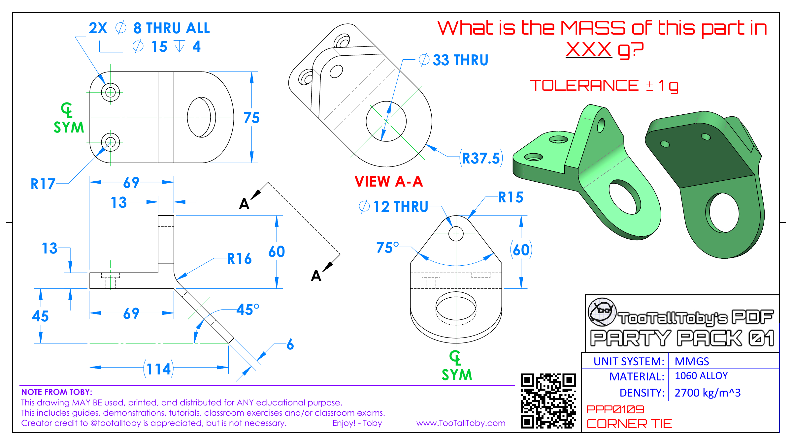

Object Mass

307.23 g

Reference Implementation

```python
"""
Too Tall Toby Party Pack 01-09 Corner Tie
"""
```

```python
from math import sqrt
from build123d import *
from ocp_vscode import *
```

```python
densa = 7800 / 1e6  # carbon steel density g/mm^3
densb = 2700 / 1e6  # aluminum alloy
densc = 1020 / 1e6  # ABS
```

```python
with BuildPart() as ppp109:
```

```python
    with BuildSketch() as one:
```

```python
        Rectangle(69, 75, align=(Align.MAX, Align.CENTER))
        fillet(one.vertices().group_by(Axis.X)[0], 17)
    extrude(amount=13)
    centers = [
        arc.arc_center
        for arc in ppp109.edges().filter_by(GeomType.CIRCLE).group_by(Axis.Z)[-1]
    ]
    with Locations(*centers):
```

```python
        CounterBoreHole(radius=8 / 2, counter_bore_radius=15 / 2, counter_bore_depth=4)
```

<!-- PDF page 210 -->

```python
    with BuildSketch(Plane.YZ) as two:
```

```python
        with Locations((0, 45)):
```

```python
            Circle(15)
        with BuildLine() as bl:
            c = Line((75 / 2, 0), (75 / 2, 60), mode=Mode.PRIVATE)
            u = two.edge().find_tangent(75 / 2 + 90)[0]  # where is the slope 75/2?
            l1 = IntersectingLine(
                two.edge().position_at(u), -two.edge().tangent_at(u), other=c
            )
            Line(l1 @ 0, (0, 45))
            Polyline((0, 0), c @ 0, l1 @ 1)
            mirror(about=Plane.YZ)
        make_face()
        with Locations((0, 45)):
```

```python
            Circle(12 / 2, mode=Mode.SUBTRACT)
    extrude(amount=-13)
```

```python
    with BuildSketch(Plane((0, 0, 0), x_dir=(1, 0, 0), z_dir=(1, 0, 1))) as three:
```

```python
        Rectangle(45 * 2 / sqrt(2) - 37.5, 75, align=(Align.MIN, Align.CENTER))
        with Locations(three.edges().sort_by(Axis.X)[-1].center()):
```

```python
            Circle(37.5)
            Circle(33 / 2, mode=Mode.SUBTRACT)
        split(bisect_by=Plane.YZ)
    extrude(amount=6)
    f = ppp109.faces().filter_by(Axis((0, 0, 0), (-1, 0, 1)))[0]
    extrude(f, until=Until.NEXT)
    fillet(ppp109.edges().filter_by(Axis.Y).sort_by(Axis.Z)[2], 16)
    # extrude(f, amount=10)
    # fillet(ppp109.edges(Select.NEW), 16)
```

```python
show(ppp109)
```

```python
got_mass = ppp109.part.volume * densb
want_mass = 307.23
tolerance = 1
delta = abs(got_mass - want_mass)
print(f"Mass: {got_mass:0.2f} g")
assert delta < tolerance, f"{got_mass=}, {want_mass=}, {delta=}, {tolerance=}"
```

<!-- PDF page 211 -->

Party Pack 01-10 Light Cap

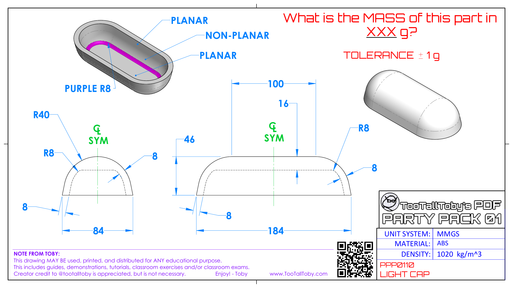

Object Mass

211.30 g

Reference Implementation

```python
"""
Too Tall Toby Party Pack 01-10 Light Cap
"""
```

```python
from math import sqrt, asin, pi
from build123d import *
from ocp_vscode import *
```

```python
densa = 7800 / 1e6  # carbon steel density g/mm^3
densb = 2700 / 1e6  # aluminum alloy
densc = 1020 / 1e6  # ABS
```

```python
# The smaller cross-section is defined as having R40, height 46,
# and base width 84, so clearly it's not entirely a half-circle or
# similar; the base's extreme points need to connect via tangents
# to the R40 arc centered 6mm above the baseline.
#
# Compute the angle of the tangent line (working with the
# left/negativeX side, given symmetry) by observing the tangent
# point (T), the circle's center (O), and the baseline's edge (P)
# form a right triangle, so:
```

```python
OT=40
```

<!-- PDF page 212 -->

```python
                                                                      (continued from previous page)
OP=sqrt((-84/2)**2+(-6)**2)
TP=sqrt(OP**2-40**2)
OPT_degrees = asin(OT/OP) * 180/pi
# Correct for the fact that OP isn't horizontal.
OP_to_X_axis_degrees = asin(6/OP) * 180/pi
left_tangent_degrees = OPT_degrees + OP_to_X_axis_degrees
left_tangent_length = TP
with BuildPart() as outer:
```

```python
    with BuildSketch(Plane.XZ) as sk:
```

```python
        with BuildLine():
            l1 = PolarLine(start=(-84/2, 0), length=left_tangent_length, angle=left_
```

```python
˓→tangent_degrees)
            l2 = TangentArc(l1@1, (0, 46), tangent=l1%1)
            l3 = offset(amount=-8, side=Side.RIGHT, closed=False, mode=Mode.ADD)
            l4 = Line(l1@0, l3@1)
            l5 = Line(l3@0, l2@1)
        make_face()
```

```python
        with BuildLine():
            l6 = Line(l2 @ 1, (0, 46 - 16))
            l7 = IntersectingLine(start=l6 @ 1, direction=(-1, 0), other=l3)
            l8 = TangentArc(l7 @ 1, l2 @ 1, tangent=(-1, 0), tangent_from_first=False)
```

```python
        make_face()
```

```python
    revolve(axis=Axis.Z)
sk = sk.sketch & Plane.XZ*Rectangle(1000, 1000, align=[Align.CENTER, Align.MIN])
positive_Z = Box(100, 100, 100, align=[Align.CENTER, Align.MIN, Align.MIN])
p = outer.part & positive_Z
cross_section = sk + mirror(sk, about=Plane.YZ)
p += extrude(cross_section, amount=50)
p += mirror(p, about=Plane.XZ.offset(50))
p += fillet(p.edges().filter_by(GeomType.LINE).filter_by(Axis.Y).group_by(Axis.Z)[-1],␣
```

```python
˓→radius=8)
ppp0110 = p
```

```python
got_mass = ppp0110.volume*densc
want_mass = 211.30
tolerance = 1
delta = abs(got_mass - want_mass)
print(f"Mass: {got_mass:0.1f} g")
assert delta < tolerance, f'{got_mass=}, {want_mass=}, {delta=}, {tolerance=}'
```

```python
show(ppp0110)
```

<!-- PDF page 213 -->

23-02-02 SM Hanger

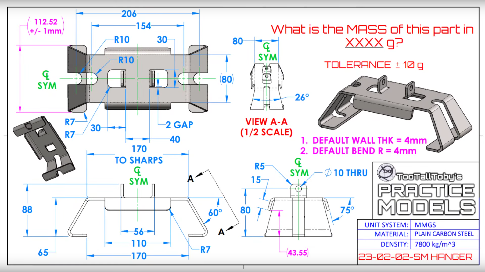

Object Mass

1028g +/- 10g

Reference Implementation

```python
"""
Creation of a complex sheet metal part
```

```python
name: ttt_sm_hanger.py
by:   Gumyr
date: July 17, 2023
```

```python
desc:
```

```python
    This example implements the sheet metal part described in Too Tall Toby's
    sm_hanger CAD challenge.
```

```python
    Notably, a BuildLine/Curve object is filleted by providing all the vertices
    and allowing the fillet operation filter out the end vertices. The
    make_brake_formed operation is used both in Algebra and Builder mode to
    create a sheet metal part from just an outline and some dimensions.
    license:
```

```python
    Copyright 2023 Gumyr
```

```python
    Licensed under the Apache License, Version 2.0 (the "License");
    you may not use this file except in compliance with the License.
    You may obtain a copy of the License at
```

<!-- PDF page 214 -->

http://www.apache.org/licenses/LICENSE-2.0

```python
    Unless required by applicable law or agreed to in writing, software
    distributed under the License is distributed on an "AS IS" BASIS,
    WITHOUT WARRANTIES OR CONDITIONS OF ANY KIND, either express or implied.
    See the License for the specific language governing permissions and
    limitations under the License.
```

```python
"""
```

```python
from build123d import *
from ocp_vscode import *
```

```python
sheet_thickness = 4 * MM
```

```python
# Create the main body from a side profile
with BuildPart() as side:
    d = Vector(1, 0, 0).rotate(Axis.Y, 60)
    with BuildLine(Plane.XZ) as side_line:
        l1 = Line((0, 65), (170 / 2, 65))
        l2 = PolarLine(l1 @ 1, length=65, direction=d, length_mode=LengthMode.VERTICAL)
        l3 = Line(l2 @ 1, (170 / 2, 0))
        fillet(side_line.vertices(), 7)
    make_brake_formed(
        thickness=sheet_thickness,
        station_widths=[40, 40, 40, 112.52 / 2, 112.52 / 2, 112.52 / 2],
        side=Side.RIGHT,
    )
    fe = side.edges().filter_by(Axis.Z).group_by(Axis.Z)[0].sort_by(Axis.Y)[-1]
    fillet(fe, radius=7)
```

```python
# Create the "wings" at the top
with BuildPart() as wing:
```

```python
    with BuildLine(Plane.YZ) as wing_line:
        l1 = Line((0, 65), (80 / 2 + 1.526 * sheet_thickness, 65))
        PolarLine(l1 @ 1, 20.371288916, direction=Vector(0, 1, 0).rotate(Axis.X, -75))
        fillet(wing_line.vertices(), 7)
    make_brake_formed(
        thickness=sheet_thickness,
        station_widths=110 / 2,
        side=Side.RIGHT,
    )
    bottom_edge = wing.edges().group_by(Axis.X)[-1].sort_by(Axis.Z)[0]
    fillet(bottom_edge, radius=7)
```

```python
# Create the tab at the top in Algebra mode
tab_line = Plane.XZ * Polyline(
    (20, 65 - sheet_thickness), (56 / 2, 65 - sheet_thickness), (56 / 2, 88)
)
tab_line = fillet(tab_line.vertices(), 7)
tab = make_brake_formed(sheet_thickness, 8, tab_line, Side.RIGHT)
tab = fillet(tab.edges().filter_by(Axis.X).group_by(Axis.Z)[-1].sort_by(Axis.Y)[-1], 5)
```

<!-- PDF page 215 -->

```python
                                                                      (continued from previous page)
tab -= Pos((0, 0, 80)) * Rot(0, 90, 0) * Hole(5, 100)
```

```python
# Combine the parts together
with BuildPart() as sm_hanger:
```

```python
    add([side.part, wing.part])
    mirror(about=Plane.XZ)
    with BuildSketch(Plane.XY.offset(65)) as h1:
```

```python
        with Locations((20, 0)):
```

```python
            Rectangle(30, 30, align=(Align.MIN, Align.CENTER))
            fillet(h1.vertices().group_by(Axis.X)[-1], 7)
        SlotCenterPoint((154, 0), (154 / 2, 0), 20)
    extrude(amount=-40, mode=Mode.SUBTRACT)
    with BuildSketch() as h2:
```

```python
        SlotCenterPoint((206, 0), (206 / 2, 0), 20)
    extrude(amount=40, mode=Mode.SUBTRACT)
    add(tab)
    mirror(about=Plane.YZ)
    mirror(about=Plane.XZ)
```

```python
got_mass = sm_hanger.part.volume * 7800 * 1e-6
want_mass = 1028
tolerance = 10
delta = abs(got_mass - want_mass)
print(f"Mass: {got_mass:0.1f} g")
# assert delta < tolerance, f"{got_mass=}, {want_mass=}, {delta=}, {tolerance=}"
```

```python
# assert abs(got_mass - 1028) < 10, f"{got_mass=}, want=1028, tolerance=10"
```

```python
show(sm_hanger)
```

<!-- PDF page 216 -->

23-T-24 Curved Support

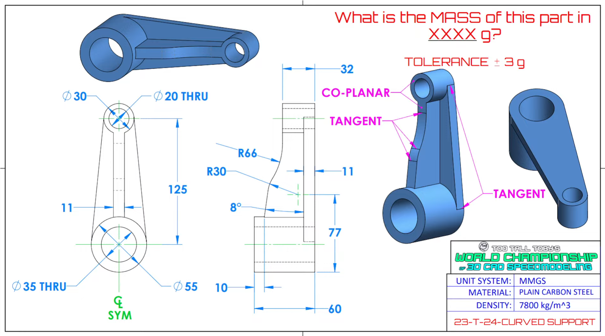

Object Mass

1294 g

Reference Implementation

```python
"""
Too Tall Toby challenge 23-T-24 CURVED SUPPORT
"""
```

```python
from math import sin, cos, tan, radians
from build123d import *
from ocp_vscode import *
import sympy
```

```python
# This problem uses the sympy symbolic math solver
```

```python
# Define the symbols for the unknowns
# - the center of the radius 30 arc (x30, y30)
# - the center of the radius 66 arc (x66, y66)
# - end of the 8° line (l8x, l8y)
# - the point with the radius 30 and 66 arc meet i30_66
# - the start of the horizontal line lh
y30, x66, xl8, yl8 = sympy.symbols("y30 x66 xl8 yl8")
x30 = 77 - 55 / 2
y66 = 66 + 32
```

```python
# There are 4 unknowns so we need 4 equations
equations = [
```

<!-- PDF page 217 -->

```python
                                                                      (continued from previous page)
    (x66 - x30) ** 2 + (y66 - y30) ** 2 - (66 + 30) ** 2,  # distance between centers
    xl8 - (x30 + 30 * sin(radians(8))),  # 8 degree slope
    yl8 - (y30 + 30 * cos(radians(8))),  # 8 degree slope
    (yl8 - 50) / (55 / 2 - xl8) - tan(radians(8)),  # 8 degree slope
]
# There are two solutions but we want the 2nd one
solution = {k: float(v) for k,v in sympy.solve(equations, dict=True)[1].items()}
```

```python
# Create the critical points
c30 = Vector(x30, solution[y30])
c66 = Vector(solution[x66], y66)
l8 = Vector(solution[xl8], solution[yl8])
i30_66 = Line(c30, c66) @ (30 / (30 + 66))
lh = Vector(c66.X, 32)
```

```python
with BuildLine() as profile:
    l1 = Line((55 / 2, 50), l8)
    l2 = RadiusArc(l1 @ 1, i30_66, 30)
    l3 = RadiusArc(l2 @ 1, lh, -66)
    l4 = Polyline(l3 @ 1, (125, 32), (125, 0), (0, 0), (0, (l1 @ 0).Y), l1 @ 0)
```

```python
with BuildPart() as curved_support:
```

```python
    with BuildSketch() as base_plan:
        c_8_degrees = Circle(55 / 2)
        with Locations((0, 125)):
```

```python
            Circle(30 / 2)
        base_hull = make_hull(mode=Mode.PRIVATE)
    extrude(amount=32)
    extrude(c_8_degrees, amount=60)
    extrude(base_hull, amount=11)
    with BuildSketch(Plane.YZ) as bridge:
```

```python
        make_face(profile.edges())
    extrude(amount=11 / 2, both=True)
    Hole(35 / 2)
    with Locations((0, 125)):
```

```python
        Hole(20 / 2)
```

```python
got_mass = curved_support.part.volume * 7800e-6
want_mass = 1294
delta = abs(got_mass - want_mass)
tolerance = 3
print(f"Mass: {got_mass:0.1f} g")
assert delta < tolerance, f'{got_mass=}, {want_mass=}, {delta=}, {tolerance=}'
```

```python
show(curved_support)
```

<!-- PDF page 218 -->

24-SPO-06 Buffer Stand

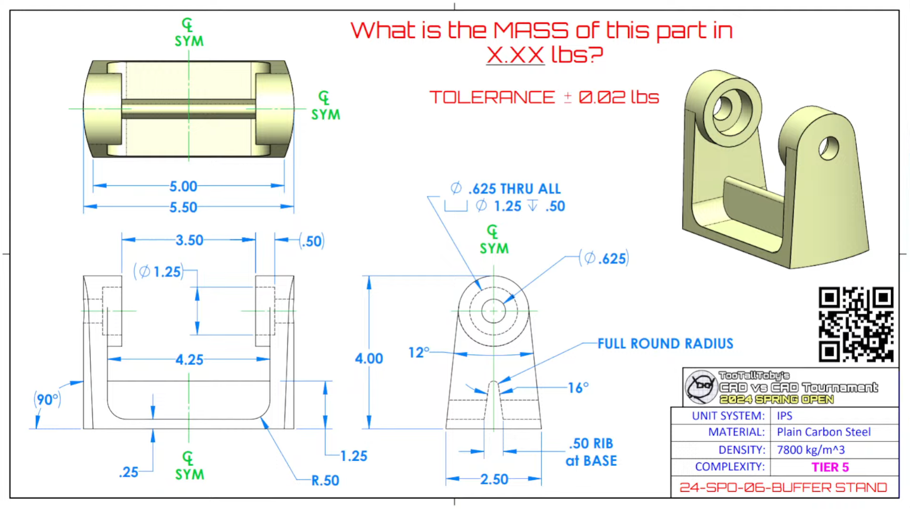

Object Mass

3.92 lbs

Reference Implementation

```python
from build123d import *
from ocp_vscode import show
```

```python
with BuildPart() as p:
```

```python
    with BuildSketch() as xy:
```

```python
        with BuildLine():
            l1 = ThreePointArc((5 / 2, -1.25), (5.5 / 2, 0), (5 / 2, 1.25))
            Polyline(l1 @ 0, (0, -1.25), (0, 1.25), l1 @ 1)
        make_face()
    extrude(amount=4)
```

```python
    with BuildSketch(Plane.YZ) as yz:
```

```python
        Trapezoid(2.5, 4, 90 - 6, align=(Align.CENTER, Align.MIN))
        full_round(yz.edges().sort_by(SortBy.LENGTH)[0])
        circle_edge = yz.edges().filter_by(GeomType.CIRCLE)[0]
        arc_center = circle_edge.arc_center
        arc_radius = circle_edge.radius
    extrude(amount=10, mode=Mode.INTERSECT)
```

```python
    # To avoid OCCT problems, don't attempt to extend the top arc, remove instead
    with BuildPart(mode=Mode.SUBTRACT) as internals:
        y = p.edges().filter_by(Axis.X).sort_by(Axis.Z)[-1].center().Z
```

<!-- PDF page 219 -->

```python
                                                                      (continued from previous page)
        with BuildSketch(Plane.YZ.offset(4.25 / 2)) as yz:
```

```python
            Trapezoid(2.5, y, 90 - 6, align=(Align.CENTER, Align.MIN))
            with Locations(arc_center):
```

```python
                Circle(arc_radius, mode=Mode.SUBTRACT)
        extrude(amount=-(4.25 - 3.5) / 2)
```

```python
        with BuildSketch(Plane.YZ.offset(3.5 / 2)) as yz:
```

```python
            Trapezoid(2.5, 4, 90 - 6, align=(Align.CENTER, Align.MIN))
        extrude(amount=-3.5 / 2)
```

```python
        with BuildSketch(Plane.XZ.offset(-2)) as xz:
```

```python
            with Locations((0, 4)):
```

```python
                RectangleRounded(4.25, 7.5, 0.5)
        extrude(amount=4, mode=Mode.INTERSECT)
```

```python
    with Locations(p.faces(Select.LAST).filter_by(GeomType.PLANE).sort_by(Axis.Z)[-1]):
```

```python
        CounterBoreHole(0.625 / 2, 1.25 / 2, 0.5)
```

```python
    with BuildSketch(Plane.YZ) as rib:
```

```python
        with Locations((0, 0.25)):
```

```python
            Trapezoid(0.5, 1, 90 - 8, align=(Align.CENTER, Align.MIN))
        full_round(rib.edges().sort_by(SortBy.LENGTH)[0])
    extrude(amount=4.25 / 2)
```

```python
    mirror(about=Plane.YZ)
```

```python
part = scale(p.part, IN)
```

```python
got_mass = part.volume * 7800e-6 / LB
want_mass = 3.923
tolerance = 0.02
delta = abs(got_mass - want_mass)
print(f"Mass: {got_mass:0.1f} lbs")
assert delta < tolerance, f"{got_mass=}, {want_mass=}, {delta=}, {tolerance=}"
```

```python
show(p)
```


<!-- END tttt.md -->


<!-- BEGIN tutorial_stl_reconstruction.md -->

---
title: "Tutorial: Reconstructing a Design from an STL"
source_html: "https://build123d.readthedocs.io/en/latest/tutorial_stl_reconstruction.html"
extracted_from: "official ReadTheDocs PDF"
pdf_release: "0.11.1.dev21+gbbce3cdd6"
pdf_pages: "219-224"
generated_on: "2026-07-01"
---

# Tutorial: Reconstructing a Design from an STL

> Converted to Markdown from the official build123d ReadTheDocs PDF. PDF page markers and local extracted-image links are included for traceability. Some line wrapping reflects the PDF layout.
<!-- PDF page 219 -->

1.9.8 Tutorial: Reconstructing a Design from an STL

This tutorial describes a practical workflow for using detect_primitives() to help reconstruct a parametric
build123d model from an STL mesh.

This is not a push-button STL-to-CAD converter. It is a mesh-guided redesign process. The goal is to extract enough
analytic structure from a triangulated model to make manual reconstruction faster and more reliable.

. Warning

Rebuilding a design from STL is usually slow, approximate, and manual. STL files contain triangles, not modeling
intent. Even when detect_primitives() finds useful planes, cylinders, and spheres, the final build123d model
still needs to be designed deliberately.

<!-- PDF page 220 -->

Before working through this tutorial, review Steps 1-3 of Designing a Part in build123d. The same ideas apply here:

• identify planes of symmetry

• identify likely axes of rotation

• choose a convenient origin before doing any serious work

These preparation steps often reduce the amount of mesh that needs to be reconstructed to one half, one quarter, or
even less.

Overview

The workflow described here is:

1. Import the STL with Mesher.

2. Split the mesh by symmetry planes and isolate the region to redesign.

3. Save that reduced mesh section as a BREP file.

4. Reload the BREP section while iterating on reconstruction.

5. Run detect_primitives().

6. Inspect the returned primitives, leftovers, and generated code.

7. Rebuild the design intentionally from those clues.

The key output of detect_primitives is guidance:

• primitives shows what was recognized analytically

• leftovers shows what was not covered

• code_lines provides algebra-mode fragments that often reveal common planes and likely sketch structure

Why Cache a Working Section as BREP?

Importing STL with Mesher is convenient, but large meshes can be slow to load and process. Once a useful section of
the part has been isolated, save it as a BREP file and use that for repeated experimentation.

BREP files reload much more efficiently in build123d and are better suited to an iterative reconstruction script.

Preparing the Mesh

Start with the STL import and isolate the smallest useful section of the part.

```python
from build123d import *
```

```python
importer = Mesher()
full_mesh = importer.read("target_part.stl")[0]
```

```python
# Example: reduce the work to one quarter of a symmetric model
quarter_mesh = split(full_mesh, Plane.YZ)
quarter_mesh = split(quarter_mesh, Plane.XZ)
```

```python
export_brep(quarter_mesh, "target_part_quarter.brep")
```

The exact planes depend on the part. The point is not to begin running detect_primitives on the full mesh if
symmetry can remove most of the work.

<!-- PDF page 221 -->

Reconstruction Script

Once the mesh section has been cached as BREP, iterate on a separate script or enable a reconstruction section of the
same script with a Boolean switch.

```python
from build123d import *
```

```python
working_mesh = import_brep("target_part_quarter.brep")
```

```python
primitives, leftovers, code_lines = detect_primitives(working_mesh)
```

```python
print(*code_lines, sep="\n")
```

This call returns three complementary outputs:

```python
primitives
```

A ShapeList of analytic faces that were recognized from the mesh. These are typically planes, cylinders, and
spheres. Planar primitives are returned as rectangles sized to the planar region’s bounding box, not as the original
tessellated mesh patch.

```python
leftovers
```

Mesh faces that were not matched by the primitive detectors. These indicate freeform regions, noisy regions, or
places where manual work is still required.

```python
code_lines
```

Generated algebra-mode code corresponding to the recognized primitives.

Inspecting the Results

The inspection step is the heart of this workflow.

1. Examine the primitives visually

Look at the returned primitives and decide what the detector found well.

Useful questions include:

• Are the expected planar faces present?

• Do fillets appear as cylinders?

• Do rounded corners appear as spheres?

• Are repeated features recognized consistently?

In a simple mechanical part, good output often consists of a small number of common planes, repeated cylinders with
similar radii, and only a few leftovers.

2. Examine the leftovers

leftovers show what still needs manual interpretation.

Large leftover regions often indicate one of three things:

• the part contains geometry that is not well approximated by planes, cylinders, or spheres

• the mesh is noisy or irregular

• the working section is still too large to interpret comfortably

If too much of the mesh appears in leftovers, it may be better to refine the working section, identify more symmetry,
or redesign that area manually instead of trying to automate it further.

<!-- PDF page 222 -->

3. Examine the generated code

The generated code_lines are intentionally written in Algebra mode and use Plane * Pos structure to make repeated
placement patterns easier to spot.

This often helps answer questions such as:

• which faces lie on the same construction plane?

• which circles belong to the same sketch?

• which cylindrical or spherical regions are repeated instances of one feature?

Treat this code as an annotated report, not necessarily as the final model.

For planar parts in particular, the generated lines are often naturally grouped by plane. A sequence such as Plane.
XY.offset(...) with a few repeated offset values usually indicates related structure that may belong to one sketch
or one construction stage.

Worked Example: Filleted Box

As a controlled example, consider a filleted box:

```python
fillet_box = fillet(Box(1, 1, 1).edges(), 0.1)
```

Running detect_primitives on this geometry produces output like:

```python
r00 = Plane.XY.offset(-0.5) * Pos(-0.4, -0.4) * Rectangle(0.8, 0.8, align=Align.MIN)
c01 = Plane.XY.offset(-0.4) * Pos(0.4, 0.4) * Face.extrude(Circle(0.0999996).edge(), (0,␣
```

```python
˓→0, 0.8))
c02 = Plane.XY.offset(-0.4) * Pos(-0.4, 0.4) * Face.extrude(Circle(0.0999996).edge(), (0,
```

```python
˓→0, 0.8))
c03 = Plane.XY.offset(-0.4) * Pos(-0.4, -0.4) * Face.extrude(Circle(0.0999996).edge(),␣
```

```python
˓→(0, 0, 0.8))
c04 = Plane.XY.offset(-0.4) * Pos(0.4, -0.4) * Face.extrude(Circle(0.0999996).edge(), (0,
```

```python
˓→0, 0.8))
r05 = Plane.XY.offset(0.5) * Pos(-0.4, -0.4) * Rectangle(0.8, 0.8, align=Align.MIN)
r06 = Plane.YZ.offset(-0.5) * Pos(-0.4, -0.4) * Rectangle(0.8, 0.8, align=Align.MIN)
c07 = Plane.YZ.offset(-0.4) * Pos(-0.4, -0.4) * Face.extrude(Circle(0.0999996).edge(),␣
```

```python
˓→(0, 0, 0.8))
c08 = Plane.YZ.offset(-0.4) * Pos(-0.4, 0.4) * Face.extrude(Circle(0.0999996).edge(), (0,
```

```python
˓→0, 0.8))
c09 = Plane.YZ.offset(-0.4) * Pos(0.4, -0.4) * Face.extrude(Circle(0.0999996).edge(), (0,
```

```python
˓→0, 0.8))
c10 = Plane.YZ.offset(-0.4) * Pos(0.4, 0.4) * Face.extrude(Circle(0.0999996).edge(), (0,␣
```

```python
˓→0, 0.8))
r11 = Plane.YZ.offset(0.5) * Pos(-0.4, -0.4) * Rectangle(0.8, 0.8, align=Align.MIN)
r12 = Plane.ZX.offset(-0.5) * Pos(-0.4, -0.4) * Rectangle(0.8, 0.8, align=Align.MIN)
c13 = Plane.ZX.offset(-0.4) * Pos(-0.4, 0.4) * Face.extrude(Circle(0.0999996).edge(), (0,
```

```python
˓→0, 0.8))
c14 = Plane.ZX.offset(-0.4) * Pos(-0.4, -0.4) * Face.extrude(Circle(0.0999996).edge(),␣
```

```python
˓→(0, 0, 0.8))
c15 = Plane.ZX.offset(-0.4) * Pos(0.4, -0.4) * Face.extrude(Circle(0.0999996).edge(), (0,
```

```python
˓→0, 0.8))
c16 = Plane.ZX.offset(-0.4) * Pos(0.4, 0.4) * Face.extrude(Circle(0.0999996).edge(), (0,␣
```

```python
˓→0, 0.8))
r17 = Plane.ZX.offset(0.5) * Pos(-0.4, -0.4) * Rectangle(0.8, 0.8, align=Align.MIN)
```

<!-- PDF page 223 -->

```python
                                                                      (continued from previous page)
s18 = Pos((0.399999, -0.399999, 0.400026)) * Sphere(0.099983).faces().filter_by(GeomType.
```

```python
˓→SPHERE)[0]
s19 = Pos((-0.399999, 0.399999, -0.400026)) * Sphere(0.099983).faces().filter_
```

```python
˓→by(GeomType.SPHERE)[0]
s20 = Pos((-0.399999, -0.399999, -0.400026)) * Sphere(0.099983).faces().filter_
```

```python
˓→by(GeomType.SPHERE)[0]
s21 = Pos((0.399999, 0.399999, -0.400026)) * Sphere(0.099983).faces().filter_by(GeomType.
```

```python
˓→SPHERE)[0]
s22 = Pos((-0.399999, 0.400026, 0.399999)) * Sphere(0.099983).faces().filter_by(GeomType.
```

```python
˓→SPHERE)[0]
s23 = Pos((-0.399999, -0.399999, 0.400026)) * Sphere(0.099983).faces().filter_
```

```python
˓→by(GeomType.SPHERE)[0]
s24 = Pos((0.399999, 0.400026, 0.399999)) * Sphere(0.099983).faces().filter_by(GeomType.
```

```python
˓→SPHERE)[0]
s25 = Pos((0.399999, -0.399999, -0.400026)) * Sphere(0.099983).faces().filter_
```

```python
˓→by(GeomType.SPHERE)[0]
```

This output is informative in several ways:

• the six box faces appear as rectangles on three principal planes

• the edge fillets appear as cylinders grouped around those same planes

• the corner blends appear as spheres near the eight cube corners

The generated code is also structured by plane:

• Plane.XY.offset(...) appears with three distinct offsets

• Plane.YZ.offset(...) appears with three distinct offsets

• Plane.ZX.offset(...) appears with three distinct offsets

That organization is often more useful than any one primitive by itself because it suggests how the model could be
regrouped into sketches and construction steps.

Although this output is correct and useful, it still does not represent the best final build123d model. The original design
intent is much simpler:

```python
fillet(Box(1, 1, 1).edges(), 0.1)
```

That is a good example of the main lesson of this tutorial: the generated code helps reveal structure, but the final model
should usually be rewritten in a cleaner, higher-level form.

Turning Primitive Hints into Sketches

Once repeated planes become obvious in code_lines, start grouping related features into sketches and features of
your own.

For example:

• several rectangles on Plane.XY may indicate one base sketch and one or more extrusions

• repeated circles on one plane may indicate hole or boss locations

• a collection of cylinders with the same radius may indicate that a fillet or round was part of the original design
intent

The generated code is often most useful when treated as:

• a list of candidate construction planes

<!-- PDF page 224 -->

• a list of likely sketch elements

• a list of repeated primitive sizes and placements

Signs of Good Output

detect_primitives is most helpful when:

• the mesh is reasonably clean

• the part is mostly mechanical

• many surfaces are planar, cylindrical, or spherical

• there are clear planes of symmetry or repeated features

In these cases, primitives and generated code often cluster into obvious reconstruction steps.

Signs of Poor Output

Expect more manual work when:

• the mesh contains freeform surfaces

• the STL is noisy or heavily tessellated

• the part has no obvious symmetry

• many important regions remain in leftovers

• the generated code contains many tiny or redundant fragments

When this happens, it may be faster to use the mesh only as a visual reference and rebuild the part manually from
dimensions and intent.

Summary

The STL reconstruction workflow in build123d is:

1. analyze the part as a designer, not as a mesh processor

2. isolate the smallest useful region with symmetry and splitting

3. cache that region as BREP

4. run detect_primitives()

5. inspect primitives, leftovers, and code

6. rebuild the part intentionally in build123d

The most useful mindset is to treat detect_primitives as a design assistant. It can show where the planes, cylinders,
and spheres probably are, but the final parametric model still comes from careful human interpretation.


<!-- END tutorial_stl_reconstruction.md -->


<!-- BEGIN tutorial_surface_modeling.md -->

---
title: "Surface Modeling"
source_html: "https://build123d.readthedocs.io/en/latest/tutorial_surface_modeling.html"
extracted_from: "official ReadTheDocs PDF"
pdf_release: "0.11.1.dev21+gbbce3cdd6"
pdf_pages: "224-225"
generated_on: "2026-07-01"
---

# Surface Modeling

> Converted to Markdown from the official build123d ReadTheDocs PDF. PDF page markers and local extracted-image links are included for traceability. Some line wrapping reflects the PDF layout.
<!-- PDF page 224 -->

1.9.9 Surface Modeling

Surface modeling refers to the direct creation and manipulation of the skin of a 3D object—its bounding faces—rather
than starting from volumetric primitives or solid operations.

Instead of defining a shape by extruding or revolving a 2D profile to fill a volume, surface modeling focuses on building
the individual curved or planar faces that together define the outer boundary of a part. This approach allows for precise
control of complex freeform geometry such as aerodynamic surfaces, boat hulls, or organic transitions that cannot
easily be expressed with simple parametric solids.

In build123d, as in other CAD kernels based on BREP (Boundary Representation) modeling, all solids are ultimately
defined by their boundaries: a hierarchy of faces, edges, and vertices. Each face represents a finite patch of a geometric

<!-- PDF page 225 -->

surface (plane, cylinder, Bézier patch, etc.) bounded by one or more edge loops or wires. When adjacent faces share
edges consistently and close into a continuous boundary, they form a manifold Shell—the watertight surface of a
volume. If this shell is properly oriented and encloses a finite region of space, the model becomes a solid.

Surface modeling therefore operates at the most fundamental level of BREP construction. Rather than relying on higher-
level modeling operations to implicitly generate faces, it allows you to construct and connect those faces explicitly.
This provides a path to build geometry that blends analytical and freeform shapes seamlessly, with full control over
continuity, tangency, and curvature across boundaries.

This section provides: - A concise overview of surface-building tools in build123d - Hands-on tutorials, from funda-
mentals to advanced techniques like Gordon surfaces

Available surface methods

Methods on Face for creating non-planar surfaces:

• make_bezier_surface()

• make_gordon_surface()

• make_surface()

• make_surface_from_array_of_points()

• make_surface_from_curves()

• make_surface_patch()

Note

Surface modeling is an advanced technique. Robust results usually come from reusing the same Edge objects across
adjacent faces and ensuring the final Shell is water-tight or manifold (no gaps).


<!-- END tutorial_surface_modeling.md -->


<!-- BEGIN tutorial_surface_heart_token.md -->

---
title: "Tutorial: Heart Token (Basics)"
source_html: "https://build123d.readthedocs.io/en/latest/tutorial_surface_heart_token.html"
extracted_from: "official ReadTheDocs PDF"
pdf_release: "0.11.1.dev21+gbbce3cdd6"
pdf_pages: "225-230"
generated_on: "2026-07-01"
---

# Tutorial: Heart Token (Basics)

> Converted to Markdown from the official build123d ReadTheDocs PDF. PDF page markers and local extracted-image links are included for traceability. Some line wrapping reflects the PDF layout.
<!-- PDF page 225 -->

Tutorial: Heart Token (Basics)

This hands-on tutorial introduces the fundamentals of surface modeling by building a heart-shaped token from a small
set of non-planar faces. We’ll create non-planar surfaces, mirror them, add side faces, and assemble a closed shell into
a solid.

As described in the topology_ section, a BREP model consists of vertices, edges, faces, and other elements that define
the boundary of an object. When creating objects with non-planar faces, it is often more convenient to explicitly create
the boundary faces of the object. To illustrate this process, we will create the following game token:

Useful  Face   creation methods   include  make_surface(),   make_bezier_surface(),   and
make_surface_from_array_of_points(). See the Surface Modeling overview for the full list.

In this case, we’ll use the make_surface method, providing it with the edges that define the perimeter of the surface
and a central point on that surface.

To create the perimeter, we’ll define the perimeter edges. Since the heart is symmetric, we’ll only create half of its
surface here:

```python
from build123d import *
from ocp_vscode import show
```

```python
# Create the edges of one half the heart surface
l1 = JernArc((0, 0), (1, 1.4), 40, -17)
l2 = JernArc(l1 @ 1, l1 % 1, 4.5, 175)
l3 = IntersectingLine(l2 @ 1, l2 % 1, other=Edge.make_line((0, 0), (0, 20)))
```

<!-- PDF page 226 -->

```python
                                                                      (continued from previous page)
l4 = ThreePointArc(l3 @ 1, (0, 0, 1.5) + (l3 @ 1 + l1 @ 0) / 2, l1 @ 0)
heart_half = Wire([l1, l2, l3, l4])
```

Note that l4 is not in the same plane as the other lines; it defines the center line of the heart and archs up off Plane.XY.


In preparation for creating the surface, we’ll define a point on the surface:

```python
# Create a point elevated off the center
surface_pnt = l2.arc_center + (0, 0, 1.5)
```

<!-- PDF page 227 -->

We will then use this point to create a non-planar Face:

```python
# Create the surface from the edges and point
top_right_surface = Pos(Z=0.5) * -Face.make_surface(heart_half, [surface_pnt])
```


Note that the surface was raised up by 0.5 using an Algebra expression with Pos. Also, note that the - in front of Face
simply flips the face normal so that the colored side is up, which isn’t necessary but helps with viewing.

Now that one half of the top of the heart has been created, the remainder of the top and bottom can be created by
mirroring:

```python
# Use the mirror method to create the other top and bottom surfaces
top_left_surface = top_right_surface.mirror(Plane.YZ)
bottom_right_surface = top_right_surface.mirror(Plane.XY)
bottom_left_surface = -top_left_surface.mirror(Plane.XY)
```

The sides of the heart are going to be created by extruding the outside of the perimeter as follows:

```python
# Create the left and right sides
left_wire = Wire([l3, l2, l1])
left_side = Pos(Z=-0.5) * Shell.extrude(left_wire, (0, 0, 1))
```

<!-- PDF page 228 -->

```python
                                                                      (continued from previous page)
right_side = left_side.mirror(Plane.YZ)
```


With the top, bottom, and sides, the complete boundary of the object is defined. We can now put them together, first
into a Shell and then into a Solid:

```python
# Put all of the faces together into a Shell/Solid
heart = Solid(
```

```python
    Shell(
        [
            top_right_surface,
            top_left_surface,
            bottom_right_surface,
            bottom_left_surface,
            left_side,
            right_side,
        ]
    )
)
```

<!-- PDF page 229 -->


Note

When creating a Solid from a Shell, the Shell must be “water-tight,” meaning it should have no holes. For ob-
jects with complex Edges, it’s best practice to reuse Edges in adjoining Faces whenever possible to avoid slight
mismatches that can create openings.

Finally, we’ll create the frame around the heart as a simple extrusion of a planar shape defined by the perimeter of the
heart and merge all of the components together:

```python
# Build a frame around the heart
with BuildPart() as heart_token:
```

```python
    with BuildSketch() as outline:
```

```python
        with BuildLine():
```

```python
            add(l1)
            add(l2)
            add(l3)
            Line(l3 @ 1, l1 @ 0)
        make_face()
        mirror(about=Plane.YZ)
        center = outline.sketch
        offset(amount=2, kind=Kind.INTERSECTION)
        add(center, mode=Mode.SUBTRACT)
    extrude(amount=2, both=True)
    add(heart)
```

```python
heart_token.part.color = "Red"
```

```python
show(heart_token)
```

<!-- PDF page 230 -->

Note that an additional planar line is used to close l1 and l3 so a Face can be created. The offset() function defines
the outside of the frame as a constant distance from the heart itself.

Summary

In this tutorial, we’ve explored surface modeling techniques to create a non-planar heart-shaped object using build123d.
By utilizing methods from the Face class, such as make_surface(), we constructed the perimeter and central point
of the surface. We then assembled the complete boundary of the object by creating the top, bottom, and sides, and
combined them into a Shell and eventually a Solid. Finally, we added a frame around the heart using the offset()
function to maintain a constant distance from the heart.

Next steps

Continue to Tutorial: Spitfire Wing with Gordon Surface for an advanced example using make_gordon_surface()
to create a Supermarine Spitfire wing.


<!-- END tutorial_surface_heart_token.md -->


<!-- BEGIN tutorial_spitfire_wing_gordon.md -->

---
title: "Tutorial: Spitfire Wing with Gordon Surface"
source_html: "https://build123d.readthedocs.io/en/latest/tutorial_spitfire_wing_gordon.html"
extracted_from: "official ReadTheDocs PDF"
pdf_release: "0.11.1.dev21+gbbce3cdd6"
pdf_pages: "230-234"
generated_on: "2026-07-01"
---

# Tutorial: Spitfire Wing with Gordon Surface

> Converted to Markdown from the official build123d ReadTheDocs PDF. PDF page markers and local extracted-image links are included for traceability. Some line wrapping reflects the PDF layout.
<!-- PDF page 230 -->

Tutorial: Spitfire Wing with Gordon Surface

In this advanced tutorial we construct a Supermarine Spitfire wing as a make_gordon_surface()—a powerful tech-
nique for surfacing from intersecting profiles and guides. A Gordon surface blends a grid of curves into a smooth,
coherent surface as long as the profiles and guides intersect consistently.

Note

Gordon surfaces work best when each profile intersects each guide exactly once, producing a well-formed curve
network.

Overview

We will:

1. Define overall wing dimensions and elliptic leading/trailing edge guide curves

2. Sample the guides to size the root and tip airfoils (different NACA profiles)

3. Build the Gordon surface from the airfoil profiles and wing-edge guides

4. Close the root with a planar face and build the final Solid

Step 1 — Dimensions and guide curves

We model a single wing (half-span), with an elliptic leading and trailing edge. These two edges act as the guides for
the Gordon surface.

```python
from build123d import *
from ocp_vscode import show
```

```python
wing_span = 36 * FT + 10 * IN
wing_leading = 2.5 * FT
wing_trailing = wing_span / 4 - wing_leading
wing_leading_fraction = wing_leading / (wing_leading + wing_trailing)
wing_tip_section = wing_span / 2 - 1 * IN  # distance from root to last section
```

```python
# Create leading and trailing edges
leading_edge = EllipticalCenterArc(
```

<!-- PDF page 231 -->

```python
                                                                      (continued from previous page)
    (0, 0), wing_span / 2, wing_leading, start_angle=270, end_angle=360
)
trailing_edge = EllipticalCenterArc(
    (0, 0), wing_span / 2, wing_trailing, start_angle=0, end_angle=90
)
```

Step 2 — Root and tip airfoil sizing

We intersect the guides with planes normal to the span to size the airfoil sections. The resulting chord lengths define
uniform scales for each airfoil curve.

```python
# Calculate the airfoil sizes from the leading/trailing edges
airfoil_sizes = []
for i in [0, 1]:
    tip_axis = Axis(i * (wing_tip_section, 0, 0), (0, 1, 0))
    leading_pnt = leading_edge.intersect(tip_axis)[0]
    trailing_pnt = trailing_edge.intersect(tip_axis)[0]
    airfoil_sizes.append(trailing_pnt.Y - leading_pnt.Y)
```

Step 3 — Build airfoil profiles (root and tip)

We place two different NACA airfoils on Plane.YZ—with the airfoil origins shifted so the leading edge fraction is
aligned—then scale to the chord lengths from Step 2.

```python
# Create the root and tip airfoils - note that they are different NACA profiles
airfoil_root = Plane.YZ * scale(
```

```python
    Airfoil("2213").translate((-wing_leading_fraction, 0, 0)), airfoil_sizes[0]
)
airfoil_tip = (
```

```python
    Plane.YZ
    * Pos(Z=wing_tip_section)
    * scale(Airfoil("2205").translate((-wing_leading_fraction, 0, 0)), airfoil_sizes[1])
)
```

Step 4 — Gordon surface construction

A Gordon surface needs profiles and guides. Here the airfoil edges are the profiles; the elliptic edges are the guides.
We also add the wing tip section so the profile grid closes at the tip.

```python
# Create the Gordon surface profiles and guides
profiles = airfoil_root.edges() + airfoil_tip.edges()
profiles.append(leading_edge @ 1)  # wing tip
guides = [leading_edge, trailing_edge]
# Create the wing surface as a Gordon Surface
wing_surface = -Face.make_gordon_surface(profiles, guides)
# Create the root of the wing
wing_root = -Face(Wire(wing_surface.edges().filter_by(Edge.is_closed)))
```

<!-- PDF page 232 -->

Step 5 — Cap the root and create the solid

We extract the closed root edge loop, make a planar cap, and form a solid shell.

```python
# Create the wing Solid
wing = Solid(Shell([wing_surface, wing_root]))
wing.color = 0x99A3B9  # Azure Blue
```

```python
show(wing)
```

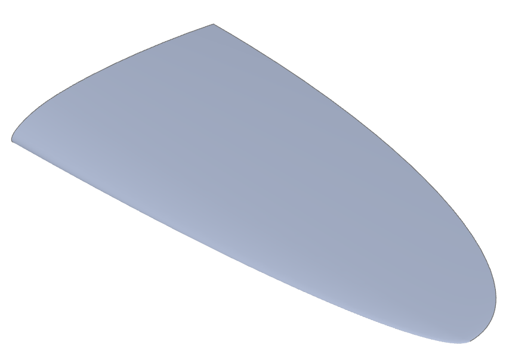

Tips for robust Gordon surfaces

• Ensure each profile intersects each guide once and only once

• Keep the curve network coherent (no duplicated or missing intersections)

• When possible, reuse the same Edge objects across adjacent faces

Complete listing

For convenience, here is the full script in one block:

```python
from build123d import *
from ocp_vscode import show
```

```python
wing_span = 36 * FT + 10 * IN
```

<!-- PDF page 233 -->

```python
                                                                      (continued from previous page)
wing_leading = 2.5 * FT
wing_trailing = wing_span / 4 - wing_leading
wing_leading_fraction = wing_leading / (wing_leading + wing_trailing)
wing_tip_section = wing_span / 2 - 1 * IN  # distance from root to last section
```

```python
# Create leading and trailing edges
leading_edge = EllipticalCenterArc(
    (0, 0), wing_span / 2, wing_leading, start_angle=270, end_angle=360
)
trailing_edge = EllipticalCenterArc(
    (0, 0), wing_span / 2, wing_trailing, start_angle=0, end_angle=90
)
```

```python
# [AirfoilSizes]
# Calculate the airfoil sizes from the leading/trailing edges
airfoil_sizes = []
for i in [0, 1]:
    tip_axis = Axis(i * (wing_tip_section, 0, 0), (0, 1, 0))
    leading_pnt = leading_edge.intersect(tip_axis)[0]
    trailing_pnt = trailing_edge.intersect(tip_axis)[0]
    airfoil_sizes.append(trailing_pnt.Y - leading_pnt.Y)
```

```python
# [Airfoils]
# Create the root and tip airfoils - note that they are different NACA profiles
airfoil_root = Plane.YZ * scale(
```

```python
    Airfoil("2213").translate((-wing_leading_fraction, 0, 0)), airfoil_sizes[0]
)
airfoil_tip = (
```

```python
    Plane.YZ
    * Pos(Z=wing_tip_section)
    * scale(Airfoil("2205").translate((-wing_leading_fraction, 0, 0)), airfoil_sizes[1])
)
```

```python
# [Profiles]
# Create the Gordon surface profiles and guides
profiles = airfoil_root.edges() + airfoil_tip.edges()
profiles.append(leading_edge @ 1)  # wing tip
guides = [leading_edge, trailing_edge]
# Create the wing surface as a Gordon Surface
wing_surface = -Face.make_gordon_surface(profiles, guides)
# Create the root of the wing
wing_root = -Face(Wire(wing_surface.edges().filter_by(Edge.is_closed)))
```

```python
# [Solid]
# Create the wing Solid
wing = Solid(Shell([wing_surface, wing_root]))
wing.color = 0x99A3B9  # Azure Blue
```

```python
show(wing)
```


<!-- END tutorial_spitfire_wing_gordon.md -->


<!-- BEGIN tech_drawing_tutorial.md -->

---
title: "Technical Drawing Tutorial"
source_html: "https://build123d.readthedocs.io/en/latest/tech_drawing_tutorial.html"
extracted_from: "official ReadTheDocs PDF"
pdf_release: "0.11.1.dev21+gbbce3cdd6"
pdf_pages: "234-237"
generated_on: "2026-07-01"
---

# Technical Drawing Tutorial

> Converted to Markdown from the official build123d ReadTheDocs PDF. PDF page markers and local extracted-image links are included for traceability. Some line wrapping reflects the PDF layout.
<!-- PDF page 234 -->

1.9.10 Technical Drawing Tutorial

This example demonstrates how to generate a standard technical drawing of a 3D part using build123d. It creates
orthographic and isometric views of a Nema 23 stepper motor and exports the result as an SVG file suitable for printing
or inspection.

Overview

A technical drawing represents a 3D object in 2D using a series of standardized views. These include:

• Plan (Top View) – as seen from directly above (Z-axis down)

• Front Elevation – looking at the object head-on (Y-axis forward)

• Side Elevation (Right Side) – viewed from the right (X-axis)

• Isometric Projection – a 3D perspective view to help visualize depth

Each view is aligned to a position on the page and optionally scaled or annotated.

How It Works

The script uses the project_to_viewport method to project the 3D part geometry into 2D. A helper function,
project_to_2d, sets up the viewport (camera origin and up direction) and places the result onto a virtual drawing sheet.

The steps involved are:

1. Load or construct a 3D part (in this case, a stepper motor).

2. Define a TechnicalDrawing border and title block using A4 page size.

3. Generate each of the standard views and apply transformations to place them.

4. Add dimensions using ExtensionLine and labels using Text.

5. Export the drawing using ExportSVG, separating visible and hidden edges by layer and style.

Result

Try It Yourself

You can modify the script to:

• Replace the part with your own Part model

• Adjust camera angles and scale

• Add other views (bottom, rear)

• Enhance with more labels and dimensions

Code

```python
from datetime import date
```

```python
from bd_warehouse.open_builds import StepperMotor
from build123d import *
from ocp_vscode import show
```

```python
def project_to_2d(
```

<!-- PDF page 235 -->

```python
                                                                      (continued from previous page)
    part: Part,
    viewport_origin: VectorLike,
    viewport_up: VectorLike,
    page_origin: VectorLike,
    scale_factor: float = 1.0,
) -> tuple[ShapeList[Edge], ShapeList[Edge]]:
```

```python
    """project_to_2d
```

```python
    Helper function to generate 2d views translated on the 2d page.
```

```python
    Args:
```

```python
        part (Part): 3d object
        viewport_origin (VectorLike): location of viewport
        viewport_up (VectorLike): direction of the viewport Y axis
        page_origin (VectorLike): center of 2d object on page
        scale_factor (float, optional): part scalar. Defaults to 1.0.
```

```python
    Returns:
```

```python
        tuple[ShapeList[Edge], ShapeList[Edge]]: visible & hidden edges
    """
    scaled_part = part if scale_factor == 1.0 else scale(part, scale_factor)
    visible, hidden = scaled_part.project_to_viewport(
        viewport_origin, viewport_up, look_at=(0, 0, 0)
    )
    visible = [Pos(*page_origin) * e for e in visible]
    hidden = [Pos(*page_origin) * e for e in hidden]
```

```python
    return ShapeList(visible), ShapeList(hidden)
```

```python
# The object that appearing in the drawing
stepper: Part = StepperMotor("Nema23")
```

```python
# Create a standard technical drawing border on A4 paper
border = TechnicalDrawing(
    designed_by="build123d",
    design_date=date.fromisoformat("2025-05-23"),
    page_size=PageSize.A4,
    title="Nema 23 Stepper",
    sub_title="Units: mm",
    drawing_number="BD-1",
    sheet_number=1,
    drawing_scale=1,
)
page_size = border.bounding_box().size
```

```python
# Specify the drafting options for extension lines
drafting_options = Draft(font_size=3.5, decimal_precision=1, display_units=False)
```

```python
# Lists used to store the 2d visible and hidden lines
visible_lines, hidden_lines = [], []
```

<!-- PDF page 236 -->

```python
                                                                      (continued from previous page)
# Isometric Projection - A 3D view where the part is rotated to reveal three
# dimensions equally.
iso_v, iso_h = project_to_2d(
    stepper,
    (100, 100, 100),
    (0, 0, 1),
    page_size * 0.3,
    0.75,
)
visible_lines.extend(iso_v)
hidden_lines.extend(iso_h)
```

```python
# Plan View (Top) - The view from directly above the part (looking down along
# the Z-axis).
vis, _ = project_to_2d(
    stepper,
    (0, 0, 100),
    (0, 1, 0),
    (page_size.X * -0.3, page_size.Y * 0.25),
)
visible_lines.extend(vis)
```

```python
# Dimension the top of the stepper
top_bbox = Curve(vis).bounding_box()
perimeter = Pos(*top_bbox.center()) * Rectangle(top_bbox.size.X, top_bbox.size.Y)
d1 = ExtensionLine(
    border=perimeter.edges().sort_by(Axis.X)[-1], offset=1 * CM, draft=drafting_options
)
d2 = ExtensionLine(
    border=perimeter.edges().sort_by(Axis.Y)[0], offset=1 * CM, draft=drafting_options
)
# Add a label
l1 = Text("Plan View", 6)
l1.position = vis.sort_by(Axis.Y)[-1].center() + (0, 5 * MM)
```

```python
# Front Elevation - The primary view, typically looking along the Y-axis,
# showing the height.
vis, _ = project_to_2d(
    stepper,
    (0, -100, 0),
    (0, 0, 1),
    (page_size.X * -0.3, page_size.Y * -0.125),
)
visible_lines.extend(vis)
d3 = ExtensionLine(
    border=vis.sort_by(Axis.Y)[-1], offset=-5 * MM, draft=drafting_options
)
l2 = Text("Front Elevation", 6)
l2.position = vis.group_by(Axis.Y)[0].sort_by(Edge.length)[-1].center() + (0, -5 * MM)
```

```python
# Side Elevation - Often refers to the Right Side View, looking along the X-axis.
vis, _ = project_to_2d(
```

<!-- PDF page 237 -->

```python
                                                                      (continued from previous page)
    stepper,
    (100, 0, 0),
    (0, 0, 1),
    (0, page_size.Y * 0.15),
)
visible_lines.extend(vis)
side_bbox = Curve(vis).bounding_box()
shaft_top_corner = vis.edges().sort_by(Axis.Y)[-1].vertices().sort_by(Axis.X)[-1]
body_bottom_corner = (side_bbox.max.X, side_bbox.min.Y)
d4 = ExtensionLine(
    border=(shaft_top_corner, body_bottom_corner),
    offset=-(side_bbox.max.X - shaft_top_corner.X) - 1 * CM,  # offset to outside view.
    measurement_direction=(0, 1, 0),
    draft=drafting_options,
)
l3 = Text("Side Elevation", 6)
l3.position = vis.group_by(Axis.Y)[0].sort_by(Edge.length)[-1].center() + (0, -5 * MM)
```

```python
# Initialize the SVG exporter
exporter = ExportSVG(unit=Unit.MM)
# Define visible and hidden line layers
exporter.add_layer("Visible")
exporter.add_layer("Hidden", line_color=(99, 99, 99), line_type=LineType.ISO_DOT)
# Add the objects to the appropriate layer
exporter.add_shape(visible_lines, layer="Visible")
exporter.add_shape(hidden_lines, layer="Hidden")
exporter.add_shape(border, layer="Visible")
exporter.add_shape([d1, d2, d3, d4], layer="Visible")
exporter.add_shape([l1, l2, l3], layer="Visible")
# Write the file
exporter.write(f"assets/stepper_drawing.svg")
```

```python
show(border, visible_lines, d1, d2, d3, d4, l1, l2, l3)
```

Dependencies

This example depends on the following packages:

• build123d

• bd_warehouse (for the StepperMotor part)

• ocp_vscode (for local preview)


<!-- END tech_drawing_tutorial.md -->


<!-- BEGIN objects.md -->

---
title: "Objects"
source_html: "https://build123d.readthedocs.io/en/latest/objects.html"
extracted_from: "official ReadTheDocs PDF"
pdf_release: "0.11.1.dev21+gbbce3cdd6"
pdf_pages: "237-274"
generated_on: "2026-07-01"
---

# Objects

> Converted to Markdown from the official build123d ReadTheDocs PDF. PDF page markers and local extracted-image links are included for traceability. Some line wrapping reflects the PDF layout.
<!-- PDF page 237 -->

1.10 Objects

Objects are Python classes that take parameters as inputs and create 1D, 2D or 3D Shapes. For example, a Torus is
defined by a major and minor radii. In Builder mode, objects are positioned with Locations while in Algebra mode,
objects are positioned with the * operator and shown in these examples:

```python
with BuildPart() as disk:
```

```python
    with BuildSketch():
```

<!-- PDF page 238 -->

```python
                                                                      (continued from previous page)
        Circle(a)
        with Locations((b, 0.0)):
```

```python
            Rectangle(c, c, mode=Mode.SUBTRACT)
        with Locations((0, b)):
```

```python
            Circle(d, mode=Mode.SUBTRACT)
    extrude(amount=c)
```

```python
sketch = Circle(a) - Pos(b, 0.0) * Rectangle(c, c) - Pos(0.0, b) * Circle(d)
disk = extrude(sketch, c)
```

The following sections describe the 1D, 2D and 3D objects:

1.10.1 Align

2D/Sketch and 3D/Part objects can be aligned relative to themselves, either centered, or justified right or left of each
Axis. The following diagram shows how this alignment works in 2D:

For example:

```python
with BuildSketch():
```

```python
    Circle(1, align=(Align.MIN, Align.MIN))
```

creates a circle who’s minimal X and Y values are on the X and Y axis and is located in the top right corner. The Align
enum has values: MIN, CENTER and MAX.

In 3D the align parameter also contains a Z align value but otherwise works in the same way.

Note that the align will also accept a single Align value which will be used on all axes - as shown here:

```python
with BuildSketch():
```

```python
    Circle(1, align=Align.MIN)
```

1.10.2 Mode

With the Builder API the mode parameter controls how objects are combined with lines, sketches, or parts under
construction. The Mode enum has values:

• ADD: fuse this object to the object under construction

• SUBTRACT: cut this object from the object under construction

• INTERSECT: intersect this object with the object under construction

• REPLACE: replace the object under construction with this object

• PRIVATE: don’t interact with the object under construction at all

The Algebra API doesn’t use the mode parameter - users combine objects with operators.

1.10.3 1D Objects

The following objects all can be used in BuildLine contexts. Note that 1D objects are not affected by Locations in
Builder mode.

```python
Airfoil
```

Airfoil described by 4 digit NACA profile

<!-- PDF page 239 -->

```python
Bezier
```

Curve defined by control points and weights

```python
BlendCurve
```

Curve blending curvature of two curves

```python
BSpline
```

B-spline from control points and knot data

```python
CenterArc
```

Arc defined by center, radius, & angles

```python
ConstrainedArcs
```

Arc(s) constrained by other geometric objects

```python
ConstrainedLines
```

Line(s) constrained by other geometric objects

```python
DoubleTangentArc
```

Arc defined by point/tangent pair & other curve

```python
EllipticalCenterArc
```

Elliptical arc defined by center, radii & angles

```python
EllipticalStartArc
```

Elliptical arc defined by start, tangent, radii & angles

```python
ParabolicCenterArc
```

Parabolic arc defined by vertex, focal length & angles

```python
HyperbolicCenterArc
```

Hyperbolic arc defined by center, radii & angles

```python
FilletPolyline
```

Polyline with filleted corners defined by pts and radius

```python
Helix
```

Helix defined pitch, radius and height

```python
IntersectingLine
```

Intersecting line defined by start, direction & other line

```python
JernArc
```

Arc define by start point, tangent, radius and angle

```python
Line
```

Line defined by end points

```python
PolarLine
```

Line defined by start, angle and length

```python
Polyline
```

Multiple line segments defined by points

<!-- PDF page 240 -->

```python
RadiusArc
```

Arc defined by two points and a radius

```python
SagittaArc
```

Arc defined by two points and a sagitta

```python
Spline
```

Curve define by points

```python
TangentArc
```

Arc defined by two points and a tangent

```python
ThreePointArc
```

Arc defined by three points

```python
ArcArcTangentLine
```

Line tangent defined by two arcs

```python
ArcArcTangentArc
```

Arc tangent defined by two arcs

```python
PointArcTangentLine
```

Line tangent defined by a point and arc

```python
PointArcTangentArc
```

Arc tangent defined by a point, direction, and arc

Reference

class BaseLineObject(curve: ~build123d.topology.one_d.Wire, mode: ~build123d.build_enums.Mode =
<Mode.ADD>)

BaseLineObject specialized for Wire.

Parameters

• curve (Wire) – wire to create

• mode (Mode, optional) – combination mode. Defaults to Mode.ADD

class Airfoil(airfoil_code: str, n_points: int = 50, finite_te: bool = False, mode:
~build123d.build_enums.Mode = <Mode.ADD>)

Create an airfoil described by a 4-digit (or fractional) NACA airfoil (e.g. ‘2412’ or ‘2213.323’).

The NACA four-digit wing sections define the airfoil_code by: - First digit describing maximum camber as
percentage of the chord. - Second digit describing the distance of maximum camber from the airfoil leading
edge in tenths of the chord. - Last two digits describing maximum thickness of the airfoil as percent of the chord.

Parameters

• airfoil_code – str The NACA 4-digit (or fractional) airfoil code (e.g. ‘2213.323’).

• n_points – int Number of points per upper/lower surface.

• finite_te – bool If True, enforces a finite trailing edge (default False).

• mode (Mode, optional) – combination mode. Defaults to Mode.ADD

<!-- PDF page 241 -->

```python
     property camber_line:  Edge
```

Camber line of the airfoil as an Edge.

```python
     camber_pos:  float
```

Chordwise position of max camber (0–1)

```python
     code:  str
```

NACA code string (e.g. “2412”)

```python
     finite_te:  bool
```

If True, trailing edge is finite

```python
     max_camber:  float
```

Maximum camber as fraction of chord

static parse_naca4(value: str | float) →tuple[float, float, float]

Parse NACA 4-digit (or fractional) airfoil code into parameters.

```python
     thickness:  float
```

Maximum thickness as fraction of chord

class Bezier(*cntl_pnts: ~build123d.geometry.Vector | tuple[float, float] | tuple[float, float, float] |
~collections.abc.Sequence[float], weights: list[float] | None = None, mode:
~build123d.build_enums.Mode = <Mode.ADD>)

Line Object: Bezier Curve

Create a non-rational bezier curve defined by a sequence of points and include optional weights to create a rational
bezier curve. The number of weights must match the number of control points.

Parameters

• cntl_pnts (sequence[VectorLike]) – points defining the curve

• weights (list[float], optional) – control point weights. Defaults to None

• mode (Mode, optional) – combination mode. Defaults to Mode.ADD

class BlendCurve(curve0: ~build123d.topology.one_d.Edge, curve1: ~build123d.topology.one_d.Edge,
continuity: ~build123d.build_enums.ContinuityLevel = ContinuityLevel.C2, end_points:
tuple[~build123d.geometry.Vector | tuple[float, float] | tuple[float, float, float] |
~collections.abc.Sequence[float], ~build123d.geometry.Vector | tuple[float, float] | tuple[float,
float, float] | ~collections.abc.Sequence[float]] | None = None, tangent_scalars: tuple[float,
float] | None = None, mode: ~build123d.build_enums.Mode = <Mode.ADD>)

Line Object: BlendCurve

Create a smooth Bézier-based transition curve between two existing edges.

The blend is constructed as a cubic (C1) or quintic (C2) Bézier curve whose control points are determined from
the position, first derivative, and (for C2) second derivative of the input curves at the chosen endpoints. Optional
scalar multipliers can be applied to the endpoint tangents to control the “tension” of the blend.

Parameters

• curve0 (Edge) – First curve to blend from.

• curve1 (Edge) – Second curve to blend to.

• continuity (ContinuityLevel, optional) – Desired geometric continuity at the join:
- ContinuityLevel.C0: position match only (straight line) - ContinuityLevel.C1: match posi-
tion and tangent direction (cubic Bézier) - ContinuityLevel.C2: match position, tangent, and
curvature (quintic Bézier) Defaults to ContinuityLevel.C2.

<!-- PDF page 242 -->

• end_points (tuple[VectorLike, VectorLike] | None, optional) – Pair of points
specifying the connection points on curve0 and curve1. Each must coincide (within TOL-
ERANCE) with the start or end of the respective curve. If None, the closest pair of endpoints
is chosen. Defaults to None.

• tangent_scalars (tuple[float, float] | None, optional) – Scalar multipliers
applied to the first derivatives at the start of curve0 and the end of curve1 before computing
control points. Useful for adjusting the pull/tension of the blend without altering the base
curves. Defaults to (1.0, 1.0).

• mode (Mode, optional) – Boolean operation mode when used in a BuildLine context.
Defaults to Mode.ADD.

Raises

• ValueError – tangent_scalars must be a pair of float values.

• ValueError – If specified end_points are not coincident with the start or end of their re-
spective curves.

Example

```python
     >>> blend = BlendCurve(curve_a, curve_b, ContinuityLevel.C1, tangent_scalars=(1.2,␣
```

```python
     ˓→0.8))
     >>> show(blend)
```

class BSpline(control_points: ~collections.abc.Iterable[~build123d.geometry.Vector | tuple[float, float] |
tuple[float, float, float] | ~collections.abc.Sequence[float]], knots: ~collections.abc.Iterable[float],
degree: int, weights: ~collections.abc.Iterable[float] | None = None, periodic: bool = False,
mode: ~build123d.build_enums.Mode = <Mode.ADD>)

Line Object: BSpline

An exact B-spline edge defined directly from control points and knot data.

BSpline creates an exact B-spline from control points, a knot sequence, and optional weights. Control points
define the control polygon that pulls the curve, but the curve does not generally pass through them. Knots define
the parameter-space structure of the spline: they determine where polynomial spans begin and end and how
smoothly those spans join. Repeated knot values indicate knot multiplicity. For a spline of degree p, a knot with
multiplicity m has continuity C^(p-m) at that location, so increasing multiplicity reduces smoothness. Repeating
the first and last knots degree + 1 times creates a clamped spline that starts and ends at the first and last control
points. Optional weights create a rational B-spline, allowing some control points to pull more strongly than
others and enabling exact representation of conic sections.`

Unlike Spline, which creates an interpolated curve through a set of points using GeomAPI_Interpolate,
BSpline preserves the supplied spline definition by building the underlying OCCT Geom_BSplineCurve from
its poles, knot vector, optional weights, degree, and periodic flag.

Parameters

• control_points (Iterable[VectorLike]) – Control points (poles) defining the spline
shape. These are not generally points on the curve.

• knots (Iterable[float]) – Knot sequence for the spline. Repeated knot values are al-
lowed and are converted internally into unique knot values plus multiplicities as required by
OCCT.

• degree (int) – Polynomial degree of the spline.

• weights (Iterable[float] | None, optional) – Optional per-control-point weights
for rational B-splines. If omitted, the spline is non-rational.

<!-- PDF page 243 -->

• periodic (bool, optional) – Whether to create a periodic spline. Defaults to False.

• mode (Mode, optional) – Builder combination mode. Defaults to Mode.ADD.

class CenterArc(center: ~build123d.geometry.Vector | tuple[float, float] | tuple[float, float, float] |
~collections.abc.Sequence[float], radius: float, start_angle: float, arc_size: float |
~build123d.topology.shape_core.Shape | ~build123d.geometry.Axis |
~build123d.geometry.Location | ~build123d.geometry.Plane | ~build123d.geometry.Vector |
tuple[float, float] | tuple[float, float, float] | ~collections.abc.Sequence[float], mode:
~build123d.build_enums.Mode = <Mode.ADD>)

Line Object: Center Arc

Create a circular arc defined by a center point and radius.

Parameters

• center (VectorLike) – center point of arc

• radius (float) – arc radius

• start_angle (float) – arc starting angle from x-axis

```python
              • arc_size (float | Shape | Axis | Location | Plane | VectorLike) – angular
                size of arc or an arc limit.
```

When a limit object is provided instead of a numeric angular size, CenterArc constructs the
valid arc(s) from the given start point, trims them at their first intersection with the limit, and
returns the one requiring the shortest travel from the start. Therefore, one can only generate
arcs < 180° using a limit. If neither valid arc intersects the limit, a ValueError is raised.

• mode (Mode, optional) – combination mode. Defaults to Mode.ADD

class ConstrainedArcs(tangency_one: tuple[Axis | Edge, Tangency] | Axis | Edge | Vertex | Vector | tuple[float,
float] | tuple[float, float, float] | Sequence[float], tangency_two: tuple[Axis | Edge,
Tangency] | Axis | Edge | Vertex | Vector | tuple[float, float] | tuple[float, float, float] |
Sequence[float], *, radius: float, sagitta: Sagitta = Sagitta.SHORT, selector:
Callable[[ShapeList[Edge]], Edge | ShapeList[Edge]] = lambda arcs: ..., mode: Mode
= Mode.ADD)

class ConstrainedArcs(tangency_one: tuple[Axis | Edge, Tangency] | Axis | Edge | Vertex | Vector | tuple[float,
float] | tuple[float, float, float] | Sequence[float], tangency_two: tuple[Axis | Edge,
Tangency] | Axis | Edge | Vertex | Vector | tuple[float, float] | tuple[float, float, float] |
Sequence[float], *, center_on: Axis | Edge, sagitta: Sagitta = Sagitta.SHORT, selector:
Callable[[ShapeList[Edge]], Edge | ShapeList[Edge]] = lambda arcs: ..., mode: Mode
= Mode.ADD)

class ConstrainedArcs(tangency_one: tuple[Axis | Edge, Tangency] | Axis | Edge | Vertex | Vector | tuple[float,
float] | tuple[float, float, float] | Sequence[float], tangency_two: tuple[Axis | Edge,
Tangency] | Axis | Edge | Vertex | Vector | tuple[float, float] | tuple[float, float, float] |
Sequence[float], tangency_three: tuple[Axis | Edge, Tangency] | Axis | Edge | Vertex |
Vector | tuple[float, float] | tuple[float, float, float] | Sequence[float], *, sagitta: Sagitta
= Sagitta.SHORT, selector: Callable[[ShapeList[Edge]], Edge | ShapeList[Edge]] =
lambda arcs: ..., mode: Mode = Mode.ADD)

class ConstrainedArcs(tangency_one: tuple[Axis | Edge, Tangency] | Axis | Edge | Vertex | Vector | tuple[float,
float] | tuple[float, float, float] | Sequence[float], *, center: Vector | tuple[float, float] |
tuple[float, float, float] | Sequence[float], selector: Callable[[ShapeList[Edge]], Edge |
ShapeList[Edge]] = lambda arcs: ..., mode: Mode = Mode.ADD)

class ConstrainedArcs(tangency_one: tuple[Axis | Edge, Tangency] | Axis | Edge | Vertex | Vector | tuple[float,
float] | tuple[float, float, float] | Sequence[float], *, radius: float, center_on: Edge,
selector: Callable[[ShapeList[Edge]], Edge | ShapeList[Edge]] = lambda arcs: ...,
mode: Mode = Mode.ADD)

<!-- PDF page 244 -->

Line Object: Arc(s) constrained by other geometric objects.

The result is always a Curve containing one or more Edges. If you need to access Edge-specific properties or
methods (such as arc_center), extract the edge or edges first:

```python
     result = ConstrainedArcs(...)
     arc = result.edge()           # extract the Edge
     center = arc.arc_center       # now Edge methods are available
```

Note that in Builder mode the selector parameter must be provided or all results will be combined into the
BuildLine context. In Algebra mode the selector can be applied as a parameter or in the normal way to the
ConstrainedArcs object. The content of the selector is the same in both cases.

Examples

An arc built from three edge constraints.

Algebra:

```python
     l4 = PolarLine((0, 0), 4, 60)
     l5 = PolarLine((0, 0), 4, 40)
     a3 = CenterArc((0, 0), 4, 0, 90)
     ex_a3 = (
         ConstrainedArcs(l4, l5, a3, sagitta=Sagitta.BOTH).edges().sort_by(Edge.
```

```python
     ˓→length)[0]
     )
```

Builder:

```python
     with BuildLine() as arc_ex3:
         l4 = PolarLine((0, 0), 4, 60)
         l5 = PolarLine((0, 0), 4, 40)
         a3 = CenterArc((0, 0), 4, 0, 90)
         ex_a3 = ConstrainedArcs(
             l4,
             l5,
             a3,
             sagitta=Sagitta.BOTH,
             selector=lambda arcs: arcs.sort_by(Edge.length)[0],
         )
```

class ConstrainedLines(tangency_one: tuple[Edge, Tangency] | Axis | Edge, tangency_two: tuple[Edge,
Tangency] | Axis | Edge, *, selector: Callable[[ShapeList[Edge]], Edge |
ShapeList[Edge]] = lambda lines: ..., mode: Mode = Mode.ADD)

class ConstrainedLines(tangency_one: tuple[Edge, Tangency] | Edge, tangency_two: Vector | tuple[float, float]
| tuple[float, float, float] | Sequence[float], *, selector: Callable[[ShapeList[Edge]],
Edge | ShapeList[Edge]] = lambda lines: ..., mode: Mode = Mode.ADD)

class ConstrainedLines(tangency_one: tuple[Edge, Tangency] | Edge, tangency_two: Axis, *, angle: float |
None = None, direction: Vector | tuple[float, float] | tuple[float, float, float] |
Sequence[float] | None = None, selector: Callable[[ShapeList[Edge]], Edge |
ShapeList[Edge]] = lambda lines: ..., mode: Mode = Mode.ADD)

Line Object: Lines(s) constrained by other geometric objects.

The result is always a Curve containing one or more Edges. If you need to access Edge-specific properties or
methods (such as length), extract the edge or edges first:

<!-- PDF page 245 -->

```python
     result = ConstrainedLines(...)
     lines = result.edges()      # extract the Edges
     length = lines[1].length    # now Edge methods are available
```

Note that in Builder mode the selector parameter must be provided or all results will be combined into the
BuildLine context. In Algebra mode the selector can be applied as a parameter or in the normal way to the
ConstrainedArcs object. The content of the selector is the same in both cases.

class DoubleTangentArc(pnt: ~build123d.geometry.Vector | tuple[float, float] | tuple[float, float, float] |
~collections.abc.Sequence[float], tangent: ~build123d.geometry.Vector | tuple[float,
float] | tuple[float, float, float] | ~collections.abc.Sequence[float], other:
~build123d.topology.composite.Curve | ~build123d.topology.one_d.Edge |
~build123d.topology.one_d.Wire, keep: ~build123d.build_enums.Keep =
<Keep.TOP>, mode: ~build123d.build_enums.Mode = <Mode.ADD>)

Line Object: Double Tangent Arc

Create a circular arc defined by a point/tangent pair and another line find a tangent to.

The arc specified with TOP or BOTTOM depends on the geometry and isn’t predictable.

Contains a solver.

Parameters

• pnt (VectorLike) – start point

• tangent (VectorLike) – tangent at start point

```python
              • other (Curve | Edge | Wire) – line object to tangent
```

• keep (Keep, optional) – specify which arc if more than one, TOP or BOTTOM. Defaults
to Keep.TOP

• mode (Mode, optional) – combination mode. Defaults to Mode.ADD

Raises

RunTimeError – no double tangent arcs found

class EllipticalCenterArc(center: ~build123d.geometry.Vector | tuple[float, float] | tuple[float, float, float] |
~collections.abc.Sequence[float], x_radius: float, y_radius: float, start_angle:
float = 0.0, end_angle: float | None = None, *, arc_size: float |
~build123d.topology.shape_core.Shape | ~build123d.geometry.Axis |
~build123d.geometry.Location | ~build123d.geometry.Plane |
~build123d.geometry.Vector | tuple[float, float] | tuple[float, float, float] |
~collections.abc.Sequence[float] = 90.0, rotation: float = 0.0, angular_direction:
~build123d.build_enums.AngularDirection | None = None, mode:
~build123d.build_enums.Mode = <Mode.ADD>)

Line Object: Elliptical Center Arc

Create an elliptical arc defined by a center point, x- and y- radii.

Parameters

• center (VectorLike) – ellipse center

• x_radius (float) – x radius of the ellipse (along the x-axis of plane)

• y_radius (float) – y radius of the ellipse (along the y-axis of plane)

• start_angle (float, optional) – arc start angle from x-axis. Defaults to 0.0

• end_angle (float | None) – arc end angle from x-axis. Defaults to None

<!-- PDF page 246 -->

```python
              • arc_size (float | Shape | Axis | Location | Plane | VectorLike) – angular
                size of arc (negative to change direction) or an arc limit.
```

When a limit object is provided instead of a numeric angular size, EllipticalCenterArc con-
structs the valid arc(s) from the given start point, trims them at their first intersection with
the limit, and returns the one requiring the shortest travel from the start. Therefore, one can
only generate arcs < 180° using a limit. If neither valid arc intersects the limit, a ValueError
is raised.

• rotation (float, optional) – angle to rotate arc. Defaults to 0.0

• angular_direction (AngularDirection | None) – arc direction. Defaults to None.

• mode (Mode, optional) – combination mode. Defaults to Mode.ADD

class EllipticalStartArc(start_pnt: ~build123d.geometry.Vector | tuple[float, float] | tuple[float, float, float] |
~collections.abc.Sequence[float], start_tangent: ~build123d.geometry.Vector |
tuple[float, float] | tuple[float, float, float] | ~collections.abc.Sequence[float],
x_radius: float, y_radius: float, arc_size: float, *, start_angle: float | None = None,
major_axis_dir: ~build123d.geometry.Vector | tuple[float, float] | tuple[float, float,
float] | ~collections.abc.Sequence[float] | None = None, mode:
~build123d.build_enums.Mode = <Mode.ADD>)

Line Object: EllipticalStartArc

Create a circular arc defined by a start point/tangent pair, radius and arc size.

Parameters

• start_pnt (VectorLike) – start point

• start_tangent (VectorLike) – tangent at start point

• x_radius (float) – x radius of the ellipse (along the x-axis of plane)

• y_radius (float) – y radius of the ellipse (along the y-axis of plane)

• arc_size (float) – angular size of arc (negative to change direction)

• start_angle (float) – angular position of the start point

• major_axis_dir (VectorLike) – direction of ellipse x-axis

• mode (Mode, optional) – combination mode. Defaults to Mode.ADD

Note

One of start_angle or major_axis_dir must be provided.

class ParabolicCenterArc(vertex: ~build123d.geometry.Vector | tuple[float, float] | tuple[float, float, float] |
~collections.abc.Sequence[float], focal_length: float, start_angle: float = 0.0,
end_angle: float | None = None, *, arc_size: float |
~build123d.topology.shape_core.Shape | ~build123d.geometry.Axis |
~build123d.geometry.Location | ~build123d.geometry.Plane |
~build123d.geometry.Vector | tuple[float, float] | tuple[float, float, float] |
~collections.abc.Sequence[float] = 90.0, rotation: float = 0.0, angular_direction:
~build123d.build_enums.AngularDirection | None = None, mode:
~build123d.build_enums.Mode = <Mode.ADD>)

Line Object: Parabolic Center Arc

Create a parabolic arc defined by a vertex point and focal length (distance from focus to vertex).

<!-- PDF page 247 -->

Parameters

• vertex (VectorLike) – parabola vertex

• focal_length (float) – focal length the parabola (distance from the vertex to focus along
the x-axis of plane)

• start_angle (float, optional) – arc start angle. Defaults to 0.0

• end_angle (float | None, optional) – arc end angle. Defaults to None

```python
              • arc_size (float | Shape | Axis | Location | Plane | VectorLike) – angular
                size of arc (negative to change direction) or an arc limit.
```

When a limit object is provided instead of a numeric angular size, ParabolicCenterArc con-
structs candidate arcs from the given start point, trims them at their first intersection with
the limit, and returns the one requiring the shortest travel from the start. If neither valid arc
intersects the limit, a ValueError is raised.

• rotation (float, optional) – angle to rotate arc. Defaults to 0.0

• angular_direction (AngularDirection | None, optional) – arc direction. De-
faults to None

• mode (Mode, optional) – combination mode. Defaults to Mode.ADD

class HyperbolicCenterArc(center: ~build123d.geometry.Vector | tuple[float, float] | tuple[float, float, float] |
~collections.abc.Sequence[float], x_radius: float, y_radius: float, start_angle:
float = 0.0, end_angle: float | None = None, *, arc_size: float |
~build123d.topology.shape_core.Shape | ~build123d.geometry.Axis |
~build123d.geometry.Location | ~build123d.geometry.Plane |
~build123d.geometry.Vector | tuple[float, float] | tuple[float, float, float] |
~collections.abc.Sequence[float] = 90.0, rotation: float = 0.0, angular_direction:
~build123d.build_enums.AngularDirection | None = None, mode:
~build123d.build_enums.Mode = <Mode.ADD>)

Line Object: Hyperbolic Center Arc

Create a hyperbolic arc defined by a center point and focal length (distance from focus to vertex).

Parameters

• center (VectorLike) – hyperbola center

• x_radius (float) – x radius of the ellipse (along the x-axis of plane)

• y_radius (float) – y radius of the ellipse (along the y-axis of plane)

• start_angle (float, optional) – arc start angle from x-axis. Defaults to 0.0

• end_angle (float | None, optional) – arc end angle from x-axis. Defaults to None

```python
              • arc_size (float | Shape | Axis | Location | Plane | VectorLike) – angular
                size of arc (negative to change direction) or an arc limit.
```

When a limit object is provided instead of a numeric angular size, HyperbolicCenterArc
constructs candidate arcs from the given start point, trims them at their first intersection with
the limit, and returns the one requiring the shortest travel from the start. If neither valid arc
intersects the limit, a ValueError is raised.

• rotation (float, optional) – angle to rotate arc. Defaults to 0.0

• angular_direction (AngularDirection | None, optional) – arc direction. De-
faults to None

• mode (Mode, optional) – combination mode. Defaults to Mode.ADD

<!-- PDF page 248 -->

class FilletPolyline(*pts: ~build123d.geometry.Vector | tuple[float, float] | tuple[float, float, float] |
~collections.abc.Sequence[float] | ~collections.abc.Iterable[~build123d.geometry.Vector
| tuple[float, float] | tuple[float, float, float] | ~collections.abc.Sequence[float]], radius:
float | ~collections.abc.Iterable[float], close: bool = False, mode:
~build123d.build_enums.Mode = <Mode.ADD>)

Line Object: Fillet Polyline Create a sequence of straight lines defined by successive points that are filleted to a
given radius.

Parameters

• pts (VectorLike | Iterable[VectorLike]) – sequence of two or more points

• radius (float | Iterable[float]) – radius to fillet at each vertex or a single value for
all vertices. A radius of 0 will create a sharp corner (vertex without fillet).

• close (bool, optional) – close end points with extra Edge and corner fillets. Defaults
to False

• mode (Mode, optional) – combination mode. Defaults to Mode.ADD

Raises

• ValueError – Two or more points not provided

• ValueError – radius must be non-negative

class Helix(pitch: float, height: float, radius: float, center: ~build123d.geometry.Vector | tuple[float, float] |
tuple[float, float, float] | ~collections.abc.Sequence[float] = (0, 0, 0), direction:
~build123d.geometry.Vector | tuple[float, float] | tuple[float, float, float] |
~collections.abc.Sequence[float] = (0, 0, 1), cone_angle: float = 0, lefthand: bool = False, mode:
~build123d.build_enums.Mode = <Mode.ADD>)

Line Object: Helix

Create a helix defined by pitch, height, and radius. The helix may have a taper defined by cone_angle.

If cone_angle is not 0, radius is the initial helix radius at center. cone_angle > 0 increases the final radius.
cone_angle < 0 decreases the final radius.

Parameters

• pitch (float) – distance between loops

• height (float) – helix height

• radius (float) – helix radius

• center (VectorLike, optional) – center point. Defaults to (0, 0, 0)

• direction (VectorLike, optional) – direction of central axis. Defaults to (0, 0, 1)

• cone_angle (float, optional) – conical angle from direction. Defaults to 0

• lefthand (bool, optional) – left handed helix. Defaults to False

• mode (Mode, optional) – combination mode. Defaults to Mode.ADD

class IntersectingLine(start: ~build123d.geometry.Vector | tuple[float, float] | tuple[float, float, float] |
~collections.abc.Sequence[float], direction: ~build123d.geometry.Vector | tuple[float,
float] | tuple[float, float, float] | ~collections.abc.Sequence[float], other:
~build123d.topology.composite.Curve | ~build123d.topology.one_d.Edge |
~build123d.topology.one_d.Wire, mode: ~build123d.build_enums.Mode =
<Mode.ADD>)

<!-- PDF page 249 -->

Intersecting Line Object: Line

Create a straight line defined by a point/direction pair and another line to intersect.

Parameters

• start (VectorLike) – start point

• direction (VectorLike) – direction to make line

• other (Edge) – line object to intersect

• mode (Mode, optional) – combination mode. Defaults to Mode.ADD

class JernArc(start: ~build123d.geometry.Vector | tuple[float, float] | tuple[float, float, float] |
~collections.abc.Sequence[float], tangent: ~build123d.geometry.Vector | tuple[float, float] |
tuple[float, float, float] | ~collections.abc.Sequence[float], radius: float, arc_size: float |
~build123d.topology.shape_core.Shape | ~build123d.geometry.Axis |
~build123d.geometry.Location | ~build123d.geometry.Plane | ~build123d.geometry.Vector |
tuple[float, float] | tuple[float, float, float] | ~collections.abc.Sequence[float], mode:
~build123d.build_enums.Mode = <Mode.ADD>)

Line Object: Jern Arc

Create a circular arc defined by a start point/tangent pair, radius and arc size or arc limit.

Parameters

• start (VectorLike) – start point

• tangent (VectorLike) – tangent at start point

• radius (float) – arc radius

```python
              • arc_size (float | Shape | Axis | Location | Plane | VectorLike) – angular
                size of arc (negative to change direction) or an arc limit.
```

When a limit object is provided instead of a numeric angular size, JernArc constructs the
valid tangent arc(s) from the given start point and tangent, trims them at their first intersection
with the limit, and returns the one requiring the shortest travel from the start. If neither valid
arc intersects the limit, a ValueError is raised.

• mode (Mode, optional) – combination mode. Defaults to Mode.ADD

Variables

• start (Vector) – start point

• end_of_arc (Vector) – end point of arc

• center_point (Vector) – center of arc

class Line(*pts: ~build123d.geometry.Vector | tuple[float, float] | tuple[float, float, float] |
~collections.abc.Sequence[float] | ~collections.abc.Iterable[~build123d.geometry.Vector | tuple[float,
float] | tuple[float, float, float] | ~collections.abc.Sequence[float]], mode:
~build123d.build_enums.Mode = <Mode.ADD>)

Line Object: Line

Create a straight line defined by two points.

Parameters

• pts (VectorLike | Iterable[VectorLike]) – sequence of two points

• mode (Mode, optional) – combination mode. Defaults to Mode.ADD

<!-- PDF page 250 -->

Raises

ValueError – Two point not provided

class PolarLine(start: ~build123d.geometry.Vector | tuple[float, float] | tuple[float, float, float] |
~collections.abc.Sequence[float], length: float | ~build123d.topology.shape_core.Shape |
~build123d.geometry.Axis | ~build123d.geometry.Location | ~build123d.geometry.Plane |
~build123d.geometry.Vector | tuple[float, float] | tuple[float, float, float] |
~collections.abc.Sequence[float], angle: float | None = None, direction:
~build123d.geometry.Vector | tuple[float, float] | tuple[float, float, float] |
~collections.abc.Sequence[float] | None = None, length_mode:
~build123d.build_enums.LengthMode = <LengthMode.DIAGONAL>, mode:
~build123d.build_enums.Mode = <Mode.ADD>)

Line Object: Polar Line

Create a straight line defined by a start point, length, and angle. The length can specify the DIAGONAL, HOR-
IZONTAL, or VERTICAL component of the triangle defined by the angle.

Alternatively, the length parameter can contain a limit to the length of the line in the form of another object. If
the PolarLine doesn’t contact the limit an error will be generated.

Example

p = PolarLine(start=(2, 0), length=Axis.Y, angle=135)

Parameters

• start (VectorLike) – start point

```python
              • length (float | Shape | Axis | Location | Plane | VectorLike) – line length
                (float) or limit limit
```

• angle (float, optional) – angle from the local x-axis

• direction (VectorLike, optional) – vector direction to determine angle

• length_mode (LengthMode, optional) – how length defines the line. Defaults to
LengthMode.DIAGONAL

• mode (Mode, optional) – combination mode. Defaults to Mode.ADD

Raises

• ValueError – Either angle or direction must be provided

• ValueError – Polar line doesn’t intersect length limit

class Polyline(*pts: ~build123d.geometry.Vector | tuple[float, float] | tuple[float, float, float] |
~collections.abc.Sequence[float] | ~collections.abc.Iterable[~build123d.geometry.Vector |
tuple[float, float] | tuple[float, float, float] | ~collections.abc.Sequence[float]], close: bool =
False, mode: ~build123d.build_enums.Mode = <Mode.ADD>)

Line Object: Polyline

Create a sequence of straight lines defined by successive points.

Parameters

• pts (VectorLike | Iterable[VectorLike]) – sequence of two or more points

• close (bool, optional) – close by generating an extra Edge. Defaults to False

• mode (Mode, optional) – combination mode. Defaults to Mode.ADD

Raises

ValueError – Two or more points not provided

<!-- PDF page 251 -->

class RadiusArc(start_point: ~build123d.geometry.Vector | tuple[float, float] | tuple[float, float, float] |
~collections.abc.Sequence[float], end_point: ~build123d.geometry.Vector | tuple[float, float] |
tuple[float, float, float] | ~collections.abc.Sequence[float], radius: float, short_sagitta: bool =
True, mode: ~build123d.build_enums.Mode = <Mode.ADD>)

Line Object: Radius Arc

Create a circular arc defined by two points and a radius.

Parameters

• start_point (VectorLike) – start point

• end_point (VectorLike) – end point

• radius (float) – arc radius

• short_sagitta (bool) – If True selects the short sagitta (height of arc from chord), else
the long sagitta crossing the center. Defaults to True

• mode (Mode, optional) – combination mode. Defaults to Mode.ADD

Raises

ValueError – Insufficient radius to connect end points

class SagittaArc(start_point: ~build123d.geometry.Vector | tuple[float, float] | tuple[float, float, float] |
~collections.abc.Sequence[float], end_point: ~build123d.geometry.Vector | tuple[float, float] |
tuple[float, float, float] | ~collections.abc.Sequence[float], sagitta: float, mode:
~build123d.build_enums.Mode = <Mode.ADD>)

Line Object: Sagitta Arc

Create a circular arc defined by two points and the sagitta (height of the arc from chord).

Parameters

• start_point (VectorLike) – start point

• end_point (VectorLike) – end point

• sagitta (float) – arc height from chord between points

• mode (Mode, optional) – combination mode. Defaults to Mode.ADD

class Spline(*pts: ~build123d.geometry.Vector | tuple[float, float] | tuple[float, float, float] |
~collections.abc.Sequence[float] | ~collections.abc.Iterable[~build123d.geometry.Vector |
tuple[float, float] | tuple[float, float, float] | ~collections.abc.Sequence[float]], tangents:
~collections.abc.Iterable[~build123d.geometry.Vector | tuple[float, float] | tuple[float, float, float] |
~collections.abc.Sequence[float]] | None = None, tangent_scalars: ~collections.abc.Iterable[float] |
None = None, periodic: bool = False, mode: ~build123d.build_enums.Mode = <Mode.ADD>)

Line Object: Spline

Create a spline defined by a sequence of points, optionally constrained by tangents. Tangents and tangent scalars
must have length of 2 for only the end points or a length of the number of points.

Parameters

• pts (VectorLike | Iterable[VectorLike]) – sequence of two or more points

• tangents (Iterable[VectorLike], optional) – tangent directions. Defaults to None

• tangent_scalars (Iterable[float], optional) – tangent scales. Defaults to None

• periodic (bool, optional) – make the spline periodic (closed). Defaults to False

• mode (Mode, optional) – combination mode. Defaults to Mode.ADD

<!-- PDF page 252 -->

class TangentArc(*pts: ~build123d.geometry.Vector | tuple[float, float] | tuple[float, float, float] |
~collections.abc.Sequence[float] | ~collections.abc.Iterable[~build123d.geometry.Vector |
tuple[float, float] | tuple[float, float, float] | ~collections.abc.Sequence[float]], tangent:
~build123d.geometry.Vector | tuple[float, float] | tuple[float, float, float] |
~collections.abc.Sequence[float], tangent_from_first: bool = True, mode:
~build123d.build_enums.Mode = <Mode.ADD>)

Line Object: Tangent Arc

Create a circular arc defined by two points and a tangent.

Parameters

• pts (VectorLike | Iterable[VectorLike]) – sequence of two points

• tangent (VectorLike) – tangent to constrain arc

• tangent_from_first (bool, optional) – apply tangent to first point. Applying tangent
to end point will flip the orientation of the arc. Defaults to True

• mode (Mode, optional) – combination mode. Defaults to Mode.ADD

Raises

ValueError – Two points are required

class ThreePointArc(*pts: ~build123d.geometry.Vector | tuple[float, float] | tuple[float, float, float] |
~collections.abc.Sequence[float] | ~collections.abc.Iterable[~build123d.geometry.Vector |
tuple[float, float] | tuple[float, float, float] | ~collections.abc.Sequence[float]], mode:
~build123d.build_enums.Mode = <Mode.ADD>)

Line Object: Three Point Arc

Create a circular arc defined by three points.

Parameters

• pts (VectorLike | Iterable[VectorLike]) – sequence of three points

• mode (Mode, optional) – combination mode. Defaults to Mode.ADD

Raises

ValueError – Three points must be provided

```python
class ArcArcTangentLine(**kwargs)
```

Line Object: Arc Arc Tangent Line

Create a straight line tangent to two arcs.

Parameters

```python
              • start_arc (Curve | Edge | Wire) – starting arc, must be GeomType.CIRCLE
```

```python
              • end_arc (Curve | Edge | Wire) – ending arc, must be GeomType.CIRCLE
```

• side (Side) – side of arcs to place tangent arc center, LEFT or RIGHT. Defaults to
Side.LEFT

• keep (Keep) – which tangent arc to keep, INSIDE or OUTSIDE. Defaults to Keep.INSIDE

• mode (Mode, optional) – combination mode. Defaults to Mode.ADD

```python
class ArcArcTangentArc(**kwargs)
```

Line Object: Arc Arc Tangent Arc

Create an arc tangent to two arcs and a radius.

keep specifies tangent arc position with a Keep pair: (placement, type)

<!-- PDF page 253 -->

• placement: start_arc is tangent INSIDE or OUTSIDE the tangent arc. BOTH is a special case for overlap-
ping arcs with type INSIDE

• type: tangent arc is INSIDE or OUTSIDE start_arc and end_arc

Parameters

```python
              • start_arc (Curve | Edge | Wire) – starting arc, must be GeomType.CIRCLE
```

```python
              • end_arc (Curve | Edge | Wire) – ending arc, must be GeomType.CIRCLE
```

• radius (float) – radius of tangent arc

• side (Side) – side of arcs to place tangent arc center, LEFT or RIGHT. Defaults to
Side.LEFT

```python
              • keep (Keep | tuple[Keep, Keep]) – which tangent arc to keep, INSIDE or OUTSIDE.
                Defaults to (Keep.INSIDE, Keep.INSIDE)
```

• short_sagitta (bool) – If True selects the short sagitta (height of arc from chord), else
the long sagitta crossing the center. Defaults to True

• mode (Mode, optional) – combination mode. Defaults to Mode.ADD


```python
class PointArcTangentLine(**kwargs)
```

Line Object: Point Arc Tangent Line

Create a straight, tangent line from a point to a circular arc.

Parameters

• point (VectorLike) – intersection point for tangent

```python
              • arc (Curve | Edge | Wire) – circular arc to tangent, must be GeomType.CIRCLE
```

<!-- PDF page 254 -->

• side (Side, optional) – side of arcs to place tangent arc center, LEFT or RIGHT. De-
faults to Side.LEFT

• mode (Mode, optional) – combination mode. Defaults to Mode.ADD

```python
class PointArcTangentArc(**kwargs)
```

Line Object: Point Arc Tangent Arc

Create an arc defined by a point/tangent pair and another line which the other end is tangent to.

Parameters

• point (VectorLike) – starting point of tangent arc

• direction (VectorLike) – direction at starting point of tangent arc

```python
              • arc (Union[Curve, Edge, Wire]) – ending arc, must be GeomType.CIRCLE
```

• side (Side, optional) – select which arc to keep Defaults to Side.LEFT

• mode (Mode, optional) – combination mode. Defaults to Mode.ADD

Raises

• ValueError – Arc must have GeomType.CIRCLE

• ValueError – Point is already tangent to arc

• RuntimeError – No tangent arc found

1.10.4 2D Objects

```python
Arrow
```

Arrow with head and path for shaft

```python
ArrowHead
```

Arrow head with multiple types

```python
Circle
```

Circle defined by radius

```python
DimensionLine
```

Dimension line

```python
Ellipse
```

Ellipse defined by major and minor radius

```python
ExtensionLine
```

Extension lines for distance or angles

```python
Polygon
```

Polygon defined by points

```python
Rectangle
```

Rectangle defined by width and height

```python
RectangleRounded
```

Rectangle with rounded corners defined by width, height, and radius

```python
RegularPolygon
```

<!-- PDF page 255 -->

RegularPolygon defined by radius and number of sides

```python
SlotArc
```

SlotArc defined by arc and height

```python
SlotCenterPoint
```

SlotCenterPoint defined by two points and a height

```python
SlotCenterToCenter
```

SlotCenterToCenter defined by center separation and height

```python
SlotOverall
```

SlotOverall defined by end-to-end length and height

```python
TechnicalDrawing
```

A technical drawing with descriptions

```python
Text
```

Text defined by string and font parameters

```python
Trapezoid
```

Trapezoid defined by width, height and interior angles

```python
Triangle
```

Triangle defined by one side & two other sides or interior angles

Reference

class BaseSketchObject(obj: ~build123d.topology.composite.Compound | ~build123d.topology.two_d.Face,
rotation: float = 0, align: ~build123d.build_enums.Align |
tuple[~build123d.build_enums.Align, ~build123d.build_enums.Align] | None = None,
mode: ~build123d.build_enums.Mode = <Mode.ADD>)

Base class for all BuildSketch objects

Parameters

• face (Face) – face to create

• rotation (float, optional) – angle to rotate object. Defaults to 0

```python
              • align (Align | tuple[Align, Align], optional) – align MIN, CENTER, or MAX
                of object. Defaults to None
```

• mode (Mode, optional) – combination mode. Defaults to Mode.ADD

class Arrow(arrow_size: float, shaft_path: ~build123d.topology.one_d.Edge | ~build123d.topology.one_d.Wire,
shaft_width: float, head_at_start: bool = True, head_type: ~build123d.build_enums.HeadType =
<HeadType.CURVED>, mode: ~build123d.build_enums.Mode = <Mode.ADD>)

Sketch Object: Arrow with shaft

Parameters

• arrow_size (float) – arrow head tip to tail length

• shaft_path (Edge | Wire) – line describing the shaft shape

• shaft_width (float) – line width of shaft

• head_at_start (bool, optional) – Defaults to True.

<!-- PDF page 256 -->

• head_type (HeadType, optional) – arrow head shape. Defaults to HeadType.CURVED.

• mode (Mode, optional) – _description_. Defaults to Mode.ADD.

class ArrowHead(size: float, head_type: ~build123d.build_enums.HeadType = <HeadType.CURVED>, rotation:
float = 0, mode: ~build123d.build_enums.Mode = <Mode.ADD>)

Sketch Object: ArrowHead

Parameters

• size (float) – tip to tail length

• head_type (HeadType, optional) – arrow head shape. Defaults to HeadType.CURVED.

• rotation (float, optional) – rotation in degrees. Defaults to 0.

• mode (Mode, optional) – combination mode. Defaults to Mode.ADD.

class Circle(radius: float, arc_size: float = 360.0, align: ~build123d.build_enums.Align |
tuple[~build123d.build_enums.Align, ~build123d.build_enums.Align] | None = (<Align.CENTER>,
<Align.CENTER>), mode: ~build123d.build_enums.Mode = <Mode.ADD>)

Sketch Object: Circle

Create a circle defined by radius.

Parameters

• radius (float) – circle radius

• arc_size (float, optional) – angular size of sector. Defaults to 360.

```python
              • align (Align | tuple[Align, Align], optional) – align MIN, CENTER, or MAX
                of object. Defaults to (Align.CENTER, Align.CENTER)
```

• mode (Mode, optional) – combination mode. Defaults to Mode.ADD

class DimensionLine(path: ~build123d.topology.one_d.Wire | ~build123d.topology.one_d.Edge |
list[~build123d.geometry.Vector | ~build123d.topology.zero_d.Vertex | tuple[float, float,
float]], draft: ~drafting.Draft, sketch: ~build123d.topology.composite.Sketch | None =
None, label: str | None = None, arrows: tuple[bool, bool] = (True, True), tolerance: float |
tuple[float, float] | None = None, label_angle: bool = False, mode:
~build123d.build_enums.Mode = <Mode.ADD>)

Sketch Object: DimensionLine

Create a dimension line typically for internal measurements. Typically used for (but not restricted to) inside
dimensions, a dimension line often as arrows on either side of a dimension or label.

There are three options depending on the size of the text and length of the dimension line: Type 1) The label
and arrows fit within the length of the path Type 2) The text fit within the path and the arrows go outside Type 3)
Neither the text nor the arrows fit within the path

Parameters

• path (PathDescriptor) – a very general type of input used to describe the path the dimen-
sion line will follow.

• draft (Draft) – instance of Draft dataclass

• sketch (Sketch) – the Sketch being created to check for possible overlaps. In builder mode
the active Sketch will be used if None is provided.

<!-- PDF page 257 -->

• label (str, optional) – a text string which will replace the length (or arc length) that
would otherwise be extracted from the provided path. Providing a label is useful when il-
lustrating a parameterized input where the name of an argument is desired not an actual
measurement. Defaults to None.

• arrows (tuple[bool, bool], optional) – a pair of boolean values controlling the
placement of the start and end arrows. Defaults to (True, True).

• tolerance (float | tuple[float, float], optional) – an optional tolerance
value to add to the extracted length value. If a single tolerance value is provided it is shown
as ± the provided value while a pair of values are shown as separate + and - values. Defaults
to None.

• label_angle (bool, optional) – a flag indicating that instead of an extracted length
value, the size of the circular arc extracted from the path should be displayed in degrees.

• mode (Mode, optional) – combination mode. Defaults to Mode.ADD.

Raises

• ValueError – Only 2 points allowed for dimension lines

• ValueError – No output - no arrows selected

```python
     dimension
```

length of the dimension

class Ellipse(x_radius: float, y_radius: float, rotation: float = 0, align: ~build123d.build_enums.Align |
tuple[~build123d.build_enums.Align, ~build123d.build_enums.Align] | None =
(<Align.CENTER>, <Align.CENTER>), mode: ~build123d.build_enums.Mode = <Mode.ADD>)

Sketch Object: Ellipse

Create an ellipse defined by x- and y- radii.

Parameters

• x_radius (float) – x radius of the ellipse (along the x-axis of plane)

• y_radius (float) – y radius of the ellipse (along the y-axis of plane)

• rotation (float, optional) – angle to rotate object. Defaults to 0

```python
              • align (Align | tuple[Align, Align], optional) – align MIN, CENTER, or MAX
                of object. Defaults to (Align.CENTER, Align.CENTER)
```

• mode (Mode, optional) – combination mode. Defaults to Mode.ADD

class ExtensionLine(border: ~build123d.topology.one_d.Wire | ~build123d.topology.one_d.Edge |
list[~build123d.geometry.Vector | ~build123d.topology.zero_d.Vertex | tuple[float, float,
float]], offset: float, draft: ~drafting.Draft, sketch: ~build123d.topology.composite.Sketch |
None = None, label: str | None = None, arrows: tuple[bool, bool] = (True, True),
tolerance: float | tuple[float, float] | None = None, label_angle: bool = False,
measurement_direction: ~build123d.geometry.Vector | tuple[float, float] | tuple[float, float,
float] | ~collections.abc.Sequence[float] | None = None, mode:
~build123d.build_enums.Mode = <Mode.ADD>)

Sketch Object: Extension Line

Create a dimension line with two lines extending outward from the part to dimension. Typically used for (but
not restricted to) outside dimensions, with a pair of lines extending from the edge of a part to a dimension line.

Parameters

<!-- PDF page 258 -->

• border (PathDescriptor) – a very general type of input defining the object to be dimen-
sioned. Typically this value would be extracted from the part but is not restricted to this
use.

• offset (float) – a distance to displace the dimension line from the edge of the object

• draft (Draft) – instance of Draft dataclass

• label (str, optional) – a text string which will replace the length (or arc length) that
would otherwise be extracted from the provided path. Providing a label is useful when il-
lustrating a parameterized input where the name of an argument is desired not an actual
measurement. Defaults to None.

• arrows (tuple[bool, bool], optional) – a pair of boolean values controlling the
placement of the start and end arrows. Defaults to (True, True).

• tolerance (float | tuple[float, float], optional) – an optional tolerance
value to add to the extracted length value. If a single tolerance value is provided it is shown
as ± the provided value while a pair of values are shown as separate + and - values. Defaults
to None.

• label_angle (bool, optional) – a flag indicating that instead of an extracted length
value, the size of the circular arc extracted from the path should be displayed in degrees.
Defaults to False.

• measurement_direction (VectorLike, optional) – Vector line which to project the
dimension against. Offset start point is the position of the start of border. Defaults to None.

• mode (Mode, optional) – combination mode. Defaults to Mode.ADD.

```python
     dimension
```

length of the dimension

class Polygon(*pts: ~build123d.geometry.Vector | tuple[float, float] | tuple[float, float, float] |
~collections.abc.Sequence[float] | ~collections.abc.Iterable[~build123d.geometry.Vector |
tuple[float, float] | tuple[float, float, float] | ~collections.abc.Sequence[float]], rotation: float = 0,
align: ~build123d.build_enums.Align | tuple[~build123d.build_enums.Align,
~build123d.build_enums.Align] | None = (<Align.NONE>, <Align.NONE>), mode:
~build123d.build_enums.Mode = <Mode.ADD>)

Sketch Object: Polygon

Create a polygon defined by given sequence of points.

Note: the order of the points defines the resulting normal of the Face in Algebra mode, where counter-clockwise
order creates an upward normal while clockwise order a downward normal. In Builder mode, the Face is added
with an upward normal.

Parameters

• pts (VectorLike | Iterable[VectorLike]) – sequence of points defining the vertices
of the polygon

• rotation (float, optional) – angle to rotate object. Defaults to 0

```python
              • align (Align | tuple[Align, Align], optional) – align MIN, CENTER, or MAX
                of object. Defaults to (Align.NONE, Align.NONE)
```

• mode (Mode, optional) – combination mode. Defaults to Mode.ADD

class Rectangle(width: float, height: float, rotation: float = 0, align: ~build123d.build_enums.Align |
tuple[~build123d.build_enums.Align, ~build123d.build_enums.Align] | None =
(<Align.CENTER>, <Align.CENTER>), mode: ~build123d.build_enums.Mode =
<Mode.ADD>)

<!-- PDF page 259 -->

Sketch Object: Rectangle

Create a rectangle defined by width and height.

Parameters

• width (float) – rectangle width

• height (float) – rectangle height

• rotation (float, optional) – angle to rotate object. Defaults to 0

```python
              • align (Align | tuple[Align, Align], optional) – align MIN, CENTER, or MAX
                of object. Defaults to (Align.CENTER, Align.CENTER)
```

• mode (Mode, optional) – combination mode. Defaults to Mode.ADD

class RectangleRounded(width: float, height: float, radius: float, rotation: float = 0, align:
~build123d.build_enums.Align | tuple[~build123d.build_enums.Align,
~build123d.build_enums.Align] | None = (<Align.CENTER>, <Align.CENTER>),
mode: ~build123d.build_enums.Mode = <Mode.ADD>)

Sketch Object: Rectangle Rounded

Create a rectangle defined by width and height with filleted corners.

Parameters

• width (float) – rectangle width

• height (float) – rectangle height

• radius (float) – fillet radius

• rotation (float, optional) – angle to rotate object. Defaults to 0

```python
              • align (Align | tuple[Align, Align], optional) – align MIN, CENTER, or MAX
                of object. Defaults to (Align.CENTER, Align.CENTER)
```

• mode (Mode, optional) – combination mode. Defaults to Mode.ADD

class RegularPolygon(radius: float, side_count: int, major_radius: bool = True, rotation: float = 0, align:
tuple[~build123d.build_enums.Align, ~build123d.build_enums.Align] =
(<Align.CENTER>, <Align.CENTER>), mode: ~build123d.build_enums.Mode =
<Mode.ADD>)

Sketch Object: Regular Polygon

Create a regular polygon defined by radius and side count. Use major_radius to define whether the polygon
circumscribes (along the vertices) or inscribes (along the sides) the radius circle.

Parameters

• radius (float) – construction radius

• side_count (int) – number of sides

• major_radius (bool) – If True the radius is the major radius (circumscribed circle), else
the radius is the minor radius (inscribed circle). Defaults to True

• rotation (float, optional) – angle to rotate object. Defaults to 0

```python
              • align (Align | tuple[Align, Align], optional) – align MIN, CENTER, or MAX
                of object. Defaults to (Align.CENTER, Align.CENTER)
```

• mode (Mode, optional) – combination mode. Defaults to Mode.ADD

<!-- PDF page 260 -->

```python
     apothem:  float
```

radius of the inscribed circle or minor radius

```python
     radius:  float
```

radius of the circumscribed circle or major radius

class SlotArc(arc: ~build123d.topology.one_d.Edge | ~build123d.topology.one_d.Wire, height: float, rotation:
float = 0, mode: ~build123d.build_enums.Mode = <Mode.ADD>)

Sketch Object: Slot Arc

Create a slot defined by a line and height. May be an arc, stright line, spline, etc.

Parameters

• arc (Edge | Wire) – center line of slot

• height (float) – diameter of end arcs

• rotation (float, optional) – angle to rotate object. Defaults to 0

• mode (Mode, optional) – combination mode. Defaults to Mode.ADD

class SlotCenterPoint(center: ~build123d.geometry.Vector | tuple[float, float] | tuple[float, float, float] |
~collections.abc.Sequence[float], point: ~build123d.geometry.Vector | tuple[float, float]
| tuple[float, float, float] | ~collections.abc.Sequence[float], height: float, rotation: float
= 0, mode: ~build123d.build_enums.Mode = <Mode.ADD>)

Sketch Object: Slot Center Point

Create a slot defined by the center of the slot and the center of one end arc. The slot will be symmetric about the
center point.

Parameters

• center (VectorLike) – center point

• point (VectorLike) – center of arc point

• height (float) – diameter of end arcs

• rotation (float, optional) – angle to rotate object. Defaults to 0

• mode (Mode, optional) – combination mode. Defaults to Mode.ADD

class SlotCenterToCenter(center_separation: float, height: float, rotation: float = 0, mode:
~build123d.build_enums.Mode = <Mode.ADD>)

Sketch Object: Slot Center To Center

Create a slot defined by the distance between the centers of the two end arcs.

Parameters

• center_separation (float) – distance between arc centers

• height (float) – diameter of end arcs

• rotation (float, optional) – angle to rotate object. Defaults to 0

• mode (Mode, optional) – combination mode. Defaults to Mode.ADD

class SlotOverall(width: float, height: float, rotation: float = 0, align: ~build123d.build_enums.Align |
tuple[~build123d.build_enums.Align, ~build123d.build_enums.Align] | None =
(<Align.CENTER>, <Align.CENTER>), mode: ~build123d.build_enums.Mode =
<Mode.ADD>)

<!-- PDF page 261 -->

Sketch Object: Slot Overall

Create a slot defined by the overall width and height.

Parameters

• width (float) – overall width of slot

• height (float) – diameter of end arcs

• rotation (float, optional) – angle to rotate object. Defaults to 0

```python
              • align (Align | tuple[Align, Align], optional) – align MIN, CENTER, or MAX
                of object. Defaults to (Align.CENTER, Align.CENTER)
```

• mode (Mode, optional) – combination mode. Defaults to Mode.ADD

class TechnicalDrawing(designed_by: str = 'build123d', design_date: ~datetime.date | None = None,
page_size: ~build123d.build_enums.PageSize = <PageSize.A4>, title: str = 'Title',
sub_title: str = 'Sub Title', drawing_number: str = 'B3D-1', sheet_number: int | None
= None, drawing_scale: float = 1.0, nominal_text_size: float = 10.0, line_width: float
= 0.5, mode: ~build123d.build_enums.Mode = <Mode.ADD>)

Sketch Object: TechnicalDrawing

The border of a technical drawing with external frame and text box.

Parameters

• designed_by (str, optional) – Defaults to “build123d”.

• design_date (date, optional) – Defaults to date.today().

• page_size (PageSize, optional) – Defaults to PageSize.A4.

• title (str, optional) – drawing title. Defaults to “Title”.

• sub_title (str, optional) – drawing sub title. Defaults to “Sub Title”.

• drawing_number (str, optional) – Defaults to “B3D-1”.

• sheet_number (int, optional) – Defaults to None.

• drawing_scale (float, optional) – displays as 1:value. Defaults to 1.0.

• nominal_text_size (float, optional) – size of title text. Defaults to 10.0.

• line_width (float, optional) – Defaults to 0.5.

• mode (Mode, optional) – combination mode. Defaults to Mode.ADD.

```python
     margin = 5
```

```python
     page_sizes = {<PageSize.A0>:  (1189, 841), <PageSize.A10>:  (37, 26), <PageSize.A1>:
     (841, 594), <PageSize.A2>:  (594, 420), <PageSize.A3>:  (420, 297), <PageSize.A4>:
     (297, 210), <PageSize.A5>:  (210, 148.5), <PageSize.A6>:  (148.5, 105),
     <PageSize.A7>:  (105, 74), <PageSize.A8>:  (74, 52), <PageSize.A9>: (52, 37),
     <PageSize.LEDGER>:  (431.79999999999995, 279.4), <PageSize.LEGAL>:
     (355.59999999999997, 215.89999999999998), <PageSize.LETTER>:  (279.4,
     215.89999999999998)}
```

<!-- PDF page 262 -->

class Text(txt: str, font_size: float, font: str = 'Arial', font_path: ~os.PathLike[str] | str | None = None, font_style:
~build123d.build_enums.FontStyle = <FontStyle.REGULAR>, text_align:
tuple[~build123d.build_enums.TextAlign, ~build123d.build_enums.TextAlign] =
(<TextAlign.CENTER>, <TextAlign.CENTER>), align: ~build123d.build_enums.Align |
tuple[~build123d.build_enums.Align, ~build123d.build_enums.Align] | None = None, path:
~build123d.topology.one_d.Edge | ~build123d.topology.one_d.Wire | None = None, position_on_path:
float = 0.0, single_line_width: float | None = None, rotation: float = 0.0, mode:
~build123d.build_enums.Mode = <Mode.ADD>)

Sketch Object: Text

Create text defined by text string and font size.

Fonts installed to the system can be specified by name and FontStyle. Fonts with subfamilies not in FontStyle
should be specified with the subfamily name, e.g. “Arial Black”. Alternatively, a specific font file can be specified
with font_path.

Use available_fonts() to list available font names for font and FontStyles. Note: on Windows, fonts must be
installed with “Install for all users” to be found by name.

Not all fonts have every FontStyle available, however ITALIC and BOLDITALIC will still italicize the font if the
respective font file is not available.

text_align specifies alignment of text inside the bounding box, while align the aligns the bounding box itself.

Optionally, the Text can be positioned on a non-linear edge or wire with a path and position_on_path.

Parameters

• txt (str) – text to render

• font_size (float) – size of the font in model units

• font (str, optional) – font name. Defaults to “Arial”

• font_path (PathLike | str, optional) – system path to font file. Defaults to None

• font_style (Font_Style, optional) – font style, REGULAR, BOLD, BOLDITALIC,
or ITALIC. Defaults to Font_Style.REGULAR

• text_align (tuple[TextAlign, TextAlign], optional) – horizontal text align
LEFT, CENTER, or RIGHT. Vertical text align BOTTOM, CENTER, TOP, or TOPFIRST-
LINE. Defaults to (TextAlign.CENTER, TextAlign.CENTER)

```python
              • align (Align | tuple[Align, Align], optional) – align MIN, CENTER, or MAX
                of object. Defaults to None
```

```python
              • path (Edge | Wire, optional) – path for text to follow. Defaults to None
```

• position_on_path (float, optional) – the relative location on path to position the
text, values must be between 0.0 and 1.0. Defaults to 0.0

• single_line_width (float, optional) – width of outlined single line font. Defaults to
4% of font_size

• rotation (float, optional) – angle to rotate object. Defaults to 0

• mode (Mode, optional) – combination mode. Defaults to Mode.ADD

class Trapezoid(width: float, height: float, left_side_angle: float, right_side_angle: float | None = None,
rotation: float = 0, align: ~build123d.build_enums.Align | tuple[~build123d.build_enums.Align,
~build123d.build_enums.Align] | None = (<Align.CENTER>, <Align.CENTER>), mode:
~build123d.build_enums.Mode = <Mode.ADD>)

<!-- PDF page 263 -->

Sketch Object: Trapezoid

Create a trapezoid defined by major width, height, and interior angle(s).

Parameters

• width (float) – trapezoid major width

• height (float) – trapezoid height

• left_side_angle (float) – bottom left interior angle

• right_side_angle (float, optional) – bottom right interior angle. If not provided,
the trapezoid will be symmetric. Defaults to None

• rotation (float, optional) – angle to rotate object. Defaults to 0

```python
              • align (Align | tuple[Align, Align], optional) – align MIN, CENTER, or MAX
                of object. Defaults to (Align.CENTER, Align.CENTER)
```

• mode (Mode, optional) – combination mode. Defaults to Mode.ADD

Raises

ValueError – Give angles result in an invalid trapezoid

class Triangle(*, a: float | None = None, b: float | None = None, c: float | None = None, A: float | None = None,
B: float | None = None, C: float | None = None, align: ~build123d.build_enums.Align |
tuple[~build123d.build_enums.Align, ~build123d.build_enums.Align] | None = None, rotation:
float = 0, mode: ~build123d.build_enums.Mode = <Mode.ADD>)

Sketch Object: Triangle

Create a triangle defined by one side length and any of two other side lengths or interior angles. The interior
angles are opposite the side with the same designation (i.e. side ‘a’ is opposite angle ‘A’). Side ‘a’ is the bottom
side, followed by ‘b’ on the right, going counter-clockwise.

Parameters

• a (float, optional) – side ‘a’ length. Defaults to None

• b (float, optional) – side ‘b’ length. Defaults to None

• c (float, optional) – side ‘c’ length. Defaults to None

• A (float, optional) – interior angle ‘A’. Defaults to None

• B (float, optional) – interior angle ‘B’. Defaults to None

• C (float, optional) – interior angle ‘C’. Defaults to None

• rotation (float, optional) – angle to rotate object. Defaults to 0

```python
              • align (Align | tuple[Align, Align], optional) – align MIN, CENTER, or MAX
                of object. Defaults to None
```

• mode (Mode, optional) – combination mode. Defaults to Mode.ADD

Raises

ValueError – One length and two other values were not provided

```python
     A
```

interior angle ‘A’ in degrees

```python
     B
```

interior angle ‘B’ in degrees

<!-- PDF page 264 -->

```python
     C
```

interior angle ‘C’ in degrees

```python
     a
```

length of side ‘a’

```python
     b
```

length of side ‘b’

```python
     c
```

length of side ‘c’

```python
     edge_a
```

edge ‘a’

```python
     edge_b
```

edge ‘b’

```python
     edge_c
```

edge ‘c’

```python
     vertex_A
```

vertex ‘A’

```python
     vertex_B
```

vertex ‘B’

```python
     vertex_C
```

vertex ‘C’

1.10.5 3D Objects

```python
Box
```

Box defined by length, width, height

```python
Cone
```

Cone defined by radii and height

```python
ConvexPolyhedron
```

Convex Polyhedron defined by points

```python
CounterBoreHole
```

Counter bore hole defined by radii and depths

```python
CounterSinkHole
```

Counter sink hole defined by radii and depth and angle

```python
Cylinder
```

Cylinder defined by radius and height

```python
Hole
```

Hole defined by radius and depth

```python
Sphere
```

Sphere defined by radius and arc angles

<!-- PDF page 265 -->

```python
Torus
```

Torus defined major and minor radii

```python
Wedge
```

Wedge defined by lengths along multiple Axes

Reference

class BasePartObject(part: ~build123d.topology.composite.Part | ~build123d.topology.three_d.Solid, rotation:
~build123d.geometry.Rotation | tuple[float, float, float] = (0, 0, 0), align:
~build123d.build_enums.Align | tuple[~build123d.build_enums.Align,
~build123d.build_enums.Align, ~build123d.build_enums.Align] | None = None, mode:
~build123d.build_enums.Mode = <Mode.ADD>)

Base class for all BuildPart objects & operations

Parameters

• solid (Solid) – object to create

• rotation (RotationLike, optional) – angles to rotate about axes. Defaults to (0, 0, 0)

```python
              • align (Align | tuple[Align, Align, Align] | None, optional) – align MIN,
                CENTER, or MAX of object. Defaults to None
```

• mode (Mode, optional) – combination mode. Defaults to Mode.ADD

class Box(length: float, width: float, height: float, rotation: ~build123d.geometry.Rotation | tuple[float, float,
float] = (0, 0, 0), align: ~build123d.build_enums.Align | tuple[~build123d.build_enums.Align,
~build123d.build_enums.Align, ~build123d.build_enums.Align] = (<Align.CENTER>,
<Align.CENTER>, <Align.CENTER>), mode: ~build123d.build_enums.Mode = <Mode.ADD>)

Part Object: Box

Create a box defined by length, width, and height.

Parameters

• length (float) – box length

• width (float) – box width

• height (float) – box height

• rotation (RotationLike, optional) – angles to rotate about axes. Defaults to (0, 0, 0)

• align  (Align | tuple[Align, Align, Align] | None, optional) –  align
MIN, CENTER, or MAX of object.  Defaults to (Align.CENTER, Align.CENTER,
Align.CENTER)

• mode (Mode, optional) – combine mode. Defaults to Mode.ADD

class Cone(bottom_radius: float, top_radius: float, height: float, arc_size: float = 360, rotation:
~build123d.geometry.Rotation | tuple[float, float, float] = (0, 0, 0), align:
~build123d.build_enums.Align | tuple[~build123d.build_enums.Align, ~build123d.build_enums.Align,
~build123d.build_enums.Align] = (<Align.CENTER>, <Align.CENTER>, <Align.CENTER>), mode:
~build123d.build_enums.Mode = <Mode.ADD>)

Part Object: Cone

Create a cone defined by bottom radius, top radius, and height.

Parameters

• bottom_radius (float) – bottom radius

<!-- PDF page 266 -->

• top_radius (float) – top radius, may be zero

• height (float) – cone height

• arc_size (float, optional) – angular size of cone. Defaults to 360

• rotation (RotationLike, optional) – angles to rotate about axes. Defaults to (0, 0, 0)

• align  (Align | tuple[Align, Align, Align] | None, optional) –  align
MIN, CENTER, or MAX of object.  Defaults to (Align.CENTER, Align.CENTER,
Align.CENTER)

• mode (Mode, optional) – combine mode. Defaults to Mode.ADD

class ConvexPolyhedron(points: ~collections.abc.Iterable[~build123d.geometry.Vector | tuple[float, float] |
tuple[float, float, float] | ~collections.abc.Sequence[float]], rotation:
~build123d.geometry.Rotation | tuple[float, float, float] = (0, 0, 0), align:
~build123d.build_enums.Align | tuple[~build123d.build_enums.Align,
~build123d.build_enums.Align, ~build123d.build_enums.Align] | None =
<Align.NONE>, mode: ~build123d.build_enums.Mode = <Mode.ADD>)

Part Object: ConvexPolyhedron

Create a convex solid from the convex hull of the provided points.

Parameters

• points (Iterable[VectorLike]) – vertices of the polyhedron

• rotation (RotationLike, optional) – angles to rotate about axes. Defaults to (0, 0, 0)

```python
              • align (Align | tuple[Align, Align, Align] | None, optional) – align MIN,
                CENTER, or MAX of object. Defaults to Align.NONE
```

• mode (Mode, optional) – combine mode. Defaults to Mode.ADD

class CounterBoreHole(radius: float, counter_bore_radius: float, counter_bore_depth: float, depth: float | None
= None, mode: ~build123d.build_enums.Mode = <Mode.SUBTRACT>)

Part Operation: Counter Bore Hole

Create a counter bore hole defined by radius, counter bore radius, counter bore and depth.

Parameters

• radius (float) – hole radius

• counter_bore_radius (float) – counter bore radius

• counter_bore_depth (float) – counter bore depth

• depth (float, optional) – hole depth, through part if None. Defaults to None

• mode (Mode, optional) – combination mode. Defaults to Mode.SUBTRACT

class CounterSinkHole(radius: float, counter_sink_radius: float, depth: float | None = None,
counter_sink_angle: float = 82, mode: ~build123d.build_enums.Mode =
<Mode.SUBTRACT>)

Part Operation: Counter Sink Hole

Create a countersink hole defined by radius, countersink radius, countersink angle, and depth.

Parameters

• radius (float) – hole radius

• counter_sink_radius (float) – countersink radius

<!-- PDF page 267 -->

• depth (float, optional) – hole depth, through part if None. Defaults to None

• counter_sink_angle (float, optional) – cone angle. Defaults to 82

• mode (Mode, optional) – combination mode. Defaults to Mode.SUBTRACT

class Cylinder(radius: float, height: float, arc_size: float = 360, rotation: ~build123d.geometry.Rotation |
tuple[float, float, float] = (0, 0, 0), align: ~build123d.build_enums.Align |
tuple[~build123d.build_enums.Align, ~build123d.build_enums.Align,
~build123d.build_enums.Align] = (<Align.CENTER>, <Align.CENTER>, <Align.CENTER>),
mode: ~build123d.build_enums.Mode = <Mode.ADD>)

Part Object: Cylinder

Create a cylinder defined by radius and height.

Parameters

• radius (float) – cylinder radius

• height (float) – cylinder height

• arc_size (float, optional) – angular size of cone. Defaults to 360.

• rotation (RotationLike, optional) – angles to rotate about axes. Defaults to (0, 0, 0)

• align  (Align | tuple[Align, Align, Align] | None, optional) –  align
MIN, CENTER, or MAX of object.  Defaults to (Align.CENTER, Align.CENTER,
Align.CENTER)

• mode (Mode, optional) – combine mode. Defaults to Mode.ADD

class Hole(radius: float, depth: float | None = None, mode: ~build123d.build_enums.Mode =
<Mode.SUBTRACT>)

Part Operation: Hole

Create a hole defined by radius and depth.

Parameters

• radius (float) – hole radius

• depth (float, optional) – hole depth, through part if None. Defaults to None

• mode (Mode, optional) – combination mode. Defaults to Mode.SUBTRACT

class Sphere(radius: float, arc_size1: float = -90, arc_size2: float = 90, arc_size3: float = 360, rotation:
~build123d.geometry.Rotation | tuple[float, float, float] = (0, 0, 0), align:
~build123d.build_enums.Align | tuple[~build123d.build_enums.Align,
~build123d.build_enums.Align, ~build123d.build_enums.Align] = (<Align.CENTER>,
<Align.CENTER>, <Align.CENTER>), mode: ~build123d.build_enums.Mode = <Mode.ADD>)

Part Object: Sphere

Create a sphere defined by a radius.

Parameters

• radius (float) – sphere radius

• arc_size1 (float, optional) – angular size of bottom hemisphere. Defaults to -90.

• arc_size2 (float, optional) – angular size of top hemisphere. Defaults to 90.

• arc_size3 (float, optional) – angular revolution about pole. Defaults to 360.

• rotation (RotationLike, optional) – angles to rotate about axes. Defaults to (0, 0, 0)

<!-- PDF page 268 -->

• align  (Align | tuple[Align, Align, Align] | None, optional) –  align
MIN, CENTER, or MAX of object.  Defaults to (Align.CENTER, Align.CENTER,
Align.CENTER)

• mode (Mode, optional) – combine mode. Defaults to Mode.ADD

class Torus(major_radius: float, minor_radius: float, minor_start_angle: float = 0, minor_end_angle: float =
360, major_angle: float = 360, rotation: ~build123d.geometry.Rotation | tuple[float, float, float] =
(0, 0, 0), align: ~build123d.build_enums.Align | tuple[~build123d.build_enums.Align,
~build123d.build_enums.Align, ~build123d.build_enums.Align] = (<Align.CENTER>,
<Align.CENTER>, <Align.CENTER>), mode: ~build123d.build_enums.Mode = <Mode.ADD>)

Part Object: Torus

Create a torus defined by major and minor radii.

Parameters

• major_radius (float) – major torus radius

• minor_radius (float) – minor torus radius

• minor_start_angle (float, optional) – angle to start minor arc. Defaults to 0

• minor_end_angle (float, optional) – angle to end minor arc. Defaults to 360

• major_angle (float, optional) – angle to revolve minor arc. Defaults to 360

• rotation (RotationLike, optional) – angles to rotate about axes. Defaults to (0, 0, 0)

• align  (Align | tuple[Align, Align, Align] | None, optional) –  align
MIN, CENTER, or MAX of object.  Defaults to (Align.CENTER, Align.CENTER,
Align.CENTER)

• mode (Mode, optional) – combine mode. Defaults to Mode.ADD

class Wedge(xsize: float, ysize: float, zsize: float, xmin: float, zmin: float, xmax: float, zmax: float, rotation:
~build123d.geometry.Rotation | tuple[float, float, float] = (0, 0, 0), align:
~build123d.build_enums.Align | tuple[~build123d.build_enums.Align,
~build123d.build_enums.Align, ~build123d.build_enums.Align] = (<Align.CENTER>,
<Align.CENTER>, <Align.CENTER>), mode: ~build123d.build_enums.Mode = <Mode.ADD>)

Part Object: Wedge

Create a wedge with a near face defined by xsize and z size, a far face defined by xmin to xmax and zmin to
zmax, and a depth of ysize.

Parameters

• xsize (float) – length of near face along x-axis

• ysize (float) – length of part along y-axis

• zsize (float) – length of near face z-axis

• xmin (float) – minimum position far face along x-axis

• zmin (float) – minimum position far face along z-axis

• xmax (float) – maximum position far face along x-axis

• zmax (float) – maximum position far face along z-axis

• rotation (RotationLike, optional) – angles to rotate about axes. Defaults to (0, 0, 0)

<!-- PDF page 269 -->

• align  (Align | tuple[Align, Align, Align] | None, optional) –  align
MIN, CENTER, or MAX of object.  Defaults to (Align.CENTER, Align.CENTER,
Align.CENTER)

• mode (Mode, optional) – combine mode. Defaults to Mode.ADD

1.10.6 Text

Create Text Object

Create text object or add to BuildSketch using Text:


```python
text = "The quick brown fox jumped over the lazy dog."
Text(text, 10)
```

Specify font and style. Fonts have up to 4 font styles: REGULAR, BOLD, ITALIC, BOLDITALIC. All fonts can use ITALIC
even if only REGULAR is defined.

```python
Text(text, 10, "Arial", font_style=FontStyle.BOLD)
```

Find available fonts on system and available styles:

```python
from pprint import pprint
pprint(available_fonts())
```

```python
[
 ...
 Font(name='Arial', styles=('REGULAR', 'BOLD', 'BOLDITALIC', 'ITALIC')),
 Font(name='Arial Black', styles=('REGULAR',)),
 Font(name='Arial Narrow', styles=('REGULAR', 'BOLD', 'BOLDITALIC', 'ITALIC')),
 Font(name='Arial Rounded MT Bold', styles=('REGULAR',)),
 ...
]
```

Font faces like "Arial Black" or "Arial Narrow" must be specified by name rather than FontStyle:

```python
Text(text, 10, "Arial Black")
```

Specify a font file directly by filename:

```python
Text(text, 10, font_path="DejaVuSans.ttf")
```

Fonts added via font_path persist in the font list:

```python
Text(text, 10, font_path="SourceSans3-VariableFont_wght.ttf")
pprint([f.name for f in available_fonts() if "Source Sans" in f.name])
Text(text, 10, "Source Sans 3 Medium")
```

<!-- PDF page 270 -->

```python
['Source Sans 3',
 'Source Sans 3 Black',
 'Source Sans 3 ExtraBold',
 'Source Sans 3 ExtraLight',
 ...]
```

Add a font file to FontManager if a font is reused in the script or contains multiple font faces:

```python
new_font_faces = FontManager().register_font("Roboto-VariableFont_wdth,wght.ttf")
pprint(new_font_faces)
Text(text, 10, "Roboto")
Text(text, 10, "Roboto Black")
```

```python
['Roboto Thin',
 'Roboto ExtraLight',
 'Roboto Light',
 'Roboto',
  ...]
```

Placement

Multiline text has two methods of alignment. text_align aligns the text relative to its Location:


```python
Text(text, 10, text_align=(TextAlign.LEFT, TextAlign.TOPFIRSTLINE))
```

align aligns the object bounding box relative to its Location after text alignment:

<!-- PDF page 271 -->


```python
text = "The quick brown\nfox jumped over\nthe lazy dog."
Text(text, 10, align=(Align.MIN, Align.MIN))
```

Place text along an Edge or Wire with path and position_on_path:


```python
text = "The quick brown fox"
path = RadiusArc((-50, 0), (50, 0), 100)
Text(
    text,
    10,
    path=path,
    position_on_path=.5,
    text_align=(TextAlign.CENTER, TextAlign.BOTTOM)
)
```

Single Line Fonts

"singleline" is a special font referencing Relief SingleLine CAD. Glyphs are represented as single lines rather
than filled faces.

Text creates an outlined face by default. The outline width is controlled by single_line_width. This operation is
slow with many glyphs.

<!-- PDF page 272 -->


```python
Text(text, 10, "singleline")
Text(text, 10, "singleline", single_line_width=1)
```

Use Compound.make_text() to create unoutlined single-line text. Useful for routing, engraving, or drawing label
paths.


```python
Compound.make_text(text, 10, "singleline")
```

Common Issues

Missing Glyphs or Invalid Geometry

Modern variable-width fonts often contain glyphs with overlapping stroke outlines, which produce invalid geometry.
ocp_vscode ignores invalid faces.


<!-- PDF page 273 -->

```python
Text("The", 10, "Source Sans 3 Black")
```

FileNotFoundError

Ensure relative font_path specifications are relative to the current working directory.

1.10.7 Custom Objects

All of the objects presented above were created using one of three base object classes: BaseLineObject ,
BaseSketchObject , and BasePartObject . Users can use these base object classes to easily create custom ob-
jects that have all the functionality of the core objects.

Here is an example of a custom sketch object specially created as part of the design of this playing card storage box
(see the playing_cards.py example):

```python
class Club(BaseSketchObject):
```

```python
    def __init__(
```

```python
        self,
        height: float,
        rotation: float = 0,
        align: tuple[Align, Align] = (Align.CENTER, Align.CENTER),
        mode: Mode = Mode.ADD,
    ):
```

```python
        with BuildSketch() as club:
```

```python
            with BuildLine():
                l0 = Line((0, -188), (76, -188))
                b0 = Bezier(l0 @ 1, (61, -185), (33, -173), (17, -81))
                b1 = Bezier(b0 @ 1, (49, -128), (146, -145), (167, -67))
                b2 = Bezier(b1 @ 1, (187, 9), (94, 52), (32, 18))
                b3 = Bezier(b2 @ 1, (92, 57), (113, 188), (0, 188))
                mirror(about=Plane.YZ)
            make_face()
            scale(by=height / club.sketch.bounding_box().size.Y)
        super().__init__(obj=club.sketch, rotation=rotation, align=align, mode=mode)
```

Here the new custom object class is called Club and it’s a sub-class of BaseSketchObject . The __init__ method
contains all of the parameters used to instantiate the custom object, specially a height, rotation, align, and mode -
your objects may contain a sub or super set of these parameters but should always contain a mode parameter such that
it can be combined with a builder’s object.

Next is the creation of the object itself, in this case a sketch of the club suit.

The final line calls the __init__ method of the super class - i.e. BaseSketchObject with its parameters.

That’s it, now the Club object can be used anywhere a Circle would be used - with either the Algebra or Builder API.


<!-- END objects.md -->


<!-- BEGIN operations.md -->

---
title: "Operations"
source_html: "https://build123d.readthedocs.io/en/latest/operations.html"
extracted_from: "official ReadTheDocs PDF"
pdf_release: "0.11.1.dev21+gbbce3cdd6"
pdf_pages: "274-287"
generated_on: "2026-07-01"
---

# Operations

> Converted to Markdown from the official build123d ReadTheDocs PDF. PDF page markers and local extracted-image links are included for traceability. Some line wrapping reflects the PDF layout.
<!-- PDF page 274 -->

1.11 Operations

Operations are functions that take objects as inputs and transform them into new objects. For example, a 2D Sketch
can be extruded to create a 3D Part. All operations are Python functions which can be applied using both the Algebra
and Builder APIs. It’s important to note that objects created by operations are not affected by Locations, meaning
their position is determined solely by the input objects used in the operation.

Here are a couple ways to use extrude(), in Builder and Algebra mode:

```python
with BuildPart() as cylinder:
```

```python
    with BuildSketch():
```

```python
        Circle(radius)
    extrude(amount=height)
```

```python
cylinder = extrude(Circle(radius), amount=height)
```

The following table summarizes all of the available operations. Operations marked as 1D are applicable to BuildLine
and Algebra Curve, 2D to BuildSketch and Algebra Sketch, 3D to BuildPart and Algebra Part.

Operation            Description                 0D   1D  2D   3D   Example

add()                Add object to builder            ✓   ✓    ✓    16
bounding_box()       Add bounding box as Shape        ✓   ✓    ✓
chamfer()            Bevel Vertex or Edge                 ✓    ✓    9
draft()              Add a draft taper to a part               ✓    Cast Bearing Unit
extrude()            Draw 2D Shape into 3D                     ✓    3
fillet()             Radius Vertex or Edge                ✓    ✓    9
full_round()         Round-off Face along given Edge      ✓         24-SPO-06 Buffer Stand
loft()               Create 3D Shape from sections             ✓    24
make_brake_formed()  Create sheet metal parts                  ✓
make_face()          Create a Face from Edges             ✓         4
make_hull()          Create Convex Hull from Edges        ✓
mirror()             Mirror about Plane               ✓   ✓    ✓    15
offset()             Inset or outset Shape            ✓   ✓    ✓    25
project()            Project points, lines or Faces ✓ ✓   ✓
project_workplane()  Create workplane for projection
revolve()            Swing 2D Shape about Axis                 ✓    23
scale()              Change size of Shape             ✓   ✓    ✓
section()            Generate 2D slices from 3D Shape          ✓
split()              Divide object by Plane           ✓   ✓    ✓    27
sweep()              Extrude 1/2D section(s) along path   ✓    ✓    14
thicken()            Expand 2D section(s)                      ✓
trace()              Convert lines to faces               ✓

The following table summarizes all of the selectors that can be used within the scope of a Builder. Note that they will
extract objects from the builder that is currently within scope without it being explicitly referenced.

<!-- PDF page 275 -->

Builder
Selector    Description                  Line  Sketch  Part

edge()      Select edge from current builder ✓ ✓       ✓
edges()     Select edges from current builder ✓ ✓      ✓
face()      Select face from current builder   ✓       ✓
faces()     Select faces from current builder  ✓       ✓
solid()     Select solid from current builder          ✓
solids()    Select solids from current builder         ✓
vertex()    Select vertex from current builder ✓ ✓     ✓
vertices()  Select vertices from current builder ✓ ✓   ✓
wire()      Select wire from current builder ✓ ✓       ✓
wires()     Select wires from current builder ✓ ✓      ✓

1.11.1 Reference

add(objects: ~build123d.topology.one_d.Edge | ~build123d.topology.one_d.Wire | ~build123d.topology.two_d.Face
| ~build123d.topology.three_d.Solid | ~build123d.topology.composite.Compound |
~build123d.build_common.Builder | ~collections.abc.Iterable[~build123d.topology.one_d.Edge |
~build123d.topology.one_d.Wire | ~build123d.topology.two_d.Face | ~build123d.topology.three_d.Solid |
~build123d.topology.composite.Compound | ~build123d.build_common.Builder], rotation: float |
~build123d.geometry.Rotation | tuple[float, float, float] | None = None, clean: bool = True, mode:
~build123d.build_enums.Mode = <Mode.ADD>) →Compound

Generic Object: Add Object to Part or Sketch

Add an object to a builder.

BuildPart:

Edges and Wires are added to pending_edges. Compounds of Face are added to pending_faces. Solids or
Compounds of Solid are combined into the part.

BuildSketch:

Edges and Wires are added to pending_edges. Compounds of Face are added to sketch.

BuildLine:

Edges and Wires are added to line.

Parameters

```python
              • objects (Edge | Wire | Face | Solid | Compound or Iterable of) – objects
                to add
```

• rotation (float | RotationLike, optional) – rotation angle for sketch, rotation
about each axis for part. Defaults to None.

• clean – Remove extraneous internal structure. Defaults to True.

bounding_box(objects: ~build123d.topology.shape_core.Shape |
~collections.abc.Iterable[~build123d.topology.shape_core.Shape] | None = None, mode:
~build123d.build_enums.Mode = <Mode.PRIVATE>) →Sketch | Part

Generic Operation: Add Bounding Box

Applies to: BuildSketch and BuildPart

Add the 2D or 3D bounding boxes of the object sequence

Parameters

<!-- PDF page 276 -->

• objects (Shape or Iterable of) – objects to create bbox for

• mode (Mode, optional) – combination mode. Defaults to Mode.ADD.

chamfer(objects: Edge | Vertex | Iterable[Edge | Vertex], length: float, length2: float | None = None, angle: float |
None = None, reference: Edge | Face | None = None) →Sketch | Part

Generic Operation: chamfer

Applies to 2 and 3 dimensional objects.

Chamfer the given sequence of edges or vertices.

Parameters

```python
              • objects (Edge | Vertex or Iterable of) – edges or vertices to chamfer
```

• length (float) – chamfer size

• length2 (float, optional) – asymmetric chamfer size. Defaults to None.

• angle (float, optional) – chamfer angle in degrees. Defaults to None.

• reference (Edge | Face) – identifies the side where length is measured. Edge(s) must be
part of the face. Vertex/Vertices must be part of edge

Raises

• ValueError – no objects provided

• ValueError – objects must be Edges

• ValueError – objects must be Vertices

• ValueError – Only one of length2 or angle should be provided

• ValueError – reference can only be used in conjunction with length2 or angle

draft(faces: Face | Iterable[Face], neutral_plane: Plane, angle: float) →Part

Part Operation: draft

Apply a draft angle to the given faces of the part

Parameters

• faces – Faces to which the draft should be applied.

• neutral_plane – Plane defining the neutral direction and position.

• angle – Draft angle in degrees.

extrude(to_extrude: ~build123d.topology.two_d.Face | ~build123d.topology.composite.Sketch | None = None,
amount: float | None = None, dir: ~build123d.geometry.Vector | tuple[float, float] | tuple[float, float, float]
| ~collections.abc.Sequence[float] | None = None, until: ~build123d.build_enums.Until | None = None,
target: ~build123d.topology.three_d.Solid | ~build123d.topology.composite.Compound | None = None,
both: bool = False, taper: float = 0.0, clean: bool = True, mode: ~build123d.build_enums.Mode =
<Mode.ADD>) →Part

Part Operation: extrude

Extrude a sketch or face by an amount or until another object.

Parameters

```python
              • to_extrude (Union[Face, Sketch], optional) – object to extrude. Defaults to None.
```

• amount (float, optional) – distance to extrude, sign controls direction. Defaults to
None.

<!-- PDF page 277 -->

• dir (VectorLike, optional) – direction. Defaults to None.

• until (Until, optional) – extrude limit. Defaults to None.

• target (Shape, optional) – extrude until target. Defaults to None.

• both (bool, optional) – extrude in both directions. Defaults to False.

• taper (float, optional) – taper angle. Defaults to 0.0.

• clean (bool, optional) – Remove extraneous internal structure. Defaults to True.

• mode (Mode, optional) – combination mode. Defaults to Mode.ADD.

Raises

• ValueError – No object to extrude

• ValueError – No target object

Returns

extruded object

Return type

Part

fillet(objects: Edge | Vertex | Iterable[Edge | Vertex], radius: float) →Sketch | Part | Curve

Generic Operation: fillet

Applies to 2 and 3 dimensional objects.

Fillet the given sequence of edges or vertices. Note that vertices on either end of an open line will be automatically
skipped.

Parameters

```python
              • objects (Edge | Vertex or Iterable of) – edges or vertices to fillet
```

• radius (float) – fillet size - must be less than 1/2 local width

Raises

• ValueError – no objects provided

• ValueError – objects must be Edges

• ValueError – objects must be Vertices

• ValueError – nothing to fillet

full_round(edge: ~build123d.topology.one_d.Edge, invert: bool = False, voronoi_point_count: int = 100, mode:
~build123d.build_enums.Mode = <Mode.REPLACE>) →tuple[Sketch, Vector, float]

Sketch Operation: full_round

Given an edge from a Face/Sketch, modify the face by replacing the given edge with the arc of the Voronoi largest
empty circle that will fit within the Face. This “rounds off” the end of the object.

Parameters

• edge (Edge) – target Edge to remove

• invert (bool, optional) – make the arc concave instead of convex. Defaults to False.

• voronoi_point_count (int, optional) – number of points along each edge used to
create the voronoi vertices as potential locations for the center of the largest empty circle.
Defaults to 100.

• mode (Mode, optional) – combination mode. Defaults to Mode.REPLACE.

<!-- PDF page 278 -->

Raises

ValueError – Invalid geometry

Returns

the modified shape

Return type

Sketch

loft(sections: ~build123d.topology.two_d.Face | ~build123d.topology.composite.Sketch |
~collections.abc.Iterable[~build123d.topology.zero_d.Vertex | ~build123d.topology.two_d.Face |
~build123d.topology.composite.Sketch] | None = None, ruled: bool = False, clean: bool = True, mode:
~build123d.build_enums.Mode = <Mode.ADD>) →Part

Part Operation: loft

Loft the pending sketches/faces, across all workplanes, into a solid.

Parameters

• sections (Vertex, Face, Sketch) – slices to loft into object. If not provided, pend-
ing_faces will be used. If vertices are to be used, a vertex can be the first, last, or first and
last elements.

• ruled (bool, optional) – discontiguous layer tangents. Defaults to False.

• clean (bool, optional) – Remove extraneous internal structure. Defaults to True.

• mode (Mode, optional) – combination mode. Defaults to Mode.ADD.

make_brake_formed(thickness: float, station_widths: float | ~collections.abc.Iterable[float], line:
~build123d.topology.one_d.Edge | ~build123d.topology.one_d.Wire |
~build123d.topology.composite.Curve | None = None, side: ~build123d.build_enums.Side =
<Side.LEFT>, kind: ~build123d.build_enums.Kind = <Kind.ARC>, clean: bool = True,
mode: ~build123d.build_enums.Mode = <Mode.ADD>) →Part

Create a part typically formed with a sheet metal brake from a single outline. The line parameter describes how
the material is to be bent. Either a single width value or a width value at each vertex or station is provided to
control the width of the end part. Note that if multiple values are provided there must be one for each vertex and
that the resulting part is composed of linear segments.

Parameters

• thickness (float) – sheet metal thickness

• station_widths (Union[float, Iterable[float]]) – width of part at each vertex or
a single value. Note that this width is perpendicular to the provided line/plane.

```python
              • line (Union[Edge, Wire, Curve], optional) – outline of part. Defaults to None.
```

• side (Side, optional) – offset direction. Defaults to Side.LEFT.

• kind (Kind, optional) – offset intersection type. Defaults to Kind.ARC.

• clean (bool, optional) – clean the resulting solid. Defaults to True.

• mode (Mode, optional) – combination mode. Defaults to Mode.ADD.

Raises

• ValueError – invalid line type

• ValueError – not line provided

• ValueError – line not suitable

• ValueError – incorrect # of width values

<!-- PDF page 279 -->

Returns

sheet metal part

Return type

Part

make_face(edges: ~build123d.topology.one_d.Edge | ~build123d.topology.one_d.Wire |
~build123d.topology.composite.Curve | ~collections.abc.Iterable[~build123d.topology.one_d.Edge |
~build123d.topology.one_d.Wire | ~build123d.topology.composite.Curve] | None = None, mode:
~build123d.build_enums.Mode = <Mode.ADD>) →Sketch

Sketch Operation: make_face

Create a face from the given perimeter edges.

Parameters

```python
              • edges (Edge | Wire | Curve) – perimeter edges that must combine into a single closed
                wire. Defaults to all sketch pending edges.
```

• mode (Mode, optional) – combination mode. Defaults to Mode.ADD.

make_hull(edges: ~build123d.topology.one_d.Edge | ~collections.abc.Iterable[~build123d.topology.one_d.Edge] |
None = None, mode: ~build123d.build_enums.Mode = <Mode.ADD>) →Sketch

Sketch Operation: make_hull

Create a face from the convex hull of the given edges

Parameters

• edges (Edge, optional) – sequence of edges to hull. Defaults to all sketch pending edges.

• mode (Mode, optional) – combination mode. Defaults to Mode.ADD.

mirror(objects: ~build123d.topology.one_d.Edge | ~build123d.topology.one_d.Wire |
~build123d.topology.two_d.Face | ~build123d.topology.composite.Compound |
~build123d.topology.composite.Curve | ~build123d.topology.composite.Sketch |
~build123d.topology.composite.Part | ~collections.abc.Iterable[~build123d.topology.one_d.Edge |
~build123d.topology.one_d.Wire | ~build123d.topology.two_d.Face |
~build123d.topology.composite.Compound | ~build123d.topology.composite.Curve |
~build123d.topology.composite.Sketch | ~build123d.topology.composite.Part] | None = None, about:
~build123d.geometry.Plane = Plane((0, 0, 0), (1, 0, 0), (0, -1, 0)), mode: ~build123d.build_enums.Mode =
<Mode.ADD>) →Curve | Sketch | Part | Compound

Generic Operation: mirror

Applies to 1, 2, and 3 dimensional objects.

Mirror a sequence of objects over the given plane.

Parameters

```python
              • objects (Edge | Face | Compound or Iterable of) – objects to mirror
```

• about (Plane, optional) – reference plane. Defaults to “XZ”.

• mode (Mode, optional) – combination mode. Defaults to Mode.ADD.

Raises

ValueError – missing objects

<!-- PDF page 280 -->

offset(objects: ~build123d.topology.one_d.Edge | ~build123d.topology.two_d.Face |
~build123d.topology.three_d.Solid | ~build123d.topology.composite.Compound |
~collections.abc.Iterable[~build123d.topology.one_d.Edge | ~build123d.topology.two_d.Face |
~build123d.topology.three_d.Solid | ~build123d.topology.composite.Compound] | None = None, amount:
float = 0, openings: ~build123d.topology.two_d.Face | list[~build123d.topology.two_d.Face] | None =
None, kind: ~build123d.build_enums.Kind = <Kind.ARC>, side: ~build123d.build_enums.Side =
<Side.BOTH>, closed: bool = True, min_edge_length: float | None = None, mode:
~build123d.build_enums.Mode = <Mode.REPLACE>) →Curve | Sketch | Part | Compound

Generic Operation: offset

Applies to 1, 2, and 3 dimensional objects.

Offset the given sequence of Edges, Faces, Compound of Faces, or Solids. The kind parameter controls the shape
of the transitions. For Solid objects, the openings parameter allows selected faces to be open, like a hollow box
with no lid.

Parameters

```python
              • objects (Edge | Face | Solid | Compound or Iterable of) – objects to offset
```

• amount (float) – positive values external, negative internal

• openings (list[Face], optional) – Defaults to None.

• kind (Kind, optional) – transition shape. Defaults to Kind.ARC.

• side (Side, optional) – side to place offset. Defaults to Side.BOTH.

• closed (bool, optional) – if Side!=BOTH, close the LEFT or RIGHT offset. Defaults
to True.

• min_edge_length (float, optional) – repair degenerate edges generated by offset by
eliminating edges of minimum length in offset wire. Defaults to None.

• mode (Mode, optional) – combination mode. Defaults to Mode.REPLACE.

Raises

• ValueError – missing objects

• ValueError – Invalid object type

project(objects: ~build123d.topology.one_d.Edge | ~build123d.topology.two_d.Face |
~build123d.topology.one_d.Wire | ~build123d.geometry.Vector | ~build123d.topology.zero_d.Vertex |
~collections.abc.Iterable[~build123d.topology.one_d.Edge | ~build123d.topology.two_d.Face |
~build123d.topology.one_d.Wire | ~build123d.geometry.Vector | ~build123d.topology.zero_d.Vertex] |
None = None, workplane: ~build123d.geometry.Plane | None = None, target:
~build123d.topology.three_d.Solid | ~build123d.topology.composite.Compound |
~build123d.topology.composite.Part | None = None, mode: ~build123d.build_enums.Mode =
<Mode.ADD>) →Curve | Sketch | Compound | ShapeList[Vector]

Generic Operation: project

Applies to 0, 1, and 2 dimensional objects.

Project the given objects or points onto a BuildLine or BuildSketch workplane in the direction of the normal of
that workplane. When projecting onto a sketch a Face(s) are generated while Edges are generated for BuildLine.
Will only use the first if BuildSketch has multiple active workplanes. In algebra mode a workplane must be
provided and the output is either a Face, Curve, Sketch, Compound, or ShapeList[Vector].

Note that only if mode is not Mode.PRIVATE only Faces can be projected into BuildSketch and Edge/Wires into
BuildLine.

Parameters

<!-- PDF page 281 -->

```python
              • objects (Edge | Face | Wire | VectorLike | Vertex or Iterable of) – ob-
                jects or points to project
```

• workplane (Plane, optional) – screen workplane

• mode (Mode, optional) – combination mode. Defaults to Mode.ADD.

Raises

• ValueError – project doesn’t accept group_by

• ValueError – Either a workplane must be provided or a builder must be active

• ValueError – Points and faces can only be projected in PRIVATE mode

• ValueError – Edges, wires and points can only be projected in PRIVATE mode

• RuntimeError – BuildPart doesn’t have a project operation

project_workplane(origin: Vector | tuple[float, float] | tuple[float, float, float] | Sequence[float] | Vertex, x_dir:
Vector | tuple[float, float] | tuple[float, float, float] | Sequence[float] | Vertex, projection_dir:
Vector | tuple[float, float] | tuple[float, float, float] | Sequence[float], distance: float) →Plane

Part Operation: project_workplane

Return a plane to be used as a BuildSketch or BuildLine workplane with a known origin and x direction. The
plane’s origin will be the projection of the provided origin (in 3D space). The plane’s x direction will be the
projection of the provided x_dir (in 3D space).

Parameters

• origin (Union[VectorLike, Vertex]) – origin in 3D space

• x_dir (Union[VectorLike, Vertex]) – x direction in 3D space

• projection_dir (VectorLike) – projection direction

• distance (float) – distance from origin to workplane

Raises

• RuntimeError – Not suitable for BuildLine or BuildSketch

• ValueError – x_dir perpendicular to projection_dir

Returns

workplane aligned for projection

Return type

Plane

revolve(profiles: ~build123d.topology.two_d.Face | ~collections.abc.Iterable[~build123d.topology.two_d.Face] |
None = None, axis: ~build123d.geometry.Axis = Axis((0, 0, 0), (0, 0, 1)), revolution_arc: float = 360.0,
clean: bool = True, mode: ~build123d.build_enums.Mode = <Mode.ADD>) →Part

Part Operation: Revolve

Revolve the profile or pending sketches/face about the given axis. Note that the most common use case is when
the axis is in the same plane as the face to be revolved but this isn’t required.

Parameters

• profiles (Face, optional) – 2D profile(s) to revolve.

• axis (Axis, optional) – axis of rotation. Defaults to Axis.Z.

• revolution_arc (float, optional) – angular size of revolution. Defaults to 360.0.

• clean (bool, optional) – Remove extraneous internal structure. Defaults to True.

<!-- PDF page 282 -->

• mode (Mode, optional) – combination mode. Defaults to Mode.ADD.

Raises

ValueError – Invalid axis of revolution

scale(objects: ~build123d.topology.shape_core.Shape |
~collections.abc.Iterable[~build123d.topology.shape_core.Shape] | None = None, by: float | tuple[float,
float, float] = 1, about: ~build123d.geometry.Vector | tuple[float, float] | tuple[float, float, float] |
~collections.abc.Sequence[float] | None = None, mode: ~build123d.build_enums.Mode =
<Mode.REPLACE>) →Curve | Sketch | Part | Compound

Generic Operation: scale

Applies to 1, 2, and 3 dimensional objects.

Scale a sequence of objects. Note that when scaling non-uniformly across the three axes, the type of the under-
lying object may change to bspline from line, circle, etc.

Parameters

```python
              • objects (Edge | Face | Compound | Solid or Iterable of) – objects to scale
```

• by (float | tuple[float, float, float]) – scale factor

• about (VectorLike, optional) – point to scale about. Defaults to each object’s location
position.

• mode (Mode, optional) – combination mode. Defaults to Mode.REPLACE.

Raises

ValueError – missing objects

section(obj: ~build123d.topology.composite.Part | None = None, section_by: ~build123d.geometry.Plane |
~collections.abc.Iterable[~build123d.geometry.Plane] = Plane((0, 0, 0), (1, 0, 0), (0, -1, 0)), height: float
= 0.0, clean: bool = True, mode: ~build123d.build_enums.Mode = <Mode.PRIVATE>) →Sketch

Part Operation: section

Slices current part at the given height by section_by or current workplane(s).

Parameters

• obj (Part, optional) – object to section. Defaults to None.

• section_by (Plane, optional) – plane(s) to section object. Defaults to None.

• height (float, optional) – workplane offset. Defaults to 0.0.

• clean (bool, optional) – Remove extraneous internal structure. Defaults to True.

• mode (Mode, optional) – combination mode. Defaults to Mode.INTERSECT.

split(objects: ~build123d.topology.one_d.Edge | ~build123d.topology.one_d.Wire |
~build123d.topology.two_d.Face | ~build123d.topology.three_d.Solid |
~collections.abc.Iterable[~build123d.topology.one_d.Edge | ~build123d.topology.one_d.Wire |
~build123d.topology.two_d.Face | ~build123d.topology.three_d.Solid] | None = None, bisect_by:
~build123d.geometry.Plane | ~build123d.topology.two_d.Face | ~build123d.topology.two_d.Shell =
Plane((0, 0, 0), (1, 0, 0), (0, -1, 0)), keep: ~build123d.build_enums.Keep = <Keep.TOP>, mode:
~build123d.build_enums.Mode = <Mode.REPLACE>)

Generic Operation: split

Applies to 1, 2, and 3 dimensional objects.

Bisect object with plane and keep either top, bottom or both.

Parameters

<!-- PDF page 283 -->

```python
              • objects (Edge | Wire | Face | Solid or Iterable of)
```

```python
              • bisect_by (Plane | Face, optional) – plane to segment part. Defaults to Plane.XZ.
```

• keep (Keep, optional) – selector for which segment to keep. Defaults to Keep.TOP.

• mode (Mode, optional) – combination mode. Defaults to Mode.REPLACE.

Raises

ValueError – missing objects

sweep(sections: ~build123d.topology.composite.Compound | ~build123d.topology.one_d.Edge |
~build123d.topology.one_d.Wire | ~build123d.topology.two_d.Face | ~build123d.topology.three_d.Solid |
~collections.abc.Iterable[~build123d.topology.composite.Compound | ~build123d.topology.one_d.Edge |
~build123d.topology.one_d.Wire | ~build123d.topology.two_d.Face | ~build123d.topology.three_d.Solid] |
None = None, path: ~build123d.topology.composite.Curve | ~build123d.topology.one_d.Edge |
~build123d.topology.one_d.Wire | ~collections.abc.Iterable[~build123d.topology.one_d.Edge] | None =
None, multisection: bool = False, is_frenet: bool = False, transition: ~build123d.build_enums.Transition =
<Transition.TRANSFORMED>, normal: ~build123d.geometry.Vector | tuple[float, float] | tuple[float, float,
float] | ~collections.abc.Sequence[float] | None = None, binormal: ~build123d.topology.one_d.Edge |
~build123d.topology.one_d.Wire | None = None, clean: bool = True, mode: ~build123d.build_enums.Mode
= <Mode.ADD>) →Part | Sketch

Generic Operation: sweep

Sweep pending 1D or 2D objects along path.

Parameters

```python
              • sections (Compound | Edge | Wire | Face | Solid) – cross sections to sweep into
                object
```

```python
              • path (Curve | Edge | Wire, optional) – path to follow. Defaults to context pend-
                ing_edges.
```

• multisection (bool, optional) – sweep multiple on path. Defaults to False.

• is_frenet (bool, optional) – use frenet algorithm. Defaults to False.

• transition (Transition, optional) – discontinuity handling option. Defaults to Tran-
sition.TRANSFORMED.

• normal (VectorLike, optional) – fixed normal. Defaults to None.

```python
              • binormal (Edge | Wire, optional) – guide rotation along path. Defaults to None.
```

• clean (bool, optional) – Remove extraneous internal structure. Defaults to True.

• mode (Mode, optional) – combination. Defaults to Mode.ADD.

thicken(to_thicken: ~build123d.topology.two_d.Face | ~build123d.topology.composite.Sketch | None = None,
amount: float | None = None, normal_override: ~build123d.geometry.Vector | tuple[float, float] |
tuple[float, float, float] | ~collections.abc.Sequence[float] | None = None, both: bool = False, clean: bool
= True, mode: ~build123d.build_enums.Mode = <Mode.ADD>) →Part

Part Operation: thicken

Create a solid(s) from a potentially non planar face(s) by thickening along the normals.

Parameters

```python
              • to_thicken (Union[Face, Sketch], optional) – object to thicken. Defaults to None.
```

• amount (float) – distance to extrude, sign controls direction.

<!-- PDF page 284 -->

• normal_override (Vector, optional) – The normal_override vector can be used to in-
dicate which way is ‘up’, potentially flipping the face normal direction such that many faces
with different normals all go in the same direction (direction need only be +/- 90 degrees
from the face normal). Defaults to None.

• both (bool, optional) – thicken in both directions. Defaults to False.

• clean (bool, optional) – Remove extraneous internal structure. Defaults to True.

• mode (Mode, optional) – combination mode. Defaults to Mode.ADD.

Raises

• ValueError – No object to extrude

• ValueError – No target object

Returns

extruded object

Return type

Part

trace(lines: ~build123d.topology.one_d.Edge | ~build123d.topology.one_d.Wire |
~build123d.topology.composite.Curve | ~collections.abc.Iterable[~build123d.topology.one_d.Edge |
~build123d.topology.one_d.Wire | ~build123d.topology.composite.Curve] | None = None, line_width: float =
1, mode: ~build123d.build_enums.Mode = <Mode.ADD>) →Sketch

Sketch Operation: trace

Convert edges, wires or pending edges into faces by sweeping a perpendicular line along them.

Parameters

```python
              • lines (Curve | Edge | Wire | Iterable[Curve | Edge | Wire]], optional)
                – lines to trace. Defaults to sketch pending edges.
```

• line_width (float, optional) – Defaults to 1.

• mode (Mode, optional) – combination mode. Defaults to Mode.ADD.

Raises

ValueError – No objects to trace

Returns

Traced lines

Return type

Sketch

edge(self , select: ~build123d.build_enums.Select = <Select.ALL>) →Edge

Return Edge

Return an edge.

Parameters

```python
            select (Select, optional) – Edge selector. Defaults to Select.ALL.
```

Returns

Edge extracted

Return type

Edge

<!-- PDF page 285 -->

edges(self , select: ~build123d.build_enums.Select = <Select.ALL>) →ShapeList[Edge]

Return Edges

Return either all or the edges created during the last operation.

Parameters

```python
            select (Select, optional) – Edge selector. Defaults to Select.ALL.
```

Returns

Edges extracted

Return type

ShapeList[Edge]

face(self , select: ~build123d.build_enums.Select = <Select.ALL>) →Face

Return Face

Return a face.

Parameters

```python
            select (Select, optional) – Face selector. Defaults to Select.ALL.
```

Returns

Face extracted

Return type

Face

faces(self , select: ~build123d.build_enums.Select = <Select.ALL>) →ShapeList[Face]

Return Faces

Return either all or the faces created during the last operation.

Parameters

```python
            select (Select, optional) – Face selector. Defaults to Select.ALL.
```

Returns

Faces extracted

Return type

ShapeList[Face]

solid(self , select: ~build123d.build_enums.Select = <Select.ALL>) →Solid

Return Solid

Return a solid.

Parameters

```python
            select (Select, optional) – Solid selector. Defaults to Select.ALL.
```

Returns

Solid extracted

Return type

Solid

solids(self , select: ~build123d.build_enums.Select = <Select.ALL>) →ShapeList[Solid]

Return Solids

Return either all or the solids created during the last operation.

Parameters

```python
            select (Select, optional) – Solid selector. Defaults to Select.ALL.
```

<!-- PDF page 286 -->

Returns

Solids extracted

Return type

ShapeList[Solid]

vertex(self , select: ~build123d.build_enums.Select = <Select.ALL>) →Vertex

Return Vertex

Return a vertex.

Parameters

```python
            select (Select, optional) – Vertex selector. Defaults to Select.ALL.
```

Returns

Vertex extracted

Return type

Vertex

vertices(self , select: ~build123d.build_enums.Select = <Select.ALL>) →ShapeList[Vertex]

Return Vertices

Return either all or the vertices created during the last operation.

Parameters

```python
            select (Select, optional) – Vertex selector. Defaults to Select.ALL.
```

Returns

Vertices extracted

Return type

ShapeList[Vertex]

wire(self , select: ~build123d.build_enums.Select = <Select.ALL>) →Wire

Return Wire

Return a wire.

Parameters

```python
            select (Select, optional) – Wire selector. Defaults to Select.ALL.
```

Returns

Wire extracted

Return type

Wire

wires(self , select: ~build123d.build_enums.Select = <Select.ALL>) →ShapeList[Wire]

Return Wires

Return either all or the wires created during the last operation.

Parameters

```python
            select (Select, optional) – Wire selector. Defaults to Select.ALL.
```

Returns

Wires extracted

Return type

ShapeList[Wire]


<!-- END operations.md -->


<!-- BEGIN topology_selection.md -->

---
title: "Topology Selection and Exploration"
source_html: "https://build123d.readthedocs.io/en/latest/topology_selection.html"
extracted_from: "official ReadTheDocs PDF"
pdf_release: "0.11.1.dev21+gbbce3cdd6"
pdf_pages: "287-292"
generated_on: "2026-07-01"
---

# Topology Selection and Exploration

> Converted to Markdown from the official build123d ReadTheDocs PDF. PDF page markers and local extracted-image links are included for traceability. Some line wrapping reflects the PDF layout.
<!-- PDF page 287 -->

1.12 Topology Selection and Exploration

Topology is the structure of build123d geometric features and traversing the topology of a part is often required to spec-
ify objects for an operation or to locate a CAD feature. Selectors allow selection of topology objects into a ShapeList.
Operators are powerful methods further explore and refine a ShapeList for subsequent operations.

1.12.1 Selectors

Selectors provide methods to extract all or a subset of a feature type in the referenced object. These methods select
Edges, Faces, Solids, Vertices, or Wires in Builder objects or from Shape objects themselves. All of these methods
return a ShapeList, which is a subclass of list and may be sorted, grouped, or filtered by Operators.

Overview

Selector    Criteria         Applicability                   Description

vertices()  ALL, LAST        BuildLine, BuildSketch, BuildPart Vertex extraction
edges()     ALL, LAST, NEW   BuildLine, BuildSketch, BuildPart Edge extraction
wires()     ALL, LAST        BuildLine, BuildSketch, BuildPart Wire extraction
faces()     ALL, LAST        BuildSketch, BuildPart          Face extraction
solids()    ALL, LAST        BuildPart                       Solid extraction

Both shape objects and builder objects have access to selector methods to select all of a feature as long as they can
contain the feature being selected.

```python
# In context
with BuildSketch() as context:
```

```python
    Rectangle(1, 1)
    context.edges()
```

```python
    # Build context implicitly has access to the selector
    edges()
```

```python
# Taking the sketch out of context
context.sketch.edges()
```

```python
# Create sketch out of context
Rectangle(1, 1).edges()
```

Select In Build Context

Build contexts track the last operation and their selector methods can take Select as criteria to specify a subset of
features to extract. By default, a selector will select ALL of a feature, while LAST selects features created or altered by
the most recent operation. edges() can uniquely specify NEW to only select edges created in the last operation which
neither existed in the referenced object before the last operation, nor the modifying object.

s Important

```python
 Select as selector criteria is only valid for builder objects!
 # In context
 with BuildPart() as context:
```

```python
     Box(2, 2, 1)
```

<!-- PDF page 288 -->

```python
     Cylinder(1, 2)
     context.edges(Select.LAST)
```

```python
 # Does not work out of context!
 context.part.edges(Select.LAST)
 (Box(2, 2, 1) + Cylinder(1, 2)).edges(Select.LAST)
```

Create a simple part to demonstrate selectors. Select using the default criteria Select.ALL. Specifying Select.ALL
for the selector is not required.

```python
with BuildPart() as part:
```

```python
    Box(5, 5, 1)
    Cylinder(1, 5)
```

```python
    part.vertices()
    part.edges()
    part.faces()
```

```python
    # Is the same as
    part.vertices(Select.ALL)
    part.edges(Select.ALL)
    part.faces(Select.ALL)
```

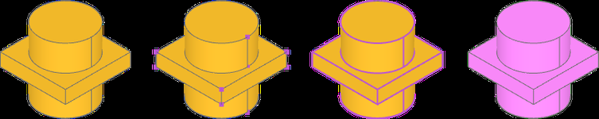

Fig. 1: The default Select.ALL features

Select features changed in the last operation with criteria Select.LAST.

```python
with BuildPart() as part:
```

```python
    Box(5, 5, 1)
    Cylinder(1, 5)
```

```python
    part.vertices(Select.LAST)
    part.edges(Select.LAST)
    part.faces(Select.LAST)
```

Select only new edges from the last operation with Select.NEW. This option is only available for a ShapeList of
edges!

```python
with BuildPart() as part:
```

```python
    Box(5, 5, 1)
    Cylinder(1, 5)
```

```python
    part.edges(Select.NEW)
```

<!-- PDF page 289 -->

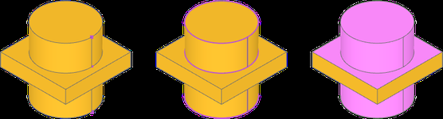

Fig. 2: Select.LAST features

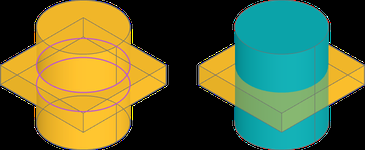

Fig. 3: Select.NEW edges where box and cylinder intersect

This only returns new edges which are not reused from Box or Cylinder, in this case where the objects intersect. But
what happens if the objects don’t intersect and all the edges are reused?

```python
with BuildPart() as part:
```

```python
    Box(5, 5, 1, align=(Align.CENTER, Align.CENTER, Align.MAX))
    Cylinder(2, 2, align=(Align.CENTER, Align.CENTER, Align.MIN))
```

```python
    part.edges(Select.NEW)
```

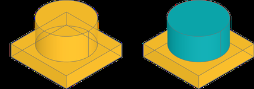

Fig. 4: Select.NEW edges when box and cylinder don’t intersect

No edges are selected! Unlike the previous example, the Edge between the Box and Cylinder objects is an edge reused
from the Cylinder. Think of Select.NEW as a way to select only completely new edges created by the operation.

Note

Chamfer and fillet modify the current object, but do not have new edges via Select.NEW.

<!-- PDF page 290 -->

```python
 with BuildPart() as part:
```

```python
     Box(5, 5, 1)
     Cylinder(1, 5)
     edges = part.edges().filter_by(lambda a: a.length == 1)
     fillet(edges, 1)
```

```python
     part.edges(Select.NEW)
```

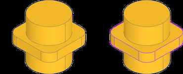

Fig. 5: Left, Select.NEW returns no edges after fillet. Right, Select.LAST

Select New Edges In Algebra Mode

The utility method new_edges compares one or more shape objects to a another “combined” shape object and returns
the edges new to the combined shape. new_edges is available both Algebra mode or Builder mode, but is necessary
in Algebra Mode where Select.NEW is unavailable

```python
box = Box(5, 5, 1)
circle = Cylinder(2, 5)
part = box + circle
edges = new_edges(box, circle, combined=part)
```

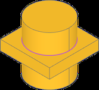

new_edges can also find edges created during a chamfer or fillet operation by comparing the object before the operation
to the “combined” object.

```python
box = Box(5, 5, 1)
circle = Cylinder(2, 5)
part_before = box + circle
edges = part_before.edges().filter_by(lambda a: a.length == 1)
part = fillet(edges, 1)
edges = new_edges(part_before, combined=part)
```

<!-- PDF page 291 -->


1.12.2 Operators

Operators provide methods refine a ShapeList of features isolated by a selector to further specify feature(s). These
methods can sort, group, or filter ShapeList objects and return a modified ShapeList, or in the case of group_by(),
GroupBy, a list of ShapeList objects accessible by index or key.

Overview

Method              Criteria                          Description

Sort ShapeList by criteria

sort_by()           Axis, Edge, Wire, SortBy, callable,
property

Group ShapeList by criteria

sort_by_distance()  Shape, VectorLike                 Sort ShapeList by distance from criteria
group_by()          Axis, Edge, Wire, SortBy, callable,
property

Filter ShapeList by criteria

filter_by()         Axis, Plane, GeomType, callable, prop-
erty

filter_by_position() Axis                             Filter ShapeList by Axis & mix / max
values

Operator methods take criteria to refine ShapeList. Broadly speaking, the criteria fall into the following categories,
though not all operators take all criteria:

• Geometric objects: Axis, Plane

• Topological objects: Edge, Wire

• Enums: SortBy, GeomType

• Properties, eg: Face.area, Edge.length

```python
   • Callable, eg: lambda e: e.is_interior == 1, lambda f: len(f.edges()) >= 3, Vertex().
     distance, topo_distance_to()
```

Sort

A ShapeList can be sorted with the sort_by() and sort_by_distance() methods based on a sorting criteria.
Sorting is a critical step when isolating individual features as a ShapeList from a selector is typically unordered.

Here we want to capture some vertices from the object furthest along X: All the vertices are first captured with the
vertices() selector, then sort by Axis.X. Finally, the vertices can be captured with a list slice for the last 4 list items,
as the items are sorted from least to greatest X position. Remember, ShapeList is a subclass of list, so any list slice
can be used.

```python
part.vertices().sort_by(Axis.X)[-4:]
```

<!-- PDF page 292 -->

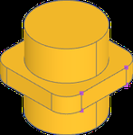

Examples


<!-- END topology_selection.md -->


<!-- BEGIN topology_sort_examples.md -->

---
title: "Sort Examples"
source_html: "https://build123d.readthedocs.io/en/latest/topology_selection/sort_examples.html"
extracted_from: "official ReadTheDocs PDF"
pdf_release: "0.11.1.dev21+gbbce3cdd6"
pdf_pages: "292-300"
generated_on: "2026-07-01"
---

# Sort Examples

> Converted to Markdown from the official build123d ReadTheDocs PDF. PDF page markers and local extracted-image links are included for traceability. Some line wrapping reflects the PDF layout.
<!-- PDF page 292 -->

Sort Examples

SortBy

SortBy enums are shape property shorthands which work across Shape multiple object types. SortBy is a criteria for
both sort_by and group_by.

• SortBy.LENGTH works with Edge, Wire

• SortBy.AREA works with Face, Solid

• SortBy.VOLUME works with Solid

• SortBy.RADIUS works with Edge, Face with GeomType CIRCLE, CYLINDER, SPHERE

• SortBy.DISTANCE works Vertex, Edge, Wire, Face, Solid

SortBy is often interchangeable with specific shape properties and can alternatively be used with``group_by``.

Setup

```python
from build123d import *
```

```python
with BuildPart() as part:
```

```python
    Box(5, 5, 1)
    Cylinder(2, 5)
    edges = part.edges().filter_by(lambda a: a.length == 1)
    fillet(edges, 1)
```

```python
part.wires().sort_by(SortBy.LENGTH)[:4]
```

```python
part.wires().sort_by(Wire.length)[:4]
part.wires().group_by(SortBy.LENGTH)[0]
```

<!-- PDF page 293 -->

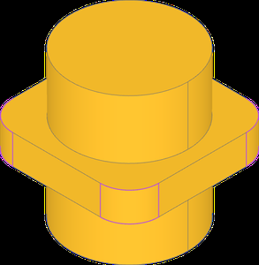

```python
part.vertices().sort_by(SortBy.DISTANCE)[-2:]
```

```python
part.vertices().sort_by_distance(Vertex())[-2:]
part.vertices().group_by(Vertex().distance)[-1]
```

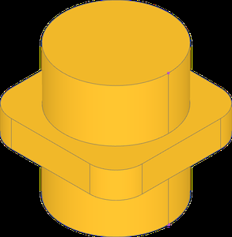

<!-- PDF page 294 -->

Along Wire

Vertices selected from an edge or wire might have a useful ordering when created from a single object, but when created
from multiple objects, the ordering not useful. For example, when applying incrementing fillet radii to a list of vertices
from the face, the order is random.

Setup

```python
from build123d import *
```

```python
with BuildSketch() as along_wire:
```

```python
    Rectangle(48, 16, align=Align.MIN)
    Rectangle(16, 48, align=Align.MIN)
    Rectangle(32, 32, align=Align.MIN)
```

```python
    for i, v in enumerate(along_wire.vertices()):
```

```python
        fillet(v, i + 1)
```

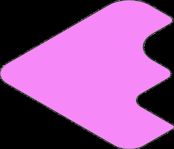

Vertices may be sorted along the wire they fall on to create order. Notice the fillet radii now increase in order.

```python
    sorted_verts = along_wire.vertices().sort_by(along_wire.wire())
    for i, v in enumerate(sorted_verts):
```

```python
        fillet(v, i + 1)
```

<!-- PDF page 295 -->

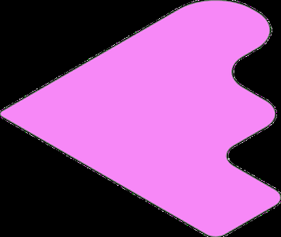

Axis

Sorting by axis is often the most straightforward way to optimize selections. In this part we want to revolve the face
at the end around an inside edge of the completed extrusion. First, the face to extrude can be found by sorting along
x-axis and the revolution edge can be found sorting along y-axis.

Setup

```python
from build123d import *
```

```python
with BuildPart() as part:
```

```python
    with BuildSketch(Plane.YZ) as profile:
```

```python
        with BuildLine():
            l1 = FilletPolyline((16, 0), (32, 0), (32, 25), radius=12)
            l2 = FilletPolyline((16, 4), (28, 4), (28, 15), radius=8)
            Line(l1 @ 0, l2 @ 0)
            Polyline(l1 @ 1, l1 @ 1 - Vector(2, 0), l2 @ 1 + Vector(2, 0), l2 @ 1)
        make_face()
    extrude(amount=34)
```

```python
    face = part.faces().sort_by(Axis.X)[-1]
    edge = face.edges().sort_by(Axis.Y)[0]
    revolve(face, -Axis(edge), 90)
```

<!-- PDF page 296 -->

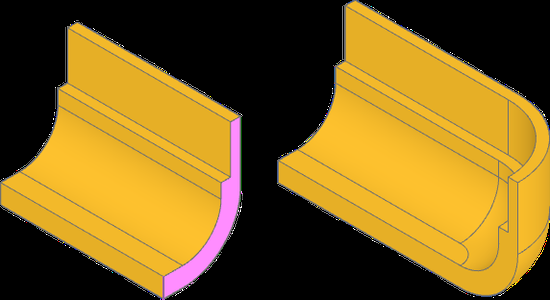

Distance From

A sort_by_distance can be used to sort objects by their distance from another object. Here we are sorting the boxes
by distance from the origin, using an empty Vertex (at the origin) as the reference shape to find distance to.

Setup

```python
from itertools import product
```

```python
from build123d import *
from ocp_vscode import *
```

```python
boxes = ShapeList(
```

```python
    Box(1, 1, 1).scale(0.75 if (i, j) == (1, 2) else 0.25).translate((i, j, 0))
    for i, j in product(range(-3, 4), repeat=2)
)
```

```python
boxes = boxes.sort_by_distance(Vertex())
show(*boxes, colors=ColorMap.listed(len(boxes)))
```

The example can be extended by first sorting the boxes by volume using the Solid property volume, and getting the
last (largest) box. Then, the boxes sorted by their distance from the largest box.

```python
boxes = boxes.sort_by_distance(boxes.sort_by(Solid.volume).last)
show(*boxes, colors=ColorMap.listed(len(boxes)))
```

<!-- PDF page 297 -->

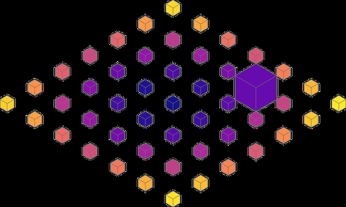

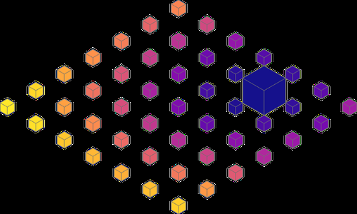

<!-- PDF page 298 -->

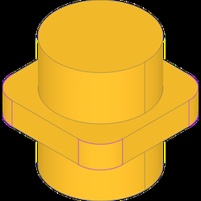

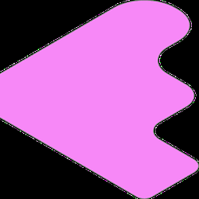

SortBy SortBy

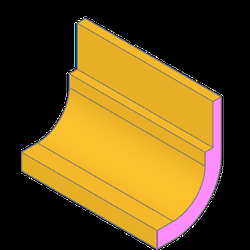

Along Wire Along Wire

<!-- PDF page 299 -->

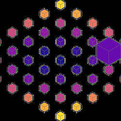

Axis Axis

Distance From Distance From

Group

A ShapeList can be grouped and sorted with the group_by() method based on a grouping criteria. Grouping can
be a great way to organize features without knowing the values of specific feature properties. Rather than returning a
ShapeList, group_by() returns a GroupBy, a list of ShapeList objects sorted by the grouping criteria. GroupBy
can be printed to view the members of each group, indexed like a list to retrieve a ShapeList, and be accessed using
a key with the group method. If the group keys are unknown they can be discovered with key_to_group_index.

If we want only the edges from the smallest faces by area we can get the faces, then group by SortBy.AREA. The
ShapeList of smallest faces is available from the first list index. Finally, a ShapeList has access to selectors, so
calling edges() will return a new list of all edges in the previous list.

```python
part.faces().group_by(SortBy.AREA)[0].edges())
```

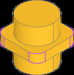

Topological Distance

topo_distance_to() creates a callable key that measures graph distance through topology rather than geometric
distance through space. It is useful when selecting features by adjacency, for example faces connected to a reference
face, or the next ring of faces after that.

Distances are measured within the shared topo_parent of the reference shape. The reference shape has distance 0,
directly adjacent shapes have distance 1, and unreachable shapes have distance inf.

<!-- PDF page 300 -->

```python
box = Box(1, 1, 1)
faces = box.faces()
top_face = faces.sort_by(Axis.Z)[-1]
```

```python
face_rings = faces.group_by(topo_distance_to(top_face))
```

```python
top = face_rings[0]
sides = face_rings[1]
bottom = face_rings[2]
```

Multiple reference shapes can be provided. This is useful for selecting all features within a topological distance from
any reference. In this example, a sphere is converted to a triangular mesh, faces near the middle of the mesh are used
as references, and all mesh faces are grouped into topological rings expanding away from that starting band.

```python
from build123d import *
from pathlib import Path
from tempfile import TemporaryDirectory
```

```python
from ocp_vscode import ColorMap, show
```

```python
mesher = Mesher()
mesher.add_shape(Sphere(1), linear_deflection=0.05, angular_deflection=1)
```

```python
with TemporaryDirectory() as tmp_dir:
    mesh_path = Path(tmp_dir) / "sphere.stl"
    mesher.write(mesh_path)
    mesh_sphere = Mesher().read(mesh_path)[0]
```

```python
sphere_faces = mesh_sphere.faces()
```

```python
vertical_groups = sphere_faces.group_by(Axis.Z)
starting_ring = vertical_groups[len(vertical_groups) // 2]
face_rings = sphere_faces.group_by(topo_distance_to(starting_ring))
```

```python
show(*face_rings, colors=ColorMap.listed(len(face_rings)))
```

The same approach can be used with edges or vertices. For example, a single edge on the mesh can be used as the
starting point for edge-distance rings.

```python
sphere_edges = mesh_sphere.edges()
reference_edge = choice(sphere_edges)
edge_rings = sphere_edges.group_by(topo_distance_to(reference_edge))
```

Examples


<!-- END topology_sort_examples.md -->


<!-- BEGIN topology_group_examples.md -->

---
title: "Group Examples"
source_html: "https://build123d.readthedocs.io/en/latest/topology_selection/group_examples.html"
extracted_from: "official ReadTheDocs PDF"
pdf_release: "0.11.1.dev21+gbbce3cdd6"
pdf_pages: "300-307"
generated_on: "2026-07-01"
---

# Group Examples

> Converted to Markdown from the official build123d ReadTheDocs PDF. PDF page markers and local extracted-image links are included for traceability. Some line wrapping reflects the PDF layout.
<!-- PDF page 300 -->

Group Examples

Axis and Length

This heatsink component could use fillets on the ends of the fins on the long ends. One way to accomplish this is to
filter by length, sort by axis, and slice the result knowing how many edges to expect.

<!-- PDF page 301 -->

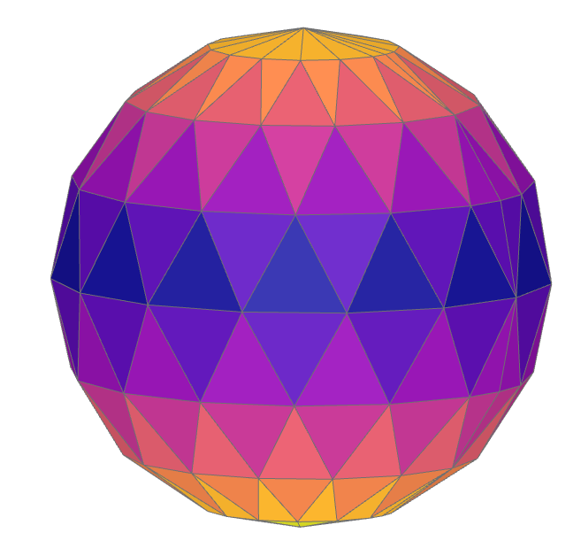

<!-- PDF page 302 -->

Setup

```python
from build123d import *
```

```python
with BuildPart() as fins:
```

```python
    with GridLocations(4, 6, 4, 4):
```

```python
        Box(2, 3, 10, align=(Align.CENTER, Align.CENTER, Align.MIN))
```

```python
with BuildPart() as part:
```

```python
    Box(34, 48, 5, align=(Align.CENTER, Align.CENTER, Align.MAX))
    with GridLocations(20, 27, 2, 2):
```

```python
        add(fins)
```

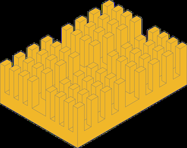

However, group_by can be used to first group all the edges by z-axis position and then group again by length. In both
cases, you can select the desired edges from the last group.

```python
    target = part.edges().group_by(Axis.Z)[-1].group_by(Edge.length)[-1]
    fillet(target, .75)
```

Hole Area

Callables are available to group_by, like sort_by. Here, the first inner wire is converted to a face and then that area
is the grouping criteria to find the faces with the largest hole.

<!-- PDF page 303 -->

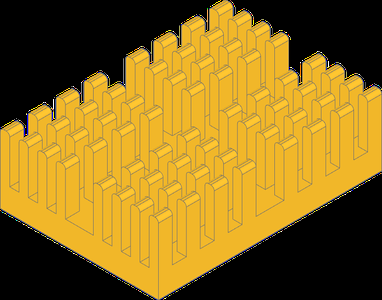

Setup

```python
from build123d import *
```

```python
with BuildPart() as part:
```

```python
    Cylinder(10, 30, rotation=(90, 0, 0))
    Cylinder(8, 40, rotation=(90, 0, 0), align=(Align.CENTER, Align.CENTER, Align.MAX))
    Cylinder(8, 23, rotation=(90, 0, 0), align=(Align.CENTER, Align.CENTER, Align.MIN))
    Cylinder(5, 40, rotation=(90, 0, 0), align=(Align.CENTER, Align.CENTER, Align.MIN))
    with BuildSketch(Plane.XY.offset(8)) as s:
```

```python
        SlotCenterPoint((0, 38), (0, 48), 5)
    extrude(amount=2.5, both=True, mode=Mode.SUBTRACT)
```

```python
    faces = part.faces().group_by(
```

```python
        lambda f: Face(f.inner_wires()[0]).area if f.inner_wires() else 0
    )
    chamfer([f.outer_wire().edges() for f in faces[-1]], 0.5)
```

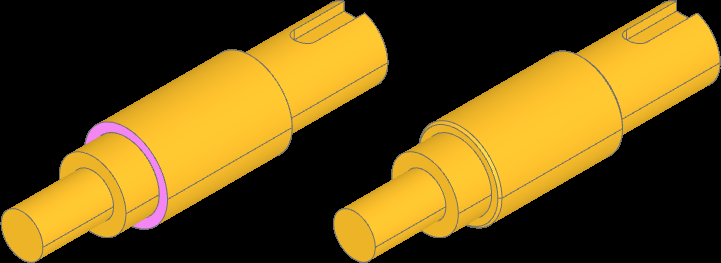

<!-- PDF page 304 -->

Properties with Keys

Groups are usually selected by list slice, often smallest [0] or largest [-1], but they can also be selected by key with
the group method if the keys are known. Starting with an incomplete bearing block we are looking to add fillets to the
ribs and corners. We know the edge lengths so the edges can be grouped by Edge.Length and then the desired groups
are selected with the group method using the lengths as keys.

Setup

```python
from build123d import *
```

```python
with BuildPart() as part:
```

```python
    with BuildSketch(Plane.XZ) as sketch:
```

```python
        with BuildLine():
```

```python
            CenterArc((-6, 12), 10, 0, 360)
            Line((-16, 0), (16, 0))
        make_hull()
        Rectangle(50, 5, align=(Align.CENTER, Align.MAX))
```

```python
    extrude(amount=12)
```

```python
    Box(38, 6, 22, align=(Align.CENTER, Align.MAX, Align.MIN), mode=Mode.SUBTRACT)
```

```python
    circle = part.edges().filter_by(GeomType.CIRCLE).sort_by(Axis.Y)[0]
    with Locations(Plane(circle.arc_center, z_dir=circle.normal())):
```

```python
        CounterBoreHole(13 / 2, 16 / 2, 4)
```

```python
    mirror(about=Plane.XZ)
```

```python
    length_groups = part.edges().group_by(Edge.length)
    fillet(length_groups.group(6) + length_groups.group(5), 4)
```

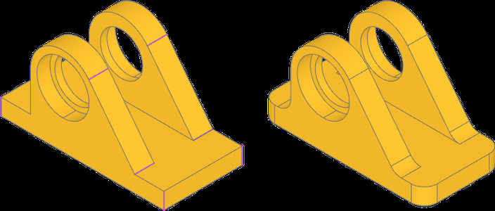

<!-- PDF page 305 -->

Next, we add alignment pin and counterbore holes after the fillets to make sure screw heads sit flush where they overlap
the fillet. Once that is done, it’s time to finalize the tight-tolerance bearing and pin holes with chamfers to make
installation easier. We can filter by GeomType.CIRCLE and group by Edge.radius to group the circular edges. Again,
the radii are known, so we can retrieve those groups directly and then further specify only the edges the bearings and
pins are installed from.

Adding holes

```python
    with BuildSketch() as pins:
```

```python
        with Locations((-21, 0)):
```

```python
            Circle(3 / 2)
        with Locations((21, 0)):
```

```python
            SlotCenterToCenter(1, 3)
    extrude(amount=-12, mode=Mode.SUBTRACT)
```

```python
    with GridLocations(42, 16, 2, 2):
```

```python
        CounterBoreHole(3.5 / 2, 3.5, 0)
```

```python
    radius_groups = part.edges().filter_by(GeomType.CIRCLE).group_by(Edge.radius)
    bearing_edges = radius_groups.group(8).group_by(SortBy.DISTANCE)[-1]
    pin_edges = radius_groups.group(1.5).filter_by_position(Axis.Z, -5, -5)
    chamfer([pin_edges, bearing_edges], .5)
```

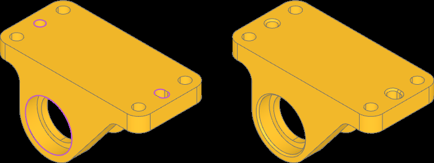

Note that group_by is not the only way to capture edges with a known property value! filter_by with a lambda
expression can be used as well:

```python
radius_groups = part.edges().filter_by(GeomType.CIRCLE)
bearing_edges = radius_groups.filter_by(lambda e: e.radius == 8)
pin_edges = radius_groups.filter_by(lambda e: e.radius == 1.5)
```

<!-- PDF page 306 -->

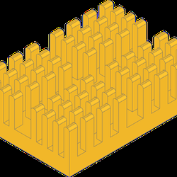

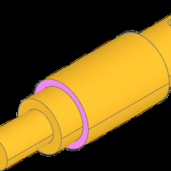

Axis and Length Axis and Length

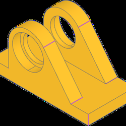

Hole Area Hole Area

Properties with Keys Properties with Keys

<!-- PDF page 307 -->

Filter

A ShapeList can be filtered with the filter_by() and filter_by_position() methods based on a filtering cri-
teria. Filters are flexible way to isolate (or exclude) features based on known criteria.

Lets say we need all the faces with a normal in the +Z direction. One way to do this might be with a list comprehension,
however filter_by() has the capability to take a lambda function as a filter condition on the entire list. In this case,
the normal of each face can be checked against a vector direction and filtered accordingly.

```python
part.faces().filter_by(lambda f: f.normal_at() == Vector(0, 0, 1))
```

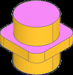

Examples


<!-- END topology_group_examples.md -->


<!-- BEGIN topology_filter_examples.md -->

---
title: "Filter Examples"
source_html: "https://build123d.readthedocs.io/en/latest/topology_selection/filter_examples.html"
extracted_from: "official ReadTheDocs PDF"
pdf_release: "0.11.1.dev21+gbbce3cdd6"
pdf_pages: "307-317"
generated_on: "2026-07-01"
---

# Filter Examples

> Converted to Markdown from the official build123d ReadTheDocs PDF. PDF page markers and local extracted-image links are included for traceability. Some line wrapping reflects the PDF layout.
<!-- PDF page 307 -->

Filter Examples

GeomType

GeomType enums are shape type shorthands for Edge and Face objects. They are most helpful for filtering objects of
that specific type for further operations, and are sometimes necessary e.g. before sorting or filtering by radius. Edge
and Face each support a subset of GeomType:

• Edge can be type LINE, CIRCLE, ELLIPSE, HYPERBOLA, PARABOLA, BEZIER, BSPLINE, OFFSET, OTHER

• Face can be type PLANE, CYLINDER, CONE, SPHERE, TORUS, BEZIER, BSPLINE, REVOLUTION, EXTRUSION,
OFFSET, OTHER

Setup

```python
from build123d import *
```

```python
with BuildPart() as part:
```

```python
    Box(5, 5, 1)
    Cylinder(2, 5)
    edges = part.edges().filter_by(lambda a: a.length == 1)
    fillet(edges, 1)
```

```python
part.edges().filter_by(GeomType.LINE)
```

<!-- PDF page 308 -->


```python
part.faces().filter_by(GeomType.CYLINDER)
```


All Edges Circle

In this complete bearing block, we want to add joints for the bearings. These should be located in the counterbore recess.
One way to locate the joints is by finding faces with centers located where the joints need to be located. Filtering for
faces with only circular edges selects the counterbore faces that meet the joint criteria.

<!-- PDF page 309 -->

Setup

```python
from build123d import *
```

```python
with BuildPart() as part:
```

```python
    with BuildSketch() as s:
```

```python
        Rectangle(115, 50)
        with Locations((5 / 2, 0)):
```

```python
            SlotOverall(90, 12, mode=Mode.SUBTRACT)
    extrude(amount=15)
```

```python
    with BuildSketch(Plane.XZ.offset(50 / 2)) as s3:
```

```python
        with Locations((-115 / 2 + 26, 15)):
```

```python
            SlotOverall(42 + 2 * 26 + 12, 2 * 26, rotation=90)
    zz = extrude(amount=-12)
    split(bisect_by=Plane.XY)
    edgs = part.part.edges().filter_by(Axis.Y).group_by(Axis.X)[-2]
    fillet(edgs, 9)
```

```python
    with Locations(zz.faces().sort_by(Axis.Y)[0]):
```

```python
        with Locations((42 / 2 + 6, 0)):
```

```python
            CounterBoreHole(24 / 2, 34 / 2, 4)
    mirror(about=Plane.XZ)
```

```python
    with BuildSketch() as s4:
```

```python
        RectangleRounded(115, 50, 6)
    extrude(amount=80, mode=Mode.INTERSECT)
    # fillet does not work right, mode intersect is safer
```

```python
    with BuildSketch(Plane.YZ) as s4:
```

```python
        with BuildLine() as bl:
            l1 = Line((0, 0), (18 / 2, 0))
            l2 = PolarLine(l1 @ 1, 8, 60, length_mode=LengthMode.VERTICAL)
            l3 = Line(l2 @ 1, (0, 8))
            mirror(about=Plane.YZ)
        make_face()
    extrude(amount=115 / 2, both=True, mode=Mode.SUBTRACT)
```

```python
    faces = part.faces().filter_by(
```

```python
        lambda f: all(e.geom_type == GeomType.CIRCLE for e in f.edges())
    )
    for i, f in enumerate(faces):
```

```python
        RigidJoint(f"bearing_bore_{i}", joint_location=f.center_location)
```

Axis and Plane

Filtering by an Axis will select faces perpendicular to the axis. Likewise filtering by Plane will select faces parallel to
the plane.

<!-- PDF page 310 -->


Setup

```python
from build123d import *
```

```python
with BuildPart() as part:
```

```python
    Box(1, 1, 1)
```

```python
part.faces().filter_by(Axis.Z)
part.faces().filter_by(Plane.XY)
```


<!-- PDF page 311 -->

It might be useful to filter by an Axis or Plane in other ways. A lambda can be used to accomplish this with feature
properties or methods. Here, we are looking for faces where the dot product of face normal and either the axis direction
or the plane normal is about to 0. The result is faces parallel to the axis or perpendicular to the plane.

```python
part.faces().filter_by(lambda f: abs(f.normal_at().dot(Axis.Z.direction) < 1e-6)
part.faces().filter_by(lambda f: abs(f.normal_at().dot(Plane.XY.z_dir)) < 1e-6)
```


Inner Wire Count

This motor bracket imported from a step file needs joints for adding to an assembly. Joints for the M3 clearance holes
were already found by using the cylindrical face’s axis of rotation, but the motor bore and slots need specific placement.
The motor bore can be found by filtering for faces with 5 inner wires, sorting for the desired face, and then filtering for
the specific inner wire by radius.

• bracket STEP model: nema-17-bracket.step

Setup

```python
from build123d import *
```

```python
bracket = import_step(os.path.join(working_path, "nema-17-bracket.step"))
faces = bracket.faces()
```

```python
motor_mounts = faces.filter_by(GeomType.CYLINDER).filter_by(lambda f: f.radius == 3.3/2)
for i, f in enumerate(motor_mounts):
    location = f.axis_of_rotation.location
    RigidJoint(f"motor_m3_{i}", bracket, joint_location=location)
```

<!-- PDF page 312 -->

```python
motor_face = faces.filter_by(lambda f: len(f.inner_wires()) == 5).sort_by(Axis.X)[-1]
motor_bore = motor_face.inner_wires().edges().filter_by(lambda e: e.radius == 16).edge()
location = Location(motor_bore.arc_center, motor_bore.normal() * 90, Intrinsic.YXZ)
RigidJoint(f"motor", bracket, joint_location=location)
```


Linear joints for the slots are appropriate for mating flexibility, but require more than a single location. The slot arc
centers can be used for creating a linear joint axis and range. To do that we can filter for faces with 6 inner wires, sort
for and select the top face, and then filter for the circular edges of the inner wires.

```python
mount_face = faces.filter_by(lambda f: len(f.inner_wires()) == 6).sort_by(Axis.Z)[-1]
mount_slots = mount_face.inner_wires().edges().filter_by(GeomType.CIRCLE)
joint_edges = [
```

```python
    Line(mount_slots[i].arc_center, mount_slots[i + 1].arc_center)
    for i in range(0, len(mount_slots), 2)
]
for i, e in enumerate(joint_edges):
```

```python
    LinearJoint(f"mount_m4_{i}", bracket, axis=Axis(e), linear_range=(0, e.length / 2))
```

<!-- PDF page 313 -->


Nested Filters

Filters can be nested to specify features by characteristics other than their own, like child properties. Here we want to
chamfer the mating edges of the D bore and square shaft. A way to do this is first looking for faces with only 2 line
edges among the inner wires. The nested filter captures the straight edges, while the parent filter selects faces based on
the count. Then, from those faces, we filter for the wires with any line edges.

Setup

```python
from build123d import *
```

```python
with BuildPart() as part:
```

```python
    Cylinder(15, 2, align=(Align.CENTER, Align.CENTER, Align.MIN))
    with BuildSketch():
```

```python
        RectangleRounded(10, 10, 2.5)
    extrude(amount=15)
```

```python
    with BuildSketch():
```

```python
        Circle(2.5)
        Rectangle(4, 5, mode=Mode.INTERSECT)
    extrude(amount=15, mode=Mode.SUBTRACT)
```

```python
    with GridLocations(20, 0, 2, 1):
```

```python
        Hole(3.5 / 2)
```

```python
    faces = part.faces().filter_by(
```

<!-- PDF page 314 -->

```python
                                                                      (continued from previous page)
        lambda f: len(f.inner_wires().edges().filter_by(GeomType.LINE)) == 2
    )
    wires = faces.wires().filter_by(
```

```python
        lambda w: any(e.geom_type == GeomType.LINE for e in w.edges())
    )
    chamfer(wires.edges(), 0.5)
```


Shape Properties

Selected features can be quickly filtered by feature properties. First, we filter by interior and exterior edges using the
Edge is interior property to apply different fillets accordingly. Then the Face is_circular_* properties are used
to highlight the resulting fillets.

```python
from build123d import *
from ocp_vscode import *
```

```python
with BuildPart() as open_box_builder:
```

```python
    Box(20, 20, 5)
    offset(amount=-2, openings=open_box_builder.faces().sort_by(Axis.Z)[-1])
    inside_edges = open_box_builder.edges().filter_by(Edge.is_interior)
    fillet(inside_edges, 1.5)
    outside_edges = open_box_builder.edges().filter_by(Edge.is_interior, reverse=True)
    fillet(outside_edges, 0.5)
```

```python
open_box = open_box_builder.part
open_box.color = Color(0xEDAE49)
outside_fillets = Compound(open_box.faces().filter_by(Face.is_circular_convex))
outside_fillets.color = Color(0xD1495B)
inside_fillets = Compound(open_box.faces().filter_by(Face.is_circular_concave))
inside_fillets.color = Color(0x00798C)
```

<!-- PDF page 315 -->


<!-- PDF page 316 -->


GeomType GeomType


All Edges Circle All Edges Circle


Axis and Plane Axis and Plane

<!-- PDF page 317 -->


Inner Wire Count Inner Wire Count


Nested Filters Nested Filters

Shape Properties Shape Properties


<!-- END topology_filter_examples.md -->


<!-- BEGIN builders.md -->

---
title: "Builders"
source_html: "https://build123d.readthedocs.io/en/latest/builders.html"
extracted_from: "official ReadTheDocs PDF"
pdf_release: "0.11.1.dev21+gbbce3cdd6"
pdf_pages: "317"
generated_on: "2026-07-01"
---

# Builders

> Converted to Markdown from the official build123d ReadTheDocs PDF. PDF page markers and local extracted-image links are included for traceability. Some line wrapping reflects the PDF layout.
<!-- PDF page 317 -->

1.13 Builders

The following sections describe each of the build123d stateful context builders.


<!-- END builders.md -->


<!-- BEGIN build_line.md -->

---
title: "BuildLine"
source_html: "https://build123d.readthedocs.io/en/latest/build_line.html"
extracted_from: "official ReadTheDocs PDF"
pdf_release: "0.11.1.dev21+gbbce3cdd6"
pdf_pages: "317-321"
generated_on: "2026-07-01"
---

# BuildLine

> Converted to Markdown from the official build123d ReadTheDocs PDF. PDF page markers and local extracted-image links are included for traceability. Some line wrapping reflects the PDF layout.
<!-- PDF page 317 -->

1.13.1 BuildLine

BuildLine is a python context manager that is used to create one dimensional objects - objects with the property of
length but not area - that are typically used as part of a BuildSketch sketch or a BuildPart path.

The complete API for BuildLine is located at the end of this section.

Basic Functionality

The following is a simple BuildLine example:

```python
with BuildLine() as example_1:
```

```python
    Line((0, 0), (2, 0))
    ThreePointArc((0, 0), (1, 1), (2, 0))
```

<!-- PDF page 318 -->

The with statement creates the BuildLine context manager with the identifier example_1. The objects and operations
that are within the scope (i.e. indented) of this context will contribute towards the object being created by the context
manager. For BuildLine, this object is line and it’s referenced as example_1.line.

The first object in this example is a Line object which is used to create a straight line from coordinates (0,0) to (2,0)
on the default XY plane. The second object is a ThreePointArc that starts and ends at the two ends of the line.

Constraints

Building with constraints enables the designer to capture design intent and add a high degree of robustness to their
designs. The following sections describe creating positional and tangential constraints as well as using object attributes
to enable this type of design.

@ position_at Operator

In the previous example, the ThreePointArc started and ended at the two ends of the Line but this was done by
referring to the same point (0,0) and (2,0). This can be improved upon by specifying constraints that lock the arc
to those two end points, as follows:

```python
with BuildLine() as example_2:
    l1 = Line((0, 0), (2, 0))
    l2 = ThreePointArc(l1 @ 0, (1, 1), l1 @ 1)
```

Here instance variables l1 and l2 are assigned to the two BuildLine objects and the ThreePointArc references the
beginning of the straight line with l1 @ 0 and the end with l1 @ 1. The @ operator takes a float (or integer) parameter
between 0 and 1 and determines a position at this fractional position along the line’s length.

This example can be improved on further by calculating the mid-point of the arc as follows:

```python
with BuildLine() as example_3:
    l1 = Line((0, 0), (2, 0))
    l2 = ThreePointArc(l1 @ 0, l1 @ 0.5 + (0, 1), l1 @ 1)
```

Here l1 @ 0.5 finds the center of l1 while l1 @ 0.5 + (0, 1) does a vector addition to generate the point (1,1).

To make the design even more parametric, the height of the arc can be calculated from l1 as follows:

```python
with BuildLine() as example_4:
    l1 = Line((0, 0), (2, 0))
    l2 = ThreePointArc(l1 @ 0, l1 @ 0.5 + (0, l1.length / 2), l1 @ 1)
```

The arc height is now calculated as (0, l1.length / 2) by using the length property of Edge and Wire shapes.
At this point the ThreePointArc is fully parametric and able to generate the same shape for any horizontal line.

% tangent_at Operator

The other operator that is commonly used within BuildLine is % the tangent at operator. Here is another example:

```python
with BuildLine() as example_5:
    l1 = Line((0, 0), (5, 0))
    l2 = Line(l1 @ 1, l1 @ 1 + (0, l1.length - 1))
    l3 = JernArc(start=l2 @ 1, tangent=l2 % 1, radius=0.5, arc_size=90)
    l4 = Line(l3 @ 1, (0, l2.length + l3.radius))
```

<!-- PDF page 319 -->

which generates (note that the circles show line junctions):

The JernArc has the following parameters:

• start=l2 @ 1 - start the arc at the end of line l2,

• tangent=l2 % 1 - the tangent of the arc at the start point is equal to the l2's, tangent at its end (shown as a
dashed line)

• radius=0.5 - the radius of the arc, and

• arc_size=90 the angular size of the arc.

The final line starts at the end of l3 and ends at a point calculated from the length of l2 and the radius of arc l3.

Building with constraints as shown here will ensure that your designs both fully represent design intent and are robust
to design changes.

BuildLine to BuildSketch

As mentioned previously, one of the two primary reasons to create BuildLine objects is to use them in BuildSketch.
When a BuildLine context manager exits and is within the scope of a BuildSketch context manager it will transfer the
generated line to BuildSketch. The BuildSketch make_face() or make_hull() operations are then used to transform
the line (specifically a list of Edges) into a Face - the native BuildSketch objects.

Here is an example of using BuildLine to create an object that otherwise might be difficult to create:

```python
with BuildSketch() as example_6:
```

```python
    with BuildLine() as club_outline:
        l0 = Line((0, -188), (76, -188))
        b0 = Bezier(l0 @ 1, (61, -185), (33, -173), (17, -81))
        b1 = Bezier(b0 @ 1, (49, -128), (146, -145), (167, -67))
        b2 = Bezier(b1 @ 1, (187, 9), (94, 52), (32, 18))
        b3 = Bezier(b2 @ 1, (92, 57), (113, 188), (0, 188))
        mirror(about=Plane.YZ)
    make_face()
```

which generates:

Note

SVG import to BuildLine

The BuildLine code used in this example was generated by translating a SVG file into BuildLine source code with
the import_svg_as_buildline_code() function. For example:

```python
 svg_code, builder_name = import_svg_as_buildline_code("club.svg")
```

would translate the “club.svg” image file’s paths into BuildLine code much like that shown above. From there it’s
easy for a user to add constraints or otherwise enhance the original image and use it in their design.

<!-- PDF page 320 -->

BuildLine to BuildPart

The other primary reasons to use BuildLine is to create paths for BuildPart sweep() operations. Here some curved
and straight segments define a path:

```python
with BuildPart() as example_7:
```

```python
    with BuildLine() as example_7_path:
        l1 = RadiusArc((0, 0), (1, 1), 2)
        l2 = Spline(l1 @ 1, (2, 3), (3, 3), tangents=(l1 % 1, (0, -1)))
        l3 = Line(l2 @ 1, (3, 0))
    with BuildSketch(Plane(origin=l1 @ 0, z_dir=l1 % 0)) as example_7_section:
```

```python
        Circle(0.1)
    sweep()
```

which generates:

There are few things to note from this example:

• The @ and % operators are used to create a plane normal to the beginning of the path with which to create the
circular section used by the sweep operation (this plane is not one of the ordinal planes).

• Both the path generated by BuildLine and the section generated by BuildSketch have been transferred to BuildPart
when each of them exit.

• The BuildPart Sweep operation is using the path and section previously transferred to it (as “pending” objects)
as parameters of the sweep. The Sweep operation “consumes” these pending objects as to not interfere with
subsequence operations.

Working on other Planes

So far all of the examples were created on Plane.XY - the default plane - which is equivalent to global coordinates.
Sometimes it’s convenient to work on another plane, especially when creating paths for BuildPart Sweep operations.

```python
with BuildLine(Plane.YZ) as example_8:
    l1 = Line((0, 0), (5, 0))
    l2 = Line(l1 @ 1, l1 @ 1 + (0, l1.length - 1))
    l3 = JernArc(start=l2 @ 1, tangent=l2 % 1, radius=0.5, arc_size=90)
    l4 = Line(l3 @ 1, (0, l2.length + l3.radius))
```

which generates:

Here the BuildLine object is created on Plane.YZ just by specifying the working plane during BuildLine initialization.

There are three rules to keep in mind when working with alternate planes in BuildLine:

1. BuildLine accepts a single Plane to work with as opposed to other Builders that accept more than one work-
plane.

2. Values entered as tuples such as (1, 2) or (1, 2, 3) will be localized to the current workplane. This rule
applies to points and to the use of tuples to modify locations calculated with the @ and % operators such as l1 @
1 + (1, 1). For example, if the workplane is Plane.YZ the local value of (1, 2) would be converted to (0,
1, 2) in global coordinates. Three tuples are converted as well - (1, 2, 3) on Plane.YZ would be (3, 1,
2) in global coordinates. Providing values in local coordinates allows the designer to automate such conversions.

3. Values entered using the Vector class or those generated by the @ operator are considered global values and
are not localized. For example: Line(Vector(1, 2, 3), Vector(4, 5, 6)) will generate the same line

<!-- PDF page 321 -->

independent of the current workplane. It’s unlikely that users will need to use Vector values but the option is
there.

Finally, BuildLine’s workplane need not be one of the predefined ordinal planes, it could be one created from a surface
of a BuildPart part that is currently under construction.

Reference

class BuildLine(workplane: ~build123d.topology.two_d.Face | ~build123d.geometry.Plane |
~build123d.geometry.Location = Plane((0, 0, 0), (1, 0, 0), (0, 0, 1)), mode:
~build123d.build_enums.Mode = <Mode.ADD>)

The BuildLine class is a subclass of Builder for building lines (objects with length but not area or volume). It
has an _obj property that returns the current line being built. The class overrides the faces and solids methods
of Builder since they don’t apply to lines.

BuildLine only works with a single workplane which is used to convert tuples as inputs to global coordinates.
For example:

```python
     with BuildLine(Plane.YZ) as radius_arc:
         RadiusArc((1, 2), (2, 1), 1)
```

creates an arc from global points (0, 1, 2) to (0, 2, 1). Note that points entered as Vector(x, y, z) are considered
global and are not localized.

The workplane is also used to define planes parallel to the workplane that arcs are created on.

Parameters

```python
              • workplane (Union[Face, Plane, Location], optional) – plane used when local
                coordinates are used and when creating arcs. Defaults to Plane.XY.
```

• mode (Mode, optional) – combination mode. Defaults to Mode.ADD.

```python
     face(*args)
```

face() not implemented

```python
     faces(*args)
```

faces() not implemented

```python
     property line:  Curve | None
```

Get the current line

```python
     solid(*args)
```

solid() not implemented

```python
     solids(*args)
```

solids() not implemented


<!-- END build_line.md -->


<!-- BEGIN build_sketch.md -->

---
title: "BuildSketch"
source_html: "https://build123d.readthedocs.io/en/latest/build_sketch.html"
extracted_from: "official ReadTheDocs PDF"
pdf_release: "0.11.1.dev21+gbbce3cdd6"
pdf_pages: "321-324"
generated_on: "2026-07-01"
---

# BuildSketch

> Converted to Markdown from the official build123d ReadTheDocs PDF. PDF page markers and local extracted-image links are included for traceability. Some line wrapping reflects the PDF layout.
<!-- PDF page 321 -->

1.13.2 BuildSketch

BuildSketch is a python context manager that is used to create planar two dimensional objects - objects with the property
of area but not volume - that are typically used as profiles for BuildPart operations like extrude() or revolve().

The complete API for BuildSketch is located at the end of this section.

<!-- PDF page 322 -->

Basic Functionality

The following is a simple BuildSketch example:

```python
length, radius = 40.0, 60.0
```

```python
with BuildSketch() as circle_with_hole:
```

```python
    Circle(radius=radius)
    Rectangle(width=length, height=length, mode=Mode.SUBTRACT)
```

The with statement creates the BuildSketch context manager with the identifier circle_with_hole. The objects
and operations that are within the scope (i.e. indented) of this context will contribute towards the object being created
by the context manager. For BuildSketch, this object is sketch and it’s referenced as circle_with_hole.sketch.

The first object in this example is a Circle object which is used to create a filled circular shape on the default XY
plane. The second object is a Rectangle that is subtracted from the circle as directed by the mode=Mode.SUBTRACT
parameter. A key aspect of sketch objects is that they are all filled shapes and not just a shape perimeter which en-
ables combining subsequent shapes with different modes (the valid values of Mode are ADD, SUBTRACT, INTERSECT,
REPLACE, and PRIVATE).

Sketching on other Planes

Often when designing parts one needs to build on top of other features. To facilitate doing this BuildSketch allows
one to create sketches on any Plane while allowing the designer to work in a local X, Y coordinate system. It might be
helpful to think of what is happening with this metaphor:

1. When instantiating BuildSketch one or more workplanes can be passed as parameters. These are the placement
targets for the completed sketch.

2. The designer draws on a flat “drafting table” which is Plane.XY.

3. Once the sketch is complete, it’s applied like a sticker to all of the workplanes passed in step 1.

As an example, let’s build the following simple control box with a display on an angled plane:

Here is the code:

```python
with BuildPart() as controller:
```

```python
    # Create the side view of the controller
    with BuildSketch(Plane.YZ) as profile:
```

```python
        with BuildLine():
```

```python
            Polyline((0, 0), (0, 40), (20, 80), (40, 80), (40, 0), (0, 0))
        # Create a filled face from the perimeter drawing
        make_face()
    # Extrude to create the basis controller shape
    extrude(amount=30, both=True)
    # Round off all the edges
    fillet(controller.edges(), radius=3)
    # Hollow out the controller
    offset(amount=-1, mode=Mode.SUBTRACT)
    # Extract the face that will house the display
    display_face = (
```

```python
        controller.faces()
        .filter_by(GeomType.PLANE)
```

<!-- PDF page 323 -->

```python
                                                                      (continued from previous page)
        .filter_by_position(Axis.Z, 50, 70)[0]
    )
    # Create a workplane from the face
    display_workplane = Plane(
```

```python
        origin=display_face.center(), x_dir=(1, 0, 0), z_dir=display_face.normal_at()
    )
    # Place the sketch directly on the controller
    with BuildSketch(display_workplane) as display:
```

```python
        RectangleRounded(40, 30, 2)
        with GridLocations(45, 35, 2, 2):
```

```python
            Circle(1)
    # Cut the display sketch through the controller
    extrude(amount=-1, mode=Mode.SUBTRACT)
```

The highlighted part of the code shows how a face is extracted from the design, a workplane is constructed from this face
and finally this workplane is passed to BuildSketch as the target for the complete sketch. Notice how the display
sketch uses local coordinates for its features thus avoiding having the user to determine how to move and rotate the
sketch to get it where it should go.

Note that BuildSketch accepts a sequence planes, faces and locations for workplanes so creation of an explicit work-
plane is often not required. Being able to work on multiple workplanes at once allows for features to be created on
multiple side of an object - say both the top and bottom - which is convenient for symmetric parts.

Local vs. Global Sketches

In the above example the target for the sketch was not Plane.XY but a workplane passed by the user. Internally
BuildSketch is always creating the sketch on Plane.XY which one can see by looking at the sketch_local property
of your sketch. For example, to display the local version of the display sketch from above, one would use:

```python
show_object(display.sketch_local, name="sketch on Plane.XY")
```

while the sketches as applied to their target workplanes is accessible through the sketch property, as follows:

```python
show_object(display.sketch, name="sketch on target workplane(s)")
```

When using the add() operation to add an external Face to a sketch the face will automatically be reoriented to Plane.
XY before being combined with the sketch. As Faces don’t provide an x-direction it’s possible that the new Face may
not be oriented as expected. To reorient the Face manually to Plane.XY one can use the to_local_coords() method
as follows:

```python
reoriented_face = plane.to_local_coords(face)
```

where plane is the plane that face was constructed on.

Locating Features

Within a sketch features are positioned with Locations contexts (see Location Context) on the current workplane(s).
The following location contexts are available within a sketch:

• GridLocations : a X/Y grid of locations

• HexLocations : a hex grid of locations ideal for nesting circles

• Locations : a sequence of arbitrary locations

• PolarLocations : locations defined by radius and angle

<!-- PDF page 324 -->

Generally one would specify tuples of (X, Y) values when defining locations but there are many options available to
the user.

Reference

class BuildSketch(*workplanes: ~build123d.topology.two_d.Face | ~build123d.geometry.Plane |
~build123d.geometry.Location, mode: ~build123d.build_enums.Mode = <Mode.ADD>)

The BuildSketch class is a subclass of Builder for building planar 2D sketches (objects with area but not volume)
from faces or lines. It has an _obj property that returns the current sketch being built. The sketch property consists
of the sketch(es) applied to the input workplanes while the sketch_local attribute is the sketch constructed on
Plane.XY. The class overrides the solids method of Builder since they don’t apply to lines.

Note that all sketch construction is done within sketch_local on Plane.XY. When objects are added to the sketch
they must be coplanar to Plane.XY, usually handled automatically but may need user input for Edges and Wires
since their construction plane isn’t always able to be determined.

Parameters

```python
              • workplanes (Union[Face, Plane, Location], optional) – objects converted to
                plane(s) to place the sketch on. Defaults to Plane.XY.
```

• mode (Mode, optional) – combination mode. Defaults to Mode.ADD.

consolidate_edges() →Wire | list[Wire]

Unify pending edges into one or more Wires

```python
     property sketch
```

The global version of the sketch - may contain multiple sketches

```python
     property sketch_local:  Sketch | None
```

Get the builder’s object

```python
     solid(*args)
```

solid() not implemented

```python
     solids(*args)
```

solids() not implemented


<!-- END build_sketch.md -->


<!-- BEGIN build_part.md -->

---
title: "BuildPart"
source_html: "https://build123d.readthedocs.io/en/latest/build_part.html"
extracted_from: "official ReadTheDocs PDF"
pdf_release: "0.11.1.dev21+gbbce3cdd6"
pdf_pages: "324-328"
generated_on: "2026-07-01"
---

# BuildPart

> Converted to Markdown from the official build123d ReadTheDocs PDF. PDF page markers and local extracted-image links are included for traceability. Some line wrapping reflects the PDF layout.
<!-- PDF page 324 -->

1.13.3 BuildPart

BuildPart is a python context manager that is used to create three dimensional objects - objects with the property of
volume - that are typically finished parts.

The complete API for BuildPart is located at the end of this section.

Basic Functionality

The following is a simple BuildPart example:

```python
length, width, thickness = 80.0, 60.0, 10.0
center_hole_dia = 22.0
```

```python
with BuildPart() as ex2:
```

```python
    Box(length, width, thickness)
    Cylinder(radius=center_hole_dia / 2, height=thickness, mode=Mode.SUBTRACT)
```

<!-- PDF page 325 -->

The with statement creates the BuildPart context manager with the identifier ex2 (this code is the second of the
introductory examples). The objects and operations that are within the scope (i.e. indented) of this context will con-
tribute towards the object being created by the context manager. For BuildPart, this object is part and it’s referenced
as ex2.part.

The first object in this example is a Box object which is used to create a polyhedron with rectangular faces centered on
the default Plane.XY. The second object is a Cylinder that is subtracted from the box as directed by the mode=Mode.
SUBTRACT parameter thus creating a hole.

Implicit Parameters

The BuildPart context keeps track of pending objects such that they can be used implicitly - there are a couple things
to consider when deciding how to proceed:

• For sketches, the planes that they were constructed on is maintained in internal data structures such that operations
like extrude() will have a good reference for the extrude direction. One can pass a Face to extrude but it will
then be forced to use the normal direction at the center of the Face as the extrude direction which unfortunately
can be reversed in some circumstances.

• Implicit parameters save some typing but hide some functionality - users have to decide what works best for
them.

This tea cup example uses implicit parameters - note the sweep() operation on the last line:

```python
from build123d import *
from ocp_vscode import show
```

```python
wall_thickness = 3 * MM
fillet_radius = wall_thickness * 0.49
```

```python
with BuildPart() as tea_cup:
```

```python
    # Create the bowl of the cup as a revolved cross section
    with BuildSketch(Plane.XZ) as bowl_section:
```

```python
        with BuildLine():
```

```python
            # Start & end points with control tangents
            s = Spline(
                (30 * MM, 10 * MM),
                (69 * MM, 105 * MM),
                tangents=((1, 0.5), (0.7, 1)),
                tangent_scalars=(1.75, 1),
            )
            # Lines to finish creating ½ the bowl shape
            Polyline(s @ 0, s @ 0 + (10 * MM, -10 * MM), (0, 0), (0, (s @ 1).Y), s @ 1)
        make_face()  # Create a filled 2D shape
    revolve(axis=Axis.Z)
    # Hollow out the bowl with openings on the top and bottom
    offset(amount=-wall_thickness, openings=tea_cup.faces().filter_by(GeomType.PLANE))
    # Add a bottom to the bowl
    with Locations((0, 0, (s @ 0).Y)):
```

```python
        Cylinder(radius=(s @ 0).X, height=wall_thickness)
    # Smooth out all the edges
    fillet(tea_cup.edges(), radius=fillet_radius)
```

```python
    # Determine where the handle contacts the bowl
```

<!-- PDF page 326 -->

```python
                                                                      (continued from previous page)
    handle_intersections = [
        tea_cup.part.find_intersection_points(
```

```python
            Axis(origin=(0, 0, vertical_offset), direction=(1, 0, 0))
        )[-1][0]
        for vertical_offset in [35 * MM, 80 * MM]
    ]
    # Create a path for handle creation
    with BuildLine(Plane.XZ) as handle_path:
```

```python
        Spline(
            handle_intersections[0] - (wall_thickness / 2, 0),
            handle_intersections[0] + (35 * MM, 30 * MM),
            handle_intersections[0] + (40 * MM, 60 * MM),
            handle_intersections[1] - (wall_thickness / 2, 0),
            tangents=((1, 1.25), (-0.2, -1)),
        )
    # Align the cross section to the beginning of the path
    with BuildSketch(handle_path.line ^ 0) as handle_cross_section:
```

```python
        RectangleRounded(wall_thickness, 8 * MM, fillet_radius)
    sweep()  # Sweep handle cross section along path
```

```python
assert abs(tea_cup.part.volume - 130326) < 1
```

```python
show(tea_cup, names=["tea cup"])
```

sweep() requires a 2D cross section - handle_cross_section - and a path - handle_path - which are both passed
implicitly.

<!-- PDF page 327 -->


Units

Parts created with build123d have no inherent units associated with them. However, when exporting parts to external
formats like STL or STEP the units are assumed to be millimeters (mm). To be more explicit with units one can use
the technique shown in the above tea cup example where linear dimensions are followed by * MM which multiplies the
dimension by the MM scaling factor - in this case 1.

The following dimensional constants are pre-defined:

```python
MM = 1
CM = 10 * MM
M = 1000 * MM
IN = 25.4 * MM
FT = 12 * IN
THOU = IN / 1000
```

Some export formats like DXF have the ability to explicitly set the units used.

Reference

class BuildPart(*workplanes: ~build123d.topology.two_d.Face | ~build123d.geometry.Plane |
~build123d.geometry.Location, mode: ~build123d.build_enums.Mode = <Mode.ADD>)

The BuildPart class is another subclass of Builder for building parts (objects with the property of volume) from
sketches or 3D objects. It has an _obj property that returns the current part being built, and several pending
lists for storing faces, edges, and planes that will be integrated into the final part later. The class overrides the
_add_to_pending method of Builder.

<!-- PDF page 328 -->

Parameters

• workplanes (Plane, optional) – initial plane to work on. Defaults to Plane.XY.

• mode (Mode, optional) – combination mode. Defaults to Mode.ADD.

```python
     property location:  Location | None
```

Builder’s location

```python
     property part:  Part | None
```

Get the current part

```python
     property pending_edges_as_wire:  Wire
```

Return a wire representation of the pending edges


<!-- END build_part.md -->


<!-- BEGIN joints.md -->

---
title: "Joints"
source_html: "https://build123d.readthedocs.io/en/latest/joints.html"
extracted_from: "official ReadTheDocs PDF"
pdf_release: "0.11.1.dev21+gbbce3cdd6"
pdf_pages: "328-341"
generated_on: "2026-07-01"
---

# Joints

> Converted to Markdown from the official build123d ReadTheDocs PDF. PDF page markers and local extracted-image links are included for traceability. Some line wrapping reflects the PDF layout.
<!-- PDF page 328 -->

1.14 Joints

Joint’s enable Solid and Compound objects to be arranged relative to each other in an intuitive manner - with the
same degree of motion that is found with the equivalent physical joints. Joint’s always work in pairs - a Joint can
only be connected to another Joint as follows:

Joint             connect_to                Example

```python
                BallJoint         RigidJoint                Gimbal
                CylindricalJoint  RigidJoint                Screw
                LinearJoint       RigidJoint, RevoluteJoint Slider or Pin Slot
                RevoluteJoint     RigidJoint                Hinge
                RigidJoint        RigidJoint                Fixed
```

Objects may have many joints bound to them each with an identifying label. All Joint objects have a symbol property
that can be displayed to help visualize their position and orientation (the ocp-vscode viewer has built-in support for
displaying joints).

Note

If joints are created within the scope of a BuildPart builder, the to_part parameter need not be specified as the
builder will, on exit, automatically transfer the joints created in its scope to the part created.

The following sections provide more detail on the available joints and describes how they are used.

1.14.1 Rigid Joint

A rigid joint positions two components relative to each another with no freedom of movement. When a RigidJoint is
instantiated it’s assigned a label, a part to bind to (to_part), and a joint_location which defines both the position
and orientation of the joint (see Location) - as follows:

```python
RigidJoint(label="outlet", to_part=pipe, joint_location=path.location_at(1))
```

Once a joint is bound to a part this way, the connect_to() method can be used to repositioning another part relative
to self which stay fixed - as follows:

```python
pipe.joints["outlet"].connect_to(flange_outlet.joints["pipe"])
```

<!-- PDF page 329 -->

Note

Within a part all of the joint labels must be unique.

The connect_to() method only does a one time re-position of a part and does not bind them in any way; however,
putting them into an Assemblies will maintain there relative locations as will combining parts with boolean operations
or within a BuildPart context.

As a example of creating parts with joints and connecting them together, consider the following code where flanges are
attached to the ends of a curved pipe:


```python
import copy
from build123d import *
from bd_warehouse.flange import WeldNeckFlange
from bd_warehouse.pipe import PipeSection
from ocp_vscode import *
```

```python
flange_inlet = WeldNeckFlange(nps="10", flange_class=300)
flange_outlet = copy.copy(flange_inlet)
```

<!-- PDF page 330 -->

```python
with BuildPart() as pipe_builder:
```

```python
    # Create the pipe
    with BuildLine():
        path = TangentArc((0, 0, 0), (2 * FT, 0, 1 * FT), tangent=(1, 0, 0))
    with BuildSketch(Plane(origin=path @ 0, z_dir=path % 0)):
        PipeSection("10", material="stainless", identifier="40S")
    sweep()
```

```python
    # Add the joints
    RigidJoint(label="inlet", joint_location=-path.location_at(0))
    RigidJoint(label="outlet", joint_location=path.location_at(1))
```

```python
# Place the flanges at the ends of the pipe
pipe_builder.part.joints["inlet"].connect_to(flange_inlet.joints["pipe"])
pipe_builder.part.joints["outlet"].connect_to(flange_outlet.joints["pipe"])
```

```python
show(pipe_builder, flange_inlet, flange_outlet, render_joints=True)
```

Note how the locations of the joints are determined by the location_at() method and how the - negate operator
is used to reverse the direction of the location without changing its position. Also note that the WeldNeckFlange
class predefines two joints, one at the pipe end and one at the face end - both of which are shown in the above image
(generated by ocp-vscode with the render_joints=True flag set in the show function).

class RigidJoint(label: str, to_part: Solid | Compound | None = None, joint_location: Location | None = None)

A rigid joint fixes two components to one another.

Parameters

• label (str) – joint label

```python
              • to_part (Union[Solid, Compound], optional) – object to attach joint to
```

• joint_location (Location) – global location of joint

Variables

relative_location (Location) – joint location relative to bound object

connect_to(other: BallJoint, *, angles: Rotation | tuple[float, float, float] | None = None, **kwargs)

connect_to(other: CylindricalJoint, *, position: float | None = None, angle: float | None = None)

connect_to(other: LinearJoint, *, position: float | None = None)

connect_to(other: RevoluteJoint, *, angle: float | None = None)

```python
     connect_to(other: RigidJoint)
```

Connect the RigidJoint to another Joint

Parameters

• other (Joint) – joint to connect to

• angle (float, optional) – angle in degrees. Defaults to range min.

• angles (RotationLike, optional) – angles about axes in degrees. Defaults to range
minimums.

• position (float, optional) – linear position. Defaults to linear range min.

<!-- PDF page 331 -->

```python
     property location:  Location
```

Location of joint

relative_to(other: BallJoint, *, angles: Rotation | tuple[float, float, float] | None = None)

relative_to(other: CylindricalJoint, *, position: float | None = None, angle: float | None = None)

relative_to(other: LinearJoint, *, position: float | None = None)

relative_to(other: RevoluteJoint, *, angle: float | None = None)

```python
     relative_to(other: RigidJoint)
```

Relative location of RigidJoint to another Joint

Parameters

• other (RigidJoint) – relative to joint

• angle (float, optional) – angle in degrees. Defaults to range min.

• angles (RotationLike, optional) – angles about axes in degrees. Defaults to range
minimums.

• position (float, optional) – linear position. Defaults to linear range min.

Raises

TypeError – other must be of a type in: BallJoint, CylindricalJoint, LinearJoint, Revolute-
Joint, RigidJoint.

```python
     property symbol:  Compound
```

A CAD symbol (XYZ indicator) as bound to part

1.14.2 Revolute Joint

Component rotates around axis like a hinge. The Joint Tutorial covers Revolute Joints in detail.

During instantiation of a RevoluteJoint there are three parameters not present with Rigid Joints: axis,
angle_reference, and range that allow the circular motion to be fully defined.

When connect_to() with a Revolute Joint, an extra angle parameter is present which allows one to change the
relative position of joined parts by changing a single value.

class RevoluteJoint(label: str, to_part: Solid | Compound | None = None, axis: Axis = Axis((0, 0, 0), (0, 0, 1)),
angle_reference: Vector | tuple[float, float] | tuple[float, float, float] | Sequence[float] |
None = None, angular_range: tuple[float, float] = (0, 360))

Component rotates around axis like a hinge.

Parameters

• label (str) – joint label

```python
              • to_part (Union[Solid, Compound], optional) – object to attach joint to
```

• axis (Axis) – axis of rotation

• angle_reference (VectorLike, optional) – direction normal to axis defining where
angles will be measured from. Defaults to None.

• range (tuple[float, float], optional) – (min,max) angle of joint. Defaults to (0,
360).

Variables

• angle (float) – angle of joint

• angle_reference (Vector) – reference for angular positions

<!-- PDF page 332 -->

• angular_range (tuple[float,float]) – min and max angular position of joint

• relative_axis (Axis) – joint axis relative to bound part

Raises

ValueError – angle_reference must be normal to axis

connect_to(other: RigidJoint, *, angle: float | None = None)

Connect RevoluteJoint and RigidJoint

Parameters

• other (RigidJoint) – relative to joint

• angle (float, optional) – angle in degrees. Defaults to range min.

Returns

other must of type RigidJoint ValueError: angle out of range

Return type

TypeError

```python
     property location:  Location
```

Location of joint

relative_to(other: RigidJoint, *, angle: float | None = None)

Relative location of RevoluteJoint to RigidJoint

Parameters

• other (RigidJoint) – relative to joint

• angle (float, optional) – angle in degrees. Defaults to range min.

Raises

• TypeError – other must of type RigidJoint

• ValueError – angle out of range

```python
     property symbol:  Compound
```

A CAD symbol representing the axis of rotation as bound to part

<!-- PDF page 333 -->

1.14.3 Linear Joint

Component moves along a single axis as with a sliding latch shown here:


The code to generate these components follows:

```python
from build123d import *
from ocp_vscode import *
```

```python
with BuildPart() as latch:
```

```python
    # Basic box shape to start with filleted corners
    Box(70, 30, 14)
    end = latch.faces().sort_by(Axis.X)[-1]  # save the end with the hole
    fillet(latch.edges().filter_by(Axis.Z), 2)
    fillet(latch.edges().sort_by(Axis.Z)[-1], 1)
    # Make screw tabs
    with BuildSketch(latch.faces().sort_by(Axis.Z)[0]) as l4:
```

```python
        with Locations((-30, 0), (30, 0)):
```

```python
            SlotOverall(50, 10, rotation=90)
        Rectangle(50, 30)
        fillet(l4.vertices(Select.LAST), radius=2)
    extrude(amount=-2)
    with GridLocations(60, 40, 2, 2):
```

```python
        Hole(2)
    # Create the hole from the end saved previously
    with BuildSketch(end) as slide_hole:
```

```python
        add(end)
        offset(amount=-2)
```

<!-- PDF page 334 -->

```python
                                                                      (continued from previous page)
        fillet(slide_hole.vertices(), 1)
    extrude(amount=-68, mode=Mode.SUBTRACT)
    # Slot for the handle to slide in
    with BuildSketch(latch.faces().sort_by(Axis.Z)[-1]):
```

```python
        SlotOverall(32, 8)
    extrude(amount=-2, mode=Mode.SUBTRACT)
    # The slider will move align the x axis 12mm in each direction
    LinearJoint("latch", axis=Axis.X, linear_range=(-12, 12))
```

```python
with BuildPart() as slide:
```

```python
    # The slide will be a little smaller than the hole
    with BuildSketch() as s1:
```

```python
        add(slide_hole.sketch)
        offset(amount=-0.25)
    # The extrusions aren't symmetric
    extrude(amount=46)
    extrude(slide.faces().sort_by(Axis.Z)[0], amount=20)
    # Round off the ends
    fillet(slide.edges().group_by(Axis.Z)[0], 1)
    fillet(slide.edges().group_by(Axis.Z)[-1], 1)
    # Create the knob
    with BuildSketch() as s2:
```

```python
        with Locations((12, 0)):
```

```python
            SlotOverall(15, 4, rotation=90)
        Rectangle(12, 7, align=(Align.MIN, Align.CENTER))
        fillet(s2.vertices(Select.LAST), 1)
        split(bisect_by=Plane.XZ)
    revolve(axis=Axis.X)
    # Align the joint to Plane.ZY flipped
    RigidJoint("slide", joint_location=Location(-Plane.ZY))
```

```python
# Position the slide in the latch: -12 >= position <= 12
latch.part.joints["latch"].connect_to(slide.part.joints["slide"], position=12)
```

```python
# show(latch.part, render_joints=True)
# show(slide.part, render_joints=True)
show(latch.part, slide.part, render_joints=True)
```

<!-- PDF page 335 -->


Note how the slide is constructed in a different orientation than the direction of motion. The three highlighted lines of
code show how the joints are created and connected together:

• The LinearJoint has an axis and limits of movement

• The RigidJoint has a single location, orientated such that the knob will ultimately be “up”

• The connect_to specifies a position that must be within the predefined limits.

The slider can be moved back and forth by just changing the position value. Values outside of the limits will raise
an exception.

class LinearJoint(label: str, to_part: Solid | Compound | None = None, axis: Axis = Axis((0, 0, 0), (0, 0, 1)),
linear_range: tuple[float, float] = (0, inf))

Component moves along a single axis.

<!-- PDF page 336 -->

Parameters

• label (str) – joint label

```python
              • to_part (Union[Solid, Compound], optional) – object to attach joint to
```

• axis (Axis) – axis of linear motion

• range (tuple[float, float], optional) – (min,max) position of joint. Defaults to
(0, inf).

Variables

• axis (Axis) – joint axis

• angle (float) – angle of joint

• linear_range (tuple[float,float]) – min and max positional values

• position (float) – joint position

• relative_axis (Axis) – joint axis relative to bound part

connect_to(other: RevoluteJoint, *, position: float | None = None, angle: float | None = None)
connect_to(other: RigidJoint, *, position: float | None = None)

Connect LinearJoint to another Joint

Parameters

• other (Joint) – joint to connect to

• angle (float, optional) – angle in degrees. Defaults to range min.

• position (float, optional) – linear position. Defaults to linear range min.

Raises

• TypeError – other must be of type RevoluteJoint or RigidJoint

• ValueError – position out of range

• ValueError – angle out of range

```python
     property location:  Location
         Location of joint
```

relative_to(other: RigidJoint, *, position: float | None = None)
relative_to(other: RevoluteJoint, *, position: float | None = None, angle: float | None = None)

Relative location of LinearJoint to RevoluteJoint or RigidJoint

Parameters

• other (Joint) – joint to connect to

• angle (float, optional) – angle in degrees. Defaults to range min.

• position (float, optional) – linear position. Defaults to linear range min.

Raises

• TypeError – other must be of type RevoluteJoint or RigidJoint

• ValueError – position out of range

• ValueError – angle out of range

```python
     property symbol:  Compound
         A CAD symbol of the linear axis positioned relative to_part
```

<!-- PDF page 337 -->

1.14.4 Cylindrical Joint

A CylindricalJoint allows a component to rotate around and moves along a single axis like a screw combining the
functionality of a LinearJoint and a RevoluteJoint joint. The connect_to for these joints have both position
and angle parameters as shown below extracted from the joint tutorial.

class CylindricalJoint(label: str, to_part: Solid | Compound | None = None, axis: Axis = Axis((0, 0, 0), (0, 0,
1)), angle_reference: Vector | tuple[float, float] | tuple[float, float, float] |
Sequence[float] | None = None, linear_range: tuple[float, float] = (0, inf),
angular_range: tuple[float, float] = (0, 360))

Component rotates around and moves along a single axis like a screw.

Parameters

• label (str) – joint label

```python
              • to_part (Union[Solid, Compound], optional) – object to attach joint to
```

• axis (Axis) – axis of rotation and linear motion

• angle_reference (VectorLike, optional) – direction normal to axis defining where
angles will be measured from. Defaults to None.

• linear_range (tuple[float, float], optional) – (min,max) position of joint. De-
faults to (0, inf).

• angular_range (tuple[float, float], optional) – (min,max) angle of joint. De-
faults to (0, 360).

Variables

• axis (Axis) – joint axis

• linear_position (float) – linear joint position

• rotational_position (float) – revolute joint angle in degrees

• angle_reference (Vector) – reference for angular positions

• angular_range (tuple[float,float]) – min and max angular position of joint

• linear_range (tuple[float,float]) – min and max positional values

• relative_axis (Axis) – joint axis relative to bound part

• position (float) – joint position

• angle (float) – angle of joint

Raises

ValueError – angle_reference must be normal to axis

connect_to(other: RigidJoint, *, position: float | None = None, angle: float | None = None)

Connect CylindricalJoint and RigidJoint”

Parameters

• other (Joint) – joint to connect to

• position (float, optional) – linear position. Defaults to linear range min.

• angle (float, optional) – angle in degrees. Defaults to range min.

Raises

• TypeError – other must be of type RigidJoint

<!-- PDF page 338 -->

• ValueError – position out of range

• ValueError – angle out of range

```python
     property location:  Location
```

Location of joint

relative_to(other: RigidJoint, *, position: float | None = None, angle: float | None = None)

Relative location of CylindricalJoint to RigidJoint

Parameters

• other (Joint) – joint to connect to

• position (float, optional) – linear position. Defaults to linear range min.

• angle (float, optional) – angle in degrees. Defaults to range min.

Raises

• TypeError – other must be of type RigidJoint

• ValueError – position out of range

• ValueError – angle out of range

```python
     property symbol:  Compound
```

A CAD symbol representing the cylindrical axis as bound to part

1.14.5 Ball Joint

A component rotates around all 3 axes using a gimbal system (3 nested rotations). A BallJoint is found within a rod
end as shown here:

<!-- PDF page 339 -->


```python
from build123d import *
from bd_warehouse.thread import IsoThread
from ocp_vscode import *
```

```python
# Create the thread so the min radius is available below
thread = IsoThread(major_diameter=6, pitch=1, length=20, end_finishes=("fade", "raw"))
inner_radius = 15.89 / 2
inner_gap = 0.2
```

```python
with BuildPart() as rod_end:
```

```python
    # Create the outer shape
    with BuildSketch():
```

```python
        Circle(22.25 / 2)
        with Locations((0, -12)):
```

```python
            Rectangle(8, 1)
        make_hull()
        split(bisect_by=Plane.YZ)
    revolve(axis=Axis.Y)
    # Refine the shape
    with BuildSketch(Plane.YZ) as s2:
```

```python
        Rectangle(25, 8, align=(Align.MIN, Align.CENTER))
        Rectangle(9, 10, align=(Align.MIN, Align.CENTER))
        chamfer(s2.vertices(), 0.5)
```

<!-- PDF page 340 -->

```python
                                                                      (continued from previous page)
    revolve(axis=Axis.Z, mode=Mode.INTERSECT)
    # Add the screw shaft
    Cylinder(
        thread.min_radius,
        30,
        rotation=(90, 0, 0),
        align=(Align.CENTER, Align.CENTER, Align.MIN),
    )
    # Cutout the ball socket
    Sphere(inner_radius, mode=Mode.SUBTRACT)
    # Add thread
    with Locations((0, -30, 0)):
```

```python
        add(thread, rotation=(-90, 0, 0))
    # Create the ball joint
    BallJoint(
```

```python
        "socket",
        joint_location=Location(),
        angular_range=((-14, 14), (-14, 14), (0, 360)),
    )
```

```python
with BuildPart() as ball:
```

```python
    Sphere(inner_radius - inner_gap)
    Box(50, 50, 13, mode=Mode.INTERSECT)
    Hole(4)
    ball.part.color = Color("aliceblue")
    RigidJoint("ball", joint_location=Location())
```

```python
rod_end.part.joints["socket"].connect_to(ball.part.joints["ball"], angles=(5, 10, 0))
```

```python
show(rod_end.part, ball.part, s2)
```

Note how limits are defined during the instantiation of the ball joint when ensures that the pin or bolt within the rod
end does not interfere with the rod end itself. The connect_to sets the three angles (only two are significant in this
example).

class BallJoint(label: str, to_part: Solid | Compound | None = None, joint_location: Location | None = None,
angular_range: tuple[tuple[float, float], tuple[float, float], tuple[float, float]] = ((0, 360), (0,
360), (0, 360)), angle_reference: Plane = Plane((0, 0, 0), (1, 0, 0), (0, 0, 1)))

A component rotates around all 3 axes using a gimbal system (3 nested rotations).

Parameters

• label (str) – joint label

```python
              • to_part (Union[Solid, Compound], optional) – object to attach joint to
```

• joint_location (Location) – global location of joint

• angular_range – (tuple[ tuple[float, float], tuple[float, float], tuple[float, float] ], optional):
X, Y, Z angle (min, max) pairs. Defaults to ((0, 360), (0, 360), (0, 360)).

• angle_reference (Plane, optional) – plane relative to part defining zero degrees of
rotation. Defaults to Plane.XY.

Variables

• relative_location (Location) – joint location relative to bound part

<!-- PDF page 341 -->

• angular_range – (tuple[ tuple[float, float], tuple[float, float], tuple[float, float] ]): X, Y, Z
angle (min, max) pairs.

• angle_reference (Plane) – plane relative to part defining zero degrees of

connect_to(other: RigidJoint, *, angles: Rotation | tuple[float, float, float] | None = None)

Connect BallJoint and RigidJoint

Parameters

• other (RigidJoint) – joint to connect to

• angles (RotationLike, optional) – angles about axes in degrees. Defaults to range
minimums.

Raises

• TypeError – invalid other joint type

• ValueError – angles out of range

```python
     property location:  Location
```

Location of joint

relative_to(other: RigidJoint, *, angles: Rotation | tuple[float, float, float] | None = None)

relative_to - BallJoint

Return the relative location from this joint to the RigidJoint of another object

Parameters

• other (RigidJoint) – joint to connect to

• angles (RotationLike, optional) – angles about axes in degrees. Defaults to range
minimums.

Raises

• TypeError – invalid other joint type

• ValueError – angles out of range

```python
     property symbol:  Compound
```

A CAD symbol representing joint as bound to part


<!-- END joints.md -->


<!-- BEGIN assemblies.md -->

---
title: "Assemblies"
source_html: "https://build123d.readthedocs.io/en/latest/assemblies.html"
extracted_from: "official ReadTheDocs PDF"
pdf_release: "0.11.1.dev21+gbbce3cdd6"
pdf_pages: "341-345"
generated_on: "2026-07-01"
---

# Assemblies

> Converted to Markdown from the official build123d ReadTheDocs PDF. PDF page markers and local extracted-image links are included for traceability. Some line wrapping reflects the PDF layout.
<!-- PDF page 341 -->

1.15 Assemblies

Most CAD designs consist of more than one part which are naturally arranged in some type of assembly. Once parts
have been assembled in a Compound object they can be treated as a unit - i.e. moved() or exported.

To create an assembly in build123d, one needs to create a tree of parts by simply assigning either a Compound object’s
parent or children attributes. To illustrate the process, we’ll extend the Joint Tutorial.

1.15.1 Assigning Labels

In order keep track of objects one can assign a label to all Shape objects. Here we’ll assign labels to all of the
components that will be part of the box assembly:

```python
box.label = "box"
lid.label = "lid"
hinge_outer.label = "outer hinge"
```

<!-- PDF page 342 -->

```python
                                                                      (continued from previous page)
hinge_inner.label = "inner hinge"
m6_screw.label = "M6 screw"
```

The labels are just strings with no further limitations (they don’t have to be unique within the assembly).

1.15.2 Create the Assembly Compound

Creation of the assembly is done by simply creating a Compound object and assigning appropriate parent and
children attributes as shown here:

```python
box_assembly = Compound(label="assembly", children=[box, lid, hinge_inner, hinge_outer])
```

To display the topology of an assembly Compound, the show_topology() method can be used as follows:

```python
print(box_assembly.show_topology())
```

which results in:

```python
assembly        Compound at 0x7fc8ee235760, Location(p=(0, 0, 0), o=(-0, 0, -0))
    box         Compound at 0x7fc8ee2188b0, Location(p=(0, 0, 50), o=(-0, 0, -0))
    lid         Compound at 0x7fc8ee228460, Location(p=(-26, 0, 181), o=(-180, 30, -0))
    inner hinge Hinge    at 0x7fc9292c3f70, Location(p=(-119, 60, 122), o=(90, 0, -150))
    outer hinge Hinge    at 0x7fc9292c3f40, Location(p=(-150, 60, 50), o=(90, 0, 90))
```

To add to an assembly Compound one can change either children or parent attributes.

```python
m6_screw.parent = box_assembly
print(box_assembly.show_topology())
```

and now the screw is part of the assembly.

```python
assembly        Compound at 0x7fc8ee235760, Location(p=(0, 0, 0), o=(-0, 0, -0))
    box         Compound at 0x7fc8ee2188b0, Location(p=(0, 0, 50), o=(-0, 0, -0))
    lid         Compound at 0x7fc8ee228460, Location(p=(-26, 0, 181), o=(-180, 30, -0))
    inner hinge Hinge    at 0x7fc9292c3f70, Location(p=(-119, 60, 122), o=(90, 0, -150))
    outer hinge Hinge    at 0x7fc9292c3f40, Location(p=(-150, 60, 50), o=(90, 0, 90))
    M6 screw    Compound at 0x7fc8ee235310, Location(p=(-157, -40, 70), o=(-0, -90, -60))
```

1.15.3 Shallow vs. Deep Copies of Shapes

Build123d supports the standard python copy module which provides two different types of copy operations copy.
copy() and copy.deepcopy().

Build123d’s implementation of deepcopy() for the Shape class (e.g. Solid, Face, etc.) does just that, creates a
complete copy of the original all the way down to the CAD object. deepcopy is therefore suited to the case where the
copy will be subsequently modified to become its own unique item.

However, when building an assembly a common use case is to include many instances of an object, each one identical
but in a different location. This is where copy.copy() is very useful as it copies all of the Shape except for the actual
CAD object which instead is a reference to the original (OpenCascade refers this as a TShape). As it’s a reference any
changes to the original will be seen in all of the shallow copies.

Consider this example where 100 screws are added to an assembly:

<!-- PDF page 343 -->

```python
screw = import_step("M6-1x12-countersunk-screw.step")
locs = HexLocations(6, 10, 10).local_locations
```

```python
screw_copies = [copy.deepcopy(screw).locate(loc) for loc in locs]
copy_assembly = Compound(children=screw_copies)
export_step(copy_assembly, "copy_assembly.step")
```

which takes about 5 seconds to run (on an older computer) and produces a file of size 51938 KB. However, if a shallow
copy is used instead:

```python
screw = import_step("M6-1x12-countersunk-screw.step")
locs = HexLocations(6, 10, 10).local_locations
```

```python
screw_references = [copy.copy(screw).locate(loc) for loc in locs]
reference_assembly = Compound(children=screw_references)
export_step(reference_assembly, "reference_assembly.step")
```

this takes about ¼ second and produces a file of size 550 KB - just over 1% of the size of the deepcopy() version and
only 12% larger than the screw’s step file.

Using copy.copy() to create references to the original CAD object for assemblies can substantially reduce the time
and resources used to create and store that assembly.

1.15.4 Shapes are Anytree Nodes

The build123d assembly constructs are built using the python anytree package by making the build123d Shape class a
sub-class of anytree’s NodeMixin class. Doing so adds the following attributes to Shape:

• parent - Parent Node. On set, the node is detached from any previous parent node and attached to the new node.

• children - Tuple of all child nodes.

• path - Path of this Node.

• iter_path_reverse - Iterate up the tree from the current node.

• ancestors - All parent nodes and their parent nodes.

• descendants - All child nodes and all their child nodes.

• root - Tree Root Node.

• siblings - Tuple of nodes with the same parent.

• leaves - Tuple of all leaf nodes.

• is_leaf - Node has no children (External Node).

• is_root - Node is tree root.

• height - Number of edges on the longest path to a leaf Node.

• depth - Number of edges to the root Node.

Note

Changing the children attribute

Any iterator can be assigned to the children attribute but subsequently the children are stored as immutable tuple
objects. To add a child to an existing Compound object, the children attribute will have to be reassigned.

<!-- PDF page 344 -->

1.15.5 Iterating Over Compounds

As Compounds are containers for shapes, build123d can iterate over these as required. Complex nested assemblies
(compounds within compounds) do not need to be looped over with recursive functions. In the example below, the
variable total_volume holds the sum of all the volumes in each solid in an assembly. Compare this to assembly3_volume
which only results in the volume of the top level part.

```python
# [import]
from build123d import *
from ocp_vscode import *
```

```python
# Each assembly has a box and the previous assembly.
assembly1 = Compound(label='Assembly1', children=[Box(1, 1, 1),])
assembly2 = Compound(label='Assembly2', children=[assembly1, Box(1, 1, 1)])
assembly3 = Compound(label='Assembly3', children=[assembly2, Box(1, 1, 1)])
total_volume = sum(part.volume for part in assembly3.solids()) # 3
assembly3_volume = assembly3.volume # 1
```

1.15.6 pack

The pack.pack() function arranges objects in a compact, non-overlapping layout within a square(ish) 2D area. It is
designed to minimize the space between objects while ensuring that no two objects overlap.

pack(objects: Collection[Shape], padding: float, align_z: bool = False) →Collection[Shape]

Pack objects in a squarish area in Plane.XY.

Parameters

• objects (Collection[Shape]) – objects to arrange

• padding (float) – space between objects

• align_z (bool, optional) – align shape bottoms to Plane.XY. Defaults to False.

Returns

rearranged objects

Return type

Collection[Shape]

Detailed Description

The pack function uses a bin-packing algorithm to efficiently place objects within a 2D plane, ensuring that there is no
overlap and that the space between objects is minimized. This is particularly useful in scenarios where spatial efficiency
is crucial, such as layout design and object arrangement in constrained spaces.

The function begins by calculating the bounding boxes for each object, including the specified padding. It then uses
a helper function _pack2d to determine the optimal positions for each object within the 2D plane. The positions are
then translated back to the original objects, ensuring that they are arranged without overlapping.

Usage Note

The align_z parameter is especially useful when creating print-plates for 3D printing. By aligning the bottoms of the
shapes to the same XY plane, you ensure that the objects are perfectly positioned for slicing software, which will no
longer need to perform this alignment for you. This can streamline the process and improve the accuracy of the print
setup.

<!-- PDF page 345 -->

Example Usage

```python
# [import]
from build123d import *
from ocp_vscode import *
```

```python
# [initial space]
b1 = Box(100, 100, 100, align=(Align.CENTER, Align.CENTER, Align.MIN))
b2 = Box(54, 54, 54, align=(Align.CENTER, Align.CENTER, Align.MAX), mode=Mode.SUBTRACT)
b3 = Box(34, 34, 34, align=(Align.MIN, Align.MIN, Align.CENTER), mode=Mode.SUBTRACT)
b4 = Box(24, 24, 24, align=(Align.MAX, Align.MAX, Align.CENTER), mode=Mode.SUBTRACT)
```

```python
# [pack 2D]
```

```python
xy_pack = pack(
    [b1, b2, b3, b4],
    padding=5,
    align_z=False
)
```

```python
# [Pack and align_z]
```

```python
z_pack = pack(
    [b1, b2, b3, b4],
    padding=5,
    align_z=True
)
```

Tip

If you place the arranged objects into a Compound, you can easily determine their bounding box and check whether the
objects fit on your print bed.

```python
# [bounding box]
print(Compound(xy_pack).bounding_box())
# bbox: 0.0 <= x <= 159.0, 0.0 <= y <= 129.0, -54.0 <= z <= 100.0
```

```python
print(Compound(z_pack).bounding_box())
# bbox: 0.0 <= x <= 159.0, 0.0 <= y <= 129.0, 0.0 <= z <= 100.0
```


<!-- END assemblies.md -->


<!-- BEGIN tips.md -->

---
title: "Tips, Best Practices and FAQ"
source_html: "https://build123d.readthedocs.io/en/latest/tips.html"
extracted_from: "official ReadTheDocs PDF"
pdf_release: "0.11.1.dev21+gbbce3cdd6"
pdf_pages: "345-351"
generated_on: "2026-07-01"
---

# Tips, Best Practices and FAQ

> Converted to Markdown from the official build123d ReadTheDocs PDF. PDF page markers and local extracted-image links are included for traceability. Some line wrapping reflects the PDF layout.
<!-- PDF page 345 -->

1.16 Tips, Best Practices and FAQ

Although there are countless ways to create objects with build123d, experience has proven that certain techniques can
assist designers in achieving their goals with the greatest efficiency. The following is a description of these techniques.

<!-- PDF page 346 -->

1.16.1 Can’t Get There from Here

Unfortunately, it’s a reality that not all parts described using build123d can be successfully constructed by the underlying
CAD core. Designers may have to explore different design approaches to get the OpenCascade CAD core to successfully
build the target object. For instance, if a multi-section sweep() operation fails, a loft() operation may be a viable
alternative in certain situations. It’s crucial to remember that CAD is a complex field and patience may be required to
achieve the desired results.

1.16.2 2D before 3D

When creating complex 3D objects, it is generally best to start with 2D work before moving on to 3D. This is because
3D structures are much more intricate, and 3D operations can be slower and more prone to failure. For designers
who come from a Constructive Solid Geometry (CSG) background, such as OpenSCAD, this approach may seem
counterintuitive. On the other hand, designers from a GUI BREP CAD background, like Fusion 360 or SolidWorks,
may find this approach more natural.

In practice, this means that 3D objects are often created by applying operations like extrude() or revolve() to 2D
sketches, as shown below:

```python
with BuildPart() as my_part:
```

```python
    with BuildSketch() as part_profile:
```

```python
        ...
    extrude(amount=some_distance)
    ...
```

With this structure part_profile may have many objects that are combined and modified by operations like fillet()
before being extruded to a 3D shape.

1.16.3 Delay Chamfers and Fillets

Chamfers and fillets can add complexity to a design by transforming simple vertices or edges into arcs or non-planar
faces. This can significantly increase the complexity of the design. To avoid unnecessary processing costs and potential
errors caused by a needlessly complicated design, it’s recommended to perform these operations towards the end of the
object’s design. This is especially true for 3D shapes, as it is sometimes necessary to fillet or chamfer in the 2D design
phase. Luckily, these 2D fillets and chamfers are less likely to fail than their 3D counterparts.

1.16.4 Parameterize

One of the most powerful features of build123d is the ability to design fully parameterized parts. While it may be faster
to use a GUI CAD package for the initial iteration of a part, subsequent iterations can prove frustratingly difficult. By
using variables for critical dimensions and deriving other dimensions from these key variables, not only can a single
part be created, but a whole set of parts can be readily available. When inevitable change requests arise, a simple
parameter adjustment may be all that’s required to make necessary modifications.

1.16.5 Use Shallow Copies

As discussed in the Assembly section, a shallow copy of parts that are repeated in your design can make a huge difference
in performance and usability of your end design. Objects like fasteners, bearings, chain links, etc. could be duplicated
tens or even hundreds of times otherwise. Use shallow copies where possible but keep in mind that if one instance of
the object changes all will change.

<!-- PDF page 347 -->

1.16.6 Object Selection

When selecting features in a design it’s sometimes easier to select an object from higher up in the topology first, then
select the object from there. For example let’s consider a plate with four chamfered holes like this:

When selecting edges to be chamfered one might first select the face that these edges belong to then select the edges as
shown here:

```python
from build123d import *
```

```python
svg_opts = {"pixel_scale": 5, "show_axes": False, "show_hidden": True}
```

```python
length, width, thickness = 80.0, 60.0, 10.0
hole_dia = 6.0
```

```python
with BuildPart() as plate:
```

```python
    Box(length, width, thickness)
    with GridLocations(length - 20, width - 20, 2, 2):
```

```python
        Hole(radius=hole_dia / 2)
    top_face: Face = plate.faces().sort_by(Axis.Z)[-1]
    hole_edges = top_face.edges().filter_by(GeomType.CIRCLE)
    chamfer(hole_edges, length=1)
```

1.16.7 Build123d - CadQuery Integration

As both CadQuery and build123d use a common OpenCascade Python wrapper (OCP) it’s possible to interchange
objects both from CadQuery to build123d and vice-versa by transferring the wrapped objects as follows (first from
CadQuery to build123d):

```python
import build123d as b3d
b3d_solid = b3d.Solid.make_box(1,1,1)
```

```python
... some cadquery stuff ...
```

```python
b3d_solid.wrapped = cq_solid.wrapped
```

Secondly, from build123d to CadQuery as follows:

```python
import build123d as b3d
import cadquery as cq
```

```python
with b3d.BuildPart() as b123d_box:
    b3d.Box(1,2,3)
```

```python
cq_solid = cq.Solid.makeBox(1,1,1)
cq_solid.wrapped = b123d_box.part.solid().wrapped
```

1.16.8 Self Intersection

Avoid creating objects that intersect themselves - even if at a single vertex - as these topologies will almost certainly be
invalid (even if is_valid() reports a True value). An example of where this may arise is with the thread of a screw
(or any helical shape) where after one complete revolution the part may contact itself. One is likely be more successful
if the part is split into multiple sections - say 180° of a helix - which are then stored in an assembly.

<!-- PDF page 348 -->

1.16.9 Packing Objects on a Plane

When designing independent shapes it’s common to place each at or near the global origin, which can make it tricky to
visualize many shapes at once. pack.pack() will translate the Shape’s passed to it so that they don’t overlap, with an
optional padding/spacing. Here’s the result of packing a bunch of overlapping boxes (left) using some padding (right):

By default, the original Z value of all objects packed using the pack.pack() function is preserved. If you want to align
all objects so that they are “placed” on the zero Z coordinate, the pack() function has an align_z argument. When set
to True, this will align all objects.

This can be useful, for example, when preparing print setups for 3D printing, giving you full control over this alignment
so you don’t have to leave it to the slicer.

1.16.10 Isn’t from build123d import * bad practice?

Glob imports like from build123d import * are generally frowned upon when writing software, and for good
reason. They pollute the global namespace, cause confusing collisions, and are not future-proof, as future changes
to the library being imported could collide with other names. It would be much safer to do something like import
build123d as bd and then reference every item with, for example, bd.BuildPart(). If your goal is to integrate
build123d into a larger piece of software, which many people work on, or where long-term maintainability is a priority,
using this approach is definitely a good idea! Why then, are glob imports so often used in build123d code and official
examples?

build123d is most commonly used not as a library within a larger application, but as a Domain-Specific Language
which, together with something like the OCP CAD Viewer, acts as the user interface for a CAD application. Writing
build123d often involves live coding in a REPL or typing in editors with limited space due to the rest of the CAD
GUI taking up screen space. Scripts are usually centred around build123d usage, with usage of other libraries being
limited enough that naming conflicts are easily avoided. In this context, it’s entirely reasonable to prioritise developer
ergonomics over “correctness” by making build123d’s primitives available in the global namespace.

1.16.11 Why doesn’t BuildSketch(Plane.XZ) work?

When creating a sketch not on the default Plane.XY users may expect that they are drawing directly on the workplane
/ coordinate system provided. For example:

```python
with BuildSketch(Plane.XZ) as vertical_sketch:
```

```python
    Rectangle(1, 1)
    with Locations(vertices().group_by(Axis.X)[-1].sort_by(Axis.Z)[-1]):
```

```python
        Circle(0.2)
```

<!-- PDF page 349 -->

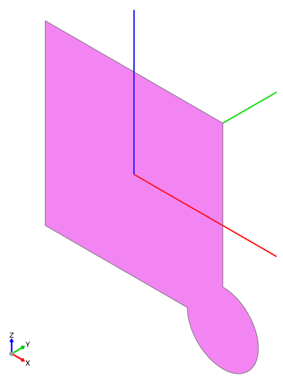

In this case the circle is not positioned in the top right as one would expect; in-fact, the position of the circle randomly
switches between the bottom and top corner.

This is because all sketches are created on a local Plane.XY independent of where they will be ultimately placed;
therefore, the sort_by(Axis.Z) is sorting two points that have a Z value of zero as they are located on Plane.XY and
effectively return a random point.

<!-- PDF page 350 -->

Why does BuildSketch work this way? Consider an example where the user wants to work on a plane not aligned
with any Axis, as follows (this is often done when creating a sketch on a Face of a 3D part but is simulated here by
rotating a Plane):

```python
with BuildSketch(Plane.YZ.rotated((123, 45, 6))) as custom_plane:
```

```python
    Rectangle(1, 1, align=Align.MIN)
    with Locations(vertices().group_by(Axis.X)[-1].sort_by(Axis.Y)[-1]):
```

```python
        Circle(0.2)
```

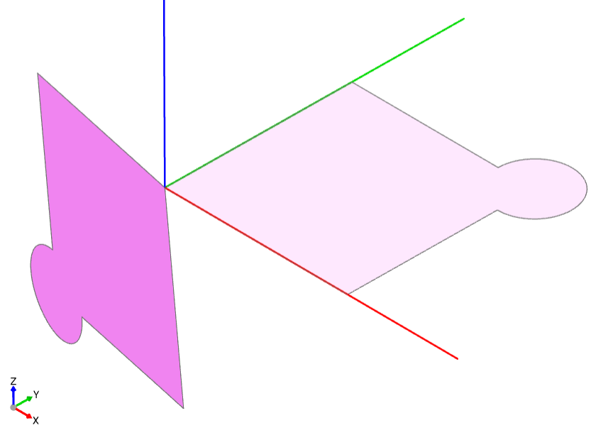

Here one can see both sketch_local (with the light fill on Plane.XY) and the sketch (with the darker fill) placed
on the user provided workplane. As the selectors work off global coordinates, selection of the “top right” of this sketch
would be quite challenging and would likely change if the sketch was ever moved as could happen if the 3D part
changed. For an example of sketching on a 3D part, see Sketching on other Planes.

1.16.12 Why is BuildLine not working as expected within the scope of BuildSketch?

As described above, all sketching is done on a local Plane.XY; however, the following is a common issue:

```python
with BuildSketch() as sketch:
```

```python
    with BuildLine(Plane.XZ):
```

```python
        Polyline(...)
    make_face()
```

Here BuildLine is within the scope of BuildSketch; therefore, all of the drawing should be done on Plane.XY;
however, the user has specified Plane.XZ when creating the BuildLine instance. Although this isn’t absolutely
incorrect it’s almost certainly not what the user intended. Here the face created by make_face will be reoriented to

<!-- PDF page 351 -->

Plane.XY as all sketching must be done on that plane. This reorienting of objects to Plane.XY allows a user to add
content from other sources to the sketch without having to manually re-orient the object.

Unless there is a good reason and the user understands how the BuildLine object will be reoriented, all BuildLine
instances within the scope of BuildSketch should be done on the default Plane.XY.

1.16.13 Don’t Builders inherit workplane/coordinate systems when nested

Some users expect that nested Builders will inherit the workplane or coordinate system from their parent Builder - this
is not true. When a Builder is instantiated, a workplane is either provided by the user or it defaults to Plane.XY. Having
Builders inherent coordinate systems from their parents could result in confusion when they are nested as well as change
their behaviour depending on which scope they are in. Inheriting coordinate systems isn’t necessarily incorrect, it was
considered for build123d but ultimately the simple static approach was taken.


<!-- END tips.md -->


<!-- BEGIN import_export.md -->

---
title: "Import/Export"
source_html: "https://build123d.readthedocs.io/en/latest/import_export.html"
extracted_from: "official ReadTheDocs PDF"
pdf_release: "0.11.1.dev21+gbbce3cdd6"
pdf_pages: "351-364"
generated_on: "2026-07-01"
---

# Import/Export

> Converted to Markdown from the official build123d ReadTheDocs PDF. PDF page markers and local extracted-image links are included for traceability. Some line wrapping reflects the PDF layout.
<!-- PDF page 351 -->

1.17 Import/Export

Methods and functions specific to exporting and importing build123d objects are defined below.

For example:

```python
with BuildPart() as box_builder:
```

```python
    Box(1, 1, 1)
export_step(box_builder.part, "box.step")
```

1.17.1 File Formats

3MF

The 3MF (3D Manufacturing Format) file format is a versatile and modern standard for representing 3D models used in
additive manufacturing, 3D printing, and other applications. Developed by the 3MF Consortium, it aims to overcome
the limitations of traditional 3D file formats by providing a more efficient and feature-rich solution. The 3MF format
supports various advanced features like color information, texture mapping, multi-material definitions, and precise
geometry representation, enabling seamless communication between design software, 3D printers, and other manufac-
turing devices. Its open and extensible nature makes it an ideal choice for exchanging complex 3D data in a compact
and interoperable manner.

BREP

The BREP (Boundary Representation) file format is a widely used data format in computer-aided design (CAD) and
computer-aided engineering (CAE) applications. BREP represents 3D geometry using topological entities like vertices,
edges, and faces, along with their connectivity information. It provides a precise and comprehensive representation of
complex 3D models, making it suitable for advanced modeling and analysis tasks. BREP files are widely supported
by various CAD software, enabling seamless data exchange between different systems. Its ability to represent both
geometric shapes and their topological relationships makes it a fundamental format for storing and sharing detailed 3D
models.

DXF

The DXF (Drawing Exchange Format) file format is a widely used standard for representing 2D and 3D drawings,
primarily used in computer-aided design (CAD) applications. Developed by Autodesk, DXF files store graphical and
geometric data, such as lines, arcs, circles, and text, as well as information about layers, colors, and line weights. Due to
its popularity, DXF files can be easily exchanged and shared between different CAD software. The format’s simplicity
and human-readable structure make it a versatile choice for sharing designs, drawings, and models across various CAD
platforms, facilitating seamless collaboration in engineering and architectural projects.

<!-- PDF page 352 -->

glTF

The glTF (GL Transmission Format) is a royalty-free specification for the efficient transmission and loading of 3D
models and scenes by applications. Developed by the Khronos Group, glTF is designed as a compact, interoperable
format that enables the quick display of assets across various platforms and devices. glTF supports a rich feature set,
including detailed meshes, materials, textures, skeletal animations, and more, facilitating complex 3D visualizations. It
streamlines the process of sharing and deploying 3D content in web applications, game engines, and other visualization
tools, making it the “JPEG of 3D.” glTF’s versatility and efficiency have led to its widespread adoption in the 3D content
industry.

STL

The STL (STereoLithography) file format is a widely used file format in 3D printing and computer-aided design (CAD)
applications. It represents 3D geometry using triangular facets to approximate the surface of a 3D model. STL files
are widely supported and can store both the geometry and color information of the model. They are used for rapid
prototyping and 3D printing, as they provide a simple and efficient way to represent complex 3D objects. The format’s
popularity stems from its ease of use, platform independence, and ability to accurately describe the surface of intricate
3D models with a minimal file size.

STEP

The STEP (Standard for the Exchange of Product model data) file format is a widely used standard for representing 3D
product and manufacturing data in computer-aided design (CAD) and computer-aided engineering (CAE) applications.
It is an ISO standard (ISO 10303) and supports the representation of complex 3D geometry, product structure, and
metadata. STEP files store information in a neutral and standardized format, making them highly interoperable across
different CAD/CAM software systems. They enable seamless data exchange between various engineering disciplines,
facilitating collaboration and data integration throughout the entire product development and manufacturing process.

SVG

The SVG (Scalable Vector Graphics) file format is an XML-based standard used for describing 2D vector graphics.
It is widely supported and can be displayed in modern web browsers, making it suitable for web-based graphics and
interactive applications. SVG files define shapes, paths, text, and images using mathematical equations, allowing for
smooth scalability without loss of quality. The format is ideal for logos, icons, illustrations, and other graphics that
require resolution independence. SVG files are also easily editable in text editors or vector graphic software, making
them a popular choice for designers and developers seeking flexible and versatile graphic representation.

1.17.2 2D Exporters

Exports to DXF (Drawing Exchange Format) and SVG (Scalable Vector Graphics) are provided by the 2D Exporters:
ExportDXF and ExportSVG classes.

DXF is a widely used file format for exchanging CAD (Computer-Aided Design) data between different software ap-
plications. SVG is a widely used vector graphics format that is supported by web browsers and various graphic editors.

The core concept to these classes is the creation of a DXF/SVG document with specific properties followed by the
addition of layers and shapes to the documents. Once all of the layers and shapes have been added, the document can
be written to a file.

3D to 2D Projection

There are a couple ways to generate a 2D drawing of a 3D part:

• Generate a section: The section() operation can be used to create a 2D cross section of a 3D part at a given
plane.

• Generate a projection: The project_to_viewport() method can be used to create a 2D projection of a 3D
scene. Similar to a camera, the viewport_origin defines the location of camera, the viewport_up defines

<!-- PDF page 353 -->

the orientation of the camera, and the look_at parameter defined where the camera is pointed. By default,
viewport_up is the positive z axis and look_up is the center of the shape. The return value is a tuple of lists
of edges, the first the visible edges and the second the hidden edges.

Each of these Edges and Faces can be assigned different line color/types and fill colors as described below (as
project_to_viewport only generates Edges, fill doesn’t apply). The shapes generated from the above steps are
to be added as shapes in one of the exporters described below and written as either a DXF or SVG file as shown in this
example:

```python
view_port_origin=(-100, -50, 30)
visible, hidden = part.project_to_viewport(view_port_origin)
max_dimension = max(*Compound(children=visible + hidden).bounding_box().size)
exporter = ExportSVG(scale=100 / max_dimension)
exporter.add_layer("Visible")
exporter.add_layer("Hidden", line_color=(99, 99, 99), line_type=LineType.ISO_DOT)
exporter.add_shape(visible, layer="Visible")
exporter.add_shape(hidden, layer="Hidden")
exporter.write("part_projection.svg")
```

LineType

ANSI (American National Standards Institute) and ISO (International Organization for Standardization) standards both
define line types in drawings used in DXF and SVG exported drawings:

• ANSI Standards:

– ANSI/ASME Y14.2 - “Line Conventions and Lettering” is the standard that defines line types, line
weights, and line usage in engineering drawings in the United States.

• ISO Standards:

– ISO 128 - “Technical drawings – General principles of presentation” is the ISO standard that covers
the general principles of technical drawing presentation, including line types and line conventions.

– ISO 13567 - “Technical product documentation (TPD) – Organization and naming of layers for CAD”
provides guidelines for the organization and naming of layers in Computer-Aided Design (CAD) sys-
tems, which may include line type information.

These standards help ensure consistency and clarity in technical drawings, making it easier for engineers, designers,
and manufacturers to communicate and interpret the information presented in the drawings.

The line types used by the 2D Exporters are defined by the LineType Enum and are shown in the following diagram:

ExportDXF

class ExportDXF(version: str = 'AC1027', unit: ~build123d.build_enums.Unit = <Unit.MM>, color:
~exporters.ColorIndex | None = None, line_weight: float | None = None, line_type:
~exporters.LineType | None = None)

The ExportDXF class provides functionality for exporting 2D shapes to DXF (Drawing Exchange Format) format.
DXF is a widely used file format for exchanging CAD (Computer-Aided Design) data between different software
applications.

Parameters

• version (str, optional) – The DXF version to use for the output file. Defaults to
ezdxf.DXF2013.

<!-- PDF page 354 -->

• unit (Unit, optional) – The unit used for the exported DXF. It should be one of the Unit
enums: Unit.MC, Unit.MM, Unit.CM, Unit.M, Unit.IN, or Unit.FT. Defaults to Unit.MM.

• color (Optional[ColorIndex], optional) – The default color index for shapes. It can
be specified as a ColorIndex enum or None.. Defaults to None.

• line_weight (Optional[float], optional) – The default line weight (stroke width)
for shapes, in millimeters. . Defaults to None.

• line_type (Optional[LineType], optional) – e default line type for shapes. It should
be a LineType enum or None.. Defaults to None.

Example

```python
     exporter = ExportDXF(unit=Unit.MM, line_weight=0.5)
     exporter.add_layer("Layer 1", color=ColorIndex.RED, line_type=LineType.DASHED)
     exporter.add_shape(shape_object, layer="Layer 1")
     exporter.write("output.dxf")
```

Raises

ValueError – unit not supported

```python
     METRIC_UNITS = {<Unit.CM>, <Unit.M>, <Unit.MM>}
```

add_layer(name: str, *, color: ColorIndex | None = None, line_weight: float | None = None, line_type:
LineType | None = None) →Self

Adds a new layer to the DXF export with the given properties.

Parameters

• name (str) – The name of the layer definition. Must be unique among all layers.

• color (Optional[ColorIndex], optional) – The color index for shapes on this layer.
It can be specified as a ColorIndex enum or None. Defaults to None.

• line_weight (Optional[float], optional) – The line weight (stroke width) for
shapes on this layer, in millimeters. Defaults to None.

• line_type (Optional[LineType], optional) – The line type for shapes on this layer.
It should be a LineType enum or None. Defaults to None.

Returns

DXF document with additional layer

Return type

Self

add_shape(shape: Shape | Iterable[Shape], layer: str = '') →Self

Adds a shape to the specified layer.

Parameters

• shape (Shape | Iterable[Shape]) – The shape or collection of shapes to be added. It
can be a single Shape object or an iterable of Shape objects.

• layer (str, optional) – The name of the layer where the shape will be added. If not
specified, the default layer will be used. Defaults to “”.

Returns

Document with additional shape

<!-- PDF page 355 -->

Return type

Self

write(file_name: PathLike | str | bytes | BytesIO, ascii_format: bool = True)

Writes the DXF data to the specified file name.

Parameters

• file_name (PathLike | str | bytes | BytesIO) – The file name (including path)
where the DXF data will be written.

• ascii_format (bool, optional) – Export the file as ASCII (True) or binary (False)
DXF format. Defaults to True.

ExportSVG

class ExportSVG(unit: ~build123d.build_enums.Unit = <Unit.MM>, scale: float = 1, margin: float = 0,
fit_to_stroke: bool = True, precision: int = 6, fill_color: ~exporters.ColorIndex |
~ezdxf.colors.RGB | ~build123d.geometry.Color | None = None, line_color:
~exporters.ColorIndex | ~ezdxf.colors.RGB | ~build123d.geometry.Color | None =
ColorIndex.BLACK, line_weight: float = 0.09, line_type: ~exporters.LineType =
LineType.CONTINUOUS, dot_length: ~exporters.DotLength | float =
DotLength.INKSCAPE_COMPAT)

SVG file export functionality.

The ExportSVG class provides functionality for exporting 2D shapes to SVG (Scalable Vector Graphics) format.
SVG is a widely used vector graphics format that is supported by web browsers and various graphic editors.

Parameters

• unit (Unit, optional) – The unit used for the exported SVG. It should be one of the Unit
enums: Unit.MM, Unit.CM, or Unit.IN. Defaults to Unit.MM.

• scale (float, optional) – The scaling factor applied to the exported SVG. Defaults to
1.

• margin (float, optional) – The margin added around the exported shapes. Defaults to
0.

• fit_to_stroke (bool, optional) – A boolean indicating whether the SVG view box
should fit the strokes of the shapes. Defaults to True.

• precision (int, optional) – The number of decimal places used for rounding coordi-
nates in the SVG. Defaults to 6.

• fill_color (ColorIndex | RGB | None, optional) – The default fill color for
shapes. It can be specified as a ColorIndex, an RGB tuple, or None. Defaults to None.

• line_color (ColorIndex | RGB | None, optional) – The default line color for
shapes. It can be specified as a ColorIndex or an RGB tuple, or None. Defaults to Ex-
port2D.DEFAULT_COLOR_INDEX.

• line_weight (float, optional) – The default line weight (stroke width) for shapes, in
millimeters. Defaults to Export2D.DEFAULT_LINE_WEIGHT.

• line_type (LineType, optional) – The default line type for shapes. It should be a Line-
Type enum. Defaults to Export2D.DEFAULT_LINE_TYPE.

• dot_length (DotLength | float, optional) – The width of rendered dots in a
Can be either a DotLength enum or a float value in tenths of an inch. Defaults to
DotLength.INKSCAPE_COMPAT.

<!-- PDF page 356 -->

Example

```python
     exporter = ExportSVG(unit=Unit.MM, line_weight=0.5)
     exporter.add_layer("Layer 1", fill_color=(255, 0, 0), line_color=(0, 0, 255))
     exporter.add_shape(shape_object, layer="Layer 1")
     exporter.write("output.svg")
```

Raises

ValueError – Invalid unit.

add_layer(name: str, *, fill_color: ColorIndex | RGB | Color | None = None, line_color: ColorIndex | RGB |
Color | None = ColorIndex.BLACK, line_weight: float = 0.09, line_type: LineType =
LineType.CONTINUOUS) →Self

Adds a new layer to the SVG export with the given properties.

Parameters

• name (str) – The name of the layer. Must be unique among all layers.

• fill_color (ColorIndex | RGB | Color | None, optional) – The fill color for
shapes on this layer. It can be specified as a ColorIndex, an RGB tuple, a Color, or None.
Defaults to None.

• line_color (ColorIndex | RGB | Color | None, optional) – The line color for
shapes on this layer. It can be specified as a ColorIndex or an RGB tuple, a Color, or None.
Defaults to Export2D.DEFAULT_COLOR_INDEX.

• line_weight (float, optional) – The line weight (stroke width) for shapes on this
layer, in millimeters. Defaults to Export2D.DEFAULT_LINE_WEIGHT.

• line_type (LineType, optional) – The line type for shapes on this layer. It should be
a LineType enum. Defaults to Export2D.DEFAULT_LINE_TYPE.

Raises

• ValueError – Duplicate layer name

• ValueError – Unknown linetype

Returns

Drawing with an additional layer

Return type

Self

add_shape(shape: Shape | Iterable[Shape], layer: str = '', reverse_wires: bool = False)

Adds a shape or a collection of shapes to the specified layer.

Parameters

• shape (Shape | Iterable[Shape]) – The shape or collection of shapes to be added. It
can be a single Shape object or an iterable of Shape objects.

• layer (str, optional) – The name of the layer where the shape(s) will be added. De-
faults to “”.

• reverse_wires (bool, optional) – A boolean indicating whether the wires of the
shape(s) should be in reversed direction. Defaults to False.

Raises

ValueError – Undefined layer

<!-- PDF page 357 -->

```python
     write(path: PathLike | str | bytes | BytesIO)
```

Writes the SVG data to the specified file path.

Parameters

path (PathLike | str | bytes | BytesIO) – The file path where the SVG data will be
written.

1.17.3 3D Exporters

export_brep(to_export: Shape, file_path: PathLike | str | bytes | BytesIO | BinaryIO) →bool

Export this shape to a BREP file

Parameters

• to_export (Shape) – object or assembly

• file_path – Union[PathLike, str, bytes, BytesIO]: brep file path or memory buffer

Returns

write status

Return type

bool

export_gltf(to_export: ~build123d.topology.shape_core.Shape, file_path: ~os.PathLike | str | bytes, unit:
~build123d.build_enums.Unit = <Unit.MM>, binary: bool = False, linear_deflection: float = 0.001,
angular_deflection: float = 0.1) →bool

The glTF (GL Transmission Format) specification primarily focuses on the efficient transmission and loading
of 3D models as a compact, binary format that is directly renderable by graphics APIs like WebGL, OpenGL,
and Vulkan. It’s designed to store detailed 3D model data, including meshes (vertices, normals, textures, etc.),
animations, materials, and scene hierarchy, among other aspects.

Parameters

• to_export (Shape) – object or assembly

• file_path (Union[PathLike, str, bytes]) – glTF file path

• unit (Unit, optional) – shape units. Defaults to Unit.MM.

• binary (bool, optional) – output format. Defaults to False.

• linear_deflection (float, optional) – A linear deflection setting which limits the
distance between a curve and its tessellation. Setting this value too low will result in large
meshes that can consume computing resources. Setting the value too high can result in
meshes with a level of detail that is too low. The default is a good starting point for a range
of cases. Defaults to 1e-3.

• angular_deflection (float, optional) – Angular deflection setting which limits the
angle between subsequent segments in a polyline. Defaults to 0.1.

Raises

RuntimeError – Failed to write glTF file

Returns

write status

Return type

bool

<!-- PDF page 358 -->

export_step(to_export: ~build123d.topology.shape_core.Shape, file_path: ~os.PathLike | str | bytes |
~_io.BytesIO | ~typing.BinaryIO, unit: ~build123d.build_enums.Unit = <Unit.MM>, write_pcurves:
bool = True, precision_mode: ~build123d.build_enums.PrecisionMode =
<PrecisionMode.AVERAGE>, *, timestamp: str | ~datetime.datetime | None = None) →bool

Export a build123d Shape or assembly with color and label attributes. Note that if the color of a node in an
assembly isn’t set, it will be assigned the color of its nearest ancestor.

Parameters

• to_export (Shape) – object or assembly

• file_path (Union[PathLike, str, bytes, BytesIO]) – step file path

• unit (Unit, optional) – shape units. Defaults to Unit.MM.

• write_pcurves (bool, optional) – write parametric curves to the STEP file. Defaults
to True.

• precision_mode (PrecisionMode, optional) – geometric data precision. Defaults to
PrecisionMode.AVERAGE.

Raises

RuntimeError – Unknown Compound type

Returns

success

Return type

bool

export_stl(to_export: Shape, file_path: PathLike | str | bytes, tolerance: float = 0.001, angular_tolerance: float =
0.1, ascii_format: bool = False) →bool

Export STL

Exports a shape to a specified STL file.

Parameters

• to_export (Shape) – object or assembly

• file_path (Union[PathLike, str, bytes]) – The path and file name to write the STL
output to.

• tolerance (float, optional) – A linear deflection setting which limits the distance be-
tween a curve and its tessellation. Setting this value too low will result in large meshes that
can consume computing resources. Setting the value too high can result in meshes with a
level of detail that is too low. The default is a good starting point for a range of cases. Defaults
to 1e-3.

• angular_tolerance (float, optional) – Angular deflection setting which limits the
angle between subsequent segments in a polyline. Defaults to 0.1.

• ascii_format (bool, optional) – Export the file as ASCII (True) or binary (False) STL
format. Defaults to False (binary).

Returns

Success

Return type

bool

<!-- PDF page 359 -->

3D Mesh Export

Both 3MF and STL export (and import) are provided with the Mesher class. As mentioned above, the 3MF format it
provides is feature-rich and therefore has a slightly more complex API than the simple Shape exporters.

For example:

```python
# Create the shapes and assign attributes
blue_shape = Solid.make_cone(20, 0, 50)
blue_shape.color = Color("blue")
blue_shape.label = "blue"
blue_uuid = uuid.uuid1()
red_shape = Solid.make_cylinder(5, 50).move(Location((0, -30, 0)))
red_shape.color = Color("red")
red_shape.label = "red"
```

```python
# Create a Mesher instance as an exporter, add shapes and write
exporter = Mesher()
exporter.add_shape(blue_shape, part_number="blue-1234-5", uuid_value=blue_uuid)
exporter.add_shape(red_shape)
exporter.add_meta_data(
    name_space="custom",
    name="test_meta_data",
    value="hello world",
    metadata_type="str",
    must_preserve=False,
)
exporter.add_code_to_metadata()
exporter.write("example.3mf")
exporter.write("example.stl")
```

```python
class Mesher(unit: ~build123d.build_enums.Unit = <Unit.MM>)
```

Tool for exporting and importing meshed objects stored in 3MF or STL files.

Parameters

unit (Unit, optional) – model units. Defaults to Unit.MM.

```python
     add_code_to_metadata()
```

Add the code calling this method to the 3MF metadata with the custom name space build123d, name equal
to the base file name and the type as python

add_meta_data(name_space: str, name: str, value: str, metadata_type: str, must_preserve: bool)

Add meta data to the models

Parameters

• name_space (str) – categorizer of different metadata entries

• name (str) – metadata label

• value (str) – metadata content

• metadata_type (str) – metadata type

• must_preserve (bool) – metadata must not be removed if unused

<!-- PDF page 360 -->

add_shape(shape: ~build123d.topology.shape_core.Shape |
~collections.abc.Iterable[~build123d.topology.shape_core.Shape], linear_deflection: float =
0.001, angular_deflection: float = 0.1, mesh_type: ~build123d.build_enums.MeshType =
<MeshType.MODEL>, part_number: str | None = None, uuid_value: ~uuid.UUID | None =
None)

Add a shape to the 3MF/STL file.

Parameters

```python
                • shape (Union[Shape, Iterable[Shape]]) – build123d object
```

• linear_deflection (float, optional) – mesh control for edges. Defaults to 0.001.

• angular_deflection (float, optional) – mesh control for non-planar surfaces. De-
faults to 0.1.

• mesh_type (MeshType, optional) – 3D printing use of mesh. Defaults to
MeshType.MODEL.

• part_number (str, optional) – part #. Defaults to None.

• uuid_value (uuid, optional) – value from uuid package. Defaults to None.

Raises

• RuntimeError – 3mf mesh is invalid

• Warning – Degenerate shape skipped

• Warning – 3mf mesh is not manifold

get_mesh_properties() →list[dict]

Retrieve the properties from all the meshes

get_meta_data() →list[dict]

Retrieve all of the metadata

get_meta_data_by_key(name_space: str, name: str) →dict

Retrieve the metadata value and type for the provided name space and name

```python
     property library_version:  str
```

3MF Consortium Lib#MF version

```python
     property mesh_count:  int
```

Number of meshes in the model

```python
     property model_unit:  Unit
```

Unit used in the model

read(file_name: PathLike | str | bytes) →list[Shape]

Parameters

• Union[PathLike (file_name) – file path

• str – file path

• bytes] – file path

Raises

ValueError – Unknown file format - must be 3mf or stl

Returns

build123d shapes extracted from mesh file

<!-- PDF page 361 -->

Return type

list[Shape]

```python
     property triangle_counts:  list[int]
```

Number of triangles in each of the model’s meshes

```python
     property vertex_counts:  list[int]
```

Number of vertices in each of the models’s meshes

```python
     write(file_name: PathLike | str | bytes)
```

Parameters

• Union[Pathlike (file_name) – file path

• str – file path

• bytes] – file path

Raises

ValueError – Unknown file format - must be 3mf or stl

write_stream(stream: BytesIO, file_type: Literal['3mf', 'stl'])

Parameters

• stream (BytesIO) – byte stream

• file_type – output mesh format, either “3mf” or “stl”

Raises

ValueError – Unknown file format - must be 3mf or stl

Note

If you need to align multiple components for 3D printing, you can use the pack() function to arrange the objects
side by side and align them on the same plane. This ensures that your components are well-organized and ready for
the printing process.

1.17.4 2D Importers

import_dxf(dxf_file: str | PathLike | TextIO | BinaryIO) →ShapeList

Import shapes from a DXF file

Parameters

dxf_file (str | PathLike | TextIO | BinaryIO) – dxf file path or readable stream

Raises

DXFStructureError – file not found

Returns

build123d objects

Return type

ShapeList

import_svg(svg_file: str | Path | TextIO, *, flip_y: bool = True, align: Align | tuple[Align, Align] | None =
Align.MIN, ignore_visibility: bool = False, label_by: Literal['id', 'class', 'inkscape:label'] | str = 'id')
→ShapeList[Wire | Face]

<!-- PDF page 362 -->

import_svg(svg_file: str | Path | TextIO, *, flip_y: bool = True, align: Align | tuple[Align, Align] | None =
Align.MIN, ignore_visibility: bool = False, label_by: Literal['id', 'class', 'inkscape:label'] | str = 'id',
is_inkscape_label: bool | None = None) →ShapeList[Wire | Face]

import_svg

Parameters

• svg_file (Union[str, Path, TextIO]) – svg file

• flip_y (bool, optional) – flip objects to compensate for svg orientation. Defaults to
True.

• align (Align | tuple[Align, Align] | None, optional) – alignment of the
SVG’s viewbox, if None, the viewbox’s origin will be at (0,0,0). Defaults to Align.MIN.

• ignore_visibility (bool, optional) – Defaults to False.

• label_by (str, optional) – XML attribute to use for imported shapes’ label property.
Defaults to “id”. Use inkscape:label to read labels set from Inkscape’s “Layers and Objects”
panel.

Raises

ValueError – unexpected shape type

Returns

objects contained in svg

Return type

ShapeList[Union[Wire, Face]]

import_svg_as_buildline_code(file_name: PathLike | str | bytes, precision: int = 6) →tuple[str, str]

translate_to_buildline_code

Translate the contents of the given svg file into executable build123d/BuildLine code.

Parameters

• file_name (PathLike | str | bytes]) – svg file name

• precision (int) – # digits to round values to. Defaults to # digits in TOLERANCE

Returns

code, builder instance name

Return type

tuple[str, str]

1.17.5 3D Importers

import_brep(file_name: PathLike | str | bytes) →Shape

Import shape from a BREP file

Parameters

file_name (Union[PathLike, str, bytes]) – brep file

Raises

ValueError – file not found

Returns

build123d object

Return type

Shape

<!-- PDF page 363 -->

import_step(filename: PathLike | str | bytes) →Compound

Extract shapes from a STEP file and return them as a Compound object.

Parameters

file_name (Union[PathLike, str, bytes]) – file path of STEP file to import

Raises

ValueError – can’t open file

Returns

contents of STEP file

Return type

Compound

import_stl(file_name: ~os.PathLike | str | bytes, model_unit: ~build123d.build_enums.Unit = <Unit.MM>) →
Face

Extract shape from an STL file and return it as a Face reference object.

Note that importing with this method and creating a reference is very fast while creating an editable model (with
Mesher) may take minutes depending on the size of the STL file.

Parameters

• file_name (Union[PathLike, str, bytes]) – file path of STL file to import

• model_unit (Unit, optional) – the default unit used when creating the model. For ex-
ample, Blender defaults to Unit.M. Defaults to Unit.MM.

Raises

• ValueError – Could not import file

• ValueError – Invalid model_unit

Returns

STL model

Return type

Face

STL Reconstruction

The detect_primitives() helper can be used during STL reconstruction to detect analytic planes, cylinders, and
spheres in a mesh-like shape and generate algebra-mode code fragments to aid manual redesign.

See Tutorial: Reconstructing a Design from an STL for the full workflow and limitations.

detect_primitives(mesh: Shape) →tuple[ShapeList[Face], ShapeList[Face], list[str]]

Detect analytic primitives in a mesh and return faces, leftovers, and code.

This is the user-facing entry point for STL-to-BREP reconstruction. The mesh is indexed first so face geometry
and adjacency can be reused throughout the pipeline.

Detection proceeds in stages:

1. High-confidence planes are found first from cleaned proxy faces.

2. Spheres are found next from broad radius-signature classification, connected or sewn regions, local sphere
fitting, and region growth.

3. Cylinders are detected from area-grouped sewn regions and local cylinder seeds, then grown, refit, and
validated.

<!-- PDF page 364 -->

4. Remaining coplanar connected components are detected as fallback planes.

Each accepted patch is converted into a build123d Face, unmatched mesh faces are returned as leftovers, and the
generated code strings are sorted in the same order as the returned primitives.

3D Mesh Import

Both 3MF and STL import (and export) are provided with the Mesher class.

For example:

```python
importer = Mesher()
cone, cyl = importer.read("example.3mf")
print(
```

```python
    f"{importer.mesh_count=}, {importer.vertex_counts=}, {importer.triangle_counts=}"
)
print(f"Imported model unit: {importer.model_unit}")
print(f"{cone.label=}")
print(f"{cone.color.to_tuple()=}")
print(f"{cyl.label=}")
print(f"{cyl.color.to_tuple()=}")
```

```python
importer.mesh_count=2, importer.vertex_counts=[66, 52], importer.triangle_counts=[128,␣
```

```python
˓→100]
Imported model unit: Unit.MM
cone.label='blue'
cone.color.to_tuple()=(0.0, 0.0, 1.0, 1.0)
cyl.label='red'
cyl.color.to_tuple()=(1.0, 0.0, 0.0, 1.0)
```


<!-- END import_export.md -->


<!-- BEGIN advanced.md -->

---
title: "Advanced Topics"
source_html: "https://build123d.readthedocs.io/en/latest/advanced.html"
extracted_from: "official ReadTheDocs PDF"
pdf_release: "0.11.1.dev21+gbbce3cdd6"
pdf_pages: "364"
generated_on: "2026-07-01"
---

# Advanced Topics

> Converted to Markdown from the official build123d ReadTheDocs PDF. PDF page markers and local extracted-image links are included for traceability. Some line wrapping reflects the PDF layout.
<!-- PDF page 364 -->

1.18 Advanced Topics


<!-- END advanced.md -->


<!-- BEGIN algebra_performance.md -->

---
title: "Performance considerations in algebra mode"
source_html: "https://build123d.readthedocs.io/en/latest/algebra_performance.html"
extracted_from: "official ReadTheDocs PDF"
pdf_release: "0.11.1.dev21+gbbce3cdd6"
pdf_pages: "364-365"
generated_on: "2026-07-01"
---

# Performance considerations in algebra mode

> Converted to Markdown from the official build123d ReadTheDocs PDF. PDF page markers and local extracted-image links are included for traceability. Some line wrapping reflects the PDF layout.
<!-- PDF page 364 -->

1.18.1 Performance considerations in algebra mode

Creating lots of Shapes in a loop means for every step fuse and clean will be called. In an example like the below,
both functions get slower and slower the more objects are already fused. Overall it takes on an M1 Mac 4.76 sec.

```python
diam = 80
holes = Sketch()
r = Rectangle(2, 2)
for loc in GridLocations(4, 4, 20, 20):
```

```python
    if loc.position.X**2 + loc.position.Y**2 < (diam / 2 - 1.8) ** 2:
        holes += loc * r
```

```python
c = Circle(diam / 2) - holes
```

One way to avoid it is to use lazy evaluation for the algebra operations. Just collect all objects and then call fuse (+)
once with all objects and clean once. Overall it takes 0.19 sec.

```python
r = Rectangle(2, 2)
holes = [
    loc * r
    for loc in GridLocations(4, 4, 20, 20).locations
    if loc.position.X**2 + loc.position.Y**2 < (diam / 2 - 1.8) ** 2
```

<!-- PDF page 365 -->

]

```python
c = Circle(diam / 2) - holes
```

Another way to leverage the vectorized algebra operations is to add a list comprehension of objects to an empty Part,
Sketch or Curve:

```python
polygons = Sketch() + [
    loc * RegularPolygon(radius=5, side_count=5)
    for loc in GridLocations(40, 30, 2, 2)
]
```

This again ensures one single fuse and clean call.


<!-- END algebra_performance.md -->


<!-- BEGIN location_arithmetic.md -->

---
title: "Location arithmetic for algebra mode"
source_html: "https://build123d.readthedocs.io/en/latest/location_arithmetic.html"
extracted_from: "official ReadTheDocs PDF"
pdf_release: "0.11.1.dev21+gbbce3cdd6"
pdf_pages: "365-370"
generated_on: "2026-07-01"
---

# Location arithmetic for algebra mode

> Converted to Markdown from the official build123d ReadTheDocs PDF. PDF page markers and local extracted-image links are included for traceability. Some line wrapping reflects the PDF layout.
<!-- PDF page 365 -->

1.18.2 Location arithmetic for algebra mode

Position a shape relative to the XY plane

For the following use the helper function:

```python
def location_symbol(location: Location, scale: float = 1) -> Compound:
```

```python
    return Compound.make_triad(axes_scale=scale).locate(location)
```

```python
def plane_symbol(plane: Plane, scale: float = 1) -> Compound:
    triad = Compound.make_triad(axes_scale=scale)
    circle = Circle(scale * .8).edge()
    return (triad + circle).locate(plane.location)
```

1. Positioning at a location

```python
         loc = Location((0.1, 0.2, 0.3), (10, 20, 30))
```

```python
         face = loc * Rectangle(1, 2)
```

```python
         show_object(face, name="face")
         show_object(location_symbol(loc), name="location")
```

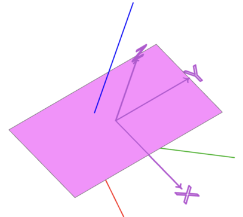

2) Positioning on a plane

<!-- PDF page 366 -->

```python
         plane = Plane.XZ
```

```python
         face = plane * Rectangle(1, 2)
```

```python
         show_object(face, name="face")
         show_object(plane_symbol(plane), name="plane")
```

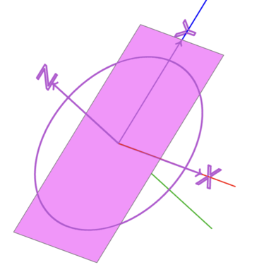

Note: The x-axis and the y-axis of the plane are on the x-axis and the z-axis of the world coordinate system (red and
blue axis).

Relative positioning to a plane

1. Position an object on a plane relative to the plane

```python
         loc = Location((0.1, 0.2, 0.3), (10, 20, 30))
```

```python
         face = loc * Rectangle(1,2)
```

```python
         box = Plane(loc) * Pos(0.2, 0.4, 0.1) * Box(0.2, 0.2, 0.2)
         # box = Plane(face.location) * Pos(0.2, 0.4, 0.1) * Box(0.2, 0.2, 0.2)
         # box = loc * Pos(0.2, 0.4, 0.1) * Box(0.2, 0.2, 0.2)
```

```python
         show_object(face, name="face")
         show_object(location_symbol(loc), name="location")
         show_object(box, name="box")
```

<!-- PDF page 367 -->

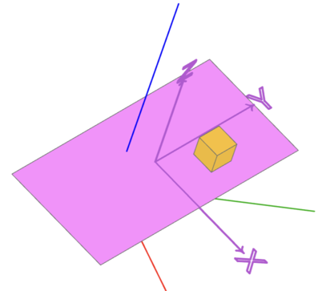

The X, Y, Z components of Pos(0.2, 0.4, 0.1) are relative to the x-axis, y-axis or z-axis of the underlying location
loc.

Note: Plane(loc) *, Plane(face.location) * and loc * are equivalent in this example.

2. Rotate an object on a plane relative to the plane

```python
         loc = Location((0.1, 0.2, 0.3), (10, 20, 30))
```

```python
         face = loc * Rectangle(1,2)
```

```python
         box = Plane(loc) * Rot(Z=80) * Box(0.2, 0.2, 0.2)
```

```python
         show_object(face, name="face")
         show_object(location_symbol(loc), name="location")
         show_object(box, name="box")
```

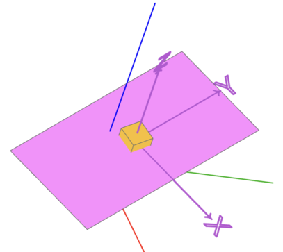

The box is rotated via Rot(Z=80) around the z-axis of the underlying location (and not of the z-axis of the world).

More general:

```python
     loc = Location((0.1, 0.2, 0.3), (10, 20, 30))
```

<!-- PDF page 368 -->

```python
                                                                 (continued from previous page)
     face = loc * Rectangle(1,2)
```

```python
     box = loc * Rot(20, 40, 80) * Box(0.2, 0.2, 0.2)
```

```python
     show_object(face, name="face")
     show_object(location_symbol(loc), name="location")
     show_object(box, name="box")
```


The box is rotated via Rot(20, 40, 80) around all three axes relative to the plane.

3. Rotate and position an object relative to a location

```python
         loc = Location((0.1, 0.2, 0.3), (10, 20, 30))
```

```python
         face = loc * Rectangle(1,2)
```

```python
         box = loc * Rot(20, 40, 80) * Pos(0.2, 0.4, 0.1) * Box(0.2, 0.2, 0.2)
```

```python
         show_object(face, name="face")
         show_object(location_symbol(loc), name="location")
         show_object(box, name="box")
         show_object(location_symbol(loc * Rot(20, 40, 80), 0.5), options=
```

```python
         ˓→{"color":(0, 255, 255)}, name="local_location")
```

<!-- PDF page 369 -->

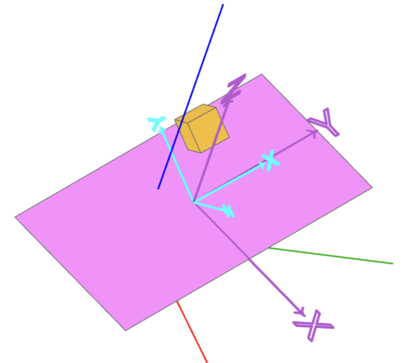

The box is positioned via Pos(0.2, 0.4, 0.1) relative to the location loc * Rot(20, 40, 80)

4. Position and rotate an object relative to a location

```python
         loc = Location((0.1, 0.2, 0.3), (10, 20, 30))
```

```python
         face = loc * Rectangle(1,2)
```

```python
         box = loc * Pos(0.2, 0.4, 0.1) * Rot(20, 40, 80) * Box(0.2, 0.2, 0.2)
```

```python
         show_object(face, name="face")
         show_object(location_symbol(loc), name="location")
         show_object(box, name="box")
         show_object(location_symbol(loc * Pos(0.2, 0.4, 0.1), 0.5), options=
```

```python
         ˓→{"color":(0, 255, 255)}, name="local_location")
```

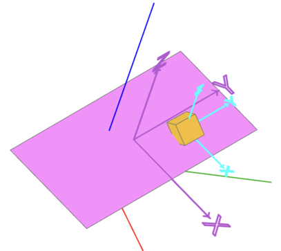

```python
Note: This is the same as box = loc * Location((0.2, 0.4, 0.1), (20, 40, 80)) * Box(0.2, 0.2, 0.
2)
```


<!-- END location_arithmetic.md -->


<!-- BEGIN algebra_definition.md -->

---
title: "Algebraic definition"
source_html: "https://build123d.readthedocs.io/en/latest/algebra_definition.html"
extracted_from: "official ReadTheDocs PDF"
pdf_release: "0.11.1.dev21+gbbce3cdd6"
pdf_pages: "370-371"
generated_on: "2026-07-01"
---

# Algebraic definition

> Converted to Markdown from the official build123d ReadTheDocs PDF. PDF page markers and local extracted-image links are included for traceability. Some line wrapping reflects the PDF layout.
<!-- PDF page 370 -->

1.18.3 Algebraic definition

Objects and arithmetic

Set definitions:

𝐶3 is the set of all Part objects p with p._dim = 3

𝐶2 is the set of all Sketch objects s with s._dim = 2

𝐶1 is the set of all Curve objects c with c._dim = 1

Neutral elements:

𝑐3 0 is the empty Part object p0 = Part() with p0._dim = 3 and p0.wrapped = None

𝑐2 0 is the empty Sketch object s0 = Sketch() with s0._dim = 2 and s0.wrapped = None

𝑐1 0 is the empty Curve object c0 = Curve() with c0._dim = 1 and c0.wrapped = None

Sets of predefined basic shapes:

𝐵3 := { Part, Box, Cylinder, Cone, Sphere, Torus, Wedge, Hole, CounterBoreHole, CounterSinkHole }

𝐵2 := { Sketch, Rectangle, Circle, Ellipse, Rectangle, Polygon, RegularPolygon, Text, Trapezoid,
SlotArc, SlotCenterPoint, SlotCenterToCenter, SlotOverall }

𝐵1   :=   { Curve, Bezier, FilletPolyline, PolarLine, Polyline, Spline, Helix, CenterArc,
EllipticalCenterArc,  ParabolicCenterArc,  HyperbolicCenterArc,   RadiusArc,  SagittaArc,
TangentArc, ThreePointArc, JernArc }

with 𝐵3 ⊂𝐶3, 𝐵2 ⊂𝐶2 and 𝐵1 ⊂𝐶1

Operations:

+ : 𝐶𝑛× 𝐶𝑛→𝐶𝑛with (𝑎, 𝑏) ↦→𝑎+ 𝑏, for 𝑛= 1, 2, 3

𝑎+ 𝑏:= a.fuse(b) for each operation

−: 𝐶𝑛→𝐶𝑛with 𝑎↦→−𝑎, for 𝑛= 1, 2, 3

𝑏+ (−𝑎) := b.cut(a) for each operation (implicit definition)

& : 𝐶𝑛× 𝐶𝑛→𝐶𝑛with (𝑎, 𝑏) ↦→𝑎& 𝑏, for 𝑛= 2, 3

𝑎& 𝑏:= a.intersect(b) for each operation

• & is not defined for 𝑛= 1 in build123d

• The following relationship holds: 𝑎& 𝑏= (𝑎+ 𝑏) + −(𝑎+ (−𝑏)) + −(𝑏+ (−𝑎))

Abelian groups

(𝐶𝑛, 𝑐𝑛 0, +, −) are abelian groups for 𝑛= 1, 2, 3.

• The implementation a - b = a.cut(b) needs to be read as 𝑎+ (−𝑏) since the group does not have a binary
- operation. As such, 𝑎−(𝑏−𝑐) = 𝑎+ −(𝑏+ −𝑐)) ̸= 𝑎−𝑏+ 𝑐

• This definition also includes that neither - nor & are commutative.

Locations, planes and location arithmetic

Set definitions:

𝐿:= { Location((x, y, z), (a, b, c)) : 𝑥, 𝑦, 𝑧∈𝑅∧𝑎, 𝑏, 𝑐∈𝑅}

with 𝑎, 𝑏, 𝑐being angles in degrees.

𝑃:= { Plane(o, x, z) : 𝑜, 𝑥, 𝑧𝑅3 ∧‖𝑥‖ = ‖𝑧‖ = 1}

<!-- PDF page 371 -->

with o being the origin and x, z the x- and z-direction of the plane.

Neutral element: 𝑙0 ∈𝐿: Location()

Operations:

* : 𝐿× 𝐿→𝐿with (𝑙1, 𝑙2) ↦→𝑙1 * 𝑙2

𝑙1 * 𝑙2 := l1 * l2 (multiply two locations)

* : 𝑃× 𝐿→𝑃with (𝑝, 𝑙) ↦→𝑝* 𝑙

𝑝* 𝑙:= Plane(p.location * l) (move plane 𝑝∈𝑃to location 𝑙∈𝐿)

Inverse element: 𝑙−1 ∈𝐿: l.inverse()

Placing objects onto planes

* : 𝑃× 𝐶𝑛→𝐶𝑛with (𝑝, 𝑐) ↦→𝑝* 𝑐, for 𝑛= 1, 2, 3

Locate an object 𝑐∈𝐶𝑛onto plane 𝑝∈𝑃, i.e. c.moved(p.location)

Placing objects at locations

* : 𝐿× 𝐶𝑛→𝐶𝑛with (𝑙, 𝑐) ↦→𝑙* 𝑐, for 𝑛= 1, 2, 3

Locate an object 𝑐∈𝐶𝑛at location 𝑙∈𝐿, i.e. c.moved(l)


<!-- END algebra_definition.md -->


<!-- BEGIN center.md -->

---
title: "CAD Object Centers"
source_html: "https://build123d.readthedocs.io/en/latest/center.html"
extracted_from: "official ReadTheDocs PDF"
pdf_release: "0.11.1.dev21+gbbce3cdd6"
pdf_pages: "371"
generated_on: "2026-07-01"
---

# CAD Object Centers

> Converted to Markdown from the official build123d ReadTheDocs PDF. PDF page markers and local extracted-image links are included for traceability. Some line wrapping reflects the PDF layout.
<!-- PDF page 371 -->

1.18.4 CAD Object Centers

Finding the center of a CAD object is a surprisingly complex operation. To illustrate let’s consider two examples: a
simple isosceles triangle and a curved line (their bounding boxes are shown with dashed lines):

One can see that there is are significant differences between the different types of centers. To allow the designer to
choose the center that makes the most sense for the given shape there are three possible values for the CenterOf
Enum:

CenterOf                Symbol   1D   2D  3D   Compound

CenterOf.BOUNDING_BOX            ✓    ✓   ✓    ✓
CenterOf.GEOMETRY                ✓    ✓
CenterOf.MASS                    ✓    ✓   ✓    ✓


<!-- END center.md -->


<!-- BEGIN debugging_logging.md -->

---
title: "Debugging & Logging"
source_html: "https://build123d.readthedocs.io/en/latest/debugging_logging.html"
extracted_from: "official ReadTheDocs PDF"
pdf_release: "0.11.1.dev21+gbbce3cdd6"
pdf_pages: "371-373"
generated_on: "2026-07-01"
---

# Debugging & Logging

> Converted to Markdown from the official build123d ReadTheDocs PDF. PDF page markers and local extracted-image links are included for traceability. Some line wrapping reflects the PDF layout.
<!-- PDF page 371 -->

1.18.5 Debugging & Logging

Debugging problems with your build123d design involves the same techniques one would use to debug any Python
source code; however, there are some specific techniques that might be of assistance. The following sections describe
these techniques.

Python Debugger

Many Python IDEs have step by step debugging systems that can be used to walk through your code monitoring its
operation with full visibility of all Python objects. Here is a screenshot of the Visual Studio Code debugger in action:

<!-- PDF page 372 -->


This shows that a break-point has been encountered and the code operation has been stopped. From here all of the
Python variables are visible and the system is waiting on input from the user on how to proceed. One can enter the
code that assigns top_face by pressing the down arrow button on the top right. Following code execution like this is
a very powerful debug technique.

Logging

Build123d support standard python logging and generates its own log stream. If one is using cq-editor as a display
system there is a built in Log viewer tab that shows the current log stream - here is an example of a log stream:

```python
[18:43:44.678646] INFO: Entering BuildPart with mode=Mode.ADD which is in different␣
```

```python
˓→scope as parent
[18:43:44.679233] INFO: WorkplaneList is pushing 1 workplanes: [Plane(o=(0.00, 0.00, 0.
```

```python
˓→00), x=(1.00, 0.00, 0.00), z=(0.00, 0.00, 1.00))]
[18:43:44.679888] INFO: LocationList is pushing 1 points: [(p=(0.00, 0.00, 0.00), o=(-0.
```

```python
˓→00, 0.00, -0.00))]
[18:43:44.681751] INFO: BuildPart context requested by Box
[18:43:44.685950] INFO: Completed integrating 1 object(s) into part with Mode=Mode.ADD
[18:43:44.690072] INFO: GridLocations is pushing 4 points: [(p=(-30.00, -20.00, 0.00),␣
```

```python
˓→o=(-0.00, 0.00, -0.00)), (p=(-30.00, 20.00, 0.00), o=(-0.00, 0.00, -0.00)), (p=(30.00,␣
```

```python
˓→-20.00, 0.00), o=(-0.00, 0.00, -0.00)), (p=(30.00, 20.00, 0.00), o=(-0.00, 0.00, -0.
```

```python
˓→00))]
[18:43:44.691604] INFO: BuildPart context requested by Hole
[18:43:44.724628] INFO: Completed integrating 4 object(s) into part with Mode=Mode.
```

```python
˓→SUBTRACT
[18:43:44.728681] INFO: GridLocations is popping 4 points
[18:43:44.747358] INFO: BuildPart context requested by chamfer
[18:43:44.762429] INFO: Completed integrating 1 object(s) into part with Mode=Mode.
```

```python
˓→REPLACE
[18:43:44.765380] INFO: LocationList is popping 1 points
[18:43:44.766106] INFO: WorkplaneList is popping 1 workplanes
[18:43:44.766729] INFO: Exiting BuildPart
```

The build123d logger is defined by:

<!-- PDF page 373 -->

```python
logging.getLogger("build123d").addHandler(logging.NullHandler())
logger = logging.getLogger("build123d")
```

To export logs to a file, the following configuration is recommended:

```python
logging.basicConfig(
    filename="myapp.log",
    level=logging.INFO,
    format="%(name)s-%(levelname)s %(asctime)s - [%(filename)s:%(lineno)s - \
    %(funcName)20s() ] - %(message)s",
)
```

Logs can be easily placed in your code - here is an example:

```python
logger.info("Exiting %s", type(self).__name__)
```

Printing

Sometimes the best debugging aid is just placing a print statement in your code. Many of the build123d classes are
setup to provide useful information beyond their class and location in memory, as follows:

```python
plane = Plane.XY.offset(1)
print(f"{plane=}")
```

```python
plane=Plane(o=(0.00, 0.00, 1.00), x=(1.00, 0.00, 0.00), z=(0.00, 0.00, 1.00))
```

which shows the origin, x direction, and z direction of the plane.


<!-- END debugging_logging.md -->


<!-- BEGIN cheat_sheet.md -->

---
title: "Cheat Sheet"
source_html: "https://build123d.readthedocs.io/en/latest/cheat_sheet.html"
extracted_from: "official ReadTheDocs PDF"
pdf_release: "0.11.1.dev21+gbbce3cdd6"
pdf_pages: "373-378"
generated_on: "2026-07-01"
---

# Cheat Sheet

> Converted to Markdown from the official build123d ReadTheDocs PDF. PDF page markers and local extracted-image links are included for traceability. Some line wrapping reflects the PDF layout.
<!-- PDF page 373 -->

1.19 Cheat Sheet

Stateful Contexts

```python
BuildLine BuildPart BuildSketch
GridLocations HexLocations Locations PolarLocations
```

Objects        1D - BuildLine

```python
Airfoil
ArcArcTangentArc
ArcArcTangentLine
Bezier
BlendCurve
BSpline
CenterArc
ConstrainedArcs
ConstrainedLines
DoubleTangentArc
EllipticalCenterArc
ParabolicCenterArc
HyperbolicCenterArc
FilletPolyline
Helix
```

<!-- PDF page 374 -->

```python
IntersectingLine
JernArc
Line
PointArcTangentArc
PointArcTangentLine
PolarLine
Polyline
RadiusArc
SagittaArc
Spline
TangentArc
ThreePointArc
```

2D - BuildSketch

```python
Arrow
ArrowHead
Circle
DimensionLine
Ellipse
ExtensionLine
Polygon
Rectangle
RectangleRounded
RegularPolygon
SlotArc
SlotCenterPoint
SlotCenterToCenter
SlotOverall
Text
TechnicalDrawing
Trapezoid
Triangle
```

3D - BuildPart

```python
Box
Cone
ConvexPolyhedron
CounterBoreHole
CounterSinkHole
Cylinder
Hole
Sphere
Torus
Wedge
```

Operations        1D - BuildLine

```python
add()
bounding_box()
```

<!-- PDF page 375 -->

```python
mirror()
offset()
project()
scale()
split()
```

2D - BuildSketch

```python
add()
chamfer()
fillet()
full_round()
make_face()
make_hull()
mirror()
offset()
project()
scale()
split()
sweep()
trace()
```

3D - BuildPart

```python
add()
chamfer()
draft()
extrude()
fillet()
loft()
make_brake_formed()
mirror()
offset()
project()
revolve()
scale()
section()
split()
sweep()
```

Selectors       1D - BuildLine

```python
vertices()
edges()
wires()
```

2D - BuildSketch

```python
vertices()
edges()
wires()
faces()
```

<!-- PDF page 376 -->

3D - BuildPart

```python
vertices()
edges()
wires()
faces()
solids()
```

Selector Operators

Operator  Operand                Method

>         Axis, Edge, Wire, SortBy sort_by()
<         Axis, Edge, Wire, SortBy sort_by()
>>        Axis, Edge, Wire, SortBy group_by()[-1]
<<        Axis, Edge, Wire, SortBy group_by()[0]
|         Axis, Plane, GeomType  filter_by()
[]                               python indexing / slicing
Axis                   filter_by_position()

Edge and Wire Operators

Operator  Operand         Method         Description

@         0.0 <= float <= 1.0 position_at() Position as Vector along object
%         0.0 <= float <= 1.0 tangent_at() Tangent as Vector along object
^         0.0 <= float <= 1.0 location_at() Location along object

Shape Operators

Operator  Operand            Method      Description

==        Any                is_same()   Compare CAD objects not including meta data
+         Shape | Iterable[Shape]        Add CAD objects
-         Shape | Iterable[Shape]        Subtract CAD objects
&         Shape | Iterable[Shape]        Intersect CAD objects

Plane Operators

Operator  Operand         Description

==        Plane           Check for equality
!=        Plane           Check for inequality
-         Plane           Reverse direction of normal
*         Location | Shape Relocate

Location Operators

<!-- PDF page 377 -->

Operator  Operand                                Description

==        Location                               Check for equality
!=        Location                               Check for inequality
-         Location                               Reverse direction of normal
&         Axis | Location | Plane | VectorLike | Shape Intersect
*         Shape | Location | Iterable[Location]  Relocate

Vector Operators

Operator  Operand  Method      Description

+         Vector   add()       add
-         Vector   sub()       subtract
*         float    multiply()  multiply by scalar
/         float    multiply()  divide by scalar

Vertex Operators

Operator  Operand  Method

```python
                                +        Vertex    add()
                                -        Vertex    sub()
```

Enums

<!-- PDF page 378 -->

Align      MIN, CENTER, MAX
ApproxOptionARC, NONE, SPLINE
AngularDirection CLOCKWISE, COUNTER_CLOCKWISE
CenterOf   GEOMETRY, MASS, BOUNDING_BOX
Extrinsic  XYZ, XZY, YZX, YXZ, ZXY, ZYX, XYX, XZX, YZY, YXY, ZXZ, ZYZ
FontStyle  REGULAR, BOLD, BOLDITALIC, ITALIC
FrameMethodCORRECTED, FRENET
GeomType   BEZIER, BSPLINE, CIRCLE, CONE, CYLINDER, ELLIPSE, EXTRUSION, HYPERBOLA,
LINE, OFFSET, OTHER, PARABOLA, PLANE, REVOLUTION, SPHERE, TORUS
Intrinsic  XYZ, XZY, YZX, YXZ, ZXY, ZYX, XYX, XZX, YZY, YXY, ZXZ, ZYZ
HeadType   CURVED, FILLETED, STRAIGHT
Keep       ALL, TOP, BOTTOM, BOTH, INSIDE, OUTSIDE
Kind       ARC, INTERSECTION, TANGENT
LengthMode DIAGONAL, HORIZONTAL, VERTICAL
MeshType   OTHER, MODEL, SUPPORT, SOLIDSUPPORT
Mode       ADD, SUBTRACT, INTERSECT, REPLACE, PRIVATE
NumberDisplay DECIMAL, FRACTION
PageSize   A0, A1, A2, A3, A4, A5, A6, A7, A8, A9, A10, LEDGER, LEGAL, LETTER
PositionModeLENGTH, PARAMETER
PrecisionMode LEAST, AVERAGE, GREATEST, SESSION
Select     ALL, LAST, NEW
Side       BOTH, LEFT, RIGHT
SortBy     LENGTH, RADIUS, AREA, VOLUME, DISTANCE
TextAlign  BOTTOM, CENTER, LEFT, RIGHT, TOP, TOPFIRSTLINE
Transition RIGHT, ROUND, TRANSFORMED
Unit       MC, MM, CM, M, IN, FT
Until      FIRST, LAST, NEXT, PREVIOUS


<!-- END cheat_sheet.md -->


<!-- BEGIN external.md -->

---
title: "External Tools and Libraries"
source_html: "https://build123d.readthedocs.io/en/latest/external.html"
extracted_from: "official ReadTheDocs PDF"
pdf_release: "0.11.1.dev21+gbbce3cdd6"
pdf_pages: "378-381"
generated_on: "2026-07-01"
---

# External Tools and Libraries

> Converted to Markdown from the official build123d ReadTheDocs PDF. PDF page markers and local extracted-image links are included for traceability. Some line wrapping reflects the PDF layout.
<!-- PDF page 378 -->

1.20 External Tools and Libraries

The following sections describe tools and libraries external to build123d that extend its functionality.

1.20.1 Editors & Viewers

ocp-vscode

A viewer for OCP based Code-CAD (CadQuery, build123d) integrated into VS Code.

See: ocp-vscode (formerly known as cq_vscode)

Watch Jern create three build123d designs in realtime with Visual Studio Code and the ocp-vscode viewer extension
in a timed event from the TooTallToby 2024 Spring Open Tournament: build123d entry video

cq-editor fork

GUI editor based on PyQT. This fork has changes from jdegenstein to allow easier use with build123d.

See: jdegenstein’s fork of cq-editor

<!-- PDF page 379 -->

Yet Another CAD Viewer

A web-based CAD viewer for OCP models (CadQuery/build123d) that runs in any modern browser and supports static
site deployment. Features include interactive inspection of faces, edges, and vertices, measurement tools, per-model
clipping planes, transparency control, and hot reloading via yacv-server. It also has a build123d playground for
editing and sharing models directly in the browser (demo).

See: Yet Another CAD Viewer

PartCAD VS Code extension

A wrapper around ocp-vscode (see above) which requires build123d scripts to be packaged using PartCAD (see
below). While it requires the overhead of maintaining the package, it provides some convenience features (such as UI
controls to export models) as well as functional features (such as UI controls to pass parameters into build123d scripts
and AI-based generative design tools).

It’s also the most convenient tool to create new packages and parts. More PDM and PLM features are expected to arrive
soon.

1.20.2 Part Libraries

bd_warehouse

On-demand generation of parametric parts that seamlessly integrate into build123d projects.

Parts available include:

• fastener - Nuts, Screws, Washers and custom holes

• flange - Standardized parametric flanges

• pipe - Standardized parametric pipes

• thread - Parametric helical threads (Iso, Acme, Plastic, etc.)

See: bd_warehouse

bd_beams_and_bars

2D sections and 3D beams generation (UPN, IPN, UPE, flat bars, ...)

See: bd_beams_and_bars

Superellipses & Superellipsoids

Superellipses are a more sophisticated alternative to rounded rectangles, with smoothly changing curvature. They are
flexible shapes that can be adjusted by changing the “exponent” to get a result that varies between rectangular and
elliptical, or from square, through squircle, to circle, and beyond...

Superellipses can be found:

• in typefaces such as Melior, Eurostyle, and Computer Modern

• as the shape of airliner windows, tables, plates

• clipping the outline of iOS app icons

They were named and popularized in the 1950s-1960s by the Danish mathematician and poet Piet Hein, who used them
in the winning design for the Sergels Torg roundabout in Stockholm.

See: Superellipses & Superellipsoids

<!-- PDF page 380 -->

Public PartCAD repository

See partcad.org for all the models packaged and published using PartCAD (see below). This repository contains in-
dividual parts, as well as large assemblies created using those parts. See the OpenVMP robot as an example of an
assembly

py_gearworks generator

A gear generation framework that allows easy creation of a wide range of gears and drives.

See py_gearworks

bd_vslot

A library of V-Slot linear rail components, including V-Slot rails.

See: bd_vslot

1.20.3 Tools

blendquery

CadQuery and build123d integration for Blender.

See: blendquery

nething

3D generative AI for CAD modeling. Now everyone is an engineer. Make your ideas real.

See: nething

Listen to the following podcast which discusses nething in detail: The Next Byte Podcast

ocp-freecad-cam

CAM for CadQuery and Build123d by leveraging FreeCAD library. Visualizes in CQ-Editor and ocp-cad-viewer.
Spiritual successor of cq-cam

See: ocp-freecad-cam

PartCAD

A package manager for CAD models. Build123d is the most supported Code-CAD framework, but CadQuery and
OpenSCAD are also supported. It can be used by build123d designs to import parts from PartCAD repositories, and
to publish build123d designs to be consumed by others.

MakerRepo library (mr)

The makerrepo Python package (imported as mr) is a lightweight library that provides decorators such as @artifact,
@customizable, and @cached to annotate functions that build your models. The decorators have no effect on your
existing build123d code until it is discovered and run by tools such as the makerrepo-cli or MakerRepo.com CI. The
goal is to enable a code-driven workflow locally (e.g. command-line tools) or in CI. The library does not assume how
it will be consumed, so annotated functions can be used with other tools and frameworks as well.

See MakerRepo Library Docs for more information and LaunchPlatform/makerrepo for source code.

<!-- PDF page 381 -->

makerrepo-cli

Command-line tool (available as makerrepo-cli or mr) to build artifacts, run generators, snapshot artifacts, and
manage cache locally. It scans the current directory for Python packages and modules that use the MakerRepo library
decorators.

See MakerRepo CLI for documentation and LaunchPlatform/makerrepo-cli for source code.

dl4to4ocp

Library that helps perform topology optimization on your OCP-based CAD models (CadQuery/Build123d/...) using
the dl4to library.

See: dl4to4ocp

OCP.wasm

This project ports the low-level dependencies required for build123d to run in a browser. For a fully featured frontend,
check out Yet Another CAD Viewer (see above).

See: OCP.wasm

partomatic

Partomatic provides a standardized system for building parametric models in build123d. The open nature of build123d
is its strength, but it makes it difficult to build standardized tooling to interface with your projects. It makes it easy to:

• import and export configuration files

• easily export models for projects that provide large numbers of intersectional options

• share the built-in web interface allowing end-users to change properties and see the results quickly

• generate logs for compilation and web interface events that can be consumed by an OpenTelemetry platform

See: Partomatic


<!-- END external.md -->


<!-- BEGIN builder_api_reference.md -->

---
title: "Builder Common API Reference"
source_html: "https://build123d.readthedocs.io/en/latest/builder_api_reference.html"
extracted_from: "official ReadTheDocs PDF"
pdf_release: "0.11.1.dev21+gbbce3cdd6"
pdf_pages: "381-387"
generated_on: "2026-07-01"
---

# Builder Common API Reference

> Converted to Markdown from the official build123d ReadTheDocs PDF. PDF page markers and local extracted-image links are included for traceability. Some line wrapping reflects the PDF layout.
<!-- PDF page 381 -->

1.21 Builder Common API Reference

The following are common to all the builders.

1.21.1 Selector Methods

Builder.vertices(select: ~build123d.build_enums.Select = <Select.ALL>) →ShapeList[Vertex]

Return Vertices

Return either all or the vertices created during the last operation.

Parameters

```python
            select (Select, optional) – Vertex selector. Defaults to Select.ALL.
```

Returns

Vertices extracted

Return type

ShapeList[Vertex]

Builder.faces(select: ~build123d.build_enums.Select = <Select.ALL>) →ShapeList[Face]

Return Faces

Return either all or the faces created during the last operation.

<!-- PDF page 382 -->

Parameters

```python
            select (Select, optional) – Face selector. Defaults to Select.ALL.
```

Returns

Faces extracted

Return type

ShapeList[Face]

Builder.edges(select: ~build123d.build_enums.Select = <Select.ALL>) →ShapeList[Edge]

Return Edges

Return either all or the edges created during the last operation.

Parameters

```python
            select (Select, optional) – Edge selector. Defaults to Select.ALL.
```

Returns

Edges extracted

Return type

ShapeList[Edge]

Builder.wires(select: ~build123d.build_enums.Select = <Select.ALL>) →ShapeList[Wire]

Return Wires

Return either all or the wires created during the last operation.

Parameters

```python
            select (Select, optional) – Wire selector. Defaults to Select.ALL.
```

Returns

Wires extracted

Return type

ShapeList[Wire]

Builder.solids(select: ~build123d.build_enums.Select = <Select.ALL>) →ShapeList[Solid]

Return Solids

Return either all or the solids created during the last operation.

Parameters

```python
            select (Select, optional) – Solid selector. Defaults to Select.ALL.
```

Returns

Solids extracted

Return type

ShapeList[Solid]

1.21.2 Enums

```python
class Align(value)
```

Align object about Axis

```python
     CENTER = 2
```

```python
     MAX = 3
```

```python
     MIN = 1
```

<!-- PDF page 383 -->

```python
     NONE = None
```

```python
class CenterOf(value)
```

Center Options

```python
     BOUNDING_BOX = 3
```

```python
     GEOMETRY = 1
```

```python
     MASS = 2
```

```python
class FontStyle(value)
```

Text Font Styles

```python
     BOLD = 2
```

```python
     BOLDITALIC = 4
```

```python
     ITALIC = 3
```

```python
     REGULAR = 1
```

```python
class GeomType(value)
```

CAD geometry object type

```python
     BEZIER = 6
```

```python
     BSPLINE = 7
```

```python
     CIRCLE = 12
```

```python
     CONE = 3
```

```python
     CYLINDER = 2
```

```python
     ELLIPSE = 13
```

```python
     EXTRUSION = 9
```

```python
     HYPERBOLA = 14
```

```python
     LINE = 11
```

```python
     OFFSET = 10
```

```python
     OTHER = 16
```

```python
     PARABOLA = 15
```

```python
     PLANE = 1
```

```python
     REVOLUTION = 8
```

```python
     SPHERE = 4
```

```python
     TORUS = 5
```

```python
class Keep(value)
```

Split options

<!-- PDF page 384 -->

```python
     ALL = 1
```

```python
     BOTH = 3
```

```python
     BOTTOM = 2
```

```python
     INSIDE = 4
```

```python
     OUTSIDE = 5
```

```python
     TOP = 6
```

```python
class Kind(value)
```

Offset corner transition

```python
     ARC = 1
```

```python
     INTERSECTION = 2
```

```python
     TANGENT = 3
```

```python
class Mode(value)
```

Combination Mode

```python
     ADD = 1
```

```python
     INTERSECT = 3
```

```python
     PRIVATE = 5
```

```python
     REPLACE = 4
```

```python
     SUBTRACT = 2
```

```python
class Select(value)
```

Selector scope - all, last operation or new objects

```python
     ALL = 1
```

```python
     LAST = 2
```

```python
     NEW = 3
```

```python
class SortBy(value)
```

Sorting criteria

```python
     AREA = 3
```

```python
     DISTANCE = 5
```

```python
     LENGTH = 1
```

```python
     RADIUS = 2
```

```python
     VOLUME = 4
```

```python
class Transition(value)
```

Sweep discontinuity handling option

```python
     RIGHT = 1
```

<!-- PDF page 385 -->

```python
     ROUND = 2
```

```python
     TRANSFORMED = 3
```

```python
class Until(value)
```

Extrude limit

```python
     FIRST = 4
```

```python
     LAST = 2
```

```python
     NEXT = 1
```

```python
     PREVIOUS = 3
```

1.21.3 Locations

class Locations(*pts: Vector | tuple[float, float] | tuple[float, float, float] | Sequence[float] | Vertex | Location |
Face | Plane | Axis | Iterable[Vector | tuple[float, float] | tuple[float, float, float] |
Sequence[float] | Vertex | Location | Face | Plane | Axis])

Location Context: Push Points

Creates a context of locations for Part or Sketch

Parameters

```python
            pts   (Union[VectorLike, Vertex, Location, Face, Plane, Axis] or iterable
            of same) – sequence of points to push
```

Variables

local_locations (list{Location}) – locations relative to workplane

```python
     local_locations
```

values independent of workplanes

class GridLocations(x_spacing: float, y_spacing: float, x_count: int, y_count: int, align:
~build123d.build_enums.Align | tuple[~build123d.build_enums.Align,
~build123d.build_enums.Align] = (<Align.CENTER>, <Align.CENTER>))

Location Context: Rectangular Array

Creates a context of rectangular array of locations for Part or Sketch

Parameters

• x_spacing (float) – horizontal spacing

• y_spacing (float) – vertical spacing

• x_count (int) – number of horizontal points

• y_count (int) – number of vertical points

```python
              • align (Union[Align, tuple[Align, Align]], optional) – align min, center, or
                max of object. Defaults to (Align.CENTER, Align.CENTER).
```

Variables

• x_spacing (float) – horizontal spacing

• y_spacing (float) – vertical spacing

• x_count (int) – number of horizontal points

• y_count (int) – number of vertical points

<!-- PDF page 386 -->

```python
              • align (Union[Align, tuple[Align, Align]]) – align min, center, or max of object.
```

• local_locations (list{Location}) – locations relative to workplane

Raises

ValueError – Either x or y count must be greater than or equal to one.

```python
     local_locations
```

values independent of workplanes

```python
     max
```

top right corner

```python
     min
```

bottom left corner

```python
     size
```

size of the grid

class HexLocations(radius: float, x_count: int, y_count: int, major_radius: bool = False, align:
~build123d.build_enums.Align | tuple[~build123d.build_enums.Align,
~build123d.build_enums.Align] = (<Align.CENTER>, <Align.CENTER>))

Location Context: Hex Array

Creates a context of hexagon array of locations for Part or Sketch. When creating hex locations for an array of
circles, set radius to the radius of the circle plus one half the spacing between the circles.

Parameters

• radius (float) – distance from origin to vertices (major), or optionally from the origin to
side (minor or apothem) with major_radius = False

• x_count (int) – number of points ( > 0 )

• y_count (int) – number of points ( > 0 )

• major_radius (bool) – If True the radius is the major radius, else the radius is the minor
radius (also known as inscribed radius). Defaults to False.

```python
              • align (Union[Align, tuple[Align, Align]], optional) – align min, center, or
                max of object. Defaults to (Align.CENTER, Align.CENTER).
```

Variables

• radius (float) – distance from origin to vertices (major), or optionally from the origin to
side (minor or apothem) with major_radius = False

• apothem (float) – radius of the inscribed circle, also known as minor radius

• x_count (int) – number of points ( > 0 )

• y_count (int) – number of points ( > 0 )

• major_radius (bool) – If True the radius is the major radius, else the radius is the minor
radius (also known as inscribed radius).

```python
              • align (Union[Align, tuple[Align, Align]]) – align min, center, or max of object.
```

• diagonal (float) – major radius

• local_locations (list{Location}) – locations relative to workplane

Raises

ValueError – Spacing and count must be > 0

<!-- PDF page 387 -->

```python
     local_locations
```

values independent of workplanes

class PolarLocations(radius: float, count: int, start_angle: float = 0.0, angular_range: float = 360.0, rotate:
bool = True, endpoint: bool = False)

Location Context: Polar Array

Creates a context of polar array of locations for Part or Sketch

Parameters

• radius (float) – array radius

• count (int) – Number of points to push

• start_angle (float, optional) – angle to first point from +ve X axis. Defaults to 0.0.

• angular_range (float, optional) – magnitude of array from start angle. Defaults to
360.0.

• rotate (bool, optional) – Align locations with arc tangents. Defaults to True.

• endpoint (bool, optional) – If True, start_angle + angular_range is the last sample.
Otherwise, it is not included. Defaults to False.

Variables

local_locations (list{Location}) – locations relative to workplane

Raises

ValueError – Count must be greater than or equal to 1

```python
     local_locations
```

values independent of workplanes


<!-- END builder_api_reference.md -->


<!-- BEGIN direct_api_reference.md -->

---
title: "Direct API Reference"
source_html: "https://build123d.readthedocs.io/en/latest/direct_api_reference.html"
extracted_from: "official ReadTheDocs PDF"
pdf_release: "0.11.1.dev21+gbbce3cdd6"
pdf_pages: "387-481"
generated_on: "2026-07-01"
---

# Direct API Reference

> Converted to Markdown from the official build123d ReadTheDocs PDF. PDF page markers and local extracted-image links are included for traceability. Some line wrapping reflects the PDF layout.
<!-- PDF page 387 -->

1.22 Direct API Reference

The Direct API is an interface layer between the primary user interface API (the Builders) and the OpenCascade
(OCCT) API. This API is based on the CadQuery Direct API (thank you to all of the CadQuery contributors that made
this possible) with the following major changes:

• PEP8 compliance

• New Axis class

• New ShapeList class enabling sorting and filtering of shape objects

• Literal strings replaced with Enums

1.22.1 Geometric Objects

The geometric classes defined by build123d are defined below. This parameters to the CAD objects described in the
following section are frequently of these types.

<!-- PDF page 388 -->

Vector

PlaneMeta

Plane

OrientedBoundBox

NotAllLocationLikeError

Matrix

Pos

Location

Rotation

JSONEncoder                GeomEncoder

Color

LocationEncoder

BoundBox

AxisMeta

Axis

class Axis(*args: Any, **kwargs: Any)

Axis defined by point and direction or by two points

Parameters

• origin (VectorLike) – start point

• direction (VectorLike) – direction

• end_point (VectorLike) – point used with origin to define direction

• edge (Edge) – origin & direction defined by start of edge

• location (Location) – location to convert to axis

<!-- PDF page 389 -->

Variables

• position (Vector) – the global position of the axis origin

• direction (Vector) – the normalized direction vector

• wrapped (gp_Ax1) – the OCP axis object

__copy__() →Axis

Return copy of self

__deepcopy__(_memo) →Axis

Return deepcopy of self

__neg__() →Axis

Flip direction operator -

angle_between(other: Axis) →float

calculate angle between axes

Computes the angular value, in degrees, between the direction of self and other between 0° and 360°.

Parameters

other (Axis) – axis to compare to

Returns

angle between axes

Return type

float

```python
     property direction:  Vector
```

The normalized direction of the Axis

intersect(*args, **kwargs)

Find intersection of axis and geometric object or shape

is_coaxial(other: Axis, angular_tolerance: float = 1e-05, linear_tolerance: float = 1e-05) →bool

are axes coaxial

True if the angle between self and other is lower or equal to angular_tolerance and the distance between
self and other is lower or equal to linear_tolerance.

Parameters

• other (Axis) – axis to compare to

• angular_tolerance (float, optional) – max angular deviation. Defaults to 1e-5.

• linear_tolerance (float, optional) – max linear deviation. Defaults to 1e-5.

Returns

axes are coaxial

Return type

bool

is_normal(other: Axis, angular_tolerance: float = 1e-05) →bool

are axes normal

Returns True if the direction of this and another axis are normal to each other. That is, if the angle between
the two axes is equal to 90° within the angular_tolerance.

Parameters

<!-- PDF page 390 -->

• other (Axis) – axis to compare to

• angular_tolerance (float, optional) – max angular deviation. Defaults to 1e-5.

Returns

axes are normal

Return type

bool

is_opposite(other: Axis, angular_tolerance: float = 1e-05) →bool

are axes opposite

Returns True if the direction of this and another axis are parallel with opposite orientation. That is, if the
angle between the two axes is equal to 180° within the angular_tolerance.

Parameters

• other (Axis) – axis to compare to

• angular_tolerance (float, optional) – max angular deviation. Defaults to 1e-5.

Returns

axes are opposite

Return type

bool

is_parallel(other: Axis, angular_tolerance: float = 1e-05) →bool

are axes parallel

Returns True if the direction of this and another axis are parallel with same orientation or opposite orien-
tation. That is, if the angle between the two axes is equal to 0° or 180° within the angular_tolerance.

Parameters

• other (Axis) – axis to compare to

• angular_tolerance (float, optional) – max angular deviation. Defaults to 1e-5.

Returns

axes are parallel

Return type

bool

is_skew(other: Axis, tolerance: float = 1e-05) →bool

are axes skew

Returns True if this axis and another axis are skew, meaning they are neither parallel nor coplanar. Two
axes are skew if they do not lie in the same plane and never intersect.

Mathematically, this means:

• The axes are not parallel (the cross product of their direction vectors is nonzero).

• The axes are not coplanar (the vector between their positions is not aligned with the plane spanned
by their directions).

If either condition is false (i.e., the axes are parallel or coplanar), they are not skew.

Parameters

• other (Axis) – axis to compare to

• tolerance (float, optional) – max deviation. Defaults to 1e-5.

<!-- PDF page 391 -->

Returns

axes are skew

Return type

bool

```python
     located(new_location: Location)
```

relocates self to a new location possibly changing position and direction

```python
     property location:  Location
```

Return self as Location

```python
     property position:  Vector
```

The position or origin of the Axis

reverse() →Axis

Return a copy of self with the direction reversed

to_plane() →Plane

Return self as Plane

```python
     property wrapped
```

OCP object

class BoundBox(*args, **kwargs)

A BoundingBox for a Shape

add(obj: tuple[float, float, float] | Vector | BoundBox, tol: float | None = None) →BoundBox

Returns a modified (expanded) bounding box

obj can be one of several things:

1. a 3-tuple corresponding to x,y, and z amounts to add

2. a vector, containing the x,y,z values to add

3. another bounding box, where a new box will be created that encloses both.

This bounding box is not changed.

Parameters

• obj – tuple[float, float, float] | Vector | BoundBox]:

• tol – float: (Default value = None)

Returns:

center() →Vector

Return center of the bounding box

```python
     property diagonal:  float
```

body diagonal length (i.e. object maximum size)

static find_outside_box_2d(bb1: BoundBox, bb2: BoundBox) →BoundBox | None

Compares bounding boxes

Compares bounding boxes. Returns none if neither is inside the other. Returns the outer one if either is
outside the other.

BoundBox.is_inside works in 3d, but this is a 2d bounding box, so it doesn’t work correctly plus, there was
all kinds of rounding error in the built-in implementation i do not understand.

<!-- PDF page 392 -->

Parameters

• bb1 – BoundBox:

• bb2 – BoundBox:

Returns:

classmethod from_topo_ds(shape: TopoDS_Shape, tolerance: float | None = None, optimal: bool = True)
→BoundBox

Constructs a bounding box from a TopoDS_Shape

Parameters

• shape – TopoDS_Shape:

• tolerance – float: (Default value = None)

• optimal – bool: This algorithm builds precise bounding box (Default value = True)

Returns:

is_inside(second_box: BoundBox) →bool

Is the provided bounding box inside this one?

Parameters

b2 – BoundBox:

Returns:

```python
     property measure:  float
```

Return the overall Lebesgue measure of the bounding box.

• For 1D objects: length

• For 2D objects: area

• For 3D objects: volume

overlaps(other: BoundBox, tolerance: float = 1e-06) →bool

Check if this bounding box overlaps with another.

Parameters

• other – BoundBox to check overlap with

• tolerance – Distance tolerance for overlap detection

Returns

True if bounding boxes overlap (share any volume), False otherwise

to_align_offset(align: Align | None | tuple[Align | None, Align | None] | tuple[Align | None, Align | None,
Align | None]) →Vector

Amount to move object to achieve the desired alignment

class Color(*args, **kwargs)

Color object based on OCCT Quantity_ColorRGBA.

Variables

wrapped (Quantity_ColorRGBA) – the OCP color object

__copy__() →Color

Return copy of self

<!-- PDF page 393 -->

__deepcopy__(_memo) →Color

Return deepcopy of self

classmethod categorical_set(color_count: int, starting_hue: str | tuple[str, float | int] | tuple[float | int,
float | int, float | int] | tuple[float | int, float | int, float | int, float | int] | int |
tuple[int, int] | Color | Quantity_ColorRGBA | float = 0.0, alpha: float |
Iterable[float] = 1.0) →list[Color]

Generate a palette of evenly spaced colors.

Creates a list of visually distinct colors suitable for representing discrete categories (such as different parts,
assemblies, or data series). Colors are evenly spaced around the hue circle and share consistent lightness
and saturation levels, resulting in balanced perceptual contrast across all hues.

Produces palettes similar in appearance to the Tableau 10 and D3 Category10 color sets—both widely
recognized standards in data visualization for their clarity and accessibility. These values have been empir-
ically chosen to maintain consistent perceived brightness across hues while avoiding overly vivid or dark
colors.

Parameters

• color_count (int) – Number of colors to generate.

• starting_hue (ColorLike | float) – Either a Color-like object or a hue value in the
range [0.0, 1.0] that defines the starting color.

• alpha (float | Iterable[float]) – Alpha value(s) for the colors. Can be a single
float or an iterable of length color_count.

Returns

List of generated colors.

Return type

list[Color]

Raises

ValueError – If starting_hue is out of range or alpha length mismatch.

class Location(*args: Any, **kwargs: Any)

Location in 3D space. Depending on usage can be absolute or relative.

This class wraps the TopLoc_Location class from OCCT. It can be used to move Shape objects in both relative
and absolute manner. It is the preferred type to locate objects in build123d.

Variables

wrapped (TopLoc_Location) – the OCP location object

__copy__() →Location

Lib/copy.py shallow copy

__deepcopy__(_memo) →Location

Lib/copy.py deep copy

__eq__(other: object) →bool

Compare Locations

__mul__(other: Location | Iterable[Location]) →Location | list[Location]

Combine locations

__neg__() →Location

Flip the orientation without changing the position operator -

<!-- PDF page 394 -->

__pow__(exponent: int) →Location

center() →Vector

Return center of the location - useful for sorting

intersect(*args, **kwargs)

Find intersection of location and geometric object or shape

inverse() →Location

Inverted location

mirror(mirror_plane: Plane) →Location

Return a new Location mirrored across the given plane.

This method reflects both the position and orientation of the current Location across the specified mir-
ror_plane using affine vector mathematics.

Due to the mathematical properties of reflection:

• The true mirror of a right-handed coordinate system is a left-handed one.

However, build123d requires all coordinate systems to be right-handed. Therefore, this implementation: -
Reflects the X and Z directions across the mirror plane - Recomputes the Y direction as: Y = X × Z

This ensures the resulting Location maintains a valid right-handed frame, while remaining as close as
possible to the geometric mirror.

Parameters

mirror_plane (Plane) – The plane to mirror across.

Returns

A new mirrored Location that preserves right-handedness.

Return type

Location

```python
     property orientation:  Vector
         Extract orientation/rotation component of self
```

Returns

orientation part of Location

Return type

Vector

```python
     property position:  Vector
         Extract Position component of self
```

Returns

Position part of Location

Return type

Vector

to_axis() →Axis

Convert the location into an Axis

to_tuple() →tuple[tuple[float, float, float], tuple[float, float, float]]

Convert the location to a translation, rotation tuple.

```python
     property wrapped:  TopLoc_Location
         OCP object
```

<!-- PDF page 395 -->

```python
     property x_axis:  Axis
```

Default X axis when used as a plane

```python
     property y_axis:  Axis
```

Default Y axis when used as a plane

```python
     property z_axis:  Axis
```

Default Z axis when used as a plane

class LocationEncoder(*, skipkeys=False, ensure_ascii=True, check_circular=True, allow_nan=True,
sort_keys=False, indent=None, separators=None, default=None)

Custom JSON Encoder for Location values

Example:

```python
     data_dict = {
```

```python
         "part1": {
```

```python
             "joint_one": Location((1, 2, 3), (4, 5, 6)),
             "joint_two": Location((7, 8, 9), (10, 11, 12)),
         },
         "part2": {
```

```python
             "joint_one": Location((13, 14, 15), (16, 17, 18)),
             "joint_two": Location((19, 20, 21), (22, 23, 24)),
         },
     }
     json_object = json.dumps(data_dict, indent=4, cls=LocationEncoder)
     with open("sample.json", "w") as outfile:
         outfile.write(json_object)
     with open("sample.json", "r") as infile:
         copy_data_dict = json.load(infile, object_hook=LocationEncoder.location_hook)
```

default(o: Location) →dict

Return a serializable object

static location_hook(obj) →dict

Convert Locations loaded from json to Location objects

Example

read_json = json.load(infile, object_hook=LocationEncoder.location_hook)

class Pos(*args, **kwargs)

A position only sub-class of Location

```python
Rot
```

alias of Rotation

class Matrix(*args, **kwargs)

A 3d , 4x4 transformation matrix.

Used to move geometry in space.

The provided “matrix” parameter may be None, a gp_GTrsf, or a nested list of values.

If given a nested list, it is expected to be of the form:

[[m11, m12, m13, m14],

[m21, m22, m23, m24], [m31, m32, m33, m34]]

<!-- PDF page 396 -->

A fourth row may be given, but it is expected to be: [0.0, 0.0, 0.0, 1.0] since this is a transform matrix.

Variables

wrapped (gp_GTrsf) – the OCP transformation function

__copy__() →Matrix

Return copy of self

__deepcopy__(_memo) →Matrix

Return deepcopy of self

inverse() →Matrix

Invert Matrix

```python
     multiply(other)
```

Matrix multiplication

rotate(axis: Axis, angle: float)

General rotate about axis by angle in degrees

transposed_list() →Sequence[float]

Needed by the cqparts gltf exporter

class Plane(*args: Any, **kwargs: Any)

A plane is positioned in space with a coordinate system such that the plane is defined by the origin, x_dir (X
direction), y_dir (Y direction), and z_dir (Z direction) of this coordinate system, which is the “local coordinate
system” of the plane. The z_dir is a vector normal to the plane. The coordinate system is right-handed.

A plane allows the use of local 2D coordinates, which are later converted to global, 3d coordinates when the
operations are complete.

Planes can be created from faces as workplanes for feature creation on objects.

Name     x_dir  y_dir  z_dir

XY       +x     +y     +z
YZ       +y     +z     +x
ZX       +z     +x     +y
XZ       +x     +z     -y
YX       +y     +x     -z
ZY       +z     +y     -x
front    +x     +z     -y
back     -x     +z     +y
left     -y     +z     -x
right    +y     +z     +x
top      +x     +y     +z
bottom   +x     -y     -z
isometric +x+y  -x+y+z +x+y-z

Parameters

• gp_pln (gp_Pln) – an OCCT plane object

• origin (tuple[float, float, float] | Vector) – the origin in global coordinates

• x_dir (tuple[float, float, float] | Vector | None) – an optional vector repre-
senting the X Direction. Defaults to None.

<!-- PDF page 397 -->

• y_dir (tuple[float, float, float] | Vector | None) – optional Y direction.
Mutually exclusive with z_dir. Requires x_dir.

• z_dir (tuple[float, float, float] | Vector | None) – the normal direction for
the plane. Defaults to (0, 0, 1).

Variables

• origin (Vector) – global position of local (0,0,0) point

• x_dir (Vector) – x direction

• y_dir (Vector) – y direction

• z_dir (Vector) – z direction

• forward_transform (Matrix) – forward location transformation matrix

• reverse_transform (Matrix) – reverse location transformation matrix

• wrapped (gp_Pln) – the OCP plane object

Raises

• ValueError – z_dir must be non null

• ValueError – y_dir must be non null

• ValueError – x_dir must be non null

• ValueError – the specified x_dir is not orthogonal to the provided normal

• ValueError – x_dir and y_dir must not be parallel

• ValueError – the specified x_dir is not orthogonal to the provided normal

Returns

A plane

Return type

Plane

__copy__() →Plane

Return copy of self

__deepcopy__(_memo) →Plane

Return deepcopy of self

```python
     __eq__(other: object)
```

Are planes equal operator ==

__mul__(other: Location | Plane | Iterable[Location | Plane]) →Location | list[Location]

__neg__() →Plane

Reverse z direction of plane operator -

contains(obj: Vector | tuple[float, float] | tuple[float, float, float] | Sequence[float] | Axis, tolerance: float =
1e-06) →bool

Is this point or Axis fully contained in this plane?

Parameters

• obj (VectorLike | Axis) – point or Axis to evaluate

• tolerance (float, optional) – comparison tolerance. Defaults to TOLERANCE.

<!-- PDF page 398 -->

Returns

self contains point or Axis

Return type

bool

```python
     property forward_transform
```

forward location transformation matrix

from_local_coords(obj: tuple | Vector | Any | BoundBox)

Reposition the object relative from this plane

Parameters

• obj – VectorLike | Shape | BoundBox an object to reposition. Note that

• classes. (type Any refers to all topological)

Returns

an object of the same type, but repositioned to world coordinates

static get_topods_face_normal(face: TopoDS_Face) →Vector

Find the normal at the center of a TopoDS_Face

intersect(*args, **kwargs)

Find intersection of plane and geometric object or shape

```python
     property location:  Location
         Return Location representing the origin and z direction
```

location_between(other: Plane) →Location

Return a location representing the translation from self to other

move(loc: Location | Plane) →Plane

Change the position & orientation of self by applying a relative location

Parameters

```python
                loc (Location | Plane) – relative change
```

Returns

relocated self

Return type

Plane

moved(loc: Location | Plane) →Plane

Change the position & orientation of a copy of self by applying a relative location

Parameters

```python
                loc (Location | Plane) – relative change
```

Returns

relocated plane

Return type

Plane

offset(amount: float) →Plane

Move the Plane by amount in the direction of z_dir

```python
     property origin:  Vector
         global position of local (0,0,0) point
```

<!-- PDF page 399 -->

reverse() →Plane

Reverse z direction of plane

```python
     property reverse_transform
```

reverse location transformation matrix

rotated(rotation: Vector | tuple[float, float] | tuple[float, float, float] | Sequence[float] = (0, 0, 0), ordering:
Extrinsic | Intrinsic | None = None) →Plane

Returns a copy of this plane, rotated about the specified axes

The origin of the workplane is unaffected by the rotation.

Rotations are done in order x, y, z. If you need a different order, specify ordering. e.g. Intrinsic.ZYX
changes rotation to (z angle, y angle, x angle) and rotates in that order.

Parameters

• rotation (VectorLike, optional) – (x angle, y angle, z angle). Defaults to (0, 0, 0)

• ordering (Intrinsic | Extrinsic, optional) – order of rotations in Intrinsic or
Extrinsic rotation mode. Defaults to Intrinsic.XYZ

Returns

a copy of this plane rotated as requested.

Return type

Plane

shift_origin(locator: Axis | VectorLike | Vertex) →Plane

shift plane origin

Creates a new plane with the origin moved within the plane to the point of intersection of the axis or at the
given Vertex. The plane’s x_dir and z_dir are unchanged.

Parameters

locator (Axis | VectorLike | Vertex) – Either Axis that intersects the new plane ori-
gin or Vertex within Plane.

Raises

• ValueError – Vertex isn’t within plane

• ValueError – Point isn’t within plane

• ValueError – Axis doesn’t intersect plane

Returns

plane with new origin

Return type

Plane

to_gp_ax2() →gp_Ax2

Return gp_Ax2 version of the plane

to_gp_ax3() →gp_Ax3

Return gp_Ax3 version of the plane

to_local_coords(obj: Vector | tuple[float, float] | tuple[float, float, float] | Sequence[float] | Any |

BoundBox)

Reposition the object relative to this plane

Parameters

<!-- PDF page 400 -->

• obj – VectorLike | Shape | BoundBox an object to reposition. Note that

• classes. (type Any refers to all topological)

Returns

an object of the same type, but repositioned to local coordinates

```python
     property wrapped:  gp_Pln
```

The OCP object

```python
     property x_dir:  Vector
```

Local X direction of the plane.

```python
     property y_dir:  Vector
```

Local Y direction of the plane.

```python
     property z_dir:  Vector
```

Local Z direction normal to the plane.

class Rotation(*args, **kwargs)

Subclass of Location used only for object rotation

Variables

• X (float) – rotation in degrees about X axis

• Y (float) – rotation in degrees about Y axis

• Z (float) – rotation in degrees about Z axis

• enums,        (optionally specify rotation ordering with Intrinsic or
Extrinsic) – defaults to Intrinsic.XYZ

class Vector(*args, **kwargs)

Create a 3-dimensional vector

Parameters

• x (float) – x component

• y (float) – y component

• z (float) – z component

• vec (Vector | Sequence(float) | gp_Vec | gp_Pnt | gp_Dir | gp_XYZ) –
vector representations

Note that if no z value is provided it’s assumed to be zero. If no values are provided the returned Vector has the
value of 0, 0, 0.

Variables

wrapped (gp_Vec) – the OCP vector object

```python
     property X: float
```

Get x value

```python
     property Y: float
```

Get y value

```python
     property Z: float
```

Get z value

<!-- PDF page 401 -->

__abs__() →float

Vector length operator abs()

__add__(vec: Vector | tuple[float, float] | tuple[float, float, float] | Sequence[float]) →Vector

Mathematical addition operator +

__copy__() →Vector

Return copy of self

__deepcopy__(_memo) →Vector

Return deepcopy of self

__eq__(other: object) →bool

Vectors equal operator ==

__mul__(scale: float) →Vector

Mathematical multiply operator *

__neg__() →Vector

Flip direction of vector operator -

__rmul__(scale: float) →Vector

Mathematical multiply operator *

__sub__(vec: Vector | tuple[float, float] | tuple[float, float, float] | Sequence[float]) →Vector

Mathematical subtraction operator -

__truediv__(denom: float) →Vector

Mathematical division operator /

add(vec: Vector | tuple[float, float] | tuple[float, float, float] | Sequence[float]) →Vector

Mathematical addition function

center() →Vector

Returns

The center of myself is myself. Provided so that vectors, vertices, and other shapes all support
a common interface, when center() is requested for all objects on the stack.

cross(vec: Vector) →Vector

Mathematical cross function

distance_to_plane(plane: Plane) →float

Minimum unsigned distance between vector and plane

dot(vec: Vector) →float

Mathematical dot function

get_angle(vec: Vector) →float

Unsigned angle between vectors

get_signed_angle(vec: Vector, normal: Vector | None = None) →float

Signed Angle Between Vectors

Return the signed angle in degrees between two vectors with the given normal based on this math: angle =
atan2((Va × Vb) Vn, Va Vb)

Parameters

• v (Vector) – Second Vector

<!-- PDF page 402 -->

• normal (Vector, optional) – normal direction. Defaults to None.

Returns

Angle between vectors

Return type

float

intersect(*args, **kwargs)

Find intersection of vector and geometric object or shape

```python
     property length:  float
         Vector length
```

multiply(scale: float) →Vector

Mathematical multiply function

normalized() →Vector

Scale to length of 1

project_to_line(line: Vector) →Vector

Returns a new vector equal to the projection of this Vector onto the line represented by Vector <line>

Parameters

line (Vector) – project to this line

Returns

Returns the projected vector.

Return type

Vector

project_to_plane(plane: Plane) →Vector

Vector is projected onto the plane provided as input.

Parameters

args – Plane object

Returns the projected vector.

plane: Plane:

Returns:

reverse() →Vector

Return a vector with the same magnitude but pointing in the opposite direction

rotate(axis: Axis, angle: float) →Vector

Rotate about axis

Rotate about the given Axis by an angle in degrees

Parameters

• axis (Axis) – Axis of rotation

• angle (float) – angle in degrees

Returns

rotated vector

Return type

Vector

<!-- PDF page 403 -->

signed_distance_from_plane(plane: Plane) →float

Signed distance from plane to point vector.

sub(vec: Vector | tuple[float, float] | tuple[float, float, float] | Sequence[float]) →Vector

Mathematical subtraction function

to_dir() →gp_Dir

Convert to OCCT gp_Dir object

to_pnt() →gp_Pnt

Convert to OCCT gp_Pnt object

to_tuple() →tuple[float, float, float]

Return tuple equivalent

transform(affine_transform: Matrix, is_direction: bool = False) →Vector

Apply affine transformation

Parameters

• affine_transform (Matrix) – affine transformation matrix

• is_direction (bool, optional) – Should self be transformed as a vector or direction?
Defaults to False (vector)

Returns

transformed vector

Return type

Vector

```python
     property wrapped:  gp_Vec
```

OCCT object

1.22.2 Topological Objects

The topological object classes defined by build123d are defined below.

Note that the Mixin1D and Mixin3D classes add supplementary functionality specific to 1D (Edge and Wire) and 3D
(Compound and ~topology.Solid) objects respectively. Note that a Compound may be contain only 1D, 2D (Face) or
3D objects.

<!-- PDF page 404 -->

Comparable

ABC

Joint

Face

SkipClean

Mixin2D

Shell

Curve

ShapeList

Compound

Part

DraftAngleError                    Mixin3D            Solid        Sketch

NodeMixin

Shape

Mixin1D            Edge

Generic         GroupBy

Vertex

Wire

Protocol

SupportsLessThan

class Compound(obj: TopoDS_Compound | Iterable[Shape] | None = None, label: str = '', color: Color | None =
None, material: str = '', joints: dict[str, Joint] | None = None, parent: Compound | None = None,
children: Sequence[Shape] | None = None)

A Compound in build123d is a topological entity representing a collection of geometric shapes grouped together
within a single structure. It serves as a container for organizing diverse shapes like edges, faces, or solids. This hi-
erarchical arrangement facilitates the construction of complex models by combining simpler shapes. Compound
plays a pivotal role in managing the composition and structure of intricate 3D models in computer-aided design
(CAD) applications, allowing engineers and designers to work with assemblies of shapes as unified entities for
efficient modeling and analysis.

classmethod cast(obj: TopoDS_Shape) →Vertex | Edge | Wire | Face | Shell | Solid | Compound

Returns the right type of wrapper, given a OCCT object

center(center_of: ~build123d.build_enums.CenterOf = <CenterOf.MASS>) →Vector

Return center of object

Find center of object

Parameters

```python
                center_of (CenterOf, optional) – center option. Defaults to CenterOf.MASS.
```

Raises

• ValueError – Center of GEOMETRY is not supported for this object

• NotImplementedError – Unable to calculate center of mass of this object

Returns

center

Return type

Vector

<!-- PDF page 405 -->

compound() →Compound

Return the Compound

compounds() →ShapeList[Compound]

compounds - all the compounds in this Shape

do_children_intersect(include_parent: bool = False, tolerance: float = 1e-05) →tuple[bool,
tuple[Shape | None, Shape | None], float]

Do Children Intersect

Determine if any of the child objects within a Compound/assembly intersect by intersecting each of the
shapes with each other and checking for a common volume.

Parameters

• include_parent (bool, optional) – check parent for intersections. Defaults to False.

• tolerance (float, optional) – maximum allowable volume difference. Defaults to
1e-5.

Returns

do the object intersect, intersecting objects, volume of intersection

Return type

tuple[bool, tuple[Shape, Shape], float]

classmethod extrude(obj: Shell, direction: Vector | tuple[float, float] | tuple[float, float, float] |
Sequence[float]) →Compound

Extrude a Shell into a Compound.

Parameters

direction (VectorLike) – direction and magnitude of extrusion

Raises

• ValueError – Unsupported class

• RuntimeError – Generated invalid result

Returns

extruded shape

Return type

Edge

get_type(obj_type: type[Vertex] | type[Edge] | type[Face] | type[Shell] | type[Solid] | type[Wire]) →
list[Vertex | Edge | Face | Shell | Solid | Wire]

Extract the objects of the given type from a Compound. Note that this isn’t the same as Faces() etc. which
will extract Faces from Solids.

Parameters

```python
                obj_type (Union[Vertex, Edge, Face, Shell, Solid, Wire]) – Object types to
                extract
```

Returns

Extracted objects

Return type

list[Union[Vertex, Edge, Face, Shell, Solid, Wire]]

<!-- PDF page 406 -->

classmethod make_text(txt: str, font_size: float, font: str = 'Arial', font_path: ~os.PathLike[str] | str |
None = None, font_style: ~build123d.build_enums.FontStyle =
<FontStyle.REGULAR>, text_align: tuple[~build123d.build_enums.TextAlign,
~build123d.build_enums.TextAlign] = (<TextAlign.CENTER>,
<TextAlign.CENTER>), align: ~build123d.build_enums.Align |
tuple[~build123d.build_enums.Align, ~build123d.build_enums.Align] | None =
None, position_on_path: float = 0.0, text_path: ~topology.one_d.Edge |
~topology.one_d.Wire | None = None, single_line_width: float = 0.0) →
Compound

Text that optionally follows a path.

The text that is created can be combined as with other sketch features by specifying a mode or rotated by
the given angle. In addition, edges have been previously created with arc or segment, the text will follow
the path defined by these edges. The start parameter can be used to shift the text along the path to achieve
precise positioning.

Parameters

• txt (str) – text to render

• font_size (float) – size of the font in model units

• font (str, optional) – font name. Defaults to “Arial”

• font_path (PathLike | str, optional) – system path to font file. Defaults to None

• font_style  (Font_Style, optional) –  font style, REGULAR,   BOLD,
BOLDITALIC, or ITALIC. Defaults to Font_Style.REGULAR

• text_align (tuple[TextAlign, TextAlign], optional) – horizontal text align
LEFT, CENTER, or RIGHT. Vertical text align BOTTOM, CENTER, TOP, or TOPFIRST-
LINE. Defaults to (TextAlign.CENTER, TextAlign.CENTER)

```python
                • align (Align | tuple[Align, Align], optional) – align MIN, CENTER, or
                  MAX of object. Defaults to None
```

• position_on_path (float, optional) – the relative location on path to position the
text, values must be between 0.0 and 1.0. Defaults to 0.0

• text_path – (Edge | Wire, optional): path for text to follow. Defaults to None Compound
object containing multiple Shapes representing the text

• single_line_width (float) – width of outlined single line font. Defaults to 0.0

Examples:

```python
         fox = Compound.make_text(
             txt="The quick brown fox jumped over the lazy dog",
             font_size=10,
             position_on_path=0.1,
             text_path=jump_edge,
         )
```

classmethod make_triad(axes_scale: float) →Compound

The coordinate system triad (X, Y, Z axes)

```python
     order = 4.0
```

<!-- PDF page 407 -->

project_to_viewport(viewport_origin: Vector | tuple[float, float] | tuple[float, float, float] |
Sequence[float], viewport_up: Vector | tuple[float, float] | tuple[float, float, float] |
Sequence[float] = (0, 0, 1), look_at: Vector | tuple[float, float] | tuple[float, float,
float] | Sequence[float] | None = None, focus: float | None = None) →
tuple[ShapeList[Edge], ShapeList[Edge]]

Project a shape onto a viewport returning visible and hidden Edges.

Parameters

• viewport_origin (VectorLike) – location of viewport

• viewport_up (VectorLike, optional) – direction of the viewport y axis. Defaults to
(0, 0, 1).

• look_at (VectorLike, optional) – point to look at. Defaults to None (center of
shape).

• focus (float, optional) – the focal length for perspective projection Defaults to None
(orthographic projection)

Returns

visible & hidden Edges

Return type

tuple[ShapeList[Edge],ShapeList[Edge]]

touch(other: Shape, tolerance: float = 1e-06) →ShapeList[Vertex | Edge | Face]

Distribute touch over compound elements.

Iterates over elements and collects touch results. Only Solid and Face elements produce boundary contacts;
other shapes return empty.

Parameters

• other – Shape to check boundary contacts with

• tolerance – tolerance for contact detection

Returns

ShapeList of boundary contact geometry (empty if no contact)

unwrap(fully: bool = True) →Self | Shape

Strip unnecessary Compound wrappers

Parameters

fully (bool, optional) – return base shape without any Compound wrappers (otherwise
one Compound is left). Defaults to True.

Returns

base shape

Return type

Union[Self, Shape]

```python
     property volume:  float
```

volume - the volume of this Compound

class Edge(obj: TopoDS_Edge | Axis | None | None = None, label: str = '', color: Color | None = None, parent:

Compound | None = None)

An Edge in build123d is a fundamental element in the topological data structure representing a one-dimensional
geometric entity within a 3D model. It encapsulates information about a curve, which could be a line, arc, or other
parametrically defined shape. Edge is crucial in for precise modeling and manipulation of curves, facilitating

<!-- PDF page 408 -->

operations like filleting, chamfering, and Boolean operations. It serves as a building block for constructing
complex structures, such as wires and faces.

```python
     property arc_center:  Vector
         center of an underlying circle or ellipse geometry.
```

close() →Edge | Wire

Close an Edge

distribute_locations(count: int, start: float = 0.0, stop: float = 1.0, positions_only: bool = False) →
list[Location]

Distribute Locations

Distribute locations along edge or wire.

Parameters

• self – Wire:Edge:

• count (int) – Number of locations to generate

• start (float) – position along Edge|Wire to start. Defaults to 0.0.

• stop (float) – position along Edge|Wire to end. Defaults to 1.0.

• positions_only (bool) – only generate position not orientation. Defaults to False.

Returns

locations distributed along Edge|Wire

Return type

list[Location]

Raises

ValueError – count must be two or greater

classmethod extrude(obj: Vertex, direction: Vector | tuple[float, float] | tuple[float, float, float] |
Sequence[float]) →Edge

Extrude a Vertex into an Edge.

Parameters

direction (VectorLike) – direction and magnitude of extrusion

Raises

• ValueError – Unsupported class

• RuntimeError – Generated invalid result

Returns

extruded shape

Return type

Edge

find_intersection_points(other: Axis | Edge | None = None, tolerance: float = 1e-06) →

ShapeList[Vector]

Determine the points where a 2D edge crosses itself or another 2D edge

Parameters

• other (Axis | Edge) – curve to compare with

• tolerance (float, optional) – the precision of computing the intersection points. De-
faults to TOLERANCE.

<!-- PDF page 409 -->

Raises

ValueError – empty edge

Returns

list of intersection points

Return type

ShapeList[Vector]

find_tangent(angle: float) →list[float]

Find the parameter values of self where the tangent is equal to angle.

Parameters

angle (float) – target angle in degrees

Returns

u values between 0.0 and 1.0

Return type

list[float]

geom_adaptor() →BRepAdaptor_Curve

Return the Geom Curve from this Edge

geom_equal(other: Edge, tol: float = 1e-06, num_interpolation_points: int = 5) →bool

Compare two edges for geometric equality within tolerance.

This compares the geometric properties of two edges, not their topological identity. Two independently
created edges with the same geometry will return True.

Parameters

• other – Edge to compare with

• tol – Tolerance for numeric comparisons. Defaults to 1e-6.

• num_interpolation_points – Number of points to sample for unknown curve types.
Defaults to 5.

Returns

True if edges are geometrically equal within tolerance

Return type

bool

```python
     property is_infinite:  bool
```

Check if edge is infinite (LINE with length > 1e100).

classmethod make_bezier(*cntl_pnts: Vector | tuple[float, float] | tuple[float, float, float] |
Sequence[float], weights: list[float] | None = None) →Edge

Create a rational (with weights) or non-rational bezier curve. The first and last control points represent the
start and end of the curve respectively. If weights are provided, there must be one provided for each control
point.

Parameters

• cntl_pnts (sequence[VectorLike]) – points defining the curve

• weights (list[float], optional) – control point weights list. Defaults to None.

Raises

• ValueError – Too few control points

<!-- PDF page 410 -->

• ValueError – Too many control points

• ValueError – A weight is required for each control point

Returns

bezier curve

Return type

Edge

classmethod make_bspline(control_points: Iterable[Vector | tuple[float, float] | tuple[float, float, float] |
Sequence[float]], knots: Iterable[float], degree: int, weights: Iterable[float] |
None = None, periodic: bool = False) →Edge

Create an exact B-spline edge from control points and knot data.

Parameters

• control_points (Iterable[VectorLike]) – Control points (poles) defining the spline
shape.

• knots (Iterable[float]) – Knot sequence for the spline. Repeated knot values are
converted to unique knot values plus multiplicities.

• degree (int) – Polynomial degree of the spline.

• weights (Iterable[float] | None, optional) –  Optional per-control-point
weights for rational B-splines. Defaults to None.

• periodic (bool, optional) – Whether to create a periodic spline. Defaults to False.

Raises

ValueError – B-spline requires at least one knot.

Returns

the B-spline edge

Return type

Edge

classmethod make_circle(radius: float, plane: ~build123d.geometry.Plane = Plane((0, 0, 0), (1, 0, 0), (0,
0, 1)), start_angle: float = 360.0, end_angle: float = 360, angular_direction:
~build123d.build_enums.AngularDirection =
<AngularDirection.COUNTER_CLOCKWISE>) →Edge

make circle

Create a circle centered on the origin of plane

Parameters

• radius (float) – circle radius

• plane (Plane, optional) – base plane. Defaults to Plane.XY.

• start_angle (float, optional) – start of arc angle. Defaults to 360.0.

• end_angle (float, optional) – end of arc angle. Defaults to 360.

• angular_direction (AngularDirection, optional) – arc direction. Defaults to
AngularDirection.COUNTER_CLOCKWISE.

Returns

full or partial circle

Return type

Edge

<!-- PDF page 411 -->

classmethod make_constrained_arcs(tangency_one: tuple[Axis | Edge, Tangency] | Axis | Edge | Vertex

| Vector | tuple[float, float] | tuple[float, float, float] |
Sequence[float], tangency_two: tuple[Axis | Edge, Tangency] |
Axis | Edge | Vertex | Vector | tuple[float, float] | tuple[float, float,
float] | Sequence[float], *, radius: float, sagitta: Sagitta =
Sagitta.SHORT) →ShapeList[Edge]

classmethod make_constrained_arcs(tangency_one: tuple[Axis | Edge, Tangency] | Axis | Edge | Vertex

| Vector | tuple[float, float] | tuple[float, float, float] |
Sequence[float], tangency_two: tuple[Axis | Edge, Tangency] |
Axis | Edge | Vertex | Vector | tuple[float, float] | tuple[float, float,
float] | Sequence[float], *, center_on: Axis | Edge, sagitta: Sagitta
= Sagitta.SHORT) →ShapeList[Edge]

classmethod make_constrained_arcs(tangency_one: tuple[Axis | Edge, Tangency] | Axis | Edge | Vertex

| Vector | tuple[float, float] | tuple[float, float, float] |
Sequence[float], tangency_two: tuple[Axis | Edge, Tangency] |
Axis | Edge | Vertex | Vector | tuple[float, float] | tuple[float, float,
float] | Sequence[float], tangency_three: tuple[Axis | Edge,
Tangency] | Axis | Edge | Vertex | Vector | tuple[float, float] |
tuple[float, float, float] | Sequence[float], *, sagitta: Sagitta =
Sagitta.SHORT) →ShapeList[Edge]

classmethod make_constrained_arcs(tangency_one: tuple[Axis | Edge, Tangency] | Axis | Edge | Vertex

| Vector | tuple[float, float] | tuple[float, float, float] |
Sequence[float], *, center: Vector | tuple[float, float] | tuple[float,
float, float] | Sequence[float]) →ShapeList[Edge]

classmethod make_constrained_arcs(tangency_one: tuple[Axis | Edge, Tangency] | Axis | Edge | Vertex

| Vector | tuple[float, float] | tuple[float, float, float] |
Sequence[float], *, radius: float, center_on: Edge) →
ShapeList[Edge]

classmethod make_constrained_lines(tangency_one: tuple[Edge, Tangency] | Axis | Edge,
tangency_two: tuple[Edge, Tangency] | Axis | Edge) →
ShapeList[Edge]

classmethod make_constrained_lines(tangency_one: tuple[Edge, Tangency] | Edge, tangency_two:
Vector) →ShapeList[Edge]

classmethod make_constrained_lines(tangency_one: tuple[Edge, Tangency] | Edge, tangency_two:
Axis, *, angle: float | None = None, direction: Vector |
tuple[float, float] | tuple[float, float, float] | Sequence[float] |
None = None) →ShapeList[Edge]

Create planar line(s) on XY subject to tangency/contact constraints.

Supported cases

1. Tangent to two curves

2. Tangent to one curve and passing through a given point

classmethod make_ellipse(x_radius: float, y_radius: float, plane: ~build123d.geometry.Plane =
Plane((0, 0, 0), (1, 0, 0), (0, 0, 1)), start_angle: float = 360.0, end_angle:
float = 360.0, angular_direction: ~build123d.build_enums.AngularDirection
= <AngularDirection.COUNTER_CLOCKWISE>) →Edge

make ellipse

Makes an ellipse centered at the origin of plane.

<!-- PDF page 412 -->

Parameters

• x_radius (float) – x radius of the ellipse (along the x-axis of plane)

• y_radius (float) – y radius of the ellipse (along the y-axis of plane)

• plane (Plane, optional) – base plane. Defaults to Plane.XY.

• start_angle (float, optional) – Defaults to 360.0.

• end_angle (float, optional) – Defaults to 360.0.

• angular_direction (AngularDirection, optional) – arc direction. Defaults to
AngularDirection.COUNTER_CLOCKWISE.

Returns

full or partial ellipse

Return type

Edge

classmethod make_helix(pitch: float, height: float, radius: float, center: Vector | tuple[float, float] |
tuple[float, float, float] | Sequence[float] = (0, 0, 0), normal: Vector | tuple[float,
float] | tuple[float, float, float] | Sequence[float] = (0, 0, 1), angle: float = 0.0,
lefthand: bool = False) →Wire

Make a helix with a given pitch, height and radius. By default a cylindrical surface is used to create the
helix. If the :angle: is set (the apex given in degree) a conical surface is used instead.

Parameters

• pitch (float) – distance per revolution along normal

• height (float) – total height

• radius (float)

• center (VectorLike, optional) – Defaults to (0, 0, 0).

• normal (VectorLike, optional) – Defaults to (0, 0, 1).

• angle (float, optional) – conical angle. Defaults to 0.0.

• lefthand (bool, optional) – Defaults to False.

Returns

helix

Return type

Wire

classmethod make_hyperbola(x_radius: float, y_radius: float, plane: ~build123d.geometry.Plane =
Plane((0, 0, 0), (1, 0, 0), (0, 0, 1)), start_angle: float = 360.0, end_angle:
float = 360.0, angular_direction:
~build123d.build_enums.AngularDirection =
<AngularDirection.COUNTER_CLOCKWISE>) →Edge

make hyperbola

Makes a hyperbola centered at the origin of plane.

Parameters

• x_radius (float) – x radius of the hyperbola (along the x-axis of plane)

• y_radius (float) – y radius of the hyperbola (along the y-axis of plane)

• plane (Plane, optional) – base plane. Defaults to Plane.XY.

<!-- PDF page 413 -->

• start_angle (float, optional) – Defaults to 360.0.

• end_angle (float, optional) – Defaults to 360.0.

• angular_direction (AngularDirection, optional) – arc direction. Defaults to
AngularDirection.COUNTER_CLOCKWISE.

Returns

full or partial hyperbola

Return type

Edge

classmethod make_line(point1: Vector | tuple[float, float] | tuple[float, float, float] | Sequence[float],
point2: Vector | tuple[float, float] | tuple[float, float, float] | Sequence[float]) →
Edge

Create a line between two points

Parameters

• point1 – VectorLike: that represents the first point

• point2 – VectorLike: that represents the second point

Returns

A linear edge between the two provided points

classmethod make_mid_way(first: Edge, second: Edge, middle: float = 0.5) →Edge

make line between edges

Create a new linear Edge between the two provided Edges. If the Edges are parallel but in the opposite
directions one Edge is flipped such that the mid way Edge isn’t truncated.

Parameters

• first (Edge) – first reference Edge

• second (Edge) – second reference Edge

• middle (float, optional) – factional distance between Edges. Defaults to 0.5.

Returns

linear Edge between two Edges

Return type

Edge

classmethod make_parabola(focal_length: float, plane: ~build123d.geometry.Plane = Plane((0, 0, 0), (1,
0, 0), (0, 0, 1)), start_angle: float = 0.0, end_angle: float = 90.0,
angular_direction: ~build123d.build_enums.AngularDirection =
<AngularDirection.COUNTER_CLOCKWISE>) →Edge

make parabola

Makes an parabola centered at the origin of plane.

Parameters

• focal_length (float) – focal length the parabola (distance from the vertex to focus along
the x-axis of plane)

• plane (Plane, optional) – base plane. Defaults to Plane.XY.

• start_angle (float, optional) – Defaults to 0.0.

• end_angle (float, optional) – Defaults to 90.0.

<!-- PDF page 414 -->

• angular_direction (AngularDirection, optional) – arc direction. Defaults to
AngularDirection.COUNTER_CLOCKWISE.

Returns

full or partial parabola

Return type

Edge

classmethod make_spline(points: list[Vector | tuple[float, float] | tuple[float, float, float] |
Sequence[float]], tangents: list[Vector | tuple[float, float] | tuple[float, float,
float] | Sequence[float]] | None = None, periodic: bool = False, parameters:
list[float] | None = None, scale: bool = True, tol: float = 1e-06) →Edge

Spline

Interpolate a spline through the provided points.

Parameters

• points (list[VectorLike]) – the points defining the spline

• tangents (list[VectorLike], optional) – start and finish tangent. Defaults to
None.

• periodic (bool, optional) – creation of periodic curves. Defaults to False.

• parameters (list[float], optional) – the value of the parameter at each interpola-
tion point. (The interpolated curve is represented as a vector-valued function of a scalar
parameter.) If periodic == True, then len(parameters) must be len(interpolation points) +
1, otherwise len(parameters) must be equal to len(interpolation points). Defaults to None.

• scale (bool, optional) – whether to scale the specified tangent vectors before inter-
polating. Each tangent is scaled, so it’s length is equal to the derivative of the Lagrange
interpolated curve. I.e., set this to True, if you want to use only the direction of the tangent
vectors specified by tangents , but not their magnitude. Defaults to True.

• tol (float, optional) – tolerance of the algorithm (consult OCC documentation).
Used to check that the specified points are not too close to each other, and that tangent
vectors are not too short. (In either case interpolation may fail.). Defaults to 1e-6.

Raises

• ValueError – Parameter for each interpolation point

• ValueError – Tangent for each interpolation point

• ValueError – B-spline interpolation failed

Returns

the spline

Return type

Edge

classmethod make_spline_approx(points: list[Vector | tuple[float, float] | tuple[float, float, float] |
Sequence[float]], tol: float = 0.001, smoothing: tuple[float, float,
float] | None = None, min_deg: int = 1, max_deg: int = 6) →Edge

Approximate a spline through the provided points.

Parameters

• points (list[Vector])

• tol (float, optional) – tolerance of the algorithm. Defaults to 1e-3.

<!-- PDF page 415 -->

• smoothing (Tuple[float, float, float], optional) – optional tuple of 3
weights use for variational smoothing. Defaults to None.

• min_deg (int, optional) – minimum spline degree. Enforced only when smoothing is
None. Defaults to 1.

• max_deg (int, optional) – maximum spline degree. Defaults to 6.

Raises

ValueError – B-spline approximation failed

Returns

spline

Return type

Edge

classmethod make_tangent_arc(start: Vector | tuple[float, float] | tuple[float, float, float] |
Sequence[float], tangent: Vector | tuple[float, float] | tuple[float, float,
float] | Sequence[float], end: Vector | tuple[float, float] | tuple[float,
float, float] | Sequence[float]) →Edge

Tangent Arc

Makes a tangent arc from point start, in the direction of tangent and ends at end.

Parameters

• start (VectorLike) – start point

• tangent (VectorLike) – start tangent

• end (VectorLike) – end point

Returns

circular arc

Return type

Edge

classmethod make_three_point_arc(point1: Vector | tuple[float, float] | tuple[float, float, float] |
Sequence[float], point2: Vector | tuple[float, float] | tuple[float,
float, float] | Sequence[float], point3: Vector | tuple[float, float] |
tuple[float, float, float] | Sequence[float]) →Edge

Three Point Arc

Makes a three point arc through the provided points

Parameters

• point1 (VectorLike) – start point

• point2 (VectorLike) – middle point

• point3 (VectorLike) – end point

Returns

a circular arc through the three points

Return type

Edge

```python
     order = 1.0
```

<!-- PDF page 416 -->

param_at(position: float) →float

Map a normalized arc-length position to the underlying OCCT parameter.

Returns the native OCCT curve parameter corresponding to the given normalized position (0.0 →start,
1.0 →end). For closed/periodic edges, OCCT may return a value outside the edge’s nominal parameter
range [param_min, param_max] (e.g., by adding/subtracting multiples of the period). If you require a value
folded into the edge’s range, apply a modulo with the parameter span.

Parameters

position (float) – Normalized arc-length position along the shape, where 0.0 is the start
and 1.0 is the end. Values outside [0.0, 1.0] are not validated and yield OCCT-dependent
results.

Returns

OCCT parameter (for edges) or composite “edgeIndex + fraction” parameter (for wires), as
described above.

Return type

float

param_at_point(point: Vector | tuple[float, float] | tuple[float, float, float] | Sequence[float]) →float

Return the normalized parameter ( [0.0, 1.0]) of the location on this edge closest to point.

This method always returns a normalized parameter across the edge’s full OCCT parameter range, even
though the underlying OCP/OCCT queries work in native (non-normalized) parameters. It is robust to
several OCCT quirks:

1) Vertex snap (fast path) If point coincides (within tolerance) with one of the edge’s vertices, that vertex’s
OCCT parameter is used and normalized to [0, 1]. Note: for a closed edge, a vertex may represent both
start and end; the mapping is therefore ambiguous and either end may be chosen.

2) Projection via GeomAPI_ProjectPointOnCurve The OCCT projector’s LowerDistanceParameter() can
legitimately return a value outside the edge’s [param_min, param_max] (e.g., periodic curves or imple-
mentation behavior). The result is wrapped back into range using a modulo by the parameter span and then
normalized to [0, 1]. The projected answer is accepted only if re-evaluating the 3D point at that normalized
parameter is within tolerance of the input point.

3) Fallback numeric search (robust path) If the projector fails the validation, a bounded 1D search is per-
formed over [0, 1] using progressive subdivision and local minimization of the 3D distance ‖edge(u) -
point‖. The first minimum found under geometric resolution is returned.

Parameters

point (VectorLike) – A point expected to lie on this edge (within tolerance).

Raises

• ValueError – If point is not on the edge within tolerance.

• ValueError – Can’t find param on empty edge

• RuntimeError – If no parameter can be found (e.g., extremely pathological curves or
numerical failure).

Returns

Normalized parameter in [0.0, 1.0] corresponding to the point’s closest location on the edge.

Return type

float

project_to_shape(target_object: Shape, direction: Vector | tuple[float, float] | tuple[float, float, float] |
Sequence[float] | None = None, center: Vector | tuple[float, float] | tuple[float, float,
float] | Sequence[float] | None = None) →ShapeList[Edge]

<!-- PDF page 417 -->

Project Edge

Project an Edge onto a Shape generating new wires on the surfaces of the object one and only one of
direction or center must be provided. Note that one or more wires may be generated depending on the
topology of the target object and location/direction of projection.

To avoid flipping the normal of a face built with the projected wire the orientation of the output wires are
forced to be the same as self.

Parameters

• target_object – Object to project onto

• direction – Parallel projection direction. Defaults to None.

• center – Conical center of projection. Defaults to None.

• target_object – Shape:

• direction – VectorLike: (Default value = None)

• center – VectorLike: (Default value = None)

Returns

Projected Edge(s)

Raises

ValueError – Only one of direction or center must be provided

reversed(reconstruct: bool = False) →Edge

Return a copy of self with the opposite orientation.

Parameters

reconstruct (bool, optional) – rebuild edge instead of setting OCCT flag. Defaults to
False.

Returns

reversed

Return type

Edge

to_axis() →Axis

Translate a linear Edge to an Axis

to_wire() →Wire

Edge as Wire

trim(start: float | Vector | tuple[float, float] | tuple[float, float, float] | Sequence[float], end: float | Vector |
tuple[float, float] | tuple[float, float, float] | Sequence[float]) →Edge

Create a new edge by keeping only the section between start and end.

Parameters

• start (float | VectorLike) – 0.0 <= start < 1.0 or point on edge

• end (float | VectorLike) – 0.0 < end <= 1.0 or point on edge

Raises

• TypeError – invalid input, must be float or VectorLike

• ValueError – can’t trim empty edge

<!-- PDF page 418 -->

Returns

trimmed edge

Return type

Edge

trim_infinite(half_length: float) →Edge

Trim an infinite line edge to a finite length.

OCCT’s boolean operations struggle with very long edges (length > 1e100). This method trims such edges
to a reasonable size centered at edge.center().

For non-infinite edges, returns self unchanged.

Parameters

half_length – Half-length of the resulting edge

Returns

Trimmed edge if infinite, otherwise self

trim_to_length(start: float | Vector | tuple[float, float] | tuple[float, float, float] | Sequence[float], length:
float) →Edge

Create a new edge starting at the given normalized parameter of a given length.

Parameters

• start (float | VectorLike) – 0.0 <= start < 1.0 or point on edge

• length (float) – target length

Raises

ValueError – can’t trim empty edge

Returns

trimmed edge

Return type

Edge

trim_to_other(other: Shape | Axis | Location | Plane | Vector | tuple[float, float] | tuple[float, float, float] |
Sequence[float]) →Edge | None

Return the shortest Edge of self trimmed by other or None if they don’t intersect

class Face(obj: TopoDS_Face | Plane, label: str = '', color: Color | None = None, parent: Compound | None =
None)

class Face(outer_wire: Wire, inner_wires: Iterable[Wire] | None = None, label: str = '', color: Color | None =
None, parent: Compound | None = None)

A Face in build123d represents a 3D bounded surface within the topological data structure. It encapsulates
geometric information, defining a face of a 3D shape. These faces are integral components of complex structures,
such as solids and shells. Face enables precise modeling and manipulation of surfaces, supporting operations
like trimming, filleting, and Boolean operations.

```python
     property area_without_holes:  float
```

Calculate the total surface area of the face, including the areas of any holes.

This property returns the overall area of the face as if the inner boundaries (holes) were filled in.

Returns

The total surface area, including the area of holes. Returns 0.0 if the face is empty.

Return type

float

<!-- PDF page 419 -->

```python
     property axes_of_symmetry:  list[Axis]
```

Computes and returns the axes of symmetry for a planar face.

The method determines potential symmetry axes by analyzing the face’s geometry:

• It first validates that the face is non-empty and planar.

• For faces with inner wires (holes), it computes the centroid of the holes and the face’s overall center
(COG).

– If the holes’ centroid significantly deviates from the COG (beyond a specified tolerance), the sym-
metry axis is taken along the line connecting these points; otherwise, each hole’s center is used to
generate a candidate axis.

• For faces without holes, candidate directions are derived by sampling midpoints along the outer wire’s
edges.

– If curved edges are present, additional candidate directions are obtained from an oriented bounding
box (OBB) constructed around the face.

For each candidate direction, the face is split by a plane (defined using the candidate direction and the
face’s normal). The top half of the face is then mirrored across this plane, and if the area of the intersection
between the mirrored half and the bottom half matches the bottom half’s area within a small tolerance, the
direction is accepted as an axis of symmetry.

Returns

A list of Axis objects, each defined by the face’s

center and a direction vector, representing the symmetry axes of the face.

Return type

list[Axis]

Raises

• ValueError – If the face or its underlying representation is empty.

• ValueError – If the face is not planar.

```python
     property axis_of_rotation:  None | Axis
```

Get the rotational axis of a cylinder or torus

center(center_of: ~build123d.build_enums.CenterOf = <CenterOf.GEOMETRY>) →Vector

Center of Face

Return the center based on center_of

Parameters

center_of  (CenterOf, optional) –  centering option.  Defaults to Cen-
terOf.GEOMETRY.

Returns

center

Return type

Vector

```python
     property center_location:  Location
```

Location at the center of face

chamfer_2d(distance: float, distance2: float, vertices: Iterable[Vertex], edge: Edge | None = None) →Face

Apply 2D chamfer to a face

Parameters

<!-- PDF page 420 -->

• distance (float) – chamfer length

• distance2 (float) – chamfer length

• vertices (Iterable[Vertex]) – vertices to chamfer

• edge (Edge) – identifies the side where length is measured. The vertices must be part of
the edge

Raises

• ValueError – Cannot chamfer at this location

• ValueError – One or more vertices are not part of edge

Returns

face with a chamfered corner(s)

Return type

Face

classmethod extrude(obj: Edge, direction: Vector | tuple[float, float] | tuple[float, float, float] |
Sequence[float]) →Face

Extrude an Edge into a Face.

Parameters

direction (VectorLike) – direction and magnitude of extrusion

Raises

• ValueError – Unsupported class

• RuntimeError – Generated invalid result

Returns

extruded shape

Return type

Face

fillet_2d(radius: float, vertices: Iterable[Vertex]) →Face

Apply 2D fillet to a face

Parameters

• radius – float:

• vertices – Iterable[Vertex]:

Returns:

geom_adaptor() →Geom_Surface

Return the Geom Surface for this Face

```python
     property geometry:  None | str
```

geometry of planar face

inner_wires() →ShapeList[Wire]

Extract the inner or hole wires from this Face

```python
     property is_circular_concave:  bool
```

Determine whether a given face is concave relative to its underlying geometry for supported geometries:
cylinder, sphere, torus.

<!-- PDF page 421 -->

Returns

True if concave; otherwise, False.

Return type

bool

property is_circular_convex:  bool
Determine whether a given face is convex relative to its underlying geometry for supported geometries:
cylinder, sphere, torus.

Returns

True if convex; otherwise, False.

Return type

bool

is_coplanar(plane: Plane) →bool

Is this planar face coplanar with the provided plane

is_inside(point: Vector | tuple[float, float] | tuple[float, float, float] | Sequence[float], tolerance: float =
1e-06) →bool

Point inside Face

Returns whether or not the point is inside a Face within the specified tolerance. Points on the edge of the
Face are considered inside.

Parameters

• point (VectorLike) – tuple or Vector representing 3D point to be tested

• tolerance (float) – tolerance for inside determination. Defaults to 1.0e-6.

• point – VectorLike:

• tolerance – float: (Default value = 1.0e-6)

Returns

indicating whether or not point is within Face

Return type

bool

```python
     property is_planar:  Plane | None
```

Is the face planar even though its geom_type may not be PLANE - if so return Plane

```python
     property length:  None | float
```

length of planar face

location_at(surface_point: Vector | tuple[float, float] | tuple[float, float, float] | Sequence[float] | None =
None, *, x_dir: Vector | tuple[float, float] | tuple[float, float, float] | Sequence[float] | None =
None) →Location

location_at(u: float, v: float, *, x_dir: Vector | tuple[float, float] | tuple[float, float, float] | Sequence[float] |
None = None) →Location

location_at

Get the location (origin and orientation) on the surface of the face.

This method supports two overloads:

1. location_at(u: float, v: float, *, x_dir: VectorLike | None = None) -> Location - Specifies the point in
normalized UV parameter space of the face. - u and v are floats between 0.0 and 1.0. - Optionally override
the local X direction using x_dir.

<!-- PDF page 422 -->

2. location_at(surface_point: VectorLike, *, x_dir: VectorLike | None = None) -> Location - Projects the
given 3D point onto the face surface. - The point must be reasonably close to the face. - Optionally override
the local X direction using x_dir.

If no arguments are provided, the location at the center of the face (u=0.5, v=0.5) is returned.

Parameters

• u (float) – Normalized horizontal surface parameter (optional).

• v (float) – Normalized vertical surface parameter (optional).

• surface_point (VectorLike) – A 3D point near the surface (optional).

• x_dir (VectorLike, optional) – Direction for the local X axis. If not given, the tan-
gent in the U direction is used.

Returns

A full 3D placement at the specified point on the face surface.

Return type

Location

Raises

ValueError – If only one of u or v is provided or invalid keyword args are passed.

classmethod make_bezier_surface(points: list[list[Vector | tuple[float, float] | tuple[float, float, float] |
Sequence[float]]], weights: list[list[float]] | None = None) →Face

Construct a Bézier surface from the provided 2d array of points.

Parameters

• points (list[list[VectorLike]]) – a 2D list of control points

• weights (list[list[float]], optional) – control point weights. Defaults to None.

Raises

• ValueError – Too few control points

• ValueError – Too many control points

• ValueError – A weight is required for each control point

Returns

a potentially non-planar face

Return type

Face

classmethod make_gordon_surface(profiles: Iterable[Vector | tuple[float, float] | tuple[float, float, float] |
Sequence[float] | Edge], guides: Iterable[Vector | tuple[float, float] |
tuple[float, float, float] | Sequence[float] | Edge], tolerance: float =
0.0003) →Face

Constructs a Gordon surface from a network of profile and guide curves.

Requirements: 1. Profiles and guides may be defined as points or curves. 2. Only the first or last profile
or guide may be a point. 3. At least one profile and one guide must be a non-point curve. 4. Each profile
must intersect with every guide. 5. Both ends of every profile must lie on a guide. 6. Both ends of every
guide must lie on a profile.

Parameters

• profiles (Iterable[VectorLike | Edge]) – Profiles defined as points or edges.

<!-- PDF page 423 -->

• guides (Iterable[VectorLike | Edge]) – Guides defined as points or edges.

• tolerance (float, optional) – Tolerance used for surface construction and intersec-
tion calculations.

Raises

ValueError – input Edge cannot be empty.

Returns

the interpolated Gordon surface

Return type

Face

make_holes(interior_wires: list[Wire]) →Face

Make Holes in Face

Create holes in the Face ‘self’ from interior_wires which must be entirely interior. Note that making holes
in faces is more efficient than using boolean operations with solid object. Also note that OCCT core may
fail unless the orientation of the wire is correct - use Wire(forward_wire.wrapped.Reversed()) to reverse a
wire.

Example

For example, make a series of slots on the curved walls of a cylinder.

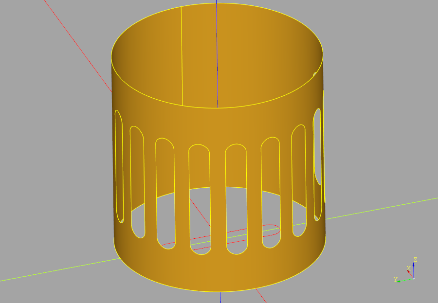

Parameters

• interior_wires – a list of hole outline wires

• interior_wires – list[Wire]:

Returns

‘self’ with holes

<!-- PDF page 424 -->

Return type

Face

Raises

• RuntimeError – adding interior hole in non-planar face with provided interior_wires

• RuntimeError – resulting face is not valid

classmethod make_plane(plane: Plane = Plane((0, 0, 0), (1, 0, 0), (0, 0, 1))) →Face

Create a unlimited size Face aligned with plane

classmethod make_rect(width: float, height: float, plane: Plane = Plane((0, 0, 0), (1, 0, 0), (0, 0, 1))) →

Face

Make a Rectangle centered on center with the given normal

Parameters

• width (float, optional) – width (local x).

• height (float, optional) – height (local y).

• plane (Plane, optional) – base plane. Defaults to Plane.XY.

Returns

The centered rectangle

Return type

Face

classmethod make_surface(exterior: Wire | Iterable[Edge], surface_points: Iterable[Vector | tuple[float,
float] | tuple[float, float, float] | Sequence[float]] | None = None,
interior_wires: Iterable[Wire] | None = None) →Face

Create Non-Planar Face

Create a potentially non-planar face bounded by exterior (wire or edges), optionally refined by sur-
face_points with optional holes defined by interior_wires.

Parameters

```python
                • exterior (Union[Wire, list[Edge]]) – Perimeter of face
```

• surface_points (list[VectorLike], optional) – Points on the surface that refine
the shape. Defaults to None.

• interior_wires (list[Wire], optional) – Hole(s) in the face. Defaults to None.

Raises

• RuntimeError – Internal error building face

• RuntimeError – Error building non-planar face with provided surface_points

• RuntimeError – Error adding interior hole

• RuntimeError – Generated face is invalid

Returns

Potentially non-planar face

Return type

Face

<!-- PDF page 425 -->

classmethod make_surface_from_array_of_points(points: list[list[Vector | tuple[float, float] |
tuple[float, float, float] | Sequence[float]]], tol:
float = 0.01, smoothing: tuple[float, float, float] |
None = None, min_deg: int = 1, max_deg: int =
3) →Face

Approximate a spline surface through the provided 2d array of points. The first dimension correspond to
points on the vertical direction in the parameter space of the face. The second dimension correspond to
points on the horizontal direction in the parameter space of the face. The 2 dimensions are U,V dimensions
of the parameter space of the face.

Parameters

• points (list[list[VectorLike]]) – a 2D list of points, first dimension is V parame-
ters second is U parameters.

• tol (float, optional) – tolerance of the algorithm. Defaults to 1e-2.

• smoothing (Tuple[float, float, float], optional) – optional tuple of 3
weights use for variational smoothing. Defaults to None.

• min_deg (int, optional) – minimum spline degree. Enforced only when smoothing is
None. Defaults to 1.

• max_deg (int, optional) – maximum spline degree. Defaults to 3.

Raises

ValueError – B-spline approximation failed

Returns

a potentially non-planar face defined by points

Return type

Face

classmethod make_surface_from_curves(edge1: Edge, edge2: Edge) →Face

classmethod make_surface_from_curves(wire1: Wire, wire2: Wire) →Face

make_surface_from_curves

Create a ruled surface out of two edges or two wires. If wires are used then these must have the same
number of edges.

Parameters

```python
                • curve1 (Union[Edge,Wire]) – side of surface
```

```python
                • curve2 (Union[Edge,Wire]) – opposite side of surface
```

Returns

potentially non planar surface

Return type

Face

classmethod make_surface_patch(edge_face_constraints: Iterable[tuple[Edge, Face, ContinuityLevel]] |
None = None, edge_constraints: Iterable[Edge] | None = None,
point_constraints: Iterable[Vector | tuple[float, float] | tuple[float,
float, float] | Sequence[float]] | None = None) →Face

Create a potentially non-planar face patch bounded by exterior edges which can be optionally refined using
support faces to ensure e.g. tangent surface continuity. Also can optionally refine the surface using surface
points.

Parameters

<!-- PDF page 426 -->

```python
                • edge_face_constraints     (list[tuple[Edge, Face, ContinuityLevel]],
                  optional) – Edges defining perimeter of face with adjacent support faces subject to
                  ContinuityLevel. Defaults to None.
```

• edge_constraints (list[Edge], optional) – Edges defining perimeter of face with-
out adjacent support faces. Defaults to None.

• point_constraints (list[VectorLike], optional) – Points on the surface that re-
fine the shape. Defaults to None.

Raises

• RuntimeError – Error building non-planar face with provided constraints

• RuntimeError – Generated face is invalid

Returns

Potentially non-planar face

Return type

Face

normal_at(surface_point: Vector | tuple[float, float] | tuple[float, float, float] | Sequence[float] | None =
None) →Vector

normal_at(u: float, v: float) →Vector

normal_at

Computes the normal vector at the desired location on the face.

Parameters

surface_point (VectorLike, optional) – a point that lies on the surface where the
normal. Defaults to None.

Returns

surface normal direction

Return type

Vector

```python
     order = 2.0
```

outer_wire() →Wire

Extract the perimeter wire from this Face

position_at(u: float, v: float) →Vector

Computes a point on the Face given u, v coordinates.

Parameters

• u (float) – the horizontal coordinate in the parameter space of the Face, between 0.0 and
1.0

• v (float) – the vertical coordinate in the parameter space of the Face, between 0.0 and 1.0

Returns

point on Face

Return type

Vector

project_to_shape(target_object: Shape, direction: Vector | tuple[float, float] | tuple[float, float, float] |
Sequence[float]) →ShapeList[Face | Shell]

<!-- PDF page 427 -->

Project Face to target Object

Project a Face onto a Shape generating new Face(s) on the surfaces of the object.

A projection with no taper is illustrated below:

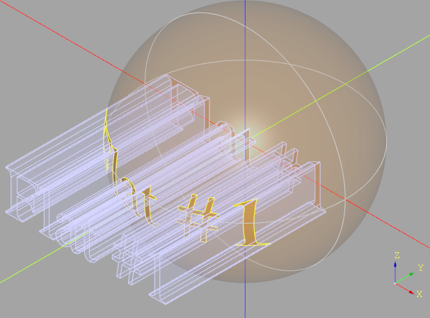

Note that an array of faces is returned as the projection might result in faces on the “front” and “back”
of the object (or even more if there are intermediate surfaces in the projection path). faces “behind” the
projection are not returned.

Parameters

• target_object (Shape) – Object to project onto

• direction (VectorLike) – projection direction

Returns

Face(s) projected on target object ordered by distance

Return type

ShapeList[Face]

```python
     property radii:  None | tuple[float, float]
```

Return the major and minor radii of a torus otherwise None

```python
     property radius:  None | float
```

Return the radius of a cylinder or sphere, otherwise None

classmethod revolve(profile: Edge, angle: float, axis: Axis) →Face

sweep

<!-- PDF page 428 -->

Revolve an Edge around an axis.

Parameters

• profile (Edge) – the object to sweep

• angle (float) – the angle to revolve through

• axis (Axis) – rotation Axis

Returns

resulting face

Return type

Face

```python
     property seams:  ShapeList[Edge]
```

Return the seams contained within this Face

```python
     property semi_angle:  None | float
```

Return the semi angle of a cone, otherwise None

classmethod sew_faces(faces: Iterable[Face]) →list[ShapeList[Face]]

sew faces

Group contiguous faces and return them in a list of ShapeList

Parameters

```python
                faces (Iterable[Face]) – Faces to sew together
```

Raises

RuntimeError – OCCT SewedShape generated unexpected output

Returns

grouped contiguous faces

Return type

list[ShapeList[Face]]

classmethod sweep(profile: Curve | Edge | Wire, path: Curve | Edge | Wire,
transition=<Transition.TRANSFORMED>) →Face

Sweep a 1D profile along a 1D path. Both the profile and path must be composed of only 1 Edge.

Parameters

```python
                • profile (Union[Curve,Edge,Wire]) – the object to sweep
```

```python
                • path (Union[Curve,Edge,Wire]) – the path to follow when sweeping
```

• transition (Transition, optional) – handling of profile orientation at C1 path dis-
continuities. Defaults to Transition.TRANSFORMED.

Raises

ValueError – Only 1 Edge allowed in profile & path

Returns

resulting face, may be non-planar

Return type

Face

<!-- PDF page 429 -->

to_arcs(tolerance: float = 0.001) →Face

Approximate planar face with arcs and straight line segments.

This is a utility used internally to convert or adapt a face for Boolean operations. Its purpose is not typically
for general use, but rather as a helper within the Boolean kernel to ensure input faces are in a compatible
and canonical form.

Parameters

tolerance (float, optional) – Approximation tolerance. Defaults to 1e-3.

Returns

approximated face

Return type

Face

```python
     property uv_face:  Face
```

Create a planar face from a face’s parametric-space boundary.

Each boundary edge’s pcurve on self is converted to a normal build123d Edge on the XY plane, where
X is the surface U parameter and Y is the surface V parameter. The original outer/inner wire structure is
kept so the result can be displayed with normal build123d/ocp-vscode tooling.

Parameters

source_face – Planar or non-planar face to inspect.

Returns

A planar Face in UV parameter space.

```python
     property volume:  float
```

volume - the volume of this Face, which is always zero

```python
     property width:  None | float
```

width of planar face

wire() →Wire

Return the outerwire, generate a warning if inner_wires present

without_holes() →Face

Remove all of the holes from this face.

Returns

A new Face instance identical to the original but without any holes.

Return type

Face

wrap(planar_shape: Edge, surface_loc: Location, tolerance: float = 0.001, extension_factor: float = 0.1) →

Edge

wrap(planar_shape: Wire, surface_loc: Location, tolerance: float = 0.001, extension_factor: float = 0.1) →

Wire

wrap(planar_shape: Face, surface_loc: Location, tolerance: float = 0.001, extension_factor: float = 0.1) →

Face

wrap

Wrap a planar 2D shape onto a 3D surface.

This method conforms a 2D shape defined on the XY plane (Edge, Wire, or Face) to the curvature of a
non-planar 3D Face (the target surface), starting at a specified surface location. The operation attempts

<!-- PDF page 430 -->

to preserve the original edge lengths and shape as closely as possible while minimizing the geometric
distortion that naturally arises when mapping flat geometry onto curved surfaces.

The wrapping process follows the local orientation of the surface and progressively fits each edge along the
curvature. To help ensure continuity, the first and last edges are extended and trimmed to close small gaps
introduced by distortion. The final shape is tightly aligned to the surface geometry.

This method is useful for applying flat features—such as decorative patterns, cutouts, or boundary out-
lines—onto curved or freeform surfaces while retaining their original proportions.

Parameters

```python
                • planar_shape (Edge | Wire | Face) – flat shape to wrap around surface
```

• surface_loc (Location) – location on surface to wrap

• tolerance (float, optional) – maximum allowed error. Defaults to 0.001

• extension_factor (float, optional) – amount to extend the wrapped first and last
edges to allow them to cross. Defaults to 0.1

Raises

ValueError – Invalid planar shape

Returns

wrapped shape

Return type

Edge | Wire | Face

wrap_faces(faces: Iterable[Face], path: Wire | Edge, start: float = 0.0) →ShapeList[Face]

Wrap a sequence of 2D faces onto a 3D surface, aligned along a guiding path.

This method places multiple planar Face objects (defined in the XY plane) onto a curved 3D surface (self ),
following a given path (Wire or Edge) that lies on or closely follows the surface. Each face is spaced along
the path according to its original horizontal (X-axis) position, preserving the relative layout of the input
faces.

The wrapping process attempts to maintain the shape and size of each face while minimizing distortion.
Each face is repositioned to the origin, then individually wrapped onto the surface starting at a specific
point along the path. The face’s new orientation is defined using the path’s tangent direction and the surface
normal at that point.

This is particularly useful for placing a series of features—such as embossed logos, engraved labels, or
patterned tiles—onto a freeform or cylindrical surface, aligned along a reference edge or curve.

Parameters

• faces (Iterable[Face]) – An iterable of 2D planar faces to be wrapped.

• path (Wire | Edge) – A curve on the target surface that defines the alignment direction.
The X-position of each face is mapped to a relative position along this path.

• start (float, optional) – The relative starting point on the path (between 0.0 and 1.0)
where the first face should be placed. Defaults to 0.0.

Returns

A list of wrapped face objects, aligned and conformed to the

surface.

Return type

ShapeList[Face]

<!-- PDF page 431 -->

class Mixin1D(obj: TopoDS_Shape | None = None, label: str = '', color: ColorLike | None = None, parent:

Compound | None = None)

Methods to add to the Edge and Wire classes

__matmul__(position: float) →Vector

Position on wire operator @

__mod__(position: float) →Vector

Tangent on wire operator %

classmethod cast(obj: TopoDS_Shape) →Vertex | Edge | Wire

Returns the right type of wrapper, given a OCCT object

center(center_of: ~build123d.build_enums.CenterOf = <CenterOf.GEOMETRY>) →Vector

Center of object

Return the center based on center_of

Parameters

center_of  (CenterOf, optional) –  centering option.  Defaults to Cen-
terOf.GEOMETRY.

Returns

center

Return type

Vector

common_plane(*lines: Edge | Wire | None, tolerance: float = 1e-06) →None | Plane

Find the plane containing all the edges/wires (including self). If there is no common plane return None. If
the edges are coaxial, select one of the infinite number of valid planes.

Parameters

```python
                • lines (sequence of Edge | Wire) – edges in common with self
```

• tolerance (float) – amount lines can deviate from plane. Defaults to TOLERANCE.

Returns

Either the common plane or None

Return type

None | Plane

curvature_comb(count: int = 100, max_tooth_size: float | None = None) →ShapeList[Edge]

Build a curvature comb for a planar (XY) 1D curve.

A curvature comb is a set of short line segments (“teeth”) erected perpendicular to the curve that visualize
the signed curvature (u). Tooth length is proportional to || and the direction encodes the sign (left normal
for >0, right normal for <0). This is useful for inspecting fairness and continuity (C0/C1/C2) of edges and
wires.

Parameters

• count (int, optional) – Number of uniformly spaced samples over the normalized
parameter. Increase for a denser comb. Defaults to 100.

• max_tooth_size (float | None, optional) – Maximum tooth height in model units.
If None, set to 10% maximum curve dimension. Defaults to None.

Raises

• ValueError – Empty curve.

<!-- PDF page 432 -->

• ValueError – If the curve is not planar on Plane.XY.

Returns

A list of short Edge objects (lines) anchored on the curve and oriented along the left normal
n = normalize(t) × +Z.

Return type

ShapeList[Edge]

Notes

• On circles, = 1/R so tooth length is constant.

• On straight segments, = 0 so no teeth are drawn.

• At inflection points →0 and the tooth flips direction.

• At C0 corners the tangent is discontinuous; nearby teeth may jump. C1 yields continuous direction;
C2 yields continuous magnitude as well.

Example

```python
         >>> comb = my_wire.curvature_comb(count=200, max_tooth_size=2.0)
         >>> show(my_wire, Curve(comb))
```

derivative_at(position: float | ~build123d.geometry.Vector | tuple[float, float] | tuple[float, float, float] |
~collections.abc.Sequence[float], order: int = 2, position_mode:
~build123d.build_enums.PositionMode = <PositionMode.PARAMETER>) →Vector

Derivative At

Generate a derivative along the underlying curve.

Parameters

• position (float | VectorLike) – distance, parameter value or point

• order (int) – derivative order. Defaults to 2

• position_mode (PositionMode, optional) – position calculation mode. Defaults to
PositionMode.PARAMETER.

Raises

ValueError – position must be a float or a point

Returns

position on the underlying curve

Return type

Vector

end_point() →Vector

The end point of this edge.

Note that circles may have identical start and end points.

classmethod extrude(obj: Shape, direction: VectorLike) →Edge | Face | Shell | Solid | Compound

Unused - only here because Mixin1D is a subclass of Shape

```python
     property is_closed:  bool
```

Are the start and end points equal?

<!-- PDF page 433 -->

```python
     property is_forward:  bool
```

Does the Edge/Wire loop forward or reverse

```python
     property is_interior:  bool
```

Check if the edge is an interior edge.

An interior edge lies between surfaces that are part of the body (internal to the geometry) and does not form
part of the exterior boundary.

Returns

True if the edge is an interior edge, False otherwise.

Return type

bool

```python
     property length:  float
```

Edge or Wire length

location_at(distance: float, position_mode: ~build123d.build_enums.PositionMode =
<PositionMode.PARAMETER>, frame_method: ~build123d.build_enums.FrameMethod =
<FrameMethod.FRENET>, x_dir: ~build123d.geometry.Vector | tuple[float, float] |
tuple[float, float, float] | ~collections.abc.Sequence[float] | None = None) →Location

Locations along curve

Generate a location along the underlying curve.

Parameters

• distance (float) – distance or parameter value

• position_mode (PositionMode, optional) – position calculation mode. Defaults to
PositionMode.PARAMETER.

• frame_method (FrameMethod, optional) – moving frame calculation method. The
FRENET frame can “twist” or flip unexpectedly, especially near flat spots. The COR-
RECTED frame behaves more like a “camera dolly” or sweep profile would — it’s smoother
and more stable. Defaults to FrameMethod.FRENET.

• x_dir (VectorLike, optional) – override the x_dir to help with plane creation along
a 1D shape. Must be perpendicular to shapes tangent. Defaults to None.

Returns

A Location object representing local coordinate system

at the specified distance.

Return type

Location

locations(distances: ~collections.abc.Iterable[float], position_mode:
~build123d.build_enums.PositionMode = <PositionMode.PARAMETER>, frame_method:
~build123d.build_enums.FrameMethod = <FrameMethod.FRENET>, x_dir:
~build123d.geometry.Vector | tuple[float, float] | tuple[float, float, float] |
~collections.abc.Sequence[float] | None = None) →list[Location]

Locations along curve

Generate location along the curve

Parameters

• distances (Iterable[float]) – distance or parameter values

<!-- PDF page 434 -->

• position_mode (PositionMode, optional) – position calculation mode. Defaults to
PositionMode.PARAMETER.

• frame_method (FrameMethod, optional) – moving frame calculation method. De-
faults to FrameMethod.FRENET.

• x_dir (VectorLike, optional) – override the x_dir to help with plane creation along
a 1D shape. Must be perpendicular to shapes tangent. Defaults to None.

Returns

A list of Location objects representing local coordinate

systems at the specified distances.

Return type

list[Location]

normal() →Vector

Calculate the normal Vector. Only possible for planar curves.

Returns

normal vector

Args:

Returns:

offset_2d(distance: float, kind: ~build123d.build_enums.Kind = <Kind.ARC>, side:
~build123d.build_enums.Side = <Side.BOTH>, closed: bool = True) →Edge | Wire

2d Offset

Offsets a planar edge/wire

Parameters

• distance (float) – distance from edge/wire to offset

• kind (Kind, optional) – offset corner transition. Defaults to Kind.ARC.

• side (Side, optional) – side to place offset. Defaults to Side.BOTH.

• closed (bool, optional) – if Side!=BOTH, close the LEFT or RIGHT offset. Defaults
to True.

Raises

• RuntimeError – Multiple Wires generated

• RuntimeError – Unexpected result type

Returns

offset wire

Return type

Wire

perpendicular_line(length: float, u_value: float, plane: Plane = Plane((0, 0, 0), (1, 0, 0), (0, 0, 1))) →

Edge

Create a line on the given plane perpendicular to and centered on beginning of self

Parameters

• length (float) – line length

• u_value (float) – position along line between 0.0 and 1.0

<!-- PDF page 435 -->

• plane (Plane, optional) – plane containing perpendicular line. Defaults to Plane.XY.

Returns

perpendicular line

Return type

Edge

position_at(position: float, position_mode: ~build123d.build_enums.PositionMode =
<PositionMode.PARAMETER>) →Vector

Position At

Generate a position along the underlying Wire.

Parameters

• position (float) – distance or parameter value

• position_mode (PositionMode, optional) – position calculation mode. Defaults to
PositionMode.PARAMETER.

Returns

position on the underlying curve

Return type

Vector

positions(distances: ~collections.abc.Iterable[float] | None = None, position_mode:
~build123d.build_enums.PositionMode = <PositionMode.PARAMETER>, deflection: float |
None = None) →list[Vector]

Positions along curve

Generate positions along the underlying curve

Parameters

• distances (Iterable[float] | None, optional) – distance or parameter values.
Defaults to None.

• position_mode (PositionMode, optional) – position calculation mode only applies
when using distances. Defaults to PositionMode.PARAMETER.

• deflection (float | None, optional) – maximum deflection between the curve and
the polygon that results from the computed points. Defaults to None.

Returns

positions along curve

Return type

list[Vector]

project(face: Face, direction: VectorLike, closest: bool = True) →Edge | Wire | ShapeList[Edge | Wire]

Project onto a face along the specified direction

Parameters

• face – Face:

• direction – VectorLike:

• closest – bool: (Default value = True)

Returns:

<!-- PDF page 436 -->

project_to_viewport(viewport_origin: Vector | tuple[float, float] | tuple[float, float, float] |
Sequence[float], viewport_up: Vector | tuple[float, float] | tuple[float, float, float] |
Sequence[float] = (0, 0, 1), look_at: Vector | tuple[float, float] | tuple[float, float,
float] | Sequence[float] | None = None, focus: float | None = None) →
tuple[ShapeList[Edge], ShapeList[Edge]]

Project a shape onto a viewport returning visible and hidden Edges.

Parameters

• viewport_origin (VectorLike) – location of viewport

• viewport_up (VectorLike, optional) – direction of the viewport y axis. Defaults to
(0, 0, 1).

• look_at (VectorLike, optional) – point to look at. Defaults to None (center of
shape).

• focus (float, optional) – the focal length for perspective projection Defaults to None
(orthographic projection)

Returns

visible & hidden Edges

Return type

tuple[ShapeList[Edge],ShapeList[Edge]]

```python
     property radius:  float
```

Calculate the radius.

Note that when applied to a Wire, the radius is simply the radius of the first edge.

Args:

Returns

radius

Raises

ValueError – if kernel can not reduce the shape to a circular edge

start_point() →Vector

The start point of this edge

Note that circles may have identical start and end points.

tangent_angle_at(location_param: float = 0.5, position_mode: ~build123d.build_enums.PositionMode =
<PositionMode.PARAMETER>, plane: ~build123d.geometry.Plane = Plane((0, 0, 0),
(1, 0, 0), (0, 0, 1))) →float

Compute the tangent angle at the specified location

Parameters

• location_param (float, optional) – distance or parameter value. Defaults to 0.5.

• position_mode (PositionMode, optional) – position calculation mode. Defaults to
PositionMode.PARAMETER.

• plane (Plane, optional) – plane line was constructed on. Defaults to Plane.XY.

Returns

angle in degrees between 0 and 360

Return type

float

<!-- PDF page 437 -->

tangent_at(position: float | ~build123d.geometry.Vector | tuple[float, float] | tuple[float, float, float] |
~collections.abc.Sequence[float] = 0.5, position_mode: ~build123d.build_enums.PositionMode
= <PositionMode.PARAMETER>) →Vector

Find the tangent at a given position on the 1D shape where the position is either a float (or int) parameter
or a point that lies on the shape.

Parameters

• position (float | VectorLike) – distance, parameter value, or point on shape. De-
faults to 0.5.

• position_mode (PositionMode, optional) – position calculation mode. Defaults to
PositionMode.PARAMETER.

Returns

tangent value

Return type

Vector

```python
     property volume:  float
         volume - the volume of this Edge or Wire, which is always zero
```

class Mixin2D(obj: TopoDS_Shape | None = None, label: str = '', color: ColorLike | None = None, parent:

Compound | None = None)

Additional methods to add to Face and Shell class

classmethod cast(obj: TopoDS_Shape) →Vertex | Edge | Wire | Face | Shell

Returns the right type of wrapper, given a OCCT object

classmethod extrude(obj: Shape, direction: VectorLike) →Edge | Face | Shell | Solid | Compound

Unused - only here because Mixin1D is a subclass of Shape

find_intersection_points(other: Axis, tolerance: float = 1e-06) →list[tuple[Vector, Vector]]

Find point and normal at intersection

Return both the point(s) and normal(s) of the intersection of the axis and the shape

Parameters

axis (Axis) – axis defining the intersection line

Returns

Point and normal of intersection

Return type

list[tuple[Vector, Vector]]

abstract location_at(*args: Any, **kwargs: Any) →Location

A location from a face or shell

offset(amount: float) →Self

Return a copy of self moved along the normal by amount

project_to_viewport(viewport_origin: Vector | tuple[float, float] | tuple[float, float, float] |
Sequence[float], viewport_up: Vector | tuple[float, float] | tuple[float, float, float] |
Sequence[float] = (0, 0, 1), look_at: Vector | tuple[float, float] | tuple[float, float,
float] | Sequence[float] | None = None, focus: float | None = None) →
tuple[ShapeList[Edge], ShapeList[Edge]]

Project a shape onto a viewport returning visible and hidden Edges.

Parameters

<!-- PDF page 438 -->

• viewport_origin (VectorLike) – location of viewport

• viewport_up (VectorLike, optional) – direction of the viewport y axis. Defaults to
(0, 0, 1).

• look_at (VectorLike, optional) – point to look at. Defaults to None (center of
shape).

• focus (float, optional) – the focal length for perspective projection Defaults to None
(orthographic projection)

Returns

visible & hidden Edges

Return type

tuple[ShapeList[Edge],ShapeList[Edge]]

split_by_perimeter(perimeter: Edge | Wire, keep: Literal[Keep.INSIDE, Keep.OUTSIDE]) →Face |

Shell | ShapeList[Face] | None

split_by_perimeter(perimeter: Edge | Wire, keep: Literal[Keep.BOTH]) →tuple[Face | Shell |

ShapeList[Face] | None, Face | Shell | ShapeList[Face] | None]

split_by_perimeter(perimeter: Edge | Wire, keep: Literal[Keep.INSIDE] = Keep.INSIDE) →Face | Shell

| ShapeList[Face] | None

split_by_perimeter

Divide the faces of this object into those within the perimeter and those outside the perimeter.

Note: this method may fail if the perimeter intersects shape edges.

Parameters

```python
                • perimeter (Union[Edge,Wire]) – closed perimeter
```

• keep (Keep, optional) – which object(s) to return. Defaults to Keep.INSIDE.

Raises

• ValueError – perimeter must be closed

• ValueError – keep must be one of Keep.INSIDE|OUTSIDE|BOTH

Returns

Union[Face | Shell | ShapeList[Face] | None, Tuple[Face | Shell | ShapeList[Face] | None]:
The result of the split operation.

• Keep.INSIDE: Returns the inside part as a Shell or Face, or None if no inside part is found.

• Keep.OUTSIDE: Returns the outside part as a Shell or Face, or None if no outside part is
found.

• Keep.BOTH: Returns a tuple (inside, outside) where each element is either a Shell, Face,
or None if no corresponding part is found.

touch(other: Shape, tolerance: float = 1e-06, found_faces: ShapeList | None = None, found_edges:

ShapeList | None = None) →ShapeList

Find boundary contacts between this 2D shape and another shape.

Returns the highest-dimensional contact at each location, filtered to avoid returning lower-dimensional
boundaries of higher-dimensional contacts.

For Face/Shell: - Face + Face →Vertex (shared corner or crossing point without edge/face overlap) - Face
+ Edge/Vertex →no touch (intersect already returns dim 0)

<!-- PDF page 439 -->

Parameters

• other – Shape to find contacts with

• tolerance – tolerance for contact detection

• found_faces – pre-found faces to filter against (from Mixin3D.touch)

• found_edges – pre-found edges to filter against (from Mixin3D.touch)

Returns

ShapeList of contact shapes (Vertex only for 2D+2D)

class Mixin3D(obj: TopoDS_Shape | None = None, label: str = '', color: ColorLike | None = None, parent:

Compound | None = None)

Additional methods to add to 3D Shape classes

classmethod cast(obj: TopoDS_Shape) →Self

Returns the right type of wrapper, given a OCCT object

center(center_of: ~build123d.build_enums.CenterOf = <CenterOf.MASS>) →Vector

Return center of object

Find center of object

Parameters

```python
                center_of (CenterOf, optional) – center option. Defaults to CenterOf.MASS.
```

Raises

• ValueError – Center of GEOMETRY is not supported for this object

• NotImplementedError – Unable to calculate center of mass of this object

Returns

center

Return type

Vector

chamfer(length: float, length2: float | None, edge_list: Iterable[Edge], face: Face | None = None) →Solid |

Part

Chamfer

Chamfers the specified edges of this solid.

Parameters

• length (float) – length > 0, the length (length) of the chamfer

• length2 (Optional[float]) – length2 > 0, optional parameter for asymmetrical cham-
fer. Should be None if not required.

• edge_list (Iterable[Edge]) – a list of Edge objects, which must belong to this solid

• face (Face, optional) – identifies the side where length is measured. The edge(s) must
be part of the face

Returns

Chamfered solid or 3D composite

Return type

Solid | Part

<!-- PDF page 440 -->

dprism(basis: Face | None, bounds: list[Face | Wire], depth: float | None = None, taper: float = 0,
up_to_face: Face | None = None, thru_all: bool = True, additive: bool = True) →Solid

Make a prismatic feature (additive or subtractive)

Parameters

• basis (Optional[Face]) – face to perform the operation on

```python
                • bounds (list[Union[Face,Wire]]) – list of profiles
```

• depth (float, optional) – depth of the cut or extrusion. Defaults to None.

• taper (float, optional) – in degrees. Defaults to 0.

• up_to_face (Face, optional) – a face to extrude until. Defaults to None.

• thru_all (bool, optional) – cut thru_all. Defaults to True.

• additive (bool, optional) – Defaults to True.

Returns

prismatic feature

Return type

Solid

classmethod extrude(obj: Shape, direction: VectorLike) →Edge | Face | Shell | Solid | Compound

Unused - only here because Mixin1D is a subclass of Shape

fillet(radius: float, edge_list: Iterable[Edge]) →Solid | Part

Fillet

Fillets the specified edges of this solid.

Parameters

• radius (float) – float > 0, the radius of the fillet

• edge_list (Iterable[Edge]) – a list of Edge objects, which must belong to this solid

Returns

Filleted solid or 3D composite

Return type

Solid | Part

find_intersection_points(other: Axis, tolerance: float = 1e-06) →list[tuple[Vector, Vector]]

Find point and normal at intersection

Return both the point(s) and normal(s) of the intersection of the axis and the shape

Parameters

axis (Axis) – axis defining the intersection line

Returns

Point and normal of intersection

Return type

list[tuple[Vector, Vector]]

hollow(faces: ~collections.abc.Iterable[~topology.two_d.Face] | None, thickness: float, tolerance: float =
0.0001, kind: ~build123d.build_enums.Kind = <Kind.ARC>) →Solid

Hollow

Return the outer shelled solid of self.

<!-- PDF page 441 -->

Parameters

• faces (Optional[Iterable[Face]]) – faces to be removed,

• list. (which must be part of the solid. Can be an empty)

• thickness (float) – shell thickness - positive shells outwards, negative shells inwards.

• tolerance (float, optional) – modelling tolerance of the method. Defaults to 0.0001.

• kind (Kind, optional) – intersection type. Defaults to Kind.ARC.

Raises

ValueError – Kind.TANGENT not supported

Returns

A hollow solid.

Return type

Solid

is_inside(point: Vector | tuple[float, float] | tuple[float, float, float] | Sequence[float], tolerance: float =
1e-06) →bool

Returns whether or not the point is inside a solid or compound object within the specified tolerance.

Parameters

• point – tuple or Vector representing 3D point to be tested

• tolerance – tolerance for inside determination, default=1.0e-6

• point – VectorLike:

• tolerance – float: (Default value = 1.0e-6)

Returns

bool indicating whether or not point is within solid

max_fillet(edge_list: Iterable[Edge], tolerance=0.1, max_iterations: int = 10) →float

Find Maximum Fillet Size

Find the largest fillet radius for the given Shape and edges with a recursive binary search.

Example

max_fillet_radius  =       my_shape.max_fillet(shape_edges) max_fillet_radius =
my_shape.max_fillet(shape_edges, tolerance=0.5, max_iterations=8)

Parameters

• edge_list (Iterable[Edge]) – a sequence of Edge objects, which must belong to this
solid

• tolerance (float, optional) – maximum error from actual value. Defaults to 0.1.

• max_iterations (int, optional) – maximum number of recursive iterations. Defaults
to 10.

Raises

• RuntimeError – failed to find the max value

• ValueError – the provided Shape is invalid

Returns

maximum fillet radius

<!-- PDF page 442 -->

Return type

float

offset_3d(openings: ~collections.abc.Iterable[~topology.two_d.Face] | None, thickness: float, tolerance:
float = 0.0001, kind: ~build123d.build_enums.Kind = <Kind.ARC>) →Solid

Shell

Make an offset solid of self.

Parameters

• openings (Optional[Iterable[Face]]) – faces to be removed, which must be part of
the solid. Can be an empty list.

• thickness (float) – offset amount - positive offset outwards, negative inwards

• tolerance (float, optional) – modelling tolerance of the method. Defaults to 0.0001.

• kind (Kind, optional) – intersection type. Defaults to Kind.ARC.

Raises

ValueError – Kind.TANGENT not supported

Returns

A shelled solid.

Return type

Solid

project_to_viewport(viewport_origin: Vector | tuple[float, float] | tuple[float, float, float] |
Sequence[float], viewport_up: Vector | tuple[float, float] | tuple[float, float, float] |
Sequence[float] = (0, 0, 1), look_at: Vector | tuple[float, float] | tuple[float, float,
float] | Sequence[float] | None = None, focus: float | None = None) →
tuple[ShapeList[Edge], ShapeList[Edge]]

Project a shape onto a viewport returning visible and hidden Edges.

Parameters

• viewport_origin (VectorLike) – location of viewport

• viewport_up (VectorLike, optional) – direction of the viewport y axis. Defaults to
(0, 0, 1).

• look_at (VectorLike, optional) – point to look at. Defaults to None (center of
shape).

• focus (float, optional) – the focal length for perspective projection Defaults to None
(orthographic projection)

Returns

visible & hidden Edges

Return type

tuple[ShapeList[Edge],ShapeList[Edge]]

class Shape(obj: TopoDS_Shape | None = None, label: str = '', color: ColorLike | None = None, parent:

Compound | None = None)

Base class for all CAD objects such as Edge, Face, Solid, etc.

Parameters

• obj (TopoDS_Shape, optional) – OCCT object. Defaults to None.

• label (str, optional) – Defaults to ‘’.

<!-- PDF page 443 -->

• color (ColorLike, optional) – Defaults to None.

• parent (Compound, optional) – assembly parent. Defaults to None.

Variables

• wrapped (TopoDS_Shape) – the OCP object

• label (str) – user assigned label

• color (Color) – object color

• (dict[str (joints) – Joint]): dictionary of joints bound to this object (Solid only)

• children (Shape) – list of assembly children of this object (Compound only)

• topo_parent (Shape) – assembly parent of this object

__add__(other: None) →Self

__add__(other: Shape | Iterable[Shape]) →Self | Compound

fuse shape to self operator +

__and__(other: Shape | Iterable[Shape]) →None | Self | Compound

intersect shape with self operator &

__copy__() →Self

Return shallow copy or reference of self

Create an copy of this Shape that shares the underlying TopoDS_TShape.

Used when there is a need for many objects with the same CAD structure but at different Locations, etc.
- for examples fasteners in a larger assembly. By sharing the TopoDS_TShape, the memory size of such
assemblies can be greatly reduced.

Changes to the CAD structure of the base object will be reflected in all instances.

__deepcopy__(memo) →Self

Return deepcopy of self

__eq__(other) →bool

Check if two shapes are the same.

This method checks if the current shape is the same as the other shape. Two shapes are considered the same
if they share the same TShape with the same Locations. Orientations may differ.

Parameters

other (Shape) – The shape to compare with.

Returns

True if the shapes are the same, False otherwise.

Return type

bool

__hash__() →int

Return hash code

__rmul__(other: Plane | Location) →Self

__rmul__(other: Iterable[Plane | Location]) →list[Self]

right multiply for positioning operator *

__sub__(other: None) →Self

<!-- PDF page 444 -->

__sub__(other: Shape | Iterable[Shape]) →Self | Compound

cut shape from self operator -

```python
     property area:  float
         area -the surface area of all faces in this Shape
```

bounding_box(tolerance: float | None = None, optimal: bool = True) →BoundBox

Create a bounding box for this Shape.

Parameters

tolerance (float, optional) – Defaults to None.

Returns

A box sized to contain this Shape

Return type

BoundBox

abstract classmethod cast(obj: TopoDS_Shape) →Self

Returns the right type of wrapper, given a OCCT object

clean() →Self

Remove internal edges

Returns

Original object with extraneous internal edges removed

Return type

Shape

closest_points(other: Shape | Vector | tuple[float, float] | tuple[float, float, float] | Sequence[float]) →
tuple[Vector, Vector]

Points on two shapes where the distance between them is minimal

property color:  None | Color
Get the shape’s color. If it’s None, get the color of the nearest ancestor, assign it to this Shape and return
this value.

static combined_center(objects: ~collections.abc.Iterable[~topology.shape_core.Shape], center_of:
~build123d.build_enums.CenterOf = <CenterOf.MASS>) →Vector

combined center

Calculates the center of a multiple objects.

Parameters

• objects (Iterable[Shape]) – list of objects

• center_of (CenterOf, optional) – centering option. Defaults to CenterOf.MASS.

Raises

ValueError – CenterOf.GEOMETRY not implemented

Returns

center of multiple objects

Return type

Vector

```python
     composite_factories:  ClassVar[dict[int | None, Callable[[Iterable[Shape]], Shape]]]
     = {1:  <class 'topology.composite.Curve'>, 2:  <class 'topology.composite.Sketch'>,
     3:  <class 'topology.composite.Part'>, None:  <class 'topology.composite.Compound'>}
```

<!-- PDF page 445 -->

compound() →Compound

Return the Compound

compounds() →ShapeList[Compound]

compounds - all the compounds in this Shape

static compute_mass(obj: Shape) →float

Calculates the ‘mass’ of an object.

Parameters

• obj – Compute the mass of this object

• obj – Shape:

Returns:

copy_attributes_to(target: Shape, exceptions: Iterable[str] | None = None)

Copy common object attributes to target

Note that preset attributes of target will not be overridden.

Parameters

• target (Shape) – object to gain attributes

• exceptions (Iterable[str], optional) – attributes not to copy

Raises

ValueError – invalid attribute

cut(*to_cut: Shape) →Self | Compound

Remove the positional arguments from this Shape.

Parameters

*to_cut – Shape:

Returns

Resulting object may be of a different class than self

Return type

Self | Compound

distance(other: Shape) →float

Minimal distance between two shapes

Parameters

other – Shape:

Returns:

distance_to(other: Shape | Vector | tuple[float, float] | tuple[float, float, float] | Sequence[float]) →float

Minimal distance between two shapes

distance_to_with_closest_points(other: Shape | Vector | tuple[float, float] | tuple[float, float, float] |
Sequence[float]) →tuple[float, Vector, Vector]

Minimal distance between two shapes and the points on each shape

distances(*others: Shape) →Iterator[float]

Minimal distances to between self and other shapes

Parameters

*others – Shape:

<!-- PDF page 446 -->

Returns:

```python
     downcast_LUT = {<TopAbs_ShapeEnum.TopAbs_COMPOUND: 0>:  <built-in method Compound of
     PyCapsule object>, <TopAbs_ShapeEnum.TopAbs_COMPSOLID: 1>:  <built-in method
     CompSolid of PyCapsule object>, <TopAbs_ShapeEnum.TopAbs_EDGE: 6>: <built-in method
     Edge of PyCapsule object>, <TopAbs_ShapeEnum.TopAbs_FACE: 4>:  <built-in method Face
     of PyCapsule object>, <TopAbs_ShapeEnum.TopAbs_SHELL: 3>:  <built-in method Shell of
     PyCapsule object>, <TopAbs_ShapeEnum.TopAbs_SOLID: 2>:  <built-in method Solid of
     PyCapsule object>, <TopAbs_ShapeEnum.TopAbs_VERTEX: 7>:  <built-in method Vertex of
     PyCapsule object>, <TopAbs_ShapeEnum.TopAbs_WIRE: 5>:  <built-in method Wire of
     PyCapsule object>}
```

edge() →Edge

Return the Edge

edges() →ShapeList[Edge]

edges - all the edges in this Shape - subclasses may override

entities(topo_type: Literal['Vertex', 'Edge', 'Wire', 'Face', 'Shell', 'Solid', 'Compound']) →
list[TopoDS_Shape]

Return all of the TopoDS sub entities of the given type

abstract classmethod extrude(obj: Shape, direction: VectorLike) →Edge | Face | Shell | Solid |

Compound

Extrude a Shape in the provided direction. * Vertices generate Edges * Edges generate Faces * Wires
generate Shells * Faces generate Solids * Shells generate Compounds

Parameters

direction (VectorLike) – direction and magnitude of extrusion

Raises

• ValueError – Unsupported class

• RuntimeError – Generated invalid result

Returns

extruded shape

Return type

Edge | Face | Shell | Solid | Compound

face() →Face

Return the Face

faces() →ShapeList[Face]

faces - all the faces in this Shape

faces_intersected_by_axis(axis: Axis, tol: float = 0.0001) →ShapeList[Face]

Line Intersection

Computes the intersections between the provided axis and the faces of this Shape

Parameters

• axis (Axis) – Axis on which the intersection line rests

• tol (float, optional) – Intersection tolerance. Defaults to 1e-4.

Returns

A list of intersected faces sorted by distance from axis.position

<!-- PDF page 447 -->

Return type

list[Face]

fix() →Self

fix - try to fix shape if not valid

fuse(*to_fuse: Shape, glue: bool = False, tol: float | None = None) →Self | Compound

Fuse a sequence of shapes into a single shape.

Parameters

• to_fuse (sequence Shape) – shapes to fuse

• glue (bool, optional) – performance improvement for some shapes. Defaults to False.

• tol (float, optional) – tolerance. Defaults to None.

Returns

Resulting object may be of a different class than self

Return type

Self | Compound

```python
     geom_LUT_EDGE: dict[GeomAbs_CurveType, GeomType] =
     {<GeomAbs_CurveType.GeomAbs_BSplineCurve:  6>:  <GeomType.BSPLINE>,
     <GeomAbs_CurveType.GeomAbs_BezierCurve:  5>:  <GeomType.BEZIER>,
     <GeomAbs_CurveType.GeomAbs_Circle:  1>:  <GeomType.CIRCLE>,
     <GeomAbs_CurveType.GeomAbs_Ellipse:  2>:  <GeomType.ELLIPSE>,
     <GeomAbs_CurveType.GeomAbs_Hyperbola:  3>:  <GeomType.HYPERBOLA>,
     <GeomAbs_CurveType.GeomAbs_Line:  0>:  <GeomType.LINE>,
     <GeomAbs_CurveType.GeomAbs_OffsetCurve:  7>:  <GeomType.OFFSET>,
     <GeomAbs_CurveType.GeomAbs_OtherCurve:  8>:  <GeomType.OTHER>,
     <GeomAbs_CurveType.GeomAbs_Parabola:  4>:  <GeomType.PARABOLA>}
```

```python
     geom_LUT_FACE: dict[GeomAbs_SurfaceType, GeomType] =
     {<GeomAbs_SurfaceType.GeomAbs_BSplineSurface:  6>:  <GeomType.BSPLINE>,
     <GeomAbs_SurfaceType.GeomAbs_BezierSurface:  5>:  <GeomType.BEZIER>,
     <GeomAbs_SurfaceType.GeomAbs_Cone:  2>:  <GeomType.CONE>,
     <GeomAbs_SurfaceType.GeomAbs_Cylinder:  1>:  <GeomType.CYLINDER>,
     <GeomAbs_SurfaceType.GeomAbs_OffsetSurface:  9>:  <GeomType.OFFSET>,
     <GeomAbs_SurfaceType.GeomAbs_OtherSurface:  10>:  <GeomType.OTHER>,
     <GeomAbs_SurfaceType.GeomAbs_Plane:  0>:  <GeomType.PLANE>,
     <GeomAbs_SurfaceType.GeomAbs_Sphere:  3>:  <GeomType.SPHERE>,
     <GeomAbs_SurfaceType.GeomAbs_SurfaceOfExtrusion:  8>:  <GeomType.EXTRUSION>,
     <GeomAbs_SurfaceType.GeomAbs_SurfaceOfRevolution:  7>:  <GeomType.REVOLUTION>,
     <GeomAbs_SurfaceType.GeomAbs_Torus:  4>:  <GeomType.TORUS>}
```

```python
     property geom_type:  GeomType
```

Gets the underlying geometry type.

Returns

The geometry type of the shape

Return type

GeomType

static get_shape_list(shape: Shape, entity_type: Literal['Vertex']) →ShapeList[Vertex]

static get_shape_list(shape: Shape, entity_type: Literal['Edge']) →ShapeList[Edge]
static get_shape_list(shape: Shape, entity_type: Literal['Wire']) →ShapeList[Wire]

<!-- PDF page 448 -->

static get_shape_list(shape: Shape, entity_type: Literal['Face']) →ShapeList[Face]
static get_shape_list(shape: Shape, entity_type: Literal['Shell']) →ShapeList[Shell]
static get_shape_list(shape: Shape, entity_type: Literal['Solid']) →ShapeList[Solid]
static get_shape_list(shape: Shape, entity_type: Literal['Compound']) →ShapeList[Compound]

Helper to extract entities of a specific type from a shape.

static get_single_shape(shape: Shape, entity_type: Literal['Vertex']) →Vertex
static get_single_shape(shape: Shape, entity_type: Literal['Edge']) →Edge
static get_single_shape(shape: Shape, entity_type: Literal['Wire']) →Wire
static get_single_shape(shape: Shape, entity_type: Literal['Face']) →Face
static get_single_shape(shape: Shape, entity_type: Literal['Shell']) →Shell
static get_single_shape(shape: Shape, entity_type: Literal['Solid']) →Solid
static get_single_shape(shape: Shape, entity_type: Literal['Compound']) →Compound

Return the single entity of the requested type.

Raises

ValueError – if the number of matching entities is not exactly one.

get_top_level_shapes() →ShapeList[Shape]

Retrieve the first level of child shapes from the shape.

This method collects all the non-compound shapes directly contained in the current shape. If the wrapped
shape is a TopoDS_Compound, it traverses its immediate children and collects all shapes that are not fur-
ther nested compounds. Nested compounds are traversed to gather their non-compound elements without
returning the nested compound itself.

Returns

A list of all first-level non-compound child shapes.

Return type

ShapeList[Shape]

Example

If the current shape is a compound containing both simple shapes (e.g., edges, vertices) and other com-
pounds, the method returns a list of only the simple shapes directly contained at the top level.

```python
     property global_location:  Location
         The location of this Shape relative to the global coordinate system.
```

This property computes the composite transformation by traversing the hierarchy from the root of the as-
sembly to this node, combining the location of each ancestor. It reflects the absolute position and orientation
of the shape in world space, even when the shape is deeply nested within an assembly.

Note

This is only meaningful when the Shape is part of an assembly tree where parent-child relationships
define relative placements.

intersect(*to_intersect: Shape | Vector | Location | Axis | Plane, tolerance: float = 1e-06, include_touched:
bool = False) →ShapeList | None

Find where bodies/interiors meet (overlap or crossing geometry).

This is the main entry point for intersection operations. Handles geometry conversion and delegates to
subclass _intersect() implementations.

<!-- PDF page 449 -->

Semantics:

• Multiple arguments use AND (chaining): c.intersect(s1, s2) = c s1 s2

• Compound arguments use OR (distribution): c.intersect(Compound([s1, s2])) = (c s1) (c s2)

Parameters

• to_intersect – Shape(s) or geometry objects to intersect with

• tolerance – tolerance for intersection detection

• include_touched – if True, include boundary contacts without interior overlap (only
relevant when Solids are involved)

Returns

ShapeList of intersection results, or None if no intersection

```python
     inverse_shape_LUT = {'CompSolid':  <TopAbs_ShapeEnum.TopAbs_COMPSOLID: 1>,
     'Compound':  <TopAbs_ShapeEnum.TopAbs_COMPOUND: 0>, 'Edge':
     <TopAbs_ShapeEnum.TopAbs_EDGE: 6>, 'Face':  <TopAbs_ShapeEnum.TopAbs_FACE: 4>,
     'Shell':  <TopAbs_ShapeEnum.TopAbs_SHELL: 3>, 'Solid':
     <TopAbs_ShapeEnum.TopAbs_SOLID: 2>, 'Vertex':  <TopAbs_ShapeEnum.TopAbs_VERTEX: 7>,
     'Wire':  <TopAbs_ShapeEnum.TopAbs_WIRE: 5>}
```

is_equal(other: Shape) →bool

Returns True if two shapes are equal, i.e. if they share the same TShape with the same Locations and
Orientations. Also see is_same().

Parameters

other – Shape:

Returns:

```python
     property is_manifold:  bool
```

Check if each edge in the given Shape has exactly two faces associated with it (skipping degenerate edges).
If so, the shape is manifold.

Returns

is the shape manifold or water tight

Return type

bool

```python
     property is_null:  bool
```

Returns true if this shape is null. In other words, it references no underlying shape with the potential to be
given a location and an orientation.

```python
     property is_planar_face:  bool
```

Is the shape a planar face even though its geom_type may not be PLANE

is_same(other: Shape) →bool

Returns True if other and this shape are same, i.e. if they share the same TShape with the same Locations.
Orientations may differ. Also see is_equal()

Parameters

other – Shape:

Returns:

<!-- PDF page 450 -->

```python
     property is_valid:  bool
```

Returns True if no defect is detected on the shape S or any of its subshapes. See the OCCT docs on
BRepCheck_Analyzer::IsValid for a full description of what is checked.

locate(loc: Location) →Self

Apply a location in absolute sense to self

Parameters

loc – Location:

Returns:

located(loc: Location) →Self

Apply a location in absolute sense to a copy of self

Parameters

loc (Location) – new absolute location

Returns

copy of Shape at location

Return type

Shape

```python
     property location:  Location
```

Get this Shape’s Location

classmethod make_composite(shapes: Iterable[Shape], dimension: int | None = None) →Shape

Build the registered composite for a dimension.

```python
     property matrix_of_inertia:  list[list[float]]
```

Compute the inertia matrix (moment of inertia tensor) of the shape.

The inertia matrix represents how the mass of the shape is distributed with respect to its reference frame.
It is a 3×3 symmetric tensor that describes the resistance of the shape to rotational motion around different
axes.

Returns

A 3×3 nested list representing the inertia matrix. The elements of the matrix are given as:

Ixx Ixy Ixz |
Ixy Iyy Iyz |
Ixz Iyz Izz |

where: - Ixx, Iyy, Izz are the moments of inertia about the X, Y, and Z axes. - Ixy, Ixz, Iyz
are the products of inertia.

Return type

list[list[float]]

Example

```python
         >>> obj = MyShape()
         >>> obj.matrix_of_inertia
         [[1000.0, 50.0, 0.0],
```

<!-- PDF page 451 -->

```python
                                                                      (continued from previous page)
         [50.0, 1200.0, 0.0],
         [0.0, 0.0, 300.0]]
```

Notes

• The inertia matrix is computed relative to the shape’s center of mass.

• It is commonly used in structural analysis, mechanical simulations, and physics-based motion calcu-
lations.

mesh(tolerance: float, angular_tolerance: float = 0.1)

Generate triangulation if none exists.

Parameters

• tolerance – float:

• angular_tolerance – float: (Default value = 0.1)

Returns:

mirror(mirror_plane: Plane | None = None) →Self

Applies a mirror transform to this Shape. Does not duplicate objects about the plane.

Parameters

mirror_plane (Plane) – The plane to mirror about. Defaults to Plane.XY

Returns

The mirrored shape

move(loc: Location) →Self

Apply a location in relative sense (i.e. update current location) to self

Parameters

loc – Location:

Returns:

moved(loc: Location | Plane) →Self

Apply a location in relative sense (i.e. update current location) to a copy of self

Parameters

```python
                loc (Location | Plane) – new location relative to current location
```

Returns

copy of Shape moved to relative location

Return type

Shape

```python
     property orientation:  Vector
         Get the orientation component of this Shape’s Location
```

oriented_bounding_box() →OrientedBoundBox

Create an oriented bounding box for this Shape.

Returns

A box oriented and sized to contain this Shape

Return type

OrientedBoundBox

<!-- PDF page 452 -->

```python
     property position:  Vector
```

Get the position component of this Shape’s Location

```python
     property principal_properties:  list[tuple[Vector, float]]
```

Compute the principal moments of inertia and their corresponding axes.

Returns

A list of tuples, where each tuple contains: - A Vector representing the axis of inertia. - A
float representing the moment of inertia for that axis.

Return type

list[tuple[Vector, float]]

Example

```python
         >>> obj = MyShape()
         >>> obj.principal_properties
         [(Vector(1, 0, 0), 1200.0),
         (Vector(0, 1, 0), 1000.0),
         (Vector(0, 0, 1), 300.0)]
```

project_faces(faces: list[Face] | Compound, path: Wire | Edge, start: float = 0) →ShapeList[Face]

Projected Faces following the given path on Shape

Project by positioning each face of to the shape along the path and projecting onto the surface.

Note that projection may result in distortion depending on the shape at a position along the path.

<!-- PDF page 453 -->

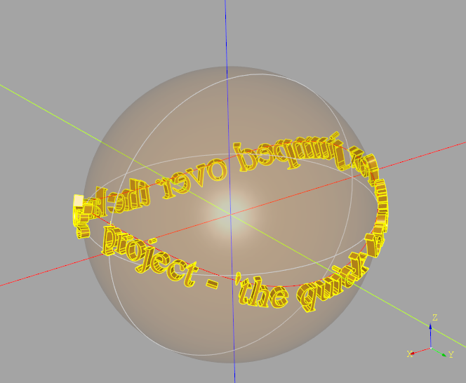

Parameters

```python
                • faces (Union[list[Face], Compound]) – faces to project
```

• path – Path on the Shape to follow

• start – Relative location on path to start the faces. Defaults to 0.

Returns

The projected faces

radius_of_gyration(axis: Axis) →float

Compute the radius of gyration of the shape about a given axis.

The radius of gyration represents the distance from the axis at which the entire mass of the shape could
be concentrated without changing its moment of inertia. It provides insight into how mass is distributed
relative to the axis and is useful in structural analysis, rotational dynamics, and mechanical simulations.

Parameters

axis (Axis) – The axis about which the radius of gyration is computed. The axis should be
defined in the same coordinate system as the shape.

Returns

The radius of gyration in the same units as the shape’s dimensions.

Return type

float

<!-- PDF page 454 -->

Example

```python
         >>> obj = MyShape()
         >>> axis = Axis((0, 0, 0), (0, 0, 1))
         >>> obj.radius_of_gyration(axis)
         5.47
```

Notes

• The radius of gyration is computed based on the shape’s mass properties.

• It is useful for evaluating structural stability and rotational behavior.

classmethod register_composite_factory(dimension: int | None, factory: Callable[[Iterable[Shape]],

Shape]) →None

Register a composite constructor without importing it here.

```python
     relocate(loc: Location)
```

Change the location of self while keeping it geometrically similar

Parameters

loc (Location) – new location to set for self

rotate(axis: Axis, angle: float, transform: bool = False) →Self

rotate a copy

Rotates a shape around an axis.

Parameters

• axis (Axis) – rotation Axis

• angle (float) – angle to rotate, in degrees

• transform (bool) – regenerate the shape instead of just changing its location. Defaults
to False.

Returns

a copy of the shape, rotated

scale(factor: float | tuple[float, float, float], about: Vector | tuple[float, float] | tuple[float, float, float] |
Sequence[float] | None = None) →Self

Scale this shape about a point.

Non-uniform scaling may change the underlying geometry type to splines. When about isn’t provided, the
shape is scaled about its location.

Parameters

• factor (float | tuple[float, float, float]) – uniform scale factor or three
scale factors for the X, Y and Z directions.

• about (VectorLike, optional) – point to scale about. Defaults to the shape’s location
position.

Returns

a copy of the scaled shape.

Return type

Shape

<!-- PDF page 455 -->

```python
     shape_LUT = {<TopAbs_ShapeEnum.TopAbs_COMPOUND: 0>:  'Compound',
     <TopAbs_ShapeEnum.TopAbs_COMPSOLID: 1>:  'CompSolid', <TopAbs_ShapeEnum.TopAbs_EDGE:
     6>:  'Edge', <TopAbs_ShapeEnum.TopAbs_FACE: 4>:  'Face',
     <TopAbs_ShapeEnum.TopAbs_SHELL: 3>:  'Shell', <TopAbs_ShapeEnum.TopAbs_SOLID: 2>:
     'Solid', <TopAbs_ShapeEnum.TopAbs_VERTEX: 7>:  'Vertex',
     <TopAbs_ShapeEnum.TopAbs_WIRE: 5>:  'Wire'}
```

```python
     shape_properties_LUT: dict[TopAbs_ShapeEnum, Callable[[TopoDS_Shape, GProp_GProps],
     None] | None] = {<TopAbs_ShapeEnum.TopAbs_COMPOUND: 0>:  <built-in method
     VolumeProperties_s of PyCapsule object>, <TopAbs_ShapeEnum.TopAbs_COMPSOLID: 1>:
     <built-in method VolumeProperties_s of PyCapsule object>,
     <TopAbs_ShapeEnum.TopAbs_EDGE: 6>:  <built-in method LinearProperties_s of PyCapsule
     object>, <TopAbs_ShapeEnum.TopAbs_FACE: 4>:  <built-in method SurfaceProperties_s of
     PyCapsule object>, <TopAbs_ShapeEnum.TopAbs_SHELL: 3>:  <built-in method
     SurfaceProperties_s of PyCapsule object>, <TopAbs_ShapeEnum.TopAbs_SOLID: 2>:
     <built-in method VolumeProperties_s of PyCapsule object>,
     <TopAbs_ShapeEnum.TopAbs_VERTEX: 7>:  None, <TopAbs_ShapeEnum.TopAbs_WIRE: 5>:
     <built-in method LinearProperties_s of PyCapsule object>}
```

```python
     property shape_type:  Literal['Vertex', 'Edge', 'Wire', 'Face', 'Shell', 'Solid',
     'Compound']
```

Return the shape type string for this class

shell() →Shell

Return the Shell

shells() →ShapeList[Shell]

shells - all the shells in this Shape

show_topology(limit_class: Literal['Compound', 'Edge', 'Face', 'Shell', 'Solid', 'Vertex', 'Wire'] = 'Vertex',
show_center: bool | None = None) →str

Display internal topology

Display the internal structure of a Compound ‘assembly’ or Shape. Example:

```python
         >>> c1.show_topology()
```

```python
         c1 is the root         Compound at 0x7f4a4cafafa0, Location(...))
                                Solid    at 0x7f4a4cafafd0, Location(...))
             c2 is 1st compound Compound at 0x7f4a4cafaee0, Location(...))
```

```python
                                Solid    at 0x7f4a4cafad00, Location(...))
                                Solid    at 0x7f4a11a52790, Location(...))
             c3 is 2nd          Compound at 0x7f4a4cafad60, Location(...))
                                Solid    at 0x7f4a11a52700, Location(...))
                                Solid    at 0x7f4a11a58550, Location(...))
```

Parameters

• limit_class – type of displayed leaf node. Defaults to ‘Vertex’.

• show_center (bool, optional) – If None, shows the Location of Compound ‘assem-
blies’ and the bounding box center of Shapes. True or False forces the display. Defaults to
None.

Returns

tree representation of internal structure

<!-- PDF page 456 -->

Return type

str

solid() →Solid

Return the Solid

solids() →ShapeList[Solid]

solids - all the solids in this Shape

split(tool: TrimmingTool, keep: Literal[Keep.TOP, Keep.BOTTOM]) →Self | list[Self] | None

split(tool: TrimmingTool, keep: Literal[Keep.ALL]) →list[Self]

split(tool: TrimmingTool, keep: Literal[Keep.BOTH]) →tuple[Self | list[Self] | None, Self | list[Self] | None]

split(tool: TrimmingTool, keep: Literal[Keep.INSIDE, Keep.OUTSIDE]) →None
split(tool: TrimmingTool) →Self | list[Self] | None

split

Split this shape by the provided plane or face.

Parameters

• surface (Plane | Face) – surface to segment shape

• keep (Keep, optional) – which object(s) to save. Defaults to Keep.TOP.

Returns

result of split

Return type

Shape

Returns

Self | list[Self] | None, Tuple[Self | list[Self] | None]: The result of the split operation.

• Keep.TOP: Returns the top as a Self or list[Self], or None if no top is found.

• Keep.BOTTOM: Returns the bottom as a Self or list[Self], or None if no bottom is found.

• Keep.BOTH: Returns a tuple (inside, outside) where each element is either a Self or
list[Self], or None if no corresponding part is found.

split_by_perimeter(perimeter: Edge | Wire, keep: Literal[Keep.INSIDE, Keep.OUTSIDE]) →Face |

Shell | ShapeList[Face] | None

split_by_perimeter(perimeter: Edge | Wire, keep: Literal[Keep.BOTH]) →tuple[Face | Shell |

ShapeList[Face] | None, Face | Shell | ShapeList[Face] | None]

split_by_perimeter(perimeter: Edge | Wire, keep: Literal[Keep.INSIDE] = Keep.INSIDE) →Face | Shell

| ShapeList[Face] | None

split_by_perimeter

Divide the faces of this object into those within the perimeter and those outside the perimeter.

Note: this method may fail if the perimeter intersects shape edges.

Parameters

```python
                • perimeter (Union[Edge,Wire]) – closed perimeter
```

• keep (Keep, optional) – which object(s) to return. Defaults to Keep.INSIDE.

Raises

• ValueError – perimeter must be closed

<!-- PDF page 457 -->

• ValueError – keep must be one of Keep.INSIDE|OUTSIDE|BOTH

Returns

Union[Face | Shell | ShapeList[Face] | None, Tuple[Face | Shell | ShapeList[Face] | None]:
The result of the split operation.

• Keep.INSIDE: Returns the inside part as a Shell or Face, or None if no inside part is found.

• Keep.OUTSIDE: Returns the outside part as a Shell or Face, or None if no outside part is
found.

• Keep.BOTH: Returns a tuple (inside, outside) where each element is either a Shell, Face,
or None if no corresponding part is found.

```python
     property static_moments:  tuple[float, float, float]
```

Compute the static moments (first moments of mass) of the shape.

The static moments represent the weighted sum of the coordinates with respect to the mass distribution,
providing insight into the center of mass and mass distribution of the shape.

Returns

The static moments (Mx, My, Mz), where: - Mx is the first moment of mass about the YZ
plane. - My is the first moment of mass about the XZ plane. - Mz is the first moment of mass
about the XY plane.

Return type

tuple[float, float, float]

Example

```python
         >>> obj = MyShape()
         >>> obj.static_moments
         (150.0, 200.0, 50.0)
```

tessellate(tolerance: float, angular_tolerance: float = 0.1) →tuple[list[Vector], list[tuple[int, int, int]]]

General triangulated approximation

to_splines(degree: int = 3, tolerance: float = 0.001, nurbs: bool = False) →Self

A shape-processing utility that forces all geometry in a shape to be converted into BSplines. It’s useful
when working with tools or export formats that require uniform geometry, or for downstream processing
that only understands BSpline representations.

Parameters

• degree (int, optional) – Maximum degree. Defaults to 3.

• tolerance (float, optional) – Approximation tolerance. Defaults to 1e-3.

• nurbs (bool, optional) – Use rational splines. Defaults to False.

Returns

Approximated shape

Return type

Self

touch(other: Shape, tolerance: float = 1e-06) →ShapeList

Find boundary contacts between this shape and another.

Base implementation returns empty ShapeList. Subclasses (Mixin2D, Mixin3D, Compound) override this
to provide actual touch detection.

<!-- PDF page 458 -->

Parameters

• other – Shape to find contacts with

• tolerance – tolerance for contact detection

Returns

ShapeList of contact shapes (empty for base implementation)

transform_geometry(t_matrix: Matrix) →Self

Apply affine transform

WARNING: transform_geometry will sometimes convert lines and circles to splines, but it also has the
ability to handle skew and stretching transformations.

If your transformation is only translation and rotation, it is safer to use transform_shape(), which doesn’t
change the underlying type of the geometry, but cannot handle skew transformations.

Parameters

t_matrix (Matrix) – affine transformation matrix

Returns

a copy of the object, but with geometry transformed

Return type

Shape

transform_shape(t_matrix: Matrix) →Self

Apply affine transform without changing type

Transforms a copy of this Shape by the provided 3D affine transformation matrix. Note that not all transfor-
mation are supported - primarily designed for translation and rotation. See :transform_geometry: for more
comprehensive transformations.

Parameters

t_matrix (Matrix) – affine transformation matrix

Returns

copy of transformed shape with all objects keeping their type

Return type

Shape

transformed(rotate: Vector | tuple[float, float] | tuple[float, float, float] | Sequence[float] = (0, 0, 0), offset:
Vector | tuple[float, float] | tuple[float, float, float] | Sequence[float] = (0, 0, 0)) →Self

Transform Shape

Rotate and translate the Shape by the three angles (in degrees) and offset.

Parameters

• rotate (VectorLike, optional) – 3-tuple of angles to rotate, in degrees. Defaults to
(0, 0, 0).

• offset (VectorLike, optional) – 3-tuple to offset. Defaults to (0, 0, 0).

Returns

transformed object

Return type

Shape

<!-- PDF page 459 -->

translate(vector: Vector | tuple[float, float] | tuple[float, float, float] | Sequence[float], transform: bool =
False) →Self

Translates this shape through a transformation.

Parameters

• vector (VectorLike) – relative movement vector

• transform (bool) – regenerate the shape instead of just changing its location Defaults to
False.

Returns

object with a relative move applied

vertex() →Vertex

Return the Vertex

vertices() →ShapeList[Vertex]

vertices - all the vertices in this Shape

wire() →Wire

Return the Wire

wires() →ShapeList[Wire]

wires - all the wires in this Shape

```python
     property wrapped
```

OCP TopoDS object

class ShapeList(iterable=(), /)

Subclass of list with custom filter and sort methods appropriate to CAD

__and__(other: ShapeList) →ShapeList[T]

Intersect two ShapeLists operator &

__getitem__(key: SupportsIndex) →T
__getitem__(key: slice) →ShapeList[T]

Return slices of ShapeList as ShapeList

__gt__(sort_by: Axis | SortBy = Axis((0, 0, 0), (0, 0, 1))) →ShapeList[T]

Sort operator >

__lshift__(group_by: Axis | SortBy = Axis((0, 0, 0), (0, 0, 1))) →ShapeList[T]

Group and select smallest group operator <<

__lt__(sort_by: Axis | SortBy = Axis((0, 0, 0), (0, 0, 1))) →ShapeList[T]

Reverse sort operator <

__or__(filter_by: Axis | GeomType = Axis((0, 0, 0), (0, 0, 1))) →ShapeList[T]

Filter by axis or geomtype operator |

__rshift__(group_by: Axis | SortBy = Axis((0, 0, 0), (0, 0, 1))) →ShapeList[T]

Group and select largest group operator >>

__sub__(other: ShapeList) →ShapeList[T]

Differences between two ShapeLists operator -

center() →Vector

The average of the center of objects within the ShapeList

<!-- PDF page 460 -->

compound() →Compound

Return the Compound

compounds() →ShapeList[Compound]

compounds - all the compounds in this ShapeList

edge() →Edge

Return the Edge

edges() →ShapeList[Edge]

edges - all the edges in this ShapeList

expand() →ShapeList

Expand by dissolving compounds, wires, and shells, filtering nulls.

Returns

ShapeList with compounds dissolved to children, wires to edges, shells to faces, and nulls
filtered out

face() →Face

Return the Face

faces() →ShapeList[Face]

faces - all the faces in this ShapeList

filter_by(filter_by: Callable[[T], bool] | Axis | Plane | GeomType | property, reverse: bool = False,
tolerance: float = 1e-05) →ShapeList[T]

filter by

Either: - filter objects of type planar Face or linear Edge by their normal or tangent (respectively) and sort
the results by the given axis, or - filter the objects by the provided type. Note that not all types apply to all
objects.

Parameters

• filter_by (Callable[[T], bool] | Axis | Plane | GeomType) – function,
axis, plane, or geom type to filter and possibly sort by. Filtering by a plane returns
faces/edges parallel to that plane.

• reverse (bool, optional) – invert the geom type filter. Defaults to False.

• tolerance (float, optional) – maximum deviation from axis. Defaults to 1e-5.

Raises

ValueError – Invalid filter_by type

Returns

filtered list of objects

Return type

ShapeList

filter_by_position(axis: Axis, minimum: float, maximum: float, inclusive: tuple[bool, bool] = (True,
True)) →ShapeList[T]

filter by position

Filter and sort objects by the position of their centers along given axis. min and max values can be inclusive
or exclusive depending on the inclusive tuple.

Parameters

• axis (Axis) – axis to sort by

<!-- PDF page 461 -->

• minimum (float) – minimum value

• maximum (float) – maximum value

• inclusive (tuple[bool, bool], optional) – include min,max values. Defaults to
(True, True).

Returns

filtered object list

Return type

ShapeList

```python
     property first:  T
```

First element in the ShapeList

group_by(group_by: Callable[[T], K] | Axis | Edge | Wire | SortBy | property = Axis((0, 0, 0), (0, 0, 1)),
reverse: bool = False, tol_digits: int = 6) →GroupBy[T, K]

group by

Group objects by provided criteria and then sort the groups according to the criteria. Note that not all
group_by criteria apply to all objects.

Parameters

• (Callable[[T] (group_by) – optional): group and sort criteria. Defaults to Axis.Z.

```python
                • property (K] | Axis | Edge | Wire | SortBy |) – optional): group and sort cri-
                  teria. Defaults to Axis.Z.
```

:param : optional): group and sort criteria. Defaults to Axis.Z. :param reverse: flip order of sort. Defaults
to False. :type reverse: bool, optional :param tol_digits: Tolerance for building the group keys by

round(key, tol_digits)

Returns

sorted groups of ShapeLists

Return type

GroupBy[T, K]

```python
     property last:  T
```

Last element in the ShapeList

shell() →Shell

Return the Shell

shells() →ShapeList[Shell]

shells - all the shells in this ShapeList

solid() →Solid

Return the Solid

solids() →ShapeList[Solid]

solids - all the solids in this ShapeList

sort_by(sort_by: Callable[[T], K] | Axis | Edge | Wire | SortBy | property = Axis((0, 0, 0), (0, 0, 1)), reverse:
bool = False) →ShapeList[T]

sort by

Sort objects by provided criteria. Note that not all sort_by criteria apply to all objects.

<!-- PDF page 462 -->

Parameters

• (Callable[[T] (sort_by) – optional): sort criteria. Defaults to Axis.Z.

```python
                • property (K] | Axis | Edge | Wire | SortBy |) – optional): sort criteria. De-
                  faults to Axis.Z.
```

:param : optional): sort criteria. Defaults to Axis.Z. :param reverse: flip order of sort. Defaults to False.
:type reverse: bool, optional

Raises

• ValueError – Cannot sort by an empty axis

• ValueError – Cannot sort by an empty object

• ValueError – Invalid sort_by criteria provided

Returns

sorted list of objects

Return type

ShapeList

sort_by_distance(other: Shape | Vector | tuple[float, float] | tuple[float, float, float] | Sequence[float],
reverse: bool = False) →ShapeList[T]

Sort by distance

Sort by minimal distance between objects and other

Parameters

• other (Union[Shape,VectorLike]) – reference object

• reverse (bool, optional) – flip order of sort. Defaults to False.

Returns

Sorted shapes

Return type

ShapeList

vertex() →Vertex

Return the Vertex

vertices() →ShapeList[Vertex]

vertices - all the vertices in this ShapeList

wire() →Wire

Return the Wire

wires() →ShapeList[Wire]

wires - all the wires in this ShapeList

class Shell(obj: TopoDS_Shell | Face | Iterable[Face] | None = None, label: str = '', color: Color | None = None,
parent: Compound | None = None)

A Shell is a fundamental component in build123d’s topological data structure representing a connected set of
faces forming a closed surface in 3D space. As part of a geometric model, it defines a watertight enclosure,
commonly encountered in solid modeling. Shells group faces in a coherent manner, playing a crucial role in
representing complex shapes with voids and surfaces. This hierarchical structure allows for efficient handling of
surfaces within a model, supporting various operations and analyses.

<!-- PDF page 463 -->

center() →Vector

Center of mass of the shell

classmethod extrude(obj: Wire, direction: Vector | tuple[float, float] | tuple[float, float, float] |
Sequence[float]) →Shell

Extrude a Wire into a Shell.

Parameters

direction (VectorLike) – direction and magnitude of extrusion

Raises

• ValueError – Unsupported class

• RuntimeError – Generated invalid result

Returns

extruded shape

Return type

Edge

location_at(surface_point: Vector | tuple[float, float] | tuple[float, float, float] | Sequence[float], *, x_dir:
Vector | tuple[float, float] | tuple[float, float, float] | Sequence[float] | None = None) →
Location

Get the location (origin and orientation) on the surface of the shell.

Parameters

• surface_point (VectorLike) – A 3D point near the surface.

• x_dir (VectorLike, optional) – Direction for the local X axis. If not given, the tan-
gent in the U direction is used.

Returns

A full 3D placement at the specified point on the shell surface.

Return type

Location

classmethod make_loft(objs: Iterable[Vertex | Wire], ruled: bool = False) →Shell

make loft

Makes a loft from a list of wires and vertices. Vertices can appear only at the beginning or end of the list,
but cannot appear consecutively within the list nor between wires. Wires may be closed or opened.

Parameters

```python
                • objs (list[Vertex, Wire]) – wire perimeters or vertices
```

• ruled (bool, optional) – stepped or smooth. Defaults to False (smooth).

Raises

ValueError – Too few wires

Returns

Lofted object

Return type

Shell

```python
     order = 2.5
```

<!-- PDF page 464 -->

classmethod revolve(profile: Curve | Wire, angle: float, axis: Axis) →Face

sweep

Revolve a 1D profile around an axis.

Parameters

• profile (Curve | Wire) – the object to revolve

• angle (float) – the angle to revolve through

• axis (Axis) – rotation Axis

Returns

resulting shell

Return type

Shell

classmethod sweep(profile: Curve | Edge | Wire, path: Curve | Edge | Wire,
transition=<Transition.TRANSFORMED>) →Shell

Sweep a 1D profile along a 1D path

Parameters

```python
                • profile (Union[Curve, Edge, Wire]) – the object to sweep
```

```python
                • path (Union[Curve, Edge, Wire]) – the path to follow when sweeping
```

• transition (Transition, optional) – handling of profile orientation at C1 path dis-
continuities. Defaults to Transition.TRANSFORMED.

Returns

resulting Shell, may be non-planar

Return type

Shell

```python
     property volume:  float
         volume - the volume of this Shell if manifold, otherwise zero
```

class Solid(obj: TopoDS_Solid | Shell | None = None, label: str = '', color: Color | None = None, material: str =
'', joints: dict[str, Joint] | None = None, parent: Compound | None = None)

A Solid in build123d represents a three-dimensional solid geometry in a topological structure. A solid is a closed
and bounded volume, enclosing a region in 3D space. It comprises faces, edges, and vertices connected in a well-
defined manner. Solid modeling operations, such as Boolean operations (union, intersection, and difference), are
often performed on Solid objects to create or modify complex geometries.

draft(faces: Iterable[Face], neutral_plane: Plane, angle: float) →Solid

Apply a draft angle to the given faces of the solid.

Parameters

• faces – Faces to which the draft should be applied.

• neutral_plane – Plane defining the neutral direction and position.

• angle – Draft angle in degrees.

Returns

Solid with the specified draft angles applied.

Raises

RuntimeError – If draft application fails on any face or during build.

<!-- PDF page 465 -->

classmethod extrude(obj: Face, direction: Vector | tuple[float, float] | tuple[float, float, float] |
Sequence[float]) →Solid

Extrude a Face into a Solid.

Parameters

direction (VectorLike) – direction and magnitude of extrusion

Raises

• ValueError – Unsupported class

• RuntimeError – Generated invalid result

Returns

extruded shape

Return type

Edge

classmethod extrude_linear_with_rotation(section: Face | Wire, center: Vector | tuple[float, float] |
tuple[float, float, float] | Sequence[float], normal: Vector
| tuple[float, float] | tuple[float, float, float] |
Sequence[float], angle: float, inner_wires: list[Wire] |
None = None) →Solid

Extrude with Rotation

Creates a ‘twisted prism’ by extruding, while simultaneously rotating around the extrusion vector.

Parameters

```python
                • section (Union[Face,Wire]) – cross section
```

• vec_center (VectorLike) – the center point about which to rotate

• vec_normal (VectorLike) – a vector along which to extrude the wires

• angle (float) – the angle to rotate through while extruding

• inner_wires (list[Wire], optional) – holes - only used if section is of type Wire.
Defaults to None.

Returns

extruded object

Return type

Solid

classmethod extrude_taper(profile: Face, direction: Vector | tuple[float, float] | tuple[float, float, float] |
Sequence[float], taper: float, flip_inner: bool = True) →Solid

Extrude a cross section with a taper

Extrude a cross section into a prismatic solid in the provided direction.

Note that two difference algorithms are used. If direction aligns with the profile normal (which must be
positive), the taper is positive and the profile contains no holes the OCP LocOpe_DPrism algorithm is used
as it generates the most accurate results. Otherwise, a loft is created between the profile and the profile with
a 2D offset set at the appropriate direction.

Parameters

• section (Face]) – cross section

• normal (VectorLike) – a vector along which to extrude the wires. The length of the
vector controls the length of the extrusion.

<!-- PDF page 466 -->

• taper (float) – taper angle in degrees.

• flip_inner (bool, optional) – outer and inner geometry have opposite tapers to allow
for part extraction when injection molding.

Returns

extruded cross section

Return type

Solid

classmethod extrude_until(profile: Face, target: Compound | Solid, direction: VectorLike, until: Until =
<Until.NEXT>) →Solid

Extrude profile in the provided direction until it encounters a bounding surface on the target. The termina-
tion surface is chosen according to the until option:

• Until.NEXT — Extrude forward until the first intersecting surface.

• Until.LAST — Extrude forward through all intersections, stopping at

the farthest surface. * Until.PREVIOUS — Reverse the extrusion direction and stop at the first
intersecting surface behind the profile. * Until.FIRST — Reverse the direction and stop at the
farthest surface behind the profile.

When Until.PREVIOUS or Until.FIRST are used, the extrusion direction is automatically inverted before
execution.

Note

The bounding surface on the target must be large enough to completely cover the extruded profile at the
contact region. Partial overlaps may yield open or invalid solids.

Parameters

• profile (Face) – The face to extrude.

```python
                • target (Union[Compound, Solid]) – The object that limits the extrusion.
```

• direction (VectorLike) – Extrusion direction.

• until (Until, optional) – Surface selection mode controlling which intersection to
stop at. Defaults to Until.NEXT.

Raises

ValueError – If the provided profile does not intersect the target.

Returns

The extruded and limited solid.

Return type

Solid

classmethod from_bounding_box(bbox: BoundBox | OrientedBoundBox) →Solid

A box of the same dimensions and location

classmethod make_box(length: float, width: float, height: float, plane: Plane = Plane((0, 0, 0), (1, 0, 0),
(0, 0, 1))) →Solid

make box

Make a box at the origin of plane extending in positive direction of each axis.

<!-- PDF page 467 -->

Parameters

• length (float)

• width (float)

• height (float)

• plane (Plane, optional) – base plane. Defaults to Plane.XY.

Returns

Box

Return type

Solid

classmethod make_cone(base_radius: float, top_radius: float, height: float, plane: Plane = Plane((0, 0,
0), (1, 0, 0), (0, 0, 1)), angle: float = 360) →Solid

make cone

Make a cone with given radii and height

Parameters

• base_radius (float)

• top_radius (float)

• height (float)

• plane (Plane) – base plane. Defaults to Plane.XY.

• angle (float, optional) – arc size. Defaults to 360.

Returns

Full or partial cone

Return type

Solid

classmethod make_cylinder(radius: float, height: float, plane: Plane = Plane((0, 0, 0), (1, 0, 0), (0, 0,
1)), angle: float = 360) →Solid

make cylinder

Make a cylinder with a given radius and height with the base center on plane origin.

Parameters

• radius (float)

• height (float)

• plane (Plane) – base plane. Defaults to Plane.XY.

• angle (float, optional) – arc size. Defaults to 360.

Returns

Full or partial cylinder

Return type

Solid

classmethod make_loft(objs: Iterable[Vertex | Wire], ruled: bool = False) →Solid

make loft

Makes a loft from a list of wires and vertices. Vertices can appear only at the beginning or end of the list,
but cannot appear consecutively within the list nor between wires.

<!-- PDF page 468 -->

Parameters

```python
                • objs (list[Vertex, Wire]) – wire perimeters or vertices
```

• ruled (bool, optional) – stepped or smooth. Defaults to False (smooth).

Raises

ValueError – Too few wires

Returns

Lofted object

Return type

Solid

classmethod make_sphere(radius: float, plane: Plane = Plane((0, 0, 0), (1, 0, 0), (0, 0, 1)), angle1: float =
-90, angle2: float = 90, angle3: float = 360) →Solid

Sphere

Make a full or partial sphere - with a given radius center on the origin or plane.

Parameters

• radius (float)

• plane (Plane) – base plane. Defaults to Plane.XY.

• angle1 (float, optional) – Defaults to -90.

• angle2 (float, optional) – Defaults to 90.

• angle3 (float, optional) – Defaults to 360.

Returns

sphere

Return type

Solid

classmethod make_torus(major_radius: float, minor_radius: float, plane: Plane = Plane((0, 0, 0), (1, 0,
0), (0, 0, 1)), start_angle: float = 0, end_angle: float = 360, major_angle: float
= 360) →Solid

make torus

Make a torus with a given radii and angles

Parameters

• major_radius (float)

• minor_radius (float)

• plane (Plane) – base plane. Defaults to Plane.XY.

• start_angle (float, optional) – start major arc. Defaults to 0.

• end_angle (float, optional) – end major arc. Defaults to 360.

Returns

Full or partial torus

Return type

Solid

<!-- PDF page 469 -->

classmethod make_wedge(delta_x: float, delta_y: float, delta_z: float, min_x: float, min_z: float, max_x:
float, max_z: float, plane: Plane = Plane((0, 0, 0), (1, 0, 0), (0, 0, 1))) →Solid

Make a wedge

Parameters

• delta_x (float)

• delta_y (float)

• delta_z (float)

• min_x (float)

• min_z (float)

• max_x (float)

• max_z (float)

• plane (Plane) – base plane. Defaults to Plane.XY.

Returns

wedge

Return type

Solid

```python
     order = 3.0
```

classmethod revolve(section: Face | Wire, angle: float, axis: Axis, inner_wires: list[Wire] | None =
None) →Solid

Revolve

Revolve a cross section about the given Axis by the given angle.

Parameters

```python
                • section (Union[Face,Wire]) – cross section
```

• angle (float) – the angle to revolve through

• axis (Axis) – rotation Axis

• inner_wires (list[Wire], optional) – holes - only used if section is of type Wire.
Defaults to [].

Returns

the revolved cross section

Return type

Solid

classmethod sweep(section: ~topology.two_d.Face | ~topology.one_d.Wire, path: ~topology.one_d.Wire |
~topology.one_d.Edge, inner_wires: list[~topology.one_d.Wire] | None = None,
make_solid: bool = True, is_frenet: bool = False, mode: ~build123d.geometry.Vector |
~topology.one_d.Wire | ~topology.one_d.Edge | None = None, transition:
~build123d.build_enums.Transition = <Transition.TRANSFORMED>) →Solid

Sweep

Sweep the given cross section into a prismatic solid along the provided path

The is_frenet parameter controls how the profile orientation changes as it follows along the sweep path. If
is_frenet is False, the orientation of the profile is kept consistent from point to point. The resulting shape
has the minimum possible twisting. Unintuitively, when a profile is swept along a helix, this results in the

<!-- PDF page 470 -->

orientation of the profile slowly creeping (rotating) as it follows the helix. Setting is_frenet to True prevents
this.

If is_frenet is True the orientation of the profile is based on the local curvature and tangency vectors of
the path. This keeps the orientation of the profile consistent when sweeping along a helix (because the
curvature vector of a straight helix always points to its axis). However, when path is not a helix, the resulting
shape can have strange looking twists sometimes. For more information, see Frenet Serret formulas http:
//en.wikipedia.org/wiki/Frenet%E2%80%93Serret_formulas.

Parameters

```python
                • section (Union[Face, Wire]) – cross section to sweep
```

```python
                • path (Union[Wire, Edge]) – sweep path
```

• inner_wires (list[Wire]) – holes - only used if section is a wire

• make_solid (bool, optional) – return Solid or Shell. Defaults to True.

• is_frenet (bool, optional) – Frenet mode. Defaults to False.

```python
                • mode (Union[Vector, Wire, Edge, None], optional) – additional sweep mode
                  parameters. Defaults to None.
```

• transition (Transition, optional) – handling of profile orientation at C1 path dis-
continuities. Defaults to Transition.TRANSFORMED.

Returns

the swept cross section

Return type

Solid

classmethod sweep_multi(profiles: Iterable[Wire | Face], path: Wire | Edge, make_solid: bool = True,
is_frenet: bool = False, binormal: Vector | Wire | Edge | None = None) →
Solid

Multi section sweep

Sweep through a sequence of profiles following a path.

The is_frenet parameter controls how the profile orientation changes as it follows along the sweep path. If
is_frenet is False, the orientation of the profile is kept consistent from point to point. The resulting shape
has the minimum possible twisting. Unintuitively, when a profile is swept along a helix, this results in the
orientation of the profile slowly creeping (rotating) as it follows the helix. Setting is_frenet to True prevents
this.

If is_frenet is True the orientation of the profile is based on the local curvature and tangency vectors of
the path. This keeps the orientation of the profile consistent when sweeping along a helix (because the
curvature vector of a straight helix always points to its axis). However, when path is not a helix, the resulting
shape can have strange looking twists sometimes. For more information, see Frenet Serret formulas http:
//en.wikipedia.org/wiki/Frenet%E2%80%93Serret_formulas.

Parameters

```python
                • profiles (Iterable[Union[Wire, Face]]) – list of profiles
```

```python
                • path (Union[Wire, Edge]) – The wire to sweep the face resulting from the wires over
```

• make_solid (bool, optional) – Solid or Shell. Defaults to True.

• is_frenet (bool, optional) – Select frenet mode. Defaults to False.

```python
                • binormal (Union[Vector, Wire, Edge, None], optional) – additional sweep
                  mode parameters. Defaults to None.
```

<!-- PDF page 471 -->

Returns

swept object

Return type

Solid

classmethod thicken(surface: Face | Shell, depth: float, normal_override: Vector | tuple[float, float] |
tuple[float, float, float] | Sequence[float] | None = None) →Solid

Thicken Face or Shell

Create a solid from a potentially non planar face or shell by thickening along the normals.

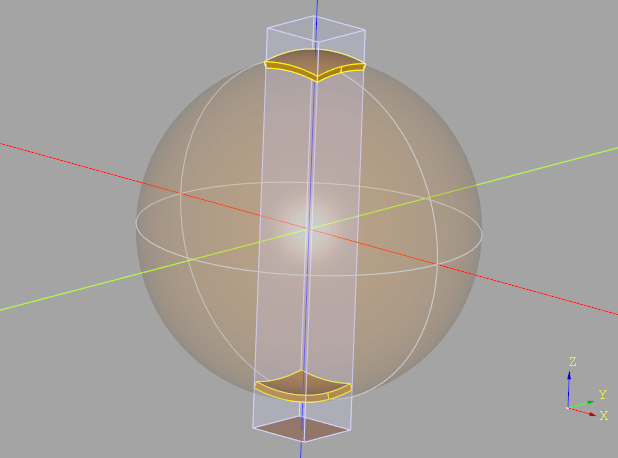

Non-planar faces are thickened both towards and away from the center of the sphere.

Parameters

• depth (float) – Amount to thicken face(s), can be positive or negative.

• normal_override (Vector, optional) – Face only. The normal_override vector can
be used to indicate which way is ‘up’, potentially flipping the face normal direction such
that many faces with different normals all go in the same direction (direction need only be
+/- 90 degrees from the face normal). Defaults to None.

Raises

RuntimeError – Opencascade internal failures

Returns

The resulting Solid object

Return type

Solid

<!-- PDF page 472 -->

touch(other: Shape, tolerance: float = 1e-06, found_solids: ShapeList | None = None) →ShapeList[Vertex |

Edge | Face]

Find where this Solid’s boundary contacts another shape.

Returns geometry where boundaries contact without interior overlap: - Solid + Solid →Face + Edge +
Vertex (all boundary contacts) - Solid + Face/Shell →Face + Edge + Vertex (boundary contacts) - Solid +
Edge/Wire →Vertex (edge endpoints on solid boundary) - Solid + Vertex →Vertex if on boundary - Solid
+ Compound →distributes over compound elements

Parameters

• other – Shape to check boundary contacts with

• tolerance – tolerance for contact detection

• found_solids – pre-found intersection solids to filter against

Returns

ShapeList of boundary contact geometry (empty if no contact)

```python
     property volume:  float
```

volume - the volume of this Solid

class Wire(obj: TopoDS_Wire, label: str = '', color: Color | None = None, parent: Compound | None = None)

class Wire(edge: Edge, label: str = '', color: Color | None = None, parent: Compound | None = None)

class Wire(wire: Wire, label: str = '', color: Color | None = None, parent: Compound | None = None)

class Wire(wire: Curve, label: str = '', color: Color | None = None, parent: Compound | None = None)

class Wire(edges: Iterable[Edge], sequenced: bool = False, label: str = '', color: Color | None = None, parent:

Compound | None = None)

A Wire in build123d is a topological entity representing a connected sequence of edges forming a continuous
curve or path in 3D space. Wires are essential components in modeling complex objects, defining boundaries for
surfaces or solids. They store information about the connectivity and order of edges, allowing precise definition
of paths within a 3D model.

chamfer_2d(distance: float, distance2: float, vertices: Iterable[Vertex], edge: Edge | None = None) →Wire

Apply 2D chamfer to a wire

Parameters

• distance (float) – chamfer length

• distance2 (float) – chamfer length

• vertices (Iterable[Vertex]) – vertices to chamfer

• edge (Edge) – identifies the side where length is measured. The vertices must be part of
the edge

Returns

chamfered wire

Return type

Wire

close() →Wire

Close a Wire

classmethod combine(wires: Iterable[Wire | Edge], tol: float = 1e-09) →ShapeList[Wire]

Combine a list of wires and edges into a list of Wires.

Parameters

<!-- PDF page 473 -->

```python
                • wires (Iterable[Wire | Edge]) – unsorted
```

• tol (float, optional) – tolerance. Defaults to 1e-9.

Returns

Wires

Return type

ShapeList[Wire]

edges() →ShapeList[Edge]

edges - all the edges in this Shape

classmethod extrude(obj: Shape, direction: Vector | tuple[float, float] | tuple[float, float, float] |
Sequence[float]) →Wire

extrude - invalid operation for Wire

fillet_2d(radius: float, vertices: Iterable[Vertex]) →Wire

Apply 2D fillet to a wire

Parameters

• radius (float)

• vertices (Iterable[Vertex]) – vertices to fillet

Raises

• RuntimeError – Internal error

• ValueError – empty wire

Returns

filleted wire

Return type

Wire

fix_degenerate_edges(precision: float) →Wire

Fix a Wire that contains degenerate (very small) edges

Parameters

precision (float) – minimum value edge length

Returns

fixed wire

Return type

Wire

geom_adaptor() →BRepAdaptor_CompCurve

Return the Geom Comp Curve for this Wire

geom_equal(other: Wire, tol: float = 1e-06, num_interpolation_points: int = 5) →bool

Compare two wires for geometric equality within tolerance.

This compares the geometric properties of two wires by comparing their constituent edges pairwise. Two
independently created wires with the same geometry will return True.

Parameters

• other – Wire to compare with

• tol – Tolerance for numeric comparisons. Defaults to 1e-6.

<!-- PDF page 474 -->

• num_interpolation_points – Number of points to sample for unknown curve types.
Defaults to 5.

Returns

True if wires are geometrically equal within tolerance

Return type

bool

classmethod make_circle(radius: float, plane: Plane = Plane((0, 0, 0), (1, 0, 0), (0, 0, 1))) →Wire

Makes a circle centered at the origin of plane

Parameters

• radius (float) – circle radius

• plane (Plane) – base plane. Defaults to Plane.XY

Returns

a circle

Return type

Wire

classmethod make_convex_hull(edges: Iterable[Edge], tolerance: float = 0.001) →Wire

Create a wire of minimum length enclosing all of the provided edges.

Note that edges can’t overlap each other.

Parameters

• edges (Iterable[Edge]) – edges defining the convex hull

• tolerance (float) – allowable error as a fraction of each edge length. Defaults to 1e-3.

Raises

ValueError – edges overlap

Returns

convex hull perimeter

Return type

Wire

classmethod make_ellipse(x_radius: float, y_radius: float, plane: ~build123d.geometry.Plane =
Plane((0, 0, 0), (1, 0, 0), (0, 0, 1)), start_angle: float = 360.0, end_angle:
float = 360.0, angular_direction: ~build123d.build_enums.AngularDirection
= <AngularDirection.COUNTER_CLOCKWISE>, closed: bool = True) →
Wire

make ellipse

Makes an ellipse centered at the origin of plane.

Parameters

• x_radius (float) – x radius of the ellipse (along the x-axis of plane)

• y_radius (float) – y radius of the ellipse (along the y-axis of plane)

• plane (Plane, optional) – base plane. Defaults to Plane.XY.

• start_angle (float, optional) – _description_. Defaults to 360.0.

• end_angle (float, optional) – _description_. Defaults to 360.0.

<!-- PDF page 475 -->

• angular_direction (AngularDirection, optional) – arc direction. Defaults to
AngularDirection.COUNTER_CLOCKWISE.

• closed (bool, optional) – close the arc. Defaults to True.

Returns

an ellipse

Return type

Wire

classmethod make_polygon(vertices: Iterable[Vector | tuple[float, float] | tuple[float, float, float] |
Sequence[float]], close: bool = True) →Wire

Create an irregular polygon by defining vertices

Parameters

• vertices (Iterable[VectorLike])

• close (bool, optional) – close the polygon. Defaults to True.

Returns

an irregular polygon

Return type

Wire

classmethod make_rect(width: float, height: float, plane: Plane = Plane((0, 0, 0), (1, 0, 0), (0, 0, 1))) →

Wire

Make Rectangle

Make a Rectangle centered on center with the given normal

Parameters

• width (float) – width (local x)

• height (float) – height (local y)

• plane (Plane, optional) – plane containing rectangle. Defaults to Plane.XY.

Returns

The centered rectangle

Return type

Wire

```python
     order = 1.5
```

static order_chamfer_edges(reference_edge: Edge | None, edges: tuple[Edge, Edge]) →tuple[Edge,

Edge]

Order the edges of a chamfer relative to a reference Edge

order_edges() →ShapeList[Edge]

Return the edges in self ordered by wire direction and orientation

param_at(position: float) →float

Return the OCCT comp-curve parameter corresponding to the given wire position. This is not the edge
composite parameter; it is the parameter of the wire’s BRepAdaptor_CompCurve.

<!-- PDF page 476 -->

param_at_point(point: Vector | tuple[float, float] | tuple[float, float, float] | Sequence[float]) →float

Return the normalized wire parameter for the point closest to this wire.

This method projects the given point onto the wire, finds the nearest edge, and accumulates arc lengths to
determine the fractional position along the entire wire. The result is normalized to the interval [0.0, 1.0],
where:

• 0.0 corresponds to the start of the wire

• 1.0 corresponds to the end of the wire

Unlike the edge version of this method, the returned value is not an OCCT curve parameter, but a normal-
ized parameter across the wire as a whole.

Parameters

point (VectorLike) – The point to project onto the wire.

Raises

ValueError – Can’t find point on empty wire

Returns

Normalized parameter in [0.0, 1.0] representing the relative position of the projected point
along the wire.

Return type

float

project_to_shape(target_object: Shape, direction: Vector | tuple[float, float] | tuple[float, float, float] |
Sequence[float] | None = None, center: Vector | tuple[float, float] | tuple[float, float,
float] | Sequence[float] | None = None) →ShapeList[Wire]

Project Wire

Project a Wire onto a Shape generating new wires on the surfaces of the object one and only one of direction
or center must be provided. Note that one or more wires may be generated depending on the topology of
the target object and location/direction of projection.

To avoid flipping the normal of a face built with the projected wire the orientation of the output wires are
forced to be the same as self.

Parameters

• target_object – Object to project onto

• direction – Parallel projection direction. Defaults to None.

• center – Conical center of projection. Defaults to None.

• target_object – Shape:

• direction – VectorLike: (Default value = None)

• center – VectorLike: (Default value = None)

Returns

Projected wire(s)

Raises

ValueError – Only one of direction or center must be provided

stitch(other: Wire) →Wire

Attempt to stitch wires

Parameters

other (Wire) – wire to combine

<!-- PDF page 477 -->

Raises

ValueError – Can’t stitch empty wires

Returns

stitched wires

Return type

Wire

to_wire() →Wire

Return Wire - used as a pair with Edge.to_wire when self is Wire | Edge

trim(start: float | Vector | tuple[float, float] | tuple[float, float, float] | Sequence[float], end: float | Vector |
tuple[float, float] | tuple[float, float, float] | Sequence[float]) →Wire

Trim a wire between [start, end] normalized over total length.

Parameters

• start (float | VectorLike) – normalized start position (0.0 to <1.0) or point

• end (float | VectorLike) – normalized end position (>0.0 to 1.0) or point

Returns

trimmed Wire

Return type

Wire

```python
class Vertex
```

```python
class Vertex(ocp_vx: TopoDS_Vertex)
```

class Vertex(X: float, Y: float, Z: float)

```python
class Vertex(v: Iterable[float])
```

A Vertex in build123d represents a zero-dimensional point in the topological data structure. It marks the end-
points of edges within a 3D model, defining precise locations in space. Vertices play a crucial role in defining the
geometry of objects and the connectivity between edges, facilitating accurate representation and manipulation
of 3D shapes. They hold coordinate information and are essential for constructing complex structures like wires,
faces, and solids.

__add__(other: Vertex | Vector | tuple[float, float, float]) →Vertex

Add

Add to a Vertex with a Vertex, Vector or Tuple

Parameters

other – Value to add

Raises

TypeError – other not in [Tuple,Vector,Vertex]

Returns

Result

Example

part.faces(“>z”).vertices(“<y and <x”).val() + (0, 0, 15)

which creates a new Vertex 15 above one extracted from a part. One can add or subtract a Vertex , Vector
or tuple of float values to a Vertex.

<!-- PDF page 478 -->

__sub__(other: Vertex | Vector | tuple) →Vertex

Subtract

Subtract a Vertex with a Vertex, Vector or Tuple from self

Parameters

other – Value to add

Raises

TypeError – other not in [Tuple,Vector,Vertex]

Returns

Result

Example

part.faces(“>z”).vertices(“<y and <x”).val() - Vector(10, 0, 0)

classmethod cast(obj: TopoDS_Shape) →Self

Returns the right type of wrapper, given a OCCT object

center() →Vector

The center of a vertex is itself!

classmethod extrude(obj: Shape, direction: Vector | tuple[float, float] | tuple[float, float, float] |
Sequence[float]) →Vertex

extrude - invalid operation for Vertex

```python
     order = 0.0
```

split(tool: TrimmingTool, keep: Keep = <Keep.TOP>)

split - not implemented

to_tuple() →tuple[float, float, float]

Return vertex as three tuple of floats

transform_shape(t_matrix: Matrix) →Vertex

Apply affine transform without changing type

Transforms a copy of this Vertex by the provided 3D affine transformation matrix. Note that not all trans-
formation are supported - primarily designed for translation and rotation. See :transform_geometry: for
more comprehensive transformations.

Parameters

t_matrix (Matrix) – affine transformation matrix

Returns

copy of transformed shape with all objects keeping their type

Return type

Vertex

vertex() →Vertex

Return the Vertex

vertices() →ShapeList[Vertex]

vertices - all the vertices in this Shape

```python
     property volume:  float
```

volume - the volume of this Vertex, which is always zero

<!-- PDF page 479 -->

class Curve(obj: TopoDS_Compound | Iterable[Shape] | None = None, label: str = '', color: Color | None =
None, material: str = '', joints: dict[str, Joint] | None = None, parent: Compound | None = None,
children: Sequence[Shape] | None = None)

A Compound containing 1D objects - aka Edges

__matmul__(position: float) →Vector

Position on curve operator @ - only works if continuous

__mod__(position: float) →Vector

Tangent on wire operator % - only works if continuous

wires() →ShapeList[Wire]

A list of wires created from the edges

class Part(obj: TopoDS_Compound | Iterable[Shape] | None = None, label: str = '', color: Color | None = None,
material: str = '', joints: dict[str, Joint] | None = None, parent: Compound | None = None, children:
Sequence[Shape] | None = None)

A Compound containing 3D objects - aka Solids

class Sketch(obj: TopoDS_Compound | Iterable[Shape] | None = None, label: str = '', color: Color | None =
None, material: str = '', joints: dict[str, Joint] | None = None, parent: Compound | None = None,
children: Sequence[Shape] | None = None)

A Compound containing 2D objects - aka Faces

1.22.3 Import/Export

Methods and functions specific to exporting and importing build123d objects are defined below.

import_brep(file_name: PathLike | str | bytes) →Shape

Import shape from a BREP file

Parameters

file_name (Union[PathLike, str, bytes]) – brep file

Raises

ValueError – file not found

Returns

build123d object

Return type

Shape

import_step(filename: PathLike | str | bytes) →Compound

Extract shapes from a STEP file and return them as a Compound object.

Parameters

file_name (Union[PathLike, str, bytes]) – file path of STEP file to import

Raises

ValueError – can’t open file

Returns

contents of STEP file

Return type

Compound

<!-- PDF page 480 -->

import_stl(file_name: ~os.PathLike | str | bytes, model_unit: ~build123d.build_enums.Unit = <Unit.MM>) →
Face

Extract shape from an STL file and return it as a Face reference object.

Note that importing with this method and creating a reference is very fast while creating an editable model (with
Mesher) may take minutes depending on the size of the STL file.

Parameters

• file_name (Union[PathLike, str, bytes]) – file path of STL file to import

• model_unit (Unit, optional) – the default unit used when creating the model. For ex-
ample, Blender defaults to Unit.M. Defaults to Unit.MM.

Raises

• ValueError – Could not import file

• ValueError – Invalid model_unit

Returns

STL model

Return type

Face

import_svg(svg_file: str | Path | TextIO, *, flip_y: bool = True, align: Align | tuple[Align, Align] | None =
Align.MIN, ignore_visibility: bool = False, label_by: Literal['id', 'class', 'inkscape:label'] | str = 'id')
→ShapeList[Wire | Face]

import_svg(svg_file: str | Path | TextIO, *, flip_y: bool = True, align: Align | tuple[Align, Align] | None =
Align.MIN, ignore_visibility: bool = False, label_by: Literal['id', 'class', 'inkscape:label'] | str = 'id',
is_inkscape_label: bool | None = None) →ShapeList[Wire | Face]

import_svg

Parameters

• svg_file (Union[str, Path, TextIO]) – svg file

• flip_y (bool, optional) – flip objects to compensate for svg orientation. Defaults to
True.

• align (Align | tuple[Align, Align] | None, optional) – alignment of the
SVG’s viewbox, if None, the viewbox’s origin will be at (0,0,0). Defaults to Align.MIN.

• ignore_visibility (bool, optional) – Defaults to False.

• label_by (str, optional) – XML attribute to use for imported shapes’ label property.
Defaults to “id”. Use inkscape:label to read labels set from Inkscape’s “Layers and Objects”
panel.

Raises

ValueError – unexpected shape type

Returns

objects contained in svg

Return type

ShapeList[Union[Wire, Face]]

import_svg_as_buildline_code(file_name: PathLike | str | bytes, precision: int = 6) →tuple[str, str]

translate_to_buildline_code

Translate the contents of the given svg file into executable build123d/BuildLine code.

<!-- PDF page 481 -->

Parameters

• file_name (PathLike | str | bytes]) – svg file name

• precision (int) – # digits to round values to. Defaults to # digits in TOLERANCE

Returns

code, builder instance name

Return type

tuple[str, str]

1.22.4 Joint Object

Base Joint class which is used to position Solid and Compound objects relative to each other are defined below. The
Joints section contains the class description of the derived Joint classes.

class Joint(label: str, parent: BuildPart | Solid | Compound)

Abstract Base Joint class - used to join two components together

Parameters

```python
            parent (Union[Solid, Compound]) – object that joint to bound to
```

Variables

• label (str) – user assigned label

• parent (Shape) – object joint is bound to

• connected_to (Joint) – joint that is connect to this joint

abstract connect_to(*args, **kwargs)

All derived classes must provide a connect_to method

```python
     abstract property location:  Location
```

Location of joint

abstract relative_to(*args, **kwargs) →Location

Return relative location to another joint

```python
     abstract property symbol:  Compound
```

A CAD object positioned in global space to illustrate the joint


<!-- END direct_api_reference.md -->


<!-- BEGIN indices_and_tables.md -->

---
title: "Indices and tables"
source_html: "https://build123d.readthedocs.io/en/latest/index.html#indices-and-tables"
extracted_from: "official ReadTheDocs PDF"
pdf_release: "0.11.1.dev21+gbbce3cdd6"
pdf_pages: "481-483"
generated_on: "2026-07-01"
---

# Indices and tables

> Converted to Markdown from the official build123d ReadTheDocs PDF. PDF page markers and local extracted-image links are included for traceability. Some line wrapping reflects the PDF layout.
<!-- PDF page 481 -->

1.23 Indices and tables

• genindex

• modindex

• search

<!-- PDF page 483 -->

PYTHON MODULE INDEX


<!-- END indices_and_tables.md -->


<!-- BEGIN python_module_index.md -->

---
title: "Python Module Index"
source_html: "https://build123d.readthedocs.io/en/latest/py-modindex.html"
extracted_from: "official ReadTheDocs PDF"
pdf_release: "0.11.1.dev21+gbbce3cdd6"
pdf_pages: "483-485"
generated_on: "2026-07-01"
---

# Python Module Index

> Converted to Markdown from the official build123d ReadTheDocs PDF. PDF page markers and local extracted-image links are included for traceability. Some line wrapping reflects the PDF layout.
<!-- PDF page 483 -->

b
build_enums, 378
build_line, 317
build_part, 323
build_sketch, 320

e
exporters3d, 353

g
geometry, 384

i
import_dxf, 357
importers, 357

j
joints, 324

o
objects_curve, 236
objects_part, 261
objects_sketch, 251

p
pack, 340

t
topology, 400

<!-- PDF page 485 -->

INDEX


<!-- END python_module_index.md -->


<!-- BEGIN general_index.md -->

---
title: "Index"
source_html: "https://build123d.readthedocs.io/en/latest/genindex.html"
extracted_from: "official ReadTheDocs PDF"
pdf_release: "0.11.1.dev21+gbbce3cdd6"
pdf_pages: "485-493"
generated_on: "2026-07-01"
---

# Index

> Converted to Markdown from the official build123d ReadTheDocs PDF. PDF page markers and local extracted-image links are included for traceability. Some line wrapping reflects the PDF layout.
<!-- PDF page 485 -->

__pow__() (Location method), 389
__rmul__() (Shape method), 439
__rmul__() (Vector method), 397
__rshift__() (ShapeList method), 455
__sub__() (Shape method), 439
__sub__() (ShapeList method), 455
__sub__() (Vector method), 397
__sub__() (Vertex method), 473
__truediv__() (Vector method), 397

A
A (Triangle attribute), 259
a (Triangle attribute), 260
ADD (Mode attribute), 380
add() (BoundBox method), 387
add() (in module operations_generic), 271
add() (Vector method), 397
add_code_to_metadata() (Mesher method), 355
add_meta_data() (Mesher method), 355
add_shape() (Mesher method), 355
Airfoil (class in objects_curve), 236
Align (class in build_enums), 378
ALL (Keep attribute), 379
ALL (Select attribute), 380
angle_between() (Axis method), 385
apothem (RegularPolygon attribute), 255
ARC (Kind attribute), 380
arc_center (Edge property), 404
ArcArcTangentArc (class in objects_curve), 248
ArcArcTangentLine (class in objects_curve), 248
area (Shape property), 440
AREA (SortBy attribute), 380
area_without_holes (Face property), 414
Arrow (class in drafting), 251
ArrowHead (class in drafting), 252
axes_of_symmetry (Face property), 415
Axis (class in geometry), 384
axis_of_rotation (Face property), 415

Symbols
__abs__() (Vector method), 396
__add__() (Shape method), 439
__add__() (Vector method), 397
__add__() (Vertex method), 473
__and__() (Shape method), 439
__and__() (ShapeList method), 455
__copy__() (Axis method), 385
__copy__() (Color method), 388
__copy__() (Location method), 389
__copy__() (Matrix method), 392
__copy__() (Plane method), 393
__copy__() (Shape method), 439
__copy__() (Vector method), 397
__deepcopy__() (Axis method), 385
__deepcopy__() (Color method), 388
__deepcopy__() (Location method), 389
__deepcopy__() (Matrix method), 392
__deepcopy__() (Plane method), 393
__deepcopy__() (Shape method), 439
__deepcopy__() (Vector method), 397
__eq__() (Location method), 389
__eq__() (Plane method), 393
__eq__() (Shape method), 439
__eq__() (Vector method), 397
__getitem__() (ShapeList method), 455
__gt__() (ShapeList method), 455
__hash__() (Shape method), 439
__lshift__() (ShapeList method), 455
__lt__() (ShapeList method), 455
__matmul__() (Curve method), 475
__matmul__() (Mixin1D method), 427
__mod__() (Curve method), 475
__mod__() (Mixin1D method), 427
__mul__() (Location method), 389
__mul__() (Plane method), 393
__mul__() (Vector method), 397
__neg__() (Axis method), 385
__neg__() (Location method), 389
__neg__() (Plane method), 393
__neg__() (Vector method), 397
__or__() (ShapeList method), 455

B
B (Triangle attribute), 259
b (Triangle attribute), 260

<!-- PDF page 486 -->

BallJoint (class in joints), 336
BaseLineObject (class in objects_curve), 236
BasePartObject (class in objects_part), 261
BaseSketchObject (class in objects_sketch), 251
Bezier (class in objects_curve), 237
BEZIER (GeomType attribute), 379
BlendCurve (class in objects_curve), 237
BOLD (FontStyle attribute), 379
BOLDITALIC (FontStyle attribute), 379
BOTH (Keep attribute), 380
BOTTOM (Keep attribute), 380
BoundBox (class in geometry), 387
BOUNDING_BOX (CenterOf attribute), 379
bounding_box() (in module operations_generic), 271
bounding_box() (Shape method), 440
Box (class in objects_part), 261
BSpline (class in objects_curve), 238
BSPLINE (GeomType attribute), 379
build_enums
module, 378
build_line
module, 317
build_part
module, 323
build_sketch
module, 320
BuildLine (class in build_line), 317
BuildPart (class in build_part), 323
BuildSketch (class in build_sketch), 320

CenterArc (class in objects_curve), 239
CenterOf (class in build_enums), 379
chamfer() (in module operations_generic), 272
chamfer() (Mixin3D method), 435
chamfer_2d() (Face method), 415
chamfer_2d() (Wire method), 468
Circle (class in objects_sketch), 252
CIRCLE (GeomType attribute), 379
clean() (Shape method), 440
close() (Edge method), 404
close() (Wire method), 468
closest_points() (Shape method), 440
code (Airfoil attribute), 237
Color (class in geometry), 388
color (Shape property), 440
combine() (Wire class method), 468
combined_center() (Shape static method), 440
common_plane() (Mixin1D method), 427
composite_factories (Shape attribute), 440
Compound (class in topology), 400
compound() (Compound method), 400
compound() (Shape method), 441
compound() (ShapeList method), 455
compounds() (Compound method), 401
compounds() (Shape method), 441
compounds() (ShapeList method), 456
compute_mass() (Shape static method), 441
Cone (class in objects_part), 261
CONE (GeomType attribute), 379
connect_to() (BallJoint method), 337
connect_to() (CylindricalJoint method), 333
connect_to() (Joint method), 477
connect_to() (LinearJoint method), 332
connect_to() (RevoluteJoint method), 328
connect_to() (RigidJoint method), 326
consolidate_edges() (BuildSketch method), 320
ConstrainedArcs (class in objects_curve), 239
ConstrainedLines (class in objects_curve), 240
contains() (Plane method), 393
ConvexPolyhedron (class in objects_part), 262
copy_attributes_to() (Shape method), 441
CounterBoreHole (class in objects_part), 262
CounterSinkHole (class in objects_part), 262
cross() (Vector method), 397
curvature_comb() (Mixin1D method), 427
Curve (class in topology), 474
cut() (Shape method), 441
Cylinder (class in objects_part), 263
CYLINDER (GeomType attribute), 379
CylindricalJoint (class in joints), 333

C
C (Triangle attribute), 259
c (Triangle attribute), 260
camber_line (Airfoil property), 236
camber_pos (Airfoil attribute), 237
cast() (Compound class method), 400
cast() (Mixin1D class method), 427
cast() (Mixin2D class method), 433
cast() (Mixin3D class method), 435
cast() (Shape class method), 440
cast() (Vertex class method), 474
categorical_set() (Color class method), 389
CENTER (Align attribute), 378
center() (BoundBox method), 387
center() (Compound method), 400
center() (Face method), 415
center() (Location method), 390
center() (Mixin1D method), 427
center() (Mixin3D method), 435
center() (ShapeList method), 455
center() (Shell method), 458
center() (Vector method), 397
center() (Vertex method), 474
center_location (Face property), 415

D
default() (LocationEncoder method), 391
derivative_at() (Mixin1D method), 428

<!-- PDF page 487 -->

extrude() (Solid class method), 460
extrude() (Vertex class method), 474
extrude() (Wire class method), 469
extrude_linear_with_rotation()  (Solid class
method), 461
extrude_taper() (Solid class method), 461
extrude_until() (Solid class method), 462
EXTRUSION (GeomType attribute), 379

detect_primitives() (in module build123d), 359
diagonal (BoundBox property), 387
dimension (DimensionLine attribute), 253
dimension (ExtensionLine attribute), 254
DimensionLine (class in drafting), 252
direction (Axis property), 385
DISTANCE (SortBy attribute), 380
distance() (Shape method), 441
distance_to() (Shape method), 441
distance_to_plane() (Vector method), 397
distance_to_with_closest_points()     (Shape
method), 441
distances() (Shape method), 441
distribute_locations() (Edge method), 404
do_children_intersect() (Compound method), 401
dot() (Vector method), 397
DoubleTangentArc (class in objects_curve), 241
downcast_LUT (Shape attribute), 442
dprism() (Mixin3D method), 435
draft() (in module operations_part), 272
draft() (Solid method), 460

F
Face (class in topology), 414
face() (BuildLine method), 317
face() (in module build_common), 281
face() (Shape method), 442
face() (ShapeList method), 456
faces() (Builder method), 377
faces() (BuildLine method), 317
faces() (in module build_common), 281
faces() (Shape method), 442
faces() (ShapeList method), 456
faces_intersected_by_axis() (Shape method), 442
fillet() (in module operations_generic), 273
fillet() (Mixin3D method), 436
fillet_2d() (Face method), 416
fillet_2d() (Wire method), 469
FilletPolyline (class in objects_curve), 244
filter_by() (ShapeList method), 456
filter_by_position() (ShapeList method), 456
find_intersection_points() (Edge method), 404
find_intersection_points() (Mixin2D  method),
433
find_intersection_points() (Mixin3D  method),
436
find_outside_box_2d() (BoundBox static method),

387
find_tangent() (Edge method), 405
finite_te (Airfoil attribute), 237
first (ShapeList property), 457
FIRST (Until attribute), 381
fix() (Shape method), 443
fix_degenerate_edges() (Wire method), 469
FontStyle (class in build_enums), 379
forward_transform (Plane property), 394
from_bounding_box() (Solid class method), 462
from_local_coords() (Plane method), 394
from_topo_ds() (BoundBox class method), 388
full_round() (in module operations_sketch), 273
fuse() (Shape method), 443

E
Edge (class in topology), 403
edge() (in module build_common), 280
edge() (Shape method), 442
edge() (ShapeList method), 456
edge_a (Triangle attribute), 260
edge_b (Triangle attribute), 260
edge_c (Triangle attribute), 260
edges() (Builder method), 378
edges() (in module build_common), 280
edges() (Shape method), 442
edges() (ShapeList method), 456
edges() (Wire method), 469
Ellipse (class in objects_sketch), 253
ELLIPSE (GeomType attribute), 379
EllipticalCenterArc (class in objects_curve), 241
EllipticalStartArc (class in objects_curve), 242
end_point() (Mixin1D method), 428
entities() (Shape method), 442
expand() (ShapeList method), 456
exporters3d
module, 353
ExtensionLine (class in drafting), 253
extrude() (Compound class method), 401
extrude() (Edge class method), 404
extrude() (Face class method), 416
extrude() (in module operations_part), 272
extrude() (Mixin1D class method), 428
extrude() (Mixin2D class method), 433
extrude() (Mixin3D class method), 436
extrude() (Shape class method), 442
extrude() (Shell class method), 459

G
geom_adaptor() (Edge method), 405
geom_adaptor() (Face method), 416
geom_adaptor() (Wire method), 469
geom_equal() (Edge method), 405

<!-- PDF page 488 -->

geom_equal() (Wire method), 469
geom_LUT_EDGE (Shape attribute), 443
geom_LUT_FACE (Shape attribute), 443
geom_type (Shape property), 443
geometry
module, 384
GEOMETRY (CenterOf attribute), 379
geometry (Face property), 416
GeomType (class in build_enums), 379
get_angle() (Vector method), 397
get_mesh_properties() (Mesher method), 356
get_meta_data() (Mesher method), 356
get_meta_data_by_key() (Mesher method), 356
get_shape_list() (Shape static method), 443
get_signed_angle() (Vector method), 397
get_single_shape() (Shape static method), 444
get_top_level_shapes() (Shape method), 444
get_topods_face_normal() (Plane static method),

394
get_type() (Compound method), 401
global_location (Shape property), 444
GridLocations (class in build_common), 381
group_by() (ShapeList method), 457

inverse() (Location method), 390
inverse() (Matrix method), 392
inverse_shape_LUT (Shape attribute), 445
is_circular_concave (Face property), 416
is_circular_convex (Face property), 417
is_closed (Mixin1D property), 428
is_coaxial() (Axis method), 385
is_coplanar() (Face method), 417
is_equal() (Shape method), 445
is_forward (Mixin1D property), 428
is_infinite (Edge property), 405
is_inside() (BoundBox method), 388
is_inside() (Face method), 417
is_inside() (Mixin3D method), 437
is_interior (Mixin1D property), 429
is_manifold (Shape property), 445
is_normal() (Axis method), 385
is_null (Shape property), 445
is_opposite() (Axis method), 386
is_parallel() (Axis method), 386
is_planar (Face property), 417
is_planar_face (Shape property), 445
is_same() (Shape method), 445
is_skew() (Axis method), 386
is_valid (Shape property), 445
ITALIC (FontStyle attribute), 379

H
Helix (class in objects_curve), 244
HexLocations (class in build_common), 382
Hole (class in objects_part), 263
hollow() (Mixin3D method), 436
HYPERBOLA (GeomType attribute), 379
HyperbolicCenterArc (class in objects_curve), 243

J
JernArc (class in objects_curve), 245
Joint (class in topology), 477
joints
module, 324

K
Keep (class in build_enums), 379
Kind (class in build_enums), 380

I
import_brep() (in module importers), 358
import_dxf
module, 357
import_dxf() (in module import_dxf ), 357
import_step() (in module importers), 358
import_stl() (in module importers), 359
import_svg() (in module importers), 357
import_svg_as_buildline_code() (in module im-
porters), 358
importers
module, 357
inner_wires() (Face method), 416
INSIDE (Keep attribute), 380
INTERSECT (Mode attribute), 380
intersect() (Axis method), 385
intersect() (Location method), 390
intersect() (Plane method), 394
intersect() (Shape method), 444
intersect() (Vector method), 398
IntersectingLine (class in objects_curve), 244
INTERSECTION (Kind attribute), 380

L
LAST (Select attribute), 380
last (ShapeList property), 457
LAST (Until attribute), 381
length (Face property), 417
length (Mixin1D property), 429
LENGTH (SortBy attribute), 380
length (Vector property), 398
library_version (Mesher property), 356
line (BuildLine property), 317
Line (class in objects_curve), 245
LINE (GeomType attribute), 379
LinearJoint (class in joints), 331
local_locations (GridLocations attribute), 382
local_locations (HexLocations attribute), 382
local_locations (Locations attribute), 381
local_locations (PolarLocations attribute), 383

<!-- PDF page 489 -->

make_plane() (Face class method), 420
make_polygon() (Wire class method), 471
make_rect() (Face class method), 420
make_rect() (Wire class method), 471
make_sphere() (Solid class method), 464
make_spline() (Edge class method), 410
make_spline_approx() (Edge class method), 410
make_surface() (Face class method), 420
make_surface_from_array_of_points() (Face class
method), 420
make_surface_from_curves() (Face class method),

locate() (Shape method), 446
located() (Axis method), 387
located() (Shape method), 446
location (Axis property), 387
location (BallJoint property), 337
location (BuildPart property), 324
Location (class in geometry), 389
location (CylindricalJoint property), 334
location (Joint property), 477
location (LinearJoint property), 332
location (Plane property), 394
location (RevoluteJoint property), 328
location (RigidJoint property), 326
location (Shape property), 446
location_at() (Face method), 417
location_at() (Mixin1D method), 429
location_at() (Mixin2D method), 433
location_at() (Shell method), 459
location_between() (Plane method), 394
location_hook() (LocationEncoder static method),

391
LocationEncoder (class in geometry), 391
Locations (class in build_common), 381
locations() (Mixin1D method), 429
loft() (in module operations_part), 274

M
make_bezier() (Edge class method), 405
make_bezier_surface() (Face class method), 418
make_box() (Solid class method), 462
make_brake_formed() (in module operations_part),

421
make_surface_patch() (Face class method), 421
make_tangent_arc() (Edge class method), 411
make_text() (Compound class method), 401
make_three_point_arc() (Edge class method), 411
make_torus() (Solid class method), 464
make_triad() (Compound class method), 402
make_wedge() (Solid class method), 464
margin (TechnicalDrawing attribute), 257
MASS (CenterOf attribute), 379
Matrix (class in geometry), 391
matrix_of_inertia (Shape property), 446
MAX (Align attribute), 378
max (GridLocations attribute), 382
max_camber (Airfoil attribute), 237
max_fillet() (Mixin3D method), 437
measure (BoundBox property), 388
mesh() (Shape method), 447
mesh_count (Mesher property), 356
Mesher (class in mesher), 355
MIN (Align attribute), 378
min (GridLocations attribute), 382
mirror() (in module operations_generic), 275
mirror() (Location method), 390
mirror() (Shape method), 447
Mixin1D (class in topology), 426
Mixin2D (class in topology), 433
Mixin3D (class in topology), 435
Mode (class in build_enums), 380
model_unit (Mesher property), 356
module
build_enums, 378
build_line, 317
build_part, 323
build_sketch, 320
exporters3d, 353
geometry, 384
import_dxf, 357
importers, 357
joints, 324
objects_curve, 236
objects_part, 261
objects_sketch, 251

274
make_bspline() (Edge class method), 406
make_circle() (Edge class method), 406
make_circle() (Wire class method), 470
make_composite() (Shape class method), 446
make_cone() (Solid class method), 463
make_constrained_arcs() (Edge class method), 406
make_constrained_lines() (Edge class method), 407
make_convex_hull() (Wire class method), 470
make_cylinder() (Solid class method), 463
make_ellipse() (Edge class method), 407
make_ellipse() (Wire class method), 470
make_face() (in module operations_sketch), 275
make_gordon_surface() (Face class method), 418
make_helix() (Edge class method), 408
make_holes() (Face method), 419
make_hull() (in module operations_sketch), 275
make_hyperbola() (Edge class method), 408
make_line() (Edge class method), 409
make_loft() (Shell class method), 459
make_loft() (Solid class method), 463
make_mid_way() (Edge class method), 409
make_parabola() (Edge class method), 409

<!-- PDF page 490 -->

pack, 340
topology, 400
move() (Plane method), 394
move() (Shape method), 447
moved() (Plane method), 394
moved() (Shape method), 447
multiply() (Matrix method), 392
multiply() (Vector method), 398

N
NEW (Select attribute), 380
NEXT (Until attribute), 381
NONE (Align attribute), 378
normal() (Mixin1D method), 430
normal_at() (Face method), 422
normalized() (Vector method), 398

ParabolicCenterArc (class in objects_curve), 242
param_at() (Edge method), 411
param_at() (Wire method), 471
param_at_point() (Edge method), 412
param_at_point() (Wire method), 471
parse_naca4() (Airfoil static method), 237
part (BuildPart property), 324
Part (class in topology), 475
pending_edges_as_wire (BuildPart property), 324
perpendicular_line() (Mixin1D method), 430
Plane (class in geometry), 392
PLANE (GeomType attribute), 379
PointArcTangentArc (class in objects_curve), 250
PointArcTangentLine (class in objects_curve), 249
PolarLine (class in objects_curve), 246
PolarLocations (class in build_common), 383
Polygon (class in objects_sketch), 254
Polyline (class in objects_curve), 246
Pos (class in geometry), 391
position (Axis property), 387
position (Location property), 390
position (Shape property), 447
position_at() (Face method), 422
position_at() (Mixin1D method), 431
positions() (Mixin1D method), 431
PREVIOUS (Until attribute), 381
principal_properties (Shape property), 448
PRIVATE (Mode attribute), 380
project() (in module operations_generic), 276
project() (Mixin1D method), 431
project_faces() (Shape method), 448
project_to_line() (Vector method), 398
project_to_plane() (Vector method), 398
project_to_shape() (Edge method), 412
project_to_shape() (Face method), 422
project_to_shape() (Wire method), 472
project_to_viewport() (Compound method), 402
project_to_viewport() (Mixin1D method), 431
project_to_viewport() (Mixin2D method), 433
project_to_viewport() (Mixin3D method), 438
project_workplane() (in module operations_part),

277

O
objects_curve
module, 236
objects_part
module, 261
objects_sketch
module, 251
OFFSET (GeomType attribute), 379
offset() (in module operations_generic), 275
offset() (Mixin2D method), 433
offset() (Plane method), 394
offset_2d() (Mixin1D method), 430
offset_3d() (Mixin3D method), 438
order (Compound attribute), 402
order (Edge attribute), 411
order (Face attribute), 422
order (Shell attribute), 459
order (Solid attribute), 465
order (Vertex attribute), 474
order (Wire attribute), 471
order_chamfer_edges() (Wire static method), 471
order_edges() (Wire method), 471
orientation (Location property), 390
orientation (Shape property), 447
oriented_bounding_box() (Shape method), 447
origin (Plane property), 394
OTHER (GeomType attribute), 379
outer_wire() (Face method), 422
OUTSIDE (Keep attribute), 380
overlaps() (BoundBox method), 388

R
radii (Face property), 423
radius (Face property), 423
radius (Mixin1D property), 432
radius (RegularPolygon attribute), 256
RADIUS (SortBy attribute), 380
radius_of_gyration() (Shape method), 449
RadiusArc (class in objects_curve), 247
read() (Mesher method), 356
Rectangle (class in objects_sketch), 254
RectangleRounded (class in objects_sketch), 255

P
pack
module, 340
pack() (in module pack), 340
page_sizes (TechnicalDrawing attribute), 257
PARABOLA (GeomType attribute), 379

<!-- PDF page 491 -->

register_composite_factory()   (Shape  class
method), 450
REGULAR (FontStyle attribute), 379
RegularPolygon (class in objects_sketch), 255
relative_to() (BallJoint method), 337
relative_to() (CylindricalJoint method), 334
relative_to() (Joint method), 477
relative_to() (LinearJoint method), 332
relative_to() (RevoluteJoint method), 328
relative_to() (RigidJoint method), 327
relocate() (Shape method), 450
REPLACE (Mode attribute), 380
reverse() (Axis method), 387
reverse() (Plane method), 394
reverse() (Vector method), 398
reverse_transform (Plane property), 395
reversed() (Edge method), 413
RevoluteJoint (class in joints), 327
REVOLUTION (GeomType attribute), 379
revolve() (Face class method), 423
revolve() (in module operations_part), 277
revolve() (Shell class method), 459
revolve() (Solid class method), 465
RIGHT (Transition attribute), 380
RigidJoint (class in joints), 326
Rot (in module geometry), 391
rotate() (Matrix method), 392
rotate() (Shape method), 450
rotate() (Vector method), 398
rotated() (Plane method), 395
Rotation (class in geometry), 396
ROUND (Transition attribute), 380

signed_distance_from_plane() (Vector method),
398
size (GridLocations attribute), 382
sketch (BuildSketch property), 320
Sketch (class in topology), 475
sketch_local (BuildSketch property), 320
SlotArc (class in objects_sketch), 256
SlotCenterPoint (class in objects_sketch), 256
SlotCenterToCenter (class in objects_sketch), 256
SlotOverall (class in objects_sketch), 256
Solid (class in topology), 460
solid() (BuildLine method), 317
solid() (BuildSketch method), 320
solid() (in module build_common), 281
solid() (Shape method), 452
solid() (ShapeList method), 457
solids() (Builder method), 378
solids() (BuildLine method), 317
solids() (BuildSketch method), 320
solids() (in module build_common), 281
solids() (Shape method), 452
solids() (ShapeList method), 457
sort_by() (ShapeList method), 457
sort_by_distance() (ShapeList method), 458
SortBy (class in build_enums), 380
Sphere (class in objects_part), 263
SPHERE (GeomType attribute), 379
Spline (class in objects_curve), 247
split() (in module operations_generic), 278
split() (Shape method), 452
split() (Vertex method), 474
split_by_perimeter() (Mixin2D method), 434
split_by_perimeter() (Shape method), 452
start_point() (Mixin1D method), 432
static_moments (Shape property), 453
stitch() (Wire method), 472
sub() (Vector method), 399
SUBTRACT (Mode attribute), 380
sweep() (Face class method), 424
sweep() (in module operations_generic), 279
sweep() (Shell class method), 460
sweep() (Solid class method), 465
sweep_multi() (Solid class method), 466
symbol (BallJoint property), 337
symbol (CylindricalJoint property), 334
symbol (Joint property), 477
symbol (LinearJoint property), 332
symbol (RevoluteJoint property), 328
symbol (RigidJoint property), 327

S
SagittaArc (class in objects_curve), 247
scale() (in module operations_generic), 278
scale() (Shape method), 450
seams (Face property), 424
section() (in module operations_part), 278
Select (class in build_enums), 380
semi_angle (Face property), 424
sew_faces() (Face class method), 424
Shape (class in topology), 438
shape_LUT (Shape attribute), 450
shape_properties_LUT (Shape attribute), 451
shape_type (Shape property), 451
ShapeList (class in topology), 455
Shell (class in topology), 458
shell() (Shape method), 451
shell() (ShapeList method), 457
shells() (Shape method), 451
shells() (ShapeList method), 457
shift_origin() (Plane method), 395
show_topology() (Shape method), 451

T
TANGENT (Kind attribute), 380
tangent_angle_at() (Mixin1D method), 432
tangent_at() (Mixin1D method), 432

<!-- PDF page 492 -->

unwrap() (Compound method), 403
uv_face (Face property), 425

V
Vector (class in geometry), 396
Vertex (class in topology), 473
vertex() (in module build_common), 282
vertex() (Shape method), 455
vertex() (ShapeList method), 458
vertex() (Vertex method), 474
vertex_A (Triangle attribute), 260
vertex_B (Triangle attribute), 260
vertex_C (Triangle attribute), 260
vertex_counts (Mesher property), 357
vertices() (Builder method), 377
vertices() (in module build_common), 282
vertices() (Shape method), 455
vertices() (ShapeList method), 458
vertices() (Vertex method), 474
volume (Compound property), 403
volume (Face property), 425
volume (Mixin1D property), 433
volume (Shell property), 460
volume (Solid property), 468
VOLUME (SortBy attribute), 380
volume (Vertex property), 474

W
Wedge (class in objects_part), 264
width (Face property), 425
Wire (class in topology), 468
wire() (Face method), 425
wire() (in module build_common), 282
wire() (Shape method), 455
wire() (ShapeList method), 458
wires() (Builder method), 378
wires() (Curve method), 475
wires() (in module build_common), 282
wires() (Shape method), 455
wires() (ShapeList method), 458
without_holes() (Face method), 425
wrap() (Face method), 425
wrap_faces() (Face method), 426
wrapped (Axis property), 387
wrapped (Location property), 390
wrapped (Plane property), 396
wrapped (Shape property), 455
wrapped (Vector property), 399
write() (Mesher method), 357
write_stream() (Mesher method), 357

TangentArc (class in objects_curve), 247
TechnicalDrawing (class in drafting), 257
tessellate() (Shape method), 453
Text (class in objects_sketch), 257
thicken() (in module operations_part), 279
thicken() (Solid class method), 467
thickness (Airfoil attribute), 237
ThreePointArc (class in objects_curve), 248
to_align_offset() (BoundBox method), 388
to_arcs() (Face method), 424
to_axis() (Edge method), 413
to_axis() (Location method), 390
to_dir() (Vector method), 399
to_gp_ax2() (Plane method), 395
to_gp_ax3() (Plane method), 395
to_local_coords() (Plane method), 395
to_plane() (Axis method), 387
to_pnt() (Vector method), 399
to_splines() (Shape method), 453
to_tuple() (Location method), 390
to_tuple() (Vector method), 399
to_tuple() (Vertex method), 474
to_wire() (Edge method), 413
to_wire() (Wire method), 473
TOP (Keep attribute), 380
topology
module, 400
Torus (class in objects_part), 264
TORUS (GeomType attribute), 379
touch() (Compound method), 403
touch() (Mixin2D method), 434
touch() (Shape method), 453
touch() (Solid method), 467
trace() (in module operations_sketch), 280
transform() (Vector method), 399
transform_geometry() (Shape method), 454
transform_shape() (Shape method), 454
transform_shape() (Vertex method), 474
TRANSFORMED (Transition attribute), 381
transformed() (Shape method), 454
Transition (class in build_enums), 380
translate() (Shape method), 454
transposed_list() (Matrix method), 392
Trapezoid (class in objects_sketch), 258
Triangle (class in objects_sketch), 259
triangle_counts (Mesher property), 357
trim() (Edge method), 413
trim() (Wire method), 473
trim_infinite() (Edge method), 414
trim_to_length() (Edge method), 414
trim_to_other() (Edge method), 414

U
Until (class in build_enums), 381

X
X (Vector property), 396
x_axis (Location property), 390

<!-- PDF page 493 -->

x_dir (Plane property), 396

Y
Y (Vector property), 396
y_axis (Location property), 391
y_dir (Plane property), 396

Z
Z (Vector property), 396
z_axis (Location property), 391
z_dir (Plane property), 396


<!-- END general_index.md -->
