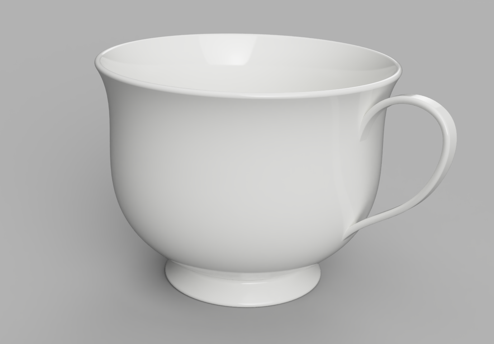

# BuildPart

> Converted to Markdown from the official build123d ReadTheDocs PDF. PDF page markers and local extracted-image links are included for traceability. Some line wrapping reflects the PDF layout.
<!-- PDF page 324 -->

1.13.3 BuildPart

BuildPart is a python context manager that is used to create three dimensional objects - objects with the property of
volume - that are typically finished parts.

The complete API for BuildPart is located at the end of this section.

Basic Functionality

The following is a simple BuildPart example:

```python
length, width, thickness = 80.0, 60.0, 10.0
center_hole_dia = 22.0
```

```python
with BuildPart() as ex2:
```

```python
    Box(length, width, thickness)
    Cylinder(radius=center_hole_dia / 2, height=thickness, mode=Mode.SUBTRACT)
```

<!-- PDF page 325 -->

The with statement creates the BuildPart context manager with the identifier ex2 (this code is the second of the
introductory examples). The objects and operations that are within the scope (i.e. indented) of this context will con-
tribute towards the object being created by the context manager. For BuildPart, this object is part and it’s referenced
as ex2.part.

The first object in this example is a Box object which is used to create a polyhedron with rectangular faces centered on
the default Plane.XY. The second object is a Cylinder that is subtracted from the box as directed by the mode=Mode.
SUBTRACT parameter thus creating a hole.

Implicit Parameters

The BuildPart context keeps track of pending objects such that they can be used implicitly - there are a couple things
to consider when deciding how to proceed:

• For sketches, the planes that they were constructed on is maintained in internal data structures such that operations
like extrude() will have a good reference for the extrude direction. One can pass a Face to extrude but it will
then be forced to use the normal direction at the center of the Face as the extrude direction which unfortunately
can be reversed in some circumstances.

• Implicit parameters save some typing but hide some functionality - users have to decide what works best for
them.

This tea cup example uses implicit parameters - note the sweep() operation on the last line:

```python
from build123d import *
from ocp_vscode import show
```

```python
wall_thickness = 3 * MM
fillet_radius = wall_thickness * 0.49
```

```python
with BuildPart() as tea_cup:
```

```python
    # Create the bowl of the cup as a revolved cross section
    with BuildSketch(Plane.XZ) as bowl_section:
```

```python
        with BuildLine():
```

```python
            # Start & end points with control tangents
            s = Spline(
                (30 * MM, 10 * MM),
                (69 * MM, 105 * MM),
                tangents=((1, 0.5), (0.7, 1)),
                tangent_scalars=(1.75, 1),
            )
            # Lines to finish creating ½ the bowl shape
            Polyline(s @ 0, s @ 0 + (10 * MM, -10 * MM), (0, 0), (0, (s @ 1).Y), s @ 1)
        make_face()  # Create a filled 2D shape
    revolve(axis=Axis.Z)
    # Hollow out the bowl with openings on the top and bottom
    offset(amount=-wall_thickness, openings=tea_cup.faces().filter_by(GeomType.PLANE))
    # Add a bottom to the bowl
    with Locations((0, 0, (s @ 0).Y)):
```

```python
        Cylinder(radius=(s @ 0).X, height=wall_thickness)
    # Smooth out all the edges
    fillet(tea_cup.edges(), radius=fillet_radius)
```

```python
    # Determine where the handle contacts the bowl
```

<!-- PDF page 326 -->

```python
                                                                      (continued from previous page)
    handle_intersections = [
        tea_cup.part.find_intersection_points(
```

```python
            Axis(origin=(0, 0, vertical_offset), direction=(1, 0, 0))
        )[-1][0]
        for vertical_offset in [35 * MM, 80 * MM]
    ]
    # Create a path for handle creation
    with BuildLine(Plane.XZ) as handle_path:
```

```python
        Spline(
            handle_intersections[0] - (wall_thickness / 2, 0),
            handle_intersections[0] + (35 * MM, 30 * MM),
            handle_intersections[0] + (40 * MM, 60 * MM),
            handle_intersections[1] - (wall_thickness / 2, 0),
            tangents=((1, 1.25), (-0.2, -1)),
        )
    # Align the cross section to the beginning of the path
    with BuildSketch(handle_path.line ^ 0) as handle_cross_section:
```

```python
        RectangleRounded(wall_thickness, 8 * MM, fillet_radius)
    sweep()  # Sweep handle cross section along path
```

```python
assert abs(tea_cup.part.volume - 130326) < 1
```

```python
show(tea_cup, names=["tea cup"])
```

sweep() requires a 2D cross section - handle_cross_section - and a path - handle_path - which are both passed
implicitly.

<!-- PDF page 327 -->



Units

Parts created with build123d have no inherent units associated with them. However, when exporting parts to external
formats like STL or STEP the units are assumed to be millimeters (mm). To be more explicit with units one can use
the technique shown in the above tea cup example where linear dimensions are followed by * MM which multiplies the
dimension by the MM scaling factor - in this case 1.

The following dimensional constants are pre-defined:

```python
MM = 1
CM = 10 * MM
M = 1000 * MM
IN = 25.4 * MM
FT = 12 * IN
THOU = IN / 1000
```

Some export formats like DXF have the ability to explicitly set the units used.

Reference

class BuildPart(*workplanes: ~build123d.topology.two_d.Face | ~build123d.geometry.Plane |
~build123d.geometry.Location, mode: ~build123d.build_enums.Mode = <Mode.ADD>)

The BuildPart class is another subclass of Builder for building parts (objects with the property of volume) from
sketches or 3D objects. It has an _obj property that returns the current part being built, and several pending
lists for storing faces, edges, and planes that will be integrated into the final part later. The class overrides the
_add_to_pending method of Builder.

<!-- PDF page 328 -->

Parameters

• workplanes (Plane, optional) – initial plane to work on. Defaults to Plane.XY.

• mode (Mode, optional) – combination mode. Defaults to Mode.ADD.

```python
     property location:  Location | None
```

Builder’s location

```python
     property part:  Part | None
```

Get the current part

```python
     property pending_edges_as_wire:  Wire
```

Return a wire representation of the pending edges
