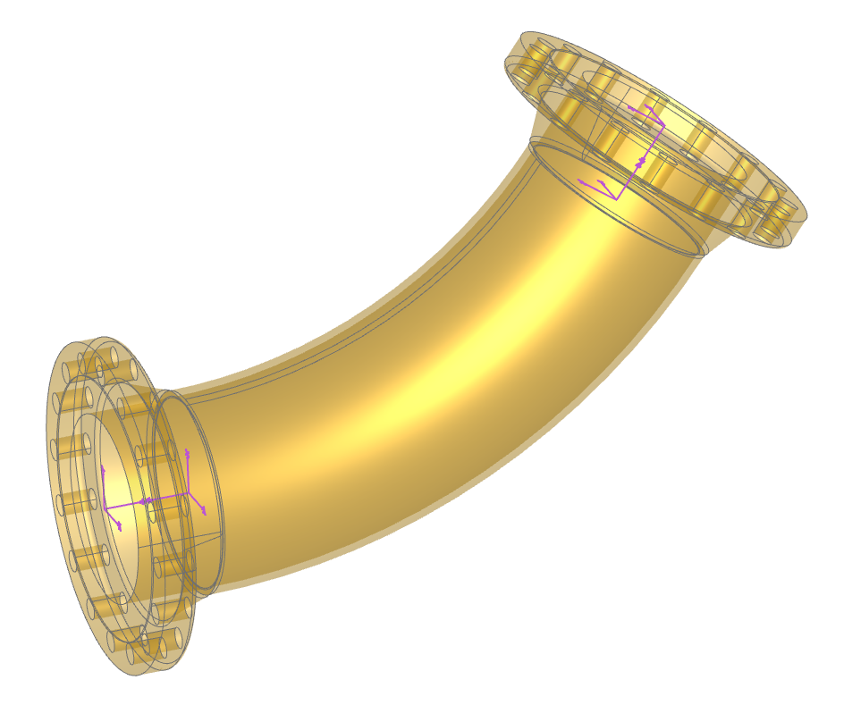
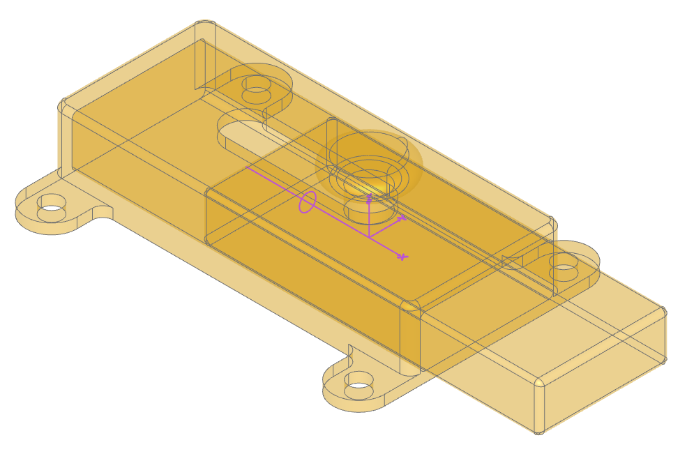
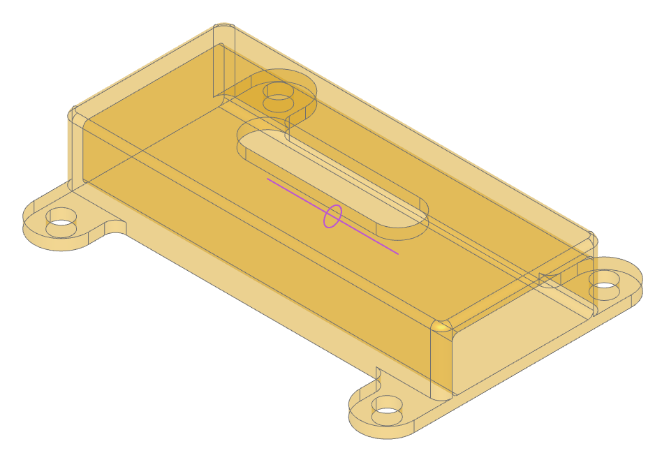
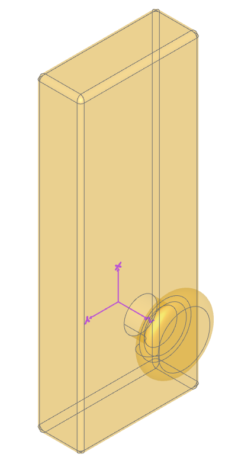
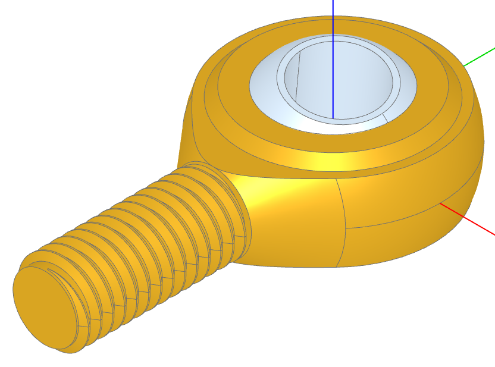

# Joints

> Converted to Markdown from the official build123d ReadTheDocs PDF. PDF page markers and local extracted-image links are included for traceability. Some line wrapping reflects the PDF layout.
<!-- PDF page 328 -->

1.14 Joints

Joint’s enable Solid and Compound objects to be arranged relative to each other in an intuitive manner - with the
same degree of motion that is found with the equivalent physical joints. Joint’s always work in pairs - a Joint can
only be connected to another Joint as follows:

Joint             connect_to                Example

```python
                BallJoint         RigidJoint                Gimbal
                CylindricalJoint  RigidJoint                Screw
                LinearJoint       RigidJoint, RevoluteJoint Slider or Pin Slot
                RevoluteJoint     RigidJoint                Hinge
                RigidJoint        RigidJoint                Fixed
```

Objects may have many joints bound to them each with an identifying label. All Joint objects have a symbol property
that can be displayed to help visualize their position and orientation (the ocp-vscode viewer has built-in support for
displaying joints).

Note

If joints are created within the scope of a BuildPart builder, the to_part parameter need not be specified as the
builder will, on exit, automatically transfer the joints created in its scope to the part created.

The following sections provide more detail on the available joints and describes how they are used.

1.14.1 Rigid Joint

A rigid joint positions two components relative to each another with no freedom of movement. When a RigidJoint is
instantiated it’s assigned a label, a part to bind to (to_part), and a joint_location which defines both the position
and orientation of the joint (see Location) - as follows:

```python
RigidJoint(label="outlet", to_part=pipe, joint_location=path.location_at(1))
```

Once a joint is bound to a part this way, the connect_to() method can be used to repositioning another part relative
to self which stay fixed - as follows:

```python
pipe.joints["outlet"].connect_to(flange_outlet.joints["pipe"])
```

<!-- PDF page 329 -->

Note

Within a part all of the joint labels must be unique.

The connect_to() method only does a one time re-position of a part and does not bind them in any way; however,
putting them into an Assemblies will maintain there relative locations as will combining parts with boolean operations
or within a BuildPart context.

As a example of creating parts with joints and connecting them together, consider the following code where flanges are
attached to the ends of a curved pipe:



```python
import copy
from build123d import *
from bd_warehouse.flange import WeldNeckFlange
from bd_warehouse.pipe import PipeSection
from ocp_vscode import *
```

```python
flange_inlet = WeldNeckFlange(nps="10", flange_class=300)
flange_outlet = copy.copy(flange_inlet)
```

<!-- PDF page 330 -->

```python
with BuildPart() as pipe_builder:
```

```python
    # Create the pipe
    with BuildLine():
        path = TangentArc((0, 0, 0), (2 * FT, 0, 1 * FT), tangent=(1, 0, 0))
    with BuildSketch(Plane(origin=path @ 0, z_dir=path % 0)):
        PipeSection("10", material="stainless", identifier="40S")
    sweep()
```

```python
    # Add the joints
    RigidJoint(label="inlet", joint_location=-path.location_at(0))
    RigidJoint(label="outlet", joint_location=path.location_at(1))
```

```python
# Place the flanges at the ends of the pipe
pipe_builder.part.joints["inlet"].connect_to(flange_inlet.joints["pipe"])
pipe_builder.part.joints["outlet"].connect_to(flange_outlet.joints["pipe"])
```

```python
show(pipe_builder, flange_inlet, flange_outlet, render_joints=True)
```

Note how the locations of the joints are determined by the location_at() method and how the - negate operator
is used to reverse the direction of the location without changing its position. Also note that the WeldNeckFlange
class predefines two joints, one at the pipe end and one at the face end - both of which are shown in the above image
(generated by ocp-vscode with the render_joints=True flag set in the show function).

class RigidJoint(label: str, to_part: Solid | Compound | None = None, joint_location: Location | None = None)

A rigid joint fixes two components to one another.

Parameters

• label (str) – joint label

```python
              • to_part (Union[Solid, Compound], optional) – object to attach joint to
```

• joint_location (Location) – global location of joint

Variables

relative_location (Location) – joint location relative to bound object

connect_to(other: BallJoint, *, angles: Rotation | tuple[float, float, float] | None = None, **kwargs)

connect_to(other: CylindricalJoint, *, position: float | None = None, angle: float | None = None)

connect_to(other: LinearJoint, *, position: float | None = None)

connect_to(other: RevoluteJoint, *, angle: float | None = None)

```python
     connect_to(other: RigidJoint)
```

Connect the RigidJoint to another Joint

Parameters

• other (Joint) – joint to connect to

• angle (float, optional) – angle in degrees. Defaults to range min.

• angles (RotationLike, optional) – angles about axes in degrees. Defaults to range
minimums.

• position (float, optional) – linear position. Defaults to linear range min.

<!-- PDF page 331 -->

```python
     property location:  Location
```

Location of joint

relative_to(other: BallJoint, *, angles: Rotation | tuple[float, float, float] | None = None)

relative_to(other: CylindricalJoint, *, position: float | None = None, angle: float | None = None)

relative_to(other: LinearJoint, *, position: float | None = None)

relative_to(other: RevoluteJoint, *, angle: float | None = None)

```python
     relative_to(other: RigidJoint)
```

Relative location of RigidJoint to another Joint

Parameters

• other (RigidJoint) – relative to joint

• angle (float, optional) – angle in degrees. Defaults to range min.

• angles (RotationLike, optional) – angles about axes in degrees. Defaults to range
minimums.

• position (float, optional) – linear position. Defaults to linear range min.

Raises

TypeError – other must be of a type in: BallJoint, CylindricalJoint, LinearJoint, Revolute-
Joint, RigidJoint.

```python
     property symbol:  Compound
```

A CAD symbol (XYZ indicator) as bound to part

1.14.2 Revolute Joint

Component rotates around axis like a hinge. The Joint Tutorial covers Revolute Joints in detail.

During instantiation of a RevoluteJoint there are three parameters not present with Rigid Joints: axis,
angle_reference, and range that allow the circular motion to be fully defined.

When connect_to() with a Revolute Joint, an extra angle parameter is present which allows one to change the
relative position of joined parts by changing a single value.

class RevoluteJoint(label: str, to_part: Solid | Compound | None = None, axis: Axis = Axis((0, 0, 0), (0, 0, 1)),
angle_reference: Vector | tuple[float, float] | tuple[float, float, float] | Sequence[float] |
None = None, angular_range: tuple[float, float] = (0, 360))

Component rotates around axis like a hinge.

Parameters

• label (str) – joint label

```python
              • to_part (Union[Solid, Compound], optional) – object to attach joint to
```

• axis (Axis) – axis of rotation

• angle_reference (VectorLike, optional) – direction normal to axis defining where
angles will be measured from. Defaults to None.

• range (tuple[float, float], optional) – (min,max) angle of joint. Defaults to (0,
360).

Variables

• angle (float) – angle of joint

• angle_reference (Vector) – reference for angular positions

<!-- PDF page 332 -->

• angular_range (tuple[float,float]) – min and max angular position of joint

• relative_axis (Axis) – joint axis relative to bound part

Raises

ValueError – angle_reference must be normal to axis

connect_to(other: RigidJoint, *, angle: float | None = None)

Connect RevoluteJoint and RigidJoint

Parameters

• other (RigidJoint) – relative to joint

• angle (float, optional) – angle in degrees. Defaults to range min.

Returns

other must of type RigidJoint ValueError: angle out of range

Return type

TypeError

```python
     property location:  Location
```

Location of joint

relative_to(other: RigidJoint, *, angle: float | None = None)

Relative location of RevoluteJoint to RigidJoint

Parameters

• other (RigidJoint) – relative to joint

• angle (float, optional) – angle in degrees. Defaults to range min.

Raises

• TypeError – other must of type RigidJoint

• ValueError – angle out of range

```python
     property symbol:  Compound
```

A CAD symbol representing the axis of rotation as bound to part

<!-- PDF page 333 -->

1.14.3 Linear Joint

Component moves along a single axis as with a sliding latch shown here:



The code to generate these components follows:

```python
from build123d import *
from ocp_vscode import *
```

```python
with BuildPart() as latch:
```

```python
    # Basic box shape to start with filleted corners
    Box(70, 30, 14)
    end = latch.faces().sort_by(Axis.X)[-1]  # save the end with the hole
    fillet(latch.edges().filter_by(Axis.Z), 2)
    fillet(latch.edges().sort_by(Axis.Z)[-1], 1)
    # Make screw tabs
    with BuildSketch(latch.faces().sort_by(Axis.Z)[0]) as l4:
```

```python
        with Locations((-30, 0), (30, 0)):
```

```python
            SlotOverall(50, 10, rotation=90)
        Rectangle(50, 30)
        fillet(l4.vertices(Select.LAST), radius=2)
    extrude(amount=-2)
    with GridLocations(60, 40, 2, 2):
```

```python
        Hole(2)
    # Create the hole from the end saved previously
    with BuildSketch(end) as slide_hole:
```

```python
        add(end)
        offset(amount=-2)
```

<!-- PDF page 334 -->

```python
                                                                      (continued from previous page)
        fillet(slide_hole.vertices(), 1)
    extrude(amount=-68, mode=Mode.SUBTRACT)
    # Slot for the handle to slide in
    with BuildSketch(latch.faces().sort_by(Axis.Z)[-1]):
```

```python
        SlotOverall(32, 8)
    extrude(amount=-2, mode=Mode.SUBTRACT)
    # The slider will move align the x axis 12mm in each direction
    LinearJoint("latch", axis=Axis.X, linear_range=(-12, 12))
```

```python
with BuildPart() as slide:
```

```python
    # The slide will be a little smaller than the hole
    with BuildSketch() as s1:
```

```python
        add(slide_hole.sketch)
        offset(amount=-0.25)
    # The extrusions aren't symmetric
    extrude(amount=46)
    extrude(slide.faces().sort_by(Axis.Z)[0], amount=20)
    # Round off the ends
    fillet(slide.edges().group_by(Axis.Z)[0], 1)
    fillet(slide.edges().group_by(Axis.Z)[-1], 1)
    # Create the knob
    with BuildSketch() as s2:
```

```python
        with Locations((12, 0)):
```

```python
            SlotOverall(15, 4, rotation=90)
        Rectangle(12, 7, align=(Align.MIN, Align.CENTER))
        fillet(s2.vertices(Select.LAST), 1)
        split(bisect_by=Plane.XZ)
    revolve(axis=Axis.X)
    # Align the joint to Plane.ZY flipped
    RigidJoint("slide", joint_location=Location(-Plane.ZY))
```

```python
# Position the slide in the latch: -12 >= position <= 12
latch.part.joints["latch"].connect_to(slide.part.joints["slide"], position=12)
```

```python
# show(latch.part, render_joints=True)
# show(slide.part, render_joints=True)
show(latch.part, slide.part, render_joints=True)
```

<!-- PDF page 335 -->





Note how the slide is constructed in a different orientation than the direction of motion. The three highlighted lines of
code show how the joints are created and connected together:

• The LinearJoint has an axis and limits of movement

• The RigidJoint has a single location, orientated such that the knob will ultimately be “up”

• The connect_to specifies a position that must be within the predefined limits.

The slider can be moved back and forth by just changing the position value. Values outside of the limits will raise
an exception.

class LinearJoint(label: str, to_part: Solid | Compound | None = None, axis: Axis = Axis((0, 0, 0), (0, 0, 1)),
linear_range: tuple[float, float] = (0, inf))

Component moves along a single axis.

<!-- PDF page 336 -->

Parameters

• label (str) – joint label

```python
              • to_part (Union[Solid, Compound], optional) – object to attach joint to
```

• axis (Axis) – axis of linear motion

• range (tuple[float, float], optional) – (min,max) position of joint. Defaults to
(0, inf).

Variables

• axis (Axis) – joint axis

• angle (float) – angle of joint

• linear_range (tuple[float,float]) – min and max positional values

• position (float) – joint position

• relative_axis (Axis) – joint axis relative to bound part

connect_to(other: RevoluteJoint, *, position: float | None = None, angle: float | None = None)
connect_to(other: RigidJoint, *, position: float | None = None)

Connect LinearJoint to another Joint

Parameters

• other (Joint) – joint to connect to

• angle (float, optional) – angle in degrees. Defaults to range min.

• position (float, optional) – linear position. Defaults to linear range min.

Raises

• TypeError – other must be of type RevoluteJoint or RigidJoint

• ValueError – position out of range

• ValueError – angle out of range

```python
     property location:  Location
         Location of joint
```

relative_to(other: RigidJoint, *, position: float | None = None)
relative_to(other: RevoluteJoint, *, position: float | None = None, angle: float | None = None)

Relative location of LinearJoint to RevoluteJoint or RigidJoint

Parameters

• other (Joint) – joint to connect to

• angle (float, optional) – angle in degrees. Defaults to range min.

• position (float, optional) – linear position. Defaults to linear range min.

Raises

• TypeError – other must be of type RevoluteJoint or RigidJoint

• ValueError – position out of range

• ValueError – angle out of range

```python
     property symbol:  Compound
         A CAD symbol of the linear axis positioned relative to_part
```

<!-- PDF page 337 -->

1.14.4 Cylindrical Joint

A CylindricalJoint allows a component to rotate around and moves along a single axis like a screw combining the
functionality of a LinearJoint and a RevoluteJoint joint. The connect_to for these joints have both position
and angle parameters as shown below extracted from the joint tutorial.

class CylindricalJoint(label: str, to_part: Solid | Compound | None = None, axis: Axis = Axis((0, 0, 0), (0, 0,
1)), angle_reference: Vector | tuple[float, float] | tuple[float, float, float] |
Sequence[float] | None = None, linear_range: tuple[float, float] = (0, inf),
angular_range: tuple[float, float] = (0, 360))

Component rotates around and moves along a single axis like a screw.

Parameters

• label (str) – joint label

```python
              • to_part (Union[Solid, Compound], optional) – object to attach joint to
```

• axis (Axis) – axis of rotation and linear motion

• angle_reference (VectorLike, optional) – direction normal to axis defining where
angles will be measured from. Defaults to None.

• linear_range (tuple[float, float], optional) – (min,max) position of joint. De-
faults to (0, inf).

• angular_range (tuple[float, float], optional) – (min,max) angle of joint. De-
faults to (0, 360).

Variables

• axis (Axis) – joint axis

• linear_position (float) – linear joint position

• rotational_position (float) – revolute joint angle in degrees

• angle_reference (Vector) – reference for angular positions

• angular_range (tuple[float,float]) – min and max angular position of joint

• linear_range (tuple[float,float]) – min and max positional values

• relative_axis (Axis) – joint axis relative to bound part

• position (float) – joint position

• angle (float) – angle of joint

Raises

ValueError – angle_reference must be normal to axis

connect_to(other: RigidJoint, *, position: float | None = None, angle: float | None = None)

Connect CylindricalJoint and RigidJoint”

Parameters

• other (Joint) – joint to connect to

• position (float, optional) – linear position. Defaults to linear range min.

• angle (float, optional) – angle in degrees. Defaults to range min.

Raises

• TypeError – other must be of type RigidJoint

<!-- PDF page 338 -->

• ValueError – position out of range

• ValueError – angle out of range

```python
     property location:  Location
```

Location of joint

relative_to(other: RigidJoint, *, position: float | None = None, angle: float | None = None)

Relative location of CylindricalJoint to RigidJoint

Parameters

• other (Joint) – joint to connect to

• position (float, optional) – linear position. Defaults to linear range min.

• angle (float, optional) – angle in degrees. Defaults to range min.

Raises

• TypeError – other must be of type RigidJoint

• ValueError – position out of range

• ValueError – angle out of range

```python
     property symbol:  Compound
```

A CAD symbol representing the cylindrical axis as bound to part

1.14.5 Ball Joint

A component rotates around all 3 axes using a gimbal system (3 nested rotations). A BallJoint is found within a rod
end as shown here:

<!-- PDF page 339 -->



```python
from build123d import *
from bd_warehouse.thread import IsoThread
from ocp_vscode import *
```

```python
# Create the thread so the min radius is available below
thread = IsoThread(major_diameter=6, pitch=1, length=20, end_finishes=("fade", "raw"))
inner_radius = 15.89 / 2
inner_gap = 0.2
```

```python
with BuildPart() as rod_end:
```

```python
    # Create the outer shape
    with BuildSketch():
```

```python
        Circle(22.25 / 2)
        with Locations((0, -12)):
```

```python
            Rectangle(8, 1)
        make_hull()
        split(bisect_by=Plane.YZ)
    revolve(axis=Axis.Y)
    # Refine the shape
    with BuildSketch(Plane.YZ) as s2:
```

```python
        Rectangle(25, 8, align=(Align.MIN, Align.CENTER))
        Rectangle(9, 10, align=(Align.MIN, Align.CENTER))
        chamfer(s2.vertices(), 0.5)
```

<!-- PDF page 340 -->

```python
                                                                      (continued from previous page)
    revolve(axis=Axis.Z, mode=Mode.INTERSECT)
    # Add the screw shaft
    Cylinder(
        thread.min_radius,
        30,
        rotation=(90, 0, 0),
        align=(Align.CENTER, Align.CENTER, Align.MIN),
    )
    # Cutout the ball socket
    Sphere(inner_radius, mode=Mode.SUBTRACT)
    # Add thread
    with Locations((0, -30, 0)):
```

```python
        add(thread, rotation=(-90, 0, 0))
    # Create the ball joint
    BallJoint(
```

```python
        "socket",
        joint_location=Location(),
        angular_range=((-14, 14), (-14, 14), (0, 360)),
    )
```

```python
with BuildPart() as ball:
```

```python
    Sphere(inner_radius - inner_gap)
    Box(50, 50, 13, mode=Mode.INTERSECT)
    Hole(4)
    ball.part.color = Color("aliceblue")
    RigidJoint("ball", joint_location=Location())
```

```python
rod_end.part.joints["socket"].connect_to(ball.part.joints["ball"], angles=(5, 10, 0))
```

```python
show(rod_end.part, ball.part, s2)
```

Note how limits are defined during the instantiation of the ball joint when ensures that the pin or bolt within the rod
end does not interfere with the rod end itself. The connect_to sets the three angles (only two are significant in this
example).

class BallJoint(label: str, to_part: Solid | Compound | None = None, joint_location: Location | None = None,
angular_range: tuple[tuple[float, float], tuple[float, float], tuple[float, float]] = ((0, 360), (0,
360), (0, 360)), angle_reference: Plane = Plane((0, 0, 0), (1, 0, 0), (0, 0, 1)))

A component rotates around all 3 axes using a gimbal system (3 nested rotations).

Parameters

• label (str) – joint label

```python
              • to_part (Union[Solid, Compound], optional) – object to attach joint to
```

• joint_location (Location) – global location of joint

• angular_range – (tuple[ tuple[float, float], tuple[float, float], tuple[float, float] ], optional):
X, Y, Z angle (min, max) pairs. Defaults to ((0, 360), (0, 360), (0, 360)).

• angle_reference (Plane, optional) – plane relative to part defining zero degrees of
rotation. Defaults to Plane.XY.

Variables

• relative_location (Location) – joint location relative to bound part

<!-- PDF page 341 -->

• angular_range – (tuple[ tuple[float, float], tuple[float, float], tuple[float, float] ]): X, Y, Z
angle (min, max) pairs.

• angle_reference (Plane) – plane relative to part defining zero degrees of

connect_to(other: RigidJoint, *, angles: Rotation | tuple[float, float, float] | None = None)

Connect BallJoint and RigidJoint

Parameters

• other (RigidJoint) – joint to connect to

• angles (RotationLike, optional) – angles about axes in degrees. Defaults to range
minimums.

Raises

• TypeError – invalid other joint type

• ValueError – angles out of range

```python
     property location:  Location
```

Location of joint

relative_to(other: RigidJoint, *, angles: Rotation | tuple[float, float, float] | None = None)

relative_to - BallJoint

Return the relative location from this joint to the RigidJoint of another object

Parameters

• other (RigidJoint) – joint to connect to

• angles (RotationLike, optional) – angles about axes in degrees. Defaults to range
minimums.

Raises

• TypeError – invalid other joint type

• ValueError – angles out of range

```python
     property symbol:  Compound
```

A CAD symbol representing joint as bound to part
