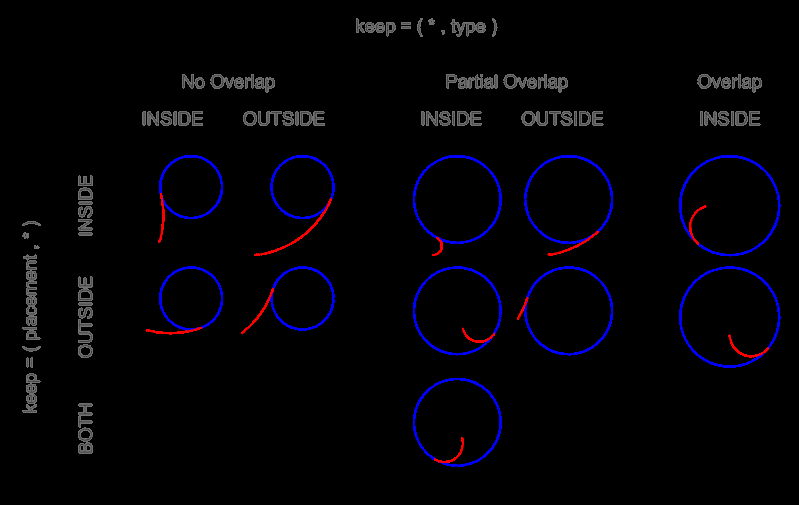
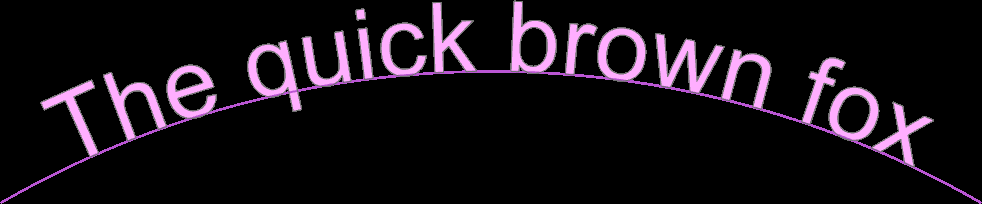

# Objects

> Converted to Markdown from the official build123d ReadTheDocs PDF. PDF page markers and local extracted-image links are included for traceability. Some line wrapping reflects the PDF layout.
<!-- PDF page 237 -->

1.10 Objects

Objects are Python classes that take parameters as inputs and create 1D, 2D or 3D Shapes. For example, a Torus is
defined by a major and minor radii. In Builder mode, objects are positioned with Locations while in Algebra mode,
objects are positioned with the * operator and shown in these examples:

```python
with BuildPart() as disk:
```

```python
    with BuildSketch():
```

<!-- PDF page 238 -->

```python
                                                                      (continued from previous page)
        Circle(a)
        with Locations((b, 0.0)):
```

```python
            Rectangle(c, c, mode=Mode.SUBTRACT)
        with Locations((0, b)):
```

```python
            Circle(d, mode=Mode.SUBTRACT)
    extrude(amount=c)
```

```python
sketch = Circle(a) - Pos(b, 0.0) * Rectangle(c, c) - Pos(0.0, b) * Circle(d)
disk = extrude(sketch, c)
```

The following sections describe the 1D, 2D and 3D objects:

1.10.1 Align

2D/Sketch and 3D/Part objects can be aligned relative to themselves, either centered, or justified right or left of each
Axis. The following diagram shows how this alignment works in 2D:

For example:

```python
with BuildSketch():
```

```python
    Circle(1, align=(Align.MIN, Align.MIN))
```

creates a circle who’s minimal X and Y values are on the X and Y axis and is located in the top right corner. The Align
enum has values: MIN, CENTER and MAX.

In 3D the align parameter also contains a Z align value but otherwise works in the same way.

Note that the align will also accept a single Align value which will be used on all axes - as shown here:

```python
with BuildSketch():
```

```python
    Circle(1, align=Align.MIN)
```

1.10.2 Mode

With the Builder API the mode parameter controls how objects are combined with lines, sketches, or parts under
construction. The Mode enum has values:

• ADD: fuse this object to the object under construction

• SUBTRACT: cut this object from the object under construction

• INTERSECT: intersect this object with the object under construction

• REPLACE: replace the object under construction with this object

• PRIVATE: don’t interact with the object under construction at all

The Algebra API doesn’t use the mode parameter - users combine objects with operators.

1.10.3 1D Objects

The following objects all can be used in BuildLine contexts. Note that 1D objects are not affected by Locations in
Builder mode.

```python
Airfoil
```

Airfoil described by 4 digit NACA profile

<!-- PDF page 239 -->

```python
Bezier
```

Curve defined by control points and weights

```python
BlendCurve
```

Curve blending curvature of two curves

```python
BSpline
```

B-spline from control points and knot data

```python
CenterArc
```

Arc defined by center, radius, & angles

```python
ConstrainedArcs
```

Arc(s) constrained by other geometric objects

```python
ConstrainedLines
```

Line(s) constrained by other geometric objects

```python
DoubleTangentArc
```

Arc defined by point/tangent pair & other curve

```python
EllipticalCenterArc
```

Elliptical arc defined by center, radii & angles

```python
EllipticalStartArc
```

Elliptical arc defined by start, tangent, radii & angles

```python
ParabolicCenterArc
```

Parabolic arc defined by vertex, focal length & angles

```python
HyperbolicCenterArc
```

Hyperbolic arc defined by center, radii & angles

```python
FilletPolyline
```

Polyline with filleted corners defined by pts and radius

```python
Helix
```

Helix defined pitch, radius and height

```python
IntersectingLine
```

Intersecting line defined by start, direction & other line

```python
JernArc
```

Arc define by start point, tangent, radius and angle

```python
Line
```

Line defined by end points

```python
PolarLine
```

Line defined by start, angle and length

```python
Polyline
```

Multiple line segments defined by points

<!-- PDF page 240 -->

```python
RadiusArc
```

Arc defined by two points and a radius

```python
SagittaArc
```

Arc defined by two points and a sagitta

```python
Spline
```

Curve define by points

```python
TangentArc
```

Arc defined by two points and a tangent

```python
ThreePointArc
```

Arc defined by three points

```python
ArcArcTangentLine
```

Line tangent defined by two arcs

```python
ArcArcTangentArc
```

Arc tangent defined by two arcs

```python
PointArcTangentLine
```

Line tangent defined by a point and arc

```python
PointArcTangentArc
```

Arc tangent defined by a point, direction, and arc

Reference

class BaseLineObject(curve: ~build123d.topology.one_d.Wire, mode: ~build123d.build_enums.Mode =
<Mode.ADD>)

BaseLineObject specialized for Wire.

Parameters

• curve (Wire) – wire to create

• mode (Mode, optional) – combination mode. Defaults to Mode.ADD

class Airfoil(airfoil_code: str, n_points: int = 50, finite_te: bool = False, mode:
~build123d.build_enums.Mode = <Mode.ADD>)

Create an airfoil described by a 4-digit (or fractional) NACA airfoil (e.g. ‘2412’ or ‘2213.323’).

The NACA four-digit wing sections define the airfoil_code by: - First digit describing maximum camber as
percentage of the chord. - Second digit describing the distance of maximum camber from the airfoil leading
edge in tenths of the chord. - Last two digits describing maximum thickness of the airfoil as percent of the chord.

Parameters

• airfoil_code – str The NACA 4-digit (or fractional) airfoil code (e.g. ‘2213.323’).

• n_points – int Number of points per upper/lower surface.

• finite_te – bool If True, enforces a finite trailing edge (default False).

• mode (Mode, optional) – combination mode. Defaults to Mode.ADD

<!-- PDF page 241 -->

```python
     property camber_line:  Edge
```

Camber line of the airfoil as an Edge.

```python
     camber_pos:  float
```

Chordwise position of max camber (0–1)

```python
     code:  str
```

NACA code string (e.g. “2412”)

```python
     finite_te:  bool
```

If True, trailing edge is finite

```python
     max_camber:  float
```

Maximum camber as fraction of chord

static parse_naca4(value: str | float) →tuple[float, float, float]

Parse NACA 4-digit (or fractional) airfoil code into parameters.

```python
     thickness:  float
```

Maximum thickness as fraction of chord

class Bezier(*cntl_pnts: ~build123d.geometry.Vector | tuple[float, float] | tuple[float, float, float] |
~collections.abc.Sequence[float], weights: list[float] | None = None, mode:
~build123d.build_enums.Mode = <Mode.ADD>)

Line Object: Bezier Curve

Create a non-rational bezier curve defined by a sequence of points and include optional weights to create a rational
bezier curve. The number of weights must match the number of control points.

Parameters

• cntl_pnts (sequence[VectorLike]) – points defining the curve

• weights (list[float], optional) – control point weights. Defaults to None

• mode (Mode, optional) – combination mode. Defaults to Mode.ADD

class BlendCurve(curve0: ~build123d.topology.one_d.Edge, curve1: ~build123d.topology.one_d.Edge,
continuity: ~build123d.build_enums.ContinuityLevel = ContinuityLevel.C2, end_points:
tuple[~build123d.geometry.Vector | tuple[float, float] | tuple[float, float, float] |
~collections.abc.Sequence[float], ~build123d.geometry.Vector | tuple[float, float] | tuple[float,
float, float] | ~collections.abc.Sequence[float]] | None = None, tangent_scalars: tuple[float,
float] | None = None, mode: ~build123d.build_enums.Mode = <Mode.ADD>)

Line Object: BlendCurve

Create a smooth Bézier-based transition curve between two existing edges.

The blend is constructed as a cubic (C1) or quintic (C2) Bézier curve whose control points are determined from
the position, first derivative, and (for C2) second derivative of the input curves at the chosen endpoints. Optional
scalar multipliers can be applied to the endpoint tangents to control the “tension” of the blend.

Parameters

• curve0 (Edge) – First curve to blend from.

• curve1 (Edge) – Second curve to blend to.

• continuity (ContinuityLevel, optional) – Desired geometric continuity at the join:
- ContinuityLevel.C0: position match only (straight line) - ContinuityLevel.C1: match posi-
tion and tangent direction (cubic Bézier) - ContinuityLevel.C2: match position, tangent, and
curvature (quintic Bézier) Defaults to ContinuityLevel.C2.

<!-- PDF page 242 -->

• end_points (tuple[VectorLike, VectorLike] | None, optional) – Pair of points
specifying the connection points on curve0 and curve1. Each must coincide (within TOL-
ERANCE) with the start or end of the respective curve. If None, the closest pair of endpoints
is chosen. Defaults to None.

• tangent_scalars (tuple[float, float] | None, optional) – Scalar multipliers
applied to the first derivatives at the start of curve0 and the end of curve1 before computing
control points. Useful for adjusting the pull/tension of the blend without altering the base
curves. Defaults to (1.0, 1.0).

• mode (Mode, optional) – Boolean operation mode when used in a BuildLine context.
Defaults to Mode.ADD.

Raises

• ValueError – tangent_scalars must be a pair of float values.

• ValueError – If specified end_points are not coincident with the start or end of their re-
spective curves.

Example

```python
     >>> blend = BlendCurve(curve_a, curve_b, ContinuityLevel.C1, tangent_scalars=(1.2,␣
```

```python
     ˓→0.8))
     >>> show(blend)
```

class BSpline(control_points: ~collections.abc.Iterable[~build123d.geometry.Vector | tuple[float, float] |
tuple[float, float, float] | ~collections.abc.Sequence[float]], knots: ~collections.abc.Iterable[float],
degree: int, weights: ~collections.abc.Iterable[float] | None = None, periodic: bool = False,
mode: ~build123d.build_enums.Mode = <Mode.ADD>)

Line Object: BSpline

An exact B-spline edge defined directly from control points and knot data.

BSpline creates an exact B-spline from control points, a knot sequence, and optional weights. Control points
define the control polygon that pulls the curve, but the curve does not generally pass through them. Knots define
the parameter-space structure of the spline: they determine where polynomial spans begin and end and how
smoothly those spans join. Repeated knot values indicate knot multiplicity. For a spline of degree p, a knot with
multiplicity m has continuity C^(p-m) at that location, so increasing multiplicity reduces smoothness. Repeating
the first and last knots degree + 1 times creates a clamped spline that starts and ends at the first and last control
points. Optional weights create a rational B-spline, allowing some control points to pull more strongly than
others and enabling exact representation of conic sections.`

Unlike Spline, which creates an interpolated curve through a set of points using GeomAPI_Interpolate,
BSpline preserves the supplied spline definition by building the underlying OCCT Geom_BSplineCurve from
its poles, knot vector, optional weights, degree, and periodic flag.

Parameters

• control_points (Iterable[VectorLike]) – Control points (poles) defining the spline
shape. These are not generally points on the curve.

• knots (Iterable[float]) – Knot sequence for the spline. Repeated knot values are al-
lowed and are converted internally into unique knot values plus multiplicities as required by
OCCT.

• degree (int) – Polynomial degree of the spline.

• weights (Iterable[float] | None, optional) – Optional per-control-point weights
for rational B-splines. If omitted, the spline is non-rational.

<!-- PDF page 243 -->

• periodic (bool, optional) – Whether to create a periodic spline. Defaults to False.

• mode (Mode, optional) – Builder combination mode. Defaults to Mode.ADD.

class CenterArc(center: ~build123d.geometry.Vector | tuple[float, float] | tuple[float, float, float] |
~collections.abc.Sequence[float], radius: float, start_angle: float, arc_size: float |
~build123d.topology.shape_core.Shape | ~build123d.geometry.Axis |
~build123d.geometry.Location | ~build123d.geometry.Plane | ~build123d.geometry.Vector |
tuple[float, float] | tuple[float, float, float] | ~collections.abc.Sequence[float], mode:
~build123d.build_enums.Mode = <Mode.ADD>)

Line Object: Center Arc

Create a circular arc defined by a center point and radius.

Parameters

• center (VectorLike) – center point of arc

• radius (float) – arc radius

• start_angle (float) – arc starting angle from x-axis

```python
              • arc_size (float | Shape | Axis | Location | Plane | VectorLike) – angular
                size of arc or an arc limit.
```

When a limit object is provided instead of a numeric angular size, CenterArc constructs the
valid arc(s) from the given start point, trims them at their first intersection with the limit, and
returns the one requiring the shortest travel from the start. Therefore, one can only generate
arcs < 180° using a limit. If neither valid arc intersects the limit, a ValueError is raised.

• mode (Mode, optional) – combination mode. Defaults to Mode.ADD

class ConstrainedArcs(tangency_one: tuple[Axis | Edge, Tangency] | Axis | Edge | Vertex | Vector | tuple[float,
float] | tuple[float, float, float] | Sequence[float], tangency_two: tuple[Axis | Edge,
Tangency] | Axis | Edge | Vertex | Vector | tuple[float, float] | tuple[float, float, float] |
Sequence[float], *, radius: float, sagitta: Sagitta = Sagitta.SHORT, selector:
Callable[[ShapeList[Edge]], Edge | ShapeList[Edge]] = lambda arcs: ..., mode: Mode
= Mode.ADD)

class ConstrainedArcs(tangency_one: tuple[Axis | Edge, Tangency] | Axis | Edge | Vertex | Vector | tuple[float,
float] | tuple[float, float, float] | Sequence[float], tangency_two: tuple[Axis | Edge,
Tangency] | Axis | Edge | Vertex | Vector | tuple[float, float] | tuple[float, float, float] |
Sequence[float], *, center_on: Axis | Edge, sagitta: Sagitta = Sagitta.SHORT, selector:
Callable[[ShapeList[Edge]], Edge | ShapeList[Edge]] = lambda arcs: ..., mode: Mode
= Mode.ADD)

class ConstrainedArcs(tangency_one: tuple[Axis | Edge, Tangency] | Axis | Edge | Vertex | Vector | tuple[float,
float] | tuple[float, float, float] | Sequence[float], tangency_two: tuple[Axis | Edge,
Tangency] | Axis | Edge | Vertex | Vector | tuple[float, float] | tuple[float, float, float] |
Sequence[float], tangency_three: tuple[Axis | Edge, Tangency] | Axis | Edge | Vertex |
Vector | tuple[float, float] | tuple[float, float, float] | Sequence[float], *, sagitta: Sagitta
= Sagitta.SHORT, selector: Callable[[ShapeList[Edge]], Edge | ShapeList[Edge]] =
lambda arcs: ..., mode: Mode = Mode.ADD)

class ConstrainedArcs(tangency_one: tuple[Axis | Edge, Tangency] | Axis | Edge | Vertex | Vector | tuple[float,
float] | tuple[float, float, float] | Sequence[float], *, center: Vector | tuple[float, float] |
tuple[float, float, float] | Sequence[float], selector: Callable[[ShapeList[Edge]], Edge |
ShapeList[Edge]] = lambda arcs: ..., mode: Mode = Mode.ADD)

class ConstrainedArcs(tangency_one: tuple[Axis | Edge, Tangency] | Axis | Edge | Vertex | Vector | tuple[float,
float] | tuple[float, float, float] | Sequence[float], *, radius: float, center_on: Edge,
selector: Callable[[ShapeList[Edge]], Edge | ShapeList[Edge]] = lambda arcs: ...,
mode: Mode = Mode.ADD)

<!-- PDF page 244 -->

Line Object: Arc(s) constrained by other geometric objects.

The result is always a Curve containing one or more Edges. If you need to access Edge-specific properties or
methods (such as arc_center), extract the edge or edges first:

```python
     result = ConstrainedArcs(...)
     arc = result.edge()           # extract the Edge
     center = arc.arc_center       # now Edge methods are available
```

Note that in Builder mode the selector parameter must be provided or all results will be combined into the
BuildLine context. In Algebra mode the selector can be applied as a parameter or in the normal way to the
ConstrainedArcs object. The content of the selector is the same in both cases.

Examples

An arc built from three edge constraints.

Algebra:

```python
     l4 = PolarLine((0, 0), 4, 60)
     l5 = PolarLine((0, 0), 4, 40)
     a3 = CenterArc((0, 0), 4, 0, 90)
     ex_a3 = (
         ConstrainedArcs(l4, l5, a3, sagitta=Sagitta.BOTH).edges().sort_by(Edge.
```

```python
     ˓→length)[0]
     )
```

Builder:

```python
     with BuildLine() as arc_ex3:
         l4 = PolarLine((0, 0), 4, 60)
         l5 = PolarLine((0, 0), 4, 40)
         a3 = CenterArc((0, 0), 4, 0, 90)
         ex_a3 = ConstrainedArcs(
             l4,
             l5,
             a3,
             sagitta=Sagitta.BOTH,
             selector=lambda arcs: arcs.sort_by(Edge.length)[0],
         )
```

class ConstrainedLines(tangency_one: tuple[Edge, Tangency] | Axis | Edge, tangency_two: tuple[Edge,
Tangency] | Axis | Edge, *, selector: Callable[[ShapeList[Edge]], Edge |
ShapeList[Edge]] = lambda lines: ..., mode: Mode = Mode.ADD)

class ConstrainedLines(tangency_one: tuple[Edge, Tangency] | Edge, tangency_two: Vector | tuple[float, float]
| tuple[float, float, float] | Sequence[float], *, selector: Callable[[ShapeList[Edge]],
Edge | ShapeList[Edge]] = lambda lines: ..., mode: Mode = Mode.ADD)

class ConstrainedLines(tangency_one: tuple[Edge, Tangency] | Edge, tangency_two: Axis, *, angle: float |
None = None, direction: Vector | tuple[float, float] | tuple[float, float, float] |
Sequence[float] | None = None, selector: Callable[[ShapeList[Edge]], Edge |
ShapeList[Edge]] = lambda lines: ..., mode: Mode = Mode.ADD)

Line Object: Lines(s) constrained by other geometric objects.

The result is always a Curve containing one or more Edges. If you need to access Edge-specific properties or
methods (such as length), extract the edge or edges first:

<!-- PDF page 245 -->

```python
     result = ConstrainedLines(...)
     lines = result.edges()      # extract the Edges
     length = lines[1].length    # now Edge methods are available
```

Note that in Builder mode the selector parameter must be provided or all results will be combined into the
BuildLine context. In Algebra mode the selector can be applied as a parameter or in the normal way to the
ConstrainedArcs object. The content of the selector is the same in both cases.

class DoubleTangentArc(pnt: ~build123d.geometry.Vector | tuple[float, float] | tuple[float, float, float] |
~collections.abc.Sequence[float], tangent: ~build123d.geometry.Vector | tuple[float,
float] | tuple[float, float, float] | ~collections.abc.Sequence[float], other:
~build123d.topology.composite.Curve | ~build123d.topology.one_d.Edge |
~build123d.topology.one_d.Wire, keep: ~build123d.build_enums.Keep =
<Keep.TOP>, mode: ~build123d.build_enums.Mode = <Mode.ADD>)

Line Object: Double Tangent Arc

Create a circular arc defined by a point/tangent pair and another line find a tangent to.

The arc specified with TOP or BOTTOM depends on the geometry and isn’t predictable.

Contains a solver.

Parameters

• pnt (VectorLike) – start point

• tangent (VectorLike) – tangent at start point

```python
              • other (Curve | Edge | Wire) – line object to tangent
```

• keep (Keep, optional) – specify which arc if more than one, TOP or BOTTOM. Defaults
to Keep.TOP

• mode (Mode, optional) – combination mode. Defaults to Mode.ADD

Raises

RunTimeError – no double tangent arcs found

class EllipticalCenterArc(center: ~build123d.geometry.Vector | tuple[float, float] | tuple[float, float, float] |
~collections.abc.Sequence[float], x_radius: float, y_radius: float, start_angle:
float = 0.0, end_angle: float | None = None, *, arc_size: float |
~build123d.topology.shape_core.Shape | ~build123d.geometry.Axis |
~build123d.geometry.Location | ~build123d.geometry.Plane |
~build123d.geometry.Vector | tuple[float, float] | tuple[float, float, float] |
~collections.abc.Sequence[float] = 90.0, rotation: float = 0.0, angular_direction:
~build123d.build_enums.AngularDirection | None = None, mode:
~build123d.build_enums.Mode = <Mode.ADD>)

Line Object: Elliptical Center Arc

Create an elliptical arc defined by a center point, x- and y- radii.

Parameters

• center (VectorLike) – ellipse center

• x_radius (float) – x radius of the ellipse (along the x-axis of plane)

• y_radius (float) – y radius of the ellipse (along the y-axis of plane)

• start_angle (float, optional) – arc start angle from x-axis. Defaults to 0.0

• end_angle (float | None) – arc end angle from x-axis. Defaults to None

<!-- PDF page 246 -->

```python
              • arc_size (float | Shape | Axis | Location | Plane | VectorLike) – angular
                size of arc (negative to change direction) or an arc limit.
```

When a limit object is provided instead of a numeric angular size, EllipticalCenterArc con-
structs the valid arc(s) from the given start point, trims them at their first intersection with
the limit, and returns the one requiring the shortest travel from the start. Therefore, one can
only generate arcs < 180° using a limit. If neither valid arc intersects the limit, a ValueError
is raised.

• rotation (float, optional) – angle to rotate arc. Defaults to 0.0

• angular_direction (AngularDirection | None) – arc direction. Defaults to None.

• mode (Mode, optional) – combination mode. Defaults to Mode.ADD

class EllipticalStartArc(start_pnt: ~build123d.geometry.Vector | tuple[float, float] | tuple[float, float, float] |
~collections.abc.Sequence[float], start_tangent: ~build123d.geometry.Vector |
tuple[float, float] | tuple[float, float, float] | ~collections.abc.Sequence[float],
x_radius: float, y_radius: float, arc_size: float, *, start_angle: float | None = None,
major_axis_dir: ~build123d.geometry.Vector | tuple[float, float] | tuple[float, float,
float] | ~collections.abc.Sequence[float] | None = None, mode:
~build123d.build_enums.Mode = <Mode.ADD>)

Line Object: EllipticalStartArc

Create a circular arc defined by a start point/tangent pair, radius and arc size.

Parameters

• start_pnt (VectorLike) – start point

• start_tangent (VectorLike) – tangent at start point

• x_radius (float) – x radius of the ellipse (along the x-axis of plane)

• y_radius (float) – y radius of the ellipse (along the y-axis of plane)

• arc_size (float) – angular size of arc (negative to change direction)

• start_angle (float) – angular position of the start point

• major_axis_dir (VectorLike) – direction of ellipse x-axis

• mode (Mode, optional) – combination mode. Defaults to Mode.ADD

Note

One of start_angle or major_axis_dir must be provided.

class ParabolicCenterArc(vertex: ~build123d.geometry.Vector | tuple[float, float] | tuple[float, float, float] |
~collections.abc.Sequence[float], focal_length: float, start_angle: float = 0.0,
end_angle: float | None = None, *, arc_size: float |
~build123d.topology.shape_core.Shape | ~build123d.geometry.Axis |
~build123d.geometry.Location | ~build123d.geometry.Plane |
~build123d.geometry.Vector | tuple[float, float] | tuple[float, float, float] |
~collections.abc.Sequence[float] = 90.0, rotation: float = 0.0, angular_direction:
~build123d.build_enums.AngularDirection | None = None, mode:
~build123d.build_enums.Mode = <Mode.ADD>)

Line Object: Parabolic Center Arc

Create a parabolic arc defined by a vertex point and focal length (distance from focus to vertex).

<!-- PDF page 247 -->

Parameters

• vertex (VectorLike) – parabola vertex

• focal_length (float) – focal length the parabola (distance from the vertex to focus along
the x-axis of plane)

• start_angle (float, optional) – arc start angle. Defaults to 0.0

• end_angle (float | None, optional) – arc end angle. Defaults to None

```python
              • arc_size (float | Shape | Axis | Location | Plane | VectorLike) – angular
                size of arc (negative to change direction) or an arc limit.
```

When a limit object is provided instead of a numeric angular size, ParabolicCenterArc con-
structs candidate arcs from the given start point, trims them at their first intersection with
the limit, and returns the one requiring the shortest travel from the start. If neither valid arc
intersects the limit, a ValueError is raised.

• rotation (float, optional) – angle to rotate arc. Defaults to 0.0

• angular_direction (AngularDirection | None, optional) – arc direction. De-
faults to None

• mode (Mode, optional) – combination mode. Defaults to Mode.ADD

class HyperbolicCenterArc(center: ~build123d.geometry.Vector | tuple[float, float] | tuple[float, float, float] |
~collections.abc.Sequence[float], x_radius: float, y_radius: float, start_angle:
float = 0.0, end_angle: float | None = None, *, arc_size: float |
~build123d.topology.shape_core.Shape | ~build123d.geometry.Axis |
~build123d.geometry.Location | ~build123d.geometry.Plane |
~build123d.geometry.Vector | tuple[float, float] | tuple[float, float, float] |
~collections.abc.Sequence[float] = 90.0, rotation: float = 0.0, angular_direction:
~build123d.build_enums.AngularDirection | None = None, mode:
~build123d.build_enums.Mode = <Mode.ADD>)

Line Object: Hyperbolic Center Arc

Create a hyperbolic arc defined by a center point and focal length (distance from focus to vertex).

Parameters

• center (VectorLike) – hyperbola center

• x_radius (float) – x radius of the ellipse (along the x-axis of plane)

• y_radius (float) – y radius of the ellipse (along the y-axis of plane)

• start_angle (float, optional) – arc start angle from x-axis. Defaults to 0.0

• end_angle (float | None, optional) – arc end angle from x-axis. Defaults to None

```python
              • arc_size (float | Shape | Axis | Location | Plane | VectorLike) – angular
                size of arc (negative to change direction) or an arc limit.
```

When a limit object is provided instead of a numeric angular size, HyperbolicCenterArc
constructs candidate arcs from the given start point, trims them at their first intersection with
the limit, and returns the one requiring the shortest travel from the start. If neither valid arc
intersects the limit, a ValueError is raised.

• rotation (float, optional) – angle to rotate arc. Defaults to 0.0

• angular_direction (AngularDirection | None, optional) – arc direction. De-
faults to None

• mode (Mode, optional) – combination mode. Defaults to Mode.ADD

<!-- PDF page 248 -->

class FilletPolyline(*pts: ~build123d.geometry.Vector | tuple[float, float] | tuple[float, float, float] |
~collections.abc.Sequence[float] | ~collections.abc.Iterable[~build123d.geometry.Vector
| tuple[float, float] | tuple[float, float, float] | ~collections.abc.Sequence[float]], radius:
float | ~collections.abc.Iterable[float], close: bool = False, mode:
~build123d.build_enums.Mode = <Mode.ADD>)

Line Object: Fillet Polyline Create a sequence of straight lines defined by successive points that are filleted to a
given radius.

Parameters

• pts (VectorLike | Iterable[VectorLike]) – sequence of two or more points

• radius (float | Iterable[float]) – radius to fillet at each vertex or a single value for
all vertices. A radius of 0 will create a sharp corner (vertex without fillet).

• close (bool, optional) – close end points with extra Edge and corner fillets. Defaults
to False

• mode (Mode, optional) – combination mode. Defaults to Mode.ADD

Raises

• ValueError – Two or more points not provided

• ValueError – radius must be non-negative

class Helix(pitch: float, height: float, radius: float, center: ~build123d.geometry.Vector | tuple[float, float] |
tuple[float, float, float] | ~collections.abc.Sequence[float] = (0, 0, 0), direction:
~build123d.geometry.Vector | tuple[float, float] | tuple[float, float, float] |
~collections.abc.Sequence[float] = (0, 0, 1), cone_angle: float = 0, lefthand: bool = False, mode:
~build123d.build_enums.Mode = <Mode.ADD>)

Line Object: Helix

Create a helix defined by pitch, height, and radius. The helix may have a taper defined by cone_angle.

If cone_angle is not 0, radius is the initial helix radius at center. cone_angle > 0 increases the final radius.
cone_angle < 0 decreases the final radius.

Parameters

• pitch (float) – distance between loops

• height (float) – helix height

• radius (float) – helix radius

• center (VectorLike, optional) – center point. Defaults to (0, 0, 0)

• direction (VectorLike, optional) – direction of central axis. Defaults to (0, 0, 1)

• cone_angle (float, optional) – conical angle from direction. Defaults to 0

• lefthand (bool, optional) – left handed helix. Defaults to False

• mode (Mode, optional) – combination mode. Defaults to Mode.ADD

class IntersectingLine(start: ~build123d.geometry.Vector | tuple[float, float] | tuple[float, float, float] |
~collections.abc.Sequence[float], direction: ~build123d.geometry.Vector | tuple[float,
float] | tuple[float, float, float] | ~collections.abc.Sequence[float], other:
~build123d.topology.composite.Curve | ~build123d.topology.one_d.Edge |
~build123d.topology.one_d.Wire, mode: ~build123d.build_enums.Mode =
<Mode.ADD>)

<!-- PDF page 249 -->

Intersecting Line Object: Line

Create a straight line defined by a point/direction pair and another line to intersect.

Parameters

• start (VectorLike) – start point

• direction (VectorLike) – direction to make line

• other (Edge) – line object to intersect

• mode (Mode, optional) – combination mode. Defaults to Mode.ADD

class JernArc(start: ~build123d.geometry.Vector | tuple[float, float] | tuple[float, float, float] |
~collections.abc.Sequence[float], tangent: ~build123d.geometry.Vector | tuple[float, float] |
tuple[float, float, float] | ~collections.abc.Sequence[float], radius: float, arc_size: float |
~build123d.topology.shape_core.Shape | ~build123d.geometry.Axis |
~build123d.geometry.Location | ~build123d.geometry.Plane | ~build123d.geometry.Vector |
tuple[float, float] | tuple[float, float, float] | ~collections.abc.Sequence[float], mode:
~build123d.build_enums.Mode = <Mode.ADD>)

Line Object: Jern Arc

Create a circular arc defined by a start point/tangent pair, radius and arc size or arc limit.

Parameters

• start (VectorLike) – start point

• tangent (VectorLike) – tangent at start point

• radius (float) – arc radius

```python
              • arc_size (float | Shape | Axis | Location | Plane | VectorLike) – angular
                size of arc (negative to change direction) or an arc limit.
```

When a limit object is provided instead of a numeric angular size, JernArc constructs the
valid tangent arc(s) from the given start point and tangent, trims them at their first intersection
with the limit, and returns the one requiring the shortest travel from the start. If neither valid
arc intersects the limit, a ValueError is raised.

• mode (Mode, optional) – combination mode. Defaults to Mode.ADD

Variables

• start (Vector) – start point

• end_of_arc (Vector) – end point of arc

• center_point (Vector) – center of arc

class Line(*pts: ~build123d.geometry.Vector | tuple[float, float] | tuple[float, float, float] |
~collections.abc.Sequence[float] | ~collections.abc.Iterable[~build123d.geometry.Vector | tuple[float,
float] | tuple[float, float, float] | ~collections.abc.Sequence[float]], mode:
~build123d.build_enums.Mode = <Mode.ADD>)

Line Object: Line

Create a straight line defined by two points.

Parameters

• pts (VectorLike | Iterable[VectorLike]) – sequence of two points

• mode (Mode, optional) – combination mode. Defaults to Mode.ADD

<!-- PDF page 250 -->

Raises

ValueError – Two point not provided

class PolarLine(start: ~build123d.geometry.Vector | tuple[float, float] | tuple[float, float, float] |
~collections.abc.Sequence[float], length: float | ~build123d.topology.shape_core.Shape |
~build123d.geometry.Axis | ~build123d.geometry.Location | ~build123d.geometry.Plane |
~build123d.geometry.Vector | tuple[float, float] | tuple[float, float, float] |
~collections.abc.Sequence[float], angle: float | None = None, direction:
~build123d.geometry.Vector | tuple[float, float] | tuple[float, float, float] |
~collections.abc.Sequence[float] | None = None, length_mode:
~build123d.build_enums.LengthMode = <LengthMode.DIAGONAL>, mode:
~build123d.build_enums.Mode = <Mode.ADD>)

Line Object: Polar Line

Create a straight line defined by a start point, length, and angle. The length can specify the DIAGONAL, HOR-
IZONTAL, or VERTICAL component of the triangle defined by the angle.

Alternatively, the length parameter can contain a limit to the length of the line in the form of another object. If
the PolarLine doesn’t contact the limit an error will be generated.

Example

p = PolarLine(start=(2, 0), length=Axis.Y, angle=135)

Parameters

• start (VectorLike) – start point

```python
              • length (float | Shape | Axis | Location | Plane | VectorLike) – line length
                (float) or limit limit
```

• angle (float, optional) – angle from the local x-axis

• direction (VectorLike, optional) – vector direction to determine angle

• length_mode (LengthMode, optional) – how length defines the line. Defaults to
LengthMode.DIAGONAL

• mode (Mode, optional) – combination mode. Defaults to Mode.ADD

Raises

• ValueError – Either angle or direction must be provided

• ValueError – Polar line doesn’t intersect length limit

class Polyline(*pts: ~build123d.geometry.Vector | tuple[float, float] | tuple[float, float, float] |
~collections.abc.Sequence[float] | ~collections.abc.Iterable[~build123d.geometry.Vector |
tuple[float, float] | tuple[float, float, float] | ~collections.abc.Sequence[float]], close: bool =
False, mode: ~build123d.build_enums.Mode = <Mode.ADD>)

Line Object: Polyline

Create a sequence of straight lines defined by successive points.

Parameters

• pts (VectorLike | Iterable[VectorLike]) – sequence of two or more points

• close (bool, optional) – close by generating an extra Edge. Defaults to False

• mode (Mode, optional) – combination mode. Defaults to Mode.ADD

Raises

ValueError – Two or more points not provided

<!-- PDF page 251 -->

class RadiusArc(start_point: ~build123d.geometry.Vector | tuple[float, float] | tuple[float, float, float] |
~collections.abc.Sequence[float], end_point: ~build123d.geometry.Vector | tuple[float, float] |
tuple[float, float, float] | ~collections.abc.Sequence[float], radius: float, short_sagitta: bool =
True, mode: ~build123d.build_enums.Mode = <Mode.ADD>)

Line Object: Radius Arc

Create a circular arc defined by two points and a radius.

Parameters

• start_point (VectorLike) – start point

• end_point (VectorLike) – end point

• radius (float) – arc radius

• short_sagitta (bool) – If True selects the short sagitta (height of arc from chord), else
the long sagitta crossing the center. Defaults to True

• mode (Mode, optional) – combination mode. Defaults to Mode.ADD

Raises

ValueError – Insufficient radius to connect end points

class SagittaArc(start_point: ~build123d.geometry.Vector | tuple[float, float] | tuple[float, float, float] |
~collections.abc.Sequence[float], end_point: ~build123d.geometry.Vector | tuple[float, float] |
tuple[float, float, float] | ~collections.abc.Sequence[float], sagitta: float, mode:
~build123d.build_enums.Mode = <Mode.ADD>)

Line Object: Sagitta Arc

Create a circular arc defined by two points and the sagitta (height of the arc from chord).

Parameters

• start_point (VectorLike) – start point

• end_point (VectorLike) – end point

• sagitta (float) – arc height from chord between points

• mode (Mode, optional) – combination mode. Defaults to Mode.ADD

class Spline(*pts: ~build123d.geometry.Vector | tuple[float, float] | tuple[float, float, float] |
~collections.abc.Sequence[float] | ~collections.abc.Iterable[~build123d.geometry.Vector |
tuple[float, float] | tuple[float, float, float] | ~collections.abc.Sequence[float]], tangents:
~collections.abc.Iterable[~build123d.geometry.Vector | tuple[float, float] | tuple[float, float, float] |
~collections.abc.Sequence[float]] | None = None, tangent_scalars: ~collections.abc.Iterable[float] |
None = None, periodic: bool = False, mode: ~build123d.build_enums.Mode = <Mode.ADD>)

Line Object: Spline

Create a spline defined by a sequence of points, optionally constrained by tangents. Tangents and tangent scalars
must have length of 2 for only the end points or a length of the number of points.

Parameters

• pts (VectorLike | Iterable[VectorLike]) – sequence of two or more points

• tangents (Iterable[VectorLike], optional) – tangent directions. Defaults to None

• tangent_scalars (Iterable[float], optional) – tangent scales. Defaults to None

• periodic (bool, optional) – make the spline periodic (closed). Defaults to False

• mode (Mode, optional) – combination mode. Defaults to Mode.ADD

<!-- PDF page 252 -->

class TangentArc(*pts: ~build123d.geometry.Vector | tuple[float, float] | tuple[float, float, float] |
~collections.abc.Sequence[float] | ~collections.abc.Iterable[~build123d.geometry.Vector |
tuple[float, float] | tuple[float, float, float] | ~collections.abc.Sequence[float]], tangent:
~build123d.geometry.Vector | tuple[float, float] | tuple[float, float, float] |
~collections.abc.Sequence[float], tangent_from_first: bool = True, mode:
~build123d.build_enums.Mode = <Mode.ADD>)

Line Object: Tangent Arc

Create a circular arc defined by two points and a tangent.

Parameters

• pts (VectorLike | Iterable[VectorLike]) – sequence of two points

• tangent (VectorLike) – tangent to constrain arc

• tangent_from_first (bool, optional) – apply tangent to first point. Applying tangent
to end point will flip the orientation of the arc. Defaults to True

• mode (Mode, optional) – combination mode. Defaults to Mode.ADD

Raises

ValueError – Two points are required

class ThreePointArc(*pts: ~build123d.geometry.Vector | tuple[float, float] | tuple[float, float, float] |
~collections.abc.Sequence[float] | ~collections.abc.Iterable[~build123d.geometry.Vector |
tuple[float, float] | tuple[float, float, float] | ~collections.abc.Sequence[float]], mode:
~build123d.build_enums.Mode = <Mode.ADD>)

Line Object: Three Point Arc

Create a circular arc defined by three points.

Parameters

• pts (VectorLike | Iterable[VectorLike]) – sequence of three points

• mode (Mode, optional) – combination mode. Defaults to Mode.ADD

Raises

ValueError – Three points must be provided

```python
class ArcArcTangentLine(**kwargs)
```

Line Object: Arc Arc Tangent Line

Create a straight line tangent to two arcs.

Parameters

```python
              • start_arc (Curve | Edge | Wire) – starting arc, must be GeomType.CIRCLE
```

```python
              • end_arc (Curve | Edge | Wire) – ending arc, must be GeomType.CIRCLE
```

• side (Side) – side of arcs to place tangent arc center, LEFT or RIGHT. Defaults to
Side.LEFT

• keep (Keep) – which tangent arc to keep, INSIDE or OUTSIDE. Defaults to Keep.INSIDE

• mode (Mode, optional) – combination mode. Defaults to Mode.ADD

```python
class ArcArcTangentArc(**kwargs)
```

Line Object: Arc Arc Tangent Arc

Create an arc tangent to two arcs and a radius.

keep specifies tangent arc position with a Keep pair: (placement, type)

<!-- PDF page 253 -->

• placement: start_arc is tangent INSIDE or OUTSIDE the tangent arc. BOTH is a special case for overlap-
ping arcs with type INSIDE

• type: tangent arc is INSIDE or OUTSIDE start_arc and end_arc

Parameters

```python
              • start_arc (Curve | Edge | Wire) – starting arc, must be GeomType.CIRCLE
```

```python
              • end_arc (Curve | Edge | Wire) – ending arc, must be GeomType.CIRCLE
```

• radius (float) – radius of tangent arc

• side (Side) – side of arcs to place tangent arc center, LEFT or RIGHT. Defaults to
Side.LEFT

```python
              • keep (Keep | tuple[Keep, Keep]) – which tangent arc to keep, INSIDE or OUTSIDE.
                Defaults to (Keep.INSIDE, Keep.INSIDE)
```

• short_sagitta (bool) – If True selects the short sagitta (height of arc from chord), else
the long sagitta crossing the center. Defaults to True

• mode (Mode, optional) – combination mode. Defaults to Mode.ADD



```python
class PointArcTangentLine(**kwargs)
```

Line Object: Point Arc Tangent Line

Create a straight, tangent line from a point to a circular arc.

Parameters

• point (VectorLike) – intersection point for tangent

```python
              • arc (Curve | Edge | Wire) – circular arc to tangent, must be GeomType.CIRCLE
```

<!-- PDF page 254 -->

• side (Side, optional) – side of arcs to place tangent arc center, LEFT or RIGHT. De-
faults to Side.LEFT

• mode (Mode, optional) – combination mode. Defaults to Mode.ADD

```python
class PointArcTangentArc(**kwargs)
```

Line Object: Point Arc Tangent Arc

Create an arc defined by a point/tangent pair and another line which the other end is tangent to.

Parameters

• point (VectorLike) – starting point of tangent arc

• direction (VectorLike) – direction at starting point of tangent arc

```python
              • arc (Union[Curve, Edge, Wire]) – ending arc, must be GeomType.CIRCLE
```

• side (Side, optional) – select which arc to keep Defaults to Side.LEFT

• mode (Mode, optional) – combination mode. Defaults to Mode.ADD

Raises

• ValueError – Arc must have GeomType.CIRCLE

• ValueError – Point is already tangent to arc

• RuntimeError – No tangent arc found

1.10.4 2D Objects

```python
Arrow
```

Arrow with head and path for shaft

```python
ArrowHead
```

Arrow head with multiple types

```python
Circle
```

Circle defined by radius

```python
DimensionLine
```

Dimension line

```python
Ellipse
```

Ellipse defined by major and minor radius

```python
ExtensionLine
```

Extension lines for distance or angles

```python
Polygon
```

Polygon defined by points

```python
Rectangle
```

Rectangle defined by width and height

```python
RectangleRounded
```

Rectangle with rounded corners defined by width, height, and radius

```python
RegularPolygon
```

<!-- PDF page 255 -->

RegularPolygon defined by radius and number of sides

```python
SlotArc
```

SlotArc defined by arc and height

```python
SlotCenterPoint
```

SlotCenterPoint defined by two points and a height

```python
SlotCenterToCenter
```

SlotCenterToCenter defined by center separation and height

```python
SlotOverall
```

SlotOverall defined by end-to-end length and height

```python
TechnicalDrawing
```

A technical drawing with descriptions

```python
Text
```

Text defined by string and font parameters

```python
Trapezoid
```

Trapezoid defined by width, height and interior angles

```python
Triangle
```

Triangle defined by one side & two other sides or interior angles

Reference

class BaseSketchObject(obj: ~build123d.topology.composite.Compound | ~build123d.topology.two_d.Face,
rotation: float = 0, align: ~build123d.build_enums.Align |
tuple[~build123d.build_enums.Align, ~build123d.build_enums.Align] | None = None,
mode: ~build123d.build_enums.Mode = <Mode.ADD>)

Base class for all BuildSketch objects

Parameters

• face (Face) – face to create

• rotation (float, optional) – angle to rotate object. Defaults to 0

```python
              • align (Align | tuple[Align, Align], optional) – align MIN, CENTER, or MAX
                of object. Defaults to None
```

• mode (Mode, optional) – combination mode. Defaults to Mode.ADD

class Arrow(arrow_size: float, shaft_path: ~build123d.topology.one_d.Edge | ~build123d.topology.one_d.Wire,
shaft_width: float, head_at_start: bool = True, head_type: ~build123d.build_enums.HeadType =
<HeadType.CURVED>, mode: ~build123d.build_enums.Mode = <Mode.ADD>)

Sketch Object: Arrow with shaft

Parameters

• arrow_size (float) – arrow head tip to tail length

• shaft_path (Edge | Wire) – line describing the shaft shape

• shaft_width (float) – line width of shaft

• head_at_start (bool, optional) – Defaults to True.

<!-- PDF page 256 -->

• head_type (HeadType, optional) – arrow head shape. Defaults to HeadType.CURVED.

• mode (Mode, optional) – _description_. Defaults to Mode.ADD.

class ArrowHead(size: float, head_type: ~build123d.build_enums.HeadType = <HeadType.CURVED>, rotation:
float = 0, mode: ~build123d.build_enums.Mode = <Mode.ADD>)

Sketch Object: ArrowHead

Parameters

• size (float) – tip to tail length

• head_type (HeadType, optional) – arrow head shape. Defaults to HeadType.CURVED.

• rotation (float, optional) – rotation in degrees. Defaults to 0.

• mode (Mode, optional) – combination mode. Defaults to Mode.ADD.

class Circle(radius: float, arc_size: float = 360.0, align: ~build123d.build_enums.Align |
tuple[~build123d.build_enums.Align, ~build123d.build_enums.Align] | None = (<Align.CENTER>,
<Align.CENTER>), mode: ~build123d.build_enums.Mode = <Mode.ADD>)

Sketch Object: Circle

Create a circle defined by radius.

Parameters

• radius (float) – circle radius

• arc_size (float, optional) – angular size of sector. Defaults to 360.

```python
              • align (Align | tuple[Align, Align], optional) – align MIN, CENTER, or MAX
                of object. Defaults to (Align.CENTER, Align.CENTER)
```

• mode (Mode, optional) – combination mode. Defaults to Mode.ADD

class DimensionLine(path: ~build123d.topology.one_d.Wire | ~build123d.topology.one_d.Edge |
list[~build123d.geometry.Vector | ~build123d.topology.zero_d.Vertex | tuple[float, float,
float]], draft: ~drafting.Draft, sketch: ~build123d.topology.composite.Sketch | None =
None, label: str | None = None, arrows: tuple[bool, bool] = (True, True), tolerance: float |
tuple[float, float] | None = None, label_angle: bool = False, mode:
~build123d.build_enums.Mode = <Mode.ADD>)

Sketch Object: DimensionLine

Create a dimension line typically for internal measurements. Typically used for (but not restricted to) inside
dimensions, a dimension line often as arrows on either side of a dimension or label.

There are three options depending on the size of the text and length of the dimension line: Type 1) The label
and arrows fit within the length of the path Type 2) The text fit within the path and the arrows go outside Type 3)
Neither the text nor the arrows fit within the path

Parameters

• path (PathDescriptor) – a very general type of input used to describe the path the dimen-
sion line will follow.

• draft (Draft) – instance of Draft dataclass

• sketch (Sketch) – the Sketch being created to check for possible overlaps. In builder mode
the active Sketch will be used if None is provided.

<!-- PDF page 257 -->

• label (str, optional) – a text string which will replace the length (or arc length) that
would otherwise be extracted from the provided path. Providing a label is useful when il-
lustrating a parameterized input where the name of an argument is desired not an actual
measurement. Defaults to None.

• arrows (tuple[bool, bool], optional) – a pair of boolean values controlling the
placement of the start and end arrows. Defaults to (True, True).

• tolerance (float | tuple[float, float], optional) – an optional tolerance
value to add to the extracted length value. If a single tolerance value is provided it is shown
as ± the provided value while a pair of values are shown as separate + and - values. Defaults
to None.

• label_angle (bool, optional) – a flag indicating that instead of an extracted length
value, the size of the circular arc extracted from the path should be displayed in degrees.

• mode (Mode, optional) – combination mode. Defaults to Mode.ADD.

Raises

• ValueError – Only 2 points allowed for dimension lines

• ValueError – No output - no arrows selected

```python
     dimension
```

length of the dimension

class Ellipse(x_radius: float, y_radius: float, rotation: float = 0, align: ~build123d.build_enums.Align |
tuple[~build123d.build_enums.Align, ~build123d.build_enums.Align] | None =
(<Align.CENTER>, <Align.CENTER>), mode: ~build123d.build_enums.Mode = <Mode.ADD>)

Sketch Object: Ellipse

Create an ellipse defined by x- and y- radii.

Parameters

• x_radius (float) – x radius of the ellipse (along the x-axis of plane)

• y_radius (float) – y radius of the ellipse (along the y-axis of plane)

• rotation (float, optional) – angle to rotate object. Defaults to 0

```python
              • align (Align | tuple[Align, Align], optional) – align MIN, CENTER, or MAX
                of object. Defaults to (Align.CENTER, Align.CENTER)
```

• mode (Mode, optional) – combination mode. Defaults to Mode.ADD

class ExtensionLine(border: ~build123d.topology.one_d.Wire | ~build123d.topology.one_d.Edge |
list[~build123d.geometry.Vector | ~build123d.topology.zero_d.Vertex | tuple[float, float,
float]], offset: float, draft: ~drafting.Draft, sketch: ~build123d.topology.composite.Sketch |
None = None, label: str | None = None, arrows: tuple[bool, bool] = (True, True),
tolerance: float | tuple[float, float] | None = None, label_angle: bool = False,
measurement_direction: ~build123d.geometry.Vector | tuple[float, float] | tuple[float, float,
float] | ~collections.abc.Sequence[float] | None = None, mode:
~build123d.build_enums.Mode = <Mode.ADD>)

Sketch Object: Extension Line

Create a dimension line with two lines extending outward from the part to dimension. Typically used for (but
not restricted to) outside dimensions, with a pair of lines extending from the edge of a part to a dimension line.

Parameters

<!-- PDF page 258 -->

• border (PathDescriptor) – a very general type of input defining the object to be dimen-
sioned. Typically this value would be extracted from the part but is not restricted to this
use.

• offset (float) – a distance to displace the dimension line from the edge of the object

• draft (Draft) – instance of Draft dataclass

• label (str, optional) – a text string which will replace the length (or arc length) that
would otherwise be extracted from the provided path. Providing a label is useful when il-
lustrating a parameterized input where the name of an argument is desired not an actual
measurement. Defaults to None.

• arrows (tuple[bool, bool], optional) – a pair of boolean values controlling the
placement of the start and end arrows. Defaults to (True, True).

• tolerance (float | tuple[float, float], optional) – an optional tolerance
value to add to the extracted length value. If a single tolerance value is provided it is shown
as ± the provided value while a pair of values are shown as separate + and - values. Defaults
to None.

• label_angle (bool, optional) – a flag indicating that instead of an extracted length
value, the size of the circular arc extracted from the path should be displayed in degrees.
Defaults to False.

• measurement_direction (VectorLike, optional) – Vector line which to project the
dimension against. Offset start point is the position of the start of border. Defaults to None.

• mode (Mode, optional) – combination mode. Defaults to Mode.ADD.

```python
     dimension
```

length of the dimension

class Polygon(*pts: ~build123d.geometry.Vector | tuple[float, float] | tuple[float, float, float] |
~collections.abc.Sequence[float] | ~collections.abc.Iterable[~build123d.geometry.Vector |
tuple[float, float] | tuple[float, float, float] | ~collections.abc.Sequence[float]], rotation: float = 0,
align: ~build123d.build_enums.Align | tuple[~build123d.build_enums.Align,
~build123d.build_enums.Align] | None = (<Align.NONE>, <Align.NONE>), mode:
~build123d.build_enums.Mode = <Mode.ADD>)

Sketch Object: Polygon

Create a polygon defined by given sequence of points.

Note: the order of the points defines the resulting normal of the Face in Algebra mode, where counter-clockwise
order creates an upward normal while clockwise order a downward normal. In Builder mode, the Face is added
with an upward normal.

Parameters

• pts (VectorLike | Iterable[VectorLike]) – sequence of points defining the vertices
of the polygon

• rotation (float, optional) – angle to rotate object. Defaults to 0

```python
              • align (Align | tuple[Align, Align], optional) – align MIN, CENTER, or MAX
                of object. Defaults to (Align.NONE, Align.NONE)
```

• mode (Mode, optional) – combination mode. Defaults to Mode.ADD

class Rectangle(width: float, height: float, rotation: float = 0, align: ~build123d.build_enums.Align |
tuple[~build123d.build_enums.Align, ~build123d.build_enums.Align] | None =
(<Align.CENTER>, <Align.CENTER>), mode: ~build123d.build_enums.Mode =
<Mode.ADD>)

<!-- PDF page 259 -->

Sketch Object: Rectangle

Create a rectangle defined by width and height.

Parameters

• width (float) – rectangle width

• height (float) – rectangle height

• rotation (float, optional) – angle to rotate object. Defaults to 0

```python
              • align (Align | tuple[Align, Align], optional) – align MIN, CENTER, or MAX
                of object. Defaults to (Align.CENTER, Align.CENTER)
```

• mode (Mode, optional) – combination mode. Defaults to Mode.ADD

class RectangleRounded(width: float, height: float, radius: float, rotation: float = 0, align:
~build123d.build_enums.Align | tuple[~build123d.build_enums.Align,
~build123d.build_enums.Align] | None = (<Align.CENTER>, <Align.CENTER>),
mode: ~build123d.build_enums.Mode = <Mode.ADD>)

Sketch Object: Rectangle Rounded

Create a rectangle defined by width and height with filleted corners.

Parameters

• width (float) – rectangle width

• height (float) – rectangle height

• radius (float) – fillet radius

• rotation (float, optional) – angle to rotate object. Defaults to 0

```python
              • align (Align | tuple[Align, Align], optional) – align MIN, CENTER, or MAX
                of object. Defaults to (Align.CENTER, Align.CENTER)
```

• mode (Mode, optional) – combination mode. Defaults to Mode.ADD

class RegularPolygon(radius: float, side_count: int, major_radius: bool = True, rotation: float = 0, align:
tuple[~build123d.build_enums.Align, ~build123d.build_enums.Align] =
(<Align.CENTER>, <Align.CENTER>), mode: ~build123d.build_enums.Mode =
<Mode.ADD>)

Sketch Object: Regular Polygon

Create a regular polygon defined by radius and side count. Use major_radius to define whether the polygon
circumscribes (along the vertices) or inscribes (along the sides) the radius circle.

Parameters

• radius (float) – construction radius

• side_count (int) – number of sides

• major_radius (bool) – If True the radius is the major radius (circumscribed circle), else
the radius is the minor radius (inscribed circle). Defaults to True

• rotation (float, optional) – angle to rotate object. Defaults to 0

```python
              • align (Align | tuple[Align, Align], optional) – align MIN, CENTER, or MAX
                of object. Defaults to (Align.CENTER, Align.CENTER)
```

• mode (Mode, optional) – combination mode. Defaults to Mode.ADD

<!-- PDF page 260 -->

```python
     apothem:  float
```

radius of the inscribed circle or minor radius

```python
     radius:  float
```

radius of the circumscribed circle or major radius

class SlotArc(arc: ~build123d.topology.one_d.Edge | ~build123d.topology.one_d.Wire, height: float, rotation:
float = 0, mode: ~build123d.build_enums.Mode = <Mode.ADD>)

Sketch Object: Slot Arc

Create a slot defined by a line and height. May be an arc, stright line, spline, etc.

Parameters

• arc (Edge | Wire) – center line of slot

• height (float) – diameter of end arcs

• rotation (float, optional) – angle to rotate object. Defaults to 0

• mode (Mode, optional) – combination mode. Defaults to Mode.ADD

class SlotCenterPoint(center: ~build123d.geometry.Vector | tuple[float, float] | tuple[float, float, float] |
~collections.abc.Sequence[float], point: ~build123d.geometry.Vector | tuple[float, float]
| tuple[float, float, float] | ~collections.abc.Sequence[float], height: float, rotation: float
= 0, mode: ~build123d.build_enums.Mode = <Mode.ADD>)

Sketch Object: Slot Center Point

Create a slot defined by the center of the slot and the center of one end arc. The slot will be symmetric about the
center point.

Parameters

• center (VectorLike) – center point

• point (VectorLike) – center of arc point

• height (float) – diameter of end arcs

• rotation (float, optional) – angle to rotate object. Defaults to 0

• mode (Mode, optional) – combination mode. Defaults to Mode.ADD

class SlotCenterToCenter(center_separation: float, height: float, rotation: float = 0, mode:
~build123d.build_enums.Mode = <Mode.ADD>)

Sketch Object: Slot Center To Center

Create a slot defined by the distance between the centers of the two end arcs.

Parameters

• center_separation (float) – distance between arc centers

• height (float) – diameter of end arcs

• rotation (float, optional) – angle to rotate object. Defaults to 0

• mode (Mode, optional) – combination mode. Defaults to Mode.ADD

class SlotOverall(width: float, height: float, rotation: float = 0, align: ~build123d.build_enums.Align |
tuple[~build123d.build_enums.Align, ~build123d.build_enums.Align] | None =
(<Align.CENTER>, <Align.CENTER>), mode: ~build123d.build_enums.Mode =
<Mode.ADD>)

<!-- PDF page 261 -->

Sketch Object: Slot Overall

Create a slot defined by the overall width and height.

Parameters

• width (float) – overall width of slot

• height (float) – diameter of end arcs

• rotation (float, optional) – angle to rotate object. Defaults to 0

```python
              • align (Align | tuple[Align, Align], optional) – align MIN, CENTER, or MAX
                of object. Defaults to (Align.CENTER, Align.CENTER)
```

• mode (Mode, optional) – combination mode. Defaults to Mode.ADD

class TechnicalDrawing(designed_by: str = 'build123d', design_date: ~datetime.date | None = None,
page_size: ~build123d.build_enums.PageSize = <PageSize.A4>, title: str = 'Title',
sub_title: str = 'Sub Title', drawing_number: str = 'B3D-1', sheet_number: int | None
= None, drawing_scale: float = 1.0, nominal_text_size: float = 10.0, line_width: float
= 0.5, mode: ~build123d.build_enums.Mode = <Mode.ADD>)

Sketch Object: TechnicalDrawing

The border of a technical drawing with external frame and text box.

Parameters

• designed_by (str, optional) – Defaults to “build123d”.

• design_date (date, optional) – Defaults to date.today().

• page_size (PageSize, optional) – Defaults to PageSize.A4.

• title (str, optional) – drawing title. Defaults to “Title”.

• sub_title (str, optional) – drawing sub title. Defaults to “Sub Title”.

• drawing_number (str, optional) – Defaults to “B3D-1”.

• sheet_number (int, optional) – Defaults to None.

• drawing_scale (float, optional) – displays as 1:value. Defaults to 1.0.

• nominal_text_size (float, optional) – size of title text. Defaults to 10.0.

• line_width (float, optional) – Defaults to 0.5.

• mode (Mode, optional) – combination mode. Defaults to Mode.ADD.

```python
     margin = 5
```

```python
     page_sizes = {<PageSize.A0>:  (1189, 841), <PageSize.A10>:  (37, 26), <PageSize.A1>:
     (841, 594), <PageSize.A2>:  (594, 420), <PageSize.A3>:  (420, 297), <PageSize.A4>:
     (297, 210), <PageSize.A5>:  (210, 148.5), <PageSize.A6>:  (148.5, 105),
     <PageSize.A7>:  (105, 74), <PageSize.A8>:  (74, 52), <PageSize.A9>: (52, 37),
     <PageSize.LEDGER>:  (431.79999999999995, 279.4), <PageSize.LEGAL>:
     (355.59999999999997, 215.89999999999998), <PageSize.LETTER>:  (279.4,
     215.89999999999998)}
```

<!-- PDF page 262 -->

class Text(txt: str, font_size: float, font: str = 'Arial', font_path: ~os.PathLike[str] | str | None = None, font_style:
~build123d.build_enums.FontStyle = <FontStyle.REGULAR>, text_align:
tuple[~build123d.build_enums.TextAlign, ~build123d.build_enums.TextAlign] =
(<TextAlign.CENTER>, <TextAlign.CENTER>), align: ~build123d.build_enums.Align |
tuple[~build123d.build_enums.Align, ~build123d.build_enums.Align] | None = None, path:
~build123d.topology.one_d.Edge | ~build123d.topology.one_d.Wire | None = None, position_on_path:
float = 0.0, single_line_width: float | None = None, rotation: float = 0.0, mode:
~build123d.build_enums.Mode = <Mode.ADD>)

Sketch Object: Text

Create text defined by text string and font size.

Fonts installed to the system can be specified by name and FontStyle. Fonts with subfamilies not in FontStyle
should be specified with the subfamily name, e.g. “Arial Black”. Alternatively, a specific font file can be specified
with font_path.

Use available_fonts() to list available font names for font and FontStyles. Note: on Windows, fonts must be
installed with “Install for all users” to be found by name.

Not all fonts have every FontStyle available, however ITALIC and BOLDITALIC will still italicize the font if the
respective font file is not available.

text_align specifies alignment of text inside the bounding box, while align the aligns the bounding box itself.

Optionally, the Text can be positioned on a non-linear edge or wire with a path and position_on_path.

Parameters

• txt (str) – text to render

• font_size (float) – size of the font in model units

• font (str, optional) – font name. Defaults to “Arial”

• font_path (PathLike | str, optional) – system path to font file. Defaults to None

• font_style (Font_Style, optional) – font style, REGULAR, BOLD, BOLDITALIC,
or ITALIC. Defaults to Font_Style.REGULAR

• text_align (tuple[TextAlign, TextAlign], optional) – horizontal text align
LEFT, CENTER, or RIGHT. Vertical text align BOTTOM, CENTER, TOP, or TOPFIRST-
LINE. Defaults to (TextAlign.CENTER, TextAlign.CENTER)

```python
              • align (Align | tuple[Align, Align], optional) – align MIN, CENTER, or MAX
                of object. Defaults to None
```

```python
              • path (Edge | Wire, optional) – path for text to follow. Defaults to None
```

• position_on_path (float, optional) – the relative location on path to position the
text, values must be between 0.0 and 1.0. Defaults to 0.0

• single_line_width (float, optional) – width of outlined single line font. Defaults to
4% of font_size

• rotation (float, optional) – angle to rotate object. Defaults to 0

• mode (Mode, optional) – combination mode. Defaults to Mode.ADD

class Trapezoid(width: float, height: float, left_side_angle: float, right_side_angle: float | None = None,
rotation: float = 0, align: ~build123d.build_enums.Align | tuple[~build123d.build_enums.Align,
~build123d.build_enums.Align] | None = (<Align.CENTER>, <Align.CENTER>), mode:
~build123d.build_enums.Mode = <Mode.ADD>)

<!-- PDF page 263 -->

Sketch Object: Trapezoid

Create a trapezoid defined by major width, height, and interior angle(s).

Parameters

• width (float) – trapezoid major width

• height (float) – trapezoid height

• left_side_angle (float) – bottom left interior angle

• right_side_angle (float, optional) – bottom right interior angle. If not provided,
the trapezoid will be symmetric. Defaults to None

• rotation (float, optional) – angle to rotate object. Defaults to 0

```python
              • align (Align | tuple[Align, Align], optional) – align MIN, CENTER, or MAX
                of object. Defaults to (Align.CENTER, Align.CENTER)
```

• mode (Mode, optional) – combination mode. Defaults to Mode.ADD

Raises

ValueError – Give angles result in an invalid trapezoid

class Triangle(*, a: float | None = None, b: float | None = None, c: float | None = None, A: float | None = None,
B: float | None = None, C: float | None = None, align: ~build123d.build_enums.Align |
tuple[~build123d.build_enums.Align, ~build123d.build_enums.Align] | None = None, rotation:
float = 0, mode: ~build123d.build_enums.Mode = <Mode.ADD>)

Sketch Object: Triangle

Create a triangle defined by one side length and any of two other side lengths or interior angles. The interior
angles are opposite the side with the same designation (i.e. side ‘a’ is opposite angle ‘A’). Side ‘a’ is the bottom
side, followed by ‘b’ on the right, going counter-clockwise.

Parameters

• a (float, optional) – side ‘a’ length. Defaults to None

• b (float, optional) – side ‘b’ length. Defaults to None

• c (float, optional) – side ‘c’ length. Defaults to None

• A (float, optional) – interior angle ‘A’. Defaults to None

• B (float, optional) – interior angle ‘B’. Defaults to None

• C (float, optional) – interior angle ‘C’. Defaults to None

• rotation (float, optional) – angle to rotate object. Defaults to 0

```python
              • align (Align | tuple[Align, Align], optional) – align MIN, CENTER, or MAX
                of object. Defaults to None
```

• mode (Mode, optional) – combination mode. Defaults to Mode.ADD

Raises

ValueError – One length and two other values were not provided

```python
     A
```

interior angle ‘A’ in degrees

```python
     B
```

interior angle ‘B’ in degrees

<!-- PDF page 264 -->

```python
     C
```

interior angle ‘C’ in degrees

```python
     a
```

length of side ‘a’

```python
     b
```

length of side ‘b’

```python
     c
```

length of side ‘c’

```python
     edge_a
```

edge ‘a’

```python
     edge_b
```

edge ‘b’

```python
     edge_c
```

edge ‘c’

```python
     vertex_A
```

vertex ‘A’

```python
     vertex_B
```

vertex ‘B’

```python
     vertex_C
```

vertex ‘C’

1.10.5 3D Objects

```python
Box
```

Box defined by length, width, height

```python
Cone
```

Cone defined by radii and height

```python
ConvexPolyhedron
```

Convex Polyhedron defined by points

```python
CounterBoreHole
```

Counter bore hole defined by radii and depths

```python
CounterSinkHole
```

Counter sink hole defined by radii and depth and angle

```python
Cylinder
```

Cylinder defined by radius and height

```python
Hole
```

Hole defined by radius and depth

```python
Sphere
```

Sphere defined by radius and arc angles

<!-- PDF page 265 -->

```python
Torus
```

Torus defined major and minor radii

```python
Wedge
```

Wedge defined by lengths along multiple Axes

Reference

class BasePartObject(part: ~build123d.topology.composite.Part | ~build123d.topology.three_d.Solid, rotation:
~build123d.geometry.Rotation | tuple[float, float, float] = (0, 0, 0), align:
~build123d.build_enums.Align | tuple[~build123d.build_enums.Align,
~build123d.build_enums.Align, ~build123d.build_enums.Align] | None = None, mode:
~build123d.build_enums.Mode = <Mode.ADD>)

Base class for all BuildPart objects & operations

Parameters

• solid (Solid) – object to create

• rotation (RotationLike, optional) – angles to rotate about axes. Defaults to (0, 0, 0)

```python
              • align (Align | tuple[Align, Align, Align] | None, optional) – align MIN,
                CENTER, or MAX of object. Defaults to None
```

• mode (Mode, optional) – combination mode. Defaults to Mode.ADD

class Box(length: float, width: float, height: float, rotation: ~build123d.geometry.Rotation | tuple[float, float,
float] = (0, 0, 0), align: ~build123d.build_enums.Align | tuple[~build123d.build_enums.Align,
~build123d.build_enums.Align, ~build123d.build_enums.Align] = (<Align.CENTER>,
<Align.CENTER>, <Align.CENTER>), mode: ~build123d.build_enums.Mode = <Mode.ADD>)

Part Object: Box

Create a box defined by length, width, and height.

Parameters

• length (float) – box length

• width (float) – box width

• height (float) – box height

• rotation (RotationLike, optional) – angles to rotate about axes. Defaults to (0, 0, 0)

• align  (Align | tuple[Align, Align, Align] | None, optional) –  align
MIN, CENTER, or MAX of object.  Defaults to (Align.CENTER, Align.CENTER,
Align.CENTER)

• mode (Mode, optional) – combine mode. Defaults to Mode.ADD

class Cone(bottom_radius: float, top_radius: float, height: float, arc_size: float = 360, rotation:
~build123d.geometry.Rotation | tuple[float, float, float] = (0, 0, 0), align:
~build123d.build_enums.Align | tuple[~build123d.build_enums.Align, ~build123d.build_enums.Align,
~build123d.build_enums.Align] = (<Align.CENTER>, <Align.CENTER>, <Align.CENTER>), mode:
~build123d.build_enums.Mode = <Mode.ADD>)

Part Object: Cone

Create a cone defined by bottom radius, top radius, and height.

Parameters

• bottom_radius (float) – bottom radius

<!-- PDF page 266 -->

• top_radius (float) – top radius, may be zero

• height (float) – cone height

• arc_size (float, optional) – angular size of cone. Defaults to 360

• rotation (RotationLike, optional) – angles to rotate about axes. Defaults to (0, 0, 0)

• align  (Align | tuple[Align, Align, Align] | None, optional) –  align
MIN, CENTER, or MAX of object.  Defaults to (Align.CENTER, Align.CENTER,
Align.CENTER)

• mode (Mode, optional) – combine mode. Defaults to Mode.ADD

class ConvexPolyhedron(points: ~collections.abc.Iterable[~build123d.geometry.Vector | tuple[float, float] |
tuple[float, float, float] | ~collections.abc.Sequence[float]], rotation:
~build123d.geometry.Rotation | tuple[float, float, float] = (0, 0, 0), align:
~build123d.build_enums.Align | tuple[~build123d.build_enums.Align,
~build123d.build_enums.Align, ~build123d.build_enums.Align] | None =
<Align.NONE>, mode: ~build123d.build_enums.Mode = <Mode.ADD>)

Part Object: ConvexPolyhedron

Create a convex solid from the convex hull of the provided points.

Parameters

• points (Iterable[VectorLike]) – vertices of the polyhedron

• rotation (RotationLike, optional) – angles to rotate about axes. Defaults to (0, 0, 0)

```python
              • align (Align | tuple[Align, Align, Align] | None, optional) – align MIN,
                CENTER, or MAX of object. Defaults to Align.NONE
```

• mode (Mode, optional) – combine mode. Defaults to Mode.ADD

class CounterBoreHole(radius: float, counter_bore_radius: float, counter_bore_depth: float, depth: float | None
= None, mode: ~build123d.build_enums.Mode = <Mode.SUBTRACT>)

Part Operation: Counter Bore Hole

Create a counter bore hole defined by radius, counter bore radius, counter bore and depth.

Parameters

• radius (float) – hole radius

• counter_bore_radius (float) – counter bore radius

• counter_bore_depth (float) – counter bore depth

• depth (float, optional) – hole depth, through part if None. Defaults to None

• mode (Mode, optional) – combination mode. Defaults to Mode.SUBTRACT

class CounterSinkHole(radius: float, counter_sink_radius: float, depth: float | None = None,
counter_sink_angle: float = 82, mode: ~build123d.build_enums.Mode =
<Mode.SUBTRACT>)

Part Operation: Counter Sink Hole

Create a countersink hole defined by radius, countersink radius, countersink angle, and depth.

Parameters

• radius (float) – hole radius

• counter_sink_radius (float) – countersink radius

<!-- PDF page 267 -->

• depth (float, optional) – hole depth, through part if None. Defaults to None

• counter_sink_angle (float, optional) – cone angle. Defaults to 82

• mode (Mode, optional) – combination mode. Defaults to Mode.SUBTRACT

class Cylinder(radius: float, height: float, arc_size: float = 360, rotation: ~build123d.geometry.Rotation |
tuple[float, float, float] = (0, 0, 0), align: ~build123d.build_enums.Align |
tuple[~build123d.build_enums.Align, ~build123d.build_enums.Align,
~build123d.build_enums.Align] = (<Align.CENTER>, <Align.CENTER>, <Align.CENTER>),
mode: ~build123d.build_enums.Mode = <Mode.ADD>)

Part Object: Cylinder

Create a cylinder defined by radius and height.

Parameters

• radius (float) – cylinder radius

• height (float) – cylinder height

• arc_size (float, optional) – angular size of cone. Defaults to 360.

• rotation (RotationLike, optional) – angles to rotate about axes. Defaults to (0, 0, 0)

• align  (Align | tuple[Align, Align, Align] | None, optional) –  align
MIN, CENTER, or MAX of object.  Defaults to (Align.CENTER, Align.CENTER,
Align.CENTER)

• mode (Mode, optional) – combine mode. Defaults to Mode.ADD

class Hole(radius: float, depth: float | None = None, mode: ~build123d.build_enums.Mode =
<Mode.SUBTRACT>)

Part Operation: Hole

Create a hole defined by radius and depth.

Parameters

• radius (float) – hole radius

• depth (float, optional) – hole depth, through part if None. Defaults to None

• mode (Mode, optional) – combination mode. Defaults to Mode.SUBTRACT

class Sphere(radius: float, arc_size1: float = -90, arc_size2: float = 90, arc_size3: float = 360, rotation:
~build123d.geometry.Rotation | tuple[float, float, float] = (0, 0, 0), align:
~build123d.build_enums.Align | tuple[~build123d.build_enums.Align,
~build123d.build_enums.Align, ~build123d.build_enums.Align] = (<Align.CENTER>,
<Align.CENTER>, <Align.CENTER>), mode: ~build123d.build_enums.Mode = <Mode.ADD>)

Part Object: Sphere

Create a sphere defined by a radius.

Parameters

• radius (float) – sphere radius

• arc_size1 (float, optional) – angular size of bottom hemisphere. Defaults to -90.

• arc_size2 (float, optional) – angular size of top hemisphere. Defaults to 90.

• arc_size3 (float, optional) – angular revolution about pole. Defaults to 360.

• rotation (RotationLike, optional) – angles to rotate about axes. Defaults to (0, 0, 0)

<!-- PDF page 268 -->

• align  (Align | tuple[Align, Align, Align] | None, optional) –  align
MIN, CENTER, or MAX of object.  Defaults to (Align.CENTER, Align.CENTER,
Align.CENTER)

• mode (Mode, optional) – combine mode. Defaults to Mode.ADD

class Torus(major_radius: float, minor_radius: float, minor_start_angle: float = 0, minor_end_angle: float =
360, major_angle: float = 360, rotation: ~build123d.geometry.Rotation | tuple[float, float, float] =
(0, 0, 0), align: ~build123d.build_enums.Align | tuple[~build123d.build_enums.Align,
~build123d.build_enums.Align, ~build123d.build_enums.Align] = (<Align.CENTER>,
<Align.CENTER>, <Align.CENTER>), mode: ~build123d.build_enums.Mode = <Mode.ADD>)

Part Object: Torus

Create a torus defined by major and minor radii.

Parameters

• major_radius (float) – major torus radius

• minor_radius (float) – minor torus radius

• minor_start_angle (float, optional) – angle to start minor arc. Defaults to 0

• minor_end_angle (float, optional) – angle to end minor arc. Defaults to 360

• major_angle (float, optional) – angle to revolve minor arc. Defaults to 360

• rotation (RotationLike, optional) – angles to rotate about axes. Defaults to (0, 0, 0)

• align  (Align | tuple[Align, Align, Align] | None, optional) –  align
MIN, CENTER, or MAX of object.  Defaults to (Align.CENTER, Align.CENTER,
Align.CENTER)

• mode (Mode, optional) – combine mode. Defaults to Mode.ADD

class Wedge(xsize: float, ysize: float, zsize: float, xmin: float, zmin: float, xmax: float, zmax: float, rotation:
~build123d.geometry.Rotation | tuple[float, float, float] = (0, 0, 0), align:
~build123d.build_enums.Align | tuple[~build123d.build_enums.Align,
~build123d.build_enums.Align, ~build123d.build_enums.Align] = (<Align.CENTER>,
<Align.CENTER>, <Align.CENTER>), mode: ~build123d.build_enums.Mode = <Mode.ADD>)

Part Object: Wedge

Create a wedge with a near face defined by xsize and z size, a far face defined by xmin to xmax and zmin to
zmax, and a depth of ysize.

Parameters

• xsize (float) – length of near face along x-axis

• ysize (float) – length of part along y-axis

• zsize (float) – length of near face z-axis

• xmin (float) – minimum position far face along x-axis

• zmin (float) – minimum position far face along z-axis

• xmax (float) – maximum position far face along x-axis

• zmax (float) – maximum position far face along z-axis

• rotation (RotationLike, optional) – angles to rotate about axes. Defaults to (0, 0, 0)

<!-- PDF page 269 -->

• align  (Align | tuple[Align, Align, Align] | None, optional) –  align
MIN, CENTER, or MAX of object.  Defaults to (Align.CENTER, Align.CENTER,
Align.CENTER)

• mode (Mode, optional) – combine mode. Defaults to Mode.ADD

1.10.6 Text

Create Text Object

Create text object or add to BuildSketch using Text:


```python
text = "The quick brown fox jumped over the lazy dog."
Text(text, 10)
```

Specify font and style. Fonts have up to 4 font styles: REGULAR, BOLD, ITALIC, BOLDITALIC. All fonts can use ITALIC
even if only REGULAR is defined.

```python
Text(text, 10, "Arial", font_style=FontStyle.BOLD)
```

Find available fonts on system and available styles:

```python
from pprint import pprint
pprint(available_fonts())
```

```python
[
 ...
 Font(name='Arial', styles=('REGULAR', 'BOLD', 'BOLDITALIC', 'ITALIC')),
 Font(name='Arial Black', styles=('REGULAR',)),
 Font(name='Arial Narrow', styles=('REGULAR', 'BOLD', 'BOLDITALIC', 'ITALIC')),
 Font(name='Arial Rounded MT Bold', styles=('REGULAR',)),
 ...
]
```

Font faces like "Arial Black" or "Arial Narrow" must be specified by name rather than FontStyle:

```python
Text(text, 10, "Arial Black")
```

Specify a font file directly by filename:

```python
Text(text, 10, font_path="DejaVuSans.ttf")
```

Fonts added via font_path persist in the font list:

```python
Text(text, 10, font_path="SourceSans3-VariableFont_wght.ttf")
pprint([f.name for f in available_fonts() if "Source Sans" in f.name])
Text(text, 10, "Source Sans 3 Medium")
```

<!-- PDF page 270 -->

```python
['Source Sans 3',
 'Source Sans 3 Black',
 'Source Sans 3 ExtraBold',
 'Source Sans 3 ExtraLight',
 ...]
```

Add a font file to FontManager if a font is reused in the script or contains multiple font faces:

```python
new_font_faces = FontManager().register_font("Roboto-VariableFont_wdth,wght.ttf")
pprint(new_font_faces)
Text(text, 10, "Roboto")
Text(text, 10, "Roboto Black")
```

```python
['Roboto Thin',
 'Roboto ExtraLight',
 'Roboto Light',
 'Roboto',
  ...]
```

Placement

Multiline text has two methods of alignment. text_align aligns the text relative to its Location:


```python
Text(text, 10, text_align=(TextAlign.LEFT, TextAlign.TOPFIRSTLINE))
```

align aligns the object bounding box relative to its Location after text alignment:

<!-- PDF page 271 -->


```python
text = "The quick brown\nfox jumped over\nthe lazy dog."
Text(text, 10, align=(Align.MIN, Align.MIN))
```

Place text along an Edge or Wire with path and position_on_path:



```python
text = "The quick brown fox"
path = RadiusArc((-50, 0), (50, 0), 100)
Text(
    text,
    10,
    path=path,
    position_on_path=.5,
    text_align=(TextAlign.CENTER, TextAlign.BOTTOM)
)
```

Single Line Fonts

"singleline" is a special font referencing Relief SingleLine CAD. Glyphs are represented as single lines rather
than filled faces.

Text creates an outlined face by default. The outline width is controlled by single_line_width. This operation is
slow with many glyphs.

<!-- PDF page 272 -->


```python
Text(text, 10, "singleline")
Text(text, 10, "singleline", single_line_width=1)
```

Use Compound.make_text() to create unoutlined single-line text. Useful for routing, engraving, or drawing label
paths.


```python
Compound.make_text(text, 10, "singleline")
```

Common Issues

Missing Glyphs or Invalid Geometry

Modern variable-width fonts often contain glyphs with overlapping stroke outlines, which produce invalid geometry.
ocp_vscode ignores invalid faces.


<!-- PDF page 273 -->

```python
Text("The", 10, "Source Sans 3 Black")
```

FileNotFoundError

Ensure relative font_path specifications are relative to the current working directory.

1.10.7 Custom Objects

All of the objects presented above were created using one of three base object classes: BaseLineObject ,
BaseSketchObject , and BasePartObject . Users can use these base object classes to easily create custom ob-
jects that have all the functionality of the core objects.

Here is an example of a custom sketch object specially created as part of the design of this playing card storage box
(see the playing_cards.py example):

```python
class Club(BaseSketchObject):
```

```python
    def __init__(
```

```python
        self,
        height: float,
        rotation: float = 0,
        align: tuple[Align, Align] = (Align.CENTER, Align.CENTER),
        mode: Mode = Mode.ADD,
    ):
```

```python
        with BuildSketch() as club:
```

```python
            with BuildLine():
                l0 = Line((0, -188), (76, -188))
                b0 = Bezier(l0 @ 1, (61, -185), (33, -173), (17, -81))
                b1 = Bezier(b0 @ 1, (49, -128), (146, -145), (167, -67))
                b2 = Bezier(b1 @ 1, (187, 9), (94, 52), (32, 18))
                b3 = Bezier(b2 @ 1, (92, 57), (113, 188), (0, 188))
                mirror(about=Plane.YZ)
            make_face()
            scale(by=height / club.sketch.bounding_box().size.Y)
        super().__init__(obj=club.sketch, rotation=rotation, align=align, mode=mode)
```

Here the new custom object class is called Club and it’s a sub-class of BaseSketchObject . The __init__ method
contains all of the parameters used to instantiate the custom object, specially a height, rotation, align, and mode -
your objects may contain a sub or super set of these parameters but should always contain a mode parameter such that
it can be combined with a builder’s object.

Next is the creation of the object itself, in this case a sketch of the club suit.

The final line calls the __init__ method of the super class - i.e. BaseSketchObject with its parameters.

That’s it, now the Club object can be used anywhere a Circle would be used - with either the Algebra or Builder API.
