# Filter Examples

> Converted to Markdown from the official build123d ReadTheDocs PDF. PDF page markers and local extracted-image links are included for traceability. Some line wrapping reflects the PDF layout.
<!-- PDF page 307 -->

Filter Examples

GeomType

GeomType enums are shape type shorthands for Edge and Face objects. They are most helpful for filtering objects of
that specific type for further operations, and are sometimes necessary e.g. before sorting or filtering by radius. Edge
and Face each support a subset of GeomType:

• Edge can be type LINE, CIRCLE, ELLIPSE, HYPERBOLA, PARABOLA, BEZIER, BSPLINE, OFFSET, OTHER

• Face can be type PLANE, CYLINDER, CONE, SPHERE, TORUS, BEZIER, BSPLINE, REVOLUTION, EXTRUSION,
OFFSET, OTHER

Setup

```python
from build123d import *
```

```python
with BuildPart() as part:
```

```python
    Box(5, 5, 1)
    Cylinder(2, 5)
    edges = part.edges().filter_by(lambda a: a.length == 1)
    fillet(edges, 1)
```

```python
part.edges().filter_by(GeomType.LINE)
```

<!-- PDF page 308 -->

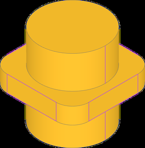

```python
part.faces().filter_by(GeomType.CYLINDER)
```

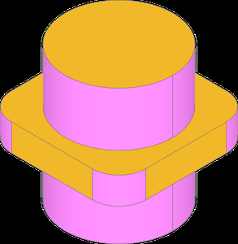

All Edges Circle

In this complete bearing block, we want to add joints for the bearings. These should be located in the counterbore recess.
One way to locate the joints is by finding faces with centers located where the joints need to be located. Filtering for
faces with only circular edges selects the counterbore faces that meet the joint criteria.

<!-- PDF page 309 -->

Setup

```python
from build123d import *
```

```python
with BuildPart() as part:
```

```python
    with BuildSketch() as s:
```

```python
        Rectangle(115, 50)
        with Locations((5 / 2, 0)):
```

```python
            SlotOverall(90, 12, mode=Mode.SUBTRACT)
    extrude(amount=15)
```

```python
    with BuildSketch(Plane.XZ.offset(50 / 2)) as s3:
```

```python
        with Locations((-115 / 2 + 26, 15)):
```

```python
            SlotOverall(42 + 2 * 26 + 12, 2 * 26, rotation=90)
    zz = extrude(amount=-12)
    split(bisect_by=Plane.XY)
    edgs = part.part.edges().filter_by(Axis.Y).group_by(Axis.X)[-2]
    fillet(edgs, 9)
```

```python
    with Locations(zz.faces().sort_by(Axis.Y)[0]):
```

```python
        with Locations((42 / 2 + 6, 0)):
```

```python
            CounterBoreHole(24 / 2, 34 / 2, 4)
    mirror(about=Plane.XZ)
```

```python
    with BuildSketch() as s4:
```

```python
        RectangleRounded(115, 50, 6)
    extrude(amount=80, mode=Mode.INTERSECT)
    # fillet does not work right, mode intersect is safer
```

```python
    with BuildSketch(Plane.YZ) as s4:
```

```python
        with BuildLine() as bl:
            l1 = Line((0, 0), (18 / 2, 0))
            l2 = PolarLine(l1 @ 1, 8, 60, length_mode=LengthMode.VERTICAL)
            l3 = Line(l2 @ 1, (0, 8))
            mirror(about=Plane.YZ)
        make_face()
    extrude(amount=115 / 2, both=True, mode=Mode.SUBTRACT)
```

```python
    faces = part.faces().filter_by(
```

```python
        lambda f: all(e.geom_type == GeomType.CIRCLE for e in f.edges())
    )
    for i, f in enumerate(faces):
```

```python
        RigidJoint(f"bearing_bore_{i}", joint_location=f.center_location)
```

Axis and Plane

Filtering by an Axis will select faces perpendicular to the axis. Likewise filtering by Plane will select faces parallel to
the plane.

<!-- PDF page 310 -->

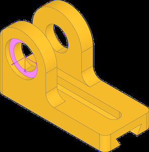

Setup

```python
from build123d import *
```

```python
with BuildPart() as part:
```

```python
    Box(1, 1, 1)
```

```python
part.faces().filter_by(Axis.Z)
part.faces().filter_by(Plane.XY)
```

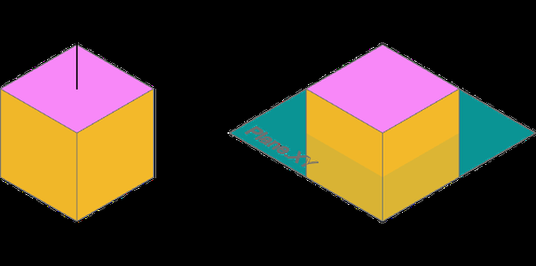

<!-- PDF page 311 -->

It might be useful to filter by an Axis or Plane in other ways. A lambda can be used to accomplish this with feature
properties or methods. Here, we are looking for faces where the dot product of face normal and either the axis direction
or the plane normal is about to 0. The result is faces parallel to the axis or perpendicular to the plane.

```python
part.faces().filter_by(lambda f: abs(f.normal_at().dot(Axis.Z.direction) < 1e-6)
part.faces().filter_by(lambda f: abs(f.normal_at().dot(Plane.XY.z_dir)) < 1e-6)
```

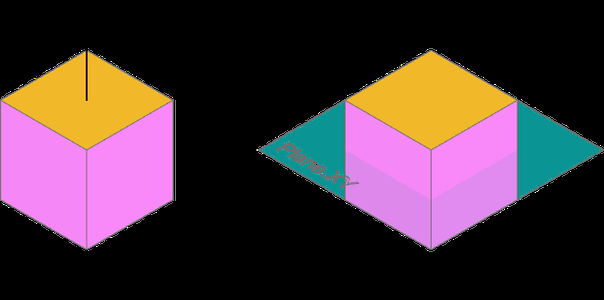

Inner Wire Count

This motor bracket imported from a step file needs joints for adding to an assembly. Joints for the M3 clearance holes
were already found by using the cylindrical face’s axis of rotation, but the motor bore and slots need specific placement.
The motor bore can be found by filtering for faces with 5 inner wires, sorting for the desired face, and then filtering for
the specific inner wire by radius.

• bracket STEP model: nema-17-bracket.step

Setup

```python
from build123d import *
```

```python
bracket = import_step(os.path.join(working_path, "nema-17-bracket.step"))
faces = bracket.faces()
```

```python
motor_mounts = faces.filter_by(GeomType.CYLINDER).filter_by(lambda f: f.radius == 3.3/2)
for i, f in enumerate(motor_mounts):
    location = f.axis_of_rotation.location
    RigidJoint(f"motor_m3_{i}", bracket, joint_location=location)
```

<!-- PDF page 312 -->

```python
motor_face = faces.filter_by(lambda f: len(f.inner_wires()) == 5).sort_by(Axis.X)[-1]
motor_bore = motor_face.inner_wires().edges().filter_by(lambda e: e.radius == 16).edge()
location = Location(motor_bore.arc_center, motor_bore.normal() * 90, Intrinsic.YXZ)
RigidJoint(f"motor", bracket, joint_location=location)
```

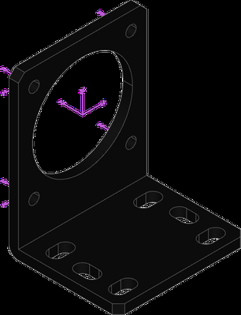

Linear joints for the slots are appropriate for mating flexibility, but require more than a single location. The slot arc
centers can be used for creating a linear joint axis and range. To do that we can filter for faces with 6 inner wires, sort
for and select the top face, and then filter for the circular edges of the inner wires.

```python
mount_face = faces.filter_by(lambda f: len(f.inner_wires()) == 6).sort_by(Axis.Z)[-1]
mount_slots = mount_face.inner_wires().edges().filter_by(GeomType.CIRCLE)
joint_edges = [
```

```python
    Line(mount_slots[i].arc_center, mount_slots[i + 1].arc_center)
    for i in range(0, len(mount_slots), 2)
]
for i, e in enumerate(joint_edges):
```

```python
    LinearJoint(f"mount_m4_{i}", bracket, axis=Axis(e), linear_range=(0, e.length / 2))
```

<!-- PDF page 313 -->


Nested Filters

Filters can be nested to specify features by characteristics other than their own, like child properties. Here we want to
chamfer the mating edges of the D bore and square shaft. A way to do this is first looking for faces with only 2 line
edges among the inner wires. The nested filter captures the straight edges, while the parent filter selects faces based on
the count. Then, from those faces, we filter for the wires with any line edges.

Setup

```python
from build123d import *
```

```python
with BuildPart() as part:
```

```python
    Cylinder(15, 2, align=(Align.CENTER, Align.CENTER, Align.MIN))
    with BuildSketch():
```

```python
        RectangleRounded(10, 10, 2.5)
    extrude(amount=15)
```

```python
    with BuildSketch():
```

```python
        Circle(2.5)
        Rectangle(4, 5, mode=Mode.INTERSECT)
    extrude(amount=15, mode=Mode.SUBTRACT)
```

```python
    with GridLocations(20, 0, 2, 1):
```

```python
        Hole(3.5 / 2)
```

```python
    faces = part.faces().filter_by(
```

<!-- PDF page 314 -->

```python
                                                                      (continued from previous page)
        lambda f: len(f.inner_wires().edges().filter_by(GeomType.LINE)) == 2
    )
    wires = faces.wires().filter_by(
```

```python
        lambda w: any(e.geom_type == GeomType.LINE for e in w.edges())
    )
    chamfer(wires.edges(), 0.5)
```

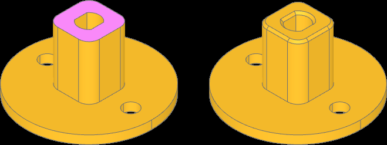

Shape Properties

Selected features can be quickly filtered by feature properties. First, we filter by interior and exterior edges using the
Edge is interior property to apply different fillets accordingly. Then the Face is_circular_* properties are used
to highlight the resulting fillets.

```python
from build123d import *
from ocp_vscode import *
```

```python
with BuildPart() as open_box_builder:
```

```python
    Box(20, 20, 5)
    offset(amount=-2, openings=open_box_builder.faces().sort_by(Axis.Z)[-1])
    inside_edges = open_box_builder.edges().filter_by(Edge.is_interior)
    fillet(inside_edges, 1.5)
    outside_edges = open_box_builder.edges().filter_by(Edge.is_interior, reverse=True)
    fillet(outside_edges, 0.5)
```

```python
open_box = open_box_builder.part
open_box.color = Color(0xEDAE49)
outside_fillets = Compound(open_box.faces().filter_by(Face.is_circular_convex))
outside_fillets.color = Color(0xD1495B)
inside_fillets = Compound(open_box.faces().filter_by(Face.is_circular_concave))
inside_fillets.color = Color(0x00798C)
```

<!-- PDF page 315 -->

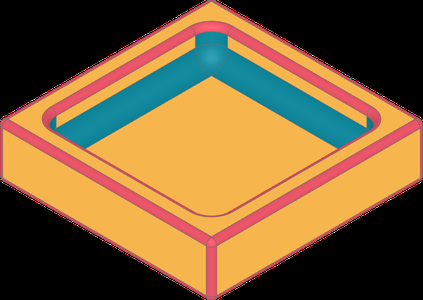

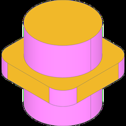

<!-- PDF page 316 -->

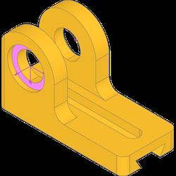

GeomType GeomType

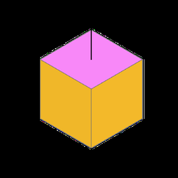

All Edges Circle All Edges Circle

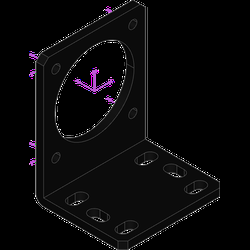

Axis and Plane Axis and Plane

<!-- PDF page 317 -->

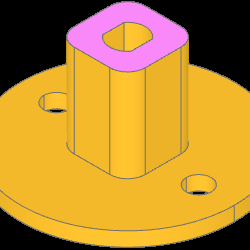

Inner Wire Count Inner Wire Count

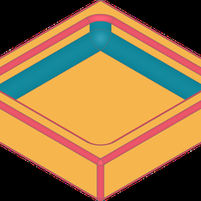

Nested Filters Nested Filters

Shape Properties Shape Properties
