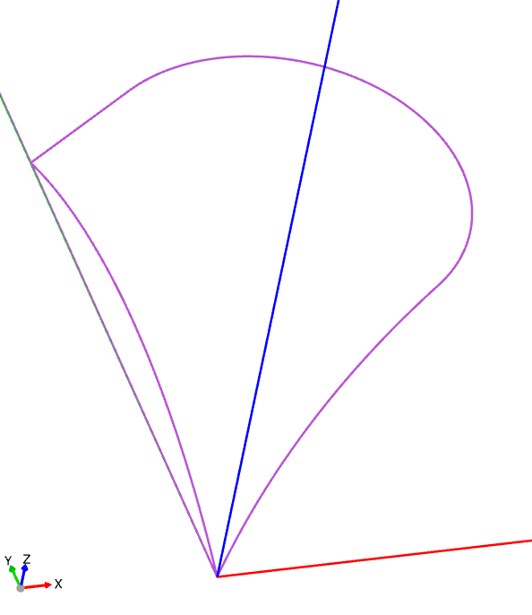
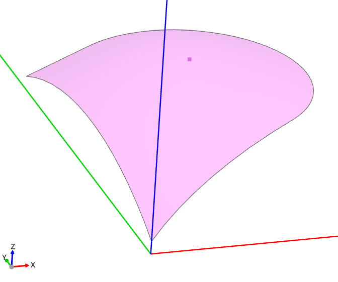
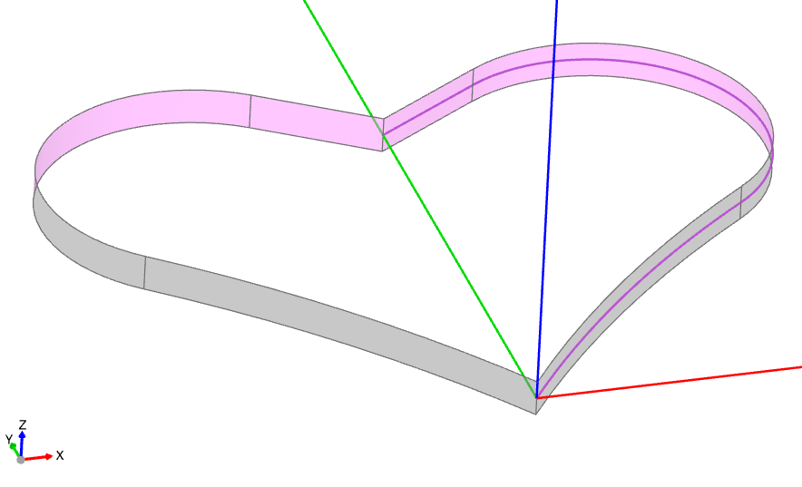
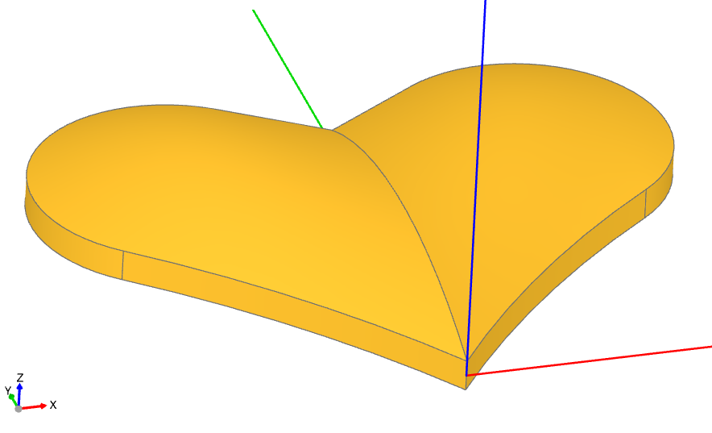

# Tutorial: Heart Token (Basics)

> Converted to Markdown from the official build123d ReadTheDocs PDF. PDF page markers and local extracted-image links are included for traceability. Some line wrapping reflects the PDF layout.
<!-- PDF page 225 -->

Tutorial: Heart Token (Basics)

This hands-on tutorial introduces the fundamentals of surface modeling by building a heart-shaped token from a small
set of non-planar faces. We’ll create non-planar surfaces, mirror them, add side faces, and assemble a closed shell into
a solid.

As described in the topology_ section, a BREP model consists of vertices, edges, faces, and other elements that define
the boundary of an object. When creating objects with non-planar faces, it is often more convenient to explicitly create
the boundary faces of the object. To illustrate this process, we will create the following game token:

Useful  Face   creation methods   include  make_surface(),   make_bezier_surface(),   and
make_surface_from_array_of_points(). See the Surface Modeling overview for the full list.

In this case, we’ll use the make_surface method, providing it with the edges that define the perimeter of the surface
and a central point on that surface.

To create the perimeter, we’ll define the perimeter edges. Since the heart is symmetric, we’ll only create half of its
surface here:

```python
from build123d import *
from ocp_vscode import show
```

```python
# Create the edges of one half the heart surface
l1 = JernArc((0, 0), (1, 1.4), 40, -17)
l2 = JernArc(l1 @ 1, l1 % 1, 4.5, 175)
l3 = IntersectingLine(l2 @ 1, l2 % 1, other=Edge.make_line((0, 0), (0, 20)))
```

<!-- PDF page 226 -->

```python
                                                                      (continued from previous page)
l4 = ThreePointArc(l3 @ 1, (0, 0, 1.5) + (l3 @ 1 + l1 @ 0) / 2, l1 @ 0)
heart_half = Wire([l1, l2, l3, l4])
```

Note that l4 is not in the same plane as the other lines; it defines the center line of the heart and archs up off Plane.XY.



In preparation for creating the surface, we’ll define a point on the surface:

```python
# Create a point elevated off the center
surface_pnt = l2.arc_center + (0, 0, 1.5)
```

<!-- PDF page 227 -->

We will then use this point to create a non-planar Face:

```python
# Create the surface from the edges and point
top_right_surface = Pos(Z=0.5) * -Face.make_surface(heart_half, [surface_pnt])
```



Note that the surface was raised up by 0.5 using an Algebra expression with Pos. Also, note that the - in front of Face
simply flips the face normal so that the colored side is up, which isn’t necessary but helps with viewing.

Now that one half of the top of the heart has been created, the remainder of the top and bottom can be created by
mirroring:

```python
# Use the mirror method to create the other top and bottom surfaces
top_left_surface = top_right_surface.mirror(Plane.YZ)
bottom_right_surface = top_right_surface.mirror(Plane.XY)
bottom_left_surface = -top_left_surface.mirror(Plane.XY)
```

The sides of the heart are going to be created by extruding the outside of the perimeter as follows:

```python
# Create the left and right sides
left_wire = Wire([l3, l2, l1])
left_side = Pos(Z=-0.5) * Shell.extrude(left_wire, (0, 0, 1))
```

<!-- PDF page 228 -->

```python
                                                                      (continued from previous page)
right_side = left_side.mirror(Plane.YZ)
```



With the top, bottom, and sides, the complete boundary of the object is defined. We can now put them together, first
into a Shell and then into a Solid:

```python
# Put all of the faces together into a Shell/Solid
heart = Solid(
```

```python
    Shell(
        [
            top_right_surface,
            top_left_surface,
            bottom_right_surface,
            bottom_left_surface,
            left_side,
            right_side,
        ]
    )
)
```

<!-- PDF page 229 -->



Note

When creating a Solid from a Shell, the Shell must be “water-tight,” meaning it should have no holes. For ob-
jects with complex Edges, it’s best practice to reuse Edges in adjoining Faces whenever possible to avoid slight
mismatches that can create openings.

Finally, we’ll create the frame around the heart as a simple extrusion of a planar shape defined by the perimeter of the
heart and merge all of the components together:

```python
# Build a frame around the heart
with BuildPart() as heart_token:
```

```python
    with BuildSketch() as outline:
```

```python
        with BuildLine():
```

```python
            add(l1)
            add(l2)
            add(l3)
            Line(l3 @ 1, l1 @ 0)
        make_face()
        mirror(about=Plane.YZ)
        center = outline.sketch
        offset(amount=2, kind=Kind.INTERSECTION)
        add(center, mode=Mode.SUBTRACT)
    extrude(amount=2, both=True)
    add(heart)
```

```python
heart_token.part.color = "Red"
```

```python
show(heart_token)
```

<!-- PDF page 230 -->

Note that an additional planar line is used to close l1 and l3 so a Face can be created. The offset() function defines
the outside of the frame as a constant distance from the heart itself.

Summary

In this tutorial, we’ve explored surface modeling techniques to create a non-planar heart-shaped object using build123d.
By utilizing methods from the Face class, such as make_surface(), we constructed the perimeter and central point
of the surface. We then assembled the complete boundary of the object by creating the top, bottom, and sides, and
combined them into a Shell and eventually a Solid. Finally, we added a frame around the heart using the offset()
function to maintain a constant distance from the heart.

Next steps

Continue to Tutorial: Spitfire Wing with Gordon Surface for an advanced example using make_gordon_surface()
to create a Supermarine Spitfire wing.
